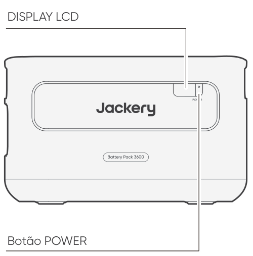
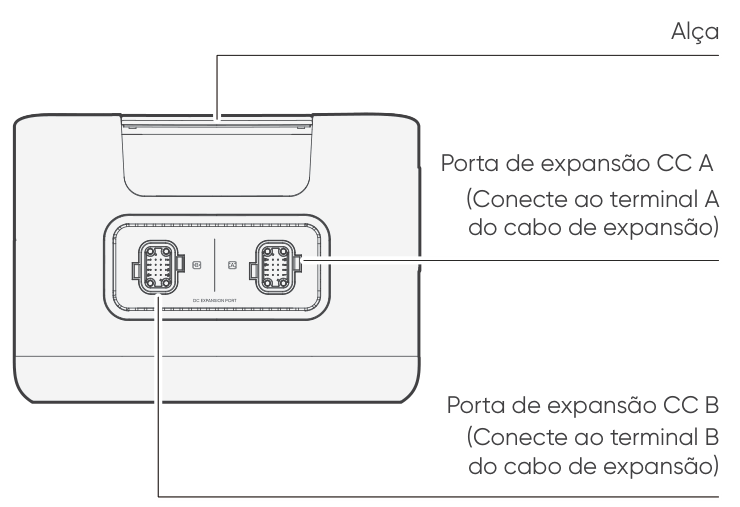
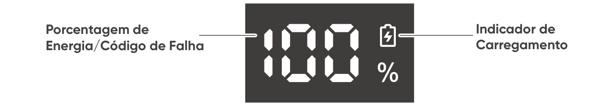
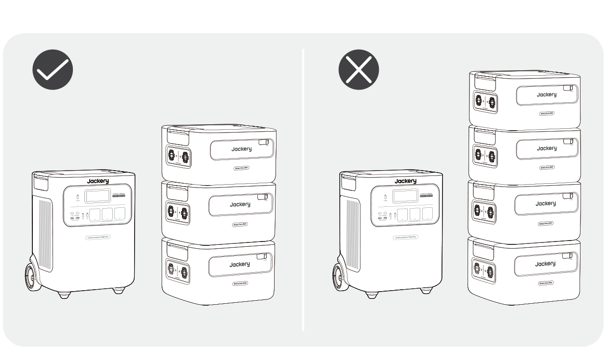

<strong>IMPORTANTE</strong>

Parabéns pela sua nova Jackery Battery Pack 3600. Leia este manual atentamente antes de usar o produto, especialmente as precauções relevantes, para garantir o uso adequado. Mantenha este manual em um local acessível para consultas frequentes.

Em conformidade com leis e regulamentos, o direito de interpretação final deste documento e de todos os documentos relacionados a este produto pertence à Empresa.

Observe que não serão fornecidas notificações adicionais em caso de atualização, revisão ou encerramento.

# INFORMAÇÕES IMPORTANTES DE SEGURANÇA

Ao usar este produto, devem ser seguidas as precauções básicas de segurança, incluindo:

<ul class="simple">
<li>
Leia todas as instruções antes de usar este produto.
</li>
<li>
É necessária supervisão rigorosa ao usar este produto perto de crianças para reduzir o risco.
</li>
<li>
O uso de acessórios recomendados ou vendidos por fabricantes não profissionais pode causar risco de choque elétrico.
</li>
<li>
Quando o produto não estiver em uso, desconecte o plugue de alimentação da tomada do produto.
</li>
<li>
Não desmonte o produto, pois isso pode levar a riscos imprevisíveis, como incêndio, explosão ou choque elétrico.
</li>
<li>
Não use o produto com cabos ou plugues danificados, nem com cabos de saída danificados, pois isso pode causar choque elétrico.
</li>
<li>
Carregue o produto em um local bem ventilado e não obstrua a ventilação de nenhuma forma.
</li>
<li>
Guarde o produto em um local ventilado e seco para evitar choque elétrico causado por chuva ou água.
</li>
<li>
Não exponha o produto ao fogo ou a altas temperaturas (sob luz solar direta ou dentro de um veículo sob calor intenso), pois isso pode causar acidentes como incêndio e explosão.
</li>
<li>
Se este produto for armazenado por um longo período (3 a 6 meses) com a bateria descarregada, ele pode se tornar não recarregável.
</li>
</ul>

# SIGNIFICADO DOS SÍMBOLOS

<figure aria-label="Símbolo / Significado" class="hb-symbol-signal-composition" data-component-id="HB-TABLE-SYMBOL-SIGNAL"><table class="hb-symbol-signal-table"><colgroup><col class="hb-symbol-signal-col-label"/><col class="hb-symbol-signal-col-meaning"/></colgroup><thead><tr><th class="hb-symbol-signal-label-heading" scope="col">
Símbolo
</th><th class="hb-symbol-signal-meaning-heading" scope="col">
Significado
</th></tr></thead><tbody><tr><td class="hb-symbol-signal-label-cell">⚠AVISO</td><td class="hb-symbol-signal-meaning-cell">
Práticas perigosas que podem resultar em lesões graves, morte e/ou danos materiais.
</td></tr><tr><td class="hb-symbol-signal-label-cell">⚠CUIDADO</td><td class="hb-symbol-signal-meaning-cell">
Práticas perigosas que podem resultar em lesões pessoais e/ou danos materiais.
</td></tr><tr><td class="hb-symbol-signal-label-cell">⚠NOTA</td><td class="hb-symbol-signal-meaning-cell">
Práticas perigosas que podem resultar em danos ao equipamento, perda de dados, deterioração do desempenho ou resultados imprevistos.
</td></tr><tr><td class="hb-symbol-signal-label-cell">⚠DICA</td><td class="hb-symbol-signal-meaning-cell">
Complementa informações importantes ou dicas de operação no texto.
</td></tr></tbody></table></figure>

<figure aria-label="Símbolo / Significado" class="hb-symbol-pair-composition" data-component-id="HB-TABLE-SYMBOL-ICON">

<table class="hb-symbol-panel-table"><colgroup><col class="hb-symbol-col-icon"/><col class="hb-symbol-col-meaning"/></colgroup><thead><tr><th class="hb-symbol-icon-heading" scope="col">
<strong>Símbolo</strong>
</th><th class="hb-symbol-meaning-heading" scope="col">
<strong>Significado</strong>
</th></tr></thead><tbody><tr><td class="hb-symbol-icon"></td><td class="hb-symbol-meaning">
Símbolos de Advertência e Cuidado. Deve ser lido para alertar sobre potenciais perigos ou riscos.
</td></tr><tr><td class="hb-symbol-icon"></td><td class="hb-symbol-meaning">
Leia o manual do usuário antes de operar.
</td></tr><tr><td class="hb-symbol-icon"></td><td class="hb-symbol-meaning">
Não desmonte o produto.
</td></tr><tr><td class="hb-symbol-icon"></td><td class="hb-symbol-meaning">
Mantenha o produto longe de fogo.
</td></tr></tbody></table>

<table class="hb-symbol-panel-table"><colgroup><col class="hb-symbol-col-icon"/><col class="hb-symbol-col-meaning"/></colgroup><thead><tr><th class="hb-symbol-icon-heading" scope="col">
<strong>Símbolo</strong>
</th><th class="hb-symbol-meaning-heading" scope="col">
<strong>Significado</strong>
</th></tr></thead><tbody><tr><td class="hb-symbol-icon"></td><td class="hb-symbol-meaning">
Mantenha fora do alcance de crianças.
</td></tr><tr><td class="hb-symbol-icon"></td><td class="hb-symbol-meaning">
Este símbolo indica que há uma bateria de íons de lítio (Li-ion) dentro do produto e que ela deve ser descartada ou reciclada corretamente.
</td></tr><tr><td class="hb-symbol-icon"></td><td class="hb-symbol-meaning">
Este símbolo indica que o produto não deve ser descartado como lixo doméstico e deve ser encaminhado a um ponto de coleta designado para reciclagem. O descarte e a reciclagem adequados podem ajudar a proteger o meio ambiente. Para obter mais informações sobre o descarte e a reciclagem deste produto, entre em contato com a autoridade local, o serviço de coleta ou o revendedor.
</td></tr><tr><td class="hb-symbol-icon"></td><td class="hb-symbol-meaning">
As baterias e os acumuladores não devem ser descartados junto com o lixo doméstico. Como consumidor, você é legalmente obrigado a descartar todas as baterias e acumuladores em pontos de coleta designados, independentemente de conterem substâncias perigosas. Devolva as baterias e acumuladores usados a um ponto de coleta local, centro de reciclagem ou ao revendedor onde foram comprados. O descarte adequado garante a reciclagem ambientalmente responsável e evita danos potenciais à saúde humana e ao meio ambiente.
</td></tr></tbody></table>

</figure>

# CONTEÚDO DA EMBALAGEM

<figure aria-label="CONTEÚDO DA EMBALAGEM" class="hb-inbox-composition" data-card-count="3" data-component-id="HB-SPECIAL-INBOX" data-inbox-variant="three-card-responsive"><ol class="hb-inbox-grid"><li class="hb-inbox-card" data-item-number="1">

<strong>Jackery Battery Pack 3600</strong>

</li><li class="hb-inbox-card" data-item-number="2">

<strong>Cabo de expansão</strong>

</li><li class="hb-inbox-card" data-item-number="3">

Manual do usuário

</li></ol></figure>

# VISÃO GERAL DO PRODUTO

<section id="front-view">
<h2>VISTA FRONTAL</h2>

</section>

<section id="left-side-view">
<h2>VISTA DO LADO ESQUERDO</h2>

</section>

# DISPLAY LCD

<figure aria-label="DISPLAY LCD" class="hb-reference-composition hb-reference-lcd-descriptions" data-component-id="HB-TABLE-REFERENCE" data-component-variant="lcd-descriptions" tabindex="0"><table class="hb-reference-table"><tbody><tr><td>
Porcentagem de Energia/Código de Falha
</td><td>

O visor mostra a porcentagem atual de energia.

Quando o sistema falhar, o código de falha correspondente F0-FF será exibido. Se o código FF aparecer, remova as cargas e o produto poderá se recuperar sozinho. Caso contrário, entre em contato com o Suporte ao Cliente Jackery. Caso apareça qualquer outro código, entre em contato com o Suporte ao Cliente.

</td></tr><tr><td>
Indicador de Carregamento
</td><td>
O indicador acende durante o carregamento e apaga quando a carga está completa.
</td></tr></tbody></table></figure>

# OPERAÇÕES

<section id="power-on-off">
<h2>LIGAR/DESLIGAR</h2>
<figure class="hb-operation-figure hb-operation-layout-status-right hb-base-art-live-copy" data-component-id="HB-SPECIAL-OPERATION" data-operation-id="main-power" data-source-fragment-sha256="92c69582a231b46fa49a7d4e043f472deb86a4d6df127044a4853d66b38e6b0e" data-web-base-art-ref="power_native" data-web-presentation-mode="base-art-live-copy" data-web-replace-key="operation.main-power">

3s

<strong>ON</strong>

Pressione uma vez

<strong>Apagado</strong>

Pressione e segure por 3 s

</figure>
<table class="manual-callout-table" style="width:100%; border-collapse:collapse; margin:0 0 16px 0;"><tbody><tr><td class="manual-callout-label" style="width:16%; border:1px solid #000; padding:6px 8px; vertical-align:top;">
<strong>NOTA</strong>
</td><td class="manual-callout-body" style="border:1px solid #000; padding:6px 8px; vertical-align:top;">
Quando o Jackery Battery Pack 3600 é usado com o Jackery Explorer 3600 Plus, você pode controlar o estado de energia (ligado ou desligado) do Battery Pack 3600 por meio do botão POWER principal do Jackery Explorer 3600 Plus.

O produto será desligado automaticamente se não for carregado ou se nenhuma carga estiver conectada por 2 horas.

</td></tr></tbody></table></section>

<section id="lcd-display-on-off">
<h2>LIGA/DESLIGA DO VISOR LCD</h2>

Ao pressionar o botão POWER principal ou ao carregar o produto, o visor LCD fica iluminado. Ao pressioná-lo novamente, o visor LCD será desligado.

</section>

# CONEXÕES

Até 5 conjuntos desses produtos podem ser usados com o Jackery Explorer 3600 Plus para atender à necessidade de maior capacidade.

<table class="manual-callout-table" style="width:100%; border-collapse:collapse; margin:0 0 16px 0;"><tbody><tr><td class="manual-callout-label" style="width:16%; border:1px solid #000; padding:6px 8px; vertical-align:top;">
<strong>CUIDADO</strong>
</td><td class="manual-callout-body" style="border:1px solid #000; padding:6px 8px; vertical-align:top;">
Certifique-se de que todos os produtos estejam desligados antes de conectar o Jackery Explorer 3600 Plus ao Jackery Battery Pack 3600.

Para garantir o funcionamento adequado do produto, certifique-se de que as entradas e saídas de ar em ambos os lados estejam desobstruídas. Deixe pelo menos 0,66 pé (≈200 mm) de espaço entre as aberturas de ventilação e quaisquer objetos para permitir a dissipação adequada de calor.

</td></tr></tbody></table>

<figure class="hb-reference-figure hb-base-art-live-copy" data-component-id="HB-SPECIAL-REFERENCE-FIGURE" data-reference-id="clearance" data-source-fragment-sha256="c15f2a25589bddd91b56939e3f419003595b7758d40b4648e7fefd640ff013d7" data-web-base-art-ref="clearance_native" data-web-presentation-mode="base-art-live-copy" data-web-replace-key="reference.clearance">

≥0,66 ft (≈200 mm)≥0,66 ft (≈200 mm)

</figure>

<table class="manual-callout-table" style="width:100%; border-collapse:collapse; margin:0 0 16px 0;"><tbody><tr><td class="manual-callout-label" style="width:16%; border:1px solid #000; padding:6px 8px; vertical-align:top;">
<strong>Notas</strong>
</td><td class="manual-callout-body" style="border:1px solid #000; padding:6px 8px; vertical-align:top;">
A exibição do ícone  na tela LCD (Jackery Explorer 3600 Plus) significa uma conexão bem-sucedida entre a bateria externa e o Jackery Explorer 3600 Plus.

Ao usar o produto, não empilhe mais de três baterias externas em uma única torre para evitar que a torre caia e cause ferimentos.

Por favor, não empilhe o produto sobre o Jackery Explorer 3600 Plus.

</td></tr></tbody></table>

<figure class="hb-reference-figure hb-base-art-live-copy" data-component-id="HB-SPECIAL-REFERENCE-FIGURE" data-reference-id="locking" data-source-fragment-sha256="45b90b00091d0f87cd8977b7a315d701fa6404b00180c1021a2d8818b83fe745" data-web-base-art-ref="locking_native" data-web-presentation-mode="base-art-live-copy" data-web-replace-key="reference.locking">

<strong>Bloquear</strong><strong>Desbloquear</strong>1212

</figure>

# SOLUÇÃO DE PROBLEMAS

Se qualquer um dos seguintes códigos de falha aparecer, siga as ações corretivas listadas para resolver o problema. Se a falha persistir, entre em contato com o Suporte ao Cliente da Jackery.

<figure aria-label="Código de erro / Medidas corretivas" class="hb-troubleshooting-composition" data-component-id="HB-TABLE-TROUBLESHOOTING" tabindex="0"><table class="hb-troubleshooting-table"><colgroup><col class="hb-troubleshooting-col-code"/><col class="hb-troubleshooting-col-measures"/></colgroup><thead><tr><th class="hb-troubleshooting-code" scope="col">
Código de erro
</th><th class="hb-troubleshooting-measures" scope="col">
Medidas corretivas
</th></tr></thead><tbody><tr><td class="hb-troubleshooting-code">
F0
</td><td class="hb-troubleshooting-measures">
Reinicie o produto.
</td></tr><tr><td class="hb-troubleshooting-code">
F1, F2
</td><td class="hb-troubleshooting-measures">
Entre em contato com o Suporte ao Cliente da Jackery.
</td></tr><tr><td class="hb-troubleshooting-code">
F3
</td><td class="hb-troubleshooting-measures">
Reinicie o produto.
</td></tr><tr><td class="hb-troubleshooting-code">
F4
</td><td class="hb-troubleshooting-measures">
Conecte o produto a cargas para descarregar a bateria até que a falha desapareça.
</td></tr><tr><td class="hb-troubleshooting-code">
F5
</td><td class="hb-troubleshooting-measures">
Carregue o produto por painéis solares ou tomada de parede CA até que a falha desapareça.
</td></tr><tr><td class="hb-troubleshooting-code">
F6-F9, FA, FC, FE
</td><td class="hb-troubleshooting-measures">
Entre em contato com o Suporte ao Cliente da Jackery.
</td></tr><tr><td class="hb-troubleshooting-code">
FF
</td><td class="hb-troubleshooting-measures">
Coloque o produto em um ambiente com temperatura adequada e aguarde até que a falha desapareça.
</td></tr></tbody></table></figure>

# CARREGANDO

<section id="charging-via-ac-wall-outlet">
<h2>CARREGAMENTO POR MEIO DE TOMADA CA</h2>

Ao carregar pela tomada, este produto deve ser usado com o Jackery Explorer 3600 Plus.

<table class="manual-callout-table" style="width:100%; border-collapse:collapse; margin:0 0 16px 0;"><tbody><tr><td class="manual-callout-label" style="width:16%; border:1px solid #000; padding:6px 8px; vertical-align:top;">
<strong>AVISO</strong>
</td><td class="manual-callout-body" style="border:1px solid #000; padding:6px 8px; vertical-align:top;">
Certifique-se de que todos os produtos estejam desligados antes de conectar o Jackery Explorer 3600 Plus ao Jackery Battery Pack 3600.
</td></tr></tbody></table>
</section>

<section id="charging-via-solar-panels-sold-separately">
<h2>CARREGAMENTO VIA PAINÉIS SOLARES (VENDIDO SEPARADAMENTE)</h2>

Carregue seu produto com painéis solares e Jackery Explorer 3600 Plus conforme mostrado na figura abaixo. Consulte o manual do usuário do Jackery Explorer 3600 Plus para obter mais informações.

</section>

# Armazenamento

Armazene o produto em local limpo, seco e com ventilação adequada. Temperatura e umidade de armazenamento:

<ul class="simple">
<li>
1 mês: -20°C a 45°C (0-60%UR)
</li>
<li>
3 meses: 0°C a 45°C (0-60% UR)
</li>
<li>
12 meses: 0°C a 25°C (0-60% UR)
</li>
</ul>

Se este produto for armazenado por um longo período (de 3 a 6 meses) com a bateria descarregada, ele pode se tornar impossível de recarregar. Para evitar isso e manter a saúde da bateria, recomenda-se verificar e recarregar o produto a cada três meses e realizar um ciclo completo de carga e descarga pelo menos uma vez a cada 6 a 12 meses.

# ESPECIFICAÇÕES

## INFORMAÇÕES GERAIS

<figure aria-label="INFORMAÇÕES GERAIS" class="hb-spec-table-composition"><table class="hb-spec-table manual-table manual-spec-table"><colgroup><col class="hb-spec-col-label"/><col class="hb-spec-col-value"/></colgroup>
<tbody>
<tr>
<th class="hb-spec-label manual-spec-label" scope="row">Nome do produto</th>
<td class="hb-spec-value manual-spec-value">Jackery Battery Pack 3600</td>
</tr>
<tr>
<th class="hb-spec-label manual-spec-label" scope="row">Nº do modelo</th>
<td class="hb-spec-value manual-spec-value">JBP-3600A</td>
</tr>
<tr>
<th class="hb-spec-label manual-spec-label" scope="row">Capacidade</th>
<td class="hb-spec-value manual-spec-value">80 Ah/44,8 Vcc (3584 Wh)</td>
</tr>
<tr>
<th class="hb-spec-label manual-spec-label" scope="row">Química da célula</th>
<td class="hb-spec-value manual-spec-value">LiFePO₄</td>
</tr>
<tr>
<th class="hb-spec-label manual-spec-label" scope="row">Peso</th>
<td class="hb-spec-value manual-spec-value">Aproximadamente 55,1 lbs/25 kg</td>
</tr>
<tr>
<th class="hb-spec-label manual-spec-label" scope="row">Dimensões</th>
<td class="hb-spec-value manual-spec-value">14,8 x 12,5 x 9,0 in/37,5 x 31,7 x 22,9 cm</td>
</tr>
<tr>
<th class="hb-spec-label manual-spec-label" scope="row">Vida útil de ciclos</th>
<td class="hb-spec-value manual-spec-value">6000 ciclos até 70%+ de capacidade</td>
</tr>
<tr>
<th class="hb-spec-label manual-spec-label" scope="row">Código IEC</th>
<td class="hb-spec-value manual-spec-value">IFpR41/136[14S4P]M/-20+40/90</td>
</tr>
</tbody>
</table></figure>

## PORTAS DE ENTRADA/SAÍDA

<figure aria-label="PORTAS DE ENTRADA/SAÍDA" class="hb-spec-table-composition"><table class="hb-spec-table manual-table manual-spec-table"><colgroup><col class="hb-spec-col-label"/><col class="hb-spec-col-value"/></colgroup>
<tbody>
<tr>
<th class="hb-spec-label manual-spec-label" scope="row">Porta de expansão CC (entrada)</th>
<td class="hb-spec-value manual-spec-value">36,4 V–50,4 V ⎓ 60 A máx.</td>
</tr>
<tr>
<th class="hb-spec-label manual-spec-label" scope="row">Porta de expansão CC (Saída)</th>
<td class="hb-spec-value manual-spec-value">36,4 V-50,4 V⎓100 A máx.</td>
</tr>
</tbody>
</table></figure>

## TEMPERATURA AMBIENTE DE OPERAÇÃO

<figure aria-label="TEMPERATURA AMBIENTE DE OPERAÇÃO" class="hb-spec-table-composition"><table class="hb-spec-table manual-table manual-spec-table"><colgroup><col class="hb-spec-col-label"/><col class="hb-spec-col-value"/></colgroup>
<tbody>
<tr>
<th class="hb-spec-label manual-spec-label" scope="row">Temperatura de carregamento</th>
<td class="hb-spec-value manual-spec-value">-20°C a 45°C</td>
</tr>
<tr>
<th class="hb-spec-label manual-spec-label" scope="row">Temperatura de descarga</th>
<td class="hb-spec-value manual-spec-value">-20°C a 45°C</td>
</tr>
</tbody>
</table></figure>

# GARANTIA

<figure aria-label="GARANTIA" class="hb-warranty-intro-composition" data-component-id="HB-WARRANTY-LEAD">

<strong>A garantia é fornecida apenas a clientes que comprarem no Site oficial da Jackery, em plataformas de terceiros com marca Jackery ou por meio de revendedores locais autorizados.</strong>

* O período e os termos da garantia podem variar de acordo com as leis e regulamentações locais e com os distribuidores autorizados.

</figure>

<section class="warranty-section" id="limited-warranty">
<h2>Garantia Limitada</h2>
<figure aria-label="Garantia Limitada" class="hb-warranty-card" data-component-id="HB-WARRANTY-SECTION" data-warranty-card-index="1">
A Jackery garante ao comprador consumidor original que o produto Jackery estará livre de defeitos de fabricação e material sob uso normal do consumidor durante o período de garantia aplicável identificado na seção "Período de Garantia" abaixo, sujeito às exclusões estabelecidas abaixo.

Esta declaração de garantia estabelece a obrigação de garantia total e exclusiva da Jackery. Não assumiremos, nem autorizaremos qualquer pessoa a assumir em nosso nome, qualquer outra responsabilidade relacionada à venda de nossos produtos.
</figure>
</section>

<section class="warranty-section warranty-years" id="warranty-period">
<h2>Período de Garantia</h2>
<figure aria-label="Período de Garantia" class="hb-warranty-period-card" data-component-id="HB-WARRANTY-YEARS">

3
<strong class="hb-warranty-years-unit">ANOS</strong><strong class="hb-warranty-period-label">Garantia Padrão</strong>

O período de garantia padrão do Jackery Battery Pack 3600 é de 36 meses. Em todos os casos, o período de garantia é contado a partir da data de compra pelo comprador consumidor original. O comprovante de compra do primeiro comprador consumidor, ou outra prova documental razoável, é necessário para estabelecer a data de início do período de garantia.

2
<strong class="hb-warranty-years-unit">ANOS</strong><strong class="hb-warranty-period-label">Garantia Estendida</strong>

Para ativar a extensão da garantia, registre seu produto online ou entre em contato com nossa equipe de atendimento ao cliente em <a class="reference external" href="mailto:hello.eu@jackery.com">hello.eu@jackery.com</a> para estender o período de garantia padrão.

</figure>
</section>

<section class="warranty-section" id="repair-or-replacement">
<h2>Reparo ou substituição</h2>
<figure aria-label="Reparo ou substituição" class="hb-warranty-card" data-component-id="HB-WARRANTY-SECTION" data-warranty-card-index="3">
A Jackery reparará ou substituirá (às custas da Jackery) qualquer produto Jackery que apresente falha de funcionamento durante o período de garantia aplicável devido a defeito de fabricação ou de material. O produto reparado/substituído assume o período de garantia remanescente a partir da data original de compra.
</figure>
</section>

<section class="warranty-section" id="limited-to-original-consumer-buyer">
<h2>Limitado ao comprador consumidor original</h2>
<figure aria-label="Limitado ao comprador consumidor original" class="hb-warranty-card" data-component-id="HB-WARRANTY-SECTION" data-warranty-card-index="4">
A garantia dos produtos Jackery é limitada ao comprador consumidor original e não é transferível a qualquer proprietário subsequente.
</figure>
</section>

<section class="warranty-section" id="exclusions">
<h2>Exclusões</h2>
<figure aria-label="Exclusões" class="hb-warranty-card" data-component-id="HB-WARRANTY-SECTION" data-warranty-card-index="5">
A garantia da Jackery não se aplica a:
<ul class="simple">
<li>
Uso indevido, abuso, modificação, danos causados por acidente ou uso para qualquer finalidade diferente do uso normal do consumidor conforme autorizado na documentação atual do produto da Jackery.
</li>
<li>
Tentativa de reparo por qualquer pessoa que não seja uma assistência autorizada.
</li>
<li>
Qualquer produto adquirido por meio de leilão online.
</li>
<li>
A garantia da Jackery não se aplica à célula da bateria, a menos que ela seja totalmente carregada por você dentro de sete dias após a compra do produto e, posteriormente, pelo menos uma vez a cada 6 meses.
</li>
</ul></figure>
</section>

<section class="warranty-section" id="interpretation-rights">
<h2>Direitos de interpretação</h2>
<figure aria-label="Direitos de interpretação" class="hb-warranty-card" data-component-id="HB-WARRANTY-SECTION" data-warranty-card-index="6">
A Jackery reserva-se o direito de interpretação final da política de pós-venda ao cliente acima.
</figure>
</section>

# EU REGULATIONS

<section id="red-declaration-of-conformity">
<h2>RED DECLARATION OF CONFORMITY</h2>

Shenzhen Hello Tech Energy Co., Ltd. hereby declares that this Jackery Battery Pack 3600 with Bluetooth and Wi-Fi JBP-3600A is in compliance with the essential requirements and other relevant provisions of the RED Directive 2014/53/EU. The full text of the EU declaration of conformity is available at the following internet address:

<a class="reference external" href="https://de.jackery.com/pages/user-guides">https://de.jackery.com/pages/user-guides</a>

</section>

<section id="manufacturer">
<h2>MANUFACTURER</h2>

SHENZHEN HELLO TECH ENERGY CO., LTD.

Address: F2-3, Bldg. 7, Jiaanda Science and technology industrial park factory, the east side of Huafan Road, Tongsheng Community, Dalang Street, Longhua District, Shenzhen, Guangdong, China

+86 400 668 9293

<a class="reference external" href="mailto:sales@hello-tech.com">sales@hello-tech.com</a>

www.hello-tech.com

</section>
