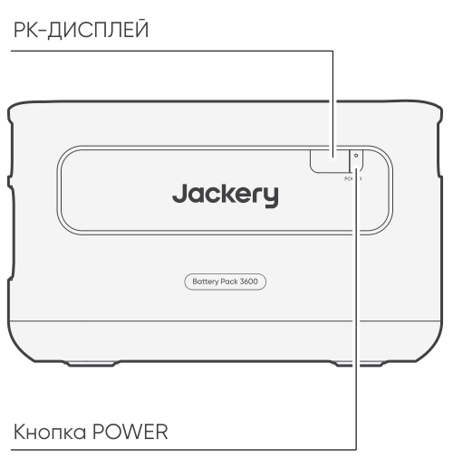
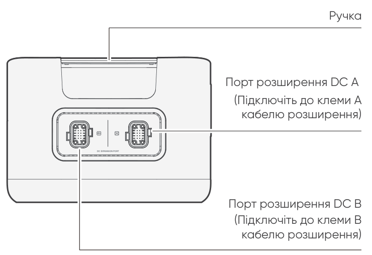

<strong>ВАЖЛИВО</strong>

Вітаємо з новим Jackery Battery Pack 3600. Будь ласка, уважно прочитайте це керівництво перед використанням продукту, особливо відповідні застереження для забезпечення правильного використання. Зберігайте цей посібник у легкодоступному місці для частого звернення.

Відповідно до законів і нормативних актів, право остаточного тлумачення цього документа та всіх пов’язаних документів цього продукту належить Компанії.

Зверніть увагу, що у разі будь-яких оновлень, змін або припинення додаткових повідомлень не буде.

# ВАЖЛИВА ІНФОРМАЦІЯ З БЕЗПЕКИ

Під час використання цього продукту слід дотримуватися основних заходів безпеки, зокрема:

<ul class="simple">
<li>
Будь ласка, прочитайте всі інструкції перед використанням цього продукту.
</li>
<li>
Під час використання цього продукту поблизу дітей потрібен пильний нагляд, щоб зменшити ризик.
</li>
<li>
Ризик ураження електричним струмом може виникнути, якщо використовувати аксесуари, рекомендовані або продані непрофесійними виробниками продукції.
</li>
<li>
Коли продукт не використовується, будь ласка, від’єднайте вилку живлення від розетки продукту.
</li>
<li>
Не розбирайте продукт, оскільки це може призвести до непередбачуваних ризиків, таких як пожежа, вибух або ураження електричним струмом.
</li>
<li>
Не використовуйте продукт із пошкодженими шнурами або вилками, або пошкодженими вихідними кабелями, оскільки це може спричинити ураження електричним струмом.
</li>
<li>
Заряджайте продукт у добре провітрюваному місці та не обмежуйте вентиляцію будь-яким чином.
</li>
<li>
Будь ласка, розміщуйте продукт у провітрюваному та сухому місці, щоб уникнути потрапляння дощу та води, що може спричинити ураження електричним струмом.
</li>
<li>
Не піддавайте продукт впливу вогню або високої температури (під прямими сонячними променями або в автомобілі під час сильної спеки), що може спричинити такі аварії, як пожежа та вибух.
</li>
<li>
Якщо цей продукт зберігається протягом тривалого часу (3-6 місяців) з повністю розрядженим акумулятором, він може стати непридатним для заряджання.
</li>
</ul>

# ЗНАЧЕННЯ СИМВОЛІВ

<figure aria-label="Символ / Значення" class="hb-symbol-signal-composition" data-component-id="HB-TABLE-SYMBOL-SIGNAL"><table class="hb-symbol-signal-table"><colgroup><col class="hb-symbol-signal-col-label"/><col class="hb-symbol-signal-col-meaning"/></colgroup><thead><tr><th class="hb-symbol-signal-label-heading" scope="col">
Символ
</th><th class="hb-symbol-signal-meaning-heading" scope="col">
Значення
</th></tr></thead><tbody><tr><td class="hb-symbol-signal-label-cell">⚠ПОПЕРЕДЖЕННЯ</td><td class="hb-symbol-signal-meaning-cell">
Небезпечні практики, які можуть призвести до серйозних травм, смерті та/або майнової шкоди.
</td></tr><tr><td class="hb-symbol-signal-label-cell">⚠УВАГА</td><td class="hb-symbol-signal-meaning-cell">
Небезпечні дії, які можуть призвести до травм та/або майнової шкоди.
</td></tr><tr><td class="hb-symbol-signal-label-cell">⚠ПРИМІТКА</td><td class="hb-symbol-signal-meaning-cell">
Небезпечні дії, які можуть призвести до пошкодження обладнання, втрати даних, погіршення продуктивності або непередбачуваних результатів.
</td></tr><tr><td class="hb-symbol-signal-label-cell">⚠ПОРАДА</td><td class="hb-symbol-signal-meaning-cell">
Доповнює важливу інформацію або операційні підказки в тексті.
</td></tr></tbody></table></figure>

<figure aria-label="Символ / Значення" class="hb-symbol-pair-composition" data-component-id="HB-TABLE-SYMBOL-ICON">

<table class="hb-symbol-panel-table"><colgroup><col class="hb-symbol-col-icon"/><col class="hb-symbol-col-meaning"/></colgroup><thead><tr><th class="hb-symbol-icon-heading" scope="col">
<strong>Символ</strong>
</th><th class="hb-symbol-meaning-heading" scope="col">
<strong>Значення</strong>
</th></tr></thead><tbody><tr><td class="hb-symbol-icon"></td><td class="hb-symbol-meaning">
Попереджувальні та застережні символи. Обов’язково прочитайте, щоб попередити користувачів про потенційні небезпеки або ризики.
</td></tr><tr><td class="hb-symbol-icon"></td><td class="hb-symbol-meaning">
Перед використанням прочитайте посібник користувача.
</td></tr><tr><td class="hb-symbol-icon"></td><td class="hb-symbol-meaning">
Не розбирайте продукт.
</td></tr><tr><td class="hb-symbol-icon"></td><td class="hb-symbol-meaning">
Тримайте продукт подалі від вогню.
</td></tr></tbody></table>

<table class="hb-symbol-panel-table"><colgroup><col class="hb-symbol-col-icon"/><col class="hb-symbol-col-meaning"/></colgroup><thead><tr><th class="hb-symbol-icon-heading" scope="col">
<strong>Символ</strong>
</th><th class="hb-symbol-meaning-heading" scope="col">
<strong>Значення</strong>
</th></tr></thead><tbody><tr><td class="hb-symbol-icon"></td><td class="hb-symbol-meaning">
Тримайте подалі від дітей.
</td></tr><tr><td class="hb-symbol-icon"></td><td class="hb-symbol-meaning">
Цей символ вказує, що всередині продукту є літій-іонна (Li-ion) батарея, яку необхідно утилізувати або переробити належним чином.
</td></tr><tr><td class="hb-symbol-icon"></td><td class="hb-symbol-meaning">
Цей символ вказує, що продукт не можна утилізувати разом із побутовими відходами, і його слід передати до спеціалізованого пункту збору для переробки. Правильна утилізація та переробка допомагають захистити довкілля. Для отримання додаткової інформації щодо утилізації та переробки цього продукту зверніться до місцевої громади, служби утилізації або дилера.
</td></tr><tr><td class="hb-symbol-icon"></td><td class="hb-symbol-meaning">
Батареї та акумулятори не можна утилізувати разом із побутовими відходами. Як споживач, ви зобов'язані за законом утилізувати всі батареї та акумулятори у спеціально відведених пунктах збору, незалежно від того, чи містять вони небезпечні речовини. Будь ласка, повертайте використані батарейки та акумулятори до місцевих пунктів збору, центрів переробки або до продавця, у якого їх було придбано. Правильна утилізація забезпечує екологічно безпечну переробку та запобігає потенційній шкоді для здоров’я людей і довкілля.
</td></tr></tbody></table>

</figure>

# КОМПЛЕКТАЦІЯ

<figure aria-label="КОМПЛЕКТАЦІЯ" class="hb-inbox-composition" data-card-count="3" data-component-id="HB-SPECIAL-INBOX" data-inbox-variant="three-card-responsive"><ol class="hb-inbox-grid"><li class="hb-inbox-card" data-item-number="1">

<strong>Акумуляторний блок Jackery 3600</strong>

</li><li class="hb-inbox-card" data-item-number="2">

<strong>Кабель розширення</strong>

</li><li class="hb-inbox-card" data-item-number="3">

Керівництво користувача

</li></ol></figure>

# ОГЛЯД ПРОДУКТУ

<section id="front-view">
<h2>ВИГЛЯД СПЕРЕДУ</h2>

</section>

<section id="left-side-view">
<h2>ВИГЛЯД З ЛІВОГО БОКУ</h2>

</section>

# РК-ДИСПЛЕЙ

<figure aria-label="РК-ДИСПЛЕЙ" class="hb-reference-composition hb-reference-lcd-descriptions" data-component-id="HB-TABLE-REFERENCE" data-component-variant="lcd-descriptions" tabindex="0"><table class="hb-reference-table"><tbody><tr><td>
Рівень заряду/Код несправності
</td><td>

На дисплеї відображається поточний рівень заряду.

У разі збою відображається відповідний код несправності F0-FF. Якщо з'являється код FF, від'єднайте навантаження, і продукт відновиться самостійно. Якщо ні, зверніться до служби підтримки Jackery. У разі появи будь-якого іншого коду зверніться до нашої служби підтримки.

</td></tr><tr><td>
Індикатор заряджання
</td><td>
Індикатор відображається під час заряджання та зникає після повного заряджання.
</td></tr></tbody></table></figure>

# ОПЕРАЦІЇ

<section id="power-on-off">
<h2>УВІМКНЕННЯ/ВИМКНЕННЯ</h2>
<figure class="hb-operation-figure hb-operation-layout-status-right hb-base-art-live-copy" data-component-id="HB-SPECIAL-OPERATION" data-operation-id="main-power" data-source-fragment-sha256="760b3a1216d7f64b093e0f79abc322941289efbae4c963b21337b55cba15ed21" data-web-base-art-ref="power_native" data-web-presentation-mode="base-art-live-copy" data-web-replace-key="operation.main-power">

3s

<strong>Увімкнено</strong>

Натисніть один раз

<strong>Вимкнено</strong>

Натисніть і утримуйте протягом 3 с

</figure>
<table class="manual-callout-table" style="width:100%; border-collapse:collapse; margin:0 0 16px 0;"><tbody><tr><td class="manual-callout-label" style="width:16%; border:1px solid #000; padding:6px 8px; vertical-align:top;">
<strong>ПРИМІТКА</strong>
</td><td class="manual-callout-body" style="border:1px solid #000; padding:6px 8px; vertical-align:top;">
Під час використання з Jackery Explorer 3600 Plus ви можете керувати станом живлення (увімкнено або вимкнено) Jackery Battery Pack 3600 за допомогою основної кнопки POWER на Jackery Explorer 3600 Plus.

Продукт автоматично вимкнеться, якщо протягом 2 годин не виконується заряджання або не підключено жодного навантаження.

</td></tr></tbody></table></section>

<section id="lcd-display-on-off">
<h2>УВІМКНЕННЯ/ВИМКНЕННЯ РК-ДИСПЛЕЯ</h2>

Коли ви натискаєте основну кнопку POWER або під час заряджання продукту, РК-дисплей підсвічується. Коли ви натискаєте її ще раз, РК-дисплей вимикається.

</section>

# ПІДКЛЮЧЕННЯ

Разом із Jackery Explorer 3600 Plus можна використовувати до 5 таких пристроїв, щоб задовольнити зростаючі потреби в ємності.

<table class="manual-callout-table" style="width:100%; border-collapse:collapse; margin:0 0 16px 0;"><tbody><tr><td class="manual-callout-label" style="width:16%; border:1px solid #000; padding:6px 8px; vertical-align:top;">
<strong>УВАГА</strong>
</td><td class="manual-callout-body" style="border:1px solid #000; padding:6px 8px; vertical-align:top;">
Перш ніж підключати Jackery Explorer 3600 Plus до Jackery Battery Pack 3600, переконайтеся, що всі пристрої вимкнено.

Щоб забезпечити належну роботу продукту, переконайтеся, що повітрозабірні та витяжні отвори з обох боків не заблоковані. Залиште щонайменше 0,66 фута (≈200 мм) простору між вентиляційними отворами та будь-якими об'єктами для належного розсіювання тепла.

</td></tr></tbody></table>

<figure class="hb-reference-figure hb-base-art-live-copy" data-component-id="HB-SPECIAL-REFERENCE-FIGURE" data-reference-id="clearance" data-source-fragment-sha256="16eb3e3230e0822fe9251b6f0298e2bf31ed399a64bdb128c68ba4607225d3a3" data-web-base-art-ref="clearance_native" data-web-presentation-mode="base-art-live-copy" data-web-replace-key="reference.clearance">

≥0,66 фута (≈200 мм)≥0,66 фута (≈200 мм)

</figure>

<table class="manual-callout-table" style="width:100%; border-collapse:collapse; margin:0 0 16px 0;"><tbody><tr><td class="manual-callout-label" style="width:16%; border:1px solid #000; padding:6px 8px; vertical-align:top;">
<strong>ПРИМІТКИ</strong>
</td><td class="manual-callout-body" style="border:1px solid #000; padding:6px 8px; vertical-align:top;">
Відображення значка  на РК-екрані (Jackery Explorer 3600 Plus) означає успішне з'єднання між акумуляторним блоком і Jackery Explorer 3600 Plus.

Під час використання продукту не складайте більше трьох акумуляторних блоків в одну вежу, щоб запобігти падінню та травмуванню.

Будь ласка, не ставте продукт зверху на Jackery Explorer 3600 Plus.

</td></tr></tbody></table>

<figure class="hb-reference-figure hb-base-art-live-copy" data-component-id="HB-SPECIAL-REFERENCE-FIGURE" data-reference-id="locking" data-source-fragment-sha256="3755f181c89dcfc5c41d0b52ea85b92e3d6b198486ab2f9ace2b075da5d78463" data-web-base-art-ref="locking_native" data-web-presentation-mode="base-art-live-copy" data-web-replace-key="reference.locking">

<strong>Блокування</strong><strong>Розблокування</strong>1212

</figure>

# УСУНЕННЯ НЕСПРАВНОСТЕЙ

Якщо з’являється будь-який із наведених нижче кодів помилок, дотримуйтесь зазначених коригувальних дій для усунення проблеми. Якщо несправність не зникає, зверніться до служби підтримки клієнтів Jackery.

<figure aria-label="Код помилки / Коригувальні заходи" class="hb-troubleshooting-composition" data-component-id="HB-TABLE-TROUBLESHOOTING" tabindex="0"><table class="hb-troubleshooting-table"><colgroup><col class="hb-troubleshooting-col-code"/><col class="hb-troubleshooting-col-measures"/></colgroup><thead><tr><th class="hb-troubleshooting-code" scope="col">
Код помилки
</th><th class="hb-troubleshooting-measures" scope="col">
Коригувальні заходи
</th></tr></thead><tbody><tr><td class="hb-troubleshooting-code">
F0
</td><td class="hb-troubleshooting-measures">
Перезапустіть продукт.
</td></tr><tr><td class="hb-troubleshooting-code">
F1, F2
</td><td class="hb-troubleshooting-measures">
Зверніться до служби підтримки клієнтів Jackery.
</td></tr><tr><td class="hb-troubleshooting-code">
F3
</td><td class="hb-troubleshooting-measures">
Перезапустіть продукт.
</td></tr><tr><td class="hb-troubleshooting-code">
F4
</td><td class="hb-troubleshooting-measures">
Підключіть продукт до навантаження, щоб розрядити його акумулятор, доки несправність не зникне.
</td></tr><tr><td class="hb-troubleshooting-code">
F5
</td><td class="hb-troubleshooting-measures">
Заряджайте продукт від сонячних панелей або настінної розетки змінного струму, доки несправність не зникне.
</td></tr><tr><td class="hb-troubleshooting-code">
F6-F9, FA, FC, FE
</td><td class="hb-troubleshooting-measures">
Зверніться до служби підтримки клієнтів Jackery.
</td></tr><tr><td class="hb-troubleshooting-code">
FF
</td><td class="hb-troubleshooting-measures">
Розмістіть продукт у середовищі з належною температурою та зачекайте, доки несправність не зникне.
</td></tr></tbody></table></figure>

# ЗАРЯДЖАННЯ

<section id="charging-via-ac-wall-outlet">
<h2>ЗАРЯДЖАННЯ ВІД МЕРЕЖІ ЗМІННОГО СТРУМУ</h2>

Під час заряджання від розетки цей продукт повинен використовуватися разом із Jackery Explorer 3600 Plus.

<table class="manual-callout-table" style="width:100%; border-collapse:collapse; margin:0 0 16px 0;"><tbody><tr><td class="manual-callout-label" style="width:16%; border:1px solid #000; padding:6px 8px; vertical-align:top;">
<strong>ПОПЕРЕДЖЕННЯ</strong>
</td><td class="manual-callout-body" style="border:1px solid #000; padding:6px 8px; vertical-align:top;">
Перш ніж підключати Jackery Explorer 3600 Plus до Jackery Battery Pack 3600, переконайтеся, що всі пристрої вимкнено.
</td></tr></tbody></table>
</section>

<section id="charging-via-solar-panels-sold-separately">
<h2>ЗАРЯДЖАННЯ ВІД СОНЯЧНИХ ПАНЕЛЕЙ (ПРОДАЄТЬСЯ ОКРЕМО)</h2>

Заряджайте ваш продукт за допомогою сонячних панелей і Jackery Explorer 3600 Plus, як показано на рисунку нижче. Будь ласка, зверніться до посібника користувача Jackery Explorer 3600 Plus для отримання додаткової інформації.

</section>

# Зберігання

Зберігайте продукт у сухому чистому місці з належною вентиляцією. Температура та вологість зберігання:

<ul class="simple">
<li>
1 місяць: від -20°C до 45°C (0-60% відносної вологості)
</li>
<li>
3 місяці: від 0°C до 45°C (0-60% відносної вологості)
</li>
<li>
12 місяці: від 0°C до 25°C (0-60% відносної вологості)
</li>
</ul>

Якщо цей продукт зберігається протягом тривалого часу (від 3 до 6 місяців) з повністю розрядженим акумулятором, він може стати непридатним до заряджання. Щоб запобігти цьому та підтримувати стан акумулятора, рекомендується перевіряти та підзаряджати продукт кожні три місяці, а також виконувати повний цикл заряджання та розряджання щонайменше один раз на 6–12 місяців.

# ТЕХНІЧНІ ХАРАКТЕРИСТИКИ

## ЗАГАЛЬНА ІНФОРМАЦІЯ

<figure aria-label="ЗАГАЛЬНА ІНФОРМАЦІЯ" class="hb-spec-table-composition"><table class="hb-spec-table manual-table manual-spec-table"><colgroup><col class="hb-spec-col-label"/><col class="hb-spec-col-value"/></colgroup>
<tbody>
<tr>
<th class="hb-spec-label manual-spec-label" scope="row">Назва продукту</th>
<td class="hb-spec-value manual-spec-value">Акумуляторний блок Jackery 3600</td>
</tr>
<tr>
<th class="hb-spec-label manual-spec-label" scope="row">Номер моделі</th>
<td class="hb-spec-value manual-spec-value">JBP-3600A</td>
</tr>
<tr>
<th class="hb-spec-label manual-spec-label" scope="row">Ємність</th>
<td class="hb-spec-value manual-spec-value">80 А·год / 44,8 В постійного струму (3584 Вт·год)</td>
</tr>
<tr>
<th class="hb-spec-label manual-spec-label" scope="row">Хімічний склад елементів</th>
<td class="hb-spec-value manual-spec-value">LiFePO₄</td>
</tr>
<tr>
<th class="hb-spec-label manual-spec-label" scope="row">Вага</th>
<td class="hb-spec-value manual-spec-value">Приблизно 55,1 фунта / 25 кг</td>
</tr>
<tr>
<th class="hb-spec-label manual-spec-label" scope="row">Розміри</th>
<td class="hb-spec-value manual-spec-value">14,8 x 12,5 x 9,0 дюймів / 37,5 x 31,7 x 22,9 см</td>
</tr>
<tr>
<th class="hb-spec-label manual-spec-label" scope="row">Ресурс циклів</th>
<td class="hb-spec-value manual-spec-value">6000 циклів до збереження 70%+ ємності</td>
</tr>
<tr>
<th class="hb-spec-label manual-spec-label" scope="row">Код IEC</th>
<td class="hb-spec-value manual-spec-value">IFpR41/136[14S4P]M/-20+40/90</td>
</tr>
</tbody>
</table></figure>

## ВХІДНІ/ВИХІДНІ ПОРТИ

<figure aria-label="ВХІДНІ/ВИХІДНІ ПОРТИ" class="hb-spec-table-composition"><table class="hb-spec-table manual-table manual-spec-table"><colgroup><col class="hb-spec-col-label"/><col class="hb-spec-col-value"/></colgroup>
<tbody>
<tr>
<th class="hb-spec-label manual-spec-label" scope="row">Порт розширення DC (вхід)</th>
<td class="hb-spec-value manual-spec-value">36,4 В-50,4 В⎓60A макс.</td>
</tr>
<tr>
<th class="hb-spec-label manual-spec-label" scope="row">Порт розширення постійного струму (вихід)</th>
<td class="hb-spec-value manual-spec-value">36,4–50,4 В постійного струму, макс. 100 А</td>
</tr>
</tbody>
</table></figure>

## РОБОЧА ТЕМПЕРАТУРА НАВКОЛИШНЬОГО СЕРЕДОВИЩА

<figure aria-label="РОБОЧА ТЕМПЕРАТУРА НАВКОЛИШНЬОГО СЕРЕДОВИЩА" class="hb-spec-table-composition"><table class="hb-spec-table manual-table manual-spec-table"><colgroup><col class="hb-spec-col-label"/><col class="hb-spec-col-value"/></colgroup>
<tbody>
<tr>
<th class="hb-spec-label manual-spec-label" scope="row">Температура заряджання</th>
<td class="hb-spec-value manual-spec-value">від -20°C до 45°C</td>
</tr>
<tr>
<th class="hb-spec-label manual-spec-label" scope="row">Температура розряду</th>
<td class="hb-spec-value manual-spec-value">від -20°C до 45°C</td>
</tr>
</tbody>
</table></figure>

# ГАРАНТІЯ

<figure aria-label="ГАРАНТІЯ" class="hb-warranty-intro-composition" data-component-id="HB-WARRANTY-LEAD">

<strong>Ми надаємо гарантію лише клієнтам, які придбали продукцію на офіційному вебсайті Jackery, на сторонніх платформах під брендом Jackery або в місцевих авторизованих дилерів.</strong>

* Гарантійний термін та умови можуть відрізнятися залежно від місцевих законів, нормативних актів і авторизованих дилерів.

</figure>

<section class="warranty-section" id="limited-warranty">
<h2>Обмежена гарантія</h2>
<figure aria-label="Обмежена гарантія" class="hb-warranty-card" data-component-id="HB-WARRANTY-SECTION" data-warranty-card-index="1">
Jackery гарантує первинному кінцевому покупцеві, що продукт Jackery не матиме дефектів матеріалів і виготовлення за умов нормального споживчого використання протягом відповідного гарантійного періоду, визначеного в розділі «Гарантійний період» нижче, з урахуванням наведених нижче виключень.

Ця гарантійна заява визначає повний і виключний обсяг гарантійних зобов’язань Jackery. Ми не беремо на себе і не уповноважуємо будь-яку особу брати на себе від нашого імені будь-які інші зобов’язання у зв’язку з продажем нашої продукції.
</figure>
</section>

<section class="warranty-section warranty-years" id="warranty-period">
<h2>Гарантійний період</h2>
<figure aria-label="Гарантійний період" class="hb-warranty-period-card" data-component-id="HB-WARRANTY-YEARS">

3
<strong class="hb-warranty-years-unit">РОКИ</strong><strong class="hb-warranty-period-label">Стандартна гарантія</strong>

Стандартний гарантійний термін для акумуляторного блоку Jackery 3600 становить 36 місяців. У кожному випадку гарантійний період обчислюється з дати покупки первинним споживачем-покупцем. Для визначення дати початку гарантійного періоду необхідний касовий чек від першого споживача-покупця або інший належний документальний доказ.

2
<strong class="hb-warranty-years-unit">РОКИ</strong><strong class="hb-warranty-period-label">Розширена гарантія</strong>

Щоб активувати розширення гарантії, необхідно зареєструвати продукт онлайн або звернутися до нашої служби підтримки за адресою <a class="reference external" href="mailto:hello.eu@jackery.com">hello.eu@jackery.com</a> для продовження стандартного гарантійного терміну.

</figure>
</section>

<section class="warranty-section" id="repair-or-replacement">
<h2>Ремонт або заміна</h2>
<figure aria-label="Ремонт або заміна" class="hb-warranty-card" data-component-id="HB-WARRANTY-SECTION" data-warranty-card-index="3">
Jackery відремонтує або замінить (за свій рахунок) будь-який продукт Jackery, який вийде з ладу протягом відповідного гарантійного періоду через дефект виготовлення або матеріалу. Відремонтований/замінений продукт успадковує залишок гарантії від початкової дати покупки.
</figure>
</section>

<section class="warranty-section" id="limited-to-original-consumer-buyer">
<h2>Обмеження для первинного споживача-покупця</h2>
<figure aria-label="Обмеження для первинного споживача-покупця" class="hb-warranty-card" data-component-id="HB-WARRANTY-SECTION" data-warranty-card-index="4">
Гарантія на продукт Jackery обмежується первинним споживачем-покупцем і не підлягає передачі будь-якому наступному власнику.
</figure>
</section>

<section class="warranty-section" id="exclusions">
<h2>Виключення</h2>
<figure aria-label="Виключення" class="hb-warranty-card" data-component-id="HB-WARRANTY-SECTION" data-warranty-card-index="5">
Гарантія Jackery не поширюється на:
<ul class="simple">
<li>
Неправильне використання, зловживання, модифікації, пошкодження внаслідок нещасного випадку або використання не за призначенням, відмінним від нормального споживчого використання, дозволеного чинною документацією Jackery.
</li>
<li>
Спроби ремонту будь-ким, окрім авторизованого сервісного центру.
</li>
<li>
Будь-який продукт, придбаний через онлайн-аукціон.
</li>
<li>
Гарантія Jackery не поширюється на акумуляторний елемент, якщо він не був повністю заряджений вами протягом семи днів після покупки продукту та щонайменше один раз кожні 6 місяців після цього.
</li>
</ul></figure>
</section>

<section class="warranty-section" id="interpretation-rights">
<h2>Право тлумачення</h2>
<figure aria-label="Право тлумачення" class="hb-warranty-card" data-component-id="HB-WARRANTY-SECTION" data-warranty-card-index="6">
Jackery залишає за собою право остаточного тлумачення вищезазначеної політики післяпродажного обслуговування.
</figure>
</section>

# EU REGULATIONS

<section id="red-declaration-of-conformity">
<h2>RED DECLARATION OF CONFORMITY</h2>

Shenzhen Hello Tech Energy Co., Ltd. hereby declares that this Jackery Battery Pack 3600 with Bluetooth and Wi-Fi JBP-3600A is in compliance with the essential requirements and other relevant provisions of the RED Directive 2014/53/EU. The full text of the EU declaration of conformity is available at the following internet address:

<a class="reference external" href="https://de.jackery.com/pages/user-guides">https://de.jackery.com/pages/user-guides</a>

</section>

<section id="manufacturer">
<h2>MANUFACTURER</h2>

SHENZHEN HELLO TECH ENERGY CO., LTD.

Address: F2-3, Bldg. 7, Jiaanda Science and technology industrial park factory, the east side of Huafan Road, Tongsheng Community, Dalang Street, Longhua District, Shenzhen, Guangdong, China

+86 400 668 9293

<a class="reference external" href="mailto:sales@hello-tech.com">sales@hello-tech.com</a>

www.hello-tech.com

</section>
