

## Jackery SlimPower H1 取扱説明書

型番：JE-1000E-WH

国内専用/For use only in Japan

<figure class="hb-reference-figure" data-component-id="HB-SPECIAL-REFERENCE-FIGURE" data-reference-id="cover-unit" data-source-fragment-sha256="0aca56979e715fa6d3db98dab85130cdcdb63031f1ce8bb18670a14035f7a6f9">
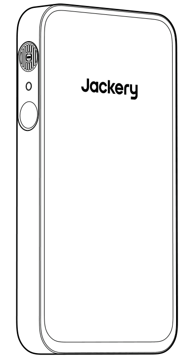
</figure>

写真はイメージです。実際の商品とは異なる場合があります。

お買い上げありがとうございます。

ご使用の前にこの「取扱説明書」をよくお読みのうえ、正しくお使いください。特に「安全上のご注意」は、必ずお読みいただき、安全にお使いください。お読みになったあとは、すぐに取り出せる場所に大切に保管してください。本製品の取扱説明書は随時更新されますので、最新の取扱説明書は公式サイトでご確認ください。

カスタマーサポート: jackery.jp@jackery.com

## 安全上のご注意

ご使用の前にこの「安全上のご注意」をよくお読みのうえ、正しくお使いください。

### 絵表示について

製品を安全に正しくお使いいただき、お客様や他の方々への危害や財産への損害を未然に防止するための表示です。内容をよく理解してから本文をお読みください。

<figure aria-label="絵表示について" class="hb-symbol-signal-composition" data-component-id="HB-TABLE-SYMBOL-SIGNAL"><table class="hb-symbol-signal-table"><colgroup><col class="hb-symbol-signal-col-label"/><col class="hb-symbol-signal-col-meaning"/></colgroup><thead><tr><th class="hb-symbol-signal-label-heading" scope="col">絵表示</th><th class="hb-symbol-signal-meaning-heading" scope="col">説明</th></tr></thead><tbody><tr><td class="hb-symbol-signal-label-cell">⚠警告</td><td class="hb-symbol-signal-meaning-cell">この表示を無視して、誤った取り扱いをすると、人が死亡または重傷を負う可能性が想定される内容を示しています。</td></tr><tr><td class="hb-symbol-signal-label-cell">⚠注意</td><td class="hb-symbol-signal-meaning-cell">この表示を無視して、誤った取り扱いをすると、人が傷害を負う可能性が想定される内容または物的損害の発生が想定される内容を示しています。</td></tr><tr><td class="hb-symbol-signal-label-cell">説明</td><td class="hb-symbol-signal-meaning-cell">この表示を無視して誤った取り扱いをすると、機器の損傷、データの消失、性能の低下、または予期しない動作が発生する可能性があることを示しています。</td></tr><tr><td class="hb-symbol-signal-label-cell">ヒント</td><td class="hb-symbol-signal-meaning-cell">文章内の重要な情報や操作のヒントを補足する内容を示しています。</td></tr></tbody></table></figure>

### 絵表示の説明

<figure aria-label="絵表示の説明" class="hb-symbol-pair-composition" data-component-id="HB-TABLE-SYMBOL-ICON">

<table class="hb-symbol-panel-table"><colgroup><col class="hb-symbol-col-icon"/><col class="hb-symbol-col-meaning"/></colgroup><thead><tr><th class="hb-symbol-icon-heading" scope="col">記号</th><th class="hb-symbol-meaning-heading" scope="col">説明</th></tr></thead><tbody><tr><td class="hb-symbol-icon"></td><td class="hb-symbol-meaning">コンセントから電源プラグを抜く記号</td></tr><tr><td class="hb-symbol-icon"></td><td class="hb-symbol-meaning">製品を分解、改造を禁止する記号</td></tr><tr><td class="hb-symbol-icon"></td><td class="hb-symbol-meaning">製品に濡れた手で触れることを禁止する記号</td></tr><tr><td class="hb-symbol-icon"></td><td class="hb-symbol-meaning">潜在的な危険やリスクについて注意喚起するために、必ずお読みください。</td></tr><tr><td class="hb-symbol-icon"></td><td class="hb-symbol-meaning">操作の前に取扱説明書をお読みください。</td></tr><tr><td class="hb-symbol-icon"></td><td class="hb-symbol-meaning">本製品を火気の近くに置かないでください。</td></tr><tr><td class="hb-symbol-icon"></td><td class="hb-symbol-meaning">小さなお子様の手の届かない場所に保管してください。</td></tr></tbody></table>

<table class="hb-symbol-panel-table"><colgroup><col class="hb-symbol-col-icon"/><col class="hb-symbol-col-meaning"/></colgroup><thead><tr><th class="hb-symbol-icon-heading" scope="col">記号</th><th class="hb-symbol-meaning-heading" scope="col">説明</th></tr></thead><tbody><tr><td class="hb-symbol-icon"></td><td class="hb-symbol-meaning">行為を指示する記号</td></tr><tr><td class="hb-symbol-icon"></td><td class="hb-symbol-meaning">製品を濡らすことを禁止する記号</td></tr><tr><td class="hb-symbol-icon"></td><td class="hb-symbol-meaning">行為を禁止する記号</td></tr><tr><td class="hb-symbol-icon"></td><td class="hb-symbol-meaning"><strong>充電式電池のリサイクルについて</strong> 本機はリサイクル可能な充電池を内蔵しています。この商品を廃棄する場合は、当社のカスタマーサポートにご連絡ください。充電池の取りはずしはお客様自身では行わないでください。</td></tr><tr><td class="hb-symbol-icon"></td><td class="hb-symbol-meaning">このシンボルは、本製品を一般家庭ごみとして廃棄せず、リサイクルのために指定の回収施設に持ち込む必要があることを示しています。適切な廃棄およびリサイクルは、環境保護に役立ちます。本製品の廃棄やリサイクルについての詳細は、お住まいの自治体、廃棄物処理業者、または販売店にお問い合わせください。</td></tr></tbody></table>

</figure>

<table class="manual-callout-table manual-callout-table"><tbody><tr><td class="manual-callout-label">警告</td><td class="manual-callout-body">
火のそばや炎天下の車内、熱器具の周辺など高温（45℃以上）になる場所で使用したり、放置しない発熱や発火、破裂する原因になります。

強い衝撃を与えたり、投げつけたりしない発熱や発火、破裂する原因になります。

水など、液体を入れたり、濡らしたりしない発熱や発火の原因になります。

濡れた手で本体や接続するケーブルを触らない火災や感電の原因になります。

端子部にケーブル以外の金属類を差し込まない発熱や発火の原因になります。

雷が鳴りだしたら、電源プラグにふれない  (充電をしない)感電の原因になります。

各接続端子には確実に差し込む差し込みが不十分だと、発熱したりほこりが付着して火災や感電の原因になります。

接地接続は必ず、電源プラグを電源につなぐ前に行って下さいまた、接地接続を外す場合は、必ず電源プラグを切り離してから行って下さい。
</td></tr></tbody></table>

<table class="manual-callout-table manual-callout-table"><tbody><tr><td class="manual-callout-label">警告</td><td class="manual-callout-body">
万が一、次のような異常が発生したときはすぐに使用をやめる
<ul><li>煙が出ている、異臭がする</li><li>落としたり、破損したとき</li><li>異音がする</li><li>内部に水や異物が入ったとき</li><li>電源コード  (ACアダプター)  が傷んだとき</li></ul>
このような異常が発生したまま使用していると、火災や感電の原因になります。すぐにAC充電ケーブルをコンセントから抜いてください。また、本製品に接続されている機器もすべて外してください。

万が一発煙や発火したら、大量の水で消火して煙が見えなくなるまで本製品を水浸しにしてください。

煙が出なくなることを確認してからカスタマーサポートにご連絡ください。お客様による修理は危険ですので絶対におやめください。

分解、改造しない

故障、発熱、火災·感電の原因になります。

表示された電源電圧以外で使用しない

故障、発熱、火災·感電の原因になります。また、本製品を使用できるのは日本国内のみです。

付属品と本製品が破損した場合は、ご自身で修理をしない
</td></tr></tbody></table>

<table class="manual-callout-table manual-callout-table"><tbody><tr><td class="manual-callout-label">注意</td><td class="manual-callout-body">
本製品の上に物を載せたり、不安定な場所に置かない倒れたり、落ちたりしてけがの原因になります。

データサーバや医療機器など、非常時に不具合が起こると人命 / 財産に重大な危険を及ぼしうる用途でのご使用はお控えください。次のような機器では、万が一使用中に給電ができなくなった場合、人命 / 財産にかかわる被害が想定されます。
<ul><li>医療機器や使用上、生命に関わるような機器</li><li>社会的、公共的に重要な機器など</li><li>重要な事業用機器など</li></ul>
心臓にペースメーカーを装着している方は使用しない ペースメーカーが、本製品の影響を受ける恐れがあります。
</td></tr></tbody></table>

## 使用上のご注意

Jackery SlimPower H1は、定格出力800Wです。通常時で消費電力が800Wまでの機器に給電ができるため、多くの電化製品や端末に対応可能です。ただし、電気モーターを搭載している製品（掃除機、ポンプ、冷蔵庫、電動丸ノコ、エアコン、洗濯機、電子レンジ、ドライヤーなど)は、起動時に「誘導負荷」が発生し、公称電力の3~7倍の電力が必要となります。定格出力800Wは、一定の電力で動く機器への出力可能範囲を指しています。800Wの出力を超えた場合は、電気回路が自動的に調整され、電力が低減、または保護機能が作動し自動で遮断することがあります。

<table class="manual-callout-table manual-callout-table"><tbody><tr><td class="manual-callout-label">ご注意</td><td class="manual-callout-body">
始動電力が出力上限値( 定格出力) を大幅に超える可能性のある製品のご利用や、定格出力を超え給電がストップした製品を繰り返し利用することはポータブル電源のバッテリーが損傷するリスクがありますのでお控えください。
</td></tr></tbody></table>

### ■ 給電に関する注意事項

<ul><li>出力上限値を超える電化製品は使用しないでください。特に、始動電力が公称電力の3～7 倍になる誘導負荷（ポンプ、ヒーター、掃除機、冷蔵庫、エアコン、電気丸ノコなどの電動道具、洗濯機、電子レンジなど）の使用にはご注意ください。</li><li>接続機器の消費電力が本製品の出力範囲内であることをご確認の上、出力ボタンを押してください。</li><li>給電中、機器の制御や環境により、急速充電にならない・給電できない場合があります。</li><li>充電または給電中、ラジオ・チューナー・テレビなどに雑音が入る場合があります。その際は、それらの機器から離してご使用ください。</li></ul>

### ■ 冷蔵庫使用時の重要な注意事項

<ul><li>冷蔵庫コンプレッサーの起動電力は、通常定格電力の3 倍から7 倍の範囲です。本製品のピーク電力容量は1600W で、約1 秒間持続します。接続機器の起動電力が1600W を下回る場合、理論上、本製品はその起動要件をサポートできます。しかし実際には、周囲温度、機器の経年劣化、ブランド固有の制御戦略などの要因により、電力仕様が互換性があるように見えても、過渡的な電流変動によって過負荷保護が作動する可能性があります。最終的な互換性は、実際の動作条件下でのテストによって確認する必要があります。ワクチンやその他の高価値物品の保管に関わる用途では、機器の初回稼働中に安定した電力供給を確保するため、機器を監視することを推奨します。当社は、製品の負荷または起動容量を超えたことによる電力中断、およびそれに起因するいかなる間接的損失についても責任を負いません。</li></ul>

### ■ 使用環境について

<ul><li>本製品は防塵・防水仕様ではありません。ほこり、水、海水などがかからないようご注意ください。</li><li>ほこりの多い場所や高温多湿の場所での充電・使用・放置は避けてください。</li><li>平坦で安定した場所に設置し、不安定な場所に置かないでください。</li><li>本製品の通風孔は、安全上絶対にふさがないでください。各面から5cm 以上スペースを確保してください。</li><li>充電・給電中は本体が温かくなります。周囲に物を置かないでください。</li></ul>

### ■ 接続時の注意事項

<ul><li>ケーブルを接続する際は、まっすぐに差し込んでください。</li><li>抜く際は必ずプラグ部分を持って抜いてください。ケーブルを引っ張ったり折り曲げたりしないでください。</li><li>本製品は接地する必要があります。 誤動作または故障が発生した場合、接地により電流の最小抵抗経路が提供され、感電リスクを低減します。 本製品には、機器接地導体と接地プラグを備えたコードが付属しています。 プラグは、すべての地域の法令に従って適切に設置および接地されたコンセントに接続する必要があります。</li><li>機器接地導体の不適切な接続は、感電の危険を引き起こす可能性があります。製品が適切に接地されているかどうか疑問がある場合は、資格のある電気技師に確認してください。製品に付属のプラグを改造しないでください。コンセントに適合しない場合は、資格のある電気技師に適切なコンセントの設置を依頼してください。</li></ul>

### ■ お手入れについて

<ul><li>本体が汚れた場合は、電源プラグを抜いた状態で、柔らかい布で乾拭きしてください。</li><li>汚れがひどい場合は、水または薄めた中性洗剤で拭き取ってください。</li><li>シンナーやベンジンなどの使用は絶対に使わないでください。</li></ul>

### ■ 入出力・温度・表示に関するご注意

<ul><li>接続機器の入力が本製品の出力上限を超えている場合、自動で電源が遮断されます。</li><li>本機は -20°C~45°C の温度範囲でお使いの機器に電力供給が可能となり、本機の蓄電は-20°C~45°C で行えます。動作温度が上記範囲外にある場合、本製品が温度異常マークが表示され、動作しない可能性があります。温度異常マークが表示された場合は、本製品を2 時間以上、動作温度範囲内の環境に置いてください。</li><li>容量表示は参考値であり、電圧により表示数値と実際の容量に差異が出る場合があります。</li></ul>

## 免責事項

<ul><li>火災、地震、第三者による行為、その他の事故、お客様の故意または過失誤用・誤動作・その他の異常な条件下での使用により生じた損害に関して、当社は一切責任を負いません。</li></ul>

<ul><li>付属品と本製品が破損した場合は、ご自身で修理を行わないでください。ご自身で分解・修理したことにより生じた損害に関し、当社は一切責任を負いません。</li></ul>

<ul><li>保証範囲は利用規約に適用され、記載されていない内容は当社の保証範囲外となります。</li></ul>

<ul><li>取扱説明書の記載事項が遵守されないことにより生じた不適合について当社は責任を負いかねます。</li></ul>

<ul><li>本製品の使用、または使用不能から発生する付随的な損害( 事業利益損失含む)、当社が関与しない接続機器との組み合わせによる誤動作などから生じた損害に関して、当社は一切の責任を負いません。</li></ul>

<ul><li>本製品は病院仕様のシーパップ（CPAP）、エクモ（ECMO）、ペースメーカなど、身の安全に関わる医療救急機械の電源としての使用、または、消費電力の大きい設備、例えば核施設設備、スペースシャトル製造などの使用は推薦されません。上記設備の使用後、火災、機器故障など個人安全を脅かす事故の責任を取りません。</li></ul>

## 同梱品

<figure aria-label="同梱品" class="hb-inbox-composition" data-card-count="4" data-component-id="HB-SPECIAL-INBOX" data-inbox-variant="responsive-card-grid"><ol class="hb-inbox-grid"><li class="hb-inbox-card" data-item-number="1">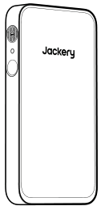

本体

</li><li class="hb-inbox-card" data-item-number="2">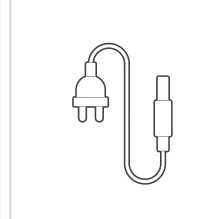

AC 充電ケーブル

</li><li class="hb-inbox-card" data-item-number="3">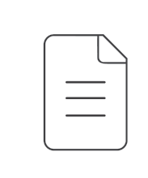

取扱説明書

</li><li class="hb-inbox-card" data-item-number="4">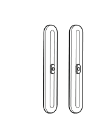

スタンド

</li></ol></figure>

※   付属品を故障、紛失等してしまった場合はカスタマーサポートまでご連絡ください。

※   AC充電ケーブルは、同梱されている本体以外には使用しないでください。

※   シガーソケット充電ケーブルは別売りです。Jackery公式サイトよりご購入いただけます。サポートが必要な場合は、Jackeryカスタマーサポートまでお問い合わせください。

本機の仕様および外観は、改善のため予告なく変更することがあります。

## 各部の名称

<figure class="hb-reference-figure hb-base-art-live-copy" data-component-id="HB-SPECIAL-REFERENCE-FIGURE" data-reference-id="overview" data-source-fragment-sha256="d4721bd5274f96de8b2b81c4c49bf22c49646c0c929452341a4cad9aec264f26" data-web-base-art-ref="overview" data-web-presentation-mode="base-art-live-copy">

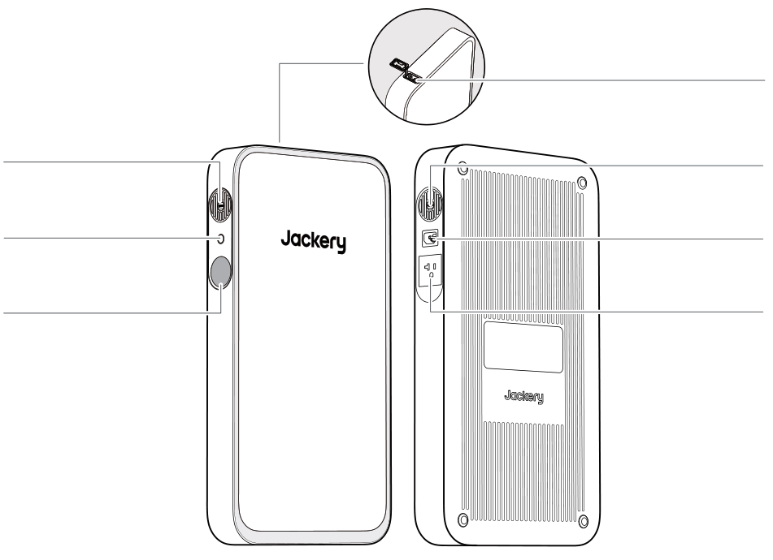DC 拡張ポート端子DC入力: 36.8V-56V⎓最大24A，最大500W DC出力: 36.8V-56V⎓最大24Aサーモベントサーモベント主電源ボタンLCD ディスプレイAC 入力ポート100V-120V~ 50/60Hz, 最大15AAC 出力ポート100V~50/60Hz，8A，800W

</figure>

## 液晶画面

<figure class="hb-reference-figure" data-component-id="HB-SPECIAL-REFERENCE-FIGURE" data-reference-id="lcd-map" data-source-fragment-sha256="baa878efe5159ee977ed5733830aa0e5655901740bccab6b17c73b4617c8abe4">
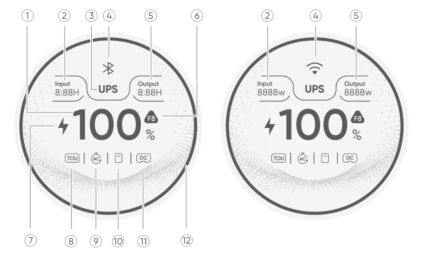
</figure>

<figure aria-label="液晶画面" class="hb-lcd-table-composition" data-component-id="HB-TABLE-LCD-ICON" tabindex="0"><table class="hb-lcd-icon-table"><colgroup><col class="hb-lcd-col-number"/><col class="hb-lcd-col-icon"/><col class="hb-lcd-col-name"/><col class="hb-lcd-col-description"/></colgroup><tbody><tr><td class="hb-lcd-number">1</td><td class="hb-lcd-icon"></td><td class="hb-lcd-name">バッテリー残量(%)</td><td class="hb-lcd-description">バッテリー残量を表示します。</td></tr><tr><td class="hb-lcd-number">2</td><td class="hb-lcd-icon">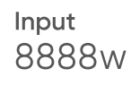</td><td class="hb-lcd-name">入力電力表示 充電残り時間</td><td class="hb-lcd-description">入力電力と残り充電時間を交互に表示します。</td></tr><tr><td class="hb-lcd-number">3</td><td class="hb-lcd-icon"></td><td class="hb-lcd-name">UPS 機能</td><td class="hb-lcd-description">点灯時：給電と充電を同時に行う「パススルー充電」状態にあります。停電時には家庭用電源からポータブル電源の切り替え時間が10ミリ秒で行われます。消灯時：パススルー充電状態ではありません。</td></tr><tr><td class="hb-lcd-number">4</td><td class="hb-lcd-icon">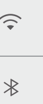</td><td class="hb-lcd-name">Wi-Fi Bluetooth</td><td class="hb-lcd-description">オン： Wi-Fi接続済 点滅： Wi-Fi接続待機中 オフ： Wi-Fi未接続 オン： Bluetooth接続済 点滅： Bluetooth接続待機中 オフ： Bluetooth未接続</td></tr><tr><td class="hb-lcd-number">5</td><td class="hb-lcd-icon"></td><td class="hb-lcd-name">消費電力 バッテリー使用可能時間</td><td class="hb-lcd-description">出力電力と接続機器の使用可能時間を表示します。</td></tr><tr><td class="hb-lcd-number">6</td><td class="hb-lcd-icon"></td><td class="hb-lcd-name">エラーコード</td><td class="hb-lcd-description">製品エラーが発生しました。詳細については、トラブルシューティングのセクションを参照してください。</td></tr><tr><td class="hb-lcd-number">7</td><td class="hb-lcd-icon"></td><td class="hb-lcd-name">充電インジケーター</td><td class="hb-lcd-description">オン: Jackery SlimPower H1は充電中です。オフ: Jackery SlimPower H1は充電していません。</td></tr><tr><td class="hb-lcd-number">8</td><td class="hb-lcd-icon"></td><td class="hb-lcd-name">TOU モード</td><td class="hb-lcd-description">オン：TOU（時間帯別料金）モードが有効になります（デフォルトのバックアップSOC：60%）。ピーク時間帯に、バッテリー残量がバックアップSOCを超えている場合、本製品はバッテリー放電を優先し、ピーク時の電気料金を削減します。オフピーク時間帯には、系統電源からバッテリーを充電し、ピークカットと谷埋めを実現します。オフ：TOUモードは無効になります。デバイスはTOU制御を行わず、デフォルトの電力供給および充電ロジックに基づいて動作します。本モードはJackeryアプリから有効／無効を設定できます。デバイスの電源がオフの場合でも、設定は保持されます。</td></tr><tr><td class="hb-lcd-number">9</td><td class="hb-lcd-icon">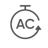</td><td class="hb-lcd-name">AC 出力遅延</td><td class="hb-lcd-description">オン：AC出力遅延モードが有効です。 AC壁コンセントに接続されている場合、本製品はバイパスモードで放電します。 AC入力がない場合、本製品は放電を一時停止し、LCDのカウントダウンを開始します。カウントダウン終了後、手動で停止されていなければ放電が再開されます。オフ：AC出力遅延モードが無効です。AC出力遅延時間は、Jackeryアプリから設定できます。</td></tr><tr><td class="hb-lcd-number">10</td><td class="hb-lcd-icon"></td><td class="hb-lcd-name">バッテリーパックインジケータ</td><td class="hb-lcd-description">オン：Jackery Battery Packが接続されています。オフ：Jackery Battery Packが切断されています。</td></tr><tr><td class="hb-lcd-number">11</td><td class="hb-lcd-icon"></td><td class="hb-lcd-name">DC 入力</td><td class="hb-lcd-description">オン：Jackery DC Input Moduleが接続されています。オフ：Jackery DC Input Moduleは接続されていません。</td></tr><tr><td class="hb-lcd-number">12</td><td class="hb-lcd-icon"></td><td class="hb-lcd-name">バッテリーレベルパーセントタグ</td><td class="hb-lcd-description">オレンジの円は残バッテリーレベルを示しています。</td></tr></tbody></table></figure>

## 使い方

### 主電源ボタン/オフ

<figure class="hb-reference-figure hb-base-art-live-copy" data-component-id="HB-SPECIAL-REFERENCE-FIGURE" data-reference-id="power" data-source-fragment-sha256="b65de94eebd3fd4a57e0da1112549de67099b8371ab79be8a53a6c955f696c32" data-web-base-art-ref="power" data-web-presentation-mode="base-art-live-copy">

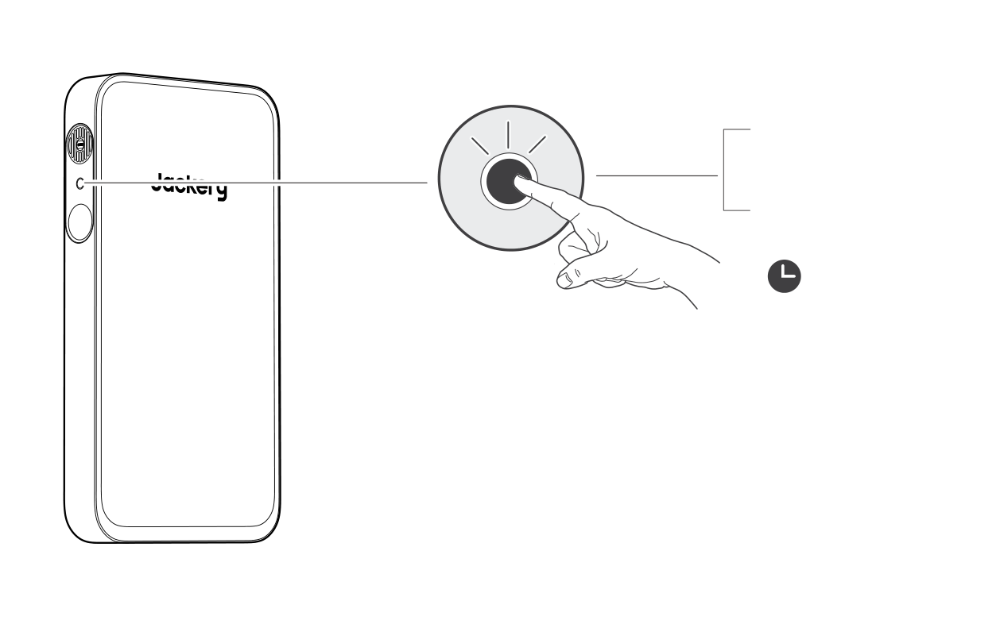オフ1回押すオン3秒間長押し

</figure>

本製品のデフォルトの待機時間は12時間です(充電または放電がない場合、12時間後に自動的にシャットダウンします)。待機時間はJackeryアプリで設定できます。交流20W未満の低消費電力機器へ給電する場合は、本モードをオフにしてください。

### LCDスクリーン

<figure aria-label="LCDスクリーン" class="hb-lcd-mode-composition" data-component-id="HB-TABLE-LCD-MODE">
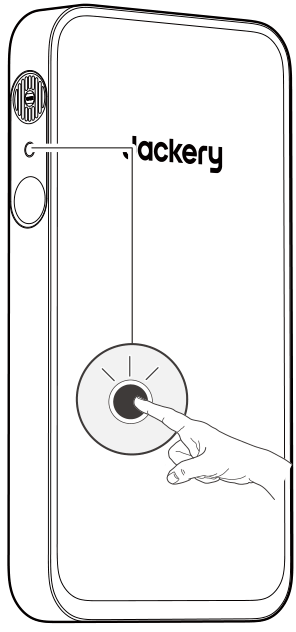

<table class="hb-lcd-mode-table"><colgroup><col class="hb-lcd-mode-col-state"/><col class="hb-lcd-mode-col-action"/><col class="hb-lcd-mode-col-copy"/></colgroup><tbody><tr><td class="hb-lcd-mode-state" rowspan="3">一時点灯</td><td class="hb-lcd-mode-action">オンにする</td><td class="hb-lcd-mode-copy">主電源ボタンを押すか、充電入力がある場合。</td></tr><tr><td class="hb-lcd-mode-action">オフにする</td><td class="hb-lcd-mode-copy">主電源ボタンを押します。</td></tr><tr><td class="hb-lcd-mode-action">自動オフ</td><td class="hb-lcd-mode-copy">2分後にLCDは自動的に消灯し、スリープモードになります。</td></tr><tr><td class="hb-lcd-mode-state" rowspan="3">常時点灯</td><td class="hb-lcd-mode-action">オンにする</td><td class="hb-lcd-mode-copy">デバイスが起動している状態で主電源ボタンを2回押します。</td></tr><tr><td class="hb-lcd-mode-action">オフにする</td><td class="hb-lcd-mode-copy">主電源ボタンを押します。</td></tr><tr><td class="hb-lcd-mode-action">自動オフ</td><td class="hb-lcd-mode-copy">常時点灯ディスプレイモードは、2時間操作がないと自動的に消灯します。</td></tr></tbody></table>
</figure>

## UPS 機能

<figure class="hb-reference-figure" data-component-id="HB-SPECIAL-REFERENCE-FIGURE" data-reference-id="ups" data-source-fragment-sha256="16febf73c2481962fc9d5cf0e3c9449556e99b67f074a95ecf979208366b77d8">
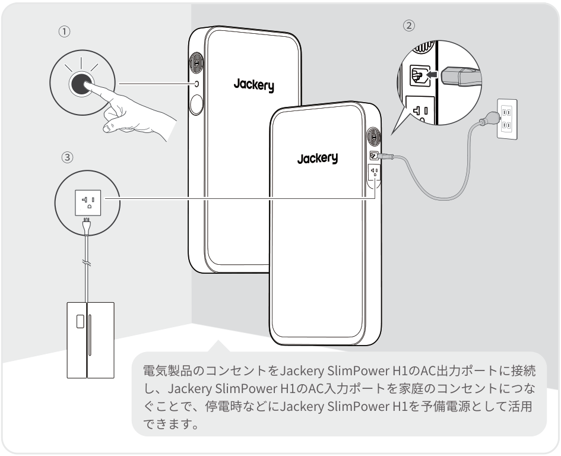
電気製品のコンセントをJackery SlimPower H1のAC出力ポートに接続し、Jackery SlimPower H1のAC入力ポートを家庭のコンセントにつなぐことで、停電時などにJackery SlimPower H1を予備電源として活用できます。

</figure>

本製品は、電気系統（家庭内の電源など）が突然停止した場合、自動的にバッテリー給電モードに切り替わるUPS（無停電電源装置）機能を備えています。切替時間は約10 ミリ秒（0.010 秒）以内です。ただし、本機能は0ms での完全な無停止給電には対応しておりません。そのため、以下のような高精度な連続電源供給を必要とする機器への接続はお控えください。

<ul><li>データサーバー</li><li>ワークステーション</li><li>医療機器など</li></ul>

これらの機器でご使用を希望される場合は、事前に複数回の動作テストを実施し、機器との互換性をご確認の上でご使用ください。また、複数の高負荷機器を同時に接続した場合、過負荷保護が作動し電源が遮断される可能性があります。使用時はできるだけ一台の機器のみを接続することを推奨します。※記載の手順に従わずに機器が正常に動作しなかったり、データ消失などの損害が発生した場合、弊社では責任を負いかねます。あらかじめご了承ください。UPS として使用している際はパススルー機能により充電と出力が同時に行われている状態のため、ポータブル電源の最大出力電流は8A に制限され、停電時には定格出力に戻ります。

## 縦置

<table class="manual-callout-table manual-callout-table"><tbody><tr><td class="manual-callout-label">注意</td><td class="manual-callout-body">
・ 石膏ボード、断熱壁、中空レンガなどの耐荷重構造ではない場所には設置しないでください。製品が落下するおそれがあります。・  壁内の電気配線、水道管、ガス管、その他の設備を避けてください。
</td></tr></tbody></table>

スタンドに取り付けられた Jackery SlimPower H1 は、地面に設置することができます。以下の設置手順に従ってください。

### 設置前の準備。

<figure class="hb-reference-figure" data-component-id="HB-SPECIAL-REFERENCE-FIGURE" data-reference-id="stand_prepare" data-source-fragment-sha256="4d0d27fbfeeeaaff36d312c68f2af4f7d88303ebf89e787d88e0b0310ac6b564">
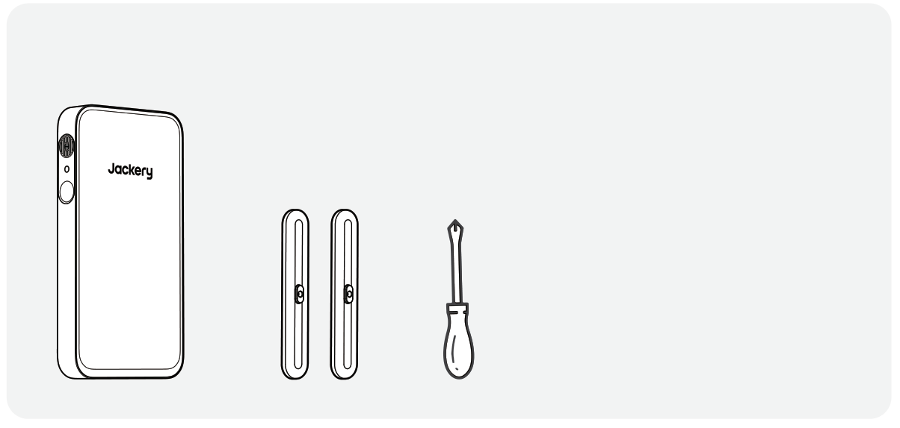
</figure>

<figure class="hb-reference-figure hb-base-art-live-copy" data-component-id="HB-SPECIAL-REFERENCE-FIGURE" data-reference-id="stand_1" data-source-fragment-sha256="46944c47aafe7e081d46b19382fd4dc1fdcddc490604989e3274c498fa70f58e" data-web-base-art-ref="stand_1" data-web-presentation-mode="base-art-live-copy">

1.製品底面のネジを2本外してください。

</figure>

<figure class="hb-reference-figure hb-base-art-live-copy" data-component-id="HB-SPECIAL-REFERENCE-FIGURE" data-reference-id="stand_2" data-source-fragment-sha256="455bc89af5d8d0156f42567319f6daf4771f1fa3fc2facd9c9b7e44e23f6f91d" data-web-base-art-ref="stand_2" data-web-presentation-mode="base-art-live-copy">

2.製品底面の取り付け穴を縦置きスタンドの穴と合わせてください。

</figure>

<figure class="hb-reference-figure hb-base-art-live-copy" data-component-id="HB-SPECIAL-REFERENCE-FIGURE" data-reference-id="stand_3" data-source-fragment-sha256="b61f46ef698553be2b006eb294ea1998a24210ea5356711b721696c641bdfb2d" data-web-base-art-ref="stand_3" data-web-presentation-mode="base-art-live-copy">

3.ネジを締め付けます。

</figure>

Jackery Wall-Mounted Bracket（別売）を使用すると、Jackery SlimPower H1 を壁に設置することができます。以下の設置手順に従ってください。

### 木製の壁の場合

### 取付前の準備。

<figure class="hb-reference-figure hb-base-art-live-copy" data-component-id="HB-SPECIAL-REFERENCE-FIGURE" data-reference-id="wood_prepare" data-source-fragment-sha256="4fda9ca0399ac8ebfe64d9ab83b54055dad138f240f03d6c71889f59dfcf2d7e" data-web-base-art-ref="wood_prepare" data-web-presentation-mode="base-art-live-copy">

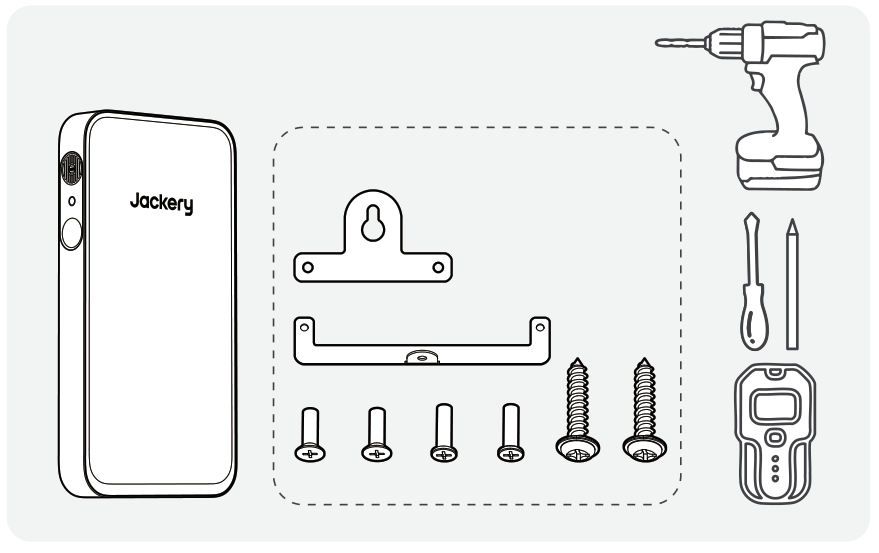別売壁の中にある細い柱(間柱)

</figure>

<figure class="hb-reference-figure hb-base-art-live-copy" data-component-id="HB-SPECIAL-REFERENCE-FIGURE" data-reference-id="wood_1" data-source-fragment-sha256="3a5351a528be0bdf5ceed3369717e0adeeb4d88daf0b890e3e017ad3b06abbed" data-web-base-art-ref="wood_1" data-web-presentation-mode="base-art-live-copy">

1.製品底面のネジ2本を取り外します。

</figure>

<figure class="hb-reference-figure hb-base-art-live-copy" data-component-id="HB-SPECIAL-REFERENCE-FIGURE" data-reference-id="wood_2_3" data-source-fragment-sha256="91d5b0c63a8c7938a7830b8465f1590324615f8aa4eb365ea4fe6565b34a53b1" data-web-base-art-ref="wood_2_3" data-web-presentation-mode="base-art-live-copy">

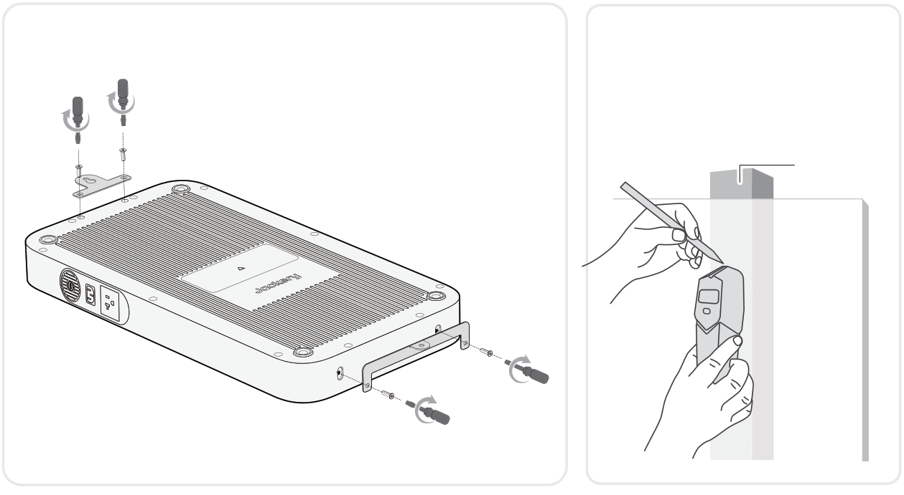2. 上下のマウントブラケットを製品背面にしっかり取り付けます。3. 壁の内側にある間柱を探すには、下地探しセンサーを使用してください。間柱

</figure>

<figure class="hb-reference-figure hb-base-art-live-copy" data-component-id="HB-SPECIAL-REFERENCE-FIGURE" data-reference-id="wood_4_5" data-source-fragment-sha256="7b76e36c9617f722ea2b0417cb3f28b90c5f909c333ab49a8da8c225d6fb3a6d" data-web-base-art-ref="wood_4_5" data-web-presentation-mode="base-art-live-copy">

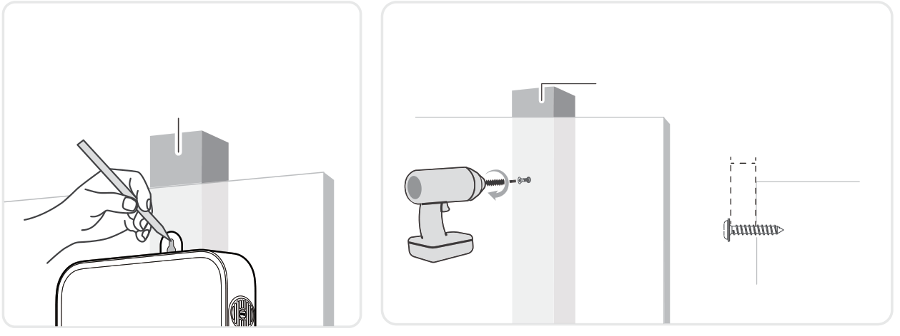4. 壁の木製下地に取付ポイントをマーキングしてください。5. 取付ポイントに木ねじを壁にねじ込み、ねじと壁の間に2～4mmの隙間を残してください。間柱間柱2~4mm

</figure>

<figure class="hb-reference-figure hb-base-art-live-copy" data-component-id="HB-SPECIAL-REFERENCE-FIGURE" data-reference-id="wood_6" data-source-fragment-sha256="cdcaf76dec246302837141a5e9660495db3b616b848d8d3186fa111c77cb9092" data-web-base-art-ref="wood_6" data-web-presentation-mode="base-art-live-copy">

6. 製品をネジに垂直に掛けます。下部ブラケットの取付穴から壁面にタッピングネジを打ち込み、締め付けます。その後、木ネジを完全に締め付けます。

</figure>

### コンクリート壁面の場合

### 取付前の準備：

<figure class="hb-reference-figure hb-base-art-live-copy" data-component-id="HB-SPECIAL-REFERENCE-FIGURE" data-reference-id="concrete_prepare" data-source-fragment-sha256="1ae193ff56f9b4c7148ae48b6c5e4297c9c89e7f8c9b7036f42ed30210584269" data-web-base-art-ref="concrete_prepare" data-web-presentation-mode="base-art-live-copy">

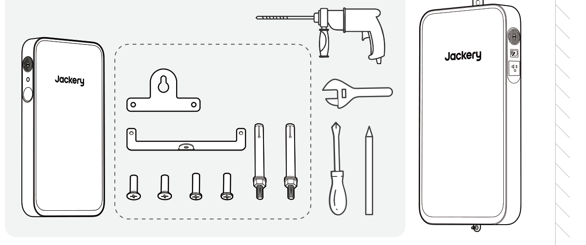別売

</figure>

<figure class="hb-reference-figure hb-base-art-live-copy" data-component-id="HB-SPECIAL-REFERENCE-FIGURE" data-reference-id="concrete_1" data-source-fragment-sha256="afd01af4dba3a94c4b4e29023c319bed307d47b6a29844dc250034cf55d11e44" data-web-base-art-ref="concrete_1" data-web-presentation-mode="base-art-live-copy">

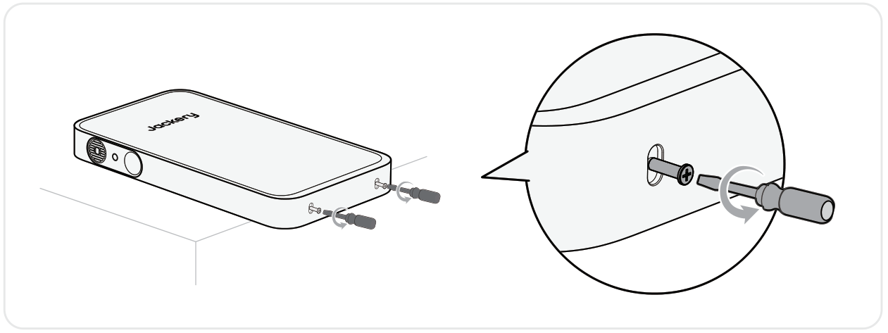1.製品底面のネジ2本を取り外します。

</figure>

<figure class="hb-reference-figure hb-base-art-live-copy" data-component-id="HB-SPECIAL-REFERENCE-FIGURE" data-reference-id="concrete_2" data-source-fragment-sha256="87995ac5b3d68fc97a94c3172aab0b38372c1f5e180223b7dac6ff05182c7f4d" data-web-base-art-ref="concrete_2" data-web-presentation-mode="base-art-live-copy">

2.上下のマウントブラケットを製品背面にしっかり取り付けます。

</figure>

<figure class="hb-reference-figure hb-base-art-live-copy" data-component-id="HB-SPECIAL-REFERENCE-FIGURE" data-reference-id="concrete_3_4" data-source-fragment-sha256="a67515695939488cfa42dbb3b0de386981e52c955d5014f6f16018d4cba26717" data-web-base-art-ref="concrete_3_4" data-web-presentation-mode="base-art-live-copy">

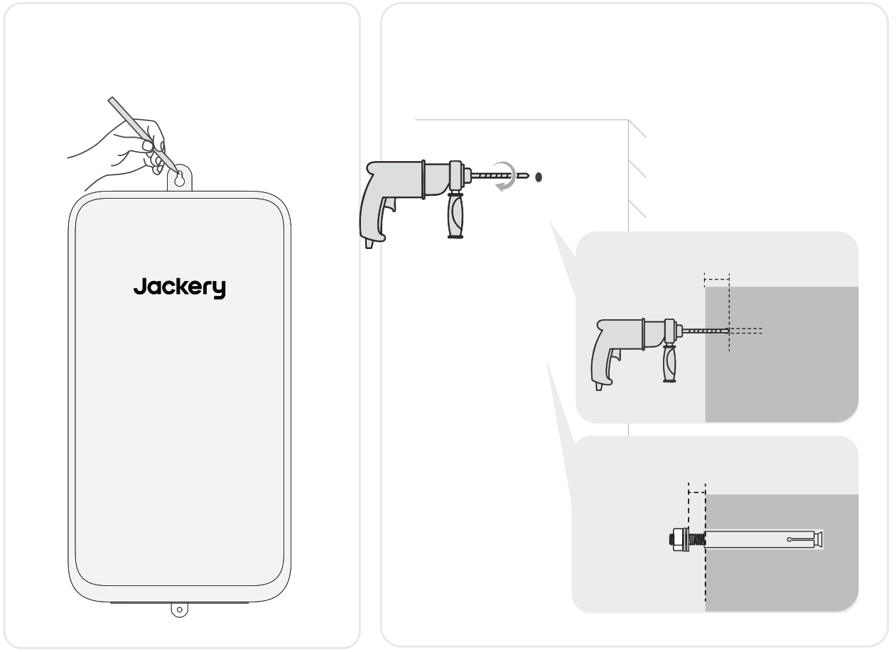3. 壁面に取付位置をマーキングします。4. 8mmのコンクリート用インパクトドリルを使用し、取付位置に深さ約70mmの穴をあけます。エクスパンションボルトを挿入し、ナットを2～4mm緩めます。70mm2~4mm8mm

</figure>

<figure class="hb-reference-figure hb-base-art-live-copy" data-component-id="HB-SPECIAL-REFERENCE-FIGURE" data-reference-id="concrete_5_6" data-source-fragment-sha256="e56c42fe28d1a6a360b6f41c5c8f82586bba6f131643b928405f649264eb9a47" data-web-base-art-ref="concrete_5_6" data-web-presentation-mode="base-art-live-copy">

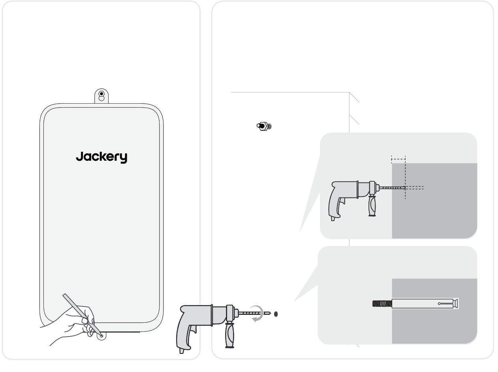5. 製品をエクスパンションボルトに垂直に掛け、壁面の取り付け位置をマーキングします。6. 製品を取り外します。取付ポイントに穴を開け、ナットとワッシャーを使わずにボルトを穴に差し込んでください。70mm8mm

</figure>

<figure class="hb-reference-figure hb-base-art-live-copy" data-component-id="HB-SPECIAL-REFERENCE-FIGURE" data-reference-id="concrete_7_8" data-source-fragment-sha256="58f74921033d7957bbca520a1479ebdeb05c8bbb56d6984311096258498ad9ea" data-web-base-art-ref="concrete_7_8" data-web-presentation-mode="base-art-live-copy">

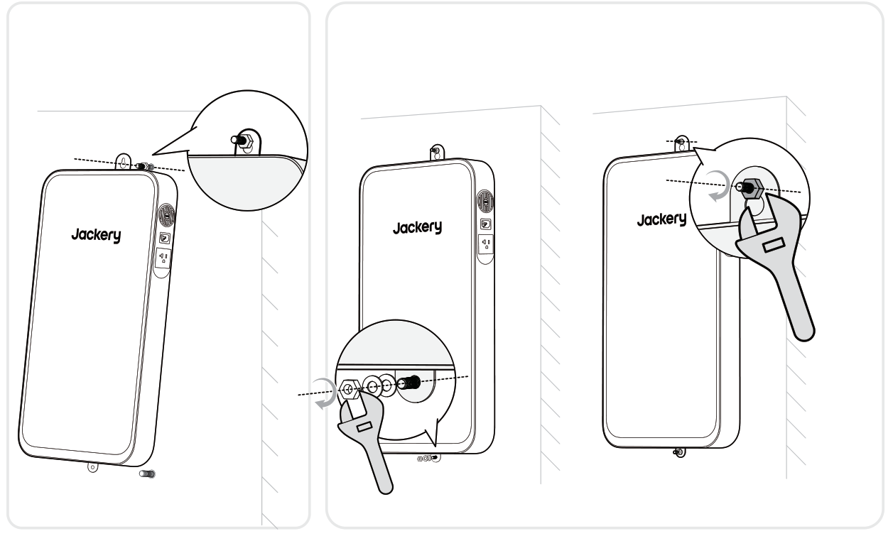7. 製品を上側のボルトに掛けてください。8. 製品を持ち上げ、予め設置されたボルトに合わせてから下ろして設置します。ナットを締めます。

</figure>

## 接続

### バッテリーパック（別売）に接続

本製品はバッテリーパックを追加して大容量の電力需要に対応できます。使用方法の詳細については、Jackery Battery Packの取扱説明書を参照してください。

<figure class="hb-reference-figure" data-component-id="HB-SPECIAL-REFERENCE-FIGURE" data-reference-id="battery" data-source-fragment-sha256="b01eaa9f5739882d6ae98634ca686a8ae134b2ec2e628af9eac2d58210357467">
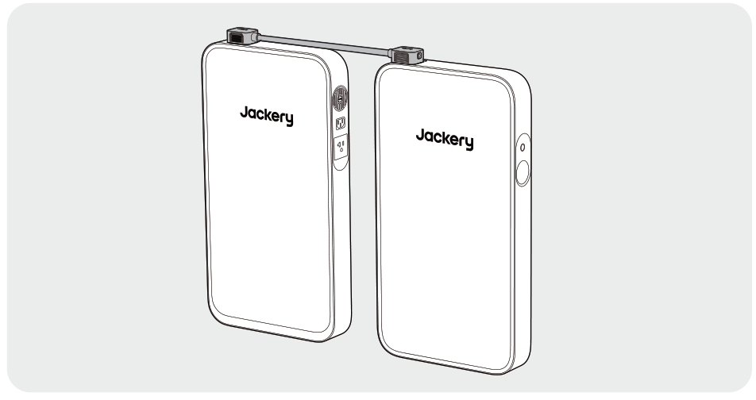
</figure>

<table class="manual-callout-table manual-callout-table"><tbody><tr><td class="manual-callout-label">ご注意</td><td class="manual-callout-body">
Battery Packを Jackery SlimPower H1 に接続する前に、両方の電源がオフになっていることを確認してください。
</td></tr></tbody></table>

## 充電方法

### グリーンエネルギー優先モード

本製品はグリーンエネルギー優先モードを搭載していますが、ソーラーパネルとAC充電ケーブルを使って同時に充電できます。同時に充電すると、ソーラーが優先されますが、バッテリーの最大許容電力で同時に充電されます。

<table class="manual-callout-table manual-callout-table"><tbody><tr><td class="manual-callout-label">ご注意</td><td class="manual-callout-body">
• 製品の充電動作温度範囲は-20°C~45°C、放電動作温度範囲は-20°C~45°C です。上限・下限温度を超えた場合、充放電が制限され、または充放電不可の可能性があります。• 温度によって、製品の充電効率と実際の容量は異なります。
</td></tr></tbody></table>

<table class="manual-callout-table manual-callout-table"><tbody><tr><td class="manual-callout-label">ご注意</td><td class="manual-callout-body">
• はじめてお使いになるときは、本製品をフル充電してからご使用ください。• 充電池は空の状態で長期保管(3 カ月~6 カ月）すると、性能が劣化したり、充電できなくなる場合があります。• 長期保管中は、電池残量が0％にならないよう、3 か月に一度の充電をおすすめします。
</td></tr></tbody></table>

### AC充電ケーブル

コンセントからJackery SlimPower H1本体を充電する際は、消費電流が大きいため、他の機器と併用したり、電源タップなどを介して接続したりしないでください。コンセントの定格電流を超えると、充電が停止する場合や、配線・コンセント・接続部が発熱し、火災の原因となるおそれがあります。必ず壁面のコンセントに単独で直接接続してください。

<figure class="hb-reference-figure" data-component-id="HB-SPECIAL-REFERENCE-FIGURE" data-reference-id="ac-charge" data-source-fragment-sha256="9bb81034778c919c493da9c77e59954c76e795a210a387c9eca0082c08a6e294">
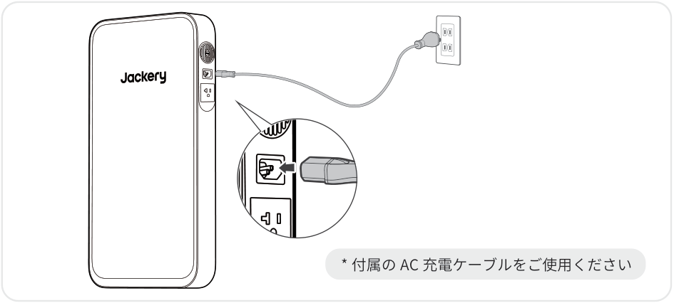
* 付属のAC 充電ケーブルをご使用ください

</figure>

<table class="manual-callout-table manual-callout-table"><tbody><tr><td class="manual-callout-label">ご注意</td><td class="manual-callout-body">
AC充電ケーブルのプラグが製品のAC入力ポートにしっかりと、かつ完全に差し込まれていることを確認してください。差し込みが不完全な場合、電流の不安定、発熱、接触不良などが発生し、機器の正常な動作に支障をきたす恐れがあります。
</td></tr></tbody></table>

### ソーラー充電

Jackery DC Input Moduleを接続することで、Jackery SlimPower H1はJackeryソーラーパネルに対応します。使用方法の詳細については、Jackery DC Input Moduleのユーザーマニュアルを参照してください。

<figure class="hb-reference-figure" data-component-id="HB-SPECIAL-REFERENCE-FIGURE" data-reference-id="solar" data-source-fragment-sha256="895dc1c6e2a1992a518f072b90f12f0edcb9fa57ae0fd064c10c7089cec9f598">
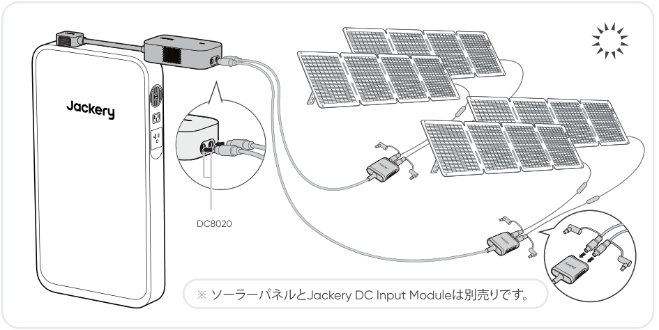
※ ソーラーパネルとJackery DC Input Moduleは別売りです。 DC8020

</figure>

Jackeryブランド以外の付属品を使用して充電しないでください。特に、ソーラーパネルで充電する際は、Jackeryのソーラーパネルを使用することをお勧めします。ソーラーパネルの開放電圧（Voc）が、Jackery SlimPower H1のDC入力電圧範囲（36.8V~56V）内に収まっていることを確認してください。他社ソーラーパネルで充電することによる損失について、当社は一切の責任を負いません。

### シガーソケット充電

Jackery DC Input Moduleに接続することで、Jackery SlimPower H1は12V/10A車載充電器で充電できます。使用方法の詳細については、Jackery DC Input Moduleのユーザーマニュアルを参照してください。

<figure class="hb-reference-figure" data-component-id="HB-SPECIAL-REFERENCE-FIGURE" data-reference-id="car" data-source-fragment-sha256="767e84136c0ca403b6f2697c54cff546a63997b7e26c6c30a1423533a6efd54d">
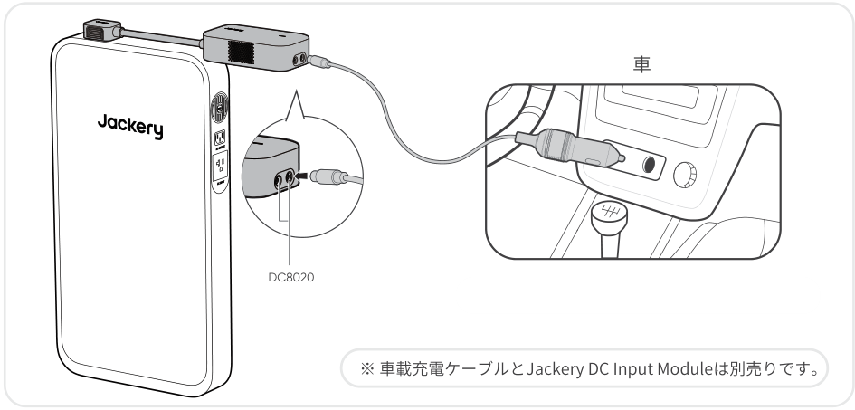
※ 車載充電ケーブルとJackery DC Input Moduleは別売りです。 車 DC8020

</figure>

## メンテナンス

防虫ネットは定期的に清掃してください。シリコンカバーを取り外してください。 M3のプラスドライバーでネジを緩めて取り外し、プラスチック部品と防虫ネットを取り出して清掃してください。

<figure class="hb-reference-figure hb-base-art-live-copy" data-component-id="HB-SPECIAL-REFERENCE-FIGURE" data-reference-id="maintenance" data-source-fragment-sha256="aa246926fc1f70a2e63af59945bf37410d46a5b194065a99becef4c9b8ca16ba" data-web-base-art-ref="maintenance" data-web-presentation-mode="base-art-live-copy">

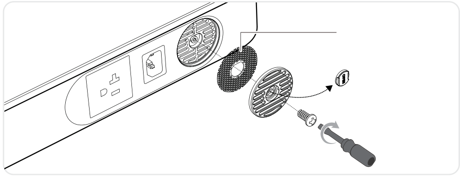防虫ネット

</figure>

<table class="manual-callout-table manual-callout-table"><tbody><tr><td class="manual-callout-label">ヒント</td><td class="manual-callout-body">
·   3～6か月ごとに徹底的に清掃してください。 ご家庭でペットを飼っている場合や、ほこりの多い環境では、点検頻度を適宜増やしてください。·   清掃後は、防虫ネットが完全に乾いていることを確認してから再度取り付けしてください。
</td></tr></tbody></table>

## トラブルシューティング

次のいずれかのエラーコードが表示された場合は、記載されている対処方法に従って問題を解決してください。問題が解決しない場合は、Jackeryカスタマーサポートまでご連絡ください。

<figure aria-label="エラーコード / 対処方法" class="hb-troubleshooting-composition" data-component-id="HB-TABLE-TROUBLESHOOTING" tabindex="0"><table class="hb-troubleshooting-table"><colgroup><col class="hb-troubleshooting-col-code"/><col class="hb-troubleshooting-col-measures"/></colgroup><thead><tr><th class="hb-troubleshooting-code" scope="col">エラーコード</th><th class="hb-troubleshooting-measures" scope="col">対処方法</th></tr></thead><tbody><tr><td class="hb-troubleshooting-code">F0 / F1
F2 / F3</td><td class="hb-troubleshooting-measures">製品の電源を切り、再起動してください。</td></tr><tr><td class="hb-troubleshooting-code">F4</td><td class="hb-troubleshooting-measures">製品に負荷を接続してバッテリーを放電し、エラーが消えるまで続けてください。</td></tr><tr><td class="hb-troubleshooting-code">F5</td><td class="hb-troubleshooting-measures">ソーラーパネルまたはAC電源コンセントを使用して、エラーが消えるまで製品を充電してください。</td></tr><tr><td class="hb-troubleshooting-code">F6</td><td class="hb-troubleshooting-measures">1. AC 電源コンセントから充電する前に、電力グリッドが安定するのを待ってください。2. サーモベントが塞がれていないか確認し、製品の両側に5cm のスペースを確保してください。3. 製品は日陰で通気の良い場所に設置し、周囲温度が45℃未満であることを確認してください。4. 製品からすべての負荷を取り外し、アイドル状態にして、エラーが消えるまで待ってください。5. 製品を再起動してください。</td></tr><tr><td class="hb-troubleshooting-code">F7</td><td class="hb-troubleshooting-measures">1. 製品からすべてのDC 入力を取り外してください。2. ソーラーパネルで充電する場合は、接続されたソーラーパネルの開放電圧（Voc）を確認してください。本製品の最大DC 入力電圧は56V です。3. 製品を再起動し、アイドル状態を保ってください。エラーが消えるまで待ってください。</td></tr><tr><td class="hb-troubleshooting-code">F8</td><td class="hb-troubleshooting-measures">販売店またはJackeryカスタマーサポートにお問い合わせください。</td></tr><tr><td class="hb-troubleshooting-code">FC</td><td class="hb-troubleshooting-measures">1. バッテリーパックとポータブル電源をそれぞれ再起動してください。2. バッテリーパックをポータブル電源から外し、もう一度接続してください。</td></tr><tr><td class="hb-troubleshooting-code">FF</td><td class="hb-troubleshooting-measures">高温環境下で1. 製品へのすべての充電・放電ケーブル（壁用充電器、ソーラーパネル、車載充電器、負荷機器を含む）を切り離してください。2. 製品を日陰で風通しの良い場所に設置し、周囲温度が45°C 以下であることを確認してください。3. サーモベントが塞がれていないか確認し、製品の両側に5cm の空間を確保してください。4. 製品をアイドル状態にし、故障が消えるまで待ってください。低温環境下で1. 製品を0℃以上の暖かい環境へ移動させてください。2. 極端に寒い屋外での使用や充電は行わないでください。必要に応じて、室内で予熱してください。3. 製品を寒い環境から室内に移動させた場合は、使用前にしばらく放置してください。4. 低温インジケーターが表示された場合は、製品をアイドル状態にして、システムが自動的に回復するのを待ってください。</td></tr></tbody></table></figure>

## 主な仕様

## 基本情報

<figure aria-label="基本情報" class="hb-spec-table-composition"><table class="manual-table manual-spec-table hb-spec-table"><colgroup><col class="hb-spec-col-label"/><col class="hb-spec-col-value"/></colgroup><tbody><tr><th class="manual-spec-label hb-spec-label" scope="row">製品の名称</th><td class="manual-spec-value hb-spec-value">Jackery SlimPower H1</td></tr><tr><th class="manual-spec-label hb-spec-label" scope="row">型番</th><td class="manual-spec-value hb-spec-value">JE-1000E-WH</td></tr><tr><th class="manual-spec-label hb-spec-label" scope="row">バッテリータイプ</th><td class="manual-spec-value hb-spec-value">LiFePO₄（リン酸鉄リチウムイオン電池）</td></tr><tr><th class="manual-spec-label hb-spec-label" scope="row">定格容量</th><td class="manual-spec-value hb-spec-value">20Ah/51.2V DC (1024Wh)</td></tr><tr><th class="manual-spec-label hb-spec-label" scope="row">サイクル寿命</th><td class="manual-spec-value hb-spec-value">6000回（6000回充放電後も初期容量の70％を維持）</td></tr><tr><th class="manual-spec-label hb-spec-label" scope="row">サイズ＆重量</th><td class="manual-spec-value hb-spec-value">約600×325×67 mm (約10.5 kg）</td></tr></tbody></table></figure>

## 入力ポート

<figure aria-label="入力ポート" class="hb-spec-table-composition"><table class="manual-table manual-spec-table hb-spec-table"><colgroup><col class="hb-spec-col-label"/><col class="hb-spec-col-value"/></colgroup><tbody><tr><th class="manual-spec-label hb-spec-label" scope="row">1×AC入力ポート</th><td class="manual-spec-value hb-spec-value">100V-120V~50/60Hz，最大15A</td></tr><tr><th class="manual-spec-label hb-spec-label" scope="row">DC入力ポート</th><td class="manual-spec-value hb-spec-value">36.8V-56V⎓最大24A，最大500W</td></tr></tbody></table></figure>

## 出カポート

<figure aria-label="出カポート" class="hb-spec-table-composition"><table class="manual-table manual-spec-table hb-spec-table"><colgroup><col class="hb-spec-col-label"/><col class="hb-spec-col-value"/></colgroup><tbody><tr><th class="manual-spec-label hb-spec-label" scope="row">AC出力</th><td class="manual-spec-value hb-spec-value">100V~50/60Hz，8A，800W，瞬間最大1600W</td></tr><tr><th class="manual-spec-label hb-spec-label" scope="row">AC出力（パススルー）①</th><td class="manual-spec-value hb-spec-value">100V-120V~50/60Hz，最大800W</td></tr><tr><th class="manual-spec-label hb-spec-label" scope="row">DC拡張ポート端子</th><td class="manual-spec-value hb-spec-value">36.8V~56V⎓最大24A</td></tr></tbody></table></figure>

## 温度範囲

<figure aria-label="温度範囲" class="hb-spec-table-composition"><table class="manual-table manual-spec-table hb-spec-table"><colgroup><col class="hb-spec-col-label"/><col class="hb-spec-col-value"/></colgroup><tbody><tr><th class="manual-spec-label hb-spec-label" scope="row">充電温度</th><td class="manual-spec-value hb-spec-value">-20°C～45°C</td></tr><tr><th class="manual-spec-label hb-spec-label" scope="row">動作温度</th><td class="manual-spec-value hb-spec-value">-20°C～45°C</td></tr><tr><th class="manual-spec-label hb-spec-label" scope="row">保存温度</th><td class="manual-spec-value hb-spec-value">1 年間 0～25°C 3 ヶ月 0～45°C 1 ヶ月 - 20～45°C</td></tr></tbody></table></figure>

①    本製品は、ACコンセントからバッテリーを充電しながら、AC出力ポートを通じて給電することができます。

## 保証について

<figure aria-label="保証について" class="hb-warranty-intro-composition" data-component-id="HB-WARRANTY-LEAD">

このたびはJackery 製品をご購入いただき、誠にありがとうございます。本保証書は、Jackery ポータブル電源製品に関する保証内容を明確にご案内するものです。

ご使用前に必ずご確認のうえ、大切に保管してください。

</figure>

<figure aria-label="保証期間" class="hb-warranty-period-card" data-component-id="HB-WARRANTY-YEARS">

3
<strong class="hb-warranty-years-unit">年間</strong><strong class="hb-warranty-period-label">保証期間</strong>

1. 保証期間はご購入日から3 年間です。

2
<strong class="hb-warranty-years-unit">年間</strong><strong class="hb-warranty-period-label">保証期間</strong>

2. また、延長保証にご登録いただくと、さらに2 年間の保証が追加されます。詳しくはJackery公式サイトをご確認ください。

</figure>

※ Jackery 公式オンラインストアまたは正規代理店以外での購入品は保証対象外となります。

### 保証の適用範囲

<figure aria-label="保証の適用範囲" class="hb-warranty-card" data-component-id="HB-WARRANTY-SECTION" data-warranty-card-index="1">
1. 購入チャネルについて     本保証は、Jackery公式オンラインストアまたは正規代理店で購入された製品に限り有効です。

2. 保証提供地域     保証は、日本国内に在住の方が、日本国内で使用する場合に限り有効です。
</figure>

### 保証の適用条件

<figure aria-label="保証の適用条件" class="hb-warranty-card" data-component-id="HB-WARRANTY-SECTION" data-warranty-card-index="2">
以下のすべての条件を満たす場合に、保証の適用対象となります。

・Jackery公式オンラインストアまたは正規代理店にてご購入されたこと・保証期間内であること・下記の「保証対象外」に該当しないこと
</figure>

### 保証対象外となる場合

<figure aria-label="保証対象外となる場合" class="hb-warranty-card" data-component-id="HB-WARRANTY-SECTION" data-warranty-card-index="3">
以下のいずれかに該当する場合、保証期間内であっても保証の対象外となります。1.故障・損傷が保証期間内に発生していても、保証期間終了後に申請された場合2.使用上の誤り（取扱説明書や本体ラベルに記載の注意事項に従わなかった使用）による故障・      損傷3.他機器からの影響、不適切な修理または改造による故障・損傷4.移設・輸送・落下などに起因する故障・損傷5.火災・地震・風水害・落雷などの天災、または公害・塩害・異常電圧などによる故障・損傷6.消耗部品の劣化や摩耗、または外観の汚損など
</figure>

### 購入証明について

<figure aria-label="購入証明について" class="hb-warranty-card" data-component-id="HB-WARRANTY-SECTION" data-warranty-card-index="4">
保証をご利用の際には、以下いずれかの購入証明書類をご提示いただく必要があります。・Jackery公式オンラインストアでの購入：注文番号（注文履歴画面または確認メール）・正規代理店での購入：購入日・販売店名の記載された領収書または納品書

※  ご提示がない場合、保証対応いたしかねます。
</figure>

### 保証内容

<figure aria-label="保証内容" class="hb-warranty-card" data-component-id="HB-WARRANTY-SECTION" data-warranty-card-index="5">
1. 初期不良による交換（ご購入日から30日以内）・取扱説明書に従った正常な使用中に不具合が発生した場合、同一製品の新品と交換いた     します。・在庫切れや販売終了の場合は、同等品への交換または返金にて対応いたします。

2. 無償修理（ご購入日から31日以上～保証期間内）・保証条件を満たす自然故障については、無料で修理対応いたします。・修理が困難な場合は、同等品（同モデルまたは同等スペック品）への交換にて対応いた    します。

3. 有償修理以下に該当する場合は、有償での修理対応となります。・保証期間を超えた製品・保証対象外と判断された場合・Jackery公式オンラインストアまたは正規代理店以外で購入された製品 有償修理後の保     証期間は、修理完了日より90日間です。

*無償修理の場合、残りの保証期間が90日未満であれば「90日間」、90日以上であれば「元の保証期間に準じます」。
</figure>

### 免責事項

<figure aria-label="免責事項" class="hb-warranty-card" data-component-id="HB-WARRANTY-SECTION" data-warranty-card-index="6">
1. 弊社では、いかなる場合においても、間接的損害または付随的損害（データの損失・逸失利益など）に対して責任を負いません。

2. 本保証書は、お客様が法律上有する権利を制限するものではありません。

3. 保証内容は、予告なく変更される場合がございます。あらかじめご了承ください。

Jackery 製品を安心してご使用いただくために、本保証書の内容をご確認のうえ、ご活用くださいますようお願いいたします。

ご不明点がございましたら、Jackery カスタマーサービスまでお問い合わせください。
</figure>

公式サイト: https://www.jackery.jp

カスタマーサポート: jackery.jp@jackery.com

お問い合わせ電話番号: 050-3198-9007

## Jackeryアプリ ユーザーマニュアル

### 1. アプリをダウンロードしてログインするには

<figure aria-label="アプリをダウンロードしてログインするには" class="hb-app-download-composition" data-component-id="HB-SPECIAL-APP">

Google PlayまたはApp Storeで「Jackery」と検索し、アプリをインストールしてください。その後、登録とログインを行ってください。

または、下の QR コードをスキャンしてアプリをダウンロードし、インストールしてください。

</figure>

### 2. デバイスを追加するには

2.1  APPの右上にあるデバイス追加ボタン + をクリックします；

2.2  デバイスの主電源ボタンを長押しして電源をいれると、ディスプレー画面にWi-FiとBluetoothのアイコンが点滅し、デバイスがネットワーク設定モードに入ったことを示します。アイコン点滅中ボタンをクリックし、アプリが近くのデバイスに接続し、Bluetoothのアクセス許可を開くことを許可します。

2.1 / 2.2

<figure class="hb-reference-figure" data-component-id="HB-SPECIAL-REFERENCE-FIGURE" data-reference-id="app-phones" data-source-fragment-sha256="0a4468d334b9b9ba75a73ad9a43e8e2a9d0ebfac73835d0e1c34e6724daf15ac">
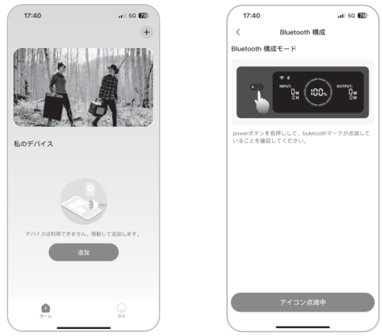
</figure>

<figure class="hb-reference-figure hb-base-art-live-copy" data-component-id="HB-SPECIAL-REFERENCE-FIGURE" data-reference-id="app-power" data-source-fragment-sha256="c248772a0d0b716cb62d75336d33d3a18122a280cde272742fabdc4c5f07df29" data-web-base-art-ref="app-power" data-web-presentation-mode="base-art-live-copy">

主電源ボタン

</figure>

2.3 検出されたデバイスアイコンをクリックすると、アプリは自動的にBluetoothでデバイスを接続します。

<table class="manual-callout-table manual-callout-table"><tbody><tr><td class="manual-callout-label">備考</td><td class="manual-callout-body">
バインド処理中に「デバイスがバインドされました」と表示された場合は、以下の2つの方法で接続できます：デバイス所有者は、アプリを通じてこのデバイスを他のユーザーと共有します。デバイスの電源が切れている状態で、メイン電源ボタンを10秒間長押しすると、Wi-FiとBluetoothがリセットされます。
</td></tr></tbody></table>

2.4 デバイスが正常に接続されると、デバイスが接続するWi-Fiの名前とパスワードを入力する必要があり、デバイスは自動的にWi-Fiネットワークに接続します。

<table class="manual-callout-table manual-callout-table"><tbody><tr><td class="manual-callout-label">備考</td><td class="manual-callout-body">
2.4GHz帯のWi-Fiネットワークを選択してください。デバイスは、5GHz帯のWi-Fiネットワークには対応していません。
</td></tr></tbody></table>

2.5 デバイスのホーム画面でデバイスが正常に追加されると、デバイスのWi-Fi アイコンは常にオンになります。

2.3 / 2.4 / 2.5

<figure class="hb-reference-figure" data-component-id="HB-SPECIAL-REFERENCE-FIGURE" data-reference-id="app-result" data-source-fragment-sha256="e6c6a5d88954ac75a65ca513008fb5d11c370c468dd62165c29b7d9c39f1f352">
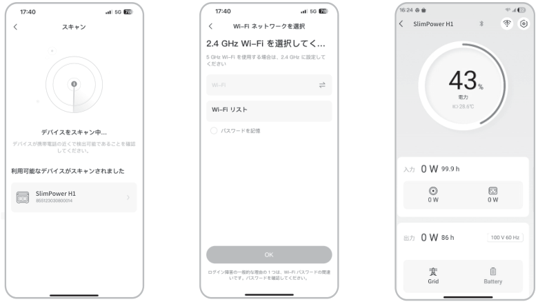
</figure>

上記のスクリーンショットは参考画像となります。

<table class="manual-callout-table manual-callout-table"><tbody><tr><td class="manual-callout-label">備考</td><td class="manual-callout-body">
Jackeryアプリは、一度に1台のポータブル電源としかBluetooth接続できません。 デバイスリストに戻ると、自動的にBluetoothが切断されます。 リスト内のポータブル電源をもう一度タップすると、自動的に再接続されます。
</td></tr></tbody></table>

### 3. デバイスのバインドを解除するには

デバイスのメインインターフェースの右上隅にある「設定」ボタンをクリックして設定ページに入り、ページの下部にある「バインド解除」ボタンをクリックしてデバイスのバインドを解除します。

### 4. ご確認

### 4.1 Wi-FiとBluetoothのステータス

Wi-FiとBluetoothはデバイスと連動して自動的にオン/オフされ、画面上のWi-FiとBluetoothアイコンが点灯/消灯します。

### 4.2 Wi-FiとBluetoothのリセット方法

デバイスの電源を切った状態で、POWERボタンを10秒間長押しすると、Wi-FiとBluetoothが工場出荷時設定にリセットされます。その後、デバイスを再度バインドしてください。

<figure class="hb-reference-figure" data-component-id="HB-SPECIAL-REFERENCE-FIGURE" data-reference-id="back-qr" data-source-fragment-sha256="1487c00b4ddb021f8f23732e8a7c7f54fe16d325859bf488ac0a0062059f2d44">

</figure>
