# Jackery Explorer 1000 — Nederlands

Model: JE-1000F · hello.eu@jackery.com

## Introduction

Gefeliciteerd met uw nieuwe Jackery Explorer 1000. Lees deze handleiding goed door voordat u het product gebruikt. Neem vooral de relevante voorzorgsmaatregelen door om een correct gebruik te garanderen. Bewaar deze handleiding zodat u hem altijd bij de hand hebt.

Volgens de wet en regels heeft het bedrijf het laatste woord over de interpretatie van dit document en alle andere documenten die bij dit product horen. Hoewel alle moeite is gedaan om de nauwkeurigheid van deze handleiding te waarborgen, aanvaardt Jackery geen aansprakelijkheid voor eventuele fouten die kunnen voorkomen.

Houd er rekening mee dat er geen verdere meldingen worden gegeven bij updates, revisies of beëindiging. Bezoek support.jackery.com voor de nieuwste versie van de producthandleidingen.

* De afbeeldingen zijn alleen voor referentiedoeleinden. Raadpleeg het werkelijke product. BELANGRIJK

## Contents

<nav aria-label="Chapters"><ul><li><a href="#safety">BELANGRIJKE VEILIGHEIDSINFORMATIE</a></li><li><a href="#symbols">BETEKENIS VAN SYMBOLEN</a></li><li><a href="#in_the_box">WAT ZIT ER IN DE DOOS</a></li><li><a href="#product_overview">PRODUCTOVERZICHT</a></li><li><a href="#lcd_display">LCD-SCHERM</a></li><li><a href="#operations">HANDELINGEN</a></li><li><a href="#ups">ONONDERBROKEN STROOMVOORZIENING (UPS)</a></li><li><a href="#charging">OPLADEN</a></li><li><a href="#storage">OPSLAG</a></li><li><a href="#troubleshooting">PROBLEEMOPLOSSING</a></li><li><a href="#specifications">SPECIFICATIES</a></li><li><a href="#warranty">GARANTIE</a></li><li><a href="#app_setup">APP INSTELLEN</a></li></ul></nav>

## BELANGRIJKE VEILIGHEIDSINFORMATIE

<h3>AANWIJZINGEN BETREFFENDE HET RISICO OP BRAND, EEN ELEKTRISCHE SCHOK OF LETSEL AAN PERSONEN</h3>

Volg altijd deze basisvoorzorgsmaatregelen wanneer u dit product gebruikt.

<ul>
<li>Lees alle instructies voordat u het product gebruikt.</li>
</ul>

<ul>
<li>Kinderen mogen niet met het product spelen. Wanneer het product in de buurt van kinderen wordt gebruikt, is nauwlettend toezicht op de kinderen noodzakelijk.</li>
</ul>

<ul>
<li>Het gebruik van accessoires die niet worden aanbevolen of verkocht door professionele productfabrikanten kan een risico op elektrische schokken opleveren.</li>
</ul>

<ul>
<li>Haal de stekker uit de voedingsaansluiting van het product wanneer het product niet wordt gebruikt.</li>
</ul>

<ul>
<li>Demonteer het product niet, omdat dit kan leiden tot onvoorspelbare risico&#x27;s zoals brand, explosie of elektrische schokken.</li>
</ul>

<ul>
<li>Gebruik het product niet met beschadigde snoeren, stekkers of uitgangskabels, omdat dit kan leiden tot een elektrische schok.</li>
</ul>

<ul>
<li>Houd de ventilatieopeningen van het product vrij om een goede luchtcirculatie te garanderen. De ruimte waar het product wordt gebruikt, moet voldoende luchtstroom hebben en koel en droog zijn om oververhitting te voorkomen.</li>
</ul>

Het opladen in vochtige of slecht geventileerde ruimtes kan veiligheidsrisico&#x27;s met zich meebrengen.

Water kan kortsluiting of schade aan de oplader veroorzaken, wat kan leiden tot veiligheidsrisico&#x27;s.

<ul>
<li>Stel het product niet bloot aan vuur, hoge temperaturen, direct zonlicht of omgevingen met grote hitte, zoals in een geparkeerd voertuig. Een dergelijke blootstelling kan leiden tot brand of een explosie.</li>
</ul>

<h3>INSTRUCTIES VOOR GEBRUIKERSONDERHOUD</h3>

Tijdens de levensduur van energieopslagproducten kunt u rekening houden met een zekere mate van capaciteits- en energieverlies. Naarmate het aantal laad- en ontlaadcycli toeneemt en de opslagduur langer wordt, zal deze achteruitgang geleidelijk toenemen; dit is een normaal verschijnsel dat samenhangt met de natuurlijke veroudering van batterijcellen.

## BETEKENIS VAN SYMBOLEN

<table class="manual-table"><thead><tr>
<th scope="col">Symbool</th>
<th scope="col">Betekenis</th>
</tr></thead><tbody>
<tr><th scope="row">WAARSCHUWING</th><td>Gevaarlijke handelingen die kunnen leiden tot ernstig letsel, overlijden en/of materiële schade.</td></tr>
<tr><th scope="row">OPGELET</th><td>Gevaarlijke praktijken die kunnen leiden tot persoonlijk letsel en/of schade aan eigendommen.</td></tr>
<tr><th scope="row">OPMERKING</th><td>Gevaarlijke praktijken die kunnen leiden tot schade aan apparatuur, gegevensverlies, slechtere prestaties of onverwachte resultaten.</td></tr>
<tr><th scope="row">TIP</th><td>Vult de belangrijke informatie of bedieningstips in de tekst aan.</td></tr>
</tbody></table>

<figure>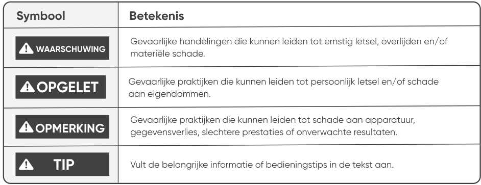</figure>

Symbool Betekenis

<figure>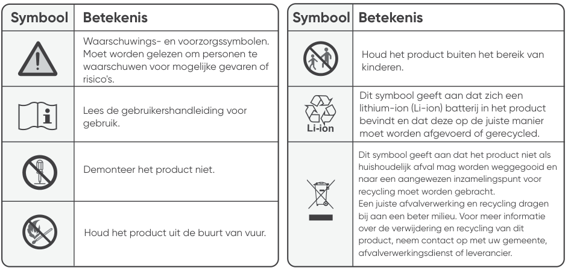</figure>

<table class="manual-table"><thead><tr>
<th scope="col">Symbool</th><th scope="col">Betekenis</th>
</tr></thead><tbody>
<tr><th scope="row"></th><td>Waarschuwings- en voorzorgssymbolen. Moet worden gelezen om personen te waarschuwen voor mogelijke gevaren of risico&#x27;s.</td></tr>
<tr><th scope="row"></th><td>Lees de gebruikershandleiding voor gebruik.</td></tr>
<tr><th scope="row"></th><td>Demonteer het product niet.</td></tr>
<tr><th scope="row">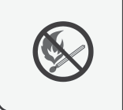</th><td>Houd het product uit de buurt van vuur.</td></tr>
<tr><th scope="row"></th><td>Houd het product buiten het bereik van kinderen.</td></tr>
<tr><th scope="row"></th><td>Dit symbool geeft aan dat zich een lithium-ion (Li-ion) batterij in het product bevindt en dat deze op de juiste manier moet worden afgevoerd of gerecycled.</td></tr>
<tr><th scope="row"></th><td>Dit symbool geeft aan dat het product niet als huishoudelijk afval mag worden weggegooid en naar een aangewezen inzamelingspunt voor recycling moet worden gebracht. Een juiste afvalverwerking en recycling dragen bij aan een beter milieu. Voor meer informatie over de verwijdering en recycling van dit product, neem contact op met uw gemeente, afvalverwerkingsdienst of leverancier.</td></tr>
</tbody></table>

## WAT ZIT ER IN DE DOOS

<figure>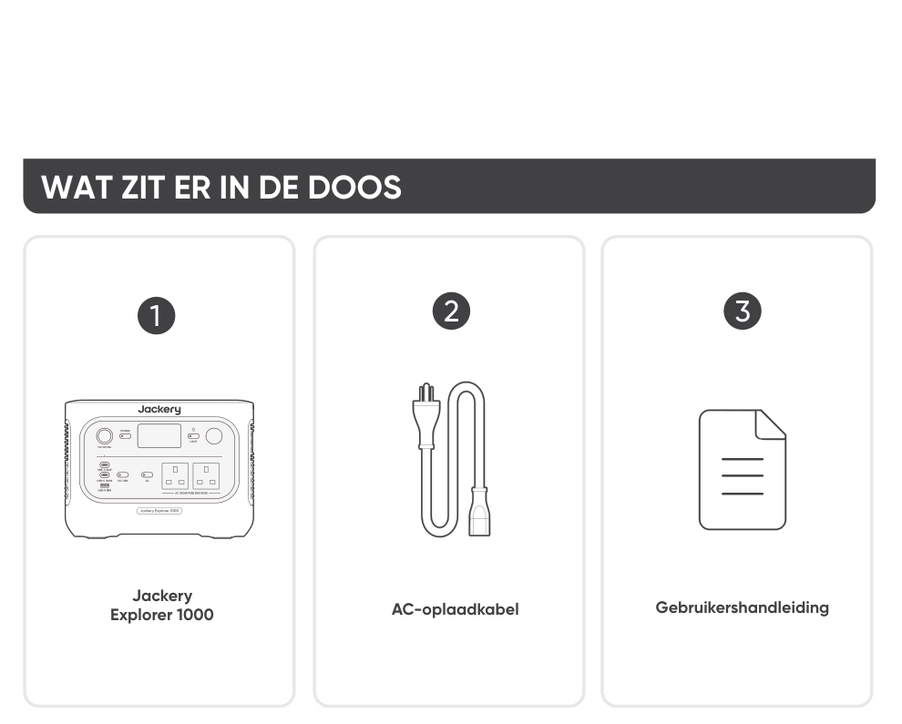</figure>

2 3

Jackery Explorer 1000

Gebruikershandleiding

AC-oplaadkabel

TIPS De oplaadkabel voor de auto is niet inbegrepen, maar is apart verkrijgbaar op onze website. Voor assistentie kunt u contact opnemen met de klantenservice van Jackery.

## PRODUCTOVERZICHT

<figure>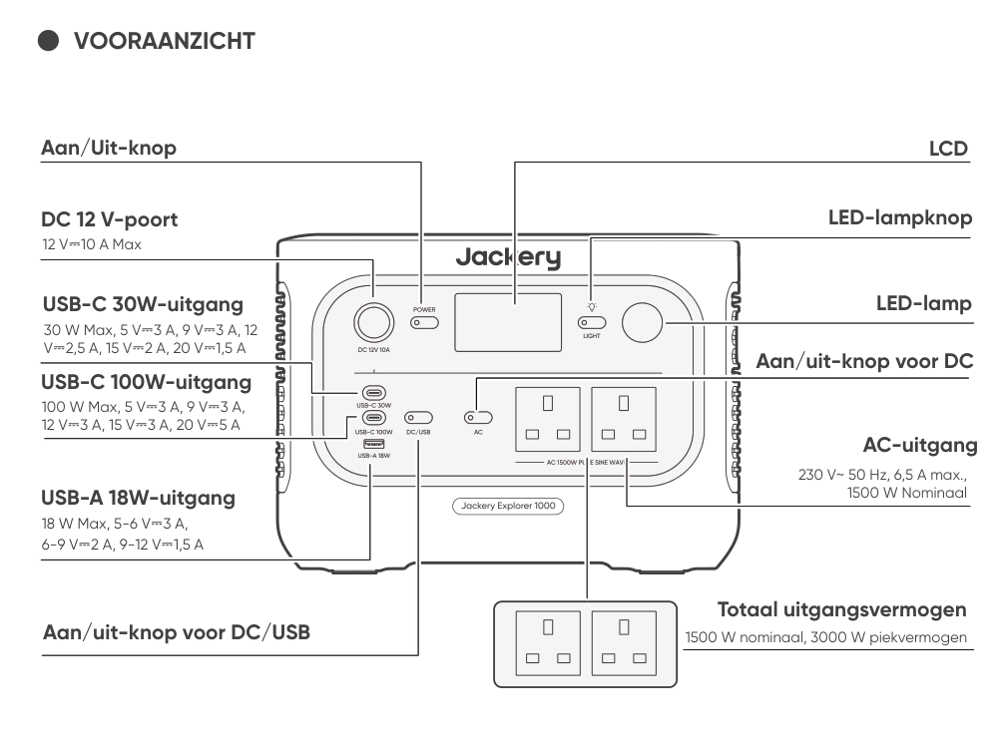</figure>

<h3>VOORAANZICHT</h3>

Aan/Uit-knop

<h3>LCD</h3>

LED-lampknop

DC 12 V-poort

12 V⎓10 A Max

LED-lamp

USB-C 30W-uitgang

30 W Max, 5 V⎓3 A, 9 V⎓3 A, 12 V⎓2,5 A, 15 V⎓2 A, 20 V⎓1,5 A

Aan/uit-knop voor DC

USB-C 100W-uitgang

100 W Max, 5 V⎓3 A, 9 V⎓3 A, 12 V⎓3 A, 15 V⎓3 A, 20 V⎓5 A

AC-uitgang

230 V~ 50 Hz, 6,5 A max., 1500 W Nominaal

USB-A 18W-uitgang

18 W Max, 5-6 V⎓3 A, 6-9 V⎓2 A, 9-12 V⎓1,5 A

Totaal uitgangsvermogen

Aan/uit-knop voor DC/USB

1500 W nominaal, 3000 W piekvermogen

<figure>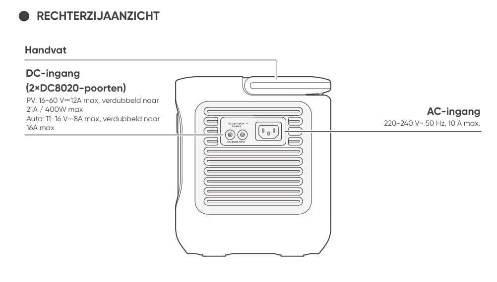</figure>

<h3>RECHTERZIJAANZICHT</h3>

Handvat

DC-ingang (2×DC8020-poorten)

PV: 16-60 V⎓12A max, verdubbeld naar 21A / 400W max Auto: 11-16 V⎓8A max, verdubbeld naar 16A max

AC-ingang

220-240 V~ 50 Hz, 10 A max.

## LCD-SCHERM

<figure>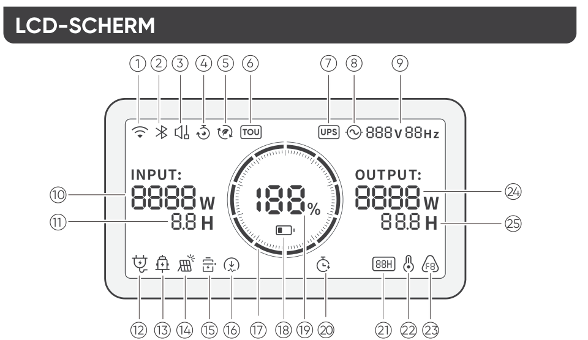</figure>

<table class="manual-table"><tbody>
<tr><th scope="row">1</th><td><strong>Wifi</strong> Aan: Wifi is verbonden. Knipperend: Klaar om met wifi te verbinden. Uit: Wifi is niet verbonden.</td></tr>
<tr><th scope="row">2</th><td><strong>Bluetooth</strong> Aan: Bluetooth is verbonden. Knipperend: Klaar om met Bluetooth te verbinden. Uit: Bluetooth is niet verbonden.</td></tr>
<tr><th scope="row">3</th><td><strong>Stille oplaadmodus</strong> Aan: Het geluid tijdens het opladen wordt aanzienlijk verminderd, terwijl het oplaadvermogen wordt verlaagd en de oplaadsnelheid afneemt. Uit: De stille oplaadmodus is uitgeschakeld. Schakel deze functie in of uit in de Jackery-app. De instelling blijft behouden wanneer het apparaat wordt uitgeschakeld.</td></tr>
<tr><th scope="row">4</th><td><strong>Oplaadplan</strong> Hiermee wordt de oplaadtijd van de Jackery Explorer 1000 aangepast. Geschikt voor situaties met fluctuerende elektriciteitsprijzen en maakt het mogelijk om oplaadplannen te maken op basis van piek- en daluren, waardoor de elektriciteitskosten worden verlaagd. Schakel deze functie in of uit in de Jackery-app. De instelling blijft behouden wanneer het apparaat wordt uitgeschakeld.</td></tr>
<tr><th scope="row">5</th><td><strong>Zelfvoorzienende modus</strong> Maximaliseert het gebruik van zonne-energie en vermindert de afhankelijkheid van het net door opgeslagen zonne-energie voorrang te geven, waardoor de elektriciteitskosten dalen. Het powerstation moet tegelijkertijd op zowel zonnepanelen als op het net worden aangesloten, waarbij het belastingsvermogen wordt beperkt door het bypass-vermogen. Schakel deze functie in of uit in de Jackery-app. De instelling blijft behouden wanneer het apparaat wordt uitgeschakeld.</td></tr>
<tr><th scope="row">6</th><td><strong>TOU-modus</strong> Aan: De TOU-modus is ingeschakeld (standaard back-up SOC: 60%). Tijdens piekperiodes geeft het product prioriteit aan het ontladen van de batterij om piekstroomkosten te verlagen wanneer de opgeslagen energie de back-up SOC overschrijdt. Tijdens dalperiodes laadt het product de batterij op vanuit het net om piekshaving en dalvulling te bereiken. Uit: De TOU-modus is uitgeschakeld. Het product volgt de gebruiksduurstrategie (TOU) niet en werkt volgens de standaardlogica voor stroomvoorziening en opladen. Schakel deze functie in of uit in de Jackery-app. De instelling blijft behouden wanneer het apparaat wordt uitgeschakeld.</td></tr>
<tr><th scope="row">7</th><td><strong>UPS</strong> Aan: Het product werkt in de bypassmodus. De belastingen die zijn aangesloten op de AC-poorten verbruiken stroom van het net in plaats van van het powerstation. Als het net plotseling uitvalt, schakelt het product automatisch binnen 10 ms over op de batterijstroom. Uit: Het product is niet in de bypassmodus. De belastingen die zijn aangesloten op de AC-poorten worden gevoed door de interne batterij van het powerstation.</td></tr>
<tr><th scope="row">8</th><td><strong>Indicator voor AC-voeding</strong> De AC-uitgang (zuivere sinusgolf) is ingeschakeld.</td></tr>
<tr><th scope="row">9</th><td><strong>Uitgangsspanning en -frequentie</strong> Geeft de uitgangsspanning en -frequentie weer wanneer de AC-uitgang is ingeschakeld.</td></tr>
<tr><th scope="row">10</th><td><strong>Invoervermogen</strong> Toont het ingangsvermogen in watt.</td></tr>
<tr><th scope="row">11</th><td><strong>Resterende oplaadtijd</strong> Toont de resterende oplaadtijd.</td></tr>
<tr><th scope="row">12</th><td><strong>Indicator voor opladen via een AC-stopcontact</strong> Het product wordt opgeladen via de AC-ingang met stroomnet.</td></tr>
<tr><th scope="row">13</th><td><strong>Indicator voor opladen via de auto</strong> Het product wordt opgeladen via de DC-ingang (DC8020) met DC 12 V (auto-opladen).</td></tr>
<tr><th scope="row">14</th><td><strong>Zonne-energie-oplaadindicator</strong> Het product wordt opgeladen via de DC-ingang (DC8020) met zonnepanelen.</td></tr>
<tr><th scope="row">15</th><td><strong>Batterijbesparingsmodus</strong> Aan: De Batterijbesparingsmodus is ingeschakeld. Er worden laad- en ontlaadlimieten toegepast om de levensduur van de batterij te verlengen. Uit: De Batterijbesparingsmodus is uitgeschakeld. Schakel deze functie in of uit in de Jackery-app. De instelling blijft behouden wanneer het apparaat wordt uitgeschakeld. Wanneer deze functie is ingeschakeld, voert het product af en toe een volledige laad- en ontlaadcyclus uit om de SOC te kalibreren.</td></tr>
<tr><th scope="row">16</th><td><strong>Maximale laadvermogen</strong> Aan: Het maximale laadvermogen is ingeschakeld in de Jackery-app. Uit: Het maximale laadvermogen is uitgeschakeld in de Jackery-app. De instelling blijft behouden wanneer het apparaat wordt uitgeschakeld.</td></tr>
<tr><th scope="row">17</th><td><strong>Batterijstroom-indicator</strong> Wanneer het product wordt opgeladen, licht de oranje cirkel rond het batterijpercentage geleidelijk op. Wanneer u andere apparaten van stroom voorziet, blijft de oranje cirkel branden.</td></tr>
<tr><th scope="row">18</th><td><strong>Indicator voor laag batterijniveau</strong> Aan: Het batterijniveau is lager dan 20%. Knipperend: Het batterijniveau is lager dan 5%. Uit: Het batterijniveau is hoger dan 20% of het product wordt opgeladen.</td></tr>
<tr><th scope="row">19</th><td><strong>Resterend batterijpercentage</strong> Geeft het resterende batterijpercentage weer.</td></tr>
<tr><th scope="row">20</th><td><strong>Ontladingstimer</strong> Aan: Er is een ontladingstimer ingesteld. Uit: Er is geen ontladingstimer ingesteld. Schakel deze functie in of uit in de Jackery-app. De instelling blijft niet behouden wanneer het apparaat wordt uitgeschakeld.</td></tr>
<tr><th scope="row">21</th><td><strong>Energiebesparingsmodus</strong> Wanneer de AC- of DC-uitgang wordt ingeschakeld door op de Aan/uit-knop voor AC of DC/USB te drukken: Aan: De Energiebesparingsmodus is ingeschakeld. Uit: De Energiebesparingsmodus is uitgeschakeld.</td></tr>
<tr><th scope="row">22</th><td><strong>Indicator voor hoge temperatuur</strong> De beveiliging tegen hoge temperaturen is geactiveerd. Het product kan stoppen met werken totdat de temperatuur weer binnen het normale bedrijfsbereik is.</td></tr>
<tr><th scope="row">22</th><td><strong>Indicator voor lage temperatuur</strong> De beveiliging tegen lege temperaturen is geactiveerd. Het product kan stoppen met werken totdat de temperatuur weer binnen het normale bedrijfsbereik is.</td></tr>
<tr><th scope="row">23</th><td><strong>Foutcode</strong> Er is een productfout opgetreden. Raadpleeg voor details de sectie Probleemoplossing.</td></tr>
<tr><th scope="row">24</th><td><strong>Uitgangsvermogen</strong> Geeft het uitgangsvermogen in watt weer.</td></tr>
<tr><th scope="row">25</th><td><strong>Resterende ontlaadtijd</strong> Geeft de resterende ontlaadtijd weer.</td></tr>
</tbody></table>

## HANDELINGEN

<h3>IN-/UITSCHAKELEN</h3>

<figure>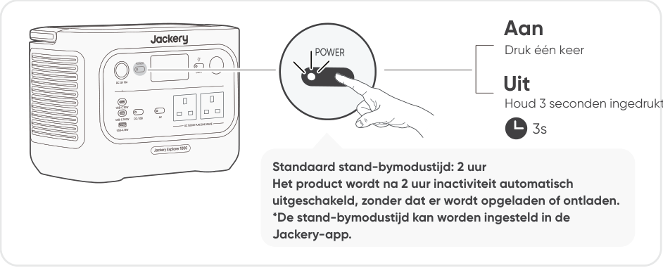</figure>

Aan

Druk één keer

Uit

Houd 3 seconden ingedrukt.

3s

Standaard stand-bymodustijd: 2 uur Het product wordt na 2 uur inactiviteit automatisch uitgeschakeld, zonder dat er wordt opgeladen of ontladen. *De stand-bymodustijd kan worden ingesteld in de Jackery-app.

Wanneer de Energiebesparingsmodus is ingeschakeld, wordt het product na 12 uur automatisch uitgeschakeld als de aan/uit-knop voor AC of DC/USB op AAN staat, maar het product niet wordt opgeladen of ontladen.

<h3>AAN/UIT VOOR AC-UITGANG</h3>

<figure>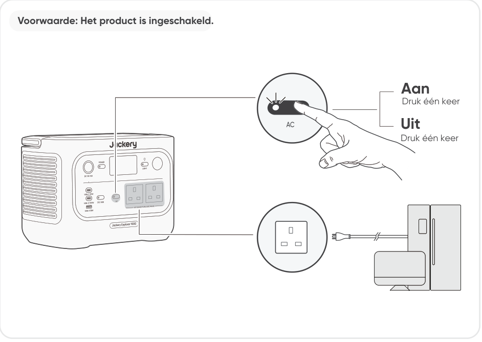</figure>

Voorwaarde: Het product is ingeschakeld.

Aan

Druk één keer

Uit

Druk één keer

<h3>DC/USB-UITGANG AAN/UIT</h3>

<figure>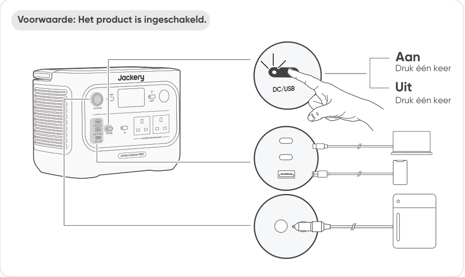</figure>

Voorwaarde: Het product is ingeschakeld.

Aan

Druk één keer

Uit

Druk één keer

<ul>
<li>USB-C 100W is een USB-PD Power Source 3 (PS3)-uitgangspoort met hoog vermogen. Als het aangesloten apparaat of accessoire niet aan de veiligheidsvereisten voldoet, kan er brandgevaar ontstaan. Controleer voordat u deze poorten gebruikt of het aangesloten apparaat of accessoire beschikt over brandbeveiliging.</li>
<li>Sluit de Jackery Explorer 1000 alleen aan op apparaten of accessoires die voldoen aan clausules 6.3, 6.4 en 6.5 van IEC/EN/UL 62368-1 (of andere gelijkwaardige normen).</li>
<li>Gebruik de USB-C naar USB-C 5A-kabel (20 V DC/5A, 100 W) voor maximaal uitgangsvermogen.</li>
</ul>

<h3>OPGELET</h3>

Het product kan uw auto-accu opladen met behulp van de Jackery 12 V-kabel voor het opladen van auto-accu&#x27;s, die apart verkrijgbaar is op onze website.

<ul>
<li>De DC-12V-poort is alleen compatibel met 12V-autoaccu&#x27;s en niet geschikt voor 24 V-systemen.</li>
<li>Start de auto niet terwijl het product via de 12 V-DC-uitgangspoort de autoaccu oplaadt, aangezien dit het product kan beschadigen.</li>
<li>Deze functie is uitsluitend bedoeld voor noodgevallen en kan een volledig ontladen of beschadigde autoaccu niet opladen.</li>
</ul>

<h3>OPGELET</h3>

<h3>ENERGIEBESPARINGSMODUS</h3>

Om onnodig batterijverbruik te voorkomen wanneer u vergeet de uitgang uit te schakelen, schakelt het product standaard de energiebesparende modus in. Wanneer de AC- of DC/USB-uitgang wordt ingeschakeld, wordt het pictogram voor de Energiebesparingsmodus op het LCD-scherm weergegeven. In deze modus wordt, als er geen apparaat is aangesloten of het stroomverbruik van het aangesloten apparaat onder een bepaalde drempelwaarde ligt (25 W voor AC-uitgang of 2 W voor DC/USB-uitgang), de betreffende uitgang na de ingestelde tijd automatisch uitgeschakeld. De standaardinstelling is 12 uur. De duur van de Energiebesparingsmodus kan in de Jackery-app worden ingesteld op 1H, 2H, 8H, 12H of 24H. Als dit is ingesteld op &#x27;Nooit uitschakelen&#x27;, wordt de Energiebesparingsmodus uitgeschakeld.

Om de Energiebesparingsmodus uit te schakelen, houdt u zowel de Aan/uit-knop voor AC als de hoofd AAN/UIT-knop langer dan 3 seconden ingedrukt. Zodra de Energiebesparingsmodus is uitgeschakeld, verschijnt het pictogram niet langer op het lcd-scherm en zal het product de AC- of USB-uitgang niet automatisch uitschakelen. Wanneer u apparaten met een laag vermogen van stroom voorziet (AC ≤ 25 W of DC/USB ≤ 2 W), schakelt u de Energiebesparingsmodus uit om te voorkomen dat de uitgang tijdens het gebruik automatisch wordt uitgeschakeld.

<figure>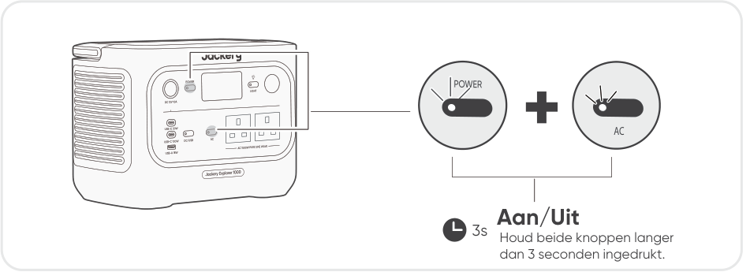</figure>

<h3>AC</h3>

3s Houd beide knoppen langer dan 3 seconden ingedrukt. Aan/Uit

De Energiebesparingsmodus hervat de vorige status na het inschakelen. Voor het wijzigen van de modus is handmatig schakelen vereist.

<h3>OPMERKING</h3>

<h3>LED-LAMP AAN/UITSCHAKELEN</h3>

De LED-lamp heeft twee modi: Lichtmodus en SOS-modus. Houd in elke modus de

<figure>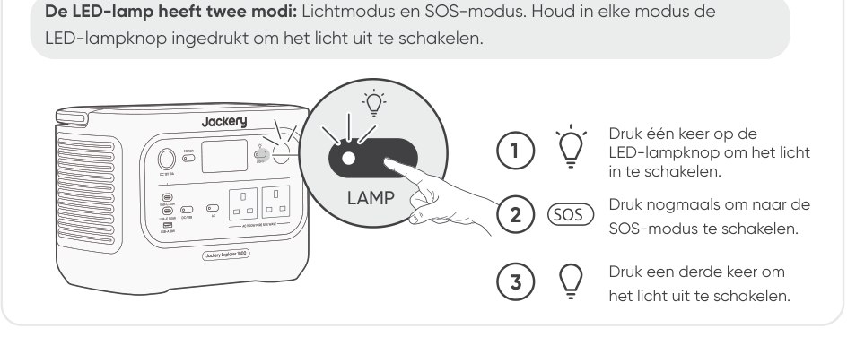</figure>

LED-lampknop ingedrukt om het licht uit te schakelen.

Druk één keer op de LED-lampknop om het licht in te schakelen.

<h3>LAMP</h3>

Druk nogmaals om naar de SOS-modus te schakelen.

<h3>2 SOS</h3>

Druk een derde keer om het licht uit te schakelen.

<h3>LCD-SCHERM</h3>

<figure></figure>

<table class="manual-table"><tbody>
<tr><th scope="row">Kort inschakelen</th><td><strong>Inschakelen</strong> Druk op de AAN/UIT-knop of wanneer het product oplaadt.</td></tr>
<tr><th scope="row">Kort inschakelen</th><td><strong>Uitschakelen</strong> Druk op de AAN/UIT-knop.</td></tr>
<tr><th scope="row">Kort inschakelen</th><td><strong>Automatisch uitschakelen</strong> Het LCD-scherm schakelt automatisch uit en gaat in slaapstand na 2 minuten inactiviteit.</td></tr>
<tr><th scope="row">Continu inschakelen (bij laden of ontladen)</th><td><strong>Inschakelen</strong> Druk tweemaal op de AAN/UIT-knop wanneer het product is ingeschakeld.</td></tr>
<tr><th scope="row">Continu inschakelen (bij laden of ontladen)</th><td><strong>Uitschakelen</strong> Druk op de Aan/Uit-knop.</td></tr>
<tr><th scope="row">Continu inschakelen (bij laden of ontladen)</th><td><strong>Automatisch uitschakelen</strong> Het LCD-scherm schakelt automatisch uit na 2 uur inactiviteit.</td></tr>
</tbody></table>

U kunt de schermweergavemodus ook instellen in de Jackery-app.

<h3>HERVATTINGSFUNCTIE VOOR AC- EN DC-UITGANGEN</h3>

Deze functie onthoudt de uitgangsstatus en hervat automatisch de AC- en DC-uitgangen onder gedefinieerde voorwaarden.

<h4>Voorwaarden voor automatisch hervatten</h4>
<ul>
<li>Inschakelen/herstarten na uitschakelen of herstarten</li>
<li>Batterij-SOC ≥ ontlaadlimiet +10% na het bereiken van de limiet</li>
<li>OTA-upgrade voltooid</li>
</ul>
<h4>Voorwaarden voor niet-automatisch hervatten</h4>
<ul>
<li>Handmatige uitvoer uitschakelen (knop/App)</li>
<li>Uitschakeling van de uitgang door Energiebesparingsmodus</li>
<li>Uitschakeling van de uitgang door geactiveerde beveiliging</li>
<li>Uitschakeling van de uitgang door de ontladingstimer</li>
</ul>

<h3>TOETSCOMBINATIES</h3>

<table class="manual-table"><thead><tr>
<th scope="col">Knoppen</th>
<th scope="col">BEDIENING</th>
<th scope="col">Functie</th>
</tr></thead><tbody>
<tr><th scope="row">Aan/Uit-knop + Aan/uit-knop voor AC</th><td>3s Houd beide knoppen 3 seconden ingedrukt</td><td>De Energiebesparingsmodus in-/uitschakelen</td></tr>
<tr><th scope="row">Aan/Uit-knop + Aan/uit-knop voor DC/USB</th><td>3s Houd beide knoppen 3 seconden ingedrukt</td><td>Reset wifi en Bluetooth</td></tr>
<tr><th scope="row">Aan/uit-knop voor AC + Aan/uit-knop voor DC/USB</th><td>1 seconde Houd beide knoppen 1 seconde ingedrukt</td><td>Wifi en Bluetooth in-/uitschakelen</td></tr>
<tr><th scope="row">Aan/Uit-knop + LED-lampknop</th><td>1 seconde Houd beide knoppen 1 seconde ingedrukt</td><td>De Noodoplaadmodus in-/uitschakelen</td></tr>
</tbody></table>

## ONONDERBROKEN STROOMVOORZIENING (UPS)

Sluit het product met de AC-oplaadkabel aan op een stopcontact, druk vervolgens op de Aan/uit-knop voor AC en voorzie uw apparaten tegelijkertijd van stroom.

Een ononderbroken stroomvoorziening (UPS) is een type voortdurend stroomvoorzieningssysteem dat automatisch back-upstroom levert aan een belasting wanneer de netstroom uitvalt. Bij een plotseling verlies van stroomnet schakelt de Jackery Explorer 1000 automatisch binnen 10 ms over op opgeslagen stroom om uw apparaten draaiende te houden. In de UPS-modus bedraagt de piekuitgang van het apparaat 1500W zonder stroomuitval. Omdat gelijktijdig laden/ontladen is ingeschakeld in de Bypass-modus, is het werkelijke uitgangsvermogen in deze modus lager dan het nominale uitgangsvermogen. Tijdens stroomuitval keert het echter terug naar het nominale uitgangsvermogen.

<figure></figure>

<ul>
<li>Dit product ondersteunt geen omschakeling binnen 0 ms. Sluit dit apparaat niet aan op apparatuur die een voeding met 0 ms omschakeltijd vereist, zoals gegevensservers of werkstations.</li>
<li>Test vóór gebruik meerdere keren of het product compatibel is met uw apparaat.</li>
<li>Sluit geen belastingen aan die het maximale uitgangsvermogen van het product overschrijden. Anders wordt de overbelastingsbeveiliging geactiveerd.</li>
</ul>

<h3>OPGELET</h3>

Gebruik dit product niet voor toepassingen zoals gegevensservers of medische apparaten, waarbij een storing levensgevaar kan opleveren of aanzienlijke materiële schade kan veroorzaken. Voor de volgende apparatuur kan een verlies van stroomvoorziening tijdens gebruik ernstige schade aan de persoonlijke veiligheid of eigendommen veroorzaken:

<ul>
<li>Medische apparaten en andere apparatuur die nauw verband houden met de levensveiligheid.</li>
<li>Kritieke apparatuur zoals maatschappelijke infrastructuur en openbare diensten.</li>
<li>Bedrijfskritieke ondernemingsapparatuur, enz. Personen die een pacemaker dragen (personen met een pacemakerimplantaat) mogen dit product niet gebruiken.</li>
</ul>

<h3>WAARSCHUWING</h3>

## OPLADEN

Groene energie eerst: Wij raden aan om eerst groene energie te gebruiken. Dit product ondersteunt twee modi voor opladen tegelijkertijd: Opladen via zonnepanelen en opladen een AC-stopcontact. Wanneer het opladen via een AC-stopcontact en het opladen via zonnepanelen tegelijkertijd zijn ingeschakeld, geeft het product prioriteit aan het opladen via zonnepanelen en worden beide methoden gebruikt om de batterij te laden met het maximaal toegestane vermogen.

Laad het product voor het eerste gebruik volledig op.

<ul>
<li>De aanbevolen oplaadtemperatuur voor het product ligt tussen 0 °C en 45 °C, en de ontlaadtemperatuur tussen -10 °C en 45 °C.</li>
</ul>

<h3>OPMERKING</h3>

<ul>
<li>Het gebruik van het product buiten dit temperatuurbereik kan de laad- en ontlaadmogelijkheden beperken of zelfs voorkomen dat het product kan opladen of ontladen.</li>
</ul>

<ul>
<li>Het oplaadvermogen en de batterijcapaciteit van het product kunnen variëren als gevolg van verschillende temperaturen.</li>
</ul>

<h3>OPLADEN VIA AC-STOPCONTACT</h3>

<figure></figure>

Sluit de AC-oplaadkabel aan op de AC-ingangspoort van het product en op een stopcontact.

Zorg ervoor dat de AC-oplaadkabel volledig en correct in de AC-ingangspoort is gestoken. Een onvolledige verbinding kan instabiele stroom, oververhitting, slecht contact of apparaatstoringen veroorzaken. OPGELET

Noodoplaadmodus

In deze modus kunt u het draagbare powerstation snel opladen via de AC-oplaadmethode. Deze noodlaadfunctie kan via de Jackery-app worden geactiveerd of gedeactiveerd. In de noodoplaadmodus knippert het ronde indicatielampje voor de laadstatus (SOC) sneller.

* Om de levensduur van de batterij te maximaliseren, wordt aangeraden om deze op normale snelheid op te laden. Gebruik de noodoplaadmodus alleen wanneer dat nodig is. Het wordt niet aanbevolen voor normaal, langdurig gebruik.

<h3>OPLADEN VIA ZONNEPANELEN (APART VERKRIJGBAAR)</h3>

De Jackery Explorer 1000 heeft twee DC8020-ingangspoorten en is compatibel met de Jackery-zonnepanelen.

<figure>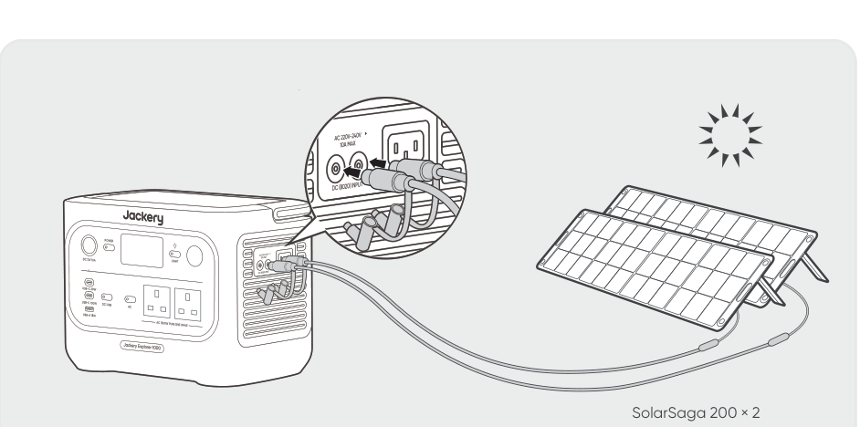</figure>

SolarSaga 200 × 2

Als er op één DC8020-ingangspoort twee zonnepanelen tegelijk moeten worden aangesloten, raadpleeg dan de onderstaande afbeelding voor het opladen via de zonnepaneel-connector (deze is apart verkrijgbaar en wordt niet standaard meegeleverd).

<figure>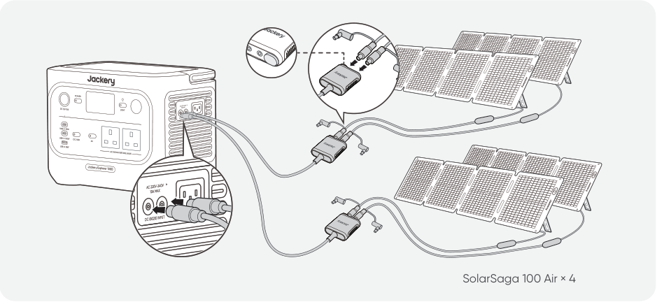</figure>

SolarSaga 100 Air × 4

<h3>OPGELET</h3>

Op één DC8020-ingangspoort kunnen maximaal twee zonnepanelen worden aangesloten.

Zorg ervoor dat de ingangsspanning van beide DC-ingangspoorten dezelfde is. Als u dit niet doet, kan het product beschadigd raken. Bijvoorbeeld:

<ul>
<li>Gebruik hetzelfde model van en hetzelfde aantal aan Jackery-zonnepanelen wanneer u zonnepanelen aansluit op beide DC8020-ingangspoorten.</li>
<li>Laad het product niet tegelijkertijd op via zowel een autolader als een zonnepaneel. Hierdoor kan de autozekering doorbranden of leiden tot een laadstoring.</li>
</ul>

<h3>OPGELET</h3>

Het wordt aanbevolen om het product op te laden met het Jackery-zonnepaneel. Zorg ervoor dat de open-klemspanning (Voc) van het zonnepaneel binnen het DC-ingangsbereik (16 V-60 V) van de Jackery Explorer 1000 ligt. Jackery is niet verantwoordelijk voor schade of verlies als gevolg van het gebruik van zonnepanelen van derden.

<h3>OPLADEN VIA EEN AUTO-OPLADER (AFZONDERLIJK VERKRIJGBAAR)</h3>

Dit product kan worden opgeladen met een 12 V-auto-oplader. Zorg ervoor dat de autolader en de 12 V-aansluiting in de auto (sigarettenaansteker) goed zijn aangesloten.

*De oplaadkabel voor de auto is apart verkrijgbaar.

<figure>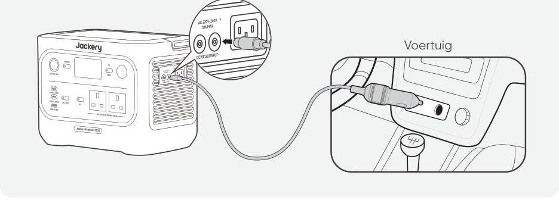</figure>

Voertuig

<ul>
<li>Start het voertuig voordat u uw powerstation oplaadt.</li>
<li>Als u met uw voertuig op oneffen wegen rijdt, is het verboden de autolader te gebruiken om niet-standaard werking te voorkomen. Het bedrijf is niet aansprakelijk voor enig verlies of schade als gevolg van niet-standaard gebruik.</li>
<li>Opladen via de auto is alleen van toepassing op voertuigen met 12 V DC, niet op 24 V DC. Laad dit product niet op in een voertuig met 24 V om persoonlijk letsel en materiële schade te voorkomen.</li>
</ul>

<h3>OPGELET</h3>

## OPSLAG

Bewaar het product op een droge, schone plaats met voldoende ventilatie. Opslagtemperatuur en -vochtigheid:

<ul>
<li>1 maand: -20°C tot 45°C (0-60%RH)</li>
<li>3 maanden: 0°C tot 45°C (0-60%RH)</li>
<li>12 maanden: 0°C tot 25°C (0-60%RH) Als dit product gedurende langere tijd (3 maanden - 6 maanden) met een lege batterij wordt bewaard, kan het zijn dat het niet meer kan worden opgeladen. Om dit te voorkomen en de batterij in goede conditie te houden, is het aan te raden om het product elke drie maanden te controleren en op te laden, waarbij minstens één keer per 6 tot 12 maanden een volledige laad- en ontlaadcyclus moet worden uitgevoerd.</li>
</ul>

## PROBLEEMOPLOSSING

Als een van de volgende foutcodes verschijnt, volg dan de vermelde corrigerende acties om het probleem op te lossen. Als het probleem aanhoudt, neem dan contact op met Jackery-klantenondersteuning.

<table class="manual-table"><thead><tr>
<th scope="col">Foutcode</th>
<th scope="col">Oplossingsmaatregelen</th>
</tr></thead><tbody>
<tr><th scope="row">F0</th><td>Herstart het product.</td></tr>
<tr><th scope="row">F1</th><td>Herstart het product.</td></tr>
<tr><th scope="row">F2</th><td>Herstart het product.</td></tr>
<tr><th scope="row">F3</th><td>Herstart het product.</td></tr>
<tr><th scope="row">F4</th><td>Sluit het product aan op belastingen om de batterij te ontladen totdat de fout verdwijnt.</td></tr>
<tr><th scope="row">F5</th><td>Laad het product op via zonnepanelen of een AC-stopcontact totdat de fout verdwijnt.</td></tr>
<tr><th scope="row">F6</th><td>1. Wacht tot het net genormaliseerd is voordat u het product via een AC-stopcontact oplaadt. 2. Controleer of de luchtinlaat- en uitlaatopeningen geblokkeerd zijn; zorg voor 0,66 ft (20 cm) ruimte aan beide zijden van het product. 3. Plaats het product op een locatie die niet wordt blootgesteld aan direct zonlicht of hoge omgevingstemperaturen. 4. Koppel alle belastingen van het product los. Laat het product inactief en wacht tot de fout verdwijnt. 5. Herstart het product.</td></tr>
<tr><th scope="row">F7</th><td>1. Koppel alle DC-ingangen los van het product. 2. Als u het product via een zonnepaneel oplaadt, controleer dan de open-klemspanning (VOC) van het aangesloten zonnepaneel. Het product staat een maximale DC-ingangsspanning van 60 V toe. 3. Start het product opnieuw op en houd het inactief. Wacht tot de fout verdwijnt.</td></tr>
<tr><th scope="row">F8</th><td>Neem contact op met de Jackery-klantenondersteuning.</td></tr>
<tr><th scope="row">F9</th><td>Verwijder de belasting die op de USB-poorten van het product is aangesloten. Wacht tot de fout verdwijnt.</td></tr>
<tr><th scope="row">FE</th><td>Neem contact op met de Jackery-klantenondersteuning.</td></tr>
</tbody></table>

## SPECIFICATIES

<table class="manual-table"><tbody>
<tr><th colspan="2" scope="colgroup">ALGEMENE INFORMATIE</th></tr>
<tr><th scope="row">Productnaam</th><td>Jackery Explorer 1000</td></tr>
<tr><th scope="row">Modelnummer</th><td>JE-1000F</td></tr>
<tr><th scope="row">Capaciteit</th><td>1024 Wh (20 Ah/51,2 V DC)</td></tr>
<tr><th scope="row">Celchemie</th><td>LiFePO4</td></tr>
<tr><th scope="row">Gewicht</th><td>Ongeveer 10,6 kg</td></tr>
<tr><th scope="row">Afmetingen</th><td>31,4 x 20,1 x 23,4 cm</td></tr>
<tr><th scope="row">Levenscyclus</th><td>4000 cycli tot 70%+ capaciteit</td></tr>
<tr><th colspan="2" scope="colgroup">INGANGSPOORTEN</th></tr>
<tr><th scope="row">1 × AC-ingang</th><td>Oplaadmodus: 220-240 V~50 Hz, max. 10 A</td></tr>
<tr><th scope="row">2 × DC8020-poorten</th><td>11 V-16 V⎓8 A max., dubbel tot 8 A max. 16 V-60 V⎓12 A max., dubbel tot 21 A/400 W max.</td></tr>
<tr><th colspan="2" scope="colgroup">UITGANGSPOORTEN</th></tr>
<tr><th scope="row">2 × AC</th><td>230 V~ 50 Hz, 6,5 A max., 1500 W nominaal per poort, 1500 W in totaal, 3000 W piekvermogen</td></tr>
<tr><th scope="row">AC-uitgang in Bypassmodus ①</th><td>220 V-240 V~50 Hz, 1500 W</td></tr>
<tr><th scope="row">1 x USB-C 30 W</th><td>30 W Max, 5 V⎓3 A, 9 V⎓3 A, 12 V⎓2,5 A, 15 V⎓2 A, 20 V⎓1,5 A</td></tr>
<tr><th scope="row">1 x USB-C 100 W</th><td>100 W Max, 5 V⎓3 A, 9 V⎓3 A, 12 V⎓3 A, 15 V⎓3 A, 20 V⎓5 A</td></tr>
<tr><th scope="row">1 × USB-A</th><td>18 W Max, 5-6 V⎓3 A, 6-9 V⎓2 A, 9-12 V⎓1,5 A</td></tr>
<tr><th scope="row">1 × DC 12 V-poort</th><td>12 V⎓10 A Max</td></tr>
<tr><th colspan="2" scope="colgroup">BEDRIJFSTEMPERATUUR</th></tr>
<tr><th scope="row">Oplaadtemperatuur</th><td>0 °C tot 45 °C</td></tr>
<tr><th scope="row">Ontlaadtemperatuur</th><td>-10 °C tot 45 °C</td></tr>
</tbody></table>

※ USB Type-C® en USB-C® zijn geregistreerde handelsmerken van USB Implementers Forum.

①. Het product kan de batterij opladen via het AC-stopcontact terwijl het tegelijkertijd stroom levert via de AC-uitgangspoorten.

## GARANTIE

Deze garantie geldt alleen voor klanten die aankopen bij de officiële Jackery-website, Jackery-merkplatformen van derden of lokale erkende dealers.

*De garantieperiode en details kunnen variëren volgens lokale wetten, voorschriften en erkende dealers.

<h3>Beperkte garantie</h3>

Jackery garandeert aan de oorspronkelijke consument-koper dat het Jackery-product vrij is van fabricage- en materiaalfouten bij normaal consumentengebruik gedurende de toepasselijke garantieperiode, zoals vermeld in de sectie &#x27;Garantieperiode&#x27; hieronder, onder voorbehoud van de hieronder uiteengezette uitsluitingen. In deze garantieverklaring worden de volledige en uitsluitende garantieverplichtingen van Jackery uiteengezet. Wij aanvaarden geen andere aansprakelijkheid, noch machtigen wij iemand om namens ons enige andere aansprakelijkheid te aanvaarden in verband met de verkoop van onze producten.

<h3>Garantieperiode</h3>
<h3>3 JAAR — Standaardgarantie</h3>

De standaard garantieperiode voor de Jackery Explorer 1000 is 36 maanden. In alle gevallen gaat de garantieperiode in op de datum van aankoop door de oorspronkelijke consument-koper. Het aankoopbewijs van de eerste consument-koper, of ander redelijk documentair bewijs, is vereist om de startdatum van de garantieperiode vast te stellen.

<h3>2 JAAR — Verlengde garantie</h3>

Om de garantieverlenging te activeren, moet u uw product online registreren of contact opnemen met onze klantenservice via hello.eu@jackery.com om de standaardgarantieperiode te verlengen.

<h3>Ruilen</h3>

Jackery vervangt (op kosten van Jackery) elk Jackery-product dat gedurende de toepasselijke garantieperiode niet functioneert als gevolg van een fabricage- of materiaalfout. Een vervangend product neemt de resterende garantie van het originele product over.

<h3>Beperkt tot de oorspronkelijke koper</h3>

De garantie op Jackery&#x27;s product is beperkt tot de oorspronkelijke consument-koper en is niet overdraagbaar aan een volgende eigenaar.

<h3>Uitsluitingen</h3>

De garantie van Jackery is niet van toepassing op:

<ul>
<li>Elk product met onjuist gebruik, misbruik, wijziging, ongeluksschade of gebruik anders dan normaal consumentengebruik, zoals toegestaan in de huidige productliteratuur van Jackery.</li>
<li>Een poging tot reparatie door iemand anders dan een erkend servicecentrum.</li>
<li>Elk product dat via een online veilinghuis is gekocht.</li>
<li>De garantie van Jackery is niet van toepassing op de batterijcel, tenzij u de batterijcel binnen zeven dagen na aankoop van het product volledig oplaadt en daarna ten minste één keer per zes maanden.</li>
</ul>
<h3>Interpretatierechten</h3>

Jackery behoudt zich het recht voor om het bovenstaande beleid voor service na verkoop definitief te interpreteren.

## APP INSTELLEN

<h3>1. Download de app en log in</h3>

Zoek naar &quot;Jackery&quot; in Google Play of de App Store om de app te installeren. Daarna kunt u zich registreren en inloggen.

Of scan de QR-code hieronder om de app te downloaden en te installeren.

<figure></figure>
<h3>2. Apparaat toevoegen</h3>

2.1 Klik op de + -knop om uw apparaat toe te voegen;

2.2 Druk op de aan/uit-knop op het apparaat om het in te schakelen; de wifi- en Bluetooth-pictogrammen op het apparaat knipperen om aan te geven dat het apparaat zich in de netwerkconfiguratiemodus bevindt. Tik op de knop &#x27;Pictogram knippert&#x27; en geef de app toestemming om verbinding te maken met apparaten in de buurt en schakel de Bluetooth-machtigingen in.

<figure>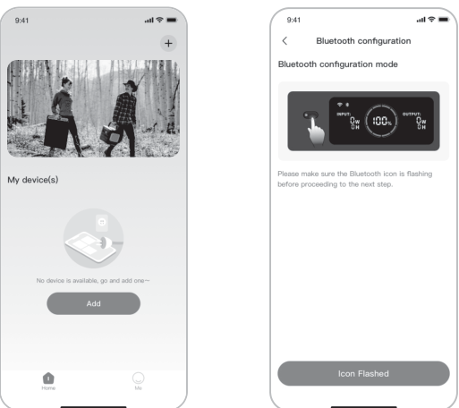</figure>
<figure>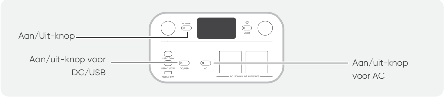</figure>

2.3 Nadat u op het pictogram van het gevonden apparaat hebt getikt, maakt de app automatisch verbinding met het apparaat via Bluetooth.

<h3>OPMERKING</h3>

Als tijdens het bindingsproces &quot;het apparaat is al gebonden&quot; wordt gemeld, kunnen de volgende twee methoden worden gebruikt voor de verbinding:

<ul>
<li>De eigenaar van het apparaat deelt dit apparaat via de app met andere gebruikers.</li>
<li>Houd de AAN/UIT-knop en de DC/USB-knop 3 seconden ingedrukt om de wifi en Bluetooth van het apparaat te resetten en het apparaat vervolgens opnieuw te koppelen.</li>
</ul>

2.4 Nadat het apparaat succesvol is verbonden, voert u uw wifi-wachtwoord in en tikt u op de OK-knop.

<h3>OPMERKING</h3>

Selecteer een wifi-netwerk in de 2,4 GHz-band. Het apparaat ondersteunt geen wifi-netwerk in de 5 GHz-band.

2.5 Nadat het apparaat succesvol aan de app is toegevoegd, is het wifi-pictogram op het apparaat altijd aan.

<figure>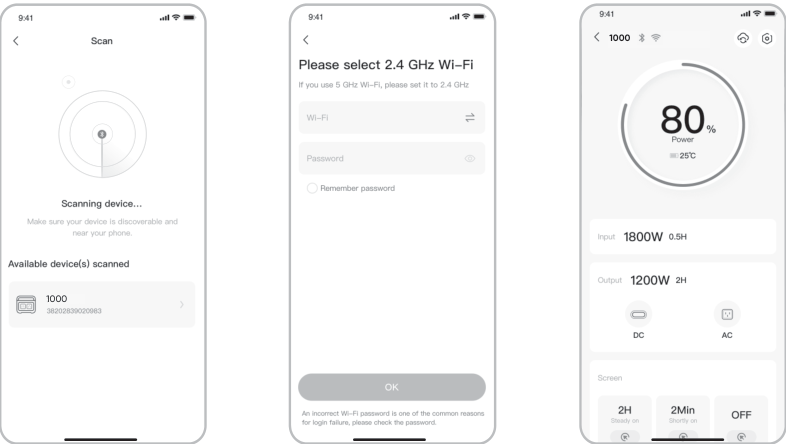</figure>

De bovenstaande schermafbeeldingen zijn alleen ter referentie.

<h3>OPGELET</h3>

De Jackery-app kan via bluetooth slechts met één powerstation tegelijk verbinding maken. Wanneer u terugkeert naar de apparaatlijst, wordt de Bluetooth-verbinding automatisch verbroken. Tik opnieuw op het Powerstation in de lijst om automatisch opnieuw verbinding te maken.

<h3>3. Apparaat ontkoppelen</h3>

Klik op het instellingenpictogram rechtsboven in het hoofdscherm van het apparaat om de instellingenpagina te openen en klik onderaan op de knop &#x27;Ontkoppelen&#x27; om het apparaat te ontkoppelen.

<h3>4. Opmerkingen</h3>

4.1 Wifi en Bluetooth inschakelen:

<ul>
<li>Nadat het apparaat is ingeschakeld, worden wifi en Bluetooth automatisch ingeschakeld en lichten de wifi- en Bluetooth-pictogrammen op het scherm op.</li>
<li>Houd de Aan/uit-knop voor DC/USB en de Aan/uit-knop voor AC tegelijkertijd ingedrukt totdat de wifi- en Bluetooth-pictogrammen op het scherm oplichten.</li>
</ul>

4.2 Wifi en Bluetooth uitschakelen

<ul>
<li>Houd de Aan/uit-knop voor DC/USB en de Aan/uit-knop voor AC tegelijkertijd ingedrukt totdat de wifi- en Bluetooth-pictogrammen op het scherm uitgaan.</li>
</ul>

4.3 Wifi en Bluetooth resetten

<ul>
<li>Houd de AAN/UIT-knop en de Aan/uit-knop voor DC/USB tegelijkertijd 3 seconden ingedrukt om wifi en Bluetooth te resetten naar de fabrieksinstellingen. Het gekoppelde app-account wordt ontkoppeld.</li>
</ul>

## EU declaration and manufacturer

Shenzhen Hello Tech Energy Co., Ltd. hereby declares that this: Jackery Explorer 1000 with Bluetooth and Wi-Fi JE-1000F is in compliance with the essential requirements and other relevant provisions of the Directive 2014/53/EU, 2011/65/EU+(EU)2015/863, The full text of the EU declaration of conformity is available at the following internet address: https://de.jackery.com/pages/user-guides

MANUFACTURER: SHENZHEN HELLO TECH ENERGY CO.,LTD. Address: F2-3, Bldg. 7, Jiaanda Science and technology industrial park factory, the east side of Huafan Road, Tongsheng Community, Dalang Street, Longhua District, Shenzhen, Guangdong, China

sales@hello-tech.com +86 400 668 9293 www.hello-tech.com

