# Jackery Explorer 1000 — Português

Model: JE-1000F · hello.eu@jackery.com

## Introduction

Parabéns pelo seu novo Jackery Explorer 1000. Leia este manual atentamente antes de usar o produto, especialmente as precauções relevantes, para garantir o uso adequado. Mantenha este manual em um local acessível para consulta frequente.

Em conformidade com leis e regulamentos, o direito de interpretação final deste documento e de todos os documentos relacionados a este produto pertence à Empresa. Embora tenham sido envidados todos os esforços para garantir a precisão deste manual, a Jackery não assume nenhuma responsabilidade por quaisquer erros que possam ocorrer.

Observe que não serão enviadas novas notificações em caso de atualização, revisão ou encerramento. Para obter a versão mais recente dos manuais do produto, visite support.jackery.com.

* As imagens são apenas para referência. Consulte o produto real. IMPORTANTE

## Contents

<nav aria-label="Chapters"><ul><li><a href="#safety">INFORMAÇÕES IMPORTANTES DE SEGURANÇA</a></li><li><a href="#symbols">SIGNIFICADO DOS SÍMBOLOS</a></li><li><a href="#in_the_box">CONTEÚDO DA EMBALAGEM</a></li><li><a href="#product_overview">VISÃO GERAL DO PRODUTO</a></li><li><a href="#lcd_display">DISPLAY LCD</a></li><li><a href="#operations">OPERAÇÕES</a></li><li><a href="#ups">FONTE DE ALIMENTAÇÃO ININTERRUPTA (UPS)</a></li><li><a href="#charging">CARREGANDO</a></li><li><a href="#storage">ARMAZENAMENTO</a></li><li><a href="#troubleshooting">SOLUÇÃO DE PROBLEMAS</a></li><li><a href="#specifications">ESPECIFICAÇÕES</a></li><li><a href="#warranty">GARANTIA</a></li><li><a href="#app_setup">CONFIGURAÇÃO DO APLICATIVO</a></li></ul></nav>

## INFORMAÇÕES IMPORTANTES DE SEGURANÇA

<h3>INSTRUÇÕES RELATIVAS AO RISCO DE INCÊNDIO, CHOQUE ELÉTRICO OU LESÕES PESSOAIS</h3>

Sempre siga estas precauções básicas ao usar este produto.

<ul>
<li>Leia todas as instruções antes de usar o produto.</li>
</ul>

<ul>
<li>Não permita que crianças brinquem com o produto. É necessária supervisão rigorosa quando o produto for usado perto de crianças.</li>
</ul>

<ul>
<li>O uso de acessórios não recomendados ou não comercializados por fabricantes profissionais pode causar risco de choque elétrico.</li>
</ul>

<ul>
<li>Quando o produto não estiver em uso, desconecte o plugue de energia da tomada do produto.</li>
</ul>

<ul>
<li>Não desmonte o produto, pois isso pode resultar em riscos imprevisíveis, como incêndio, explosão ou choque elétrico.</li>
</ul>

<ul>
<li>Não utilize o produto com cabos, plugues ou cabos de saída danificados, pois isso pode causar choque elétrico.</li>
</ul>

<ul>
<li>Para garantir a circulação adequada de ar, mantenha as aberturas de ventilação do produto desobstruídas. A área onde o produto é utilizado deve ter fluxo de ar adequado, em um ambiente fresco e seco, para evitar o superaquecimento.</li>
</ul>

O carregamento em espaços úmidos ou com pouca ventilação pode causar riscos à segurança.

A água pode causar curtos-circuitos ou danos ao carregador, gerando riscos à segurança.

<ul>
<li>Não exponha o produto ao fogo, altas temperaturas, luz solar direta ou ambientes de calor intenso, como dentro de um veículo estacionado. Tal exposição pode resultar em incêndio ou explosão.</li>
</ul>

<h3>INSTRUÇÕES DE MANUTENÇÃO DO USUÁRIO</h3>

Durante o ciclo de vida de produtos de armazenamento de energia, é esperado certo grau de degradação da capacidade e da energia. À medida que o número de ciclos de carga e descarga aumenta e o tempo de armazenamento se prolonga, essa degradação se intensifica gradualmente, o que é um fenômeno normal consistente com o envelhecimento natural das células da bateria.

## SIGNIFICADO DOS SÍMBOLOS

<table class="manual-table"><thead><tr>
<th scope="col">Símbolo</th>
<th scope="col">Significado</th>
</tr></thead><tbody>
<tr><th scope="row">AVISO</th><td>Práticas perigosas que podem resultar em lesões graves, morte e/ou danos materiais.</td></tr>
<tr><th scope="row">CUIDADO</th><td>Práticas perigosas que podem resultar em lesões pessoais e/ou danos materiais.</td></tr>
<tr><th scope="row">NOTA</th><td>Práticas perigosas que podem resultar em danos ao equipamento, perda de dados, deterioração do desempenho ou resultados imprevistos.</td></tr>
<tr><th scope="row">DICA</th><td>Complementa informações importantes ou dicas de operação no texto.</td></tr>
</tbody></table>

<figure>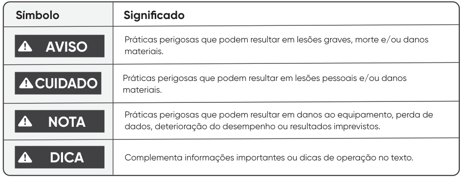</figure>

<figure>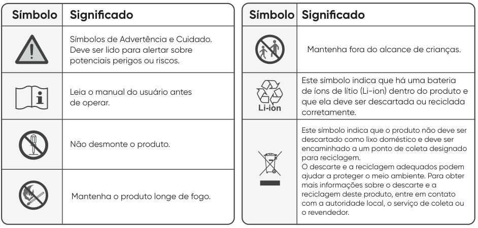</figure>

<table class="manual-table"><thead><tr>
<th scope="col">Símbolo</th><th scope="col">Significado</th>
</tr></thead><tbody>
<tr><th scope="row"></th><td>Símbolos de Advertência e Cuidado. Deve ser lido para alertar sobre potenciais perigos ou riscos.</td></tr>
<tr><th scope="row"></th><td>Leia o manual do usuário antes de operar.</td></tr>
<tr><th scope="row"></th><td>Não desmonte o produto.</td></tr>
<tr><th scope="row"></th><td>Mantenha o produto longe de fogo.</td></tr>
<tr><th scope="row"></th><td>Mantenha fora do alcance de crianças.</td></tr>
<tr><th scope="row"></th><td>Este símbolo indica que há uma bateria de íons de lítio (Li-ion) dentro do produto e que ela deve ser descartada ou reciclada corretamente.</td></tr>
<tr><th scope="row"></th><td>Este símbolo indica que o produto não deve ser descartado como lixo doméstico e deve ser encaminhado a um ponto de coleta designado para reciclagem. O descarte e a reciclagem adequados podem ajudar a proteger o meio ambiente. Para obter mais informações sobre o descarte e a reciclagem deste produto, entre em contato com a autoridade local, o serviço de coleta ou o revendedor.</td></tr>
</tbody></table>

## CONTEÚDO DA EMBALAGEM

<figure>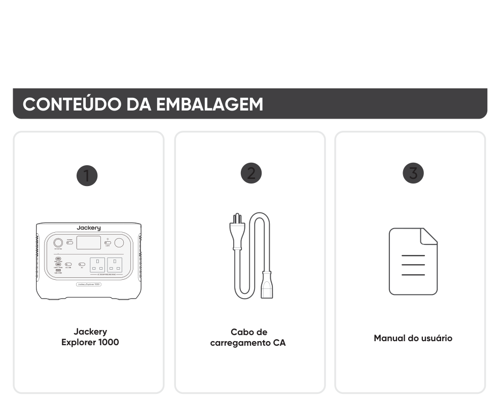</figure>

2 3

Jackery Explorer 1000

Cabo de carregamento CA

Manual do usuário

O cabo de carregamento veicular não está incluído, mas está disponível para compra separadamente em nosso site. Para obter assistência, entre em contato com o atendimento ao cliente da Jackery.

<h3>DICAS</h3>

## VISÃO GERAL DO PRODUTO

<figure>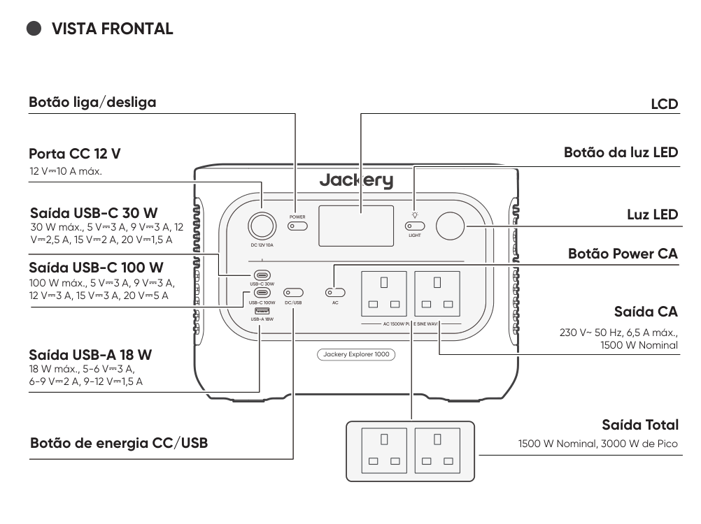</figure>

<h3>VISTA FRONTAL</h3>

Botão liga/desliga

<h3>LCD</h3>

Botão da luz LED

Porta CC 12 V

12 V⎓10 A máx.

Saída USB-C 30 W

Luz LED

30 W máx., 5 V⎓3 A, 9 V⎓3 A, 12 V⎓2,5 A, 15 V⎓2 A, 20 V⎓1,5 A

Botão Power CA

Saída USB-C 100 W

100 W máx., 5 V⎓3 A, 9 V⎓3 A, 12 V⎓3 A, 15 V⎓3 A, 20 V⎓5 A

Saída CA

230 V~ 50 Hz, 6,5 A máx., 1500 W Nominal

Saída USB-A 18 W

18 W máx., 5-6 V⎓3 A, 6-9 V⎓2 A, 9-12 V⎓1,5 A

Saída Total

Botão de energia CC/USB

1500 W Nominal, 3000 W de Pico

<figure>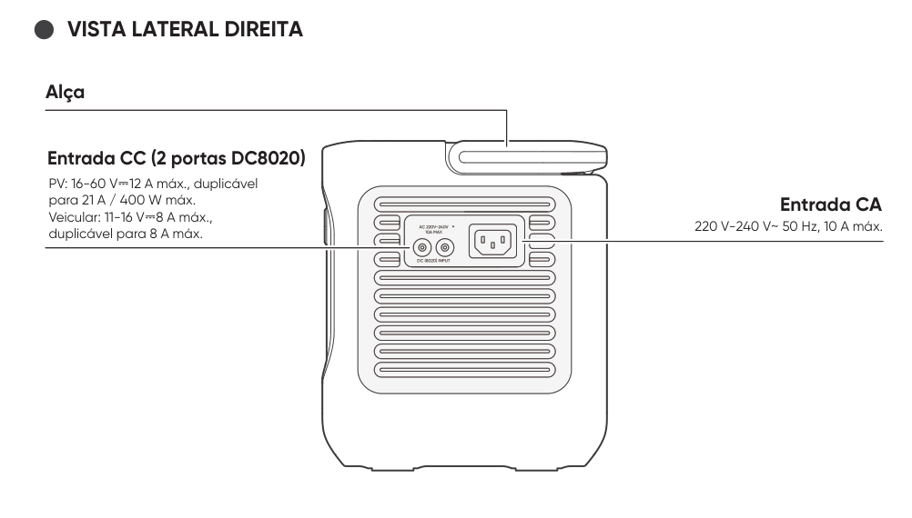</figure>

<h3>VISTA LATERAL DIREITA</h3>

Alça

Entrada CC (2 portas DC8020)

PV: 16-60 V⎓12 A máx., duplicável para 21 A / 400 W máx. Veicular: 11-16 V⎓8 A máx., duplicável para 8 A máx.

Entrada CA

220 V-240 V~ 50 Hz, 10 A máx.

## DISPLAY LCD

<figure>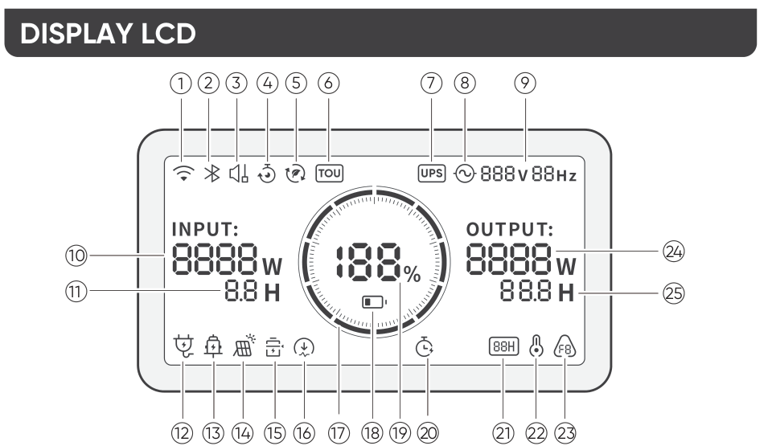</figure>

<table class="manual-table"><tbody>
<tr><th scope="row">1</th><td><strong>Wi-Fi</strong> Ligado: Wi-Fi conectado. Pisca: Pronto para conectar ao Wi-Fi. Desligado: Wi-Fi desconectado.</td></tr>
<tr><th scope="row">2</th><td><strong>Bluetooth</strong> Ligado: Bluetooth conectado. Pisca: Pronto para conectar ao Bluetooth. Desligado: Bluetooth desconectado.</td></tr>
<tr><th scope="row">3</th><td><strong>Modo de carregamento silencioso</strong> Ligado: O ruído durante o carregamento é significativamente reduzido, enquanto a potência de carregamento é reduzida e a velocidade de carregamento diminui. Desligado: Modo de carregamento silencioso desativado. Ative/desative este recurso no aplicativo Jackery. A configuração é mantida quando o dispositivo é desligado.</td></tr>
<tr><th scope="row">4</th><td><strong>Plano de carregamento</strong> Personaliza o tempo de carregamento do Jackery Explorer 1000. Adequado para situações com tarifas de energia elétrica variáveis, permite programar o carregamento de acordo com os horários de pico e fora de pico, reduzindo os custos com energia elétrica. Ative/desative este recurso no aplicativo da Jackery. A configuração é mantida quando o dispositivo é desligado.</td></tr>
<tr><th scope="row">5</th><td><strong>Modo de autoalimentação</strong> Maximiza o uso da energia solar e reduz a dependência da rede elétrica ao priorizar a energia solar armazenada, reduzindo os custos de energia. A estação de energia deve estar conectada simultaneamente aos painéis solares e à rede; a potência da carga é limitada pela potência de bypass. Ative/desative este recurso no aplicativo da Jackery. A configuração é mantida quando o dispositivo é desligado.</td></tr>
<tr><th scope="row">6</th><td><strong>Modo TOU</strong> Ligado: O modo TOU está ativado (SOC de reserva padrão: 60%). Durante os horários de pico, o produto prioriza a descarga da bateria para reduzir os custos de energia quando a energia armazenada excede o SOC de reserva. Durante os horários fora de pico, o produto carrega a bateria a partir da rede elétrica para reduzir o consumo nos horários de pico e aproveitar os períodos de menor demanda. Desligado: O modo TOU está desabilitado. O produto não segue a estratégia de TOU (tarifa por tempo de uso) e opera de acordo com a lógica padrão de fornecimento de energia e carregamento. Ative/desative este recurso no aplicativo da Jackery. A configuração é mantida quando o dispositivo é desligado.</td></tr>
<tr><th scope="row">7</th><td><strong>UPS</strong> Ligado: O produto está operando no modo de bypass. As cargas conectadas às portas CA consomem energia da rede em vez da estação de energia. Se a rede elétrica falhar repentinamente, o produto alterna automaticamente para a energia da bateria em 10 ms. Desligado: O produto não está no Modo de bypass. As cargas conectadas às portas CA são alimentadas pela bateria interna da estação de energia.</td></tr>
<tr><th scope="row">8</th><td><strong>Indicador de energia AC</strong> A saída CA (onda senoidal pura) está ligada.</td></tr>
<tr><th scope="row">9</th><td><strong>Tensão e Frequência de Saída</strong> Exibe a tensão e a frequência de saída quando a saída CA está ligada.</td></tr>
<tr><th scope="row">10</th><td><strong>Potência de entrada</strong> Exibe a potência de entrada em watts.</td></tr>
<tr><th scope="row">11</th><td><strong>Tempo de carregamento restante</strong> Exibe o tempo de carregamento restante.</td></tr>
<tr><th scope="row">12</th><td><strong>Indicador de carregamento via tomada CA</strong> O produto é carregado pela Entrada CA usando energia da rede.</td></tr>
<tr><th scope="row">13</th><td><strong>Indicador de carregamento veicular</strong> O produto é carregado pela Entrada CC (DC8020) usando CC 12 V (carregamento veicular).</td></tr>
<tr><th scope="row">14</th><td><strong>Indicador de carregamento solar</strong> O produto é carregado pela Entrada CC (DC8020) usando painel(is) solar(es).</td></tr>
<tr><th scope="row">15</th><td><strong>Modo de economia de bateria</strong> Ligado: Modo de economia de bateria ativado. Limites de carga e descarga são aplicados para ajudar a prolongar a vida útil da bateria. Desligado: Modo de economia de bateria desativado. Ative/desative este recurso no aplicativo da Jackery. A configuração é mantida quando o dispositivo é desligado. Quando esse recurso está ativado, o produto ocasionalmente realiza um ciclo completo de carga e descarga para calibrar o SOC.</td></tr>
<tr><th scope="row">16</th><td><strong>Limite de potência de carregamento</strong> Ligado: O limite de potência de carregamento está ativado no aplicativo Jackery. Desligado: O limite de potência de carregamento está desativado no aplicativo Jackery. A configuração é mantida quando o dispositivo é desligado.</td></tr>
<tr><th scope="row">17</th><td><strong>Indicador de energia da bateria</strong> Quando o produto estiver sendo carregado, o círculo laranja ao redor da porcentagem da bateria acenderá em sequência. Ao carregar outros dispositivos, o círculo laranja permanece aceso.</td></tr>
<tr><th scope="row">18</th><td><strong>Indicador de bateria fraca</strong> Ligado: O nível da bateria está abaixo de 20%. Pisca: O nível da bateria está abaixo de 5%. Desligado: O nível da bateria está acima de 20% ou o produto está carregando.</td></tr>
<tr><th scope="row">19</th><td><strong>Porcentagem de bateria restante</strong> Exibe a porcentagem de bateria restante.</td></tr>
<tr><th scope="row">20</th><td><strong>Temporizador de descarga</strong> Ligado: Um temporizador de descarga está definido. Desligado: Nenhum temporizador de descarga está definido. Ative/desative este recurso no aplicativo da Jackery. A configuração não é mantida quando o dispositivo é desligado.</td></tr>
<tr><th scope="row">21</th><td><strong>Modo de economia de energia</strong> Quando a saída CA ou CC for ativada pressionando o botão POWER CA ou o botão POWER CC/USB: Ligado: O Modo de economia de energia está ativado. Desligado: O Modo de economia de energia está desativado.</td></tr>
<tr><th scope="row">22</th><td><strong>Indicador de alta temperatura</strong> A proteção contra alta temperatura foi ativada. O produto pode parar de funcionar até que sua temperatura retorne à faixa normal de operação.</td></tr>
<tr><th scope="row">22</th><td><strong>Indicador de temperatura baixa</strong> A proteção contra baixa temperatura foi ativada. O produto pode parar de funcionar até que sua temperatura retorne à faixa normal de operação.</td></tr>
<tr><th scope="row">23</th><td><strong>Código de falha</strong> Ocorreu um erro no produto. Consulte a seção de Solução de problemas para obter detalhes.</td></tr>
<tr><th scope="row">24</th><td><strong>Potência de saída</strong> Exibe a potência de saída em watts.</td></tr>
<tr><th scope="row">25</th><td><strong>Tempo de descarga restante</strong> Exibe o tempo de descarga restante.</td></tr>
</tbody></table>

## OPERAÇÕES

<h3>LIGAR/DESLIGAR</h3>

<figure>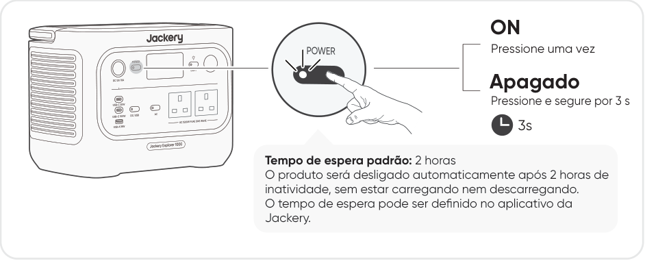</figure>

<h3>ON</h3>

Pressione uma vez

Apagado

Pressione e segure por 3 s

3s

Tempo de espera padrão: 2 horas O produto será desligado automaticamente após 2 horas de inatividade, sem estar carregando nem descarregando. O tempo de espera pode ser definido no aplicativo da Jackery.

Quando o Modo de Economia de Energia estiver ativado, o produto será desligado automaticamente após 12 horas se o botão POWER CA ou o botão POWER CC/USB estiver ligado, mas o produto não estiver carregando nem descarregando.

<h3>SAÍDA CA LIGAR/DESLIGAR</h3>

<figure>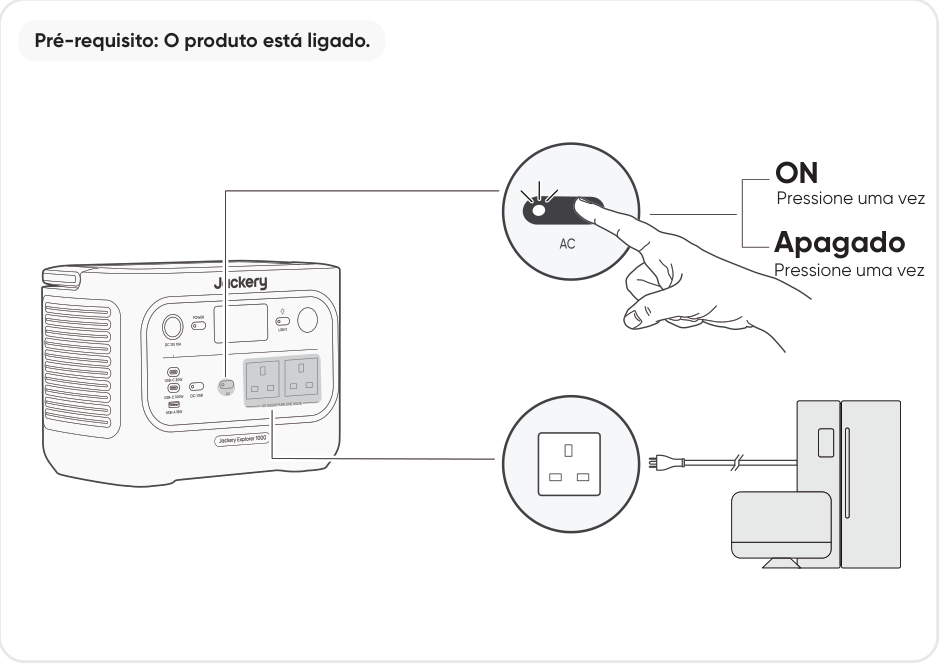</figure>

Pré-requisito: O produto está ligado.

<h3>ON</h3>

Pressione uma vez

Apagado

Pressione uma vez

<h3>SAÍDA CC/USB LIGAR/DESLIGAR</h3>

<figure>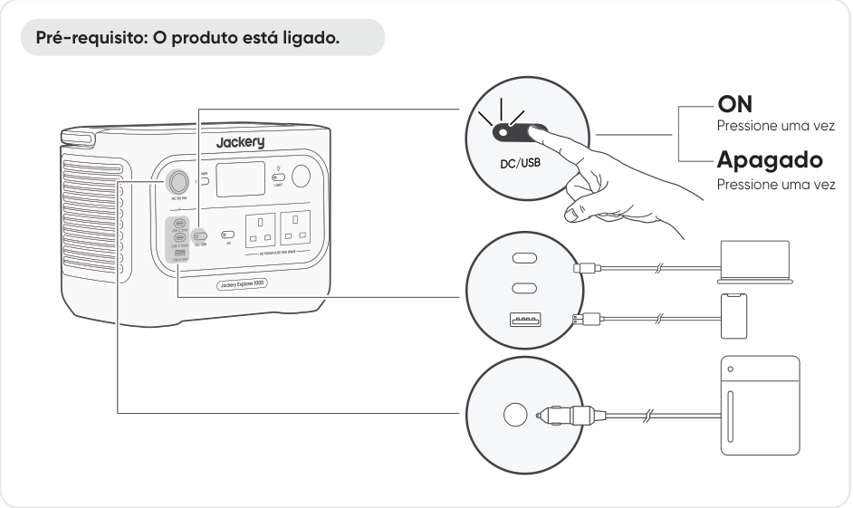</figure>

Pré-requisito: O produto está ligado.

<h3>ON</h3>

Pressione uma vez

Apagado

Pressione uma vez

<ul>
<li>A porta USB-C de 100 W é uma porta de saída de alta potência USB-PD Power Source 3 (PS3). Se o dispositivo do usuário ou acessório conectado não atender aos requisitos de segurança, pode haver risco de incêndio. Antes de usar essas portas, certifique-se de que o dispositivo ou acessório conectado possua proteção contra incêndio.</li>
<li>Conecte o Jackery Explorer 1000 apenas a dispositivos ou acessórios que estejam em conformidade com as cláusulas 6.3, 6.4 e 6.5 da IEC/EN/UL 62368-1 (ou outras normas equivalentes).</li>
<li>Para obter a potência máxima de saída, use o cabo USB-C para USB-C de 5 A (20 V CC/5 A, 100 W).</li>
</ul>

<h3>CUIDADO</h3>

O produto pode carregar a bateria do seu carro usando o cabo de carregamento de bateria automotiva de 12 V da Jackery, vendido separadamente e disponível em nosso site.

<ul>
<li>A porta CC 12 V é compatível apenas com baterias automotivas de 12 V e não é adequada para sistemas de 24 V.</li>
<li>Não dê partida no veículo enquanto o produto estiver carregando a bateria através da saída CC 12 V, pois isso pode danificar o produto.</li>
<li>Este recurso destina-se apenas a uso emergencial e não pode carregar uma bateria de carro descarregada ou danificada.</li>
</ul>

<h3>CUIDADO</h3>

<h3>MODO DE ECONOMIA DE ENERGIA</h3>

Para evitar consumo desnecessário da bateria caso o usuário se esqueça de desligar a saída, o produto ativa o Modo de Economia de Energia por padrão. Quando a saída CA ou CC/USB estiver ligada, o ícone do Modo de Economia de Energia será exibido na tela LCD. Neste modo, se nenhum dispositivo estiver conectado ou o consumo de energia do dispositivo conectado estiver abaixo de um determinado limite (25 W na saída CA ou 2 W na saída CC/USB), a respectiva saída será desligada automaticamente após o tempo definido. A configuração padrão é de 12 horas. A duração do Modo de Economia de Energia pode ser definida no aplicativo da Jackery para 1H, 2H, 8H, 12H ou 24H. Se for definido como Never Off, o Modo de Economia de Energia será desativado.

Para desativar o Modo de Economia de Energia, mantenha pressionados simultaneamente o botão POWER CA e o botão POWER principal por mais de 3 segundos. Quando o modo de economia de energia estiver desativado, o ícone não aparecerá mais na tela LCD e o produto não desligará automaticamente a saída CA ou USB. Ao alimentar dispositivos de baixa potência (CA ≤ 25 W ou CC/USB ≤ 2 W), desative o modo de economia de energia para evitar que a saída desligue automaticamente durante a operação.

<figure>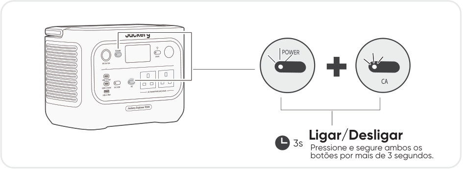</figure>

<h3>CA</h3>

3s Pressione e segure ambos os botões por mais de 3 segundos. Ligar/Desligar

O Modo de Economia de Energia retoma o estado anterior após ligar o produto. É necessário alternar manualmente para mudar o modo.

<h3>NOTA</h3>

<h3>LIGAR/DESLIGAR A LUZ LED</h3>

A luz LED possui dois modos: Modo de iluminação e modo SOS. Em qualquer modo,

<figure>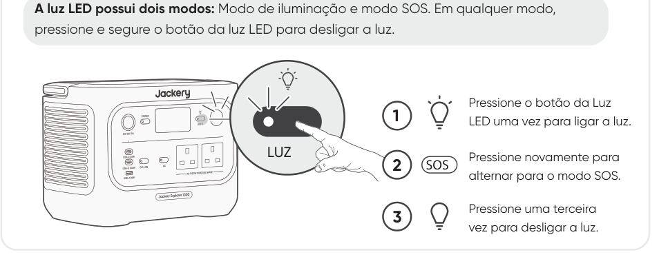</figure>

pressione e segure o botão da luz LED para desligar a luz.

Pressione o botão da Luz LED uma vez para ligar a luz.

<h3>LUZ</h3>

Pressione novamente para alternar para o modo SOS.

<h3>2 SOS</h3>

Pressione uma terceira vez para desligar a luz.

<h3>TELA LCD</h3>

<figure></figure>

<table class="manual-table"><tbody>
<tr><th scope="row">Aceso Brevemente</th><td><strong>Ligar</strong> Pressione o botão Power ou quando o produto estiver carregando.</td></tr>
<tr><th scope="row">Aceso Brevemente</th><td><strong>Desligar</strong> Pressione o botão power.</td></tr>
<tr><th scope="row">Aceso Brevemente</th><td><strong>Desligamento automático</strong> O LCD desliga automaticamente e entra no modo de suspensão após 2 minutos de inatividade.</td></tr>
<tr><th scope="row">Aceso continuamente (em estado de carga ou descarga)</th><td><strong>Ligar</strong> Pressione o botão Power duas vezes quando o produto estiver ligado.</td></tr>
<tr><th scope="row">Aceso continuamente (em estado de carga ou descarga)</th><td><strong>Desligar</strong> Pressione o botão POWER.</td></tr>
<tr><th scope="row">Aceso continuamente (em estado de carga ou descarga)</th><td><strong>Desligamento automático</strong> O LCD desliga automaticamente após 2 horas de inatividade.</td></tr>
</tbody></table>

Você também pode definir o modo de exibição da tela no aplicativo da Jackery.

<h3>FUNÇÃO DE RETOMADA DAS SAÍDAS CA E CC</h3>

Esta função memoriza o estado das saídas e retoma automaticamente as saídas CA e CC sob condições definidas.

<h4>Condições de retomada automática</h4>
<ul>
<li>Ligação/reinicialização após desligamento ou reinício</li>
<li>SOC da bateria ≥ limite de descarga + 10% após atingir o limite</li>
<li>Atualização OTA concluída</li>
</ul>
<h4>Condições de não retomada automática</h4>
<ul>
<li>Desligamento manual da saída (botão/App)</li>
<li>Desligamento da saída no modo de economia de energia</li>
<li>Desligamento da saída acionado pela proteção</li>
<li>Saída desligada pelo temporizador de descarga</li>
</ul>

<h3>COMBINAÇÕES DE TECLAS</h3>

<table class="manual-table"><thead><tr>
<th scope="col">Botões</th>
<th scope="col">Operação</th>
<th scope="col">Função</th>
</tr></thead><tbody>
<tr><th scope="row">Botão liga/desliga + Botão Power CA</th><td>3s Pressione e segure ambos por 3 s</td><td>Ligar/Desligar o Modo de Economia de Energia</td></tr>
<tr><th scope="row">Botão liga/desliga + Botão de energia CC/USB</th><td>3s Pressione e segure ambos por 3 s</td><td>Redefinir o Wi-Fi e o Bluetooth</td></tr>
<tr><th scope="row">Botão Power CA + Botão de energia CC/USB</th><td>Pressione e segure ambos por (1 s)</td><td>Ligar/Desligar Wi-Fi e Bluetooth</td></tr>
<tr><th scope="row">Botão liga/desliga + Botão de luz LED</th><td>Pressione e segure ambos por (1 s)</td><td>Ligar/Desligar o modo de carregamento de emergência</td></tr>
</tbody></table>

## FONTE DE ALIMENTAÇÃO ININTERRUPTA (UPS)

Conecte o produto a uma tomada de parede usando o cabo de carregamento CA. Em seguida, pressione o botão POWER CA e ligue seus aparelhos ao mesmo tempo.

Uma fonte de alimentação ininterrupta (UPS) é um tipo de sistema de energia contínua que fornece energia elétrica de backup automaticamente a uma carga quando a rede elétrica falha. Em caso de queda repentina de energia da rede, o Jackery Explorer 1000 alternará automaticamente para a energia armazenada em até 10 ms para manter seus aparelhos funcionando. No modo UPS, a potência de pico da unidade atinge 1500 W antes de quedas de energia. Como o carregamento/descarregamento simultâneo é ativado no Modo de bypass, a potência de saída real é inferior à potência nominal neste modo, mas retorna à potência nominal durante quedas de energia.

<figure></figure>

<ul>
<li>Este produto não suporta comutação de 0 ms. Não conecte este produto a equipamentos que exijam fonte de alimentação com comutação de 0 ms, como servidores de dados ou estações de trabalho.</li>
<li>Antes do uso, teste a compatibilidade com seu dispositivo várias vezes.</li>
<li>Não conecte cargas que excedam a potência máxima de saída do produto. Caso contrário, a proteção contra sobrecarga será acionada.</li>
</ul>

<h3>CUIDADO</h3>

Não utilize este produto em aplicações como servidores de dados ou dispositivos médicos, em que um mau funcionamento possa colocar vidas em risco ou causar danos materiais significativos. Para os seguintes equipamentos, uma interrupção no fornecimento de energia durante o uso pode causar sérios danos à segurança pessoal ou danos materiais:

<ul>
<li>Dispositivos médicos e outros equipamentos intimamente relacionados à segurança da vida.</li>
<li>Equipamentos críticos, como os relacionados à infraestrutura social e aos serviços públicos.</li>
<li>Equipamentos empresariais críticos para o negócio, etc. Indivíduos que usam marcapasso cardíaco (portadores de marcapasso implantado) não devem usar este produto.</li>
</ul>

<h3>AVISO</h3>

## CARREGANDO

Energia verde primeiro: Recomendamos priorizar o uso de energia verde. Este produto suporta dois modos de carregamento ao mesmo tempo: carregamento solar e carregamento por tomada da rede elétrica CA. Quando o carregamento na tomada CA e o carregamento solar estão ativados simultaneamente, o produto dará prioridade ao carregamento solar, e ambos os métodos serão utilizados para carregar a bateria na potência máxima permitida.

Carregue totalmente o produto antes do primeiro uso.

<ul>
<li>A temperatura de carregamento recomendada para o produto varia de 0 °C a 45 °C, e a temperatura de descarga varia de -10 °C a 45 °C.</li>
<li>Operar o produto fora dessa faixa de temperatura pode limitar sua capacidade de carregamento e descarga ou até mesmo impedir que ele seja carregado ou descarregado.</li>
<li>A potência de carregamento e a capacidade da bateria do produto podem variar devido a flutuações de temperatura.</li>
</ul>

<h3>NOTA</h3>

<h3>CARREGAMENTO POR MEIO DE TOMADA CA</h3>

<figure></figure>

Conecte o cabo de carregamento CA à porta de entrada CA do produto e a uma tomada da rede elétrica.

Certifique-se de que o cabo de carregamento CA esteja totalmente e firmemente conectado à porta de entrada CA. Uma conexão incompleta pode causar instabilidade na corrente elétrica, superaquecimento, mau contato ou mau funcionamento do dispositivo. CUIDADO

Modo de carregamento de emergência

Neste modo, você pode carregar rapidamente a estação de energia portátil usando o carregamento CA. Esta função de carregamento de emergência pode ser ativada ou desativada por meio do aplicativo da Jackery. No modo de carregamento de emergência, a luz circular que indica o estado de carga (SOC) piscará em ritmo acelerado.

* Para maximizar a vida útil da bateria, o ideal é carregar na velocidade normal. Use o modo de carregamento de emergência somente quando necessário. Não é recomendado para uso regular e de longo prazo.

<h3>CARREGAMENTO VIA PAINÉIS SOLARES (VENDIDOS SEPARADAMENTE)</h3>

O Jackery Explorer 1000 possui duas portas de entrada DC8020 e é compatível com os painéis solares da Jackery.

<figure>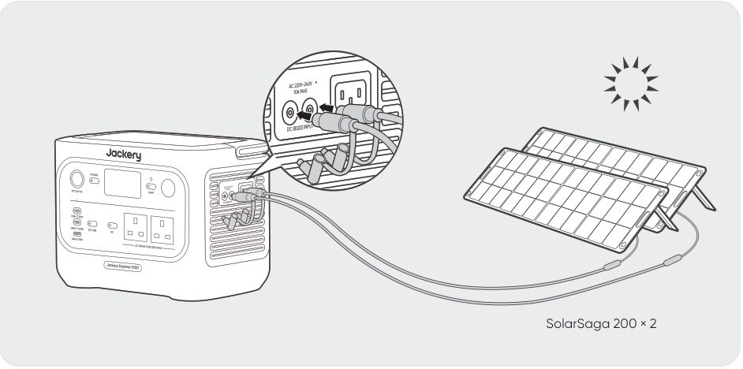</figure>

SolarSaga 200 × 2

Se for necessário conectar dois painéis solares a uma única porta de entrada DC8020, consulte a figura abaixo para carregar por meio do conector para painel solar (vendido separadamente, não incluso no pacote padrão).

<figure>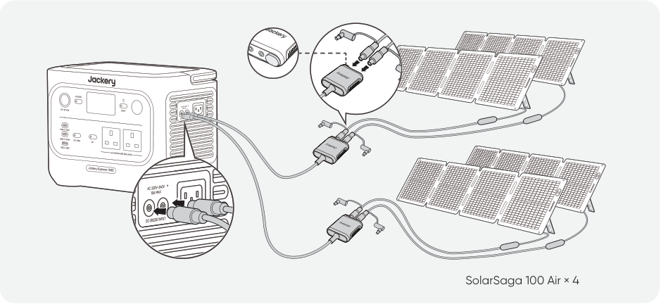</figure>

SolarSaga 100 Air × 4

<h3>CUIDADO</h3>

Uma porta de entrada DC8020 pode ser conectada a no máximo dois painéis solares.

Certifique-se de que a tensão de entrada para ambas as portas de entrada CC seja a mesma. Caso contrário, o produto pode ser danificado. Por exemplo:

<ul>
<li>Use o mesmo modelo e a mesma quantidade de painéis solares da Jackery ao conectá-los às duas portas de entrada DC8020.</li>
<li>Não carregue o produto usando simultaneamente um carregador veicular e um painel solar. Isso pode queimar o fusível do carro ou resultar em falha no carregamento.</li>
</ul>

<h3>CUIDADO</h3>

Recomenda-se usar o painel solar Jackery para carregar o produto. Certifique-se de que a tensão de circuito aberto (Voc) do painel solar esteja dentro da faixa de entrada CC (16 V-60 V) do Jackery Explorer 1000. A Jackery não se responsabiliza por quaisquer danos ou perdas resultantes do uso de painéis solares de terceiros.

<h3>CARREGAMENTO COM CARREGADOR VEICULAR (VENDIDO SEPARADAMENTE)</h3>

Este produto pode ser carregado usando um carregador veicular de 12 V. Certifique-se de que o carregador veicular e a tomada de alimentação de 12 V do veículo (acendedor de cigarros) estejam bem conectados.

*O cabo de carregamento veicular é vendido separadamente.

<figure>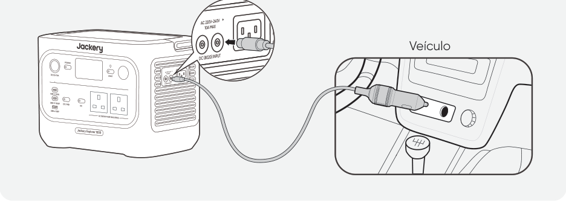</figure>

Veículo

<ul>
<li>Ligue o veículo antes de carregar a estação de energia.</li>
<li>Se o veículo estiver trafegando por estradas irregulares, é proibido usar o carregador veicular, pois isso pode causar funcionamento inadequado. A Empresa não se responsabiliza por quaisquer perdas causadas por operação fora do padrão.</li>
<li>O carregamento veicular é aplicável apenas a veículos com 12 V CC, não a 24 V CC. Por favor, não carregue este produto em um veículo de 24 V para evitar ferimentos pessoais e danos materiais.</li>
</ul>

<h3>CUIDADO</h3>

## ARMAZENAMENTO

Armazene o produto em local seco, limpo e com ventilação adequada. Temperatura e umidade de armazenamento:

<ul>
<li>1 mês: -20°C a 45°C (0-60%UR)</li>
</ul>

<ul>
<li>3 meses: 0°C a 45°C (0-60%UR)</li>
</ul>

<ul>
<li>12 meses: 0°C a 25°C (0-60%UR)</li>
</ul>

Se este produto for armazenado por um longo período (3 meses - 6 meses) com a bateria descarregada, ele pode não voltar a carregar. Para evitar isso e manter a saúde da bateria, recomenda-se verificar e recarregar o produto a cada três meses e realizar um ciclo completo de carga e descarga pelo menos uma vez a cada 6 a 12 meses.

## SOLUÇÃO DE PROBLEMAS

Se qualquer um dos seguintes códigos de falha aparecer, siga as ações corretivas listadas para resolver o problema. Se a falha persistir, entre em contato com o Suporte ao Cliente da Jackery.

<table class="manual-table"><thead><tr>
<th scope="col">Código de erro</th>
<th scope="col">Medidas corretivas</th>
</tr></thead><tbody>
<tr><th scope="row">F0</th><td>Reinicie o produto.</td></tr>
<tr><th scope="row">F1</th><td>Reinicie o produto.</td></tr>
<tr><th scope="row">F2</th><td>Reinicie o produto.</td></tr>
<tr><th scope="row">F3</th><td>Reinicie o produto.</td></tr>
<tr><th scope="row">F4</th><td>Conecte o produto a cargas para descarregar a bateria até que a falha desapareça.</td></tr>
<tr><th scope="row">F5</th><td>Carregue o produto por painéis solares ou tomada de parede CA até que a falha desapareça.</td></tr>
<tr><th scope="row">F6</th><td>1. Aguarde a normalização da rede elétrica antes de carregar o produto por meio de uma tomada CA. 2. Verifique se as aberturas de entrada e saída de ar estão bloqueadas; certifique-se de manter uma distância de 0,66 ft (20 cm) em ambos os lados do produto. 3. Coloque o produto em um local que não esteja exposto à luz solar direta ou a altas temperaturas ambientais. 4. Desconecte todas as cargas do produto. Mantenha o produto ocioso e aguarde até que a falha desapareça. 5. Reinicie o produto.</td></tr>
<tr><th scope="row">F7</th><td>1. Remova todas as entradas CC do produto. 2. Se você carregar o produto com um painel solar, verifique a tensão de circuito aberto (VOC) do painel solar conectado. O produto permite uma tensão máxima de entrada CC de 60 V. 3. Reinicie o produto e mantenha-o inativo. Aguarde até que a falha desapareça.</td></tr>
<tr><th scope="row">F8</th><td>Entre em contato com o Suporte ao Cliente da Jackery.</td></tr>
<tr><th scope="row">F9</th><td>Remova a carga conectada às portas USB do produto. Aguarde até que a falha desapareça.</td></tr>
<tr><th scope="row">FE</th><td>Entre em contato com o Suporte ao Cliente da Jackery.</td></tr>
</tbody></table>

## ESPECIFICAÇÕES

<table class="manual-table"><tbody>
<tr><th colspan="2" scope="colgroup">INFORMAÇÕES GERAIS</th></tr>
<tr><th scope="row">Nome do produto</th><td>Jackery Explorer 1000</td></tr>
<tr><th scope="row">Nº do modelo</th><td>JE-1000F</td></tr>
<tr><th scope="row">Capacidade</th><td>1024 Wh (20 Ah/51,2 V CC)</td></tr>
<tr><th scope="row">Química da célula</th><td>LiFePO4</td></tr>
<tr><th scope="row">Peso</th><td>Aproximadamente 10,6 kg</td></tr>
<tr><th scope="row">Dimensões</th><td>31,4 x 20,1 x 23,4 cm</td></tr>
<tr><th scope="row">Vida útil de ciclos</th><td>4000 ciclos até 70%+ de capacidade</td></tr>
<tr><th colspan="2" scope="colgroup">PORTAS DE ENTRADA</th></tr>
<tr><th scope="row">1 × Entrada CA</th><td>Modo de carregamento: 220 V-240 V~50 Hz, 10 A máx.</td></tr>
<tr><th scope="row">2 × Portas DC8020</th><td>11 V–16 V ⎓ 8 A máx., duplo até 8 A máx. 16 V–60 V ⎓ 12 A máx., duplo até 21 A/400 W máx.</td></tr>
<tr><th colspan="2" scope="colgroup">PORTAS DE SAÍDA</th></tr>
<tr><th scope="row">2 × CA</th><td>230 V~ 50 Hz, 6,5 A máx., 1500 W nominal por porta, 1500 W total, pico de surto de 3000 W</td></tr>
<tr><th scope="row">Saída CA no modo de bypass①</th><td>220-240 V~ 50 Hz, 1500 W</td></tr>
<tr><th scope="row">1 x USB-C 30 W</th><td>30 W máx., 5 V⎓3 A, 9 V⎓3 A, 12 V⎓2,5 A, 15 V⎓2 A, 20 V⎓1,5 A</td></tr>
<tr><th scope="row">1 x USB-C 100 W</th><td>100 W máx., 5 V⎓3 A, 9 V⎓3 A, 12 V⎓3 A, 15 V⎓3 A, 20 V⎓5 A</td></tr>
<tr><th scope="row">1 × USB-A</th><td>18 W máx., 5-6 V⎓3 A, 6-9 V⎓2 A, 9-12 V⎓1,5 A</td></tr>
<tr><th scope="row">1 × Porta CC 12 V</th><td>12 V⎓10 A máx.</td></tr>
<tr><th colspan="2" scope="colgroup">TEMPERATURA AMBIENTE DE OPERAÇÃO</th></tr>
<tr><th scope="row">Temperatura de carregamento</th><td>0 °C a 45 °C</td></tr>
<tr><th scope="row">Temperatura de descarga</th><td>-10 °C a 45 °C</td></tr>
</tbody></table>

※ USB Type-C® e USB-C® são marcas registradas do USB Implementers Forum.

①. O produto pode carregar a bateria a partir da tomada CA enquanto fornece energia pelas portas de saída CA.

## GARANTIA

Esta garantia aplica-se somente a clientes que compram no site oficial da Jackery, em plataformas de terceiros da marca Jackery ou com revendedores locais autorizados.

*O período e os detalhes da garantia podem variar de acordo com as leis, regulamentações locais e revendedores autorizados.

<h3>Garantia Limitada</h3>

A Jackery garante ao comprador consumidor original que o produto Jackery estará livre de defeitos de fabricação e material sob uso normal do consumidor durante o período de garantia aplicável identificado na seção &quot;Período de Garantia&quot; abaixo, sujeito às exclusões estabelecidas abaixo. Esta declaração de garantia estabelece a obrigação de garantia total e exclusiva da Jackery. Não assumiremos, nem autorizaremos qualquer pessoa a assumir em nosso nome, qualquer outra responsabilidade relacionada à venda de nossos produtos.

<h3>Período de Garantia</h3>
<h3>3 ANOS — Garantia Padrão</h3>

O período de garantia padrão do Jackery Explorer 1000 é de 36 meses. Em todos os casos, o período de garantia é contado a partir da data de compra pelo comprador consumidor original. O comprovante de compra do primeiro comprador consumidor, ou outra prova documental razoável, é necessário para estabelecer a data de início do período de garantia.

<h3>2 ANOS — Garantia Estendida</h3>

Para ativar a extensão da garantia, você deve registrar seu produto online ou entrar em contato com nossa equipe de atendimento ao cliente em hello.eu@jackery.com para estender o período de garantia padrão.

<h3>Troca</h3>

A Jackery substituirá, às suas próprias custas, qualquer produto Jackery que apresente falha de funcionamento durante o período de garantia aplicável devido a defeito de fabricação ou de material. Um produto substituto assume a garantia restante do produto original.

<h3>Limitado ao comprador consumidor original</h3>

A garantia dos produtos Jackery é limitada ao comprador consumidor original e não é transferível a qualquer proprietário subsequente.

<h3>Exclusões</h3>

A garantia da Jackery não se aplica a:

<ul>
<li>Qualquer produto que tenha sido utilizado de forma inadequada, submetido a uso abusivo, modificado, danificado acidentalmente ou usado para qualquer finalidade que não seja o uso normal do consumidor, conforme autorizado na documentação atual do produto da Jackery.</li>
<li>Tentativa de reparo por qualquer pessoa que não seja uma assistência autorizada.</li>
<li>Qualquer produto adquirido por meio de leilão online.</li>
<li>A garantia da Jackery não se aplica à célula da bateria, a menos que ela seja totalmente carregada por você dentro de sete dias após a compra do produto e, posteriormente, pelo menos uma vez a cada 6 meses.</li>
</ul>
<h3>Direitos de interpretação</h3>

A Jackery reserva-se o direito de interpretação final da política de pós-venda acima.

## CONFIGURAÇÃO DO APLICATIVO

<h3>1. Baixe o aplicativo e faça login</h3>

Pesquise por &quot;Jackery&quot; no Google Play ou App Store para instalar o aplicativo. Depois disso, você pode se registrar e fazer login.

Como alternativa, escaneie o código QR abaixo para baixar e instalar o aplicativo.

<figure></figure>
<h3>2. Adicionar dispositivo</h3>

2.1 Clique no botão + para adicionar seu dispositivo;

2.2 Pressione o botão POWER no dispositivo para ligá-lo, os ícones de Wi-Fi e Bluetooth no dispositivo piscarão, indicando que o dispositivo entrou no modo de configuração de rede. Toque no botão &quot;Ícone piscando&quot; e permita que o aplicativo se conecte a dispositivos próximos e habilite as permissões de Bluetooth.

<figure></figure>
<figure>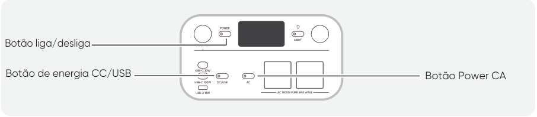</figure>

2.3 Após tocar no ícone do dispositivo encontrado, o aplicativo conecta automaticamente o dispositivo via Bluetooth.

<h3>NOTA</h3>

Se &quot;o dispositivo já foi vinculado&quot; for exibido durante o processo de vinculação, as duas formas a seguir poderão ser usadas para a conexão:

<ul>
<li>O proprietário do dispositivo compartilhará este dispositivo com outros usuários por meio do aplicativo.</li>
<li>Pressione e segure os botões POWER e o botão POWER CC/USB por 3 segundos para redefinir o Wi-Fi e o Bluetooth do dispositivo e, em seguida, vincule o dispositivo novamente.</li>
</ul>

2.4 Após o dispositivo ser conectado com sucesso, insira sua senha de Wi-Fi e toque no botão OK.

<h3>NOTA</h3>

Selecione uma rede Wi-Fi na banda de 2,4 GHz. O dispositivo não suporta redes Wi-Fi na faixa de 5 GHz.

2.5 Após o dispositivo ser adicionado com sucesso ao aplicativo, o ícone de Wi-Fi no dispositivo ficará sempre aceso.

<figure></figure>

As capturas de tela acima são apenas para referência.

<h3>CUIDADO</h3>

O aplicativo da Jackery pode se conectar a apenas uma estação de energia via Bluetooth por vez. Ao retornar à lista de dispositivos, o Bluetooth é desconectado automaticamente. Toque novamente na estação de energia na lista para reconectar automaticamente.

<h3>3. Desvincular o dispositivo</h3>

Toque no ícone de Configurações no canto superior direito da interface principal do dispositivo para acessar a página de configurações e clique no botão Desvincular na parte inferior da página para desvincular o dispositivo.

<h3>4. Notas</h3>

4.1 Para ativar o Wi-Fi e o Bluetooth:

<ul>
<li>O Wi-Fi e o Bluetooth são ativados automaticamente após o dispositivo ser ligado, e os ícones de Wi-Fi e Bluetooth na tela acendem.</li>
<li>Mantenha pressionados simultaneamente o botão POWER CC/USB e o botão POWER CA até que os ícones de Wi-Fi e Bluetooth na tela acendam.</li>
</ul>

4.2 Para desativar o Wi-Fi e o Bluetooth

<ul>
<li>Mantenha pressionados simultaneamente o botão POWER CC/USB e o botão POWER CA até que os ícones de Wi-Fi e Bluetooth na tela se apaguem.</li>
</ul>

4.3 Para redefinir o Wi-Fi e o Bluetooth

<ul>
<li>Mantenha pressionados simultaneamente o botão POWER e o botão POWER CC/USB por 3 segundos para restaurar as configurações de fábrica do Wi-Fi e do Bluetooth. A conta do aplicativo conectada será desvinculada.</li>
</ul>

## EU declaration and manufacturer

Shenzhen Hello Tech Energy Co., Ltd. hereby declares that this: Jackery Explorer 1000 with Bluetooth and Wi-Fi JE-1000F is in compliance with the essential requirements and other relevant provisions of the Directive 2014/53/EU, 2011/65/EU+(EU)2015/863, The full text of the EU declaration of conformity is available at the following internet address: https://de.jackery.com/pages/user-guides

MANUFACTURER: SHENZHEN HELLO TECH ENERGY CO.,LTD. Address: F2-3, Bldg. 7, Jiaanda Science and technology industrial park factory, the east side of Huafan Road, Tongsheng Community, Dalang Street, Longhua District, Shenzhen, Guangdong, China

sales@hello-tech.com +86 400 668 9293 www.hello-tech.com

