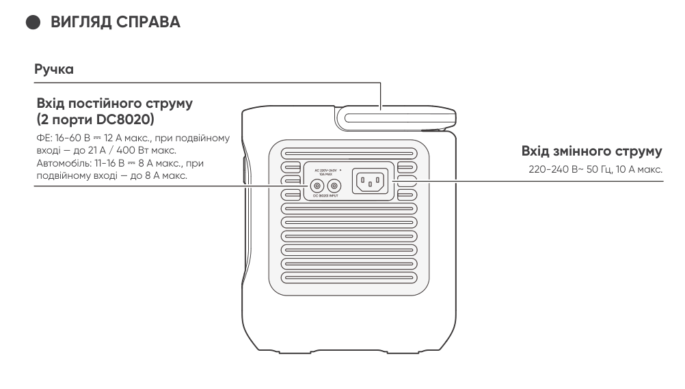
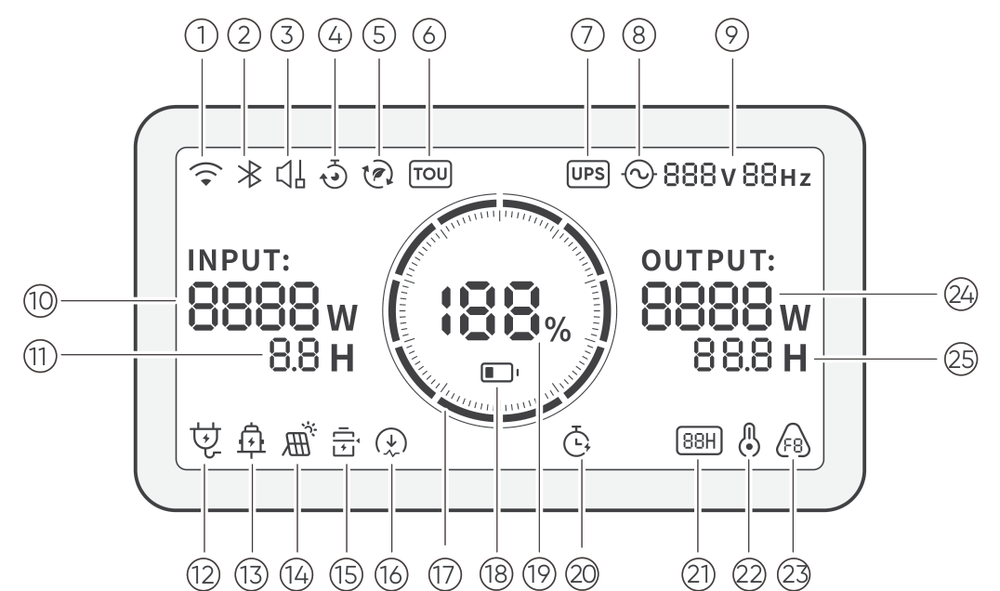
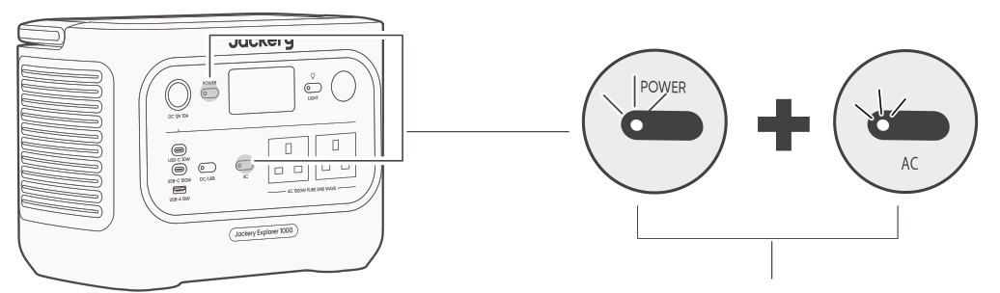
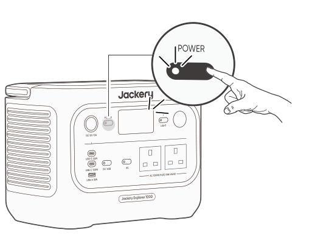

<strong>ВАЖЛИВО</strong>

Вітаємо вас з новим Jackery Explorer 1000. Будь ласка, уважно прочитайте це керівництво перед використанням продукту, особливо відповідні застереження для забезпечення правильного використання. Зберігайте це керівництво у доступному місці для подальшого використання.

Відповідно до законів і нормативних актів, право остаточного тлумачення цього документа та всіх пов’язаних документів цього продукту належить Компанії. Хоча було докладено всіх зусиль для забезпечення точності цього керівництва, Jackery не несе відповідальності за можливі помилки.

Зверніть увагу, що у разі будь-яких оновлень, змін або припинення дії додаткові повідомлення не надаватимуться. Щоб отримати найновішу версію керівництв, відвідайте support.jackery.com.

* Зображення наведені лише для довідки. Будь ласка, орієнтуйтеся на фактичний продукт.

# ВАЖЛИВА ІНФОРМАЦІЯ З БЕЗПЕКИ

<table class="manual-callout-table manual-callout-table"><tbody><tr><td class="manual-callout-label">
⚠
</td><td class="manual-callout-body">
<strong>ІНСТРУКЦІЇ ЩОДО РИЗИКУ ПОЖЕЖІ, УРАЖЕННЯ ЕЛЕКТРИЧНИМ СТРУМОМ АБО ТРАВМУВАННЯ ЛЮДЕЙ</strong>
</td></tr></tbody></table>

<strong>Завжди дотримуйтеся цих базових заходів безпеки під час використання цього продукту.</strong>

<ul><li>
Прочитайте всі інструкції перед використанням продукту.
</li><li>
Не дозволяйте дітям гратися з продуктом. Необхідний пильний нагляд за дітьми, коли продукт використовується поруч із ними.
</li><li>
Може виникнути ризик ураження електричним струмом при використанні аксесуарів, які не рекомендовані або не продаються професійними виробниками продукту.
</li><li>
Коли продукт не використовується, від’єднуйте вилку живлення від розетки продукту.
</li><li>
Не розбирайте продукт, оскільки це може призвести до непередбачуваних ризиків, таких як пожежа, вибух або ураження електричним струмом.
</li><li>
Не використовуйте продукт із пошкодженими шнурами, вилками або вихідними кабелями, оскільки це може спричинити ураження електричним струмом.
</li><li>
Щоб забезпечити належну циркуляцію повітря, тримайте вентиляційні отвори продукту відкритими. Місце використання продукту повинно мати достатній повітрообмін у прохолодному та сухому середовищі, щоб запобігти перегріванню.

Заряджання у вологих або погано вентильованих приміщеннях може становити загрозу для безпеки.

Вода може спричинити коротке замикання або пошкодити зарядний пристрій, що призводить до ризиків для безпеки.
</li><li>
Не піддавайте продукт впливу вогню, високих температур, прямого сонячного світла або середовищ із високою температурою, таких як салон припаркованого автомобіля. Такий вплив може призвести до пожежі або вибуху.
</li></ul>

# ІНСТРУКЦІЇ З ОБСЛУГОВУВАННЯ КОРИСТУВАЧЕМ

Протягом життєвого циклу продуктів накопичення енергії очікується певний ступінь зниження ємності та енергетичних характеристик. Зі збільшенням кількості циклів заряджання та розряджання і тривалості зберігання ця деградація поступово посилюється, що є нормальним явищем і відповідає природному старінню акумуляторних елементів.

# ЗНАЧЕННЯ СИМВОЛІВ

<figure aria-label="ЗНАЧЕННЯ СИМВОЛІВ" class="hb-symbol-signal-composition" data-component-id="HB-TABLE-SYMBOL-SIGNAL"><table class="hb-symbol-signal-table"><colgroup><col class="hb-symbol-signal-col-label"/><col class="hb-symbol-signal-col-meaning"/></colgroup><thead><tr><th class="hb-symbol-signal-label-heading" scope="col">Символ</th><th class="hb-symbol-signal-meaning-heading" scope="col">Значення</th></tr></thead><tbody><tr><td class="hb-symbol-signal-label-cell">⚠ПОПЕРЕДЖЕННЯ</td><td class="hb-symbol-signal-meaning-cell">Небезпечні практики, які можуть призвести до серйозних травм, смерті та/або майнової шкоди.</td></tr><tr><td class="hb-symbol-signal-label-cell">⚠УВАГА</td><td class="hb-symbol-signal-meaning-cell">Небезпечні дії, які можуть призвести до травм та/або майнової шкоди.</td></tr><tr><td class="hb-symbol-signal-label-cell">⚠ПРИМІТКА</td><td class="hb-symbol-signal-meaning-cell">Небезпечні дії, які можуть призвести до пошкодження обладнання, втрати даних, погіршення продуктивності або непередбачуваних результатів.</td></tr><tr><td class="hb-symbol-signal-label-cell">⚠ПОРАДА</td><td class="hb-symbol-signal-meaning-cell">Доповнює важливу інформацію або операційні підказки в тексті.</td></tr></tbody></table></figure>

<figure aria-label="ЗНАЧЕННЯ СИМВОЛІВ" class="hb-symbol-pair-composition" data-component-id="HB-TABLE-SYMBOL-ICON">

<table class="hb-symbol-panel-table"><colgroup><col class="hb-symbol-col-icon"/><col class="hb-symbol-col-meaning"/></colgroup><thead><tr><th class="hb-symbol-icon-heading" scope="col">Символ</th><th class="hb-symbol-meaning-heading" scope="col">Значення</th></tr></thead><tbody><tr><td class="hb-symbol-icon"></td><td class="hb-symbol-meaning">Попереджувальні та застережні символи. Обов’язково прочитайте, щоб попередити користувачів про потенційні небезпеки або ризики.</td></tr><tr><td class="hb-symbol-icon"></td><td class="hb-symbol-meaning">Перед використанням прочитайте посібник користувача.</td></tr><tr><td class="hb-symbol-icon"></td><td class="hb-symbol-meaning">Не розбирайте продукт.</td></tr><tr><td class="hb-symbol-icon"></td><td class="hb-symbol-meaning">Тримайте продукт подалі від вогню.</td></tr></tbody></table>

<table class="hb-symbol-panel-table"><colgroup><col class="hb-symbol-col-icon"/><col class="hb-symbol-col-meaning"/></colgroup><thead><tr><th class="hb-symbol-icon-heading" scope="col">Символ</th><th class="hb-symbol-meaning-heading" scope="col">Значення</th></tr></thead><tbody><tr><td class="hb-symbol-icon"></td><td class="hb-symbol-meaning">Тримайте подалі від дітей.</td></tr><tr><td class="hb-symbol-icon"></td><td class="hb-symbol-meaning">Цей символ вказує, що всередині продукту є літій-іонна (Li-ion) батарея, яку необхідно утилізувати або переробити належним чином.</td></tr><tr><td class="hb-symbol-icon"></td><td class="hb-symbol-meaning">Цей символ вказує, що продукт не можна утилізувати разом із побутовими відходами, і його слід передати до спеціалізованого пункту збору для переробки. Правильна утилізація та переробка допомагають захистити довкілля. Для отримання додаткової інформації щодо утилізації та переробки цього продукту зверніться до місцевої громади, служби утилізації або дилера.</td></tr></tbody></table>

</figure>

# КОМПЛЕКТАЦІЯ

<figure aria-label="КОМПЛЕКТАЦІЯ" class="hb-inbox-composition" data-card-count="3" data-component-id="HB-SPECIAL-INBOX" data-inbox-variant="three-card-responsive"><ol class="hb-inbox-grid"><li class="hb-inbox-card" data-item-number="1">

Jackery Explorer 1000

</li><li class="hb-inbox-card" data-item-number="2">

Кабель заряджання від змінного струму

</li><li class="hb-inbox-card" data-item-number="3">

Керівництво користувача

</li></ol>

ПОРАДИ

Автомобільний зарядний кабель не входить до комплекту, але його можна придбати окремо на нашому вебсайті. Для отримання допомоги, будь ласка, звертайтеся до служби підтримки Jackery.

</figure>

# ОГЛЯД ПРОДУКТУ

<section><h2 hidden="" style="display:none">ВИГЛЯД СПЕРЕДУ</h2><figure class="hb-annotated-figure hb-has-composite-art" data-figure-id="product-overview-front" data-source-fragment-sha256="554e9a01de8fb9eaaab28da4e7478093720a5323c171190c7ea670ba717cf3e4" data-web-composite-asset-key="overview.finished.uk.front" data-web-composite-locale="uk" data-web-composite-sha256="b77f660236c22280171a990a9f885350cdcd0835a7b849ebf06cd7f1d2fed9b9" data-web-replace-key="product-overview.front">

<svg aria-hidden="true" class="hb-leader-layer" focusable="false" preserveaspectratio="none" viewbox="0 0 100 100"><polyline class="hb-leader" data-callout-id="overview.front.power" points="0.524765,10 40.5929,10 40.5929,42.4785"></polyline><polyline class="hb-leader" data-callout-id="overview.front.lcd" points="98.4298,9.47368 50.4642,9.47368 50.4642,42.5425"></polyline><polyline class="hb-leader" data-callout-id="overview.front.dc12" points="0.524858,24.4737 35.5267,24.4737 35.5267,41.914"></polyline><polyline class="hb-leader" data-callout-id="overview.front.led_button" points="98.4299,24.4737 58.4665,24.4737 58.4665,42.2151"></polyline><polyline class="hb-leader" data-callout-id="overview.front.usb_c_30" points="0.524858,43.9474 29.0693,43.9474 29.0693,50.377 33.8615,50.377"></polyline><polyline class="hb-leader" data-callout-id="overview.front.led" points="98.8133,37.1053 66.3701,37.1053 66.3701,44.2169"></polyline><polyline class="hb-leader" data-callout-id="overview.front.usb_c_100" points="0.910347,61.8421 32.7703,61.8421 32.7703,52.4546 33.7772,52.4546"></polyline><polyline class="hb-leader" data-callout-id="overview.front.ac_power" points="98.2675,53.1579 46.4179,53.1579 46.4179,51.8275"></polyline><polyline class="hb-leader" data-callout-id="overview.front.usb_a" points="0.548488,78.4211 35.2113,78.4211 35.2113,56.6294"></polyline><polyline class="hb-leader" data-callout-id="overview.front.ac_output" points="98.4299,76.8421 62.2573,76.8421 62.2573,56.0823"></polyline><polyline class="hb-leader" data-callout-id="overview.front.dc_usb" points="0.650347,88.4211 40.2898,88.4211 40.2898,54.5065"></polyline><polyline class="hb-leader" data-callout-id="overview.front.total" points="98.8133,96.3158 68.237,96.3158 68.237,72.9378"></polyline><polyline class="hb-leader-decoration" data-decoration-id="overview.front.decoration-1" points="58.0685,68.4045 58.0685,56.0798"></polyline></svg>

<strong>Кнопка POWER</strong>

<strong>ЖК-дисплей</strong>

<strong>Порт постійного струму 12 В</strong>

12 В⎓10 А макс.

<strong>Кнопка LED-ліхтаря</strong>

<strong>Вихід USB-C 30 Вт</strong>

30 Вт макс., 5 В⎓3 A, 9 В⎓3 A, 12 В⎓2,5 A, 15 В⎓2 A, 20 В⎓1,5 A

<strong>LED LIGHT</strong>

<strong>Вихід USB-C 100 Вт</strong>

100 Вт макс., 5 В⎓3 A, 9 В⎓3 A, 12 В⎓3 A, 15 В⎓3 A, 20 В⎓5 A

<strong>Кнопка живлення змінного струму</strong>

<strong>Вихід USB-A 18 Вт</strong>

18Вт макс., 5-6 В⎓3 A, 6-9 В⎓2 A, 9-12 В⎓1,5 A

<strong>Вихід змінного струму</strong>

230 В~ 50 Гц, 6,5 А макс., 1500 Вт номінальна

<strong>Кнопка живлення DC/USB</strong>

<strong>Загальна вихідна потужність</strong>

1500 Вт номінальна, 3000 Вт пікова

</figure></section>

<section><h2 hidden="" style="display:none">ВИГЛЯД СПРАВА</h2><figure class="hb-annotated-figure hb-has-composite-art" data-figure-id="product-overview-right" data-source-fragment-sha256="e00f738389f60618d28b27f8d380fbefca45e15b0ad7038661873c8b9ce4bbfd" data-web-composite-asset-key="overview.finished.uk.right" data-web-composite-locale="uk" data-web-composite-sha256="31d711b04d44f7bebf86eb261e419fce84e26796197390172de01c83ce762984" data-web-replace-key="product-overview.right">

<svg aria-hidden="true" class="hb-leader-layer" focusable="false" preserveaspectratio="none" viewbox="0 0 100 100"><polyline class="hb-leader" data-callout-id="overview.right.handle" points="0.83698,9.83381 54.4659,9.83381 54.4659,18.3077"></polyline><polyline class="hb-leader" data-callout-id="overview.right.dc_input" points="43.1728,41.9889 0.83689,41.9889"></polyline><polyline class="hb-leader" data-callout-id="overview.right.ac_input" points="98.2336,40.4828 56.2945,40.4828"></polyline></svg>

<strong>Ручка</strong>

<strong>Вхід постійного струму (2 порти DC8020)</strong>

ФЕ: 16-60 В ⎓ 12 А макс., при подвійному вході — до 21 А / 400 Вт макс. Автомобіль: 11-16 В ⎓ 8 А макс., при подвійному вході — до 8 А макс.

<strong>Вхід змінного струму</strong>

220-240 В~ 50 Гц, 10 А макс.

</figure></section>

# РК-ДИСПЛЕЙ

<figure class="hb-reference-figure" data-component-id="HB-SPECIAL-REFERENCE-FIGURE" data-reference-id="lcd-map" data-source-fragment-sha256="bbaa1be4e3820e16eb4a845ffcf982220bf4cf19df21f03f74473d8b56820afc">

</figure>

<figure aria-label="РК-ДИСПЛЕЙ" class="hb-lcd-table-composition" data-component-id="HB-TABLE-LCD-ICON" tabindex="0"><table class="hb-lcd-icon-table"><colgroup><col class="hb-lcd-col-number"/><col class="hb-lcd-col-icon"/><col class="hb-lcd-col-name"/><col class="hb-lcd-col-description"/></colgroup><tbody><tr><td class="hb-lcd-number">
1
</td><td class="hb-lcd-icon"></td><td class="hb-lcd-name">
Wi-Fi
</td><td class="hb-lcd-description">
<strong>Увімкнення:</strong> Wi-Fi підключено. <strong>Блимає:</strong> Готово до підключення до Wi-Fi. <strong>Вимкнення:</strong> Wi-Fi відключено.
</td></tr><tr><td class="hb-lcd-number">
2
</td><td class="hb-lcd-icon"></td><td class="hb-lcd-name">
Bluetooth
</td><td class="hb-lcd-description">
<strong>Увімкнення:</strong> Bluetooth підключено. <strong>Блимає:</strong> Готово до підключення до Bluetooth. <strong>Вимкнення:</strong> Bluetooth відключено.
</td></tr><tr><td class="hb-lcd-number">
3
</td><td class="hb-lcd-icon"></td><td class="hb-lcd-name">
Тихий режим заряджання
</td><td class="hb-lcd-description">
<strong>Увімкнення:</strong> Шум під час заряджання значно зменшується, при цьому потужність заряджання знижується, а швидкість заряджання сповільнюється. <strong>Вимкнення:</strong> Тихий режим заряджання вимкнено. Увімкніть/вимкніть цю функцію в Jackery App. Налаштування зберігається після вимкнення пристрою.
</td></tr><tr><td class="hb-lcd-number">
4
</td><td class="hb-lcd-icon"></td><td class="hb-lcd-name">
План заряджання
</td><td class="hb-lcd-description">
Налаштовує час заряджання Jackery Explorer 1000. Підходить для умов із коливаннями цін на електроенергію; дозволяє створювати плани заряджання на основі пікових і непікових періодів, зменшуючи витрати на електроенергію. Увімкніть/вимкніть цю функцію в Jackery App. Налаштування зберігається після вимкнення пристрою.
</td></tr><tr><td class="hb-lcd-number">
5
</td><td class="hb-lcd-icon"></td><td class="hb-lcd-name">
Режим самозабезпечення
</td><td class="hb-lcd-description">
Максимізує використання сонячної енергії та зменшує залежність від електромережі, віддаючи пріоритет накопиченій сонячній енергії, що знижує витрати на електроенергію. Електростанцію необхідно одночасно підключити до сонячних панелей і електромережі, при цьому потужність навантаження обмежується байпасною потужністю. Увімкніть/вимкніть цю функцію в Jackery App. Налаштування зберігається після вимкнення пристрою.
</td></tr><tr><td class="hb-lcd-number">
6
</td><td class="hb-lcd-icon"></td><td class="hb-lcd-name">
Режим TOU
</td><td class="hb-lcd-description">
<strong>Увімкнення:</strong> Режим TOU увімкнено (стандартний резервний SOC: 60%). У пікові періоди продукт надає пріоритет розряджанню батареї для зменшення витрат на електроенергію, коли накопичена енергія перевищує резервний SOC. У непікові періоди продукт заряджає батарею від електромережі для зрізання піків і заповнення провалів. <strong>Вимкнення:</strong> Режим TOU вимкнено. Продукт не дотримується стратегії TOU (time of use) і працює за стандартною логікою живлення та заряджання. Увімкніть/вимкніть цю функцію в Jackery App. Налаштування зберігається після вимкнення пристрою.
</td></tr><tr><td class="hb-lcd-number">
7
</td><td class="hb-lcd-icon"></td><td class="hb-lcd-name">
UPS
</td><td class="hb-lcd-description">
<strong>Увімкнення:</strong> Продукт перебуває в режимі байпасу. Навантаження, підключені до портів змінного струму, споживають електроенергію з мережі, а не від станції. Якщо електромережа раптово зникає, продукт автоматично перемикається на живлення від акумулятора протягом 10 мс. <strong>Вимкнення:</strong> Продукт не перебуває в режимі байпасу. Навантаження, підключені до портів змінного струму, живляться від внутрішнього акумулятора станції.
</td></tr><tr><td class="hb-lcd-number">
8
</td><td class="hb-lcd-icon"></td><td class="hb-lcd-name">
Індикатор живлення змінного струму
</td><td class="hb-lcd-description">
Вихід змінного струму (чиста синусоїда) увімкнено.
</td></tr><tr><td class="hb-lcd-number">
9
</td><td class="hb-lcd-icon"></td><td class="hb-lcd-name">
Вихідна напруга та частота
</td><td class="hb-lcd-description">
Відображає вихідну напругу та частоту, коли вихід змінного струму увімкнено.
</td></tr><tr><td class="hb-lcd-number">
10
</td><td class="hb-lcd-icon"></td><td class="hb-lcd-name">
Вхідна потужність
</td><td class="hb-lcd-description">
Відображає вхідну потужність у ватах.
</td></tr><tr><td class="hb-lcd-number">
11
</td><td class="hb-lcd-icon"></td><td class="hb-lcd-name">
Час, що залишився до повного заряджання
</td><td class="hb-lcd-description">
Відображає залишковий час заряджання.
</td></tr><tr><td class="hb-lcd-number">
12
</td><td class="hb-lcd-icon"></td><td class="hb-lcd-name">
Індикатор заряджання від мережі змінного струму
</td><td class="hb-lcd-description">
Пристрій заряджається через вхід змінного струму від електромережі.
</td></tr><tr><td class="hb-lcd-number">
13
</td><td class="hb-lcd-icon"></td><td class="hb-lcd-name">
Індикатор заряджання від автомобіля
</td><td class="hb-lcd-description">
Пристрій заряджається через вхід постійного струму (DC8020) із використанням 12 В постійного струму (автомобільне заряджання).
</td></tr><tr><td class="hb-lcd-number">
14
</td><td class="hb-lcd-icon"></td><td class="hb-lcd-name">
Індикатор заряджання від сонячної панелі
</td><td class="hb-lcd-description">
Пристрій заряджається через вхід постійного струму (DC8020) із використанням сонячної(-их) панелі(-ей).
</td></tr><tr><td class="hb-lcd-number">
15
</td><td class="hb-lcd-icon"></td><td class="hb-lcd-name">
Режим енергозбереження акумулятора
</td><td class="hb-lcd-description">
<strong>Увімкнення:</strong> Режим енергозбереження акумулятора ввімкнено. Обмеження заряду та розряду застосовуються для подовження терміну служби акумулятора. <strong>Вимкнення:</strong> Режим енергозбереження акумулятора вимкнено. Увімкніть/вимкніть цю функцію в Jackery App. Налаштування зберігається після вимкнення пристрою. Коли ця функція активована, пристрій періодично виконує повний цикл заряджання та розряджання для калібрування SOC (рівня заряду).
</td></tr><tr><td class="hb-lcd-number">
16
</td><td class="hb-lcd-icon"></td><td class="hb-lcd-name">
Обмеження потужності заряджання
</td><td class="hb-lcd-description">
<strong>Увімкнення:</strong> Обмеження потужності заряджання активовано в Jackery App. <strong>Вимкнення:</strong> Обмеження потужності заряджання вимкнено в Jackery App. Налаштування зберігається після вимкнення пристрою.
</td></tr><tr><td class="hb-lcd-number">
17
</td><td class="hb-lcd-icon"></td><td class="hb-lcd-name">
Індикатор заряду акумулятора
</td><td class="hb-lcd-description">
Коли пристрій заряджається, помаранчеве коло навколо відсотка заряду акумулятора почергово засвічуватиметься. Під час заряджання інших пристроїв помаранчеве коло світитиметься постійно.
</td></tr><tr><td class="hb-lcd-number">
18
</td><td class="hb-lcd-icon"></td><td class="hb-lcd-name">
Індикатор низького заряду батареї
</td><td class="hb-lcd-description">
<strong>Увімкнення:</strong> Рівень заряду батареї нижче 20%. <strong>Блимає:</strong> Рівень заряду батареї нижче 5%. <strong>Вимкнення:</strong> Рівень заряду батареї вище 20% або пристрій заряджається.
</td></tr><tr><td class="hb-lcd-number">
19
</td><td class="hb-lcd-icon"></td><td class="hb-lcd-name">
Залишковий відсоток заряду батареї
</td><td class="hb-lcd-description">
Відображає відсоток заряду акумулятора, що залишився.
</td></tr><tr><td class="hb-lcd-number">
20
</td><td class="hb-lcd-icon"></td><td class="hb-lcd-name">
Таймер розряджання
</td><td class="hb-lcd-description">
<strong>Увімкнення:</strong> Таймер розряджання встановлено. <strong>Вимкнення:</strong> Таймер розряджання не встановлено. Увімкніть/вимкніть цю функцію в Jackery App. Налаштування не зберігається після вимкнення пристрою.
</td></tr><tr><td class="hb-lcd-number">
21
</td><td class="hb-lcd-icon"></td><td class="hb-lcd-name">
РЕЖИМ ЕНЕРГОЗБЕРЕЖЕННЯ
</td><td class="hb-lcd-description">
Коли вихід AC або DC увімкнено натисканням кнопки живлення AC або DC/USB: <strong>Увімкнення:</strong> Режим енергозбереження увімкнено. <strong>Вимкнення:</strong> Режим енергозбереження вимкнено.
</td></tr><tr><td class="hb-lcd-number">
22
</td><td class="hb-lcd-icon"></td><td class="hb-lcd-name">
Індикатор високої температури
</td><td class="hb-lcd-description">
Активовано захист від високої температури. Продукт може припинити роботу, доки його температура не повернеться до нормального робочого діапазону.
</td></tr><tr><td class="hb-lcd-number">
22
</td><td class="hb-lcd-icon"></td><td class="hb-lcd-name">
Індикатор низької температури
</td><td class="hb-lcd-description">
Активовано захист від низької температури. Продукт може припинити роботу, доки його температура не повернеться до нормального робочого діапазону.
</td></tr><tr><td class="hb-lcd-number">
23
</td><td class="hb-lcd-icon"></td><td class="hb-lcd-name">
Код помилки
</td><td class="hb-lcd-description">
Сталася помилка продукту. Будь ласка, зверніться до розділу «Усунення несправностей» для отримання детальної інформації.
</td></tr><tr><td class="hb-lcd-number">
24
</td><td class="hb-lcd-icon"></td><td class="hb-lcd-name">
Вихідна потужність
</td><td class="hb-lcd-description">
Відображає вихідну потужність у ватах.
</td></tr><tr><td class="hb-lcd-number">
25
</td><td class="hb-lcd-icon"></td><td class="hb-lcd-name">
Час, що залишився до розряджання
</td><td class="hb-lcd-description">
Відображає залишковий час розряджання.
</td></tr></tbody></table></figure>

# ОПЕРАЦІЇ

## УВІМКНЕННЯ/ВИМКНЕННЯ

<figure class="hb-operation-figure hb-operation-layout-status-right hb-base-art-live-copy" data-component-id="HB-SPECIAL-OPERATION" data-operation-id="main-power" data-source-fragment-sha256="2e74566aeb900fdf57f4428d0e689d47f27dcd5e4a2aced8940851081ecbf1ce" data-web-base-art-ref="operation/main_power" data-web-presentation-mode="base-art-live-copy" data-web-replace-key="operation.main-power">

3s

<strong>Увімкнено</strong>

Натисніть один раз

<strong>Вимкнено</strong>

Натисніть і утримуйте протягом 3 с

Стандартний час очікування: 2 години

Пристрій автоматично вимкнеться після 2 годин бездіяльності без заряджання або розряджання.

Час очікування можна налаштувати в Jackery App.

</figure>

Коли режим енергозбереження увімкнено, пристрій автоматично вимкнеться через 12 годин, якщо кнопку живлення AC або DC/USB увімкнено, але пристрій не заряджається і не розряджається.

## ВИХІД ЗМІННОГО СТРУМУ УВІМК./ВИМК.

<figure class="hb-operation-figure hb-operation-layout-status-right hb-base-art-live-copy" data-component-id="HB-SPECIAL-OPERATION" data-operation-id="ac-output" data-source-fragment-sha256="41de86792619bfc571dbf3097e6386ef4e3753cdfbe05ca2851f9c075043460b" data-web-base-art-ref="operation/ac_output" data-web-presentation-mode="base-art-live-copy" data-web-replace-key="operation.ac-output">

Передумова: Пристрій увімкнено.

<strong>Увімкнено</strong>

Натисніть один раз

<strong>Вимкнено</strong>

Натисніть один раз

</figure>

## ВИХІД ПОСТІЙНОГО СТРУМУ/USB УВІМК./ВИМК.

<figure class="hb-operation-figure hb-operation-layout-status-right hb-base-art-live-copy" data-component-id="HB-SPECIAL-OPERATION" data-operation-id="dc-usb-output" data-source-fragment-sha256="eeeccd13e5b0217c4e386beed8d715fb319f315d8325c447a61408d1f33d2a48" data-web-base-art-ref="operation/dc_usb_output" data-web-presentation-mode="base-art-live-copy" data-web-replace-key="operation.dc-usb-output">

Передумова: Пристрій увімкнено.

<strong>Увімкнено</strong>

Натисніть один раз

<strong>Вимкнено</strong>

Натисніть один раз

</figure>

<table class="manual-callout-table manual-callout-table"><tbody><tr><td class="manual-callout-label">УВАГА</td><td class="manual-callout-body"><ul><li>USB-C 100 Вт є високопотужним вихідним портом USB-PD Power Source 3 (PS3). Якщо підключений пристрій або аксесуар не відповідає вимогам безпеки, може виникнути ризик пожежі. Перед використанням цих портів переконайтеся, що підключений пристрій або аксесуар має захист від пожежі.</li><li>Підключайте Jackery Explorer 1000 лише до пристроїв або аксесуарів, що відповідають пунктам 6.3, 6.4 та 6.5 стандарту IEC/EN/UL 62368-1 (або іншим еквівалентним стандартам).</li><li>Щоб отримати максимальну вихідну потужність, використовуйте кабель USB-C до USB-C 5 A (20 В DC/5 A, 100 Вт).</li></ul></td></tr></tbody></table>

Продукт може заряджати акумулятор вашого автомобіля за допомогою кабелю Jackery 12 В для заряджання автомобільних акумуляторів, який продається окремо та доступний на нашому вебсайті.

<table class="manual-callout-table manual-callout-table"><tbody><tr><td class="manual-callout-label">УВАГА</td><td class="manual-callout-body"><ul><li>Порт постійного струму 12 В сумісний лише з автомобільними акумуляторами 12 В і не підходить для систем 24 В.</li><li>Не запускайте автомобіль, поки продукт заряджає акумулятор через вихідний порт 12 В постійного струму, оскільки це може пошкодити продукт.</li><li>Ця функція призначена лише для аварійного використання і не може зарядити повністю розряджений або пошкоджений автомобільний акумулятор.</li></ul></td></tr></tbody></table>

## РЕЖИМ ЕНЕРГОЗБЕРЕЖЕННЯ

Щоб запобігти зайвому споживанню заряду через забуте вимкнення виходу, за замовчуванням увімкнено режим енергозбереження. Коли вихід AC або DC/USB увімкнено, на РК-екрані відображатиметься значок режиму енергозбереження. У цьому режимі, якщо не підключено жодного пристрою або споживана потужність підключеного пристрою нижча за певний поріг (25 Вт для виходу AC або 2 Вт для виходу DC/USB), відповідний вихід автоматично вимикається після заданого часу. Значення за замовчуванням становить 12 годин. Тривалість режиму енергозбереження можна налаштувати в застосунку Jackery на 1H, 2H, 8H, 12H або 24H. Якщо встановлено значення "Never Off", режим енергозбереження буде вимкнено.

Щоб вимкнути режим енергозбереження, натисніть і утримуйте одночасно кнопку живлення AC та основну кнопку POWER понад 3 секунди. Після вимкнення режиму енергозбереження значок більше не з’являтиметься на РК-екрані, а виріб не вимикатиме автоматично вихід AC або USB. При живленні малопотужних пристроїв (AC ≤ 25 Вт або DC/USB ≤ 2 Вт) вимкніть режим енергозбереження, щоб запобігти автоматичному вимкненню виходу під час роботи.

<figure class="hb-operation-figure hb-operation-layout-footer-overlay hb-base-art-live-copy" data-component-id="HB-SPECIAL-OPERATION" data-operation-id="energy-saving" data-source-fragment-sha256="fd3edfe610e1633d6284c25da03586b63c41a17c2c28c7e22ea22afc956df9f1" data-web-base-art-ref="operation/energy_saving" data-web-presentation-mode="base-art-live-copy" data-web-replace-key="operation.energy-saving">

3s

Увімкнення/вимкнення

<strong>Змінний струм</strong>

Натисніть і утримуйте обидві кнопки більше ніж 3 секунди

</figure>

<table class="manual-callout-table manual-callout-table"><tbody><tr><td class="manual-callout-label">ПРИМІТКА</td><td class="manual-callout-body">
Режим енергозбереження відновлює свій попередній стан після увімкнення. Для зміни режиму потрібне ручне перемикання.
</td></tr></tbody></table>

## LED LIGHT УВІМК./ВИМК.

<figure class="hb-operation-figure hb-operation-layout-footer-panel hb-base-art-live-copy" data-component-id="HB-SPECIAL-OPERATION" data-operation-id="led-light" data-source-fragment-sha256="80a90b628fdf470145d271b3f73a22396b34b0b62311db6fe9f5bf172893d561" data-web-base-art-ref="operation/led_light" data-web-presentation-mode="base-art-live-copy" data-web-replace-key="operation.led-light">

<strong>Світлодіод має два режими:</strong> Режим освітлення та режим SOS. У будь-якому режимі натисніть і утримуйте кнопку LED LIGHT, щоб вимкнути світло.

СВІТЛОНатисніть кнопку LED LIGHT один раз, щоб увімкнути світло.

SOS
Натисніть її ще раз, щоб перейти в режим SOS.

Натисніть втретє, щоб вимкнути світло.

</figure>

## РК-ЕКРАН

<figure aria-label="РК-ДИСПЛЕЙ" class="hb-lcd-mode-composition" data-component-id="HB-TABLE-LCD-MODE">

<table class="hb-lcd-mode-table"><colgroup><col class="hb-lcd-mode-col-state"/><col class="hb-lcd-mode-col-action"/><col class="hb-lcd-mode-col-copy"/></colgroup><tbody><tr><td class="hb-lcd-mode-state" rowspan="3">Короткочасне увімкнення</td><td class="hb-lcd-mode-action">Увімкнення</td><td class="hb-lcd-mode-copy">Натисніть кнопку POWER або коли продукт заряджається.</td></tr><tr><td class="hb-lcd-mode-action">Вимкнення</td><td class="hb-lcd-mode-copy">Натисніть кнопку POWER.</td></tr><tr><td class="hb-lcd-mode-action">Авто- вимкнення</td><td class="hb-lcd-mode-copy">ЖК-екран автоматично вимикається та переходить у сплячий режим після 2 хвилин бездіяльності.</td></tr><tr><td class="hb-lcd-mode-state" rowspan="3">Постійно увімкнено (під час заряджання або розряджання)</td><td class="hb-lcd-mode-action">Увімкнення</td><td class="hb-lcd-mode-copy">Двічі натисніть кнопку POWER, коли продукт увімкнено.</td></tr><tr><td class="hb-lcd-mode-action">Вимкнення</td><td class="hb-lcd-mode-copy">Натисніть кнопку POWER.</td></tr><tr><td class="hb-lcd-mode-action">Авто- вимкнення</td><td class="hb-lcd-mode-copy">ЖК-екран автоматично вимикається після 2 годин бездіяльності.</td></tr></tbody></table>
</figure>

Ви також можете встановити режим відображення екрана в Jackery App.

## ФУНКЦІЯ ВІДНОВЛЕННЯ ВИХОДУ AC ТА DC

Ця функція запам’ятовує стан виходу та автоматично відновлює виходи AC і DC за визначених умов.

### Умови автоматичного відновлення

<ul><li>Увімкнення/перезапуск після вимкнення або перезапуску</li><li>Рівень заряду батареї ≥ межа розряду +10% після досягнення межі</li><li>Завершено OTA-оновлення</li></ul>

### Умови без автоматичного відновлення

<ul><li>Ручне вимкнення виходу (кнопка/додаток)</li><li>Вимкнення виходу в режимі енергозбереження</li><li>Вимкнення виходу через спрацювання захисту</li><li>Вимкнення виходу за таймером розряду</li></ul>

## КОМБІНАЦІЇ КЛАВІШ

<table class="manual-table"><tbody><tr><th>Кнопки</th><th>Робота</th><th>Функція</th></tr><tr><th>Кнопка POWER + Кнопка живлення AC</th><td>3 с Натисніть і утримуйте обидві 3 с</td><td>Увімкнення/вимкнення режиму енергозбереження</td></tr><tr><th>Кнопка POWER + Кнопка живлення DC/USB</th><td>3 с Натисніть і утримуйте обидві 3 с</td><td>Скидання Wi-Fi та Bluetooth</td></tr><tr><th>Кнопка живлення AC + Кнопка живлення DC/USB</th><td>1 с Натисніть і утримуйте обидві 1 с</td><td>Увімкнення/вимкнення Wi-Fi та Bluetooth</td></tr><tr><th>Кнопка POWER + Кнопка світлодіодного ліхтаря</th><td>1 с Натисніть і утримуйте обидві 1 с</td><td>Увімкнення/вимкнення режиму аварійного заряджання</td></tr></tbody></table>

# ДЖЕРЕЛО БЕЗПЕРЕБІЙНОГО ЖИВЛЕННЯ (ДБЖ)

Підключіть продукт до настінної розетки за допомогою мережевого кабелю для заряджання, потім натисніть кнопку живлення AC, щоб одночасно живити ваші прилади.

Джерело безперебійного живлення (UPS) — це тип системи безперервного живлення, яка автоматично подає резервне електроживлення на навантаження у разі зникнення мережевого живлення. У разі раптового зникнення мережевого живлення Jackery Explorer 1000 автоматично перемкнеться на накопичену енергію протягом 10 мс, щоб ваші прилади продовжували працювати. У режимі UPS пікова вихідна потужність пристрою досягає 1500W до відключення електроенергії. Оскільки в режимі обходу (Bypass Mode) увімкнено одночасне заряджання/розряджання, фактична вихідна потужність у цьому режимі нижча за номінальну вихідну потужність, але під час відключень електроенергії вона повертається до номінальної вихідної потужності.

<figure class="hb-reference-figure" data-component-id="HB-SPECIAL-REFERENCE-FIGURE" data-reference-id="ups_connection" data-source-fragment-sha256="317117bc28293f776ecc9858e450efeadf1268b6b028c42fc29e9cc0b47576e2">

</figure>

<table class="manual-callout-table manual-callout-table"><tbody><tr><td class="manual-callout-label">УВАГА</td><td class="manual-callout-body"><ul><li>Цей продукт не підтримує перемикання за 0 мс. Не підключайте його до обладнання, яке потребує джерела живлення з перемиканням 0 мс, наприклад серверів даних або робочих станцій.</li><li>Перед використанням кілька разів перевірте сумісність із вашим пристроєм.</li><li>Не підключайте навантаження, що перевищують максимальну вихідну потужність продукту. Інакше спрацює захист від перевантаження.</li></ul></td></tr></tbody></table>

<table class="manual-callout-table manual-callout-table"><tbody><tr><td class="manual-callout-label">ПОПЕРЕДЖЕННЯ</td><td class="manual-callout-body">
Не використовуйте цей продукт у таких сферах застосування, як сервери обробки даних або медичні пристрої, де збій може загрожувати життю або спричинити значну майнову шкоду. Для наведеного нижче обладнання втрата живлення під час використання може становити серйозну загрозу для життя або майна:
<ul><li>Медичні пристрої та інше обладнання, безпосередньо пов’язане з безпекою життя.</li><li>Критично важливе обладнання, таке як об’єкти соціальної інфраструктури та громадські служби.</li><li>Критично важливе для бізнесу обладнання тощо. Особи з імплантованим кардіостимулятором не повинні використовувати цей продукт.</li></ul></td></tr></tbody></table>

# ЗАРЯДЖАННЯ

Зелена енергія передусім: Ми є прихильниками зеленої енергії передусім. Цей продукт підтримує одночасно два режими заряджання: заряджання від сонця та заряджання від мережі змінного струму. Коли заряджання від мережі змінного струму та від сонячних панелей увімкнені одночасно, продукт надає пріоритет сонячному заряджанню, і обидва методи використовуються для заряджання акумулятора з максимально допустимою потужністю.

Повністю зарядіть продукт перед першим використанням.

<table class="manual-callout-table manual-callout-table"><tbody><tr><td class="manual-callout-label">ПРИМІТКА</td><td class="manual-callout-body"><ul><li>Рекомендована температура заряджання продукту становить від 0°C до 45°C, а температура розряджання – від -10°C до 45°C.</li><li>Експлуатація продукту за межами цього діапазону температур може обмежити його здатність до заряджання та розряджання або навіть унеможливити заряджання чи розряджання.</li><li>Потужність заряджання та ємність акумулятора продукту можуть змінюватися через коливання температури.</li></ul></td></tr></tbody></table>

## ЗАРЯДЖАННЯ ВІД МЕРЕЖІ ЗМІННОГО СТРУМУ

<figure class="hb-reference-figure" data-component-id="HB-SPECIAL-REFERENCE-FIGURE" data-reference-id="ac_wall_charging" data-source-fragment-sha256="3caa75267caa4363fdb363b52db4220fdab64ca6652cfe046ff553cadc1caf58">

</figure>

Підключіть кабель заряджання змінного струму до вхідного порту змінного струму продукту та до розетки.

<table class="manual-callout-table manual-callout-table"><tbody><tr><td class="manual-callout-label">УВАГА</td><td class="manual-callout-body">
Переконайтеся, що кабель заряджання змінного струму повністю та надійно підключений до вхідного порту змінного струму. Неповне підключення може спричинити нестабільний струм, перегрів, поганий контакт або несправність пристрою.
</td></tr></tbody></table>

Режим аварійного заряджання У цьому режимі ви можете швидко зарядити портативну станцію живлення за допомогою заряджання від мережі змінного струму. Цю функцію аварійного заряджання можна активувати або деактивувати через Jackery App. В аварійному режимі заряджання круглий індикатор стану заряду (SOC) блиматиме швидше. * Щоб максимально продовжити термін служби батареї, найкраще заряджати на звичайній швидкості. Використовуйте режим аварійного заряджання лише за потреби. Не рекомендується для регулярного тривалого використання.

## ЗАРЯДЖАННЯ ВІД СОНЯЧНИХ ПАНЕЛЕЙ (ПРОДАЮТЬСЯ ОКРЕМО)

Jackery Explorer 1000 має два вхідні порти DC8020 і сумісний із сонячними панелями Jackery.

<figure class="hb-reference-figure hb-base-art-live-copy" data-component-id="HB-SPECIAL-REFERENCE-FIGURE" data-reference-id="solar_single" data-source-fragment-sha256="5308751309d378452c559cbba1c9159a07f60fa618069516b1f67ccec5e15a8d" data-web-base-art-ref="solar_single" data-web-presentation-mode="base-art-live-copy">

SolarSaga 200 × 2

</figure>

Якщо потрібно підключити дві сонячні панелі до одного вхідного порту DC8020 одночасно, зверніться до рисунка нижче для заряджання через з’єднувач сонячної панелі (продається окремо, не входить до стандартної комплектації).

<figure class="hb-reference-figure hb-base-art-live-copy" data-component-id="HB-SPECIAL-REFERENCE-FIGURE" data-reference-id="solar_four" data-source-fragment-sha256="4f08a53970e306ca526eb4876b8b98983c60d284d035d30ea38bab98a3e217ba" data-web-base-art-ref="solar_four" data-web-presentation-mode="base-art-live-copy">

SolarSaga 100 Air × 4

</figure>

<table class="manual-callout-table manual-callout-table"><tbody><tr><td class="manual-callout-label">УВАГА</td><td class="manual-callout-body">
Один вхідний порт DC8020 може бути підключений максимум до двох сонячних панелей.
</td></tr></tbody></table>

<table class="manual-callout-table manual-callout-table"><tbody><tr><td class="manual-callout-label">УВАГА</td><td class="manual-callout-body">
Переконайтеся, що вхідна напруга для обох вхідних портів постійного струму однакова. Недотримання цієї вимоги може пошкодити продукт. Наприклад:
<ul><li>Використовуйте сонячні панелі Jackery однієї моделі та однакову їх кількість при підключенні до обох вхідних портів DC8020.</li><li>Не заряджайте продукт одночасно за допомогою автомобільного зарядного пристрою та сонячної панелі. Це може призвести до перегорання автомобільного запобіжника або збою заряджання.</li></ul></td></tr></tbody></table>

Рекомендується використовувати сонячні панелі Jackery для заряджання продукту. Переконайтеся, що напруга холостого ходу (Voc) сонячної панелі знаходиться в межах діапазону вхідної напруги постійного струму (16 В - 60 В) пристрою Jackery Explorer 1000. Jackery не несе відповідальності за будь-які пошкодження або збитки, спричинені використанням сторонніх сонячних панелей.

ЗАРЯДЖАННЯ ВІД АВТОМОБІЛЬНОГО ЗАРЯДНОГО ПРИСТРОЮ (ПРОДАЄТЬСЯ ОКРЕМО) Цей продукт можна заряджати від автомобіального зарядного пристрою на 12 В. Переконайтеся, що автомобільний зарядний пристрій і розетка 12 В у автомобілі (прикурювач) мають надійне з’єднання.

*Кабель автомобільного заряджання продається окремо.

<figure class="hb-reference-figure hb-base-art-live-copy" data-component-id="HB-SPECIAL-REFERENCE-FIGURE" data-reference-id="car_charging" data-source-fragment-sha256="709fcb0edae76631ec5c670c0735dfef7a3afb63e4fc531ba11f4fbb4fc4022b" data-web-base-art-ref="car_charging" data-web-presentation-mode="base-art-live-copy">

Автомобіль

</figure>

<ul><li>Запустіть двигун автомобіля перед заряджанням вашої портативної електростанції.</li></ul>

<ul><li>Якщо автомобіль рухається нерівною дорогою, заборонено використовувати автомобільний зарядний</li></ul>

<table class="manual-callout-table manual-callout-table"><tbody><tr><td class="manual-callout-label">УВАГА</td><td class="manual-callout-body">
пристрій, оскільки це може призвести до неналежної роботи. Компанія не несе відповідальності за

будь-які збитки, спричинені неналежною експлуатацією.
<ul><li>Заряджання від автомобіля застосовується лише для автомобілів із постійною напругою 12 В, а не 24 В.</li></ul>
Не заряджайте цей продукт в автомобілі з напругою 24 В, щоб уникнути травм і матеріальних збитків.
</td></tr></tbody></table>

# ЗБЕРІГАННЯ

Зберігайте продукт у сухому, чистому місці з належною вентиляцією. Температура та вологість зберігання:

<ul><li>1 місяць: від -20°C до 45°C (0-60%відносної вологості)</li></ul>

<ul><li>3 місяці: від 0°C до 45°C (0-60%відносної вологості)</li></ul>

<ul><li>12 місяці: від 0°C до 25°C (0-60%відносної вологості)</li></ul>

Якщо цей продукт зберігається протягом тривалого часу (3 місяці — 6 місяців) із розрядженим акумулятором, він може втратити здатність до заряджання. Щоб запобігти цьому та підтримувати стан акумулятора, рекомендується перевіряти та підзаряджати продукт кожні три місяці, а також виконувати повний цикл заряджання та розряджання щонайменше один раз на 6–12 місяців.

# УСУНЕННЯ НЕСПРАВНОСТЕЙ

Якщо з’являється будь-який із наведених нижче кодів помилок, дотримуйтесь зазначених коригувальних дій для усунення проблеми. Якщо несправність не зникає, зверніться до служби підтримки клієнтів Jackery.

<figure aria-label="Код помилки / Коригувальні заходи" class="hb-troubleshooting-composition" data-component-id="HB-TABLE-TROUBLESHOOTING" tabindex="0"><table class="hb-troubleshooting-table"><colgroup><col class="hb-troubleshooting-col-code"/><col class="hb-troubleshooting-col-measures"/></colgroup><thead><tr><th class="hb-troubleshooting-code" scope="col">Код помилки</th><th class="hb-troubleshooting-measures" scope="col">Коригувальні заходи</th></tr></thead><tbody><tr><td class="hb-troubleshooting-code">F0</td><td class="hb-troubleshooting-measures">Перезапустіть продукт.</td></tr><tr><td class="hb-troubleshooting-code">F1</td><td class="hb-troubleshooting-measures">Перезапустіть продукт.</td></tr><tr><td class="hb-troubleshooting-code">F2</td><td class="hb-troubleshooting-measures">Перезапустіть продукт.</td></tr><tr><td class="hb-troubleshooting-code">F3</td><td class="hb-troubleshooting-measures">Перезапустіть продукт.</td></tr><tr><td class="hb-troubleshooting-code">F4</td><td class="hb-troubleshooting-measures">Підключіть продукт до навантаження, щоб розрядити його акумулятор, доки несправність не зникне.</td></tr><tr><td class="hb-troubleshooting-code">F5</td><td class="hb-troubleshooting-measures">Заряджайте пристрій через сонячні панелі або розетку змінного струму, доки несправність не зникне.</td></tr><tr><td class="hb-troubleshooting-code">F6</td><td class="hb-troubleshooting-measures">1. Зачекайте, поки мережа нормалізується, перш ніж заряджати виріб через розетку змінного струму. 2. Перевірте, чи не заблоковані вентиляційні отвори для подачі та витяжки повітря; забезпечте зазор 0,66 фута (20 см) з обох боків виробу. 3. Розмістіть продукт у місці, яке не піддається прямому сонячному світлу або високим температурам навколишнього середовища. 4. Від'єднайте всі навантаження від виробу. Залиште продукт у стані спокою та зачекайте, поки несправність зникне. 5. Перезапустіть продукт.</td></tr><tr><td class="hb-troubleshooting-code">F7</td><td class="hb-troubleshooting-measures">1. Від'єднайте всі входи постійного струму від продукту. 2. Якщо ви заряджаєте виріб за допомогою сонячної панелі, перевірте напругу холостого ходу (VOC) підключеної сонячної панелі. Продукт дозволяє максимальну вхідну напругу постійного струму 60 В. 3. Перезапустіть продукт і залиште його в режимі очікування. Зачекайте, поки несправність не зникне.</td></tr><tr><td class="hb-troubleshooting-code">F8</td><td class="hb-troubleshooting-measures">Зверніться до служби підтримки клієнтів Jackery.</td></tr><tr><td class="hb-troubleshooting-code">F9</td><td class="hb-troubleshooting-measures">Від'єднайте навантаження, підключене до USB-портів продукту. Зачекайте, поки несправність не зникне.</td></tr><tr><td class="hb-troubleshooting-code">FE</td><td class="hb-troubleshooting-measures">Зверніться до служби підтримки клієнтів Jackery.</td></tr></tbody></table></figure>

# ТЕХНІЧНІ ХАРАКТЕРИСТИКИ

## ЗАГАЛЬНА ІНФОРМАЦІЯ

<figure aria-label="ЗАГАЛЬНА ІНФОРМАЦІЯ" class="hb-spec-table-composition"><table class="manual-table manual-spec-table hb-spec-table"><colgroup><col class="hb-spec-col-label"/><col class="hb-spec-col-value"/></colgroup><tbody><tr><th class="manual-spec-label hb-spec-label" scope="row">Назва продукту</th><td class="manual-spec-value hb-spec-value">Jackery Explorer 1000</td></tr><tr><th class="manual-spec-label hb-spec-label" scope="row">Номер моделі</th><td class="manual-spec-value hb-spec-value">JE-1000F</td></tr><tr><th class="manual-spec-label hb-spec-label" scope="row">Ємність</th><td class="manual-spec-value hb-spec-value">1024 Вт-год (20 A-год/51,2 В постійного струму)</td></tr><tr><th class="manual-spec-label hb-spec-label" scope="row">Хімічний склад елементів</th><td class="manual-spec-value hb-spec-value">LiFePO4</td></tr><tr><th class="manual-spec-label hb-spec-label" scope="row">Вага</th><td class="manual-spec-value hb-spec-value">Близько 10,6 кг</td></tr><tr><th class="manual-spec-label hb-spec-label" scope="row">Розміри</th><td class="manual-spec-value hb-spec-value">31,4 × 20,1 × 23,4 см</td></tr><tr><th class="manual-spec-label hb-spec-label" scope="row">Ресурс циклів</th><td class="manual-spec-value hb-spec-value">4000 циклів до збереження 70%+ ємності</td></tr></tbody></table></figure>

## ВХІДНІ ПОРТИ

<figure aria-label="ВХІДНІ ПОРТИ" class="hb-spec-table-composition"><table class="manual-table manual-spec-table hb-spec-table"><colgroup><col class="hb-spec-col-label"/><col class="hb-spec-col-value"/></colgroup><tbody><tr><th class="manual-spec-label hb-spec-label" scope="row">1 вхід змінного струму</th><td class="manual-spec-value hb-spec-value">Режим заряджання: 220 В-240 В~50 Гц, 10 A макс.</td></tr><tr><th class="manual-spec-label hb-spec-label" scope="row">2 порти DC8020</th><td class="manual-spec-value hb-spec-value">11 В-16 В⎓8 A макс., при подвійному вході — до 8 A макс. 16 В-60 В⎓12 A макс., при подвійному вході — до 21 A/400 Вт макс.</td></tr></tbody></table></figure>

## ВИХІДНІ ПОРТИ

<figure aria-label="ВИХІДНІ ПОРТИ" class="hb-spec-table-composition"><table class="manual-table manual-spec-table hb-spec-table"><colgroup><col class="hb-spec-col-label"/><col class="hb-spec-col-value"/></colgroup><tbody><tr><th class="manual-spec-label hb-spec-label" scope="row">2 × AC</th><td class="manual-spec-value hb-spec-value">230 В~ 50 Гц, макс. 6,5 А, номінальна потужність 1500 Вт на порт, 1500 Вт загалом, пікова потужність 3000 Вт</td></tr><tr><th class="manual-spec-label hb-spec-label" scope="row">Вихід змінного струму у байпасному режимі①</th><td class="manual-spec-value hb-spec-value">220-240 В~ 50 Гц, 1500 Вт</td></tr><tr><th class="manual-spec-label hb-spec-label" scope="row">1 × USB-C 30 Вт</th><td class="manual-spec-value hb-spec-value">30 Вт макс., 5 В⎓3 A, 9 В⎓3 A, 12 В⎓2,5 A, 15 В⎓2 A, 20 В⎓1,5 A</td></tr><tr><th class="manual-spec-label hb-spec-label" scope="row">1 × USB-C 100 Вт</th><td class="manual-spec-value hb-spec-value">100 Вт макс., 5 В⎓3 A, 9 В⎓3 A, 12 В⎓3 A, 15 В⎓3 A, 20 В⎓5 A</td></tr><tr><th class="manual-spec-label hb-spec-label" scope="row">1 вихід USB-A</th><td class="manual-spec-value hb-spec-value">18 Вт макс., 5-6 В⎓3 A, 6-9 В⎓2 A, 9-12 В⎓1,5 A</td></tr><tr><th class="manual-spec-label hb-spec-label" scope="row">1 порт DC 12 В</th><td class="manual-spec-value hb-spec-value">12 В⎓10 А макс.</td></tr></tbody></table></figure>

## РОБОЧА ТЕМПЕРАТУРА НАВКОЛИШНЬОГО СЕРЕДОВИЩА

<figure aria-label="РОБОЧА ТЕМПЕРАТУРА НАВКОЛИШНЬОГО СЕРЕДОВИЩА" class="hb-spec-table-composition"><table class="manual-table manual-spec-table hb-spec-table"><colgroup><col class="hb-spec-col-label"/><col class="hb-spec-col-value"/></colgroup><tbody><tr><th class="manual-spec-label hb-spec-label" scope="row">Температура заряджання</th><td class="manual-spec-value hb-spec-value">від 0 °C до 45 °C</td></tr><tr><th class="manual-spec-label hb-spec-label" scope="row">Температура розряду</th><td class="manual-spec-value hb-spec-value">від -10 °C до 45 °C</td></tr></tbody></table></figure>

※ USB Type-C® і USB-C® є зареєстрованими торговельними марками USB Implementers Forum.

①. Продукт може заряджати батарею від настінної розетки змінного струму, одночасно подаючи живлення через виходи змінного струму.

# ГАРАНТІЯ

<figure aria-label="ГАРАНТІЯ" class="hb-warranty-intro-composition" data-component-id="HB-WARRANTY-LEAD">

<strong>Ця гарантія поширюється лише на клієнтів, які придбали продукт на офіційному веб-сайті Jackery, на фірмових сторонніх платформах Jackery або у місцевих авторизованих дилерів.</strong>

*Гарантійний період і деталі можуть відрізнятися залежно від місцевих законів, нормативних актів і авторизованих дилерів.

</figure>

## Обмежена гарантія

<figure aria-label="Обмежена гарантія" class="hb-warranty-card" data-component-id="HB-WARRANTY-SECTION" data-warranty-card-index="1">
Jackery гарантує первинному кінцевому покупцеві, що продукт Jackery не матиме дефектів матеріалів і виготовлення за умов нормального споживчого використання протягом відповідного гарантійного періоду, визначеного в розділі «Гарантійний період» нижче, з урахуванням наведених нижче виключень. Ця гарантійна заява визначає повний і виключний обсяг гарантійних зобов’язань Jackery. Ми не беремо на себе і не уповноважуємо будь-яку особу брати на себе від нашого імені будь-які інші зобов’язання у зв’язку з продажем нашої продукції.
</figure>

## Гарантійний період

<figure aria-label="Гарантійний період" class="hb-warranty-period-card" data-component-id="HB-WARRANTY-YEARS">

3
<strong class="hb-warranty-years-unit">РОКИ</strong><strong class="hb-warranty-period-label">Стандартна гарантія</strong>

Стандартний гарантійний період для Jackery Explorer 1000 становить 36 місяців. У кожному випадку гарантійний період обчислюється з дати покупки первинним споживачем-покупцем. Для визначення дати початку гарантійного періоду необхідний касовий чек від першого споживача-покупця або інший належний документальний доказ.

2
<strong class="hb-warranty-years-unit">РОКИ</strong><strong class="hb-warranty-period-label">Розширена гарантія</strong>

Щоб активувати подовження гарантії, ви повинні зареєструвати свій продукт онлайн або звернутися до нашої служби підтримки за адресою hello.eu@jackery.com, щоб подовжити стандартний гарантійний термін.

</figure>

## Обмін

<figure aria-label="Обмін" class="hb-warranty-card" data-component-id="HB-WARRANTY-SECTION" data-warranty-card-index="2">
Jackery замінить (за рахунок Jackery) будь-який продукт Jackery, який не працює протягом відповідного гарантійного періоду через дефект матеріалів або виготовлення. Заміна отримує залишок гарантійного терміну оригінального продукту.
</figure>

## Обмеження для первинного споживача-покупця

<figure aria-label="Обмеження для первинного споживача-покупця" class="hb-warranty-card" data-component-id="HB-WARRANTY-SECTION" data-warranty-card-index="3">
Гарантія на продукт Jackery обмежується первинним споживачем-покупцем і не підлягає передачі будь-якому наступному власнику.
</figure>

## Виключення

<figure aria-label="Виключення" class="hb-warranty-card" data-component-id="HB-WARRANTY-SECTION" data-warranty-card-index="4">
Гарантія Jackery не поширюється на:
<ul><li>Будь-який продукт, який використовувався неналежним чином, зазнавав зловживання, був модифікований, випадково пошкоджений або використовувався не для звичайного споживчого використання, дозволеного чинною документацією Jackery.</li><li>Спроби ремонту будь-ким, окрім авторизованого сервісного центру.</li><li>Будь-який продукт, придбаний через онлайн-аукціон.</li><li>Гарантія Jackery не поширюється на акумуляторний елемент, якщо він не був повністю заряджений вами протягом семи днів після покупки продукту та щонайменше один раз кожні 6 місяців після цього.</li></ul></figure>

## Право тлумачення

<figure aria-label="Право тлумачення" class="hb-warranty-card" data-component-id="HB-WARRANTY-SECTION" data-warranty-card-index="5">
Jackery залишає за собою право остаточного тлумачення вищезазначеної післяпродажної політики.
</figure>

# НАЛАШТУВАННЯ ДОДАТКА

## 1. Завантажте додаток і увійдіть

<figure aria-label="1. Завантажте додаток і увійдіть" class="hb-app-download-composition" data-component-id="HB-SPECIAL-APP">

Знайдіть "Jackery" у Google Play або App Store, щоб встановити додаток. Після цього ви можете зареєструватися та увійти.

Або відскануйте QR-код нижче, щоб завантажити та встановити додаток.

</figure>

## 2. Додати пристрій

2.1 Натисніть кнопку + , щоб додати свій пристрій;

2.2 Натисніть кнопку POWER, щоб увімкнути пристрій. Значки Wi-Fi та Bluetooth блиматимуть, що вказує на вхід у режим налаштування мережі. Торкніться кнопки "Icon Flashed" та дозвольте застосунку підключатися до найближчих пристроїв, а також надайте доступ до Bluetooth.

<figure class="hb-app-add-device-composition hb-has-reference-captions" data-component-id="HB-SPECIAL-APP" data-reference-id="app-add-device" data-step-captions="live">

<figcaption class="hb-reference-caption-grid" data-caption-count="2" data-caption-layout="equal" style="--hb-caption-count:2;width:min(100%,44rem)">2.12.2</figcaption>
Кнопка POWERКнопка живлення DC/USBКнопка живлення AC
</figure>

2.3 Після натискання на знайдену іконку пристрою додаток автоматично підключає пристрій через Bluetooth.

<table class="manual-callout-table manual-callout-table"><tbody><tr><td class="manual-callout-label">ПРИМІТКА</td><td class="manual-callout-body">
Якщо під час процесу прив’язки з’являється повідомлення «пристрій уже прив’язаний», можна скористатися такими двома способами підключення:
<ul><li>Власник пристрою може поділитися цим пристроєм з іншими користувачами через додаток.</li><li>Натисніть і утримуйте кнопку POWER і кнопку живлення DC/USB протягом 3 секунд, щоб скинути Wi-Fi і Bluetooth пристрою, а потім повторно прив’яжіть пристрій.</li></ul></td></tr></tbody></table>

2.4 Після успішного підключення пристрою введіть пароль Wi-Fi і натисніть кнопку OK.

<table class="manual-callout-table manual-callout-table"><tbody><tr><td class="manual-callout-label">ПРИМІТКА</td><td class="manual-callout-body">
Будь ласка, оберіть мережу Wi-Fi у діапазоні 2,4 ГГц. Пристрій не підтримує мережі Wi-Fi у діапазоні 5 ГГц.
</td></tr></tbody></table>

2.5 Після успішного додавання пристрою до застосунку значок Wi-Fi на пристрої буде завжди увімкнений.

<figure class="hb-reference-figure hb-has-reference-captions" data-component-id="HB-SPECIAL-REFERENCE-FIGURE" data-reference-id="app-connect-result" data-source-fragment-sha256="99bd83633c5aa7799540bcb393dd525b56337f63a91d5158f143bb3a8549395b"><figcaption class="hb-reference-caption-grid" data-caption-count="3" data-caption-layout="equal" style="--hb-caption-count:3">2.32.42.5</figcaption>

</figure>

Наведені вище скріншоти призначені лише для довідки.

<table class="manual-callout-table manual-callout-table"><tbody><tr><td class="manual-callout-label">УВАГА</td><td class="manual-callout-body">
Додаток Jackery може одночасно підключатися через Bluetooth лише до однієї електростанції. Повернення до списку пристроїв автоматично відключає Bluetooth. Натисніть електростанцію у списку ще раз, щоб автоматично перепідключитися.
</td></tr></tbody></table>

## 3. Відв’язати пристрій

Натисніть значок Налаштування у верхньому правому куті головного інтерфейсу пристрою, щоб перейти на сторінку налаштувань, і натисніть кнопку Відв’язати внизу сторінки, щоб відв’язати пристрій.

## 4. ПРИМІТКИ

### 4.1 Увімкнення Wi-Fi та Bluetooth:

<ul><li>Wi-Fi та Bluetooth автоматично вмикаються після ввімкнення пристрою, а значки Wi-Fi та Bluetooth на екрані загоряються.</li><li>Одночасно утримуйте кнопку живлення DC/USB та кнопку живлення AC, доки на екрані не загоряться значки Wi-Fi та Bluetooth.</li></ul>

### 4.2 Вимкнення Wi-Fi і Bluetooth

<ul><li>Одночасно утримуйте кнопку живлення DC/USB та кнопку живлення AC, доки значки Wi-Fi та Bluetooth на екрані не згаснуть.</li></ul>

### 4.3 Скидання Wi-Fi і Bluetooth

<ul><li>Одночасно утримуйте кнопку POWER та кнопку живлення DC/USB протягом 3 секунд, щоб скинути Wi-Fi та Bluetooth до заводських налаштувань. Підключений обліковий запис застосунку буде відв'язано.</li></ul>

# EU declaration and manufacturer

Shenzhen Hello Tech Energy Co., Ltd. hereby declares that this: Jackery Explorer 1000 with Bluetooth and Wi-Fi JE-1000F is in compliance with the essential requirements and other relevant provisions of the Directive 2014/53/EU, 2011/65/EU+(EU)2015/863, The full text of the EU declaration of conformity is available at the following internet address: https://de.jackery.com/pages/user-guides

MANUFACTURER: SHENZHEN HELLO TECH ENERGY CO.,LTD. Address: F2-3, Bldg. 7, Jiaanda Science and technology industrial park factory, the east side of Huafan Road, Tongsheng Community, Dalang Street, Longhua District, Shenzhen, Guangdong, China

sales@hello-tech.com +86 400 668 9293 www.hello-tech.com

