
<strong>WAŻNE</strong>

Gratulujemy zakupu nowego urządzenia Jackery Explorer 1000. Prosimy o dokładne przeczytanie niniejszej instrukcji przed użyciem produktu, ze szczególnym uwzględnieniem środków ostrożności, aby zapewnić prawidłowe użytkowanie. Niniejszą instrukcję należy przechowywać w dostępnym miejscu, aby móc z niej korzystać w przyszłości.

Zgodnie z przepisami prawo ostatecznej interpretacji niniejszego dokumentu oraz wszystkich dokumentów związanych z tym produktem przysługuje firmie. Chociaż dołożono wszelkich starań, aby niniejsza instrukcja była dokładna, firma Jackery nie ponosi odpowiedzialności za ewentualne błędy.

Należy pamiętać, że w przypadku jakichkolwiek aktualizacji, zmian lub zakończenia publikacji nie będą wysyłane żadne dodatkowe powiadomienia. Najnowszą wersję instrukcji obsługi produktu można znaleźć na stronie support.jackery.com.

* Obrazy służą wyłącznie do celów poglądowych. Należy kierować się rzeczywistym produktem.

# WAŻNE INFORMACJE DOTYCZĄCE BEZPIECZEŃSTWA

<table class="manual-callout-table manual-callout-table"><tbody><tr><td class="manual-callout-label">
⚠
</td><td class="manual-callout-body">
<strong>INSTRUKCJE DOTYCZĄCE RYZYKA POŻARU, PORAŻENIA PRĄDEM LUB OBRAŻEŃ CIAŁA</strong>
</td></tr></tbody></table>

<strong>Podczas korzystania z tego produktu należy zawsze przestrzegać wskazanych podstawowych środków ostrożności.</strong>

<ul><li>
Przed przystąpieniem do korzystania z produktu należy przeczytać wszystkie instrukcje.
</li><li>
Dzieciom nie wolno bawić się produktem. Gdy produkt będzie używany w pobliżu dzieci, należy szczególnie uważnie ich pilnować.
</li><li>
W przypadku korzystania z akcesoriów, które nie są zalecane ani sprzedawane przez producenta produktu, może występować ryzyko porażenia prądem.
</li><li>
Gdy produkt nie jest używany, należy odłączyć wtyczkę zasilania od gniazda produktu.
</li><li>
Nie wolno rozmontowywać produktu, ponieważ może to prowadzić do nieprzewidywalnych zagrożeń, takich jak pożar, wybuch lub porażenie prądem.
</li><li>
Nie używać produktu z uszkodzonymi przewodami, wtyczkami lub kablami wyjściowymi, gdyż może to spowodować porażenie prądem.
</li><li>
Aby zapewnić prawidłową cyrkulację powietrza, nie wolno zasłaniać otworów wentylacyjnych produktu. Produktu należy używać w suchym i chłodnym miejscu, o odpowiedniej cyrkulacji powietrza. Inaczej może dochodzić do jego przegrzania.

Ładowanie w wilgotnych lub słabo wentylowanych pomieszczeniach może stwarzać zagrożenie dla bezpieczeństwa.

Woda może powodować zwarcia lub uszkodzenie stacji ładowania, stwarzając zagrożenia dla bezpieczeństwa.
</li><li>
Nie narażać produktu na działanie ognia, wysokich temperatur, bezpośredniego światła słonecznego ani środowisk o wysokiej temperaturze, takich jak wnętrze zaparkowanego pojazdu. Mogłoby to doprowadzić do pożaru lub wybuchu.
</li></ul>

# INSTRUKCJE KONSERWACJI DLA UŻYTKOWNIKA

W cyklu życia produktów do magazynowania energii należy spodziewać się pewnej degradacji pojemności i energii. Wraz ze wzrostem liczby cykli ładowania i rozładowywania oraz wydłużeniem czasu przechowywania, degradacja ta będzie się stopniowo nasilać, co jest normalnym zjawiskiem zgodnym z naturalnym starzeniem się ogniw baterii.

# ZNACZENIE SYMBOLI

<figure aria-label="ZNACZENIE SYMBOLI" class="hb-symbol-signal-composition" data-component-id="HB-TABLE-SYMBOL-SIGNAL"><table class="hb-symbol-signal-table"><colgroup><col class="hb-symbol-signal-col-label"/><col class="hb-symbol-signal-col-meaning"/></colgroup><thead><tr><th class="hb-symbol-signal-label-heading" scope="col">Symbol</th><th class="hb-symbol-signal-meaning-heading" scope="col">Znaczenie</th></tr></thead><tbody><tr><td class="hb-symbol-signal-label-cell">⚠OSTRZEŻENIE</td><td class="hb-symbol-signal-meaning-cell">Niebezpieczne praktyki, które mogą prowadzić do poważnych obrażeń, śmierci i/lub szkód materialnych.</td></tr><tr><td class="hb-symbol-signal-label-cell">⚠PRZESTROGA</td><td class="hb-symbol-signal-meaning-cell">Niebezpieczne praktyki, które mogą skutkować obrażeniami ciała i/lub szkodami materialnymi.</td></tr><tr><td class="hb-symbol-signal-label-cell">⚠Uwaga</td><td class="hb-symbol-signal-meaning-cell">Niebezpieczne praktyki, które mogą prowadzić do uszkodzenia sprzętu, utraty danych, pogorszenia wydajności lub nieprzewidzianych wyników.</td></tr><tr><td class="hb-symbol-signal-label-cell">⚠WSKAZÓWKA</td><td class="hb-symbol-signal-meaning-cell">Uzupełnia ważne informacje lub wskazówki dotyczące obsługi zawarte w tekście.</td></tr></tbody></table></figure>

<figure aria-label="ZNACZENIE SYMBOLI" class="hb-symbol-pair-composition" data-component-id="HB-TABLE-SYMBOL-ICON">

<table class="hb-symbol-panel-table"><colgroup><col class="hb-symbol-col-icon"/><col class="hb-symbol-col-meaning"/></colgroup><thead><tr><th class="hb-symbol-icon-heading" scope="col">Symbol</th><th class="hb-symbol-meaning-heading" scope="col">Znaczenie</th></tr></thead><tbody><tr><td class="hb-symbol-icon"></td><td class="hb-symbol-meaning">Symbole ostrzeżeń i środków ostrożności. Należy koniecznie przeczytać, aby poznać potencjalne zagrożenia lub ryzyka.</td></tr><tr><td class="hb-symbol-icon"></td><td class="hb-symbol-meaning">Przed przystąpieniem do użytkowania przeczytaj instrukcję obsługi.</td></tr><tr><td class="hb-symbol-icon"></td><td class="hb-symbol-meaning">Nie rozmontowuj produktu.</td></tr><tr><td class="hb-symbol-icon">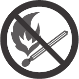</td><td class="hb-symbol-meaning">Trzymaj produkt z dala od ognia.</td></tr></tbody></table>

<table class="hb-symbol-panel-table"><colgroup><col class="hb-symbol-col-icon"/><col class="hb-symbol-col-meaning"/></colgroup><thead><tr><th class="hb-symbol-icon-heading" scope="col">Symbol</th><th class="hb-symbol-meaning-heading" scope="col">Znaczenie</th></tr></thead><tbody><tr><td class="hb-symbol-icon"></td><td class="hb-symbol-meaning">Przechowuj w miejscu niedostępnym dla dzieci.</td></tr><tr><td class="hb-symbol-icon"></td><td class="hb-symbol-meaning">Ten symbol oznacza, że wewnątrz produktu znajduje się bateria litowo-jonowa (Li-ion), którą należy prawidłowo utylizować lub poddać recyklingowi.</td></tr><tr><td class="hb-symbol-icon"></td><td class="hb-symbol-meaning">Ten symbol oznacza, że produktu nie wolno wyrzucać razem z odpadami domowymi i należy go dostarczyć do wyznaczonego punktu zbiórki w celu recyklingu. Prawidłowa utylizacja i recykling przyczynią się do ochrony środowiska. Aby uzyskać więcej informacji na temat utylizacji i recyklingu tego produktu, skontaktuj się z lokalną gminą, firmą zajmującą się utylizacją lub sprzedawcą.</td></tr></tbody></table>

</figure>

# ZAWARTOŚĆ OPAKOWANIA

<figure aria-label="ZAWARTOŚĆ OPAKOWANIA" class="hb-inbox-composition" data-card-count="3" data-component-id="HB-SPECIAL-INBOX" data-inbox-variant="three-card-responsive"><ol class="hb-inbox-grid"><li class="hb-inbox-card" data-item-number="1">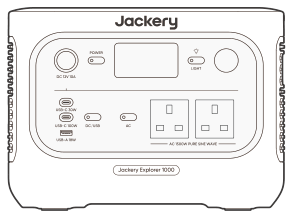

Jackery Explorer 1000

</li><li class="hb-inbox-card" data-item-number="2">

Przewód sieciowy do ładowania

</li><li class="hb-inbox-card" data-item-number="3">

Instrukcja obsługi

</li></ol>

WSKAZÓWKI

Przewód do ładowania samochodowego nie jest dołączony do zestawu, ale można go kupić osobno na naszej stronie internetowej. W celu uzyskania pomocy prosimy o kontakt z obsługą klienta Jackery.

</figure>

# WIDOK OGÓLNY PRODUKTU

<section><h2>WIDOK Z PRZODU</h2><figure class="hb-annotated-figure hb-has-composite-art" data-figure-id="product-overview-front" data-source-fragment-sha256="b29c8c03010249d50570c00053ebd38b799b75065eedb99355192840ff661912" data-web-composite-asset-key="overview.finished.pl.front" data-web-composite-locale="pl" data-web-composite-sha256="2fcc304ec9b83893c5fe819e4632bd03a3703878cbfd187c882392c5926d9b0c" data-web-replace-key="product-overview.front">
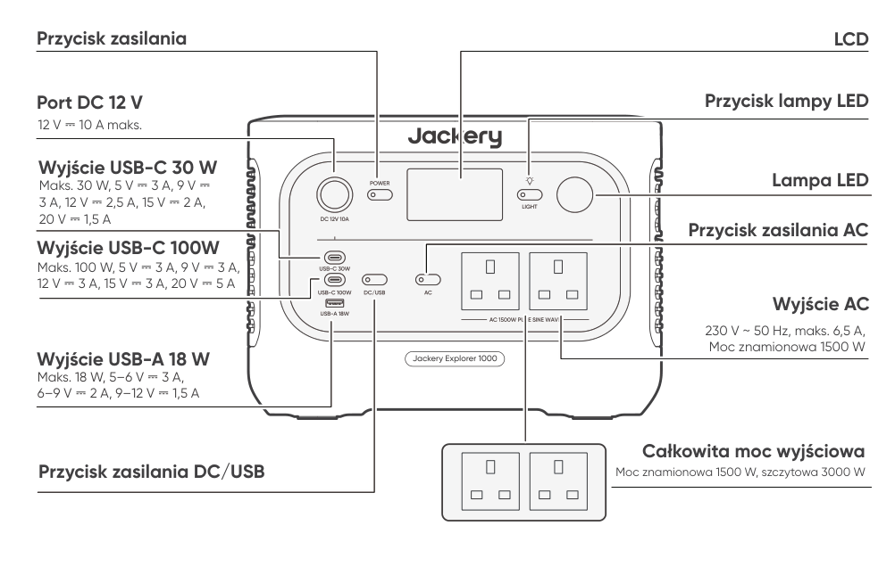

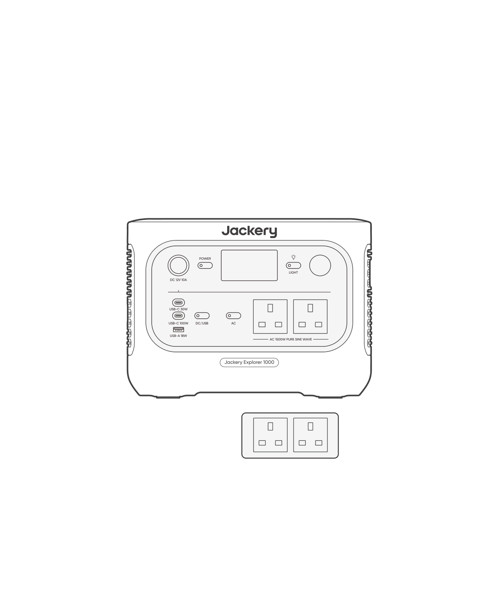<svg aria-hidden="true" class="hb-leader-layer" focusable="false" preserveaspectratio="none" viewbox="0 0 100 100"><polyline class="hb-leader" data-callout-id="overview.front.power" points="0.524765,10 40.5929,10 40.5929,42.4785"></polyline><polyline class="hb-leader" data-callout-id="overview.front.lcd" points="98.4298,9.47368 50.4642,9.47368 50.4642,42.5425"></polyline><polyline class="hb-leader" data-callout-id="overview.front.dc12" points="0.524858,24.4737 35.5267,24.4737 35.5267,41.914"></polyline><polyline class="hb-leader" data-callout-id="overview.front.led_button" points="98.4299,24.4737 58.4665,24.4737 58.4665,42.2151"></polyline><polyline class="hb-leader" data-callout-id="overview.front.usb_c_30" points="0.524858,43.9474 29.0693,43.9474 29.0693,50.377 33.8615,50.377"></polyline><polyline class="hb-leader" data-callout-id="overview.front.led" points="98.8133,37.1053 66.3701,37.1053 66.3701,44.2169"></polyline><polyline class="hb-leader" data-callout-id="overview.front.usb_c_100" points="0.910347,61.8421 32.7703,61.8421 32.7703,52.4546 33.7772,52.4546"></polyline><polyline class="hb-leader" data-callout-id="overview.front.ac_power" points="98.2675,53.1579 46.4179,53.1579 46.4179,51.8275"></polyline><polyline class="hb-leader" data-callout-id="overview.front.usb_a" points="0.548488,78.4211 35.2113,78.4211 35.2113,56.6294"></polyline><polyline class="hb-leader" data-callout-id="overview.front.ac_output" points="98.4299,76.8421 62.2573,76.8421 62.2573,56.0823"></polyline><polyline class="hb-leader" data-callout-id="overview.front.dc_usb" points="0.650347,88.4211 40.2898,88.4211 40.2898,54.5065"></polyline><polyline class="hb-leader" data-callout-id="overview.front.total" points="98.8133,96.3158 68.237,96.3158 68.237,72.9378"></polyline><polyline class="hb-leader-decoration" data-decoration-id="overview.front.decoration-1" points="58.0685,68.4045 58.0685,56.0798"></polyline></svg>

<strong>Przycisk zasilania</strong>

<strong>LCD</strong>

<strong>Port DC 12 V</strong>

12 V ⎓ 10 A maks.

<strong>Przycisk lampy LED</strong>

<strong>Wyjście USB-C 30 W</strong>

Maks. 30 W, 5 V ⎓ 3 A, 9 V ⎓ 3 A, 12 V ⎓ 2,5 A, 15 V ⎓ 2 A, 20 V ⎓ 1,5 A

<strong>Lampa LED</strong>

<strong>Wyjście USB-C 100W</strong>

Maks. 100 W, 5 V ⎓ 3 A, 9 V ⎓ 3 A, 12 V ⎓ 3 A, 15 V ⎓ 3 A, 20 V ⎓ 5 A

<strong>Przycisk zasilania AC</strong>

<strong>Wyjście USB-A 18 W</strong>

Maks. 18 W, 5–6 V ⎓ 3 A, 6–9 V ⎓ 2 A, 9–12 V ⎓ 1,5 A

<strong>Wyjście AC</strong>

230 V ~ 50 Hz, maks. 6,5 A, Moc znamionowa 1500 W

<strong>Przycisk zasilania DC/USB</strong>

<strong>Całkowita moc wyjściowa</strong>

Moc znamionowa 1500 W, szczytowa 3000 W

</figure></section>

<section><h2>WIDOK Z PRAWEJ STRONY</h2><figure class="hb-annotated-figure hb-has-composite-art" data-figure-id="product-overview-right" data-source-fragment-sha256="03073ea311d7bde3dbde1be214a4c582e3472209d398f3af3fa9bc8aaa21df0d" data-web-composite-asset-key="overview.finished.pl.right" data-web-composite-locale="pl" data-web-composite-sha256="faadda716e35ab4f1874396d6293197579251bcf1f9542f74f95cabb20a27827" data-web-replace-key="product-overview.right">
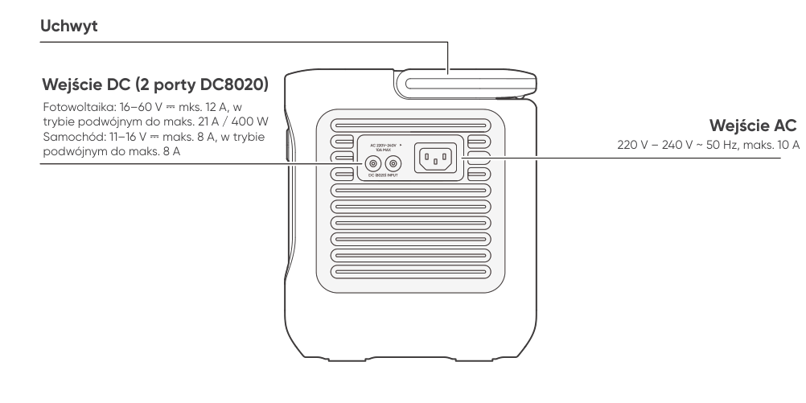

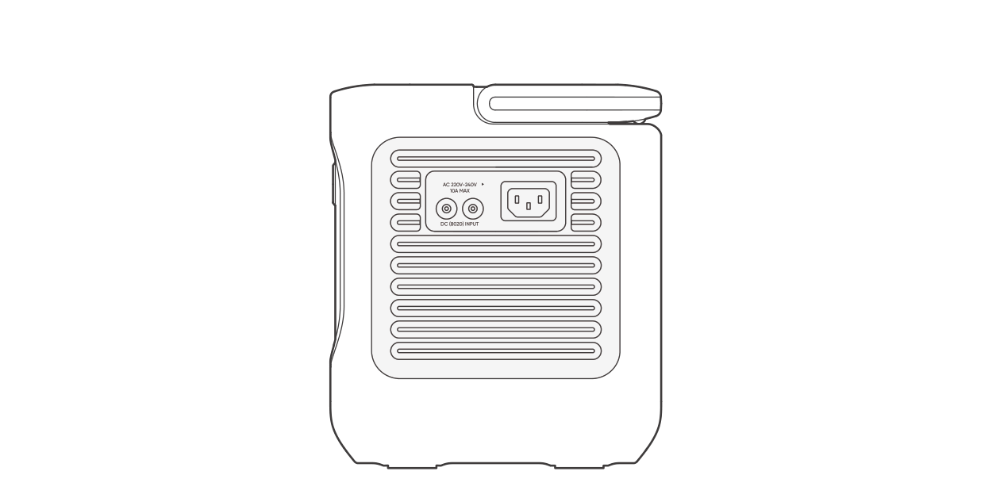<svg aria-hidden="true" class="hb-leader-layer" focusable="false" preserveaspectratio="none" viewbox="0 0 100 100"><polyline class="hb-leader" data-callout-id="overview.right.handle" points="0.83698,9.83381 54.4659,9.83381 54.4659,18.3077"></polyline><polyline class="hb-leader" data-callout-id="overview.right.dc_input" points="43.1728,41.9889 0.83689,41.9889"></polyline><polyline class="hb-leader" data-callout-id="overview.right.ac_input" points="98.2336,40.4828 56.2945,40.4828"></polyline></svg>

<strong>Uchwyt</strong>

<strong>Wejście DC (2 porty DC8020)</strong>

Fotowoltaika: 16–60 V ⎓ mks. 12 A, w trybie podwójnym do maks. 21 A / 400 W Samochód: 11–16 V ⎓ maks. 8 A, w trybie podwójnym do maks. 8 A

<strong>Wejście AC</strong>

220 V – 240 V ~ 50 Hz, maks. 10 A

</figure></section>

# WYŚWIETLACZ LCD

<figure class="hb-reference-figure" data-component-id="HB-SPECIAL-REFERENCE-FIGURE" data-reference-id="lcd-map" data-source-fragment-sha256="bbaa1be4e3820e16eb4a845ffcf982220bf4cf19df21f03f74473d8b56820afc">

</figure>

<figure aria-label="WYŚWIETLACZ LCD" class="hb-lcd-table-composition" data-component-id="HB-TABLE-LCD-ICON" tabindex="0"><table class="hb-lcd-icon-table"><colgroup><col class="hb-lcd-col-number"/><col class="hb-lcd-col-icon"/><col class="hb-lcd-col-name"/><col class="hb-lcd-col-description"/></colgroup><tbody><tr><td class="hb-lcd-number">
1
</td><td class="hb-lcd-icon"></td><td class="hb-lcd-name">
Wi-Fi
</td><td class="hb-lcd-description">
<strong>Wł.:</strong> Połączono z Wi-Fi. <strong>Miga:</strong> Gotowość do połączenia z Wi-Fi. <strong>Wył.:</strong> Rozłączono z Wi-Fi.
</td></tr><tr><td class="hb-lcd-number">
2
</td><td class="hb-lcd-icon"></td><td class="hb-lcd-name">
Bluetooth
</td><td class="hb-lcd-description">
<strong>Wł.:</strong> Połączono z Bluetooth. <strong>Miga:</strong> Gotowość do połączenia z Bluetooth. <strong>Wył.:</strong> Rozłączono z Bluetooth.
</td></tr><tr><td class="hb-lcd-number">
3
</td><td class="hb-lcd-icon"></td><td class="hb-lcd-name">
Tryb cichego ładowania
</td><td class="hb-lcd-description">
<strong>Wł.:</strong> Hałas podczas ładowania jest znacznie zminimalizowany, przy czym moc ładowania jest zmniejszona, a prędkość ładowania maleje. <strong>Wył.:</strong> Tryb cichego ładowania jest wyłączony. Tę funkcję można włączyć lub wyłączyć w aplikacji Jackery. Ustawienie jest zapamiętywane po wyłączeniu urządzenia.
</td></tr><tr><td class="hb-lcd-number">
4
</td><td class="hb-lcd-icon"></td><td class="hb-lcd-name">
Plan ładowania
</td><td class="hb-lcd-description">
Dostosowuje czas ładowania urządzenia Jackery Explorer 1000. W sytuacjach, gdy ceny energii elektrycznej są zmienne, pozwala planować ładowanie w godzinach szczytu i poza szczytem, co obniża koszty energii elektrycznej. Tę funkcję można włączyć lub wyłączyć w aplikacji Jackery. Ustawienie jest zapamiętywane po wyłączeniu urządzenia.
</td></tr><tr><td class="hb-lcd-number">
5
</td><td class="hb-lcd-icon"></td><td class="hb-lcd-name">
Tryb samozasilania
</td><td class="hb-lcd-description">
Maksymalizuje wykorzystanie energii słonecznej i zmniejsza zależność od energii elektrycznej z sieci, dając pierwszeństwo zmagazynowanej energii słonecznej, co obniża koszty energii elektrycznej. Stacja zasilająca musi być jednocześnie podłączona do paneli słonecznych i sieci energetycznej, a moc urządzeń odbiorczych jest ograniczona przez moc obejściową. Tę funkcję można włączyć lub wyłączyć w aplikacji Jackery. Ustawienie jest zapamiętywane po wyłączeniu urządzenia.
</td></tr><tr><td class="hb-lcd-number">
6
</td><td class="hb-lcd-icon"></td><td class="hb-lcd-name">
Tryb taryfy czasowej (TOU)
</td><td class="hb-lcd-description">
<strong>Wł.:</strong> Tryb taryfy czasowej (TOU) jest włączony (domyślna rezerwa – stan naładowania SOC: 60%). W okresach szczytu produkt priorytetowo rozładowuje akumulator, aby obniżyć szczytowe koszty energii elektrycznej, gdy poziom naładowania przekracza rezerwę SOC. W okresach poza szczytem produkt ładuje akumulator z sieci, aby spłaszczyć szczyty i wypełnić dołki. <strong>Wył.:</strong> Tryb taryfy czasowej (TOU) jest wyłączony. Produkt nie stosuje strategii taryfy czasowej i działa zgodnie z domyślną logiką zasilania i ładowania. Tę funkcję można włączyć lub wyłączyć w aplikacji Jackery. Ustawienie jest zapamiętywane po wyłączeniu urządzenia.
</td></tr><tr><td class="hb-lcd-number">
7
</td><td class="hb-lcd-icon"></td><td class="hb-lcd-name">
UPS
</td><td class="hb-lcd-description">
<strong>Wł.:</strong> Produkt działa w trybie obejściowym. Urządzenia odbiorcze podłączone do portów AC pobierają energię z sieci zamiast ze stacji zasilającej. W przypadku nagłej awarii sieci produkt automatycznie przełącza się na zasilanie bateryjne w ciągu 10 ms. <strong>Wył.:</strong> Produkt nie pracuje w trybie obejściowym. Urządzenia odbiorcze podłączone do portów AC są zasilane z wewnętrznej baterii stacji zasilającej.
</td></tr><tr><td class="hb-lcd-number">
8
</td><td class="hb-lcd-icon"></td><td class="hb-lcd-name">
Wskaźnik zasilania AC
</td><td class="hb-lcd-description">
Wyjście AC (czysta sinusoida) jest włączone.
</td></tr><tr><td class="hb-lcd-number">
9
</td><td class="hb-lcd-icon"></td><td class="hb-lcd-name">
Napięcie wyjściowe i częstotliwość
</td><td class="hb-lcd-description">
Gdy wyjście AC jest włączone, wyświetla wartości wyjściowe napięcia i częstotliwości.
</td></tr><tr><td class="hb-lcd-number">
10
</td><td class="hb-lcd-icon"></td><td class="hb-lcd-name">
Moc wejściowa
</td><td class="hb-lcd-description">
Wyświetla moc wejściową w watach.
</td></tr><tr><td class="hb-lcd-number">
11
</td><td class="hb-lcd-icon"></td><td class="hb-lcd-name">
Pozostały czas ładowania
</td><td class="hb-lcd-description">
Wyświetla pozostały czas ładowania.
</td></tr><tr><td class="hb-lcd-number">
12
</td><td class="hb-lcd-icon"></td><td class="hb-lcd-name">
Wskaźnik ładowania z sieci AC
</td><td class="hb-lcd-description">
Produkt jest ładowany przez wejście AC z sieci elektrycznej.
</td></tr><tr><td class="hb-lcd-number">
13
</td><td class="hb-lcd-icon"></td><td class="hb-lcd-name">
Wskaźnik ładowania z gniazda samochodowego
</td><td class="hb-lcd-description">
Produkt jest ładowany przez wejście DC (DC8020) przy użyciu zasilania DC 12 V (z ładowarki samochodowej).
</td></tr><tr><td class="hb-lcd-number">
14
</td><td class="hb-lcd-icon"></td><td class="hb-lcd-name">
Wskaźnik ładowania z paneli słonecznych
</td><td class="hb-lcd-description">
Produkt jest ładowany przez wejście DC (DC8020) za pomocą paneli słonecznych.
</td></tr><tr><td class="hb-lcd-number">
15
</td><td class="hb-lcd-icon"></td><td class="hb-lcd-name">
Tryb oszczędzania baterii
</td><td class="hb-lcd-description">
<strong>Wł.:</strong> Tryb oszczędzania baterii jest włączony. Zastosowano limity ładowania i rozładowywania, aby wydłużyć żywotność baterii. <strong>Wył.:</strong> Tryb oszczędzania baterii jest wyłączony. Tę funkcję można włączyć lub wyłączyć w aplikacji Jackery. Ustawienie jest zapamiętywane po wyłączeniu urządzenia. Gdy ta funkcja jest włączona, produkt od czasu do czasu wykonuje pełny cykl ładowania i rozładowania, aby skalibrować stan naładowania (SOC).
</td></tr><tr><td class="hb-lcd-number">
16
</td><td class="hb-lcd-icon"></td><td class="hb-lcd-name">
Limit mocy ładowania
</td><td class="hb-lcd-description">
<strong>Wł.:</strong> Limit mocy ładowania jest włączony w aplikacji Jackery. <strong>Wył.:</strong> Limit mocy ładowania jest wyłączony w aplikacji Jackery. Ustawienie jest zapamiętywane po wyłączeniu urządzenia.
</td></tr><tr><td class="hb-lcd-number">
17
</td><td class="hb-lcd-icon"></td><td class="hb-lcd-name">
Wskaźnik poziomu baterii
</td><td class="hb-lcd-description">
W trakcie ładowania produktu pomarańczowy pierścień wokół wartości procentowej baterii będzie się zapalał sekwencyjnie. Podczas ładowania innych urządzeń pomarańczowy pierścień będzie stale zaświecony.
</td></tr><tr><td class="hb-lcd-number">
18
</td><td class="hb-lcd-icon"></td><td class="hb-lcd-name">
Wskaźnik niskiego poziomu baterii
</td><td class="hb-lcd-description">
<strong>Wł.:</strong> Poziom naładowania baterii jest niższy niż 20%. <strong>Miga:</strong> Poziom naładowania baterii jest niższy niż 5%. <strong>Wył.:</strong> Poziom naładowania baterii wynosi ponad 20% lub produkt jest ładowany.
</td></tr><tr><td class="hb-lcd-number">
19
</td><td class="hb-lcd-icon"></td><td class="hb-lcd-name">
Pozostały procent baterii
</td><td class="hb-lcd-description">
Wyświetla pozostały procent baterii.
</td></tr><tr><td class="hb-lcd-number">
20
</td><td class="hb-lcd-icon"></td><td class="hb-lcd-name">
Licznik czasu rozładowania
</td><td class="hb-lcd-description">
<strong>Wł.:</strong> Ustawiono licznik czasu rozładowania. <strong>Wył.:</strong> Nie ustawiono licznika czasu rozładowania. Tę funkcję można włączyć lub wyłączyć w aplikacji Jackery. Ustawienie nie jest zapamiętywane po wyłączeniu urządzenia.
</td></tr><tr><td class="hb-lcd-number">
21
</td><td class="hb-lcd-icon"></td><td class="hb-lcd-name">
Tryb oszczędzania energii
</td><td class="hb-lcd-description">
Gdy wyjście AC lub DC zostanie włączone przez naciśnięcie przycisku zasilania AC lub DC/USB: <strong>Wł.:</strong> Tryb oszczędzania energii jest włączony. <strong>Wył.:</strong> Tryb oszczędzania energii jest wyłączony.
</td></tr><tr><td class="hb-lcd-number">
22
</td><td class="hb-lcd-icon"></td><td class="hb-lcd-name">
Wskaźnik wysokiej temperatury
</td><td class="hb-lcd-description">
Zadziałało zabezpieczenie przed wysoką temperaturą. Produkt może nie działać do czasu przywrócenia temperatury do normalnego zakresu roboczego.
</td></tr><tr><td class="hb-lcd-number">
22
</td><td class="hb-lcd-icon"></td><td class="hb-lcd-name">
Wskaźnik niskiej temperatury
</td><td class="hb-lcd-description">
Zadziałało zabezpieczenie przed niską temperaturą. Produkt może nie działać do czasu przywrócenia temperatury do normalnego zakresu roboczego.
</td></tr><tr><td class="hb-lcd-number">
23
</td><td class="hb-lcd-icon">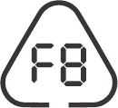</td><td class="hb-lcd-name">
Kod błędu
</td><td class="hb-lcd-description">
Wystąpił błąd produktu. Szczegóły można znaleźć w sekcji Rozwiązywanie problemów.
</td></tr><tr><td class="hb-lcd-number">
24
</td><td class="hb-lcd-icon"></td><td class="hb-lcd-name">
Moc wyjściowa
</td><td class="hb-lcd-description">
Wyświetla moc wyjściową w watach.
</td></tr><tr><td class="hb-lcd-number">
25
</td><td class="hb-lcd-icon"></td><td class="hb-lcd-name">
Pozostały czas zasilania urządzeń odbiorczych
</td><td class="hb-lcd-description">
Wyświetla pozostały czas do rozładowania.
</td></tr></tbody></table></figure>

# OBSŁUGA

## WŁ./WYŁ. ZASILANIA

<figure class="hb-operation-figure hb-operation-layout-status-right hb-base-art-live-copy" data-component-id="HB-SPECIAL-OPERATION" data-operation-id="main-power" data-source-fragment-sha256="90dfb7b3555acd806b9508e30606d6be9a3e2798e2b2dd851bf17ad26c03a757" data-web-base-art-ref="operation/main_power" data-web-presentation-mode="base-art-live-copy" data-web-replace-key="operation.main-power">

3s

<strong>Wł.</strong>

Naciśnij raz

<strong>Wył.</strong>

Naciśnij i przytrzymaj przez 3 s

Domyślny czas czuwania: 2 godziny

Produkt automatycznie wyłączy się po 2 godzinach bezczynności, bez ładowania i zasilania urządzeń odbiorczych.

*Czas czuwania można ustawić w aplikacji Jackery.

</figure>

Gdy tryb oszczędzania energii jest włączony, a przycisk zasilania AC lub DC/USB jest włączony w pozycji ON, ale produkt nie ładuje ani nie rozładowuje, produkt wyłączy się automatycznie po 12 godzinach.

## WŁ./WYŁ. WYJŚCIA AC

<figure class="hb-operation-figure hb-operation-layout-status-right hb-base-art-live-copy" data-component-id="HB-SPECIAL-OPERATION" data-operation-id="ac-output" data-source-fragment-sha256="dafc0dd6f6f75978bd834f0e129750bb4f5dda06055f0e7cde17713e9ec940a3" data-web-base-art-ref="operation/ac_output" data-web-presentation-mode="base-art-live-copy" data-web-replace-key="operation.ac-output">

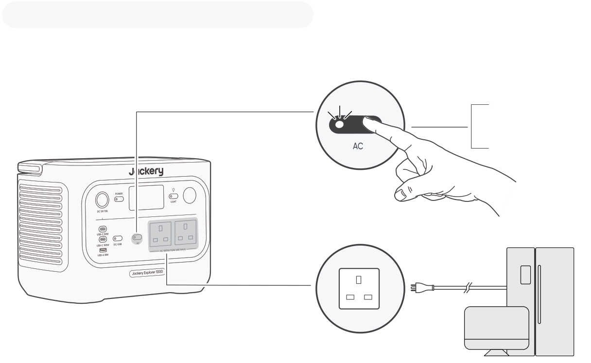

Wymaganie wstępne: Produkt musi być włączony.

<strong>Wł.</strong>

Naciśnij raz

<strong>Wył.</strong>

Naciśnij raz

</figure>

## WŁ./WYŁ. WYJŚCIA DC/USB

<figure class="hb-operation-figure hb-operation-layout-status-right hb-base-art-live-copy" data-component-id="HB-SPECIAL-OPERATION" data-operation-id="dc-usb-output" data-source-fragment-sha256="084e9367d3bd8fca35aec900fa51d0d21a9f45fc9ac1adf9d07184544f96d7d6" data-web-base-art-ref="operation/dc_usb_output" data-web-presentation-mode="base-art-live-copy" data-web-replace-key="operation.dc-usb-output">

Wymaganie wstępne: Produkt musi być włączony.

<strong>Wł.</strong>

Naciśnij raz

<strong>Wył.</strong>

Naciśnij raz

</figure>

<table class="manual-callout-table manual-callout-table"><tbody><tr><td class="manual-callout-label">PRZESTROGA</td><td class="manual-callout-body"><ul><li>Port USB-C 100 W to port wyjściowy dużej mocy zgodny ze standardem USB-PD Power Source 3 (PS3). Jeśli podłączone urządzenie użytkownika lub akcesorium nie spełnia wymogów bezpieczeństwa, może występować ryzyko pożaru. Przed użyciem tych portów należy się upewnić, że podłączone urządzenie lub akcesorium ma zabezpieczenie przeciwpożarowe.</li><li>Stację Jackery Explorer 1000 należy podłączać wyłącznie do urządzeń lub akcesoriów spełniających wymagania przewidziane w punktach 6.3, 6.4 i 6.5 normy IEC/EN/UL 62368-1 (lub innych równoważnych norm).</li><li>Aby uzyskać maksymalną moc wyjściową, należy użyć kabla USB-C do USB-C 5 A (20 V DC / 5 A, 100 W).</li></ul></td></tr></tbody></table>

Produkt można wykorzystać do ładowania akumulatora samochodowego za pomocą kabla Jackery 12 V do ładowania akumulatora samochodowego, który jest sprzedawany osobno i dostępny na naszej stronie internetowej.

<table class="manual-callout-table manual-callout-table"><tbody><tr><td class="manual-callout-label">PRZESTROGA</td><td class="manual-callout-body"><ul><li>Port DC 12 V jest zgodny wyłącznie z akumulatorami samochodowymi 12 V i nie nadaje się do instalacji 24 V.</li><li>Nie uruchamiać samochodu, gdy produkt ładuje akumulator samochodowy przez port wyjściowy DC 12 V, ponieważ może to uszkodzić produkt.</li><li>Funkcja ta jest przeznaczona wyłącznie do użytku awaryjnego i nie jest w stanie naładować całkowicie rozładowanego lub uszkodzonego akumulatora samochodowego.</li></ul></td></tr></tbody></table>

## TRYB OSZCZĘDZANIA ENERGII

Aby zapobiec niepotrzebnemu zużyciu baterii spowodowanemu zapomnieniem o wyłączeniu wyjścia, produkt domyślnie włącza tryb oszczędzania energii. Gdy wyjście AC lub DC/USB jest włączone, na ekranie LCD będzie wyświetlana ikona trybu oszczędzania energii. W tym trybie, jeśli nie jest podłączone żadne urządzenie lub pobór mocy podłączonego urządzenia jest niższy od określonego progu (25 W na wyjściu AC lub 2 W na wyjściu DC/USB), odpowiednie wyjście automatycznie wyłączy się po ustawionym czasie. Ustawienie domyślne to 12 godzin. Czas trwania trybu oszczędzania energii można ustawić w aplikacji Jackery na 1 godz., 2 godz., 8 godz., 12 godz. lub 24 godz. Jeśli ustawiono opcję „Nigdy nie wyłączaj”, tryb oszczędzania energii zostanie wyłączony.

Aby wyłączyć tryb oszczędzania energii, naciśnij i przytrzymaj jednocześnie przycisk zasilania AC oraz główny przycisk POWER na dłużej niż 3 sekundy. Po wyłączeniu trybu oszczędzania energii ikona nie będzie się już pojawiać na ekranie LCD, a produkt nie będzie automatycznie wyłączać wyjścia AC ani USB. Podczas zasilania urządzeń niskopoborowych (AC ≤ 25 W lub DC/USB ≤ 2 W) wyłącz tryb oszczędzania energii, aby zapobiec automatycznemu wyłączaniu wyjścia podczas pracy.

<figure class="hb-operation-figure hb-operation-layout-footer-overlay hb-base-art-live-copy" data-component-id="HB-SPECIAL-OPERATION" data-operation-id="energy-saving" data-source-fragment-sha256="57e316147a6447cc9b48fd77df183eac38d9fb2bdccbe28176375aab7e38a025" data-web-base-art-ref="operation/energy_saving" data-web-presentation-mode="base-art-live-copy" data-web-replace-key="operation.energy-saving">

3s

Wł./wył.

<strong>AC</strong>

Naciśnij i przytrzymaj oba przyciski przez ponad 3 sekundy.

</figure>

<table class="manual-callout-table manual-callout-table"><tbody><tr><td class="manual-callout-label">UWAGA</td><td class="manual-callout-body">
Po włączeniu zasilania tryb oszczędzania energii powraca do poprzedniego stanu. Zmiana trybu wymaga ręcznego przełączenia.
</td></tr></tbody></table>

## WŁ./WYŁ. LAMPY LED

<figure class="hb-operation-figure hb-operation-layout-footer-panel hb-base-art-live-copy" data-component-id="HB-SPECIAL-OPERATION" data-operation-id="led-light" data-source-fragment-sha256="6c6a36c9a2bc33a96f5c9d48e0e941c0c793fdc5ba73f4449f1fb4f7af1f2549" data-web-base-art-ref="operation/led_light" data-web-presentation-mode="base-art-live-copy" data-web-replace-key="operation.led-light">

<strong>Lampa LED ma dwa tryby:</strong> tryb oświetlenia i tryb SOS. W dowolnym trybie naciśnij i przytrzymaj przycisk lampy LED LIGHT, aby wyłączyć światło.

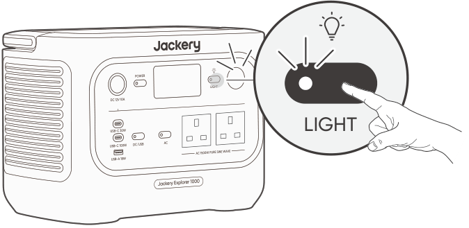

ŚWIATŁONaciśnij przycisk LED LIGHT raz, aby włączyć światło.

SOS
Naciśnij go ponownie, aby przełączyć na tryb SOS.

Naciśnij go po raz trzeci, aby wyłączyć światło.

</figure>

## WYŚWIETLACZ LCD

<figure aria-label="WYŚWIETLACZ LCD" class="hb-lcd-mode-composition" data-component-id="HB-TABLE-LCD-MODE">

<table class="hb-lcd-mode-table"><colgroup><col class="hb-lcd-mode-col-state"/><col class="hb-lcd-mode-col-action"/><col class="hb-lcd-mode-col-copy"/></colgroup><tbody><tr><td class="hb-lcd-mode-state" rowspan="3">Zaświeca się na krótką chwilę</td><td class="hb-lcd-mode-action">Włączanie</td><td class="hb-lcd-mode-copy">Naciśnij przycisk POWER, gdy produkt się ładuje.</td></tr><tr><td class="hb-lcd-mode-action">Wyłączanie</td><td class="hb-lcd-mode-copy">Naciśnij przycisk POWER.</td></tr><tr><td class="hb-lcd-mode-action">Automatyczne wyłączanie</td><td class="hb-lcd-mode-copy">Ekran LCD wyłącza się automatycznie i przechodzi w tryb uśpienia po 2 minutach bezczynności.</td></tr><tr><td class="hb-lcd-mode-state" rowspan="3">Świeci ciągle (w stanie ładowania lub rozładowania)</td><td class="hb-lcd-mode-action">Włączanie</td><td class="hb-lcd-mode-copy">Naciśnij dwukrotnie przycisk POWER, gdy produkt jest włączony.</td></tr><tr><td class="hb-lcd-mode-action">Wyłączanie</td><td class="hb-lcd-mode-copy">Naciśnij przycisk POWER.</td></tr><tr><td class="hb-lcd-mode-action">Automatyczne wyłączanie</td><td class="hb-lcd-mode-copy">Ekran LCD wyłącza się automatycznie po 2 godzinach bezczynności.</td></tr></tbody></table>
</figure>

Tryb pracy wyświetlacza ekranu można również ustawić w aplikacji Jackery.

## FUNKCJA AUTOMATYCZNEGO WZNAWIANIA WYJŚĆ AC I DC

Ta funkcja zapamiętuje stan wyjść i automatycznie wznawia zasilanie na wyjściach AC i DC w określonych warunkach.

<figure aria-label="Warunki automatycznego wznawiania / Warunki braku automatycznego wznawiania" class="hb-auto-resume-composition" data-component-id="HB-TABLE-AUTO-RESUME" tabindex="0"><table class="hb-auto-resume-table"><colgroup><col class="hb-auto-resume-col"/><col class="hb-auto-resume-col"/></colgroup><thead><tr><th class="hb-auto-resume-left" scope="col">Warunki automatycznego wznawiania</th><th class="hb-auto-resume-right" scope="col">Warunki braku automatycznego wznawiania</th></tr></thead><tbody><tr><td class="hb-auto-resume-left">Włączenie/ponowne uruchomienie po wyłączeniu lub restarcie</td><td class="hb-auto-resume-right">Ręczne wyłączenie wyjścia (przyciskiem lub w aplikacji)</td></tr><tr><td class="hb-auto-resume-left" rowspan="2">Poziom naładowania baterii (SOC) ≥ limit rozładowania +10% po osiągnięciu limitu</td><td class="hb-auto-resume-right">Wyłączenie wyjścia przez tryb oszczędzania energii</td></tr><tr><td class="hb-auto-resume-right">Wyłączenie wyjścia w wyniku zadziałania zabezpieczenia</td></tr><tr><td class="hb-auto-resume-left">Zakończenie aktualizacji oprogramowania układowego</td><td class="hb-auto-resume-right">Wyłączenie wyjścia przez licznik czasu rozładowania</td></tr></tbody></table></figure>

## KOMBINACJE KLAWISZY

<figure aria-label="Przyciski / Czynność / Funkcja" class="hb-key-combination-composition" data-component-id="HB-TABLE-KEY-COMBINATIONS" tabindex="0"><table class="hb-key-combination-table"><colgroup><col class="hb-key-col-buttons"/><col class="hb-key-col-operation"/><col class="hb-key-col-function"/></colgroup><thead><tr><th class="hb-key-buttons" scope="col">Przyciski</th><th class="hb-key-operation" scope="col">Czynność</th><th class="hb-key-function" scope="col">Funkcja</th></tr></thead><tbody><tr><td class="hb-key-buttons">Przycisk zasilania + Przycisk zasilania AC</td><td class="hb-key-operation">3 s Naciśnij i przytrzymaj oba przyciski przez 3 s.</td><td class="hb-key-function">Włączanie/wyłączanie trybu oszczędzania energii</td></tr><tr><td class="hb-key-buttons">Przycisk zasilania + Przycisk zasilania DC/USB</td><td class="hb-key-operation">3 s Naciśnij i przytrzymaj oba przyciski przez 3 s.</td><td class="hb-key-function">Resetowanie Wi-Fi i Bluetooth</td></tr><tr><td class="hb-key-buttons">Przycisk zasilania AC + Przycisk zasilania DC/USB</td><td class="hb-key-operation">1 s Naciśnij i przytrzymaj oba przyciski przez 1 s.</td><td class="hb-key-function">Wł./wył. Wi-Fi i Bluetooth</td></tr><tr><td class="hb-key-buttons">Przycisk zasilania + Przycisk lampy LED</td><td class="hb-key-operation">1 s Naciśnij i przytrzymaj oba przyciski przez 1 s.</td><td class="hb-key-function">Włączanie/wyłączanie trybu ładowania awaryjnego</td></tr></tbody></table></figure>

# ZASILACZ BEZPRZERWOWY (UPS)

Podłącz produkt do gniazdka ściennego za pomocą przewodu sieciowego do ładowania AC, następnie naciśnij przycisk zasilania AC, aby równocześnie zasilać urządzenia odbiorcze.

Zasilacz bezprzerwowy (UPS) to rodzaj systemu ciągłego zasilania, który automatycznie dostarcza rezerwową energię elektryczną do urządzenia odbiorczego w przypadku zaniku napięcia w sieci energetycznej. W przypadku nagłego zaniku zasilania sieciowego, Jackery Explorer 1000 automatycznie przełączy się na zasilanie z baterii w ciągu 10 ms, aby podtrzymać pracę urządzeń. W trybie UPS maksymalna moc wyjściowa urządzenia osiąga 1500 W przed wystąpieniem awarii zasilania. Ponieważ w trybie obejściowym możliwe jest jednoczesne ładowanie i rozładowywanie, rzeczywista moc wyjściowa jest niższa od mocy znamionowej, ale podczas awarii przywracana jest moc znamionowa.

<figure class="hb-reference-figure" data-component-id="HB-SPECIAL-REFERENCE-FIGURE" data-reference-id="ups_connection" data-source-fragment-sha256="317117bc28293f776ecc9858e450efeadf1268b6b028c42fc29e9cc0b47576e2">
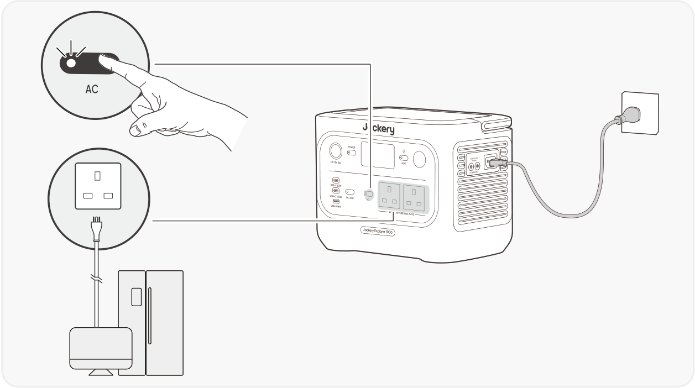
</figure>

<table class="manual-callout-table manual-callout-table"><tbody><tr><td class="manual-callout-label">PRZESTROGA</td><td class="manual-callout-body"><ul><li>Produkt nie obsługuje przełączania w czasie 0 ms. Nie należy podłączać go do urządzeń wymagających zasilania z przełączaniem w czasie 0 ms, takich jak serwery danych lub stacje robocze.</li><li>Przed użyciem należy kilkakrotnie przetestować zgodność z urządzeniem.</li><li>Nie podłączać urządzeń odbiorczych o mocy przekraczającej maksymalną moc wyjściową produktu. W przeciwnym razie zadziała zabezpieczenie przeciążeniowe.</li></ul></td></tr></tbody></table>

<table class="manual-callout-table manual-callout-table"><tbody><tr><td class="manual-callout-label">OSTRZEŻENIE</td><td class="manual-callout-body">
Nie należy używać tego produktu w zastosowaniach takich jak serwery danych lub urządzenia medyczne, gdzie awaria mogłaby zagrozić życiu lub spowodować znaczne szkody materialne. W przypadku poniższego sprzętu przerwa w dostawie zasilania podczas użytkowania mogłaby poważnie zagrozić bezpieczeństwu osób lub mienia:
<ul><li>Urządzenia medyczne oraz inny sprzęt ściśle związany z ochroną życia.</li><li>Sprzęt o znaczeniu krytycznym, taki jak infrastruktura społeczna i usługi publiczne.</li><li>Sprzęt o znaczeniu krytycznym dla działalności przedsiębiorstw itp. Osoby z wszczepionym rozrusznikiem serca (stymulatorem) nie mogą korzystać z tego produktu.</li></ul></td></tr></tbody></table>

# ŁADOWANIE

Ekologiczna energia przede wszystkim! Propagujemy korzystanie w pierwszej kolejności z energii ekologicznej. Ten produkt obsługuje jednocześnie dwa tryby ładowania: ładowanie z paneli słonecznych i ładowanie z gniazdka ściennego AC. Gdy ładowanie z gniazdka ściennego AC i ładowanie z paneli słonecznych są włączone jednocześnie, produkt będzie preferować ładowanie z paneli, a obie metody będą ładować baterię z maksymalną dopuszczalną mocą.

Przed pierwszym użyciem w pełni naładuj produkt.

<table class="manual-callout-table manual-callout-table"><tbody><tr><td class="manual-callout-label">Uwaga</td><td class="manual-callout-body"><ul><li>Zalecany zakres temperatury otoczenia podczas ładowania produktu wynosi od 0°C do 45°C, a zakres temperatury otoczenia podczas zasilania urządzeń odbiorczych – od -10°C do 45°C.</li><li>Eksploatacja produktu poza tym zakresem temperatur może ograniczyć możliwości ładowania i zasilania urządzeń odbiorczych, a nawet uniemożliwić te czynności.</li><li>Moc ładowania i pojemność baterii produktu mogą się zmieniać w zależności od wahań temperatury.</li></ul></td></tr></tbody></table>

## ŁADOWANIE Z SIECIOWEGO GNIAZDKA ŚCIENNEGO AC

<figure class="hb-reference-figure" data-component-id="HB-SPECIAL-REFERENCE-FIGURE" data-reference-id="ac_wall_charging" data-source-fragment-sha256="3caa75267caa4363fdb363b52db4220fdab64ca6652cfe046ff553cadc1caf58">
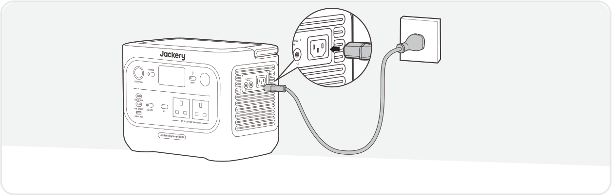
</figure>

Podłącz przewód sieciowy do ładowania AC do portu wejściowego AC produktu i do gniazdka ściennego.

<table class="manual-callout-table manual-callout-table"><tbody><tr><td class="manual-callout-label">PRZESTROGA</td><td class="manual-callout-body">
Upewnij się, że przewód ładowania AC jest solidnie i bezpiecznie podłączony do portu wejściowego AC. Niedokładne podpięcie przewodu może powodować niestabilność prądu, przegrzanie, słaby styk lub awarię urządzenia.
</td></tr></tbody></table>

<strong>Tryb ładowania awaryjnego</strong>

W tym trybie można szybko naładować przenośną stację zasilającą z gniazdka sieciowego AC. Tę funkcję ładowania awaryjnego można aktywować lub dezaktywować za pomocą aplikacji Jackery. W trybie ładowania awaryjnego okrągły wskaźnik stanu naładowania (SOC) będzie migać z większą częstotliwością.

* Aby zmaksymalizować żywotność baterii, najlepiej ładować urządzenie z normalną prędkością. Trybu ładowania awaryjnego należy używać tylko w razie konieczności. Nie jest zalecany przy regularnym, długotrwałym użytkowaniu.

## ŁADOWANIE Z PANELI SŁONECZNYCH (SPRZEDAWANYCH ODDZIELNIE)

Stacja Jackery Explorer 1000 ma dwa porty wejściowe DC8020 i jest kompatybilna z panelami słonecznymi Jackery.

<figure class="hb-reference-figure hb-base-art-live-copy" data-component-id="HB-SPECIAL-REFERENCE-FIGURE" data-reference-id="solar_single" data-source-fragment-sha256="5308751309d378452c559cbba1c9159a07f60fa618069516b1f67ccec5e15a8d" data-web-base-art-ref="solar_single" data-web-presentation-mode="base-art-live-copy">

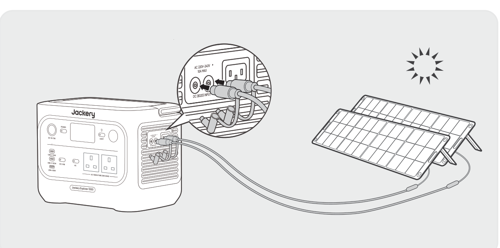SolarSaga 200 × 2

</figure>

Jeśli do jednego portu wejściowego DC8020 trzeba podłączyć jednocześnie dwa panele słoneczne, należy skorzystać z poniższego rysunku ilustrującego ładowanie przez łącznik paneli słonecznych (sprzedawany oddzielnie, nie wchodzi w skład standardowego wyposażenia).

<figure class="hb-reference-figure hb-base-art-live-copy" data-component-id="HB-SPECIAL-REFERENCE-FIGURE" data-reference-id="solar_four" data-source-fragment-sha256="4f08a53970e306ca526eb4876b8b98983c60d284d035d30ea38bab98a3e217ba" data-web-base-art-ref="solar_four" data-web-presentation-mode="base-art-live-copy">

SolarSaga 100 Air × 4

</figure>

<table class="manual-callout-table manual-callout-table"><tbody><tr><td class="manual-callout-label">PRZESTROGA</td><td class="manual-callout-body">
Do jednego portu wejściowego DC8020 można podłączyć maksymalnie dwa panele słoneczne.
</td></tr></tbody></table>

<table class="manual-callout-table manual-callout-table"><tbody><tr><td class="manual-callout-label">PRZESTROGA</td><td class="manual-callout-body">
Należy się upewnić, że napięcie wejściowe na obu portach DC jest takie samo. Nieprzestrzeganie tego zalecenia może uszkodzić produkt. Na przykład:
<ul><li>Używać tego samego modelu paneli słonecznych Jackery i tej samej liczby paneli w przypadku podłączania ich do obu portów wejściowych DC8020.</li><li>Nie ładować produktu jednocześnie za pomocą ładowarki samochodowej i panelu słonecznego. Może to spowodować przepalenie bezpiecznika samochodowego lub awarię ładowania.</li></ul></td></tr></tbody></table>

Do ładowania produktu zaleca się korzystanie z panelu słonecznego Jackery. Należy upewnić się, że napięcie obwodu otwartego (Voc) panelu słonecznego mieści się w zakresie wejściowym DC (16 V – 60 V) urządzenia Jackery Explorer 1000. Jackery nie ponosi odpowiedzialności za jakiekolwiek szkody lub straty wynikające z użycia paneli słonecznych innych producentów.

ŁADOWANIE ZA POMOCĄ ŁADOWARKI SAMOCHODOWEJ (SPRZEDAWANEJ ODDZIELNIE) Produkt ten można ładować za pomocą ładowarki samochodowej 12 V. Należy zapewnić właściwe połączenie między ładowarką samochodową a gniazdem zasilania 12 V (zapalniczką samochodową).

* Przewód samochodowy do ładowania jest sprzedawany osobno.

<figure class="hb-reference-figure hb-base-art-live-copy" data-component-id="HB-SPECIAL-REFERENCE-FIGURE" data-reference-id="car_charging" data-source-fragment-sha256="bc792c1b5c4230f51d24514fa32541af142f96f279d1d611c2a88d4ccdd59565" data-web-base-art-ref="car_charging" data-web-presentation-mode="base-art-live-copy">

Pojazd

</figure>

<table class="manual-callout-table manual-callout-table"><tbody><tr><td class="manual-callout-label">PRZESTROGA</td><td class="manual-callout-body"><ul><li>Uruchomić pojazd przed przystąpieniem do ładowania stacji zasilającej.</li><li>Jeśli pojazd porusza się po wyboistych drogach, zabrania się korzystania z ładowarki samochodowej, aby uniknąć niestandardowego działania. Firma nie ponosi odpowiedzialności za jakiekolwiek straty spowodowane niestandardowym działaniem.</li><li>Ładowanie z pojazdu jest możliwe wyłącznie w pojazdach z instalacją 12 V DC, a nie 24 V DC. Nie wolno ładować tego produktu w pojeździe z instalacją 24 V, gdyż mogłoby to doprowadzić do obrażeń ciała i strat materialnych.</li></ul></td></tr></tbody></table>

# PRZECHOWYWANIE

Produkt należy przechowywać w suchym, czystym i dobrze wentylowanym miejscu. Temperatura i wilgotność w miejscu przechowywania:

<ul><li>1 miesiąc: -20°C do 45°C (0–60% wilgotności względnej)</li><li>3 miesiące: 0°C do 45°C (0–60% wilgotności względnej)</li><li>12 miesiące: 0°C do 25°C (0–60% wilgotności względnej) Jeśli produkt będzie przechowywany przez długi czas (3–6 miesięcy) z rozładowaną baterią, jego naładowanie może okazać się niemożliwe. Aby temu zapobiec i zadbać o kondycję baterii, zaleca się sprawdzanie i ładowanie produktu co trzy miesiące oraz przeprowadzanie pełnego cyklu ładowania i rozładowania co najmniej raz na 6–12 miesięcy.</li></ul>

# ROZWIĄZYWANIE PROBLEMÓW

Jeśli pojawi się którykolwiek z poniższych kodów błędów, wykonaj wymienione działania naprawcze, aby rozwiązać problem. Jeśli usterka nie ustąpi, skontaktuj się z działem wsparcia Jackery.

<figure aria-label="Kod błędu / Działania naprawcze" class="hb-troubleshooting-composition" data-component-id="HB-TABLE-TROUBLESHOOTING" tabindex="0"><table class="hb-troubleshooting-table"><colgroup><col class="hb-troubleshooting-col-code"/><col class="hb-troubleshooting-col-measures"/></colgroup><thead><tr><th class="hb-troubleshooting-code" scope="col">Kod błędu</th><th class="hb-troubleshooting-measures" scope="col">Działania naprawcze</th></tr></thead><tbody><tr><td class="hb-troubleshooting-code">F0</td><td class="hb-troubleshooting-measures">Uruchom produkt ponownie.</td></tr><tr><td class="hb-troubleshooting-code">F1</td><td class="hb-troubleshooting-measures">Uruchom produkt ponownie.</td></tr><tr><td class="hb-troubleshooting-code">F2</td><td class="hb-troubleshooting-measures">Uruchom produkt ponownie.</td></tr><tr><td class="hb-troubleshooting-code">F3</td><td class="hb-troubleshooting-measures">Uruchom produkt ponownie.</td></tr><tr><td class="hb-troubleshooting-code">F4</td><td class="hb-troubleshooting-measures">Podłącz produkt do urządzeń odbiorczych, aby rozładować baterię, aż usterka zniknie.</td></tr><tr><td class="hb-troubleshooting-code">F5</td><td class="hb-troubleshooting-measures">Naładuj produkt za pomocą paneli słonecznych lub z gniazdka ściennego AC do momentu, aż usterka zniknie.</td></tr><tr><td class="hb-troubleshooting-code">F6</td><td class="hb-troubleshooting-measures">1. Przed przystąpieniem do ładowania produktu z gniazdka ściennego AC poczekaj, aż napięcie w sieci się ustabilizuje. 2. Sprawdź, czy wlotowe i wylotowe otwory wentylacyjne nie są zablokowane. Pozostaw 0,66 ft (20 cm) odstępu po obu stronach produktu. 3. Trzymaj produkt w miejscu nienarażonym na bezpośrednie działanie promieni słonecznych ani na wysokie temperatury otoczenia. 4. Odłącz wszystkie urządzenia odbiorcze od produktu. Pozostaw produkt w stanie bezczynności i poczekaj, aż usterka zniknie. 5. Uruchom produkt ponownie.</td></tr><tr><td class="hb-troubleshooting-code">F7</td><td class="hb-troubleshooting-measures">1. Odłącz wszystkie wtyki DC podłączone do produktu. 2. Jeśli ładujesz produkt za pomocą panelu słonecznego, sprawdź napięcie obwodu otwartego (VOC) podłączonego panelu słonecznego. Produkt dopuszcza maksymalne napięcie wejściowe DC wynoszące 60 V. 3. Zrestartuj produkt i pozostaw go w stanie bezczynności. Poczekaj, aż usterka zniknie.</td></tr><tr><td class="hb-troubleshooting-code">F8</td><td class="hb-troubleshooting-measures">Skontaktuj się z działem obsługi klienta Jackery.</td></tr><tr><td class="hb-troubleshooting-code">F9</td><td class="hb-troubleshooting-measures">Odłącz urządzenia odbiorcze podłączone do portów USB produktu. Poczekaj, aż usterka zniknie.</td></tr><tr><td class="hb-troubleshooting-code">FE</td><td class="hb-troubleshooting-measures">Skontaktuj się z działem obsługi klienta Jackery.</td></tr></tbody></table></figure>

# DANE TECHNICZNE

## INFORMACJE OGÓLNE

<figure aria-label="INFORMACJE OGÓLNE" class="hb-spec-table-composition"><table class="manual-table manual-spec-table hb-spec-table"><colgroup><col class="hb-spec-col-label"/><col class="hb-spec-col-value"/></colgroup><tbody><tr><th class="manual-spec-label hb-spec-label" scope="row">Nazwa produktu</th><td class="manual-spec-value hb-spec-value">Jackery Explorer 1000</td></tr><tr><th class="manual-spec-label hb-spec-label" scope="row">Numer modelu</th><td class="manual-spec-value hb-spec-value">JE-1000F</td></tr><tr><th class="manual-spec-label hb-spec-label" scope="row">Pojemność</th><td class="manual-spec-value hb-spec-value">1024 Wh (20 Ah / 51,2 V DC)</td></tr><tr><th class="manual-spec-label hb-spec-label" scope="row">Typ ogniw</th><td class="manual-spec-value hb-spec-value">LiFePO4</td></tr><tr><th class="manual-spec-label hb-spec-label" scope="row">Waga</th><td class="manual-spec-value hb-spec-value">Około 10,6 kg</td></tr><tr><th class="manual-spec-label hb-spec-label" scope="row">Wymiary</th><td class="manual-spec-value hb-spec-value">31,4 x 20,1 x 23,4 cm</td></tr><tr><th class="manual-spec-label hb-spec-label" scope="row">Żywotność</th><td class="manual-spec-value hb-spec-value">4000 cykli do 70%+ pojemności</td></tr></tbody></table></figure>

## PORTY WEJŚCIOWE

<figure aria-label="PORTY WEJŚCIOWE" class="hb-spec-table-composition"><table class="manual-table manual-spec-table hb-spec-table"><colgroup><col class="hb-spec-col-label"/><col class="hb-spec-col-value"/></colgroup><tbody><tr><th class="manual-spec-label hb-spec-label" scope="row">1 × wejście AC</th><td class="manual-spec-value hb-spec-value">Tryb ładowania: 220–240 V~50 Hz, 10 A maks.</td></tr><tr><th class="manual-spec-label hb-spec-label" scope="row">2 porty DC8020</th><td class="manual-spec-value hb-spec-value">11 V – 16 V ⎓ 8 A maks., po podwojeniu do 8 A maks. 16 V – 60 V ⎓ 12 A maks., po podwojeniu do 21 A / 400 W maks.</td></tr></tbody></table></figure>

## PORTY WYJŚCIOWE

<figure aria-label="PORTY WYJŚCIOWE" class="hb-spec-table-composition"><table class="manual-table manual-spec-table hb-spec-table"><colgroup><col class="hb-spec-col-label"/><col class="hb-spec-col-value"/></colgroup><tbody><tr><th class="manual-spec-label hb-spec-label" scope="row">2 × AC</th><td class="manual-spec-value hb-spec-value">230 V ~ 50 Hz, maks. 6,5 A, 1500 W mocy znamionowej na port, 1500 W łącznie, 3000 W mocy szczytowej</td></tr><tr><th class="manual-spec-label hb-spec-label" scope="row">Wyjście AC w trybie obejściowym ①</th><td class="manual-spec-value hb-spec-value">220–240 V ~50 Hz, 1500 W</td></tr><tr><th class="manual-spec-label hb-spec-label" scope="row">1 x USB-C 30 W</th><td class="manual-spec-value hb-spec-value">Maks. 30 W, 5 V ⎓ 3 A, 9 V ⎓ 3 A, 12 V ⎓ 2,5 A, 15 V ⎓ 2 A, 20 V ⎓ 1,5 A</td></tr><tr><th class="manual-spec-label hb-spec-label" scope="row">1 x USB-C 100 W</th><td class="manual-spec-value hb-spec-value">Maks. 100 W, 5 V ⎓ 3 A, 9 V ⎓ 3 A, 12 V ⎓ 3 A, 15 V ⎓ 3 A, 20 V ⎓ 5 A</td></tr><tr><th class="manual-spec-label hb-spec-label" scope="row">1 × USB-A</th><td class="manual-spec-value hb-spec-value">Maks. 18 W, 5–6 V ⎓ 3 A, 6–9 V ⎓ 2 A, 9–12 V ⎓ 1,5 A</td></tr><tr><th class="manual-spec-label hb-spec-label" scope="row">1 port DC 12V</th><td class="manual-spec-value hb-spec-value">12 V ⎓ 10 A maks.</td></tr></tbody></table></figure>

## TEMPERATURA OTOCZENIA ROBOCZEGO

<figure aria-label="TEMPERATURA OTOCZENIA ROBOCZEGO" class="hb-spec-table-composition"><table class="manual-table manual-spec-table hb-spec-table"><colgroup><col class="hb-spec-col-label"/><col class="hb-spec-col-value"/></colgroup><tbody><tr><th class="manual-spec-label hb-spec-label" scope="row">Temperatura ładowania</th><td class="manual-spec-value hb-spec-value">0°C do 45°C</td></tr><tr><th class="manual-spec-label hb-spec-label" scope="row">Temperatura rozładowania</th><td class="manual-spec-value hb-spec-value">-10 °C do 45°C</td></tr></tbody></table></figure>

※ USB Type-C® i USB-C® są zastrzeżonymi znakami towarowymi organizacji USB Implementers Forum.

①. Baterię produktu można ładować z gniazdka ściennego AC, jednocześnie zapewniając zasilanie innych urządzeń przez porty wyjściowe AC.

# GWARANCJA

<figure aria-label="GWARANCJA" class="hb-warranty-intro-composition" data-component-id="HB-WARRANTY-LEAD">

<strong>Niniejsza gwarancja dotyczy wyłącznie klientów, którzy dokonali zakupu na oficjalnej stronie Jackery, na platformach zewnętrznych marki Jackery lub u lokalnych autoryzowanych sprzedawców.</strong>

*Okres i szczegóły gwarancji mogą się różnić w zależności od lokalnych przepisów prawa, regulacji oraz autoryzowanych sprzedawców.

</figure>

## Ograniczona gwarancja

<figure aria-label="Ograniczona gwarancja" class="hb-warranty-card" data-component-id="HB-WARRANTY-SECTION" data-warranty-card-index="1">
Jackery gwarantuje pierwotnemu nabywcy konsumenckiemu, że produkt Jackery będzie wolny od wad wykonania i materiałowych przy normalnym użytkowaniu konsumenckim w odpowiednim okresie gwarancyjnym określonym w sekcji „Okres gwarancji” poniżej, z zastrzeżeniem wyłączeń określonych poniżej. Niniejsze oświadczenie gwarancyjne określa wszystkie i jedyne zobowiązania gwarancyjne Jackery. Nie przyjmujemy ani nie upoważniamy żadnej osoby do przyjmowania w naszym imieniu jakiejkolwiek innej odpowiedzialności w związku ze sprzedażą naszych produktów.
</figure>

## Okres gwarancji

<figure aria-label="Okres gwarancji" class="hb-warranty-period-card" data-component-id="HB-WARRANTY-YEARS">

3
<strong class="hb-warranty-years-unit">LATA</strong><strong class="hb-warranty-period-label">Gwarancja standardowa</strong>

Standardowy okres gwarancji dla urządzenia Jackery Explorer 1000 wynosi 36 miesięcy. W każdym przypadku okres gwarancji liczony jest od daty zakupu przez pierwotnego nabywcę konsumenckiego. W celu ustalenia daty rozpoczęcia okresu gwarancyjnego wymagany jest paragon lub inny wiarygodny dowód zakupu od pierwszego nabywcy.

2
<strong class="hb-warranty-years-unit">LATA</strong><strong class="hb-warranty-period-label">Przedłużona gwarancja</strong>

Aby aktywować przedłużenie gwarancji, należy zarejestrować produkt online lub skontaktować się z naszym zespołem obsługi klienta pod adresem hello.eu@jackery.com w celu przedłużenia standardowego okresu gwarancji.

</figure>

## Wymiana

<figure aria-label="Wymiana" class="hb-warranty-card" data-component-id="HB-WARRANTY-SECTION" data-warranty-card-index="2">
Jackery wymieni na swój koszt każdy produkt Jackery, który nie będzie działać w odpowiednim okresie gwarancyjnym z powodu wady wykonania lub materiałowej. Produkt zastępczy przejmuje pozostały okres gwarancji pierwotnego produktu.
</figure>

## Ograniczenie do pierwotnego nabywcy konsumenckiego

<figure aria-label="Ograniczenie do pierwotnego nabywcy konsumenckiego" class="hb-warranty-card" data-component-id="HB-WARRANTY-SECTION" data-warranty-card-index="3">
Gwarancja na produkt Jackery jest ograniczona do pierwotnego nabywcy konsumenckiego i nie podlega przeniesieniu na żadnego kolejnego właściciela.
</figure>

## Wyłączenia

<figure aria-label="Wyłączenia" class="hb-warranty-card" data-component-id="HB-WARRANTY-SECTION" data-warranty-card-index="4">
Gwarancja Jackery nie obejmuje:
<ul><li>Jakiegokolwiek produktu, który był niewłaściwie użytkowany, używany niezgodnie z przeznaczeniem, modyfikowany, uszkodzony w wyniku wypadku lub używany do celów innych niż normalne użytkowanie konsumenckie zgodnie z aktualną dokumentacją produktową Jackery.</li><li>Prób naprawy podejmowanych przez osoby inne niż autoryzowany serwis.</li><li>Jakiegokolwiek produktu zakupionego za pośrednictwem internetowego serwisu aukcyjnego.</li><li>Gwarancja Jackery nie obejmuje ogniwa baterii, chyba że ogniwo zostanie w pełni naładowane przez użytkownika w ciągu siedmiu dni od zakupu produktu oraz co najmniej raz na 6 miesięcy w późniejszym okresie.</li></ul></figure>

## Prawo do interpretacji

<figure aria-label="Prawo do interpretacji" class="hb-warranty-card" data-component-id="HB-WARRANTY-SECTION" data-warranty-card-index="5">
Jackery zastrzega sobie prawo do ostatecznej interpretacji powyższej polityki posprzedażowej.
</figure>

# KONFIGURACJA APLIKACJI

## 1. Pobierz aplikację i się zaloguj

<figure aria-label="1. Pobierz aplikację i się zaloguj" class="hb-app-download-composition" data-component-id="HB-SPECIAL-APP">

Wyszukaj „Jackery” w Google Play lub App Store, aby zainstalować aplikację. Wówczas pojawi się możliwość zarejestrowania i zalogowania.

Alternatywnie zeskanuj kod QR poniżej, aby pobrać i zainstalować aplikację.

</figure>

## 2. Dodaj urządzenie

2.1 Kliknij przycisk + , aby dodać urządzenie.

2.2 Naciśnij przycisk POWER na urządzeniu, aby je włączyć. Ikony Wi-Fi i Bluetooth na urządzeniu migają, wskazując, że urządzenie weszło w tryb konfiguracji sieci. Naciśnij przycisk „Icon Flashed” potwierdzający, że ikona zamigała, i zezwól aplikacji na łączenie się z pobliskimi urządzeniami oraz przyznaj jej uprawnienia Bluetooth.

<figure class="hb-app-add-device-composition hb-has-reference-captions" data-component-id="HB-SPECIAL-APP" data-reference-id="app-add-device" data-step-captions="live">

<figcaption class="hb-reference-caption-grid" data-caption-count="2" data-caption-layout="equal" style="--hb-caption-count:2;width:min(100%,44rem)">2.12.2</figcaption>
Przycisk zasilaniaPrzycisk zasilania DC/USBPrzycisk zasilania AC
</figure>

2.3 Po dotknięciu ikony wyszukanego urządzenia aplikacja automatycznie łączy się z urządzeniem przez Bluetooth.

<table class="manual-callout-table manual-callout-table"><tbody><tr><td class="manual-callout-label">Uwaga</td><td class="manual-callout-body">
Jeśli podczas parowania pojawi się komunikat „Urządzenie zostało już sparowane”, można skorzystać z następujących dwóch sposobów połączenia:
<ul><li>Właściciel urządzenia może udostępnić to urządzenie innym użytkownikom za pośrednictwem aplikacji.</li><li>Można nacisnąć i przytrzymać przycisk POWER oraz przycisk zasilania DC/USB przez 3 sekundy, aby zresetować Wi-Fi i Bluetooth urządzenia, a następnie ponownie sparować urządzenie.</li></ul></td></tr></tbody></table>

2.4 Po pomyślnym podłączeniu urządzenia wprowadź hasło Wi-Fi i naciśnij przycisk OK.

<table class="manual-callout-table manual-callout-table"><tbody><tr><td class="manual-callout-label">Uwaga</td><td class="manual-callout-body">
Wybierz sieć Wi-Fi w paśmie 2,4 GHz. Urządzenie nie obsługuje sieci Wi-Fi w paśmie 5 GHz.
</td></tr></tbody></table>

2.5 Po pomyślnym dodaniu urządzenia do aplikacji ikona Wi-Fi na urządzeniu będzie zawsze włączona.

<figure class="hb-reference-figure hb-has-reference-captions" data-component-id="HB-SPECIAL-REFERENCE-FIGURE" data-reference-id="app-connect-result" data-source-fragment-sha256="fc2c261140139b268c4b14a9e289555c6cdff72aa4267fe9fd1a56f53e1b0075">

<figcaption class="hb-reference-caption-grid" data-caption-count="3" data-caption-layout="equal" style="--hb-caption-count:3">2.32.42.5</figcaption></figure>

Powyższe zrzuty ekranu mają charakter wyłącznie poglądowy.

<table class="manual-callout-table manual-callout-table"><tbody><tr><td class="manual-callout-label">PRZESTROGA</td><td class="manual-callout-body">
Aplikacja Jackery może łączyć się jednocześnie tylko z jedną stacją zasilającą poprzez Bluetooth. Powrót do listy urządzeń automatycznie rozłącza połączenie Bluetooth. Ponowne kliknięcie stacji zasilającej na liście spowoduje automatycznie ponowne połączenie.
</td></tr></tbody></table>

## 3. Usuń sparowane urządzenie

Kliknij ikonę ustawień w prawym górnym rogu głównego interfejsu urządzenia, aby przejść do strony ustawień, a następnie kliknij przycisk Unbind (Usuń parowanie) u dołu strony, aby usunąć sparowane urządzenie.

## 4. Uwagi

### 4.1 Włączanie Wi-Fi i Bluetooth:

<ul><li>Wi-Fi i Bluetooth włączają się automatycznie po uruchomieniu urządzenia, a ikony Wi-Fi i Bluetooth na ekranie zaświecają się.</li><li>Przytrzymaj jednocześnie przycisk zasilania DC/USB + przycisk zasilania AC, aż ikony Wi-Fi i Bluetooth na ekranie zaświecą się.</li></ul>

### 4.2 Wyłączanie Wi-Fi i Bluetooth:

<ul><li>Przytrzymaj jednocześnie przycisk zasilania DC/USB + przycisk zasilania AC, aż ikony Wi-Fi i Bluetooth na ekranie zgasną.</li></ul>

### 4.3 Resetowanie Wi-Fi i Bluetooth:

<ul><li>Przytrzymaj jednocześnie przycisk POWER + przycisk zasilania DC/USB przez 3 sekundy, aby zresetować Wi-Fi i Bluetooth do ustawień fabrycznych. Parowanie z połączonym kontem w aplikacji zostanie usunięte.</li></ul>

# EU declaration and manufacturer

Shenzhen Hello Tech Energy Co., Ltd. hereby declares that this: Jackery Explorer 1000 with Bluetooth and Wi-Fi JE-1000F is in compliance with the essential requirements and other relevant provisions of the Directive 2014/53/EU, 2011/65/EU+(EU)2015/863, The full text of the EU declaration of conformity is available at the following internet address: https://de.jackery.com/pages/user-guides

MANUFACTURER: SHENZHEN HELLO TECH ENERGY CO.,LTD. Address: F2-3, Bldg. 7, Jiaanda Science and technology industrial park factory, the east side of Huafan Road, Tongsheng Community, Dalang Street, Longhua District, Shenzhen, Guangdong, China

sales@hello-tech.com +86 400 668 9293 www.hello-tech.com

