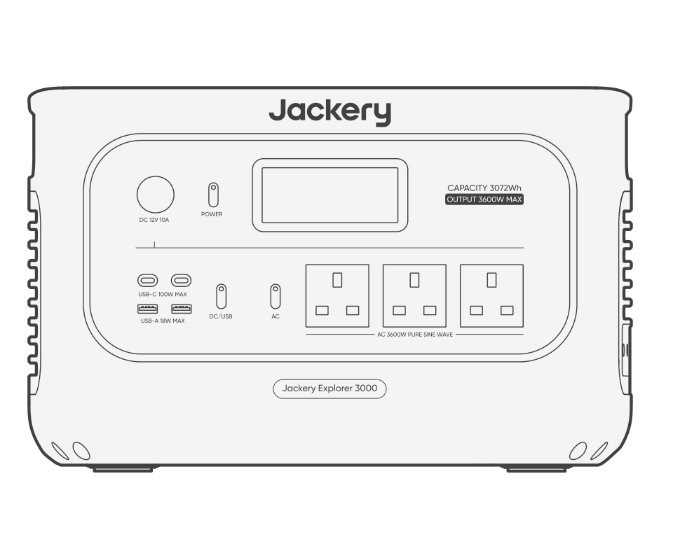
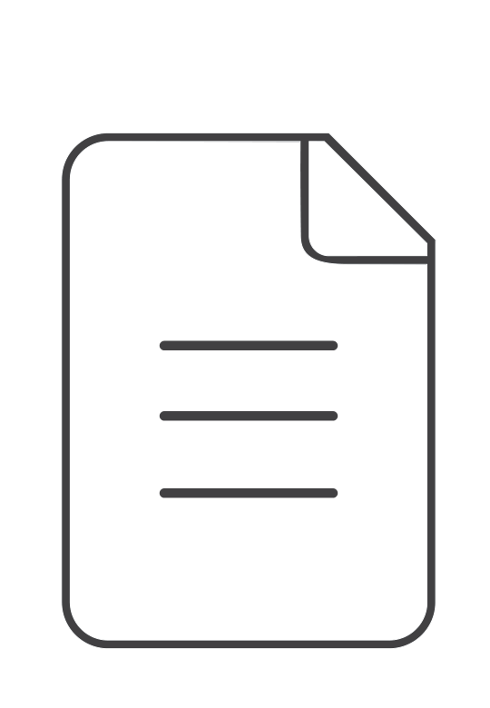
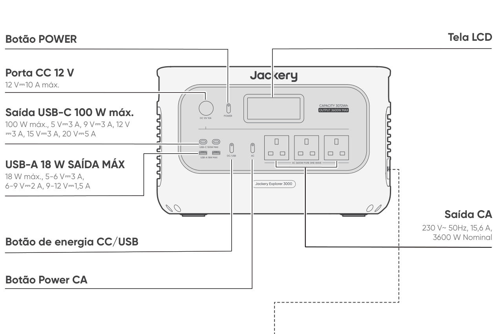
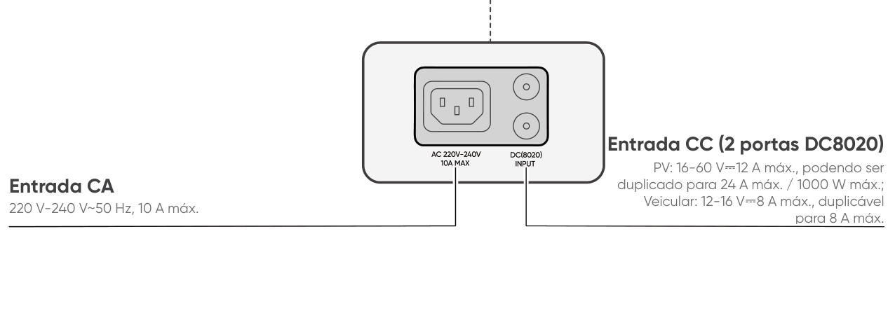
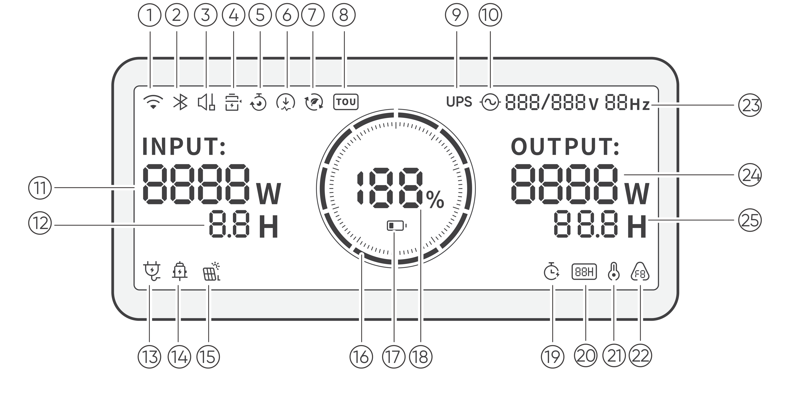
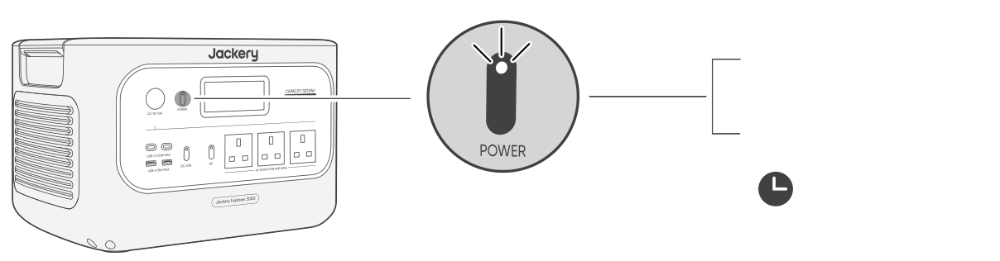
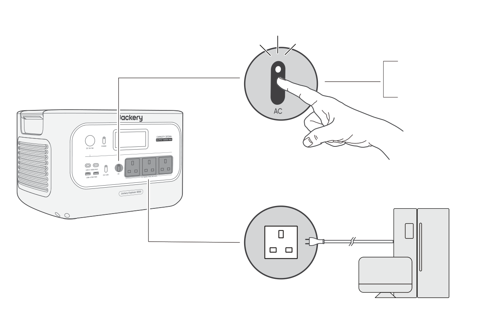
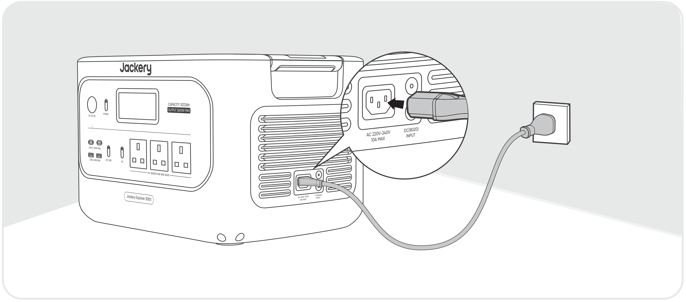
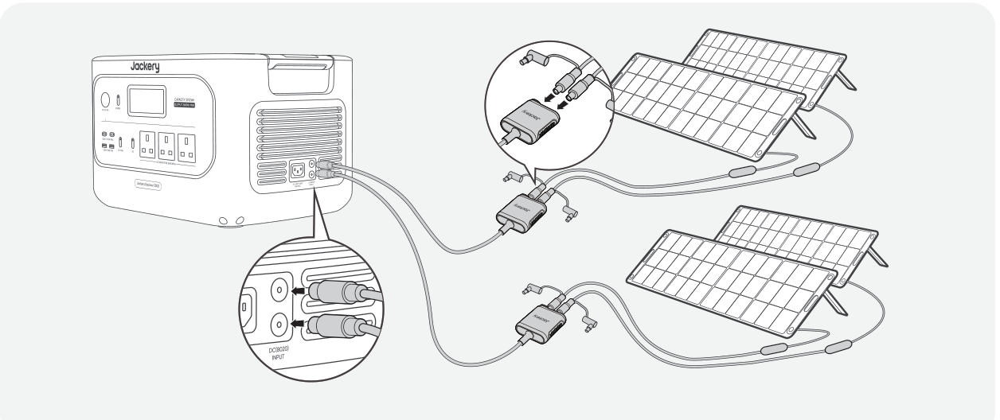
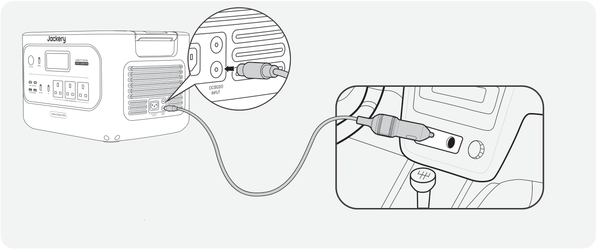

<strong>IMPORTANTE</strong>

Parabéns pelo seu novo Jackery Explorer 3000. Leia este manual atentamente antes de usar o produto, especialmente as precauções relevantes, para garantir o uso adequado.

Mantenha este manual em um local acessível para consulta frequente.

Em conformidade com leis e regulamentos, o direito de interpretação final deste documento e de todos os documentos relacionados a este produto pertence à Empresa. Embora tenham sido envidados todos os esforços para garantir a precisão deste manual, a Jackery não assume nenhuma responsabilidade por quaisquer erros que possam ocorrer.

Observe que não serão enviadas novas notificações em caso de atualização, revisão ou encerramento. Para obter a versão mais recente dos manuais do produto, visite support.jackery.com.

* As imagens são apenas para referência. Consulte o produto real.

# INFORMAÇÕES IMPORTANTES DE SEGURANÇA

<table class="manual-callout-table manual-callout-table"><tbody><tr><td class="manual-callout-label">AVISO</td><td class="manual-callout-body">
<strong>INSTRUÇÕES RELATIVAS AO RISCO DE INCÊNDIO, CHOQUE ELÉTRICO OU LESÕES PESSOAIS</strong>
</td></tr></tbody></table>

Sempre siga estas precauções básicas ao usar este produto.

<ul><li>
Leia todas as instruções antes de usar o produto.
</li><li>
Não permita que crianças brinquem com o produto. É necessária supervisão rigorosa quando o produto for usado perto de crianças.
</li><li>
O uso de acessórios não recomendados ou não comercializados por fabricantes profissionais pode causar risco de choque elétrico.
</li><li>
Quando o produto não estiver em uso, desconecte o plugue de energia da tomada do produto.
</li><li>
Não desmonte o produto, pois isso pode resultar em riscos imprevisíveis, como incêndio, explosão ou choque elétrico.
</li><li>
Não utilize o produto com cabos, plugues ou cabos de saída danificados, pois isso pode causar choque elétrico.
</li><li>
Para garantir a circulação adequada de ar, mantenha as aberturas de ventilação do produto desobstruídas. A área onde o produto é utilizado deve ter fluxo de ar adequado, em um ambiente fresco e seco, para evitar o superaquecimento. - O carregamento em espaços úmidos ou com pouca ventilação pode causar riscos à segurança. - A água pode causar curtos-circuitos ou danos ao carregador, gerando riscos à segurança.
</li><li>
Não exponha o produto ao fogo, altas temperaturas, luz solar direta ou ambientes de calor intenso, como dentro de um veículo estacionado. Tal exposição pode resultar em incêndio ou explosão.
</li></ul>

# INSTRUÇÕES DE MANUTENÇÃO DO USUÁRIO

Durante o ciclo de vida de produtos de armazenamento de energia, é esperado certo grau de degradação da capacidade e da energia. À medida que o número de ciclos de carga e descarga aumenta e o tempo de armazenamento se prolonga, essa degradação se intensifica gradualmente, o que é um fenômeno normal consistente com o envelhecimento natural das células da bateria.

# SIGNIFICADO DOS SÍMBOLOS

<figure aria-label="SIGNIFICADO DOS SÍMBOLOS" class="hb-symbol-signal-composition" data-component-id="HB-TABLE-SYMBOL-SIGNAL"><table class="hb-symbol-signal-table"><colgroup><col class="hb-symbol-signal-col-label"/><col class="hb-symbol-signal-col-meaning"/></colgroup><thead><tr><th class="hb-symbol-signal-label-heading" scope="col">Símbolo</th><th class="hb-symbol-signal-meaning-heading" scope="col">Significado</th></tr></thead><tbody><tr><td class="hb-symbol-signal-label-cell">⚠AVISO</td><td class="hb-symbol-signal-meaning-cell">Práticas perigosas que podem resultar em lesões graves, morte e/ou danos materiais.</td></tr><tr><td class="hb-symbol-signal-label-cell">⚠CUIDADO</td><td class="hb-symbol-signal-meaning-cell">Práticas perigosas que podem resultar em lesões pessoais e/ou danos materiais.</td></tr><tr><td class="hb-symbol-signal-label-cell">⚠NOTA</td><td class="hb-symbol-signal-meaning-cell">Práticas perigosas que podem resultar em danos ao equipamento, perda de dados, deterioração do desempenho ou resultados imprevistos.</td></tr><tr><td class="hb-symbol-signal-label-cell">⚠DICA</td><td class="hb-symbol-signal-meaning-cell">Complementa informações importantes ou dicas de operação no texto.</td></tr></tbody></table></figure>

<figure aria-label="SIGNIFICADO DOS SÍMBOLOS" class="hb-symbol-pair-composition" data-component-id="HB-TABLE-SYMBOL-ICON">

<table class="hb-symbol-panel-table"><colgroup><col class="hb-symbol-col-icon"/><col class="hb-symbol-col-meaning"/></colgroup><thead><tr><th class="hb-symbol-icon-heading" scope="col">Símbolo</th><th class="hb-symbol-meaning-heading" scope="col">Significado</th></tr></thead><tbody><tr><td class="hb-symbol-icon"></td><td class="hb-symbol-meaning">Símbolos de Advertência e Cuidado. Deve ser lido para alertar sobre potenciais perigos ou riscos.</td></tr><tr><td class="hb-symbol-icon"></td><td class="hb-symbol-meaning">Leia o manual do usuário antes de operar.</td></tr><tr><td class="hb-symbol-icon"></td><td class="hb-symbol-meaning">Não desmonte o produto.</td></tr><tr><td class="hb-symbol-icon"></td><td class="hb-symbol-meaning">Mantenha o produto longe de fogo.</td></tr><tr><td class="hb-symbol-icon"></td><td class="hb-symbol-meaning">Mantenha fora do alcance de crianças.</td></tr><tr><td class="hb-symbol-icon"></td><td class="hb-symbol-meaning">Este símbolo indica que há uma bateria de íons de lítio (Li-ion) dentro do produto e que ela deve ser descartada ou reciclada corretamente.</td></tr></tbody></table>

<table class="hb-symbol-panel-table"><colgroup><col class="hb-symbol-col-icon"/><col class="hb-symbol-col-meaning"/></colgroup><thead><tr><th class="hb-symbol-icon-heading" scope="col">Símbolo</th><th class="hb-symbol-meaning-heading" scope="col">Significado</th></tr></thead><tbody><tr><td class="hb-symbol-icon"></td><td class="hb-symbol-meaning">As baterias e os acumuladores não devem ser descartados junto com o lixo doméstico. Como consumidor, você é legalmente obrigado a descartar todas as baterias e acumuladores em pontos de coleta designados, independentemente de conterem substâncias perigosas. Devolva as baterias e acumuladores usados a um ponto de coleta local, centro de reciclagem ou ao revendedor onde foram comprados. O descarte adequado garante a reciclagem ambientalmente responsável e previne possíveis danos à saúde humana e ao meio ambiente.</td></tr><tr><td class="hb-symbol-icon"></td><td class="hb-symbol-meaning">Este símbolo indica que o produto não deve ser descartado como lixo doméstico e deve ser encaminhado a um ponto de coleta designado para reciclagem. O descarte e a reciclagem adequados podem ajudar a proteger o meio ambiente. Para obter mais informações sobre o descarte e a reciclagem deste produto, entre em contato com a autoridade local, o serviço de coleta ou o revendedor.</td></tr></tbody></table>

</figure>

# CONTEÚDO DA EMBALAGEM

<figure aria-label="CONTEÚDO DA EMBALAGEM" class="hb-inbox-composition" data-card-count="3" data-component-id="HB-SPECIAL-INBOX" data-inbox-variant="three-card-responsive"><ol class="hb-inbox-grid"><li class="hb-inbox-card" data-item-number="1">

Jackery Explorer 3000

</li><li class="hb-inbox-card" data-item-number="2">

Cabo de carregamento CA

</li><li class="hb-inbox-card" data-item-number="3">

Manual do usuário

</li></ol>

DICA

O cabo de carregamento veicular não está incluído, mas está disponível para compra separadamente em nosso site. Para assistência, entre em contato com o Suporte ao Cliente da Jackery.

</figure>

# VISÃO GERAL DO PRODUTO

## VISTA FRONTAL

<figure class="hb-reference-figure" data-component-id="HB-SPECIAL-REFERENCE-FIGURE" data-reference-id="overview_front_view" data-source-fragment-sha256="bd09440b78b7ab743538fbc194527124a58273e651caf3a6efc9f5a66e7f7518">

VISTA FRONTAL Tela LCD Botão POWER Porta CC 12 V 12 V⎓10 A máx. Saída USB-C 100 W máx. 100 W máx., 5 V⎓3 A, 9 V⎓3 A, 12 V ⎓3 A, 15 V⎓3 A, 20 V⎓5 A USB-A 18 W SAÍDA MÁX 18 W máx., 5-6 V⎓3 A, 6-9 V⎓2 A, 9-12 V⎓1,5 A Saída CA 230 V~ 50Hz, 15,6 A, 3600 W Nominal Botão de energia CC/USB Botão Power CA

</figure>

## VISTA LATERAL DIREITA

<figure class="hb-reference-figure" data-component-id="HB-SPECIAL-REFERENCE-FIGURE" data-reference-id="overview_right_view" data-source-fragment-sha256="04ad6cd120ccbcbbe054a497532657166d50a458a6b4b8efd321e91b9a70e7c9">

VISTA LATERAL DIREITA Entrada CC (2 portas DC8020) PV: 16-60 V⎓12 A máx., podendo ser duplicado para 24 A máx. / 1000 W máx.; Veicular: 12-16 V⎓8 A máx., duplicável Entrada CA 220 V-240 V~50 Hz, 10 A máx. para 8 A máx.

</figure>

# DISPLAY LCD

<figure class="hb-reference-figure" data-component-id="HB-SPECIAL-REFERENCE-FIGURE" data-reference-id="lcd-map" data-source-fragment-sha256="bbaa1be4e3820e16eb4a845ffcf982220bf4cf19df21f03f74473d8b56820afc">

</figure>

<figure aria-label="DISPLAY LCD" class="hb-lcd-table-composition" data-component-id="HB-TABLE-LCD-ICON" tabindex="0"><table class="hb-lcd-icon-table"><colgroup><col class="hb-lcd-col-number"/><col class="hb-lcd-col-icon"/><col class="hb-lcd-col-name"/><col class="hb-lcd-col-description"/></colgroup><tbody><tr><td class="hb-lcd-number">
1
</td><td class="hb-lcd-icon"></td><td class="hb-lcd-name">
Wi-Fi
</td><td class="hb-lcd-description">
<strong>Ligado:</strong> Wi-Fi conectado. <strong>Pisca:</strong> Pronto para conectar ao Wi-Fi. <strong>Desligado:</strong> Wi-Fi desconectado.
</td></tr><tr><td class="hb-lcd-number">
2
</td><td class="hb-lcd-icon"></td><td class="hb-lcd-name">
Bluetooth
</td><td class="hb-lcd-description">
<strong>Ligado:</strong> Bluetooth conectado. <strong>Pisca:</strong> Pronto para conectar ao Bluetooth. <strong>Desligado:</strong> Bluetooth desconectado.
</td></tr><tr><td class="hb-lcd-number">
3
</td><td class="hb-lcd-icon"></td><td class="hb-lcd-name">
Modo de carregamento silencioso
</td><td class="hb-lcd-description">
<strong>Ligado:</strong> • O ruído durante o carregamento em CA é significativamente reduzido, enquanto a potência de carregamento é menor e a velocidade de carregamento diminui. <strong>Desligado:</strong> Modo de carregamento silencioso desativado. Ative/desative este recurso no aplicativo da Jackery. A configuração é mantida quando o dispositivo é desligado.
</td></tr><tr><td class="hb-lcd-number">
4
</td><td class="hb-lcd-icon"></td><td class="hb-lcd-name">
Modo de economia de bateria
</td><td class="hb-lcd-description">
<strong>Ligado:</strong> Limita a capacidade máxima utilizável da bateria para prolongar sua vida útil. <strong>Desligado:</strong> Modo de economia de bateria desativado. Ative/desative este recurso no aplicativo da Jackery. A configuração é mantida quando o dispositivo é desligado. Nota: Quando esse recurso está ativado, o produto ocasionalmente realiza um ciclo completo de carga e descarga para calibrar o SOC.
</td></tr><tr><td class="hb-lcd-number">
5
</td><td class="hb-lcd-icon"></td><td class="hb-lcd-name">
Plano de carregamento
</td><td class="hb-lcd-description">
Personaliza o tempo de carregamento do Jackery Explorer 3000. Adequado para situações com tarifas de energia elétrica variáveis, permite programar o carregamento de acordo com os horários de pico e fora de pico, reduzindo os custos com energia elétrica. Ative/desative este recurso no aplicativo da Jackery. A configuração é mantida quando o dispositivo é desligado.
</td></tr><tr><td class="hb-lcd-number">
6
</td><td class="hb-lcd-icon"></td><td class="hb-lcd-name">
Limite de potência de carregamento
</td><td class="hb-lcd-description">
<strong>Ligado:</strong> O limite de potência de carregamento está ativado no aplicativo Jackery. <strong>Desligado:</strong> O limite de potência de carregamento está desativado no aplicativo Jackery. A configuração é mantida quando o dispositivo é desligado.
</td></tr><tr><td class="hb-lcd-number">
7
</td><td class="hb-lcd-icon"></td><td class="hb-lcd-name">
Modo de autoalimentação
</td><td class="hb-lcd-description">
Maximiza o uso da energia solar e reduz a dependência da rede elétrica ao priorizar a energia solar armazenada, reduzindo os custos de energia. A estação de energia deve estar conectada simultaneamente aos painéis solares e à rede; a potência da carga é limitada pela potência de bypass. Ative/desative este recurso no aplicativo da Jackery. A configuração é mantida quando o dispositivo é desligado.
</td></tr><tr><td class="hb-lcd-number">
8
</td><td class="hb-lcd-icon"></td><td class="hb-lcd-name">
Modo TOU
</td><td class="hb-lcd-description">
<strong>Ligado:</strong> • O modo TOU (tarifa por tempo de uso) está ativado (SOC de reserva padrão: 60%). Durante os horários de pico, quando a energia armazenada ultrapassa o SOC de reserva, o produto prioriza a descarga da bateria para reduzir os custos de energia. Durante os horários fora de pico, o sistema carrega a bateria pela rede elétrica para reduzir a demanda no horários de pico e aproveitá-la nos horários de menor demanda. <strong>Desligado:</strong> O modo TOU está desabilitado. O dispositivo não segue a estratégia de TOU e opera de acordo com a lógica padrão de fornecimento de energia e carregamento. Ative/desative este modo no aplicativo da Jackery. A configuração é mantida quando o dispositivo é desligado.
</td></tr><tr><td class="hb-lcd-number">
9
</td><td class="hb-lcd-icon"></td><td class="hb-lcd-name">
UPS
</td><td class="hb-lcd-description">
<strong>Ligado:</strong> O produto está no modo de bypass, e o tempo de comutação da rede elétrica para a bateria interna é de 10 ms. <strong>Desligado:</strong> O produto não está no Modo de bypass.
</td></tr><tr><td class="hb-lcd-number">
10
</td><td class="hb-lcd-icon"></td><td class="hb-lcd-name">
Indicador de energia AC
</td><td class="hb-lcd-description">
A saída CA (onda senoidal pura) está ligada.
</td></tr><tr><td class="hb-lcd-number">
11
</td><td class="hb-lcd-icon"></td><td class="hb-lcd-name">
Potência de entrada
</td><td class="hb-lcd-description">
Exibe a potência de entrada em watts.
</td></tr><tr><td class="hb-lcd-number">
12
</td><td class="hb-lcd-icon"></td><td class="hb-lcd-name">
Tempo de carregamento restante
</td><td class="hb-lcd-description">
Exibe o tempo de carregamento restante.
</td></tr><tr><td class="hb-lcd-number">
13
</td><td class="hb-lcd-icon"></td><td class="hb-lcd-name">
Indicador de carregamento via tomada CA
</td><td class="hb-lcd-description">
O produto é carregado pela Entrada CA usando energia da rede.
</td></tr><tr><td class="hb-lcd-number">
14
</td><td class="hb-lcd-icon"></td><td class="hb-lcd-name">
Indicador de carregamento veicular
</td><td class="hb-lcd-description">
O produto é carregado pela Entrada CC (DC8020) usando CC 12 V (carregamento veicular).
</td></tr><tr><td class="hb-lcd-number">
15
</td><td class="hb-lcd-icon"></td><td class="hb-lcd-name">
Indicador de carregamento solar
</td><td class="hb-lcd-description">
O produto é carregado pela Entrada CC (DC8020) usando painel(is) solar(es).
</td></tr><tr><td class="hb-lcd-number">
16
</td><td class="hb-lcd-icon"></td><td class="hb-lcd-name">
Indicador de energia da bateria
</td><td class="hb-lcd-description">
Quando o produto estiver sendo carregado, o círculo laranja ao redor da porcentagem da bateria acenderá em sequência. Ao carregar outros dispositivos, o círculo laranja permanece aceso.
</td></tr><tr><td class="hb-lcd-number">
17
</td><td class="hb-lcd-icon"></td><td class="hb-lcd-name">
Indicador de bateria fraca
</td><td class="hb-lcd-description">
<strong>Ligado:</strong> O nível da bateria está abaixo de 20%. <strong>Pisca:</strong> O nível da bateria está abaixo de 5%. <strong>Desligado:</strong> O nível da bateria não está abaixo de 20% ou o produto está carregando.
</td></tr><tr><td class="hb-lcd-number">
18
</td><td class="hb-lcd-icon"></td><td class="hb-lcd-name">
Porcentagem de bateria restante
</td><td class="hb-lcd-description">
Exibe a porcentagem de bateria restante.
</td></tr><tr><td class="hb-lcd-number">
19
</td><td class="hb-lcd-icon"></td><td class="hb-lcd-name">
Temporizador de descarga
</td><td class="hb-lcd-description">
<strong>Ligado:</strong> Um temporizador de descarga está definido. <strong>Desligado:</strong> Nenhum temporizador de descarga está definido. Ative/desative este recurso no aplicativo da Jackery. A configuração não é mantida quando o dispositivo é desligado.
</td></tr><tr><td class="hb-lcd-number">
20
</td><td class="hb-lcd-icon"></td><td class="hb-lcd-name">
Modo de economia de energia
</td><td class="hb-lcd-description">
Quando a saída CA ou CC for ativada pressionando o botão POWER CA ou o botão POWER CC/USB: <strong>Ligado:</strong> O Modo de economia de energia está ativado. <strong>Desligado:</strong> O Modo de economia de energia está desativado.
</td></tr><tr><td class="hb-lcd-number" rowspan="2">
21
</td><td class="hb-lcd-icon"></td><td class="hb-lcd-name">
Indicador de alta temperatura
</td><td class="hb-lcd-description">
A proteção contra alta temperatura foi ativada. O produto pode parar de funcionar até que sua temperatura retorne à faixa normal de operação.
</td></tr><tr><td class="hb-lcd-icon"></td><td class="hb-lcd-name">
Indicador de temperatura baixa
</td><td class="hb-lcd-description">
A proteção contra baixa temperatura foi ativada. O produto pode parar de funcionar até que sua temperatura retorne à faixa normal de operação.
</td></tr><tr><td class="hb-lcd-number">
22
</td><td class="hb-lcd-icon"></td><td class="hb-lcd-name">
Código de falha
</td><td class="hb-lcd-description">
Ocorreu um erro no produto. Consulte a seção de Solução de problemas para obter detalhes.
</td></tr><tr><td class="hb-lcd-number">
23
</td><td class="hb-lcd-icon"></td><td class="hb-lcd-name">
Tensão e Frequência de Saída
</td><td class="hb-lcd-description">
Exibe a tensão e a frequência de saída quando a saída CA está ligada.
</td></tr><tr><td class="hb-lcd-number">
24
</td><td class="hb-lcd-icon"></td><td class="hb-lcd-name">
Potência de saída
</td><td class="hb-lcd-description">
Exibe a potência de saída em watts.
</td></tr><tr><td class="hb-lcd-number">
25
</td><td class="hb-lcd-icon"></td><td class="hb-lcd-name">
Tempo de descarga restante
</td><td class="hb-lcd-description">
Exibe o tempo de descarga restante.
</td></tr></tbody></table></figure>

# OPERAÇÕES

## LIGAR/DESLIGAR

<figure class="hb-operation-figure hb-operation-layout-status-right hb-base-art-live-copy" data-component-id="HB-SPECIAL-OPERATION" data-operation-id="main-power" data-source-fragment-sha256="9c28bd4f10fb181f8e5cf5d095fa578ef495b387505dac5ee19639beb2681245" data-web-base-art-ref="operation/main_power" data-web-presentation-mode="base-art-live-copy" data-web-replace-key="operation.main-power">

3s

<strong>ON</strong>

Pressione uma vez

<strong>Apagado</strong>

Pressione e segure por 3 s

Tempo de espera padrão: 2 horas

O produto será desligado automaticamente após 2 horas de inatividade, sem estar carregando nem descarregando. O tempo de espera pode ser definido no aplicativo da Jackery.

Quando o Modo de Economia de Energia estiver ativado, o produto será desligado automaticamente após 12 horas se o botão POWER CA ou o botão POWER CC/USB estiver ligado, mas o produto não estiver carregando nem descarregando.

</figure>

## SAÍDA CA LIGAR/DESLIGAR

<figure class="hb-operation-figure hb-operation-layout-status-right hb-base-art-live-copy" data-component-id="HB-SPECIAL-OPERATION" data-operation-id="ac-output" data-source-fragment-sha256="957f854885acac7949479f20c21426d0d0edf5cb51c60b0a56869fcfa843e1a8" data-web-base-art-ref="operation/ac_output" data-web-presentation-mode="base-art-live-copy" data-web-replace-key="operation.ac-output">

Pré-requisito: O produto está ligado.

<strong>ON</strong>

Pressione uma vez

<strong>Apagado</strong>

Pressione uma vez

</figure>

## SAÍDA CC/USB LIGAR/DESLIGAR

<figure class="hb-operation-figure hb-operation-layout-status-right hb-base-art-live-copy" data-component-id="HB-SPECIAL-OPERATION" data-operation-id="dc-usb-output" data-source-fragment-sha256="ef0bafe69ca780c6d187fbbace5dc2f9703bc18b9368f1e19576f42f65b60471" data-web-base-art-ref="operation/dc_usb_output" data-web-presentation-mode="base-art-live-copy" data-web-replace-key="operation.dc-usb-output">

Pré-requisito: O produto está ligado.

<strong>ON</strong>

Pressione uma vez

<strong>Apagado</strong>

Pressione uma vez

</figure>

<table class="manual-callout-table manual-callout-table"><tbody><tr><td class="manual-callout-label">CUIDADO</td><td class="manual-callout-body"><ul><li>A porta USB-C de 100 W é uma porta de saída de alta potência USB-PD Power Source 3 (PS3). Se o dispositivo do usuário ou acessório conectado não atender aos requisitos de segurança, pode haver risco de incêndio. Antes de usar essas portas, certifique-se de que o dispositivo ou acessório conectado possua proteção contra incêndio.</li><li>Conecte o Jackery Explorer 3000 somente a dispositivos ou acessórios que estejam em conformidade com as cláusulas 6.3, 6.4 e 6.5 da IEC/EN/UL 62368-1 (ou outras normas equivalentes).</li><li>Para obter a potência máxima de saída, use o cabo USB-C para USB-C de 5 A (20 V CC/5 A, 100 W).</li></ul></td></tr></tbody></table>

O produto pode carregar a bateria do seu carro usando o cabo de carregamento de bateria automotiva de 12 V da Jackery, vendido separadamente e disponível em nosso site.

<table class="manual-callout-table manual-callout-table"><tbody><tr><td class="manual-callout-label">CUIDADO</td><td class="manual-callout-body"><ul><li>A porta CC 12 V é compatível apenas com baterias automotivas de 12 V e não é adequada para sistemas de 24 V.</li><li>Não dê partida no veículo enquanto o produto estiver carregando a bateria através da saída CC 12 V, pois isso pode danificar o produto.</li><li>Este recurso destina-se apenas a uso emergencial e não pode carregar uma bateria de carro descarregada ou danificada.</li></ul></td></tr></tbody></table>

## MODO DE ECONOMIA DE ENERGIA

Para evitar consumo desnecessário da bateria caso o usuário se esqueça de desligar a saída, o produto ativa o Modo de Economia de Energia por padrão. Quando a saída CA ou CC/USB estiver ligada, o ícone do Modo de Economia de Energia será exibido na tela LCD. Se nenhum dispositivo estiver conectado ou se o consumo de energia do dispositivo conectado estiver abaixo de um determinado limite (saída CA de 25 W ou saída CC/USB de 2 W) por 12 horas, o produto desliga automaticamente as saídas. Defina a duração do Modo de economia de energia no aplicativo Jackery. Para desativar o modo de economia de energia, pressione e segure simultaneamente o botão de energia CA e o botão POWER por mais de 3 segundos. O produto não desligará automaticamente a saída CA ou CC/USB.

<figure class="hb-operation-figure hb-operation-layout-footer-overlay hb-base-art-live-copy" data-component-id="HB-SPECIAL-OPERATION" data-operation-id="energy-saving" data-source-fragment-sha256="16a769152e4a27da7ddc75e1b3100682707fb2b2c64d3e5a9b37523c99a66a24" data-web-base-art-ref="reference-energy_saving" data-web-presentation-mode="base-art-live-copy" data-web-replace-key="operation.energy-saving">

Botão Power Principal

Botão Power CA

3s

Ligar/Desligar

Pressione e segure por 3 s

</figure>

<table class="manual-callout-table manual-callout-table"><tbody><tr><td class="manual-callout-label">NOTA</td><td class="manual-callout-body">
O Modo de Economia de Energia retoma o estado anterior após ligar o produto. É necessário alternar manualmente para mudar o modo.
</td></tr></tbody></table>

## TELA LCD

<figure aria-label="DISPLAY LCD" class="hb-lcd-mode-composition" data-component-id="HB-TABLE-LCD-MODE">

<table class="hb-lcd-mode-table"><colgroup><col class="hb-lcd-mode-col-state"/><col class="hb-lcd-mode-col-action"/><col class="hb-lcd-mode-col-copy"/></colgroup><tbody><tr><td class="hb-lcd-mode-state" rowspan="3">Aceso Brevemente</td><td class="hb-lcd-mode-action">Ligar</td><td class="hb-lcd-mode-copy">Pressione o botão Power ou quando o produto estiver carregando.</td></tr><tr><td class="hb-lcd-mode-action">Desligar</td><td class="hb-lcd-mode-copy">Pressione o botão POWER.</td></tr><tr><td class="hb-lcd-mode-action">Desligamento automático</td><td class="hb-lcd-mode-copy">O LCD desliga automaticamente e entra no modo de suspensão após 2 minutos de inatividade.</td></tr><tr><td class="hb-lcd-mode-state" rowspan="3">Aceso continuamente (em estado de carga ou descarga)</td><td class="hb-lcd-mode-action">Ligar</td><td class="hb-lcd-mode-copy">Pressione o botão Power duas vezes quando o produto estiver ligado.</td></tr><tr><td class="hb-lcd-mode-action">Desligar</td><td class="hb-lcd-mode-copy">Pressione o botão POWER.</td></tr><tr><td class="hb-lcd-mode-action">Desligamento automático</td><td class="hb-lcd-mode-copy">O LCD desliga automaticamente após 2 horas de inatividade.</td></tr></tbody></table>
</figure>

Você também pode definir o modo de exibição da tela no aplicativo da Jackery.

## FUNÇÃO DE RETOMADA DAS SAÍDAS CA E CC

Esta função memoriza o estado das saídas e retoma automaticamente as saídas CA e CC sob condições definidas.

<figure aria-label="Condições de retomada automática / Condições de não retomada automática" class="hb-auto-resume-composition" data-component-id="HB-TABLE-AUTO-RESUME" tabindex="0"><table class="hb-auto-resume-table"><colgroup><col class="hb-auto-resume-col"/><col class="hb-auto-resume-col"/></colgroup><thead><tr><th class="hb-auto-resume-left" scope="col">Condições de retomada automática</th><th class="hb-auto-resume-right" scope="col">Condições de não retomada automática</th></tr></thead><tbody><tr><td class="hb-auto-resume-left">Ligar/reiniciar após desligamento ou reinício</td><td class="hb-auto-resume-right">Desligamento manual da saída (botão/App)</td></tr><tr><td class="hb-auto-resume-left" rowspan="2">SOC da bateria ≥ limite de descarga + 10% após atingir o limite</td><td class="hb-auto-resume-right">Desligamento da saída no modo de economia de energia</td></tr><tr><td class="hb-auto-resume-right">Desligamento da saída acionado pela proteção</td></tr><tr><td class="hb-auto-resume-left">Atualização OTA concluída</td><td class="hb-auto-resume-right">Desligamento da saída acionado pelo temporizador de descarga</td></tr></tbody></table></figure>

## COMBINAÇÃO DE TECLAS

<figure aria-label="Botões / Operação / Função" class="hb-key-combination-composition" data-component-id="HB-TABLE-KEY-COMBINATIONS" tabindex="0"><table class="hb-key-combination-table"><colgroup><col class="hb-key-col-buttons"/><col class="hb-key-col-operation"/><col class="hb-key-col-function"/></colgroup><thead><tr><th class="hb-key-buttons" scope="col">Botões</th><th class="hb-key-operation" scope="col">Operação</th><th class="hb-key-function" scope="col">Função</th></tr></thead><tbody><tr><td class="hb-key-buttons">Botão POWER + Botão Power CA</td><td class="hb-key-operation">Pressione e segure ambos por 3 s</td><td class="hb-key-function">Ligar/Desligar o Modo de Economia de Energia</td></tr><tr><td class="hb-key-buttons">Botão POWER + Botão de energia CC/USB</td><td class="hb-key-operation">Pressione e segure ambos por 3 s</td><td class="hb-key-function">Redefinir o Wi-Fi e o Bluetooth</td></tr><tr><td class="hb-key-buttons">Botão de energia CC/USB + Botão Power CA</td><td class="hb-key-operation">Pressione e segure ambos por 1 s</td><td class="hb-key-function">Ativar/desativar Wi-Fi e Bluetooth</td></tr></tbody></table></figure>

# FONTE DE ALIMENTAÇÃO ININTERRUPTA (UPS)

Conecte o produto a uma tomada da rede elétrica com o cabo de carregamento CA, depois pressione o botão de saída CA e alimente seus aparelhos ao mesmo tempo. Uma fonte de alimentação ininterrupta (UPS) é um tipo de sistema de alimentação contínua que fornece energia elétrica de reserva automaticamente a uma carga quando a energia da rede falha. No caso de uma perda repentina de energia da rede, o Jackery Explorer 3000 comutará automaticamente para a energia armazenada em 10 ms para manter seus aparelhos funcionando. No modo UPS, a potência de pico da unidade atinge 12 A antes de quedas de energia. Como o carregamento/descarga simultâneos estão habilitados no Modo de bypass, a potência de saída real é menor que a potência de saída nominal neste modo, mas retorna à potência de saída nominal durante quedas de energia.

<figure class="hb-reference-figure" data-component-id="HB-SPECIAL-REFERENCE-FIGURE" data-reference-id="ups_connection" data-source-fragment-sha256="317117bc28293f776ecc9858e450efeadf1268b6b028c42fc29e9cc0b47576e2">

</figure>

<table class="manual-callout-table manual-callout-table"><tbody><tr><td class="manual-callout-label">CUIDADO</td><td class="manual-callout-body"><ul><li>Este produto não suporta comutação de 0 ms. Não conecte este produto a equipamentos que exijam fonte de alimentação com comutação de 0 ms, como servidores de dados ou estações de trabalho.</li><li>Antes do uso, teste a compatibilidade com seu dispositivo várias vezes.</li><li>Não conecte cargas que excedam a potência máxima de saída do produto. Caso contrário, a proteção contra sobrecarga será acionada.</li></ul></td></tr></tbody></table>

# CARREGANDO

Energia verde primeiro: Recomendamos priorizar o uso de energia verde. Este produto suporta dois modos de carregamento ao mesmo tempo: carregamento solar e carregamento por tomada da rede elétrica CA. Quando o carregamento na tomada CA e o carregamento solar estão ativados simultaneamente, o produto dará prioridade ao carregamento solar, e ambos os métodos serão utilizados para carregar a bateria na potência máxima permitida.

Carregue totalmente o produto antes do primeiro uso.

<table class="manual-callout-table manual-callout-table"><tbody><tr><td class="manual-callout-label">NOTA</td><td class="manual-callout-body"><ul><li>A temperatura de carregamento recomendada para o produto varia de 0 °C a 45 °C, e a temperatura de descarga varia de -10 °C a 45 °C. Operar o produto fora dessa faixa de temperatura pode limitar sua capacidade de carregamento e descarga ou até mesmo impedir que ele seja carregado ou descarregado.</li><li>A potência de carregamento e a capacidade da bateria do produto podem variar devido a flutuações de temperatura.</li></ul></td></tr></tbody></table>

## CARREGAMENTO POR MEIO DE TOMADA CA

Conecte o cabo de carregamento CA à porta de entrada CA do produto e a uma tomada da rede elétrica.

<figure class="hb-reference-figure" data-component-id="HB-SPECIAL-REFERENCE-FIGURE" data-reference-id="ac_wall_charging" data-source-fragment-sha256="3caa75267caa4363fdb363b52db4220fdab64ca6652cfe046ff553cadc1caf58">

</figure>

<table class="manual-callout-table manual-callout-table"><tbody><tr><td class="manual-callout-label">CUIDADO</td><td class="manual-callout-body">
Certifique-se de que o cabo de carregamento CA esteja totalmente e firmemente conectado à porta de entrada CA. Uma conexão incompleta pode causar instabilidade na corrente elétrica, superaquecimento, mau contato ou mau funcionamento do dispositivo.
</td></tr></tbody></table>

## CARREGAMENTO VIA PAINÉIS SOLARES (VENDIDOS SEPARADAMENTE)

O Jackery Explorer 3000 possui duas portas de entrada DC8020 e é compatível com os painéis solares da Jackery. Se for necessário conectar dois painéis solares a uma única porta de entrada DC8020, consulte a figura abaixo para carregar por meio do conector para painel solar (vendido separadamente, não incluso no pacote padrão).

<figure class="hb-reference-figure hb-base-art-live-copy" data-component-id="HB-SPECIAL-REFERENCE-FIGURE" data-reference-id="solar_four" data-source-fragment-sha256="37f3f51745860140c2cd6b62a457a45fd07a2906fac35eb835a5bf62365a6337" data-web-base-art-ref="solar_four" data-web-presentation-mode="base-art-live-copy">

SolarSaga 200 ×4

</figure>

<table class="manual-callout-table manual-callout-table"><tbody><tr><td class="manual-callout-label">CUIDADO</td><td class="manual-callout-body">
Uma porta de entrada DC8020 pode ser conectada a no máximo dois painéis solares.
</td></tr></tbody></table>

<table class="manual-callout-table manual-callout-table"><tbody><tr><td class="manual-callout-label">CUIDADO</td><td class="manual-callout-body">
Certifique-se de que a tensão de entrada para ambas as portas de entrada CC seja a mesma. Caso contrário, o produto pode ser danificado. Por exemplo:
<ul><li>Use o mesmo modelo e a mesma quantidade de painéis solares da Jackery ao conectá-los às duas portas de entrada DC8020.</li><li>Não carregue o produto usando simultaneamente um carregador veicular e um painel solar. Isso pode queimar o fusível do carro ou resultar em falha no carregamento.</li></ul></td></tr></tbody></table>

Recomenda-se usar o painel solar Jackery para carregar o produto. Certifique-se de que a tensão de circuito aberto (Voc) do painel solar esteja dentro da faixa de entrada CC (16 V-60 V) do Jackery Explorer 3000. A Jackery não se responsabiliza por quaisquer danos ou perdas resultantes do uso de painéis solares de terceiros.

## CARREGAMENTO COM CARREGADOR VEICULAR (VENDIDO SEPARADAMENTE)

Este produto pode ser carregado usando um carregador veicular de 12 V. Certifique-se de que o carregador veicular e a tomada de alimentação de 12 V do veículo (acendedor de cigarros) estejam bem conectados.

<figure class="hb-reference-figure hb-base-art-live-copy" data-component-id="HB-SPECIAL-REFERENCE-FIGURE" data-reference-id="car_charging" data-source-fragment-sha256="1a4c427a06bbec1d26286e6ceb693f6186ae6c61f1c1a39f465c65b5e96fdb6e" data-web-base-art-ref="car_charging" data-web-presentation-mode="base-art-live-copy">

Veículo*O cabo de carregamento veicular é vendido separadamente.

</figure>

<table class="manual-callout-table manual-callout-table"><tbody><tr><td class="manual-callout-label">CUIDADO</td><td class="manual-callout-body"><ul><li>Ligue o veículo antes de carregar a estação de energia.</li><li>Se o veículo estiver trafegando por estradas irregulares, é proibido usar o carregador veicular, pois isso pode causar funcionamento inadequado. A Empresa não se responsabiliza por quaisquer perdas causadas por operação fora do padrão.</li><li>O carregamento veicular é aplicável apenas a veículos com 12 V CC, não a 24 V CC. Por favor, não carregue este produto em um veículo de 24 V para evitar ferimentos pessoais e danos materiais.</li></ul></td></tr></tbody></table>

# ARMAZENAMENTO

Armazene o produto em local seco, limpo e com ventilação adequada. Temperatura e umidade de armazenamento:

<ul><li>1 mês: -20°C a 45°C (0-60%UR)</li><li>3 meses: 0°C a 45°C (0-60%UR)</li><li>12 meses: 0°C a 25°C (0-60%UR) Se este produto for armazenado por um longo período (3 meses - 6 meses) com a bateria descarregada, ele pode não voltar a carregar. Para evitar isso e manter a saúde da bateria, recomenda-se verificar e recarregar o produto a cada três meses e realizar um ciclo completo de carga e descarga pelo menos uma vez a cada 6 a 12 meses.</li></ul>

# SOLUÇÃO DE PROBLEMAS

Se qualquer um dos seguintes códigos de falha aparecer, siga as ações corretivas listadas para resolver o problema. Se a falha persistir, entre em contato com o Suporte ao Cliente da Jackery.

<figure aria-label="Código de erro / Medidas corretivas" class="hb-troubleshooting-composition" data-component-id="HB-TABLE-TROUBLESHOOTING" tabindex="0"><table class="hb-troubleshooting-table"><colgroup><col class="hb-troubleshooting-col-code"/><col class="hb-troubleshooting-col-measures"/></colgroup><thead><tr><th class="hb-troubleshooting-code" scope="col">Código de erro</th><th class="hb-troubleshooting-measures" scope="col">Medidas corretivas</th></tr></thead><tbody><tr><td class="hb-troubleshooting-code">F0</td><td class="hb-troubleshooting-measures">Reinicie o produto.</td></tr><tr><td class="hb-troubleshooting-code">F1</td><td class="hb-troubleshooting-measures">Reinicie o produto.</td></tr><tr><td class="hb-troubleshooting-code">F2</td><td class="hb-troubleshooting-measures">Reinicie o produto.</td></tr><tr><td class="hb-troubleshooting-code">F3</td><td class="hb-troubleshooting-measures">Reinicie o produto.</td></tr><tr><td class="hb-troubleshooting-code">F4</td><td class="hb-troubleshooting-measures">Conecte o produto a cargas para descarregar a bateria até que a falha desapareça.</td></tr><tr><td class="hb-troubleshooting-code">F5</td><td class="hb-troubleshooting-measures">Carregue o produto por painéis solares ou tomada de parede CA até que a falha desapareça.</td></tr><tr><td class="hb-troubleshooting-code">F6</td><td class="hb-troubleshooting-measures">1. Aguarde a normalização da rede elétrica antes de carregar o produto por meio de uma tomada CA. 2. Verifique se as entradas e saídas de ar estão obstruídas; mantenha um espaço livre de 20 cm em ambos os lados do produto. 3. Coloque o produto em um local que não esteja exposto à luz solar direta ou a altas temperaturas ambientais. 4. Desconecte todas as cargas do produto. Mantenha o produto ocioso e aguarde até que a falha desapareça. 5. Reinicie o produto.</td></tr><tr><td class="hb-troubleshooting-code">F7</td><td class="hb-troubleshooting-measures">1. Remova todas as entradas CC do produto. 2. Verifique a tensão de circuito aberto (Voc) dos painéis solares conectados. O produto permite uma tensão máxima de entrada CC de 60 V. 3. Reinicie o produto e mantenha-o inativo. Aguarde até que a falha desapareça.</td></tr><tr><td class="hb-troubleshooting-code">F8</td><td class="hb-troubleshooting-measures">Entre em contato com o Suporte ao Cliente da Jackery.</td></tr><tr><td class="hb-troubleshooting-code">F9</td><td class="hb-troubleshooting-measures">Remova a carga conectada às portas USB do produto. Aguarde até que a falha desapareça.</td></tr><tr><td class="hb-troubleshooting-code">FE</td><td class="hb-troubleshooting-measures">Entre em contato com o Suporte ao Cliente da Jackery.</td></tr></tbody></table></figure>

# ESPECIFICAÇÕES

## INFORMAÇÕES GERAIS

<figure aria-label="INFORMAÇÕES GERAIS" class="hb-spec-table-composition"><table class="manual-table manual-spec-table hb-spec-table"><colgroup><col class="hb-spec-col-label"/><col class="hb-spec-col-value"/></colgroup><tbody><tr><th class="manual-spec-label hb-spec-label" scope="row">Nome do produto</th><td class="manual-spec-value hb-spec-value">Jackery Explorer 3000</td></tr><tr><th class="manual-spec-label hb-spec-label" scope="row">Nº do modelo</th><td class="manual-spec-value hb-spec-value">JE-3000C</td></tr><tr><th class="manual-spec-label hb-spec-label" scope="row">Capacidade</th><td class="manual-spec-value hb-spec-value">3072 Wh (60 Ah/51,2 V CC)</td></tr><tr><th class="manual-spec-label hb-spec-label" scope="row">Química da célula</th><td class="manual-spec-value hb-spec-value">LiFePO4</td></tr><tr><th class="manual-spec-label hb-spec-label" scope="row">Peso</th><td class="manual-spec-value hb-spec-value">Aproximadamente 27 kg</td></tr><tr><th class="manual-spec-label hb-spec-label" scope="row">Dimensões</th><td class="manual-spec-value hb-spec-value">43,5 × 32,6 × 28,1 cm</td></tr><tr><th class="manual-spec-label hb-spec-label" scope="row">Vida útil de ciclos</th><td class="manual-spec-value hb-spec-value">4000 ciclos até 70%+ de capacidade</td></tr></tbody></table></figure>

## PORTAS DE ENTRADA

<figure aria-label="PORTAS DE ENTRADA" class="hb-spec-table-composition"><table class="manual-table manual-spec-table hb-spec-table"><colgroup><col class="hb-spec-col-label"/><col class="hb-spec-col-value"/></colgroup><tbody><tr><th class="manual-spec-label hb-spec-label" scope="row">1 × Entrada CA</th><td class="manual-spec-value hb-spec-value">220 V-240 V ~ 50Hz, 10 A máx. Modo de bypass①: 220 V-240 V ~ 50Hz, 10 A máx.</td></tr><tr><th class="manual-spec-label hb-spec-label" scope="row">2 × Portas DC8020</th><td class="manual-spec-value hb-spec-value">Veicular: 12-16 V⎓8 A máx., duplicável para 8 A máx. PV: 16-60 V⎓12 A máx., duplicável para 24 A / 1000 W máx.</td></tr></tbody></table></figure>

## PORTAS DE SAÍDA

<figure aria-label="PORTAS DE SAÍDA" class="hb-spec-table-composition"><table class="manual-table manual-spec-table hb-spec-table"><colgroup><col class="hb-spec-col-label"/><col class="hb-spec-col-value"/></colgroup><tbody><tr><th class="manual-spec-label hb-spec-label" scope="row">3 × CA</th><td class="manual-spec-value hb-spec-value">230 V ~ 50Hz, 15,6 A, 3600 W Nominal</td></tr><tr><th class="manual-spec-label hb-spec-label" scope="row">Saída total em CA②</th><td class="manual-spec-value hb-spec-value">3600 W Nominal, pico de 7200 W</td></tr><tr><th class="manual-spec-label hb-spec-label" scope="row">Saída CA no modo de bypass①</th><td class="manual-spec-value hb-spec-value">220 V-240 V ~ 50Hz, 10 A máx.</td></tr><tr><th class="manual-spec-label hb-spec-label" scope="row">2 × USB-C 100 W máx.</th><td class="manual-spec-value hb-spec-value">100 W máx., 5 V⎓3 A, 9 V⎓3 A, 12 V⎓3 A, 15 V⎓3 A, 20 V⎓5 A</td></tr><tr><th class="manual-spec-label hb-spec-label" scope="row">2 × USB-A 18 W máx.</th><td class="manual-spec-value hb-spec-value">18 W máx., 5-6 V⎓3 A, 6-9 V⎓2 A, 9-12 V⎓1,5 A</td></tr><tr><th class="manual-spec-label hb-spec-label" scope="row">1 × Porta CC 12 V</th><td class="manual-spec-value hb-spec-value">12 V⎓10 A máx.</td></tr></tbody></table></figure>

## TEMPERATURA AMBIENTE DE OPERAÇÃO

<figure aria-label="TEMPERATURA AMBIENTE DE OPERAÇÃO" class="hb-spec-table-composition"><table class="manual-table manual-spec-table hb-spec-table"><colgroup><col class="hb-spec-col-label"/><col class="hb-spec-col-value"/></colgroup><tbody><tr><th class="manual-spec-label hb-spec-label" scope="row">Temperatura de carregamento</th><td class="manual-spec-value hb-spec-value">0°C a 45°C</td></tr><tr><th class="manual-spec-label hb-spec-label" scope="row">Temperatura de descarga</th><td class="manual-spec-value hb-spec-value">-10°C a 45°C</td></tr></tbody></table></figure>

O produto pode carregar a bateria a partir da tomada de parede CA ou do ATS enquanto fornece energia pelas portas de saída CA. ①

Indica que duas ou mais portas de saída CA operam em conjunto. ②

※ USB Type-C® e USB-C® são marcas registradas do USB Implementers Forum.

# GARANTIA

<figure aria-label="GARANTIA" class="hb-warranty-intro-composition" data-component-id="HB-WARRANTY-LEAD">

<strong>A garantia é fornecida apenas a clientes que comprarem no Site oficial da Jackery, em plataformas de terceiros com marca Jackery ou por meio de revendedores locais autorizados.</strong>

*O período e os detalhes da garantia podem variar de acordo com as leis, regulamentações locais e revendedores autorizados.

</figure>

## Garantia Limitada

<figure aria-label="Garantia Limitada" class="hb-warranty-card" data-component-id="HB-WARRANTY-SECTION" data-warranty-card-index="1">
A Jackery garante ao comprador consumidor original que o produto Jackery estará livre de defeitos de fabricação e material sob uso normal do consumidor durante o período de garantia aplicável identificado na seção "Período de Garantia" abaixo, sujeito às exclusões estabelecidas abaixo. Esta declaração de garantia estabelece a obrigação de garantia total e exclusiva da Jackery. Não assumiremos, nem autorizaremos qualquer pessoa a assumir em nosso nome, qualquer outra responsabilidade relacionada à venda de nossos produtos.
</figure>

## Período de Garantia

<figure aria-label="Período de Garantia" class="hb-warranty-period-card" data-component-id="HB-WARRANTY-YEARS">

3
<strong class="hb-warranty-years-unit">ANOS</strong><strong class="hb-warranty-period-label">Garantia Padrão</strong>

O período de garantia padrão para o Jackery Explorer 3000 é de 36 meses. Em todos os casos, o período de garantia é contado a partir da data de compra pelo comprador consumidor original. O comprovante de compra do primeiro comprador consumidor, ou outra prova documental razoável, é necessário para estabelecer a data de início do período de garantia.

2
<strong class="hb-warranty-years-unit">ANOS</strong><strong class="hb-warranty-period-label">Garantia Estendida</strong>

Para ativar a extensão da garantia, registre seu produto online ou entre em contato com nossa equipe de atendimento ao cliente em hello.eu@jackery.com para estender o período de garantia padrão.

</figure>

## Troca

<figure aria-label="Troca" class="hb-warranty-card" data-component-id="HB-WARRANTY-SECTION" data-warranty-card-index="2">
A Jackery substituirá, às suas próprias custas, qualquer produto Jackery que apresente falha de funcionamento durante o período de garantia aplicável devido a defeito de fabricação ou de material. Um produto substituto assume a garantia restante do produto original.
</figure>

## Limitado ao comprador consumidor original

<figure aria-label="Limitado ao comprador consumidor original" class="hb-warranty-card" data-component-id="HB-WARRANTY-SECTION" data-warranty-card-index="3">
A garantia dos produtos Jackery é limitada ao comprador consumidor original e não é transferível a qualquer proprietário subsequente.
</figure>

## Exclusões

<figure aria-label="Exclusões" class="hb-warranty-card" data-component-id="HB-WARRANTY-SECTION" data-warranty-card-index="4">
A garantia da Jackery não se aplica a:
<ul><li>Uso indevido, abuso, modificação, danos causados por acidente ou uso para qualquer finalidade diferente do uso normal do consumidor conforme autorizado na documentação atual do produto da Jackery.</li><li>Tentativa de reparo por qualquer pessoa que não seja uma assistência autorizada.</li><li>Qualquer produto adquirido por meio de leilão online.</li><li>A garantia da Jackery não se aplica à célula da bateria, a menos que ela seja totalmente carregada por você dentro de sete dias após a compra do produto e, posteriormente, pelo menos uma vez a cada 6 meses.</li></ul></figure>

## Direitos de interpretação

<figure aria-label="Direitos de interpretação" class="hb-warranty-card" data-component-id="HB-WARRANTY-SECTION" data-warranty-card-index="5">
A Jackery reserva-se o direito de interpretação final da política de pós-venda acima mencionada.
</figure>

# CONFIGURAÇÃO DO APLICATIVO

## 1. Baixe o aplicativo e faça login

<figure aria-label="1. Baixe o aplicativo e faça login" class="hb-app-download-composition" data-component-id="HB-SPECIAL-APP">

Pesquise por "Jackery" no Google Play ou App Store para instalar o aplicativo. Depois disso, você pode se registrar e fazer login.

Como alternativa, escaneie o código QR abaixo para baixar e instalar o aplicativo.

</figure>

## 2. Adicionar dispositivo

2.1 Clique no botão + para adicionar seu dispositivo.

2.2 Pressione o botão POWER no dispositivo para ligá-lo. Os ícones de Wi-Fi e Bluetooth no dispositivo piscarão, indicando que o dispositivo entrou no modo de configuração de rede. Toque no botão “Ícone piscando” e permita que o aplicativo se conecte aos dispositivos próximos e ative as permissões de Bluetooth.

<figure class="hb-app-add-device-composition hb-has-reference-captions" data-component-id="HB-SPECIAL-APP" data-reference-id="app-add-device" data-step-captions="live">

<figcaption class="hb-reference-caption-grid" data-caption-count="2" data-caption-layout="equal" style="--hb-caption-count:2;width:min(100%,44rem)">2.12.2</figcaption>
Botão POWERBotão de energia CC/USBBotão Power CA
</figure>

2.3 Após tocar no ícone do dispositivo encontrado, o aplicativo conecta automaticamente o dispositivo via Bluetooth.

<table class="manual-callout-table manual-callout-table"><tbody><tr><td class="manual-callout-label">NOTA</td><td class="manual-callout-body">
Se "o dispositivo já foi vinculado" for exibido durante o processo de vinculação, as duas formas a seguir poderão ser usadas para a conexão:
<ul><li>O proprietário do dispositivo compartilhará este dispositivo com outros usuários por meio do aplicativo.</li><li>Pressione e segure os botões POWER e o botão POWER CC/USB por 3 segundos para redefinir o Wi-Fi e o Bluetooth do dispositivo e, em seguida, vincule o dispositivo novamente.</li></ul></td></tr></tbody></table>

2.4 Após o dispositivo ser conectado com sucesso, insira sua senha de Wi-Fi e toque no botão OK.

<table class="manual-callout-table manual-callout-table"><tbody><tr><td class="manual-callout-label">NOTA</td><td class="manual-callout-body">
Selecione uma rede Wi-Fi na banda de 2,4 GHz. O dispositivo não suporta redes Wi-Fi na faixa de 5 GHz.
</td></tr></tbody></table>

2.5 Após o dispositivo ser adicionado com sucesso ao aplicativo, o ícone de Wi-Fi no dispositivo ficará sempre aceso.

<figure class="hb-reference-figure hb-has-reference-captions" data-component-id="HB-SPECIAL-REFERENCE-FIGURE" data-reference-id="app-connect-result" data-source-fragment-sha256="e1231d27803dead4000eef2591ae69331347e6697712ba692cb41906a0aedb32">

<figcaption class="hb-reference-caption-grid" data-caption-count="3" data-caption-layout="equal" style="--hb-caption-count:3">2.32.42.5</figcaption></figure>

As capturas de tela acima são apenas para referência.

<table class="manual-callout-table manual-callout-table"><tbody><tr><td class="manual-callout-label">CUIDADO</td><td class="manual-callout-body">
O aplicativo da Jackery pode se conectar a apenas uma estação de energia via Bluetooth por vez. Ao retornar à lista de dispositivos, o Bluetooth é desconectado automaticamente. Toque novamente na estação de energia na lista para reconectar automaticamente.
</td></tr></tbody></table>

## 3. Desvincular o dispositivo

Toque no ícone de Configurações no canto superior direito da interface principal do dispositivo para acessar a página de configurações e clique no botão Desvincular na parte inferior da página para desvincular o dispositivo.

## 4. Notas

### 4.1 Para ativar Wi-Fi e Bluetooth

<ul><li>O Wi-Fi e o Bluetooth são ativados automaticamente após o dispositivo ser ligado, e os ícones de Wi-Fi e Bluetooth na tela acendem.</li><li>Pressione e segure simultaneamente o botão de energia CC/USB e o botão de energia CA até que os ícones de Wi-Fi e Bluetooth acendam na tela.</li></ul>

### 4.2 Para desativar o Wi-Fi e o Bluetooth

<ul><li>Pressione e segure simultaneamente o botão de energia CC/USB e o botão de energia CA até que os ícones de Wi-Fi e Bluetooth se apaguem na tela.</li></ul>

### 4.3 Para redefinir o Wi-Fi e o Bluetooth

<ul><li>Pressione e segure simultaneamente o botão POWER e o botão de energia CC/USB por 3 segundos para restaurar as configurações de fábrica do Wi-Fi e do Bluetooth. A conta do aplicativo conectada será desvinculada.</li></ul>

# EU declaration and manufacturer

Download the Jackery Mobile App

Téléchargez l’application mobile Jackery

Laden Sie sich die Jackery Mobiltelefon-App herunter

Scarica l'applicazione mobile Jackery

Descargar la aplicación móvil Jackery

Завантажте мобільний додаток Jackery.

## DECLARATION OF CONFORMITY

Wi-Fi 2.4 GHz Frequency Range: 2412-2472 MHz (20 MHz) Maximum RF Output Power: ≤ 20 dBm

Bluetooth Frequency Range: 2402-2480 MHz Maximum RF Output Power: ≤ 10 dBm

Jackery Explorer 3000 (JE-3000C) with Bluetooth and Wi-Fi is in compliance with the essential requirements and other relevant provisions of the Directive 2014/53/EU, 2011/65/EU+(EU)2015/863. The full text of the EU Declaration of Conformity is available at the following address: https://eu.jackery.com/pages/declaration-of-conformity.

MANUFACTURER: SHENZHEN HELLO TECH ENERGY CO.,LTD. Address: F2-3, Bldg. 7, Jiaanda Science and technology industrial park factory, the east side of Huafan Road, Tongsheng Community, Dalang Street, Longhua District, Shenzhen, Guangdong, China

sales@hello-tech.com +86 400 668 9293 www.hello-tech.com

