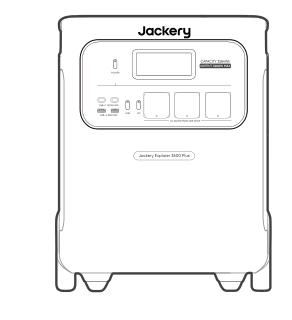
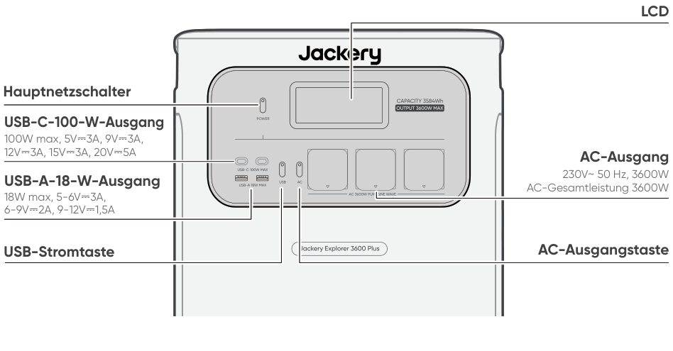
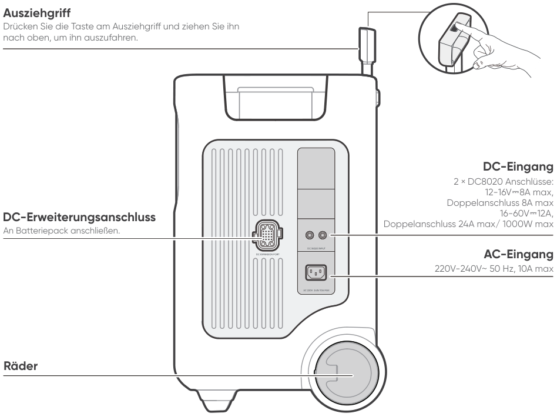
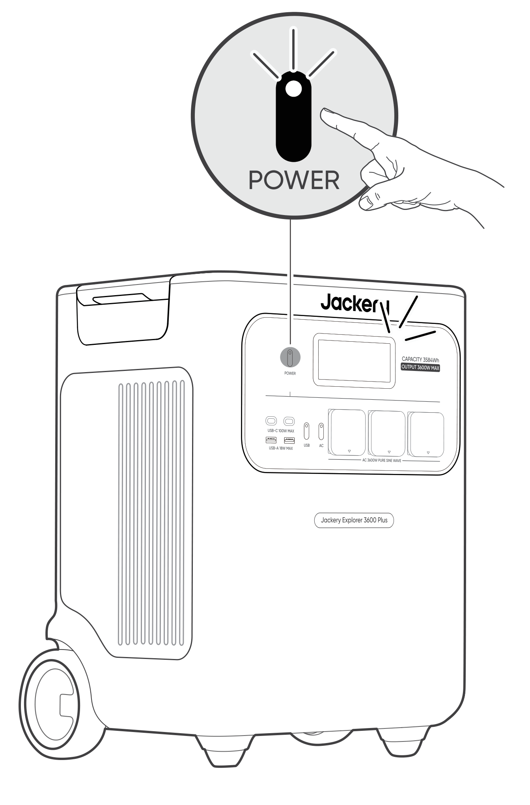
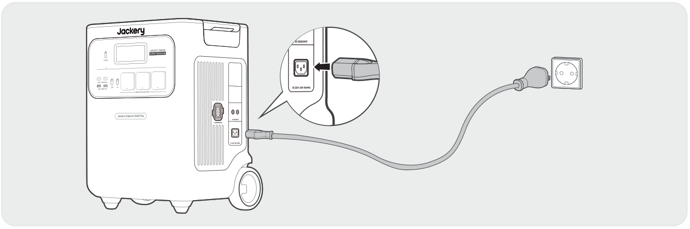
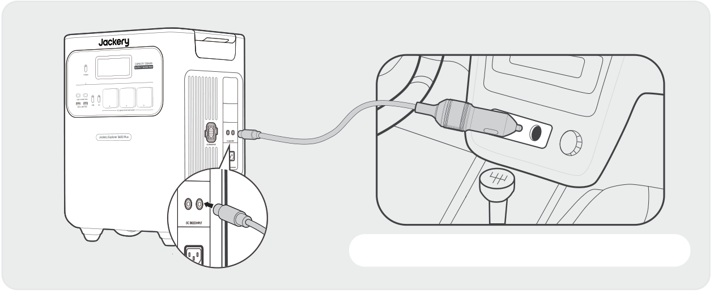

# WICHTIG

Herzlichen Glückwunsch zu Ihrem neuen Jackery Explorer 3600 Plus. Bitte lesen Sie dieses Handbuch, insbesondere die entsprechenden Vorsichtsmaßnahmen sorgfältig durch, bevor Sie das Produkt verwenden, um eine ordnungsgemäße Verwendung zu gewährleisten. Bewahren Sie dieses Handbuch zum Nachschlagen an einem leicht zugänglichen Ort auf.

In Übereinstimmung mit den Gesetzen und Vorschriften liegt das Recht der endgültigen Auslegung dieses Dokuments und aller zugehörigen Dokumente zu diesem Produkt beim Unternehmen.

Bitte beachten Sie, dass im Falle einer Aktualisierung, Überarbeitung oder Beendigung keine weiteren Benachrichtigungen erfolgen.

# SICHERHEITSVORKEHRUNGEN BEI DER VERWENDUNG

<table class="manual-callout-table manual-callout-table"><tbody><tr><td class="manual-callout-label">WARNUNG</td><td class="manual-callout-body">
SICHERHEITSHINWEISE ZUR VERMEIDUNG VON BRANDGE- FAHR, STROMSCHLAG ODER VERLETZUNGEN
</td></tr></tbody></table>

<strong>Befolgen Sie bei der Verwendung dieses Produkts stets die folgenden grundlegenden Vorsichtsmaßnahmen.</strong>

<ul><li>
Bitte lesen Sie alle Anweisungen, bevor Sie dieses Produkt verwenden.
</li><li>
Lassen Sie Kinder nicht mit dem Produkt spielen. Achten Sie darauf, dass Kinder beaufsichtigt werden, wenn das Produkt in ihrer Nähe verwendet wird.
</li><li>
Bei der Verwendung von Zubehör, das von nicht professionellen Herstellern empfohlen oder verkauft wird, besteht die Gefahr eines Stromschlags.
</li><li>
Wenn das Produkt nicht verwendet wird, ziehen Sie bitte den Netzstecker aus der Steckdose des Produkts.
</li><li>
Zerlegen Sie das Produkt nicht, da dies zu unvorhersehbaren Risiken führen kann, wie Feuer, Explosion oder Stromschlag.
</li><li>
Verwenden Sie das Produkt nicht mit beschädigten Kabeln oder Steckern oder beschädigten Ausgangskabeln, die einen Stromschlag verursachen können.
</li><li>
Um eine ordnungsgemäße Luftzirkulation zu gewährleisten, lassen Sie die Lüftungsschlitze des Produkts unbedeckt. Der Bereich, in dem das Produkt verwendet wird, muss über eine ausreichende Luftzirkulation in einer kühlen, trockenen Umgebung verfügen, um eine Überhitzung zu vermeiden. -Das Laden in feuchten oder schlecht belüfteten Räumen kann Sicherheitsrisiken verursachen. -Wasser kann Kurzschlüsse oder Schäden am Ladegerät verursachen und dadurch Sicherheitsrisiken mit sich bringen.
</li><li>
Setzen Sie das Produkt keinem Feuer, hohen Temperaturen, direkter Sonneneinstrahlung oder heißen Umgebungen wie dem Innenraum eines geparkten Fahrzeugs aus. Eine solche Einwirkung kann zu Feuer oder Explosion führen.
</li></ul>

## ANWEISUNGEN ZUR BENUTZERWARTUNG

Im Lebenszyklus von Energiespeicherprodukten ist ein gewisser Kapazitäts- und Energieverlust zu erwarten. Mit zunehmender Anzahl von Lade- und Entladezyklen sowie längerer Lagerzeit nimmt dieser Verlust allmählich zu. Dies ist ein normaler Vorgang, der mit der natürlichen Alterung der Batteriezellen einhergeht.

# BEDEUTUNG DER SYMBOLE

<figure aria-label="BEDEUTUNG DER SYMBOLE" class="hb-symbol-signal-composition" data-component-id="HB-TABLE-SYMBOL-SIGNAL"><table class="hb-symbol-signal-table"><colgroup><col class="hb-symbol-signal-col-label"/><col class="hb-symbol-signal-col-meaning"/></colgroup><thead><tr><th class="hb-symbol-signal-label-heading" scope="col">Symbol</th><th class="hb-symbol-signal-meaning-heading" scope="col">Bedeutung Gefährliche Handlungen, die zu schweren Verletzungen, Todesfällen</th></tr></thead><tbody><tr><td class="hb-symbol-signal-label-cell">⚠WARNUNG</td><td class="hb-symbol-signal-meaning-cell">Gefährliche Handlungen, die zu schweren Verletzungen, Todesfällen und/oder Sachschäden führen können.</td></tr><tr><td class="hb-symbol-signal-label-cell">⚠VORSICHT</td><td class="hb-symbol-signal-meaning-cell">Gefährliche Handlungen, die zu Personenschäden und/oder Sachschäden führen können.</td></tr><tr><td class="hb-symbol-signal-label-cell">⚠HINWEIS</td><td class="hb-symbol-signal-meaning-cell">Gefährliche Handlungen, die zu Geräteschäden, Datenverlust, Leistungsverschlechterung oder unvorhergesehenen Ergebnissen führen können.</td></tr><tr><td class="hb-symbol-signal-label-cell">⚠TIPP</td><td class="hb-symbol-signal-meaning-cell">Ergänzt wichtige Informationen oder Bedienungshinweise im Text.</td></tr></tbody></table></figure>

<figure aria-label="BEDEUTUNG DER SYMBOLE" class="hb-symbol-pair-composition" data-component-id="HB-TABLE-SYMBOL-ICON">

<table class="hb-symbol-panel-table"><colgroup><col class="hb-symbol-col-icon"/><col class="hb-symbol-col-meaning"/></colgroup><thead><tr><th class="hb-symbol-icon-heading" scope="col">Symbol</th><th class="hb-symbol-meaning-heading" scope="col">Bedeutung Gefährliche Handlungen, die zu schweren Verletzungen, Todesfällen</th></tr></thead><tbody><tr><td class="hb-symbol-icon"></td><td class="hb-symbol-meaning">Warn- und Sicherheitssymbole. Unbedingt lesen, um auf mögliche Gefahren oder Risiken aufmerksam zu machen.</td></tr><tr><td class="hb-symbol-icon"></td><td class="hb-symbol-meaning">Lesen Sie vor der Anwendung die Benutzeranleitung.</td></tr><tr><td class="hb-symbol-icon"></td><td class="hb-symbol-meaning">Vermeiden Sie Hitze.</td></tr><tr><td class="hb-symbol-icon"></td><td class="hb-symbol-meaning">Demontieren Sie das Produkt nicht.</td></tr><tr><td class="hb-symbol-icon"></td><td class="hb-symbol-meaning">Halten Sie das Produkt fern von Kindern.</td></tr><tr><td class="hb-symbol-icon"></td><td class="hb-symbol-meaning">Dieses Symbol zeigt an, dass sich ein Lithium-Ionen-Akku (Li-Ion) im Produkt befindet und ordnungsgemäß entsorgt oder recycelt werden sollte.</td></tr></tbody></table>

<table class="hb-symbol-panel-table"><colgroup><col class="hb-symbol-col-icon"/><col class="hb-symbol-col-meaning"/></colgroup><thead><tr><th class="hb-symbol-icon-heading" scope="col">Symbol</th><th class="hb-symbol-meaning-heading" scope="col">Bedeutung Gefährliche Handlungen, die zu schweren Verletzungen, Todesfällen</th></tr></thead><tbody><tr><td class="hb-symbol-icon"></td><td class="hb-symbol-meaning">Batterien und Akkumulatoren dürfen nicht über den Hausmüll entsorgt werden. Als Verbraucher sind Sie gesetzlich verpflichtet, alle Batterien und Akkumulatoren an dafür vorgesehenen Sammelstellen zu entsorgen, unabhängig davon, ob sie Schadstoffe enthalten. Bitte geben Sie gebrauchte Batterien und Akkumulatoren an einer örtlichen Sammelstelle, einem Recyclingzentrum oder beim Händler zurück, bei dem sie gekauft wurden. Die ordnungsgemäße Entsorgung gewährleistet eine umweltgerechte Wiederverwertung und verhindert mögliche Schäden für die menschliche Gesundheit und die Umwelt.</td></tr><tr><td class="hb-symbol-icon"></td><td class="hb-symbol-meaning">Dieses Symbol zeigt an, dass das Produkt nicht als Haushaltsabfall entsorgt werden soll und an eine dafür vorgesehene Sammelstelle zur Entsorgung und Recycling gebracht werden sollte. Eine ordnungsgemäße Entsorgung und Recycling kann dazu beitragen, die Umwelt zu schützen. Für weitere Informationen zur Entsorgung und Recycling dieses Produkts wenden Sie sich an Ihre örtliche Gemeinde, Entsorgungsdienstleistungen oder Ihren Händler.</td></tr></tbody></table>

</figure>

# LIEFERUMFANG

<figure aria-label="LIEFERUMFANG" class="hb-inbox-composition" data-card-count="3" data-component-id="HB-SPECIAL-INBOX" data-inbox-variant="three-card-responsive"><ol class="hb-inbox-grid"><li class="hb-inbox-card" data-item-number="1">

Jackery Explorer 3600 Plus

</li><li class="hb-inbox-card" data-item-number="2">

AC-Ladekabel

</li><li class="hb-inbox-card" data-item-number="3">

Benutzerhandbuch

</li></ol>

TIPP

Das Autoladekabel ist nicht im Lieferumfang enthalten, kann jedoch separat auf unserer Website erworben werden. Bei Fragen wenden Sie sich bitte an den Jackery-Kundendienst.

</figure>

# PRODUKTÜBERSICHT

## PRODUKTDARSTELLUNG

<figure class="hb-reference-figure" data-component-id="HB-SPECIAL-REFERENCE-FIGURE" data-reference-id="overview-front" data-source-fragment-sha256="152f8f1e645ce3c9e1f007a62e3d2672326543d18b142726786af2b1ff0bce77">

</figure>

## RECHTE SEITENANSICHT

<figure class="hb-reference-figure" data-component-id="HB-SPECIAL-REFERENCE-FIGURE" data-reference-id="overview-right" data-source-fragment-sha256="47c55a1433ae899a35d2112a7377eb026f8fc5ae03ae7879c75d2ea8dd330f1a">

</figure>

# LCD-ANZEIGE

<figure class="hb-reference-figure" data-component-id="HB-SPECIAL-REFERENCE-FIGURE" data-reference-id="lcd-map" data-source-fragment-sha256="d5eb118a283d93836fc0561df39a168ddc7cd9324c382ebd3a10ae8c4c738315">

</figure>

<figure aria-label="LCD-ANZEIGE" class="hb-lcd-table-composition" data-component-id="HB-TABLE-LCD-ICON" tabindex="0"><table class="hb-lcd-icon-table"><colgroup><col class="hb-lcd-col-number"/><col class="hb-lcd-col-icon"/><col class="hb-lcd-col-name"/><col class="hb-lcd-col-description"/></colgroup><tbody><tr><td class="hb-lcd-number">1</td><td class="hb-lcd-icon"></td><td class="hb-lcd-name">WLAN</td><td class="hb-lcd-description">
Ein: WLAN verbunden. Blinkt: Bereit für die WLAN-Verbindung. Aus: WLAN getrennt.
</td></tr><tr><td class="hb-lcd-number">2</td><td class="hb-lcd-icon"></td><td class="hb-lcd-name">Bluetooth</td><td class="hb-lcd-description">
Ein: Bluetooth verbunden. Blinkt: Bereit für die Bluetooth-Verbindung. Aus: Bluetooth getrennt.
</td></tr><tr><td class="hb-lcd-number">3</td><td class="hb-lcd-icon"></td><td class="hb-lcd-name">Leiser Lademodus</td><td class="hb-lcd-description">
Ein: Das Rauschen beim Laden wird deutlich minimiert, während die Ladeleistung reduziert und die Ladegeschwindigkeit verlangsamt wird. Aus: Der leise Lademodus ist deaktiviert. Diese Funktion kann in der Jackery-App aktiviert oder deaktiviert werden.
</td></tr><tr><td class="hb-lcd-number" rowspan="2">4</td><td class="hb-lcd-icon"></td><td class="hb-lcd-name">Batteriesparmodus</td><td class="hb-lcd-description">
Ein: Begrenzt die maximal nutzbare Batteriekapazität, um die Lebensdauer der Batterie zu verlängern. Aus: Der Batteriesparmodus ist deaktiviert. Diese Funktion kann in der Jackery-App aktiviert oder deaktiviert werden.
</td></tr><tr><td class="hb-lcd-icon"></td><td class="hb-lcd-name">Selbstversorgungsmodus</td><td class="hb-lcd-description">
Maximiert die Nutzung von Solarenergie und reduziert die Abhängigkeit vom Netzstrom, indem gespeicherte Solarenergie priorisiert wird, wodurch die Stromkosten gesenkt werden (bitte aktivieren/deaktivieren Sie diese Funktion in der App). Die Power Station muss gleichzeitig mit beiden Solarmodulen und dem Netz verbunden sein, wobei die Lastleistung durch die Bypass-Leistung begrenzt werden muss.
</td></tr><tr><td class="hb-lcd-number">5</td><td class="hb-lcd-icon"></td><td class="hb-lcd-name">Ladeplan Plan</td><td class="hb-lcd-description">
Passen Sie die Ladezeit des Explorer 3600 Plus an. Geeignet für Situationen mit schwankenden Strompreisen, ermöglicht es Ladepläne basierend auf Spitzen- und Schwachlastzeiten, wodurch die Stromkosten gesenkt werden (Bitte in der Jackery-App einstellen).
</td></tr><tr><td class="hb-lcd-number">6</td><td class="hb-lcd-icon"></td><td class="hb-lcd-name">AC-Stromanzeige</td><td class="hb-lcd-description">
Der AC-Ausgang (reine Sinuswelle) ist eingeschaltet.
</td></tr><tr><td class="hb-lcd-number">7</td><td class="hb-lcd-icon"></td><td class="hb-lcd-name">Ausgangsspannung und -frequenz</td><td class="hb-lcd-description">
Zeigt die Ausgangsspannung und -frequenz an, wenn der AC-Ausgang eingeschaltet ist.
</td></tr><tr><td class="hb-lcd-number">8</td><td class="hb-lcd-icon"></td><td class="hb-lcd-name">Eingangsleistung</td><td class="hb-lcd-description">
Zeigt die Eingangsleistung in Watt an.
</td></tr><tr><td class="hb-lcd-number">9</td><td class="hb-lcd-icon"></td><td class="hb-lcd-name">Verbleibende Aufladezeit</td><td class="hb-lcd-description">
Anzeige der verbleibenden Ladezeit.
</td></tr><tr><td class="hb-lcd-number">10</td><td class="hb-lcd-icon"></td><td class="hb-lcd-name">AC-Netzladeanzeige</td><td class="hb-lcd-description">
Das Produkt wird über den AC-Eingang mit Netzstrom geladen.
</td></tr><tr><td class="hb-lcd-number">11</td><td class="hb-lcd-icon"></td><td class="hb-lcd-name">Autoladeanzeige</td><td class="hb-lcd-description">
Das Produkt wird über den DC-Eingang (DC8020) mit 12V Gleichstrom (Autoladung) geladen.
</td></tr><tr><td class="hb-lcd-number">12</td><td class="hb-lcd-icon"></td><td class="hb-lcd-name">Solar-Ladeanzeige</td><td class="hb-lcd-description">
Das Produkt wird über den DC-Eingang (DC8020) mit Solarpanel(s) geladen.
</td></tr><tr><td class="hb-lcd-number">13</td><td class="hb-lcd-icon"></td><td class="hb-lcd-name">Batteriezustandsanzeige</td><td class="hb-lcd-description">
Wenn das Produkt geladen wird, leuchtet der orangefarbene Kreis um die Batterieanzeige nacheinander auf. Beim Laden anderer Geräte bleibt der orangefarbene Kreis dauerhaft eingeschaltet.
</td></tr><tr><td class="hb-lcd-number">14</td><td class="hb-lcd-icon"></td><td class="hb-lcd-name">Batterietiefstandsanzeige</td><td class="hb-lcd-description">
Ein: Der Batteriestand liegt unter 20 %. Blinkt: Der Batteriestand liegt unter 5 %. Aus: Der Batteriestand liegt nicht unter 20 % oder das Produkt wird aufgeladen.
</td></tr><tr><td class="hb-lcd-number">15</td><td class="hb-lcd-icon"></td><td class="hb-lcd-name">Verbleibender Batterieprozentsatz</td><td class="hb-lcd-description">
Zeigt den verbleibenden Batteriestand an.
</td></tr><tr><td class="hb-lcd-number">16</td><td class="hb-lcd-icon"></td><td class="hb-lcd-name">Batteriepack-Anzeige und Anzahl der angeschlossenen Batterien</td><td class="hb-lcd-description">
Zeigt die Anzahl der angeschlossenen Batteriepacks an, sofern diese angeschlossen sind.
</td></tr><tr><td class="hb-lcd-number">17</td><td class="hb-lcd-icon"></td><td class="hb-lcd-name">Fehlermeldung</td><td class="hb-lcd-description">
Ein Produktfehler ist aufgetreten. Bitte lesen Sie den Abschnitt „Fehlerbehebung“ für weitere Informationen.
</td></tr><tr><td class="hb-lcd-number" rowspan="2">18</td><td class="hb-lcd-icon"></td><td class="hb-lcd-name">Warnung vor hoher Temperatur</td><td class="hb-lcd-description">
Der Hochtemperaturschutz wurde aktiviert. Das Produkt kann die Funktion einstellen, bis die Temperatur wieder im normalen Betriebsbereich liegt.
</td></tr><tr><td class="hb-lcd-icon"></td><td class="hb-lcd-name">Warnung bei niedriger Temperatur</td><td class="hb-lcd-description">
Der Niedrigtemperaturschutz wurde aktiviert. Das Produkt kann die Funktion einstellen, bis die Temperatur wieder im normalen Betriebsbereich liegt.
</td></tr><tr><td class="hb-lcd-number">19</td><td class="hb-lcd-icon"></td><td class="hb-lcd-name">Energiesparmodus</td><td class="hb-lcd-description">
Wenn der AC- oder USB-Ausgang durch Drücken der ACoder USB-Stromtaste eingeschaltet wird: Ein: Der Energiesparmodus ist aktiviert. Aus: Der Energiesparmodus ist deaktiviert.
</td></tr><tr><td class="hb-lcd-number">20</td><td class="hb-lcd-icon"></td><td class="hb-lcd-name">Ausgangsleistung</td><td class="hb-lcd-description">
Zeigt die Ausgangsleistung in Watt an.
</td></tr><tr><td class="hb-lcd-number">21</td><td class="hb-lcd-icon"></td><td class="hb-lcd-name">Verbleibende Entladezeit</td><td class="hb-lcd-description">
Anzeige der verbleibenden Entladezeit.
</td></tr></tbody></table></figure>

# GRUNDLEGENDE OPERATIONEN

## HAUPTSTROMVERSORGUNG EIN/AUS

<figure class="hb-reference-figure hb-base-art-live-copy" data-component-id="HB-SPECIAL-REFERENCE-FIGURE" data-reference-id="operation-main-power" data-source-fragment-sha256="6ee9a7779a995f0941bc841562a1e331311b4148de67b21b7f06d7e76f176629" data-web-base-art-ref="operation-main-power" data-web-presentation-mode="base-art-live-copy">

Ein Einmal drückenAus Drei Sekunden lang gedrückt haltenStandard-Standby-Zeit: 2 Stunden Das Gerät schaltet sich automatisch nach 2 Stunden ab, wenn kein Lade- oder Entladevorgang stattfindet. *Die Standby-Zeit kann in der Jackery App eingestellt werden.Wenn der Energiesparmodus aktiviert ist, schaltet sich das Gerät automatisch nach 12 Stunden ab, wenn die AC- oder USB-Stromtaste eingeschaltet ist, das Produkt jedoch weder lädt noch entlädt.

</figure>

## USB-AUSGANG EIN/AUS

<figure class="hb-operation-figure hb-operation-layout-status-right hb-base-art-live-copy" data-component-id="HB-SPECIAL-OPERATION" data-operation-id="dc-usb-output" data-source-fragment-sha256="b94c17de2a8af1e367f26b2dd60241df9937005d8c2b511623ea526938843898" data-web-base-art-ref="operation/dc_usb_output" data-web-presentation-mode="base-art-live-copy" data-web-replace-key="operation.dc-usb-output">

<strong>Voraussetzung:</strong> Das Produkt ist eingeschaltet.

<strong>Ein</strong>

Einmal drücken

<strong>Aus</strong>

Einmal drücken

</figure>

<table class="manual-callout-table manual-callout-table"><tbody><tr><td class="manual-callout-label">VORSICHT</td><td class="manual-callout-body"><ul><li>
Der USB-C-100-W-Anschluss ist ein USB-PD Power Source 3 (PS3) Hochleistungs-Ausgangsport. Wenn das angeschlossene Benutzergerät oder Zubehör die Sicherheitsanforderungen nicht erfüllt, kann Brandgefahr bestehen. Bevor Sie diese Anschlüsse verwenden, stellen Sie sicher, dass das angeschlossene Gerät oder Zubehör über einen Brandschutz verfügt.
</li><li>
Schließen Sie den Jackery Explorer 3600 Plus nur an Geräte oder Zubehör an, die den Abschnitten 6.3, 6.4 und 6.5 der IEC/EN/UL 62368-1 (oder gleichwertigen Normen) entsprechen.
</li><li>
Um die maximale Ausgangsleistung zu erreichen, verwenden Sie das offizielle Jackery USB-C-auf-USB-C-5A-Kabel (20 V DC/5 A, 100 W).
</li></ul></td></tr></tbody></table>

## AC-AUSGANG EIN/AUS

<figure class="hb-operation-figure hb-operation-layout-status-right hb-base-art-live-copy" data-component-id="HB-SPECIAL-OPERATION" data-operation-id="ac-output" data-source-fragment-sha256="b3a16d424a788219e006963f9fb1a93653b6e14d761b0b47a43844bb594d3029" data-web-base-art-ref="operation/ac_output" data-web-presentation-mode="base-art-live-copy" data-web-replace-key="operation.ac-output">

<strong>Voraussetzung:</strong> Das Produkt ist eingeschaltet.

<strong>Ein</strong>

Einmal drücken

<strong>Aus</strong>

Einmal drücken

</figure>

## ENERGIESPARMODUS

<figure class="hb-reference-figure hb-base-art-live-copy" data-component-id="HB-SPECIAL-REFERENCE-FIGURE" data-reference-id="operation-energy-saving" data-source-fragment-sha256="caffbaad8cecc9e623456ee4c95f26696a732efaa110b336b1d8bc96e9e9df76" data-web-base-art-ref="operation-energy-saving" data-web-presentation-mode="base-art-live-copy">

Um unnötigen Batterieverbrauch durch das Vergessen des Ausschaltens des Ausgangs zu verhindern, ist der Energiesparmodus standardmäßig aktiviert. Wenn kein Gerät angeschlossen ist oder der Stromverbrauch des angeschlossenen Geräts unter einem bestimmten Schwellenwert liegt (AC-Ausgang ≤ 25 W o USB-Ausgang ≤ 25 W), werden alle Ausgänge nach 12 Stunden automatisch abgeschaltet. Um den Energiesparmodus zu deaktivieren, halten Sie die AC-Stromtaste und die POWER-Taste gleichzeitig länger als 3 Sekunden gedrückt. Das Gerät schaltet den AC- oder DC-Ausgang nicht automatisch ab.POWER-TasteAC-AusgangstasteEin/Aus 3s Drei Sekunden lang gedrückt halten

</figure>

<table class="manual-callout-table manual-callout-table"><tbody><tr><td class="manual-callout-label">HINWEIS</td><td class="manual-callout-body">
Nach dem Einschalten nimmt der Energiesparmodus den vorherigen Zustand wieder an. Ein Wechsel des Modus erfordert manuelles Umschalten.
</td></tr></tbody></table>

## LCD-BILDSCHIRM EIN/AUS

<figure aria-label="LCD-BILDSCHIRM EIN/AUS" class="hb-lcd-mode-composition" data-component-id="HB-TABLE-LCD-MODE">

<table class="hb-lcd-mode-table"><colgroup><col class="hb-lcd-mode-col-state"/><col class="hb-lcd-mode-col-action"/><col class="hb-lcd-mode-col-copy"/></colgroup><tbody><tr><td class="hb-lcd-mode-state" rowspan="3">LCD- Bildschirm</td><td class="hb-lcd-mode-action">Einschalten</td><td class="hb-lcd-mode-copy">Drücken Sie den Hauptschalter oder wenn das Produkt aufgeladen wird.</td></tr><tr><td class="hb-lcd-mode-action">Ausschalten</td><td class="hb-lcd-mode-copy">Drücken Sie den Hauptschalter.</td></tr><tr><td class="hb-lcd-mode-action">Automatische Abschaltung</td><td class="hb-lcd-mode-copy">Das LCD schaltet sich automatisch aus und wechselt nach 2 Minuten Inaktivität in den Schlafmodus.</td></tr><tr><td class="hb-lcd-mode-state" rowspan="3">Permanenter Anzeigemodus (im Lade- oder Entladezustand)</td><td class="hb-lcd-mode-action">Einschalten</td><td class="hb-lcd-mode-copy">Drücken Sie zweimal den Hauptschalter, wenn der LCD-Bildschirm eingeschaltet ist.</td></tr><tr><td class="hb-lcd-mode-action">Ausschalten</td><td class="hb-lcd-mode-copy">Drücken Sie den Hauptschalter.</td></tr><tr><td class="hb-lcd-mode-action">Automatische Abschaltung</td><td class="hb-lcd-mode-copy">Der Always-on-Anzeigemodus schaltet sich nach 2 Stunden Inaktivität automatisch aus.</td></tr></tbody></table>
</figure>

Der Anzeigemodus des Bildschirms kann auch in der Jackery-App eingestellt werden.

## TASTENKOMBINATIONEN

<figure aria-label="Tasten / Bedienung / Funktion" class="hb-key-combination-composition" data-component-id="HB-TABLE-KEY-COMBINATIONS" tabindex="0"><table class="hb-key-combination-table"><colgroup><col class="hb-key-col-buttons"/><col class="hb-key-col-operation"/><col class="hb-key-col-function"/></colgroup><thead><tr><th class="hb-key-buttons" scope="col">Tasten</th><th class="hb-key-operation" scope="col">Bedienung</th><th class="hb-key-function" scope="col">Funktion</th></tr></thead><tbody><tr><td class="hb-key-buttons">POWER-Taste + USB-Stromtaste</td><td class="hb-key-operation">3 Sekunden lang gedrückt halten.</td><td class="hb-key-function">WLAN und Bluetooth zurücksetzen</td></tr><tr><td class="hb-key-buttons">POWER-Taste + AC-Ausgangstaste</td><td class="hb-key-operation">3 Sekunden lang gedrückt halten.</td><td class="hb-key-function">Energiesparmodus ein-/ausschalten</td></tr><tr><td class="hb-key-buttons">USB-Stromtaste + AC-Ausgangstaste</td><td class="hb-key-operation">1 Sekunde lang gedrückt halten.</td><td class="hb-key-function">WLAN und Bluetooth ein-/ausschalten</td></tr></tbody></table></figure>

# UNTERBRECHUNGSFREIE STROMVERSORGUNG (UPS)

Schließen Sie das Produkt mit dem AC-Ladekabel an eine Steckdose an, drücken Sie dann die AC-Ausgangstaste, und versorgen Sie gleichzeitig Ihre Geräte mit Strom.

<figure class="hb-reference-figure hb-base-art-live-copy" data-component-id="HB-SPECIAL-REFERENCE-FIGURE" data-reference-id="ups" data-source-fragment-sha256="4d811236cf53f5ad3f57a6d6730ded4de31b7120afd0220d5207e034108587ec" data-web-base-art-ref="ups" data-web-presentation-mode="base-art-live-copy">

Eine unterbrechungsfreie Stromversorgung (UPS) ist ein kontinuierliches Stromversorgungssystem, das bei einem Ausfall der Netzstromversorgung automatisch Backup-Strom für angeschlossene Geräte bereitstellt. Im Falle eines plötzlichen Stromausfalls schaltet der Explorer 3600 Plus automatisch innerhalb von 10 ms auf die gespeicherte Energie um, damit Ihre Geräte weiterhin betrieben werden können.

</figure>

Im USV-Modus erreicht das Gerät vor Stromausfällen eine Spitzenausgangsstromstärke von 10 A. Da im Bypass-Modus gleichzeitiges Laden und Entladen möglich ist, liegt die tatsächliche Ausgangsleistung in diesem Modus unter der Nennleistung; bei Stromausfällen wird jedoch wieder die Nennleistung erreicht.

<table class="manual-callout-table manual-callout-table"><tbody><tr><td class="manual-callout-label">Vorsicht</td><td class="manual-callout-body"><ul><li>
Dieses Produkt unterstützt keinen 0-ms-Umschaltvorgang. Schließen Sie es nicht an Geräte an, die eine unterbrechungsfreie Stromversorgung benötigen, wie z. B. Datenserver oder Workstations.
</li><li>
Bitte testen Sie die Kompatibilität mit Ihrem Gerät vor der Verwendung mehrfach.
</li><li>
Schließen Sie keine Lasten an, die die maximale Ausgangsleistung des Produkts überschreiten. Andernfalls wird der Überlastschutz ausgelöst.
</li></ul></td></tr></tbody></table>

# VERBINDUNGEN

<h2 class="hb-subbar" id="anschluss-an-batteriepacks-separat-erhältlich">ANSCHLUSS AN BATTERIEPACK(S) SEPARAT ERHÄLTLICH</h2>

Dieses Gerät unterstützt bis zu fünf Batteriepacks, um einen hohen Leistungsbedarf abzudecken. Weitere Informationen zur Verwendung finden Sie im Benutzerhandbuch des Jackery Battery Pack 3600.

<figure class="hb-reference-figure hb-base-art-live-copy" data-component-id="HB-SPECIAL-REFERENCE-FIGURE" data-reference-id="battery" data-source-fragment-sha256="9eb3693d55cf1278405a9a142fe59fcb8709f598c8829d2a2212627b119a0cbe" data-web-base-art-ref="battery" data-web-presentation-mode="base-art-live-copy">

≥ 200 mm≥ 200 mm

</figure>

<table class="manual-callout-table manual-callout-table"><tbody><tr><td class="manual-callout-label">Vorsicht</td><td class="manual-callout-body"><ul><li>
Stellen Sie sicher, dass alle Geräte ausgeschaltet sind, bevor Sie den Explorer 3600 Plus an das Jackery Battery Pack 3600 anschließen.
</li><li>
Stellen Sie für einen ordnungsgemäßen Betrieb sicher, dass die Lufteinlass- und Abluftöffnungen auf beiden Seiten nicht blockiert sind. Halten Sie zwischen den Lüftungsöffnungen und anderen Gegenständen einen Abstand von mindestens 200 mm ein, um eine ausreichende Wärmeableitung zu gewährleisten.
</li></ul></td></tr></tbody></table>

<figure class="hb-reference-figure hb-base-art-live-copy" data-component-id="HB-SPECIAL-REFERENCE-FIGURE" data-reference-id="battery-accessories" data-source-fragment-sha256="e025a494a26264507323796399d6d8fb93db603607e198fa03f592e734d62088" data-web-base-art-ref="battery-accessories" data-web-presentation-mode="base-art-live-copy">

Jackery Battery Pack 3600VerlängerungskabelBenutzerhandbuchSeparat erhältlich

</figure>

# AUFLADEN

<strong>Grüne Energie zuerst:</strong> Wir plädieren dafür, vorrangig grüne Energie zu nutzen. Dieses Produkt unterstützt zwei gleichzeitige Lade-Betriebsarten: Aufladen mit Solarenergie und Aufladen mit Netzstrom. Wenn Netz- und Solarladung gleichzeitig eingeschaltet sind, gibt das Produkt der Solarladung den Vorrang und beide Methoden werden verwendet, um die Batterie mit der maximal zulässigen Leistung zu laden.

Laden Sie das Gerät vor der ersten Verwendung vollständig auf.

<table class="manual-callout-table manual-callout-table"><tbody><tr><td class="manual-callout-label">Hinweis</td><td class="manual-callout-body"><ul><li>
Die empfohlene Temperatur zum Laden des Produkts liegt zwischen -20°C und 45°C, und die Entladungstemperatur ebenfalls zwischen -20°C und 45°C. Wird das Produkt außerhalb dieses Temperaturbereichs betrieben, kann dies die Lade- und Entladefähigkeit einschränken oder sogar dazu führen, dass kein Laden oder Entladen möglich ist.
</li><li>
Die Ladeleistung und die Batteriekapazität des Produkts können aufgrund von Temperaturschwankungen variieren.
</li></ul></td></tr></tbody></table>

## AUFLADEN ÜBER EINE AC-STECKDOSE

<figure class="hb-reference-figure hb-base-art-live-copy" data-component-id="HB-SPECIAL-REFERENCE-FIGURE" data-reference-id="charging-ac" data-source-fragment-sha256="b7b47e90e20ea31bd0c8768e433c1d668a83e958ba0b2919b2a74db5060c2934" data-web-base-art-ref="charging-ac" data-web-presentation-mode="base-art-live-copy">

Schließen Sie das AC-Ladekabel an den AC-Eingangsanschluss der Powerstation an und stecken Sie es in die Steckdose.

</figure>

<table class="manual-callout-table manual-callout-table"><tbody><tr><td class="manual-callout-label">Vorsicht</td><td class="manual-callout-body">
Stellen Sie sicher, dass das Wechselstrom-Ladekabel vollständig und fest mit dem AC-Eingangsanschluss verbunden ist. Eine unvollständige Verbindung kann zu instabilem Stromfluss, Überhitzung, schlechtem Kontakt oder Fehlfunktionen des Geräts führen.
</td></tr></tbody></table>

<h2 class="hb-subbar" id="aufladen-über-solarpanel-separat-erhältlich">AUFLADEN ÜBER SOLARPANEL SEPARAT ERHÄLTLICH</h2>

AUFLADEN ÜBER SOLARPANEL Der Jackery Explorer 3600 Plus verfügt über zwei DC8020-Eingangsanschlüsse und ist mit den Jackery-Solarmodulen kompatibel. Wenn ein DC8020-Eingangsanschluss zwei Solarmodule gleichzeitig anschließen muss, beziehen Sie sich bitte auf die folgende Abbildung zum Aufladen über den Solarpanel-Anschluss (separat erhältlich, nicht im Lieferumfang enthalten).

<figure class="hb-reference-figure hb-base-art-live-copy" data-component-id="HB-SPECIAL-REFERENCE-FIGURE" data-reference-id="charging-solar" data-source-fragment-sha256="b19d8622a4150edbc36830bc842910b6f17d60391198e798de99655bb462bf8b" data-web-base-art-ref="charging-solar" data-web-presentation-mode="base-art-live-copy">

SolarSaga 200 × 4

</figure>

<table class="manual-callout-table manual-callout-table"><tbody><tr><td class="manual-callout-label">VORSICHT</td><td class="manual-callout-body">
An einen DC8020-Eingangsanschluss können höchstens zwei Solarmodule angeschlossen werden.
</td></tr></tbody></table>

<table class="manual-callout-table manual-callout-table"><tbody><tr><td class="manual-callout-label">VORSICHT</td><td class="manual-callout-body"><ul><li>
Stellen Sie sicher, dass die Eingangsspannung für beide DC-Eingangsanschlüsse gleich ist. Andernfalls kann es zu Schäden am Gerät kommen. Beispiel:
</li><li>
Verwenden Sie beim Anschluss von Solarpanels an beide DC8020-Eingangsanschlüsse dieselben Jackery-Solarmodelltypen und die gleiche Anzahl an Panels.
</li><li>
Laden Sie das Gerät nicht gleichzeitig über das Autoladegerät und das Solarpanel. Dies könnte die Autosicherung durchbrennen lassen oder zu einem Ladeausfall führen.
</li></ul></td></tr></tbody></table>

Es wird empfohlen, das Jackery-Solarmodul zum Aufladen des Explorer 3600 Plus zu verwenden. Stellen Sie sicher, dass die Leerlaufspannung (Voc) des Solarmoduls innerhalb des DC-Eingangsspannungsbereichs des Explorer 3600 Plus liegt (16V–60V). Jackery übernimmt keine Verantwortung für Schäden oder Verluste, die durch die Verwendung von Solarmodulen anderer Hersteller entstehen.

<h2 class="hb-subbar" id="aufladen-über-das-autoladegerät-separat-erhältlich">AUFLADEN ÜBER DAS AUTOLADEGERÄT SEPARAT ERHÄLTLICH</h2>

Dieses Produkt kann mit einem 12-V-Autoladegerät aufgeladen werden. Vergewissern Sie sich, dass das Autoladegerät und der Zigarettenanzünder im Auto eine gute Verbindung haben.

<figure class="hb-reference-figure hb-base-art-live-copy" data-component-id="HB-SPECIAL-REFERENCE-FIGURE" data-reference-id="charging-car" data-source-fragment-sha256="a9e5f404fe3198aea985aa0ddea871b4f88ae1749daca5b3d962953d4c408a97" data-web-base-art-ref="charging-car" data-web-presentation-mode="base-art-live-copy">

Fahrzeug※ Das Autoladekabel wird separat verkauft.

</figure>

<table class="manual-callout-table manual-callout-table"><tbody><tr><td class="manual-callout-label">VORSICHT</td><td class="manual-callout-body"><ul><li>
Bitte starten Sie das Fahrzeug, bevor Sie Ihre Stromtankstelle aufladen.
</li><li>
Wenn das Fahrzeug auf holprigen Straßen fährt, ist es verboten, das Autoladegerät zu benutzen, da es aufgrund einer schlechten Verbindung durchbrennen könnte. Das Unternehmen haftet nicht für Schäden, die durch einen nicht normgerechten Betrieb entstehen.
</li><li>
Das Aufladen des Fahrzeugs gilt nur für Fahrzeuge mit 12 V DC, nicht für Fahrzeuge mit 24 V DC. Bitte laden Sie dieses Produkt nicht in einem 24-V-Fahrzeug auf, um Personen- und Sachschäden zu vermeiden.
</li></ul></td></tr></tbody></table>

# LAGERUNG

Bewahren Sie das Produkt an einem trockenen, sauberen Ort mit ausreichender Belüftung auf. Lagertemperatur und Luftfeuchtigkeit:
<ul class="hb-source-storage-copy" style="margin:0"><li class="hb-source-storage-item" style="margin:0">
1 Monat: -20 °C bis 45 °C (0–60 % relative Luftfeuchtigkeit)
</li><li class="hb-source-storage-item" style="margin:0">
3 Monate: 0 °C bis 45 °C (0–60 % relative Luftfeuchtigkeit)
</li><li class="hb-source-storage-item" style="margin:0">
12 Monate: 0 °C bis 25 °C (0–60 % relative Luftfeuchtigkeit)
</li></ul>
Wenn dieses Produkt über einen längeren Zeitraum (3 bis 6 Monate) mit entladener Batterie gelagert wird, kann es sein, dass es danach nicht mehr aufgeladen werden kann. Um dies zu verhindern und die Batterielebensdauer zu erhalten, wird empfohlen, das Produkt alle drei Monate zu überprüfen und aufzuladen sowie mindestens einmal alle 6 bis 12 Monate einen vollständigen Lade- und Entladezyklus durchzuführen.

# FEHLERSUCHE

Falls einer der folgenden Fehlercodes angezeigt wird, befolgen Sie die aufgeführten Korrekturmaßnahmen, um das Problem zu beheben. Wenn der Fehler weiterhin besteht, wenden Sie sich bitte an den Jackery-Kundendienst.

<figure aria-label="Fehlermel- dung / Maßnahmen zur Fehlerbehebung" class="hb-troubleshooting-composition" data-component-id="HB-TABLE-TROUBLESHOOTING" tabindex="0"><table class="hb-troubleshooting-table"><colgroup><col class="hb-troubleshooting-col-code"/><col class="hb-troubleshooting-col-measures"/></colgroup><thead><tr><th class="hb-troubleshooting-code" scope="col">Fehlermel- dung</th><th class="hb-troubleshooting-measures" scope="col">Maßnahmen zur Fehlerbehebung</th></tr></thead><tbody><tr><td class="hb-troubleshooting-code">F0</td><td class="hb-troubleshooting-measures">Starten Sie das Gerät neu.</td></tr><tr><td class="hb-troubleshooting-code">F1</td><td class="hb-troubleshooting-measures">Starten Sie das Gerät neu.</td></tr><tr><td class="hb-troubleshooting-code">F2</td><td class="hb-troubleshooting-measures">Starten Sie das Gerät neu.</td></tr><tr><td class="hb-troubleshooting-code">F3</td><td class="hb-troubleshooting-measures">Starten Sie das Gerät neu.</td></tr><tr><td class="hb-troubleshooting-code">F4</td><td class="hb-troubleshooting-measures">Schließen Sie das Gerät an Verbraucher an, um die Batterie zu entladen, bis der Fehler verschwindet.</td></tr><tr><td class="hb-troubleshooting-code">F5</td><td class="hb-troubleshooting-measures">Laden Sie das Gerät über Solarmodule oder eine AC-Wandsteckdose, bis der Fehler verschwindet.</td></tr><tr><td class="hb-troubleshooting-code">F6</td><td class="hb-troubleshooting-measures">1. Warten Sie, bis das Stromnetz stabil ist, bevor Sie das Gerät über eine Netzsteckdose laden. 2. Überprüfen Sie, ob die Lufteinlass- und -auslassöffnungen blockiert sind; stellen Sie sicher, dass auf beiden Seiten des Geräts ein Abstand von 20 cm eingehalten wird. 3. Platzieren Sie das Gerät an einem Ort, der nicht direktem Sonnenlicht oder hohen Umgebungstemperaturen ausgesetzt ist. 4. Trennen Sie alle Verbraucher vom Gerät, lassen Sie es im Leerlauf und warten Sie, bis der Fehler verschwindet. 5. Starten Sie das Gerät neu.</td></tr><tr><td class="hb-troubleshooting-code">F7</td><td class="hb-troubleshooting-measures">1. Trennen Sie alle DC-Eingänge vom Gerät. 2. Wenn Sie das Produkt über ein Solarpanel laden, überprüfen Sie die Leerlaufspannung (Voc) des angeschlossenen Solarpanels. Das Gerät erlaubt eine maximale DC-Eingangsspannung von 60V. 3. Starten Sie das Gerät neu und lassen Sie es im Leerlauf. Warten Sie, bis der Fehler verschwindet.</td></tr><tr><td class="hb-troubleshooting-code">F8</td><td class="hb-troubleshooting-measures">Kontaktieren Sie den Händler oder den Jackery-Kundendienst.</td></tr><tr><td class="hb-troubleshooting-code">F9</td><td class="hb-troubleshooting-measures">Trennen Sie die an die USB-Anschlüsse des Geräts angeschlossenen Verbraucher. Warten Sie, bis der Fehler verschwindet.</td></tr><tr><td class="hb-troubleshooting-code">FA</td><td class="hb-troubleshooting-measures">1. Schalten Sie den AC-Ausgang beider Geräte aus. 2. Drücken Sie innerhalb von 1 Minute erneut die AC-Stromtaste an jedem Gerät.</td></tr><tr><td class="hb-troubleshooting-code">FC</td><td class="hb-troubleshooting-measures">1. Starten Sie die Batteriepacks sowie den Jackery Explorer 3600 Plus jeweils neu. 2. Besteht der Fehler weiterhin, trennen Sie das Batteriepack vom Jackery Explorer 3600 Plus und schließen Sie es erneut an.</td></tr></tbody></table></figure>

# TECHNISCHE DATEN

<h2 aria-level="2" role="heading">ALLGEMEINE INFORMATIONEN</h2><figure aria-label="ALLGEMEINE INFORMATIONEN" class="hb-spec-table-composition"><table class="manual-table manual-spec-table hb-spec-table"><colgroup><col class="hb-spec-col-label"/><col class="hb-spec-col-value"/></colgroup><tbody><tr><th class="manual-spec-label hb-spec-label" scope="row">Produktname</th><td class="manual-spec-value hb-spec-value">Jackery Explorer 3600 Plus</td></tr><tr><th class="manual-spec-label hb-spec-label" scope="row">Modell-Nr.</th><td class="manual-spec-value hb-spec-value">JE-3600A</td></tr><tr><th class="manual-spec-label hb-spec-label" scope="row">Kapazität</th><td class="manual-spec-value hb-spec-value">80Ah / 44,8V DC (3584 Wh)</td></tr><tr><th class="manual-spec-label hb-spec-label" scope="row">Zellchemie</th><td class="manual-spec-value hb-spec-value">LiFePO₄</td></tr><tr><th class="manual-spec-label hb-spec-label" scope="row">Gewicht</th><td class="manual-spec-value hb-spec-value">Etwa 35 kg</td></tr><tr><th class="manual-spec-label hb-spec-label" scope="row">Abmessungen</th><td class="manual-spec-value hb-spec-value">38,5×30,9×49,1 cm</td></tr><tr><th class="manual-spec-label hb-spec-label" scope="row">Nutzungsdauer</th><td class="manual-spec-value hb-spec-value">6000 Zyklen bis über 70 % Kapazität</td></tr><tr><th class="manual-spec-label hb-spec-label" scope="row">IEC code</th><td class="manual-spec-value hb-spec-value">IFpR41/136[14S4P]M/-20+40/90</td></tr></tbody></table></figure><h2 aria-level="2" role="heading">EINGANGSANSCHLÜSSE</h2><figure aria-label="EINGANGSANSCHLÜSSE" class="hb-spec-table-composition"><table class="manual-table manual-spec-table hb-spec-table"><colgroup><col class="hb-spec-col-label"/><col class="hb-spec-col-value"/></colgroup><tbody><tr><th class="manual-spec-label hb-spec-label" scope="row">1 × AC-Eingang</th><td class="manual-spec-value hb-spec-value">Lademodus: 220-240V~ 50Hz, 10A max</td></tr><tr><th class="manual-spec-label hb-spec-label" scope="row">1 × AC-Eingang</th><td class="manual-spec-value hb-spec-value">Bypassmodus① : 220-240V~ 50Hz, 10A max</td></tr><tr><th class="manual-spec-label hb-spec-label" scope="row">2 × DC8020-Anschlüsse</th><td class="manual-spec-value hb-spec-value">12-16V⎓8A max, Doppelanschluss 8A max</td></tr><tr><th class="manual-spec-label hb-spec-label" scope="row">2 × DC8020-Anschlüsse</th><td class="manual-spec-value hb-spec-value">16-60V⎓12A, Doppelanschluss 24A max/ 1000W max</td></tr><tr><th class="manual-spec-label hb-spec-label" scope="row">1 × DC-Erweiterungsanschluss</th><td class="manual-spec-value hb-spec-value">36,4V-50,4V⎓100A max</td></tr></tbody></table></figure><h2 aria-level="2" role="heading">AUSGANGSANSCHLÜSSE</h2><figure aria-label="AUSGANGSANSCHLÜSSE" class="hb-spec-table-composition"><table class="manual-table manual-spec-table hb-spec-table"><colgroup><col class="hb-spec-col-label"/><col class="hb-spec-col-value"/></colgroup><tbody><tr><th class="manual-spec-label hb-spec-label" scope="row">3 × AC-Ausgang</th><td class="manual-spec-value hb-spec-value">230V~ 50Hz, 3600W</td></tr><tr><th class="manual-spec-label hb-spec-label" scope="row">AC-Gesamtleistung②</th><td class="manual-spec-value hb-spec-value">3600W Nennleistung, 7200W Überspannungsspitze</td></tr><tr><th class="manual-spec-label hb-spec-label" scope="row">AC-Ausgang im Bypassmodus①</th><td class="manual-spec-value hb-spec-value">220-240V~ 50Hz, 10A max</td></tr><tr><th class="manual-spec-label hb-spec-label" scope="row">2 × USB-C 100W-Ausgang</th><td class="manual-spec-value hb-spec-value">100W max, 5V⎓3A, 9V⎓3A, 12V⎓3A, 15V⎓3A, 20V⎓5A</td></tr><tr><th class="manual-spec-label hb-spec-label" scope="row">2 × USB-A 18W-Ausgang</th><td class="manual-spec-value hb-spec-value">18W max, 5-6V⎓3A, 6-9V⎓2A, 9-12V⎓1,5A</td></tr><tr><th class="manual-spec-label hb-spec-label" scope="row">1 × DC-Erweiterungsanschluss</th><td class="manual-spec-value hb-spec-value">36,4V-50,4V⎓60A max</td></tr></tbody></table></figure><h2 aria-level="2" role="heading">ENVIRONMENTAL OPERATING TEMPERATURE</h2><figure aria-label="ENVIRONMENTAL OPERATING TEMPERATURE" class="hb-spec-table-composition"><table class="manual-table manual-spec-table hb-spec-table"><colgroup><col class="hb-spec-col-label"/><col class="hb-spec-col-value"/></colgroup><tbody><tr><th class="manual-spec-label hb-spec-label" scope="row">Ladetemperatur</th><td class="manual-spec-value hb-spec-value">-20°C und 45°C</td></tr><tr><th class="manual-spec-label hb-spec-label" scope="row">Entladetemperatur</th><td class="manual-spec-value hb-spec-value">-20°C und 45°C</td></tr></tbody></table></figure>

※ USB Type-C® und USB-C® sind eingetragene Marken des USB Implementers Forum.

① Das Produkt kann den Akku über die Steckdose aufladen und gleichzeitig Strom über die AC-Ausgangsports liefern.

② Zeigt an, dass zwei oder mehr AC-Ausgangsanschlüsse gemeinsam arbeiten.

# GARANTIE

<figure aria-label="GARANTIE" class="hb-warranty-intro-composition" data-component-id="HB-WARRANTY-LEAD">

<strong>Wir gewähren unsere Garantie nur Kunden, die über die offizielle Jackery-Website, Jackery-Marken-Drittanbieterplattformen oder lokale autorisierte Händler kaufen.</strong>

* Die Garantiefrist und -details können je nach lokalen Gesetzen, Vorschriften und autorisierten Händlern variieren.

</figure>

## Beschränkte Garantie

<figure aria-label="Beschränkte Garantie" class="hb-warranty-card" data-component-id="HB-WARRANTY-SECTION" data-warranty-card-index="1">
Jackery garantiert dem Erstkäufer, dass das Jackery-Produkt bei normaler Nutzung durch den Verbraucher während der geltenden Garantiezeit, die im Abschnitt „Garantiezeit“ unten angegeben ist, frei von Verarbeitungs- und Materialfehlern ist, vorbehaltlich der unten aufgeführten Ausschlüsse. Diese Garantieerklärung stellt die gesamte und ausschließliche Garantieverpflichtung von Jackery dar. Wir übernehmen keine weitere Haftung in Verbindung mit dem Verkauf unserer Produkte und ermächtigen auch niemanden, diese für uns zu übernehmen.
</figure>

## Garantiezeit

<figure aria-label="Garantiezeit" class="hb-warranty-period-card" data-component-id="HB-WARRANTY-YEARS">

3
<strong class="hb-warranty-years-unit">JAHRE</strong><strong class="hb-warranty-period-label">Standardgarantie</strong>

Die Standardgarantiezeit für den Jackery Explorer 3600 Plus beträgt 36 Monate. Die Garantiezeit beginnt in jedem Fall ab dem Kaufdatum durch den ursprünglichen Verbraucherkäufer. Der Kaufbeleg des ersten Verbraucherkaufs oder ein anderer angemessener dokumentarischer Nachweis ist erforderlich, um das Anfangsdatum der Garantiezeit zu bestimmen.

2
<strong class="hb-warranty-years-unit">JAHRE</strong><strong class="hb-warranty-period-label">Garantieverlängerung</strong>

Um die Garantieverlängerung in Anspruch zu nehmen und die Standardgarantielaufzeit zu verlängern, registrieren Sie Ihr Produkt online oder kontaktieren Sie unseren Kundendienst unter hello.eu@jackery.com.

</figure>

## Umtausch

<figure aria-label="Umtausch" class="hb-warranty-card" data-component-id="HB-WARRANTY-SECTION" data-warranty-card-index="2">
Jackery tauscht (auf Kosten von Jackery) jedes Jackery Produkt aus, das während der geltenden Garantiezeit aufgrund eines Verarbeitungs- oder Materialfehlers nicht mehr funktioniert. Ein Ersatzprodukt übernimmt die Restgarantie des Originalprodukts.
</figure>

## Begrenzt auf den ursprünglichen Verbraucherkäufer

<figure aria-label="Begrenzt auf den ursprünglichen Verbraucherkäufer" class="hb-warranty-card" data-component-id="HB-WARRANTY-SECTION" data-warranty-card-index="3">
Die Garantie auf ein Jackery-Produkt ist auf den Erstkäufer beschränkt und kann nicht auf einen nachfolgenden Besitzer übertragen werden.
</figure>

## Ausschlüsse

<figure aria-label="Ausschlüsse" class="hb-warranty-card" data-component-id="HB-WARRANTY-SECTION" data-warranty-card-index="4">
Die Garantie von Jackery gilt nicht bei:
<ul><li>Unsachgemäßer Verwendung, Zweckentfremdung, Modifikation des Geräts, versehentlicher Beschädigung oder Nutzung außerhalb des in der aktuellen Produktliteratur von Jackery vorgesehenen normalen Verbrauchsgebrauchs.</li><li>Versuch einer Reparatur durch eine nicht autorisierte Drittpartei.</li><li>Kauf von Produkten über ein Online-Auktionshaus.</li><li>Die Garantie gilt nicht für die Batteriezelle, es sei denn, sie wird innerhalb von sieben Tagen nach dem Kauf vollständig aufgeladen und anschließend mindestens alle sechs Monate erneut vollständig geladen.</li></ul></figure>

## Auslegungsrecht

<figure aria-label="Auslegungsrecht" class="hb-warranty-card" data-component-id="HB-WARRANTY-SECTION" data-warranty-card-index="5">
Jackery behält sich das Recht auf die endgültige Auslegung der oben genannten Kundendienst-Richtlinien vor.
</figure>

# APP-EINSTELLUNG

## 1. Um die App herunterzuladen und sich anzumelden

<figure aria-label="APP-EINSTELLUNG" class="hb-app-download-composition" data-component-id="HB-SPECIAL-APP">

Suchen Sie in Google Play oder im App Store nach „Jackery“, um die App zu installieren. Danach können Sie sich registrieren und einloggen.

Alternativ können Sie den untenstehenden QR-Code scannen, um die App herunterzuladen und zu installieren.

</figure>

## 2. Gerät hinzufügen

2.1 Klicken Sie auf die Schaltfläche + , um Ihr Gerät hinzuzufügen.

2.2 Drücken Sie lange auf die „Power“-Taste am Gerät, um es einzuschalten, die WLAN- und Bluetooth-Symbole auf dem Gerät blinken, um anzuzeigen, dass das Gerät in den Netzwerkkonfigurationsmodus gewechselt ist, klicken Sie auf die „<strong>Icon Flashed</strong>“-Taste und erlauben Sie der App, sich mit Geräten in der Nähe zu verbinden und die Bluetooth-Berechtigungen zu öffnen.

<figure class="hb-app-add-device-composition hb-has-reference-captions" data-component-id="HB-SPECIAL-APP" data-reference-id="app-add-device" data-step-captions="live">

<figcaption class="hb-reference-caption-grid" data-caption-count="2" data-caption-layout="equal" style="--hb-caption-count:2;width:min(100%,44rem)">2.12.2</figcaption>
POWER- TasteUSB- StromtasteAC- Ausgangstaste
</figure>

<table class="manual-callout-table manual-callout-table"><tbody><tr><td class="manual-callout-label">TIPP</td><td class="manual-callout-body">
Wenn das Gerät nach dem Einschalten innerhalb von 2 Stunden nicht mit der App verbunden wird, schaltet es WLAN und Bluetooth automatisch aus. Zum erneuten Einschalten von WLAN und Bluetooth müssen nun die USB-Stromtaste und die AC-Stromtaste gleichzeitig gedrückt und gehalten werden.
</td></tr></tbody></table>

2.3 Nachdem Sie auf das Symbol des gesuchten Geräts geklickt haben, verbindet die App das Gerät automatisch über Bluetooth.

<table class="manual-callout-table manual-callout-table"><tbody><tr><td class="manual-callout-label">TIPP</td><td class="manual-callout-body">
Wenn während des Verbindungsvorgangs die Meldung „Das Gerät wurde verbunden“ angezeigt wird, können Sie die folgenden beiden Möglichkeiten für die Verbindung verwenden:
<ul><li>
Der Besitzer des Geräts wird dieses Gerät über die App mit anderen Benutzern teilen.
</li><li>
Halten Sie die POWER-Taste und die USB-Stromtaste gleichzeitig 3 Sekunden lang gedrückt, um das Gerät zurückzusetzen, und koppeln Sie es anschließend erneut.
</li></ul></td></tr></tbody></table>

2.4 Nachdem das Gerät erfolgreich verbunden wurde, geben Sie Ihr WLAN-Passwort ein und tippen Sie auf die Schaltfläche „OK“.

<table class="manual-callout-table manual-callout-table"><tbody><tr><td class="manual-callout-label">TIPP</td><td class="manual-callout-body">
Bitte wählen Sie ein WLAN-Netzwerk im 2,4-GHz-Frequenzband. Das Gerät unterstützt kein WLAN-Netz im 5-GHz-Frequenzband.
</td></tr></tbody></table>

2.5. Nachdem das Gerät erfolgreich in der App hinzugefügt wurde, ist das WLAN-Symbol auf dem Gerät immer eingeschaltet.

<figure class="hb-reference-figure hb-has-reference-captions" data-component-id="HB-SPECIAL-REFERENCE-FIGURE" data-reference-id="app-result" data-source-fragment-sha256="a56599efafb8e6baf467eec66b10089601af2f2a9cff2d6d72f789e573386576">

<figcaption class="hb-reference-caption-grid" data-caption-count="3" data-caption-layout="equal" style="--hb-caption-count:3">2.32.42.5</figcaption></figure>

Die obigen Screenshots dienen nur als Hinweis.

<table class="manual-callout-table manual-callout-table"><tbody><tr><td class="manual-callout-label">VORSICHT</td><td class="manual-callout-body">
Die Jackery-App kann jeweils nur mit einer Powerstation über Bluetooth verbunden werden. Wenn Sie zur Geräteliste zurückkehren, wird die Bluetooth-Verbindung automatisch getrennt. Tippen Sie in der Liste erneut auf die Powerstation, um die Verbindung automatisch wiederherzustellen.
</td></tr></tbody></table>

## 3. Das Gerät entkoppeln

Klicken Sie auf das Einstellungssymbol in der oberen rechten Ecke der Hauptschnittstelle des Geräts, um die Einstellungsseite aufzurufen, und klicken Sie unten auf der Seite auf die Schaltfläche „Entkoppeln“, um das Gerät zu entkoppeln.

## 4. Hinweise

### 4.1 Einschalten von WLAN und Bluetooth

<ul><li>
WLAN und Bluetooth werden automatisch aktiviert, nachdem das Gerät eingeschaltet wurde, und die WLAN- und Bluetooth-Symbole auf dem Bildschirm leuchten auf.
</li><li>
Halten Sie die USB-Stromtaste und die AC-Stromtaste gleichzeitig gedrückt, bis die WLAN- und Bluetooth-Symbole auf dem Bildschirm aufleuchten.
</li></ul>

### 4.2 So schalten Sie WLAN und Bluetooth aus

<ul><li>
Halten Sie die USB-Stromtaste und die AC-Stromtaste gleichzeitig gedrückt, bis die WLAN- und Bluetooth-Symbole auf dem Bildschirm erlöschen.
</li><li>
WLAN und Bluetooth werden automatisch ausgeschaltet, wenn innerhalb von 2 Stunden kein Gerät verbunden ist.
</li></ul>

### 4.3 Zurücksetzen von WLAN & Bluetooth

Halten Sie die POWER-Taste und die USB-Stromtaste gleichzeitig 3 Sekunden lang gedrückt, um WLAN und Bluetooth auf die Werkseinstellungen zurückzusetzen und das System neu zu starten. Das verbundene App-Konto wird getrennt.

# EU Regulations

<figure class="hb-reference-figure" data-component-id="HB-SPECIAL-REFERENCE-FIGURE" data-reference-id="ce-mark" data-source-fragment-sha256="1df6a01729c713629a81c609bdc4e899e1708415fb18e7bd6de11adde3ac0c01">

</figure>

## RED Declaration of Conformity

Shenzhen Hello Tech Energy Co., Ltd. hereby declares that this: Jackery Explorer 3600 Plus with Bluetooth and Wi-Fi JE-3600A is in compliance with the essential requirements and other relevant provisions of the RED Directive 2014/53/EU,The full text of the EU declaration of conformity is available at the following internet address: https://de.jackery.com/pages/user-guides

<strong>MANUFACTURER: SHENZHEN HELLO TECH ENERGY CO., LTD.</strong>

Address: F2-3, Bldg. 7, Jiaanda Science and technology industrial park factory, the east side of Huafan Road, Tongsheng Community, Dalang Street, Longhua District, Shenzhen, Guangdong, China

sales@hello-tech.com +86 400 668 9293 www.hello-tech.com

<figure class="hb-reference-figure" data-component-id="HB-SPECIAL-REFERENCE-FIGURE" data-reference-id="contact-qr" data-source-fragment-sha256="f0060c555e50182eced2bb7ccc1fd97befd5804efd6676464f85bc2f37acc62f">

</figure>
