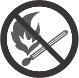
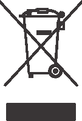
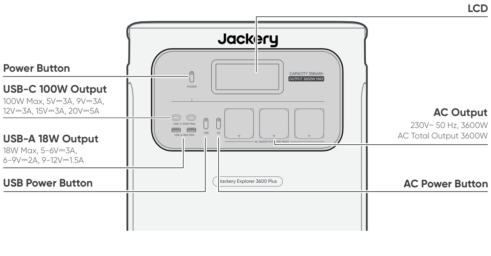
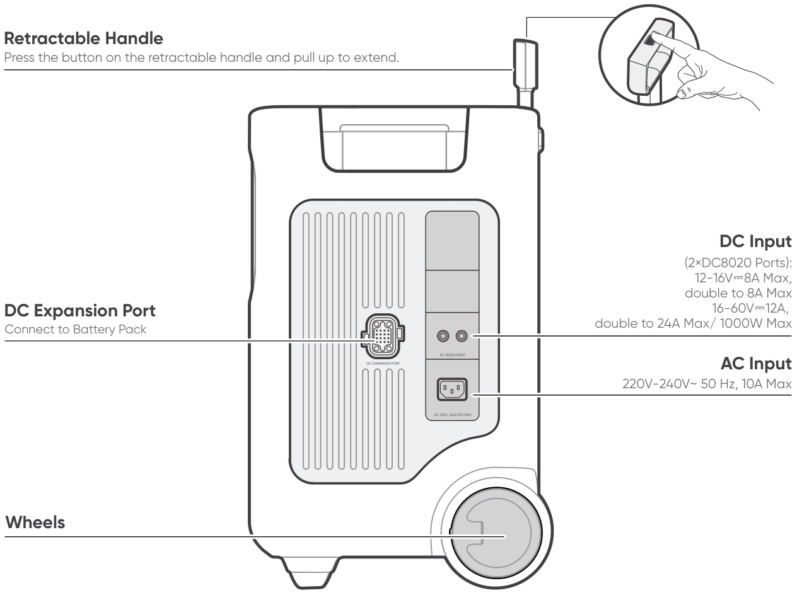
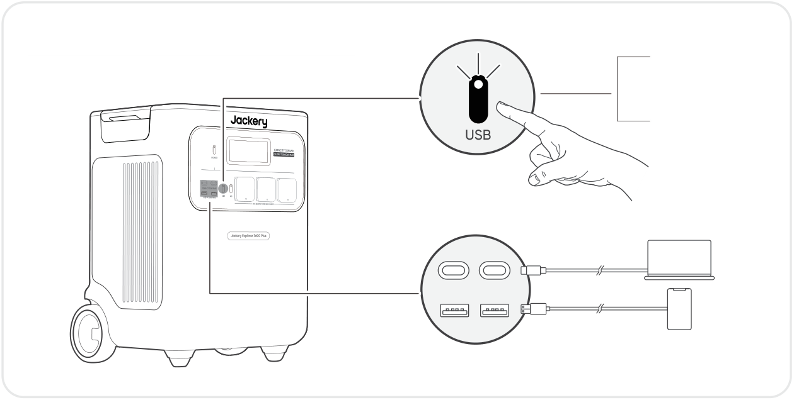
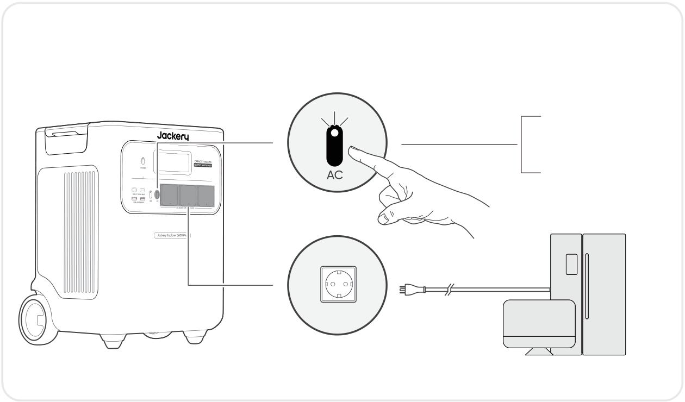
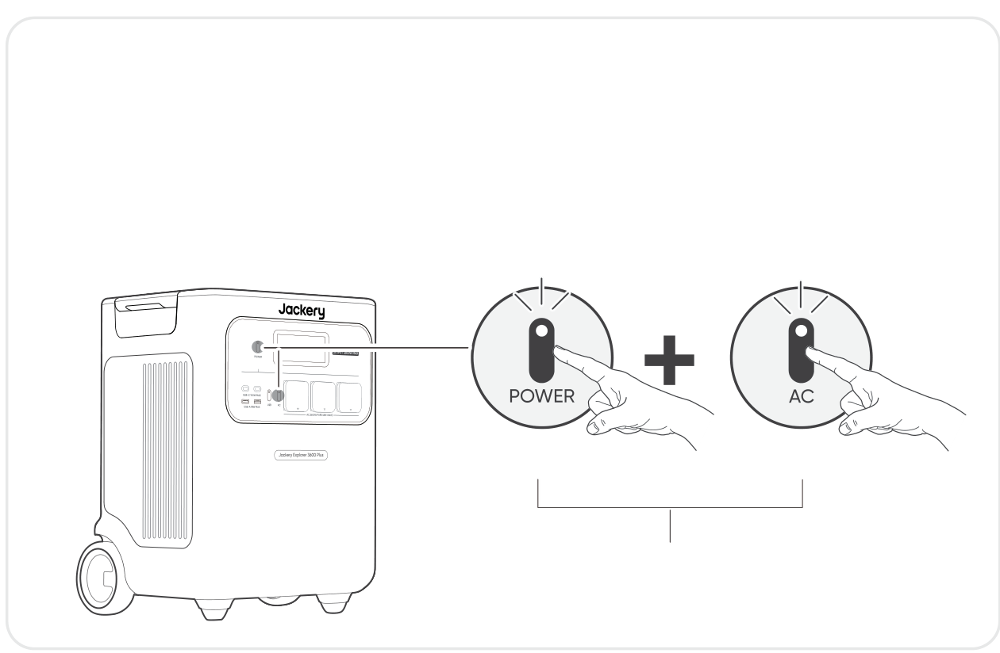
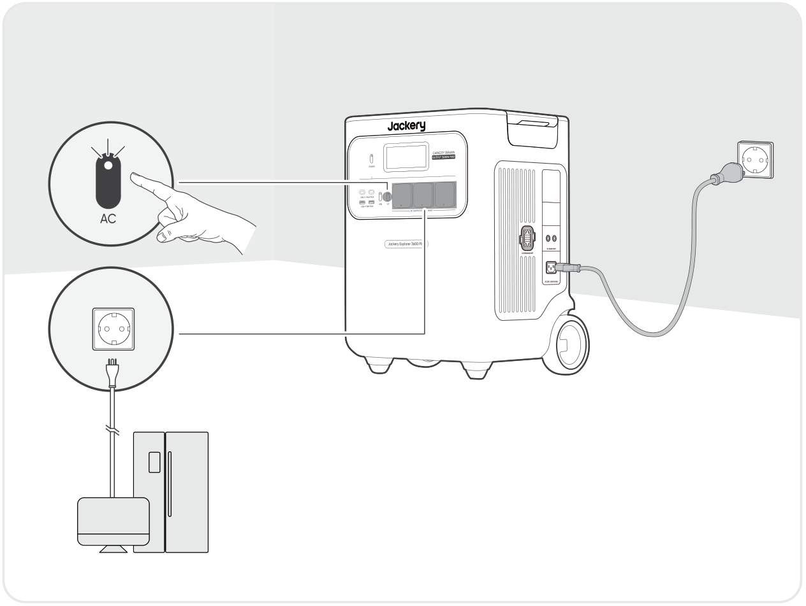
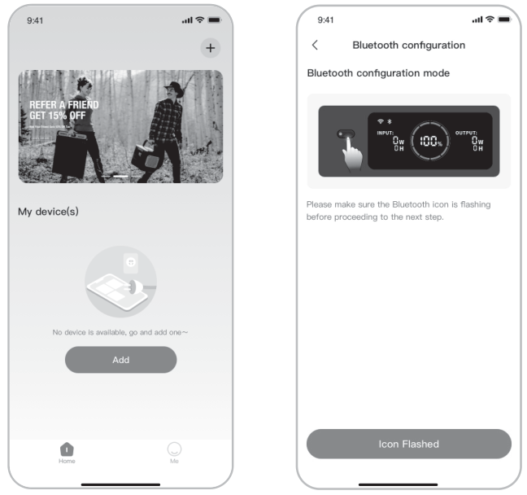

# IMPORTANT

Congratulations on your new Jackery Explorer 3600 Plus. Please read this manual carefully before using the product, particularly the relevant precautions to ensure proper use. Keep this manual in an accessible place for frequent reference.

In compliance with laws and regulations, the right of final interpretation of this document and all related documents of this product resides with the Company.

Please kindly notice that no further notifications will be given in case of any update, revision or termination.

# IMPORTANT SAFETY INFORMATION

<table class="manual-callout-table manual-callout-table"><tbody><tr><td class="manual-callout-label">WARNING</td><td class="manual-callout-body">
INSTRUCTIONS PERTAINING TO RISK OF FIRE, ELECTRIC SHOCK, OR INJURY TO PERSONS
</td></tr></tbody></table>

<strong>Always follow these basic precautions when using this product.</strong>

<ul><li>
Read all the instructions before using the product.
</li><li>
Do not allow children to play with the product. Close supervision of children is necessary when the product is used near children.
</li><li>
Risk of electric shock may occur if using accessories that are not recommended or sold by professional product manufacturers.
</li><li>
When the product is not in use, unplug the power plug from the product's socket.
</li><li>
Do not dismantle the product, as this may lead to unpredictable risks such as fire, explosion, or electric shock.
</li><li>
Do not use the product with damaged cords, plugs, or output cables, as this may cause electric shock.
</li><li>
To ensure proper air circulation, keep the product vents uncovered. The area where the product is used must have adequate airflow in a cool, dry environment to prevent overheating. -Charging in damp or poorly ventilated spaces may cause safety hazards. -Water can cause short circuits or damage to the charger, leading to safety risks.
</li><li>
Do not expose the product to fire, high temperatures, direct sunlight, or high-heat environments such as inside a parked vehicle. Such exposure may result in fire or explosion.
</li></ul>

## USER MAINTENANCE INSTRUCTIONS

During the lifecycle of energy storage products, a certain degree of capacity and energy degradation is expected. As the number of charge and discharge cycles increases and storage time extends, this degradation will gradually intensify, which is a normal phenomenon consistent with the natural aging of battery cells.

# MEANING OF SYMBOLS

<figure aria-label="Meaning of symbols" class="hb-symbol-signal-composition" data-component-id="HB-TABLE-SYMBOL-SIGNAL"><table class="hb-symbol-signal-table"><colgroup><col class="hb-symbol-signal-col-label"/><col class="hb-symbol-signal-col-meaning"/></colgroup><thead><tr><th class="hb-symbol-signal-label-heading" scope="col">Symbol</th><th class="hb-symbol-signal-meaning-heading" scope="col">Meaning</th></tr></thead><tbody><tr><td class="hb-symbol-signal-label-cell">⚠WARNING</td><td class="hb-symbol-signal-meaning-cell">Hazardous practices that may result in severe injury, death, and/or property damage.</td></tr><tr><td class="hb-symbol-signal-label-cell">⚠CAUTION</td><td class="hb-symbol-signal-meaning-cell">Hazardous practices that may result in personal injury and/or property damage.</td></tr><tr><td class="hb-symbol-signal-label-cell">⚠NOTE</td><td class="hb-symbol-signal-meaning-cell">Hazardous practices that may result in equipment damage, data loss, performance deterioration, or unanticipated results.</td></tr><tr><td class="hb-symbol-signal-label-cell">⚠TIP</td><td class="hb-symbol-signal-meaning-cell">Supplements the important information or operation tips in the text.</td></tr></tbody></table></figure>

<figure aria-label="Meaning of symbols" class="hb-symbol-pair-composition" data-component-id="HB-TABLE-SYMBOL-ICON">

<table class="hb-symbol-panel-table"><colgroup><col class="hb-symbol-col-icon"/><col class="hb-symbol-col-meaning"/></colgroup><thead><tr><th class="hb-symbol-icon-heading" scope="col">Symbol</th><th class="hb-symbol-meaning-heading" scope="col">Meaning</th></tr></thead><tbody><tr><td class="hb-symbol-icon"></td><td class="hb-symbol-meaning">Warning and Caution Symbols. Must read to alert individuals to potential hazards or risks.</td></tr><tr><td class="hb-symbol-icon"></td><td class="hb-symbol-meaning">Read the user manual before operation.</td></tr><tr><td class="hb-symbol-icon"></td><td class="hb-symbol-meaning">Do not dismantle the product.</td></tr><tr><td class="hb-symbol-icon"></td><td class="hb-symbol-meaning">Keep the product away from fire.</td></tr><tr><td class="hb-symbol-icon"></td><td class="hb-symbol-meaning">Keep away from children.</td></tr><tr><td class="hb-symbol-icon"></td><td class="hb-symbol-meaning">This symbol indicates that a lithium-ion (Li-ion) battery is inside the product and should be disposed of or recycled properly.</td></tr></tbody></table>

<table class="hb-symbol-panel-table"><colgroup><col class="hb-symbol-col-icon"/><col class="hb-symbol-col-meaning"/></colgroup><thead><tr><th class="hb-symbol-icon-heading" scope="col">Symbol</th><th class="hb-symbol-meaning-heading" scope="col">Meaning</th></tr></thead><tbody><tr><td class="hb-symbol-icon"></td><td class="hb-symbol-meaning">Batteries and accumulators must not be disposed of with household waste. As a consumer, you are legally required to dispose of all batteries and accumulators at designated collection points, regardless of whether they contain hazardous substances. Please return used batteries and accumulators to a local collection point, recycling center, or to the retailer where they were purchased. Proper disposal ensures environmentally responsible recycling and prevents potential harm to human health and the environment.</td></tr><tr><td class="hb-symbol-icon"></td><td class="hb-symbol-meaning">This symbol indicates that the product shall not be disposed of as household waste, and should be delivered to a designated collection facility for recycling. Proper disposal and recycling can help protect the environment. For more information about the disposal and recycling of this product, contact your local community, disposal service, or dealer.</td></tr></tbody></table>

</figure>

# WHAT'S IN THE BOX

<figure aria-label="What's in the box" class="hb-inbox-composition" data-card-count="3" data-component-id="HB-SPECIAL-INBOX" data-inbox-variant="three-card-responsive"><ol class="hb-inbox-grid"><li class="hb-inbox-card" data-item-number="1">

Jackery Explorer 3600 Plus

</li><li class="hb-inbox-card" data-item-number="2">

AC Charging Cable

</li><li class="hb-inbox-card" data-item-number="3">

User Manual

</li></ol>

TIP

The car charging cable is not included but is available for purchase separately on our website. For assistance, please contact Jackery customer service.

</figure>

# PRODUCT OVERVIEW

## FRONT VIEW

<figure class="hb-reference-figure" data-component-id="HB-SPECIAL-REFERENCE-FIGURE" data-reference-id="overview-front" data-source-fragment-sha256="94dd6182a6e37902060cc5a29ab2338569bdbcf558f780b9da74e07c77d5b9e1">

</figure>

## RIGHT SIDE VIEW

<figure class="hb-reference-figure" data-component-id="HB-SPECIAL-REFERENCE-FIGURE" data-reference-id="overview-right" data-source-fragment-sha256="65fecb0f7bd909368a8cb5aead612a31a988f75ca8798c8988990f32b64676b4">

</figure>

# LCD DISPLAY

<figure class="hb-reference-figure" data-component-id="HB-SPECIAL-REFERENCE-FIGURE" data-reference-id="lcd-map" data-source-fragment-sha256="c114ae1dbe4e326f1aad0ff66b61be50a0ea2d46e8e3fb56556605e9c2d8b91d">

</figure>

<figure aria-label="LCD indicators" class="hb-lcd-table-composition" data-component-id="HB-TABLE-LCD-ICON" tabindex="0"><table class="hb-lcd-icon-table"><colgroup><col class="hb-lcd-col-number"/><col class="hb-lcd-col-icon"/><col class="hb-lcd-col-name"/><col class="hb-lcd-col-description"/></colgroup><tbody><tr><td class="hb-lcd-number">1</td><td class="hb-lcd-icon"></td><td class="hb-lcd-name">Wi-Fi</td><td class="hb-lcd-description">
<strong>On:</strong> Wi-Fi connected. <strong>Blink:</strong> Ready to connect to Wi-Fi. <strong>Off:</strong> Wi-Fi disconnected.
</td></tr><tr><td class="hb-lcd-number">2</td><td class="hb-lcd-icon"></td><td class="hb-lcd-name">Bluetooth</td><td class="hb-lcd-description">
<strong>On:</strong> Bluetooth Connected. <strong>Blink:</strong> Ready to connect to Bluetooth. <strong>Off:</strong> Bluetooth disconnected.
</td></tr><tr><td class="hb-lcd-number">3</td><td class="hb-lcd-icon"></td><td class="hb-lcd-name">Quiet Charging Mode</td><td class="hb-lcd-description">
<strong>On:</strong> The noise during charging is significantly minimized, while the charging power is reduced and the charging speed slows down. <strong>Off:</strong> Quiet Charging Mode is disabled. Enable/disable this feature in the Jackery App.
</td></tr><tr><td class="hb-lcd-number" rowspan="2">4</td><td class="hb-lcd-icon"></td><td class="hb-lcd-name">Battery Saving Mode</td><td class="hb-lcd-description">
<strong>On:</strong> Limits the maximum usable battery capacity to extend battery life. <strong>Off:</strong> Battery Saving Mode is disabled. Enable/disable this feature in the Jackery App. This feature is not available when the product is connected to battery pack(s).
</td></tr><tr><td class="hb-lcd-icon"></td><td class="hb-lcd-name">Self-powered Mode</td><td class="hb-lcd-description">
Maximizes the use of solar energy and reduces reliance on grid electricity by prioritizing stored solar energy, reducing electricity costs (please enable/disable this feature in the app). The power station must be connected to both solar panels and the grid simultaneously, with load power limited by bypass power.
</td></tr><tr><td class="hb-lcd-number">5</td><td class="hb-lcd-icon"></td><td class="hb-lcd-name">Charging Plan</td><td class="hb-lcd-description">
Customizes the charging time of the Jackery Explorer 3600 Plus. Suitable for situations with fluctuating electricity prices, it allows for charging plans based on peak and off-peak electricity times, reducing electricity costs (Please set in the Jackery App).
</td></tr><tr><td class="hb-lcd-number">6</td><td class="hb-lcd-icon"></td><td class="hb-lcd-name">AC Power Indicator</td><td class="hb-lcd-description">
The AC output (pure sine wave) is on.
</td></tr><tr><td class="hb-lcd-number">7</td><td class="hb-lcd-icon"></td><td class="hb-lcd-name">Output Voltage and Frequency</td><td class="hb-lcd-description">
Displays the output voltage and frequency when the AC output is turned on.
</td></tr><tr><td class="hb-lcd-number">8</td><td class="hb-lcd-icon"></td><td class="hb-lcd-name">Input Power</td><td class="hb-lcd-description">
Displays the input power in watts.
</td></tr><tr><td class="hb-lcd-number">9</td><td class="hb-lcd-icon"></td><td class="hb-lcd-name">Remaining Charge Time</td><td class="hb-lcd-description">
Displays the remaining charging time.
</td></tr><tr><td class="hb-lcd-number">10</td><td class="hb-lcd-icon"></td><td class="hb-lcd-name">AC Wall Charging Indicator</td><td class="hb-lcd-description">
The product is charged via the AC Input using grid power.
</td></tr><tr><td class="hb-lcd-number">11</td><td class="hb-lcd-icon"></td><td class="hb-lcd-name">Car Charging Indicator</td><td class="hb-lcd-description">
The product is charged via the DC Input (DC8020) using DC 12V (car charging).
</td></tr><tr><td class="hb-lcd-number">12</td><td class="hb-lcd-icon"></td><td class="hb-lcd-name">Solar Charging Indicator</td><td class="hb-lcd-description">
The product is charged via the DC Input (DC8020) using solar panel(s).
</td></tr><tr><td class="hb-lcd-number">13</td><td class="hb-lcd-icon"></td><td class="hb-lcd-name">Battery Power Indicator</td><td class="hb-lcd-description">
When the product is being charged, the orange circle around the battery percentage will light up in sequence. When charging other devices, the orange circle will stay on.
</td></tr><tr><td class="hb-lcd-number">14</td><td class="hb-lcd-icon"></td><td class="hb-lcd-name">Low Battery Indicator</td><td class="hb-lcd-description">
<strong>On:</strong> The battery level is below 20%. <strong>Blink:</strong> The battery level is below 5%. <strong>Off:</strong> The battery level is not below 20% or the product is charging.
</td></tr><tr><td class="hb-lcd-number">15</td><td class="hb-lcd-icon"></td><td class="hb-lcd-name">Remaining Battery Percentage</td><td class="hb-lcd-description">
Displays the remaining battery percentage.
</td></tr><tr><td class="hb-lcd-number">16</td><td class="hb-lcd-icon"></td><td class="hb-lcd-name">Battery Pack Indicator and Number of Connected Batteries</td><td class="hb-lcd-description">
Displays the quantity of battery packs if any is connected.
</td></tr><tr><td class="hb-lcd-number">17</td><td class="hb-lcd-icon"></td><td class="hb-lcd-name">Fault code</td><td class="hb-lcd-description">
A product error has occurred. Please refer to the Troubleshooting section for details.
</td></tr><tr><td class="hb-lcd-number" rowspan="2">18</td><td class="hb-lcd-icon"></td><td class="hb-lcd-name">High Temperature Indicator</td><td class="hb-lcd-description">
High temperature protection is triggered. The product may stop functioning until its temperature returns to the normal operating range.
</td></tr><tr><td class="hb-lcd-icon"></td><td class="hb-lcd-name">Low Temperature Indicator</td><td class="hb-lcd-description">
Low temperature protection is triggered. The product may stop functioning until its temperature returns to the normal operating range.
</td></tr><tr><td class="hb-lcd-number">19</td><td class="hb-lcd-icon"></td><td class="hb-lcd-name">Energy Saving Mode</td><td class="hb-lcd-description">
When the AC or USB output is turned on by pressing the AC or USB power button: <strong>On:</strong> Energy Saving Mode is enabled. <strong>Off:</strong> Energy Saving Mode is disabled.
</td></tr><tr><td class="hb-lcd-number">20</td><td class="hb-lcd-icon"></td><td class="hb-lcd-name">Output Power</td><td class="hb-lcd-description">
Displays the output power in watts.
</td></tr><tr><td class="hb-lcd-number">21</td><td class="hb-lcd-icon"></td><td class="hb-lcd-name">Remaining Discharge Time</td><td class="hb-lcd-description">
Displays the remaining discharging time.
</td></tr></tbody></table></figure>

# OPERATIONS

## POWER ON/OFF

<figure class="hb-reference-figure hb-base-art-live-copy" data-component-id="HB-SPECIAL-REFERENCE-FIGURE" data-reference-id="operation-main-power" data-source-fragment-sha256="dd224ac1bcd1aca116dc44a7caaa6fd9f61e101af9958f30dec193002a9e4d2e" data-web-base-art-ref="operation-main-power" data-web-presentation-mode="base-art-live-copy">

On Press onceOff Press and hold for 3sDefault standby time: 2 hours The product will automatically shut down after 2 hours of inactivity, with no charging or discharging. *The standby time can be set in the Jackery App.When Energy Saving Mode is enabled, the product will automatically shut down after 12 hours if the AC or USB power button is ON but the product is neither charging nor discharging.

</figure>

## USB OUTPUT ON/OFF

<figure class="hb-operation-figure hb-operation-layout-status-right hb-base-art-live-copy" data-component-id="HB-SPECIAL-OPERATION" data-operation-id="dc-usb-output" data-source-fragment-sha256="88ccd2533cfaf9ce51cef89fc85e47fee72084e0494eb03c081351dcd58c2949" data-web-base-art-ref="operation/dc_usb_output" data-web-presentation-mode="base-art-live-copy" data-web-replace-key="operation.dc-usb-output">

<strong>Prerequisite:</strong> The product is turned on.

<strong>On</strong>

Press once

<strong>Off</strong>

Press once

</figure>

<table class="manual-callout-table manual-callout-table"><tbody><tr><td class="manual-callout-label">CAUTION</td><td class="manual-callout-body"><ul><li>
USB-C 100W MAX is a USB-PD Power Source 3 (PS3) high-power output port. If the connected user device or accessory does not meet safety requirements, there may be a fire risk. Before using these ports, ensure that the connected device or accessory has fire safety protection.
</li><li>
Only connect the Jackery Explorer 3600 Plus to devices or accessories that comply with clauses 6.3, 6.4, and 6.5 of IEC/EN/UL 62368-1 (or other equivalent standards).
</li><li>
To obtain maximum output power, use the official Jackery USB-C to USB-C 5A cable (20V DC/5A, 100W).
</li></ul></td></tr></tbody></table>

## AC OUTPUT ON/OFF

<figure class="hb-operation-figure hb-operation-layout-status-right hb-base-art-live-copy" data-component-id="HB-SPECIAL-OPERATION" data-operation-id="ac-output" data-source-fragment-sha256="3bf1a3a4cea3b78c78ab894ff115cffde4aa026824027332b7a3c3ae2953975a" data-web-base-art-ref="operation/ac_output" data-web-presentation-mode="base-art-live-copy" data-web-replace-key="operation.ac-output">

<strong>Prerequisite:</strong> The product is turned on.

<strong>On</strong>

Press once

<strong>Off</strong>

Press once

</figure>

## ENERGY SAVING MODE

<figure class="hb-reference-figure hb-base-art-live-copy" data-component-id="HB-SPECIAL-REFERENCE-FIGURE" data-reference-id="operation-energy-saving" data-source-fragment-sha256="4888e4c371a6dd7b5de4d55f0a7f9934d909c05c01b1b3eaffdeff8e8048a24a" data-web-base-art-ref="operation-energy-saving" data-web-presentation-mode="base-art-live-copy">

To prevent unnecessary battery consumption from forgetting to turn off the output, the product enables Energy Saving Mode by default. If no device is connected or the connected device's power consumption is below a certain threshold (25W AC output or 2W USB output) for 12 hours, the product will automatically turn off the outputs. To disable the energy saving mode, press and hold both the AC power button and POWER button for more than 3 seconds. The product will not automatically turn off the AC or DC output.Main power buttonAC power buttonOn/Off: Press and hold for 3s

</figure>

<table class="manual-callout-table manual-callout-table"><tbody><tr><td class="manual-callout-label">NOTE</td><td class="manual-callout-body">
Energy Saving Mode resumes previous state after power-on. Manual switching is required for mode changes.
</td></tr></tbody></table>

## LCD SCREEN

<figure aria-label="LCD screen" class="hb-lcd-mode-composition" data-component-id="HB-TABLE-LCD-MODE">

<table class="hb-lcd-mode-table"><colgroup><col class="hb-lcd-mode-col-state"/><col class="hb-lcd-mode-col-action"/><col class="hb-lcd-mode-col-copy"/></colgroup><tbody><tr><td class="hb-lcd-mode-state" rowspan="3">Shortly On</td><td class="hb-lcd-mode-action">Turn on</td><td class="hb-lcd-mode-copy">Press the POWER Button or when the product is charging.</td></tr><tr><td class="hb-lcd-mode-action">Turn off</td><td class="hb-lcd-mode-copy">Press the POWER Button.</td></tr><tr><td class="hb-lcd-mode-action">Auto-off</td><td class="hb-lcd-mode-copy">The LCD turns off automatically and enters sleep mode after 2 minutes of inactivity.</td></tr><tr><td class="hb-lcd-mode-state" rowspan="3">Steady On (in charging or discharging state)</td><td class="hb-lcd-mode-action">Turn on</td><td class="hb-lcd-mode-copy">Press the POWER button twice when the product is powered on.</td></tr><tr><td class="hb-lcd-mode-action">Turn off</td><td class="hb-lcd-mode-copy">Press the POWER button.</td></tr><tr><td class="hb-lcd-mode-action">Auto-off</td><td class="hb-lcd-mode-copy">The LCD turns off automatically after 2 hours of inactivity.</td></tr></tbody></table>
</figure>

You can also set the screen display mode in the Jackery App.

## KEY COMBINATION

<figure aria-label="Buttons / Operation / Function" class="hb-key-combination-composition" data-component-id="HB-TABLE-KEY-COMBINATIONS" tabindex="0"><table class="hb-key-combination-table"><colgroup><col class="hb-key-col-buttons"/><col class="hb-key-col-operation"/><col class="hb-key-col-function"/></colgroup><thead><tr><th class="hb-key-buttons" scope="col">Buttons</th><th class="hb-key-operation" scope="col">Operation</th><th class="hb-key-function" scope="col">Function</th></tr></thead><tbody><tr><td class="hb-key-buttons">POWER button + USB power button</td><td class="hb-key-operation">Press and hold both for 3s</td><td class="hb-key-function">Reset Wi-Fi and Bluetooth</td></tr><tr><td class="hb-key-buttons">POWER button + AC power button</td><td class="hb-key-operation">Press and hold both for 3s</td><td class="hb-key-function">Turn on/off the Energy Saving Mode</td></tr><tr><td class="hb-key-buttons">USB power button + AC power button</td><td class="hb-key-operation">Press and hold both for 1s</td><td class="hb-key-function">Turn on/off Wi-Fi and Bluetooth</td></tr></tbody></table></figure>

# UNINTERRUPTIBLE POWER SUPPLY (UPS)

Connect the product to a wall outlet with the AC charging cable, then press the AC power button and power your appliances at the same time.

<figure class="hb-reference-figure hb-base-art-live-copy" data-component-id="HB-SPECIAL-REFERENCE-FIGURE" data-reference-id="ups" data-source-fragment-sha256="a9ce18ad4d016279f3c92520ad36777b71930e072254c77b256e88c3b476ca55" data-web-base-art-ref="ups" data-web-presentation-mode="base-art-live-copy">

An uninterruptible power supply (UPS) is a type of continual power system that provides automated backup electric power to a load when the mains grid power fails. In the event of a sudden loss of grid power, the Explorer 3600 Plus will automatically switch to stored power within 10 ms to keep your appliances running.

</figure>

In UPS mode, the unit's peak output reaches 10A before power outages. As simultaneous charging/discharging is enabled in Bypass Mode, the actual output power is lower than the rated output power in this mode but returns to rated output power during outages.

<table class="manual-callout-table manual-callout-table"><tbody><tr><td class="manual-callout-label">CAUTION</td><td class="manual-callout-body"><ul><li>
This product does not support 0 ms switching. Do not connect it to equipment that requires a 0 ms switching power supply, such as data servers or workstations.
</li><li>
Before use, please test compatibility with your device multiple times.
</li><li>
Do not connect loads exceeding the maximum output power of the product. Otherwise, overload protection will be triggered.
</li></ul></td></tr></tbody></table>

# CONNECTIONS

<h2 class="hb-subbar" id="connect-to-battery-packs-sold-separately">CONNECT TO BATTERY PACK(S) SOLD SEPARATELY</h2>

This product can support up to 5 battery packs to meet the need for large power capacity. For details on how to use it, please refer to the Jackery Battery Pack 3600 User Manual.

<figure class="hb-reference-figure hb-base-art-live-copy" data-component-id="HB-SPECIAL-REFERENCE-FIGURE" data-reference-id="battery" data-source-fragment-sha256="bb620d4cb832129065db00349fb77156f56981df507c157bb3b2e30b951631a4" data-web-base-art-ref="battery" data-web-presentation-mode="base-art-live-copy">

At least 200 mmAt least 200 mm

</figure>

<table class="manual-callout-table manual-callout-table"><tbody><tr><td class="manual-callout-label">CAUTION</td><td class="manual-callout-body"><ul><li>
Ensure all products are powered off before connecting the Explorer 3600 Plus to the Jackery Battery Pack 3600.
</li><li>
To ensure proper operation of the product, make sure the air intake and exhaust vents on both sides are unobstructed. Leave at least 200 mm of space in between the vents and any objects to allow for proper heat dissipation.
</li></ul></td></tr></tbody></table>

<figure class="hb-reference-figure hb-base-art-live-copy" data-component-id="HB-SPECIAL-REFERENCE-FIGURE" data-reference-id="battery-accessories" data-source-fragment-sha256="298b4f4362a9e6f72586c377950fa8291e93c1d5b278275066505eecf733789e" data-web-base-art-ref="battery-accessories" data-web-presentation-mode="base-art-live-copy">

Jackery Battery Pack 3600Expansion CableUser ManualSold separately

</figure>

# CHARGING

<strong>Green energy first:</strong> We advocate using the green energy first. This product supports two modes of charging at the same time: solar charging and AC wall charging. When AC wall charging and solar charging are turned on at the same time, the product will give priority to solar charging and both methods will be used to charge the battery at the maximum permissible power.

Fully charge the product before its first use.

<table class="manual-callout-table manual-callout-table"><tbody><tr><td class="manual-callout-label">NOTE</td><td class="manual-callout-body"><ul><li>
The recommended charging temperature for the product ranges from -20°C to 45°C, and the discharging temperature ranges from -20°C to 45°C. Operating the product beyond this temperature range may restrict its charging and discharging capabilities, or even prevent it from charging or discharging.
</li><li>
The charging power and capacity of the product may vary due to temperature fluctuations.
</li></ul></td></tr></tbody></table>

## CHARGING VIA AC WALL OUTLET

<figure class="hb-reference-figure hb-base-art-live-copy" data-component-id="HB-SPECIAL-REFERENCE-FIGURE" data-reference-id="charging-ac" data-source-fragment-sha256="70ad7fc8591b1b2db2d604d673fa48f417565cfd5e9062e8d3a8270f0d0febc6" data-web-base-art-ref="charging-ac" data-web-presentation-mode="base-art-live-copy">

Connect the AC charging cable to the AC input port of the product and a wall outlet.

</figure>

<table class="manual-callout-table manual-callout-table"><tbody><tr><td class="manual-callout-label">CAUTION</td><td class="manual-callout-body">
Make sure the AC charging cable is fully and securely plugged into the AC input port. An incomplete connection may cause unstable current, overheating, poor contact, or device malfunction.
</td></tr></tbody></table>

<h2 class="hb-subbar" id="charging-via-solar-panels-sold-separately">CHARGING VIA SOLAR PANELS SOLD SEPARATELY</h2>

Jackery Explorer 3600 Plus has two DC8020 input ports and is compatible with the Jackery solar panels. If one DC8020 input port needs to connect two solar panels simultaneously, please refer to the figure below for charging through the solar panel connector (sold separately, not included as standard).

<figure class="hb-reference-figure hb-base-art-live-copy" data-component-id="HB-SPECIAL-REFERENCE-FIGURE" data-reference-id="charging-solar" data-source-fragment-sha256="b19d8622a4150edbc36830bc842910b6f17d60391198e798de99655bb462bf8b" data-web-base-art-ref="charging-solar" data-web-presentation-mode="base-art-live-copy">

SolarSaga 200 × 4

</figure>

<table class="manual-callout-table manual-callout-table"><tbody><tr><td class="manual-callout-label">CAUTION</td><td class="manual-callout-body">
One DC8020 input port can be connected to at most two solar panels.
</td></tr></tbody></table>

<table class="manual-callout-table manual-callout-table"><tbody><tr><td class="manual-callout-label">CAUTION</td><td class="manual-callout-body"><ul><li>
Ensure that the input voltage for both DC input ports is the same. Failure to do so may damage the product. For example:
</li><li>
It is recommended to use the same model of Jackery solar panels and the same number of panels when connecting solar panels to both DC8020 Input ports.
</li><li>
Do not charge the product using both a car charger and a solar panel simultaneously. Doing so may blow the car fuse or result in charging failure.
</li></ul></td></tr></tbody></table>

It is recommended to use the Jackery solar panel to charge the product. Ensure that the open-circuit voltage (Voc) of the solar panel is within the DC input range (16V-60V) of the Explorer 3600 Plus. Jackery is not responsible for any damage or loss resulting from the use of third-party solar panels.

<h2 class="hb-subbar" id="charging-via-a-car-charger-sold-separately">CHARGING VIA A CAR CHARGER SOLD SEPARATELY</h2>

This product can be charged using a 12V car charger. Ensure that the car charger and the 12V car power outlet (car cigarette lighter) provide a good connection.

<figure class="hb-reference-figure hb-base-art-live-copy" data-component-id="HB-SPECIAL-REFERENCE-FIGURE" data-reference-id="charging-car" data-source-fragment-sha256="6d6ad374f156997aee0efae67fb16ae91d1c29fb94238f736ee5a40d705e970e" data-web-base-art-ref="charging-car" data-web-presentation-mode="base-art-live-copy">

Vehicle*The car charging cable is sold separately.

</figure>

<table class="manual-callout-table manual-callout-table"><tbody><tr><td class="manual-callout-label">CAUTION</td><td class="manual-callout-body"><ul><li>
Please start the vehicle before charging your power station.
</li><li>
If the vehicle is running on bumpy roads, it is forbidden to use the car charger in case it causes non-standard operation. The Company will not be responsible for any loss caused by non-standard operation.
</li><li>
Vehicle charging is only applicable to vehicles with 12V DC, not 24V DC. Please do not charge this product in 24V vehicle to avoid personal injury and property loss.
</li></ul></td></tr></tbody></table>

# STORAGE

Store the product in a dry clean place with proper ventilation. Storage temperature and humidity:
<ul class="hb-source-storage-copy" style="margin:0"><li class="hb-source-storage-item" style="margin:0">
1 month: -20°C to 45°C (0-60%RH)
</li><li class="hb-source-storage-item" style="margin:0">
3 months: 0°C to 45°C (0-60%RH)
</li><li class="hb-source-storage-item" style="margin:0">
12 months: 0°C to 25°C (0-60%RH)
</li></ul>
If this product is stored for a long period of time (3 months - 6 months) with the power depleted, it may become unchargeable. To prevent this and maintain battery health, it is recommended to check and recharge the product every three months and perform a full charge and discharge cycle at least once every 6 to 12 months.

# TROUBLESHOOTING

If any of the following fault codes appear, follow the listed corrective actions to resolve the issue. If fault persists, please contact Jackery Customer Support.

<figure aria-label="Error Code / Corrective Measures" class="hb-troubleshooting-composition" data-component-id="HB-TABLE-TROUBLESHOOTING" tabindex="0"><table class="hb-troubleshooting-table"><colgroup><col class="hb-troubleshooting-col-code"/><col class="hb-troubleshooting-col-measures"/></colgroup><thead><tr><th class="hb-troubleshooting-code" scope="col">Error Code</th><th class="hb-troubleshooting-measures" scope="col">Corrective Measures</th></tr></thead><tbody><tr><td class="hb-troubleshooting-code">F0</td><td class="hb-troubleshooting-measures">Restart the product.</td></tr><tr><td class="hb-troubleshooting-code">F1</td><td class="hb-troubleshooting-measures">Restart the product.</td></tr><tr><td class="hb-troubleshooting-code">F2</td><td class="hb-troubleshooting-measures">Restart the product.</td></tr><tr><td class="hb-troubleshooting-code">F3</td><td class="hb-troubleshooting-measures">Restart the product.</td></tr><tr><td class="hb-troubleshooting-code">F4</td><td class="hb-troubleshooting-measures">Connect the product to loads to discharge its battery until the fault disappears.</td></tr><tr><td class="hb-troubleshooting-code">F5</td><td class="hb-troubleshooting-measures">Charge the product via solar panels or AC wall outlet until the fault disappears.</td></tr><tr><td class="hb-troubleshooting-code">F6</td><td class="hb-troubleshooting-measures">1. Wait for the grid to normalize before charging the product via AC wall outlet. 2. Check whether the air intake and exhaust vents are blocked; ensure 200 mm clearance on both side of the product. 3. Place the product in a location that is not exposed to direct sunlight or high environment temperatures. 4. Disconnect all loads from the product. Keep the product idle and wait until the fault disappears. 5. Restart the product.</td></tr><tr><td class="hb-troubleshooting-code">F7</td><td class="hb-troubleshooting-measures">1. Remove all DC inputs from the product. 2. Check the open-circuit voltage (Voc) of the connected solar panels. The product allows a maximum DC input voltage of 60V. 3. Restart the product and keep it idle. Wait until the fault disappears.</td></tr><tr><td class="hb-troubleshooting-code">F8</td><td class="hb-troubleshooting-measures">Contact Jackery Customer Support</td></tr><tr><td class="hb-troubleshooting-code">F9</td><td class="hb-troubleshooting-measures">Remove the load connected to the USB ports of the product. Wait until the fault disappears.</td></tr><tr><td class="hb-troubleshooting-code">FA</td><td class="hb-troubleshooting-measures">1. Turn off the AC output of both units. 2. Press the AC power button on each unit again within 1 minute.</td></tr><tr><td class="hb-troubleshooting-code">FC</td><td class="hb-troubleshooting-measures">1. Restart the battery packs and the Jackery Explorer 3600 Plus respectively. 2. If the fault persists, disconnect the battery pack from the Jackery Explorer 3600 Plus and connect them again.</td></tr></tbody></table></figure>

# SPECIFICATIONS

<h2 aria-level="2" role="heading">GENERAL INFO</h2><figure aria-label="GENERAL INFO" class="hb-spec-table-composition"><table class="manual-table manual-spec-table hb-spec-table"><colgroup><col class="hb-spec-col-label"/><col class="hb-spec-col-value"/></colgroup><tbody><tr><th class="manual-spec-label hb-spec-label" scope="row">Product Name</th><td class="manual-spec-value hb-spec-value">Jackery Explorer 3600 Plus</td></tr><tr><th class="manual-spec-label hb-spec-label" scope="row">Model No.</th><td class="manual-spec-value hb-spec-value">JE-3600A</td></tr><tr><th class="manual-spec-label hb-spec-label" scope="row">Capacity</th><td class="manual-spec-value hb-spec-value">80Ah / 44.8V DC (3584 Wh)</td></tr><tr><th class="manual-spec-label hb-spec-label" scope="row">Cell Chemistry</th><td class="manual-spec-value hb-spec-value">LiFePO₄</td></tr><tr><th class="manual-spec-label hb-spec-label" scope="row">Weight</th><td class="manual-spec-value hb-spec-value">About 35 kg</td></tr><tr><th class="manual-spec-label hb-spec-label" scope="row">Dimensions</th><td class="manual-spec-value hb-spec-value">38.5×30.9×49.1 cm</td></tr><tr><th class="manual-spec-label hb-spec-label" scope="row">Cycle Life</th><td class="manual-spec-value hb-spec-value">6000 cycles to 70%+ capacity</td></tr><tr><th class="manual-spec-label hb-spec-label" scope="row">IEC code</th><td class="manual-spec-value hb-spec-value">IFpR41/136[14S4P]M/-20+40/90</td></tr></tbody></table></figure><h2 aria-level="2" role="heading">INPUT PORTS</h2><figure aria-label="INPUT PORTS" class="hb-spec-table-composition"><table class="manual-table manual-spec-table hb-spec-table"><colgroup><col class="hb-spec-col-label"/><col class="hb-spec-col-value"/></colgroup><tbody><tr><th class="manual-spec-label hb-spec-label" scope="row">1 × AC Input / Charge Mode</th><td class="manual-spec-value hb-spec-value">Charge Mode : 220-240V~ 50Hz, 10A Max</td></tr><tr><th class="manual-spec-label hb-spec-label" scope="row">1 × AC Input / Bypass Mode①</th><td class="manual-spec-value hb-spec-value">Bypass Mode① : 220-240V~ 50Hz, 10A Max</td></tr><tr><th class="manual-spec-label hb-spec-label" scope="row">2 × DC8020 Ports / Car</th><td class="manual-spec-value hb-spec-value">12-16V⎓8A Max, Double to 8A Max</td></tr><tr><th class="manual-spec-label hb-spec-label" scope="row">2 × DC8020 Ports / PV</th><td class="manual-spec-value hb-spec-value">16-60V⎓12A, Double to 24A Max / 1000W Max</td></tr><tr><th class="manual-spec-label hb-spec-label" scope="row">1 × DC Expansion Port</th><td class="manual-spec-value hb-spec-value">36.4V-50.4V⎓100A Max</td></tr></tbody></table></figure><h2 aria-level="2" role="heading">OUTPUT PORTS</h2><figure aria-label="OUTPUT PORTS" class="hb-spec-table-composition"><table class="manual-table manual-spec-table hb-spec-table"><colgroup><col class="hb-spec-col-label"/><col class="hb-spec-col-value"/></colgroup><tbody><tr><th class="manual-spec-label hb-spec-label" scope="row">3 × AC Output</th><td class="manual-spec-value hb-spec-value">230V~ 50Hz, 3600W</td></tr><tr><th class="manual-spec-label hb-spec-label" scope="row">AC Total Output②</th><td class="manual-spec-value hb-spec-value">3600W Rated, 7200W Surge peak</td></tr><tr><th class="manual-spec-label hb-spec-label" scope="row">AC Output in Bypass Mode①</th><td class="manual-spec-value hb-spec-value">220-240V~ 50Hz, 10A Max</td></tr><tr><th class="manual-spec-label hb-spec-label" scope="row">2 × USB-C 100W Output</th><td class="manual-spec-value hb-spec-value">100W Max, 5V⎓3A, 9V⎓3A, 12V⎓3A, 15V⎓3A, 20V⎓5A</td></tr><tr><th class="manual-spec-label hb-spec-label" scope="row">2 × USB-A 18W Output</th><td class="manual-spec-value hb-spec-value">18W Max, 5-6V⎓3A, 6-9V⎓2A, 9-12V⎓1.5A</td></tr><tr><th class="manual-spec-label hb-spec-label" scope="row">1 × DC Expansion Port</th><td class="manual-spec-value hb-spec-value">36.4V-50.4V⎓60A Max</td></tr></tbody></table></figure><h2 aria-level="2" role="heading">ENVIRONMENTAL OPERATING TEMPERATURE</h2><figure aria-label="ENVIRONMENTAL OPERATING TEMPERATURE" class="hb-spec-table-composition"><table class="manual-table manual-spec-table hb-spec-table"><colgroup><col class="hb-spec-col-label"/><col class="hb-spec-col-value"/></colgroup><tbody><tr><th class="manual-spec-label hb-spec-label" scope="row">Charge Temperature</th><td class="manual-spec-value hb-spec-value">-20°C to 45°C</td></tr><tr><th class="manual-spec-label hb-spec-label" scope="row">Discharge Temperature</th><td class="manual-spec-value hb-spec-value">-20°C to 45°C</td></tr></tbody></table></figure>

※ USB Type-C® and USB-C® are registered trademarks of USB Implementers Forum.

① The product can charge the battery from the AC wall outlet while delivering power through the AC output ports.

② Indicates that two or more AC output ports work together.

# WARRANTY

<figure aria-label="WARRANTY" class="hb-warranty-intro-composition" data-component-id="HB-WARRANTY-LEAD">

<strong>We only provide our warranty to customers who purchase from the official Jackery website, Jackery-branded third-party platforms, or local authorized dealers.</strong>

*Warranty period and details may vary according to local laws, regulations, and authorized dealers.

</figure>

## Limited Warranty

<figure aria-label="Limited Warranty" class="hb-warranty-card" data-component-id="HB-WARRANTY-SECTION" data-warranty-card-index="1">
Jackery warrants to the original consumer purchaser that the Jackery product will be free from defects in workmanship and material under normal consumer use during the applicable warranty period identified in the 'Warranty Period' section below, subject to the exclusions set forth below. This warranty statement sets forth Jackery's total and exclusive warranty obligation. We will not assume, nor authorize any person to assume for us, any other liability in connection with the sale of our products.
</figure>

## Warranty Period

<figure aria-label="Warranty Period" class="hb-warranty-period-card" data-component-id="HB-WARRANTY-YEARS">

3
<strong class="hb-warranty-years-unit">YEARS</strong><strong class="hb-warranty-period-label">Standard Warranty</strong>

The standard warranty period for Jackery Explorer 3600 Plus is 36 months. In each case, the warranty period is measured starting on the date of purchase by the original consumer purchaser. The sales receipt from the first consumer purchase, or other reasonable documentary proof, is required in order to establish the start date of the warranty period.

2
<strong class="hb-warranty-years-unit">YEARS</strong><strong class="hb-warranty-period-label">Extended Warranty</strong>

To activate the Warranty Extension, you must register your product online or contact our customer service team at hello.eu@jackery.com to extend the standard warranty runtime.

</figure>

## Exchange

<figure aria-label="Exchange" class="hb-warranty-card" data-component-id="HB-WARRANTY-SECTION" data-warranty-card-index="2">
Jackery will replace (at Jackery's expense) any Jackery product that fails to operate during the applicable warranty period due to a defect in workmanship or material. A replacement product assumes the remaining warranty of the original product.
</figure>

## Limited to Original Consumer Buyer

<figure aria-label="Limited to Original Consumer Buyer" class="hb-warranty-card" data-component-id="HB-WARRANTY-SECTION" data-warranty-card-index="3">
The warranty on Jackery's product is limited to the original consumer purchaser and is not transferable to any subsequent owner.
</figure>

## Exclusions

<figure aria-label="Exclusions" class="hb-warranty-card" data-component-id="HB-WARRANTY-SECTION" data-warranty-card-index="4">
Jackery's warranty does not apply to:
<ul><li>Misused, abused, modified, damaged by accident, or used for anything other than normal consumer use as authorized in Jackery's current product literature.</li><li>Attempted repair by anyone other than an authorized facility.</li><li>Any product purchased through an online auction house.</li><li>Jackery's warranty does not apply to the battery cell unless the battery cell is fully charged by you within seven days after you purchase the product and at least once every 6 months thereafter.</li></ul></figure>

## Interpretation Rights

<figure aria-label="Interpretation Rights" class="hb-warranty-card" data-component-id="HB-WARRANTY-SECTION" data-warranty-card-index="5">
Jackery reserves the right to final interpretation of the above customers' after-sales policy.
</figure>

# APP SETUP

## 1. Download the App and log in

<figure aria-label="Download the App and log in" class="hb-app-download-composition" data-component-id="HB-SPECIAL-APP">

Search for "Jackery" in Google Play or App Store to install the App. After that, you can register and log in.

Alternatively, scan the QR code below to download and install the App.

</figure>

## 2. Add device

2.1 Click the button + to add your device;

2.2 Press the <strong>POWER</strong> button on the device to turn on, the Wi-Fi and Bluetooth icons on the device flash to indicate that the device has entered the network configuring mode, tap the “<strong>Icon Flashed</strong>” button and allow the App to connect to nearby devices and open Bluetooth permissions.

<figure class="hb-app-add-device-composition hb-has-reference-captions" data-component-id="HB-SPECIAL-APP" data-reference-id="app-add-device" data-step-captions="live">

<figcaption class="hb-reference-caption-grid" data-caption-count="2" data-caption-layout="equal" style="--hb-caption-count:2;width:min(100%,44rem)">2.12.2</figcaption>
POWER ButtonUSB Power ButtonAC Button
</figure>

<table class="manual-callout-table manual-callout-table"><tbody><tr><td class="manual-callout-label">NOTE</td><td class="manual-callout-body">
After the device is turned on and not connected to the App within 2 hours, it will automatically turn off Wi-Fi and Bluetooth. Now it is required to press and hold USB power button and AC power button to turn on Wi-Fi and Bluetooth again.
</td></tr></tbody></table>

2.3 After tapping the searched device icon, the App automatically connects the device via Bluetooth.

<table class="manual-callout-table manual-callout-table"><tbody><tr><td class="manual-callout-label">NOTE</td><td class="manual-callout-body">
If "the device has been bound" is prompted during the binding process, the following two ways can be used for connection:
<ul><li>
The device owner will share this device with other users through the App.
</li><li>
Press and hold the POWER button and USB power button for 3 seconds to reset the device, and then re-bind the device.
</li></ul></td></tr></tbody></table>

2.4 After the device is successfully connected, enter your Wi-Fi password and tap the OK button.

<table class="manual-callout-table manual-callout-table"><tbody><tr><td class="manual-callout-label">NOTE</td><td class="manual-callout-body">
Please select a Wi-Fi network in 2.4GHz band. The device does not support a Wi-Fi network in 5GHz band.
</td></tr></tbody></table>

2.5 After the device is successfully added on the App, the Wi-Fi icon on the device will be always on.

<figure class="hb-reference-figure hb-has-reference-captions" data-component-id="HB-SPECIAL-REFERENCE-FIGURE" data-reference-id="app-result" data-source-fragment-sha256="804cd6df3f5ad5b10c0fd348c344692a3b8d83a186953c5c61d2356905ab9fe1">

<figcaption class="hb-reference-caption-grid" data-caption-count="3" data-caption-layout="equal" style="--hb-caption-count:3">2.32.42.5</figcaption></figure>

The above screenshots are for reference only.

<table class="manual-callout-table manual-callout-table"><tbody><tr><td class="manual-callout-label">CAUTION</td><td class="manual-callout-body">
The Jackery app can connect to only one power station via Bluetooth at a time. Returning to the device list automatically disconnects Bluetooth. Tap the power station in the list again to reconnect automatically.
</td></tr></tbody></table>

## 3. Unbind the device

Click the Settings icon in the upper right corner of the main interface of the device to enter the settings page, and click the Unbind button at the bottom of the page to unbind the device.

## 4. Notes

### 4.1 To turn on Wi-Fi & Bluetooth:

<ul><li>
Wi-Fi and Bluetooth are automatically turned on after the device is on, and the Wi-Fi and Bluetooth icons on the screen light up.
</li><li>
Hold the USB power button and the AC power button at the same time until the Wi-Fi &amp; Bluetooth icons on the screen light up.
</li></ul>

### 4.2 To turn off Wi-Fi & Bluetooth:

<ul><li>
Hold the USB power button and AC power button at the same time until the Wi-Fi &amp; Bluetooth icons on the screen are off.
</li><li>
Wi-Fi and Bluetooth will be automatically turned off if no device is connected within 2 hours.
</li></ul>

### 4.3 To reset Wi-Fi & Bluetooth:

Hold the POWER button and USB power button at the same time for 3 seconds to reset Wi-Fi &amp; Bluetooth to factory settings and reboot the system. The connected App account will be unbound.

# EU Regulations

<figure class="hb-reference-figure" data-component-id="HB-SPECIAL-REFERENCE-FIGURE" data-reference-id="ce-mark" data-source-fragment-sha256="1df6a01729c713629a81c609bdc4e899e1708415fb18e7bd6de11adde3ac0c01">

</figure>

## RED Declaration of Conformity

Shenzhen Hello Tech Energy Co., Ltd. hereby declares that this: Jackery Explorer 3600 Plus with Bluetooth and Wi-Fi JE-3600A is in compliance with the essential requirements and other relevant provisions of the RED Directive 2014/53/EU,The full text of the EU declaration of conformity is available at the following internet address: https://de.jackery.com/pages/user-guides

<strong>MANUFACTURER: SHENZHEN HELLO TECH ENERGY CO., LTD.</strong>

Address: F2-3, Bldg. 7, Jiaanda Science and technology industrial park factory, the east side of Huafan Road, Tongsheng Community, Dalang Street, Longhua District, Shenzhen, Guangdong, China

sales@hello-tech.com +86 400 668 9293 www.hello-tech.com

<figure class="hb-reference-figure" data-component-id="HB-SPECIAL-REFERENCE-FIGURE" data-reference-id="contact-qr" data-source-fragment-sha256="f0060c555e50182eced2bb7ccc1fd97befd5804efd6676464f85bc2f37acc62f">

</figure>
