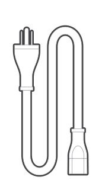
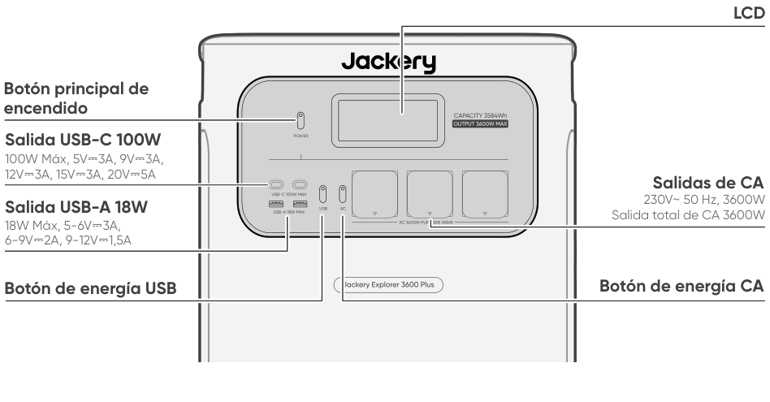
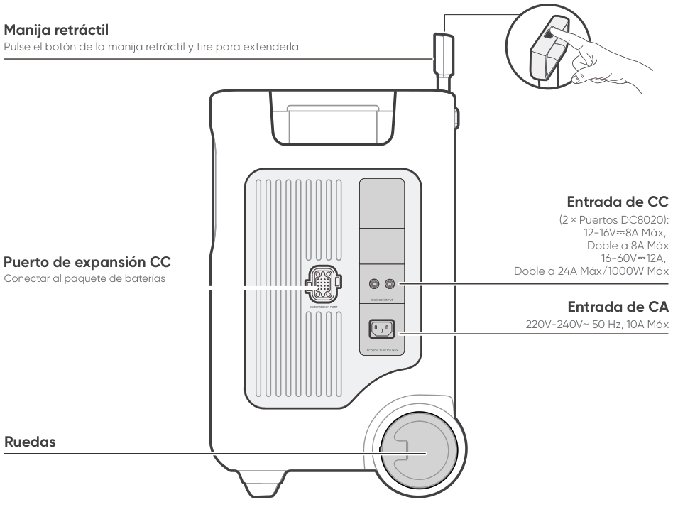
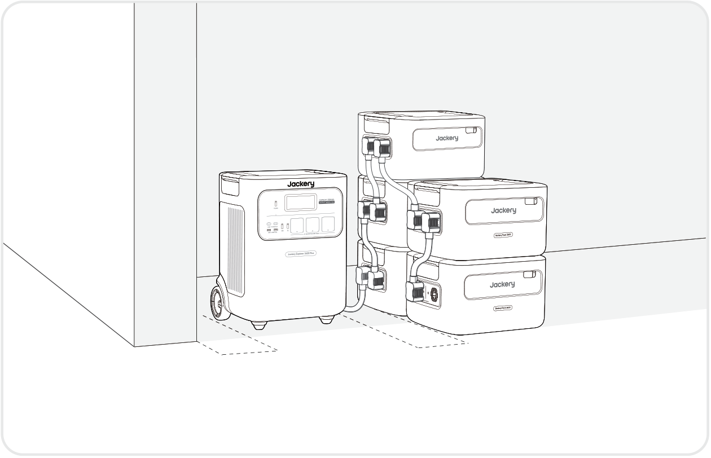
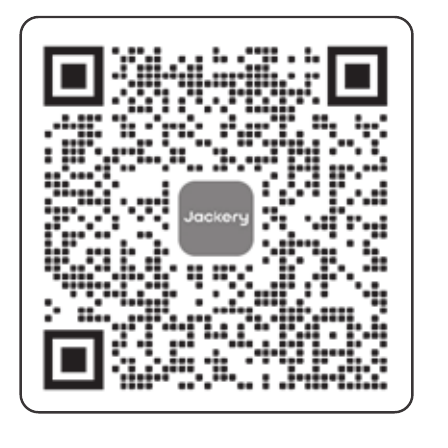
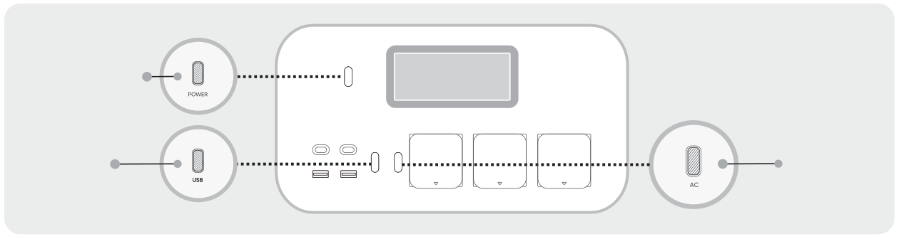

# IMPORTANTE

Felicidades por su nuevo Jackery Explorer 3600 Plus. Lea atentamente este manual antes de utilizar el producto, en particular las precauciones pertinentes para garantizar un uso correcto. Guarde este manual en un lugar accesible para consultarlo con frecuencia.

En cumplimiento de las leyes y reglamentos, el derecho de interpretación final de este documento y de todos los documentos relacionados con este producto corresponde a la Empresa.

Tenga en cuenta que no se realizarán más notificaciones en caso de actualización, revisión o finalización.

# INFORMACIÓN IMPORTANTE DE SEGURIDAD

<table class="manual-callout-table manual-callout-table"><tbody><tr><td class="manual-callout-label">ADVERTENCIA</td><td class="manual-callout-body">
INSTRUCCIONES RELATIVAS AL RIESGO DE INCENDIO, DESCARGA ELÉCTRICA O LESIONES PERSONALES
</td></tr></tbody></table>

<strong>Sigue siempre estas precauciones básicas al usar este producto.</strong>

<ul><li>
Lea todas las instrucciones antes de utilizar el producto.
</li><li>
No deje que los niños jueguen con el producto. Se requiere la supervisión cercana de adultos cuando se use cerca de niños.
</li><li>
Puede haber riesgo de descarga eléctrica si se utilizan accesorios que no estén recomendados o vendidos por fabricantes profesionales de productos.
</li><li>
Cuando el producto no esté en uso, desconecte el cable de alimentación del enchufe del producto.
</li><li>
No desmonte el producto, ya que podría provocar riesgos imprevisibles como incendios, explosiones o descargas eléctricas.
</li><li>
No utilice el producto si los cables, enchufes o salidas están dañados, ya que podría causar una descarga eléctrica.
</li><li>
Para garantizar una correcta circulación del aire, no cubra las rejillas de ventilación del producto. El lugar donde se utilice el producto debe tener una ventilación adecuada y estar en un entorno fresco y seco para evitar el sobrecalentamiento. -Cargar el producto en espacios húmedos o mal ventilados puede representar riesgos para la seguridad. -El agua puede causar cortocircuitos o dañar el cargador, lo que puede conllevar riesgos de seguridad.
</li><li>
No exponga el producto al fuego, a altas temperaturas, a la luz solar directa o a entornos calurosos, como el interior de un vehículo estacionado. Dicha exposición puede provocar incendios o explosiones.
</li></ul>

## INSTRUCCIONES DE MANTENIMIENTO PARA EL USUARIO

Durante el ciclo de vida de los productos de almacenamiento de energía, se producirá cierto grado de degradación de capacidad y energía. A medida que aumenta el número de ciclos de carga y descarga y se extiende el tiempo de almacenamiento, esta degradación se intensificará gradualmente, lo cual es un fenómeno normal acorde con el envejecimiento natural de las celdas de la batería.

# SIGNIFICADO DE LOS SÍMBOLOS

<figure aria-label="SIGNIFICADO DE LOS SÍMBOLOS" class="hb-symbol-signal-composition" data-component-id="HB-TABLE-SYMBOL-SIGNAL"><table class="hb-symbol-signal-table"><colgroup><col class="hb-symbol-signal-col-label"/><col class="hb-symbol-signal-col-meaning"/></colgroup><thead><tr><th class="hb-symbol-signal-label-heading" scope="col">Símbolo</th><th class="hb-symbol-signal-meaning-heading" scope="col">Significados</th></tr></thead><tbody><tr><td class="hb-symbol-signal-label-cell">⚠ADVERTENCIA</td><td class="hb-symbol-signal-meaning-cell">Prácticas peligrosas que pueden resultar en lesiones graves, muerte y/o daños a la propiedad.</td></tr><tr><td class="hb-symbol-signal-label-cell">⚠PRECAUCIÓN</td><td class="hb-symbol-signal-meaning-cell">Prácticas peligrosas que pueden resultar en lesiones personales y/o daños a la propiedad.</td></tr><tr><td class="hb-symbol-signal-label-cell">⚠NOTA</td><td class="hb-symbol-signal-meaning-cell">Prácticas peligrosas que pueden resultar en daño al equipo, pérdida de datos, deterioro del rendimiento o resultados inesperados.</td></tr><tr><td class="hb-symbol-signal-label-cell">⚠CONSEJOS</td><td class="hb-symbol-signal-meaning-cell">Complementa la información importante o consejos de operación en el texto.</td></tr></tbody></table></figure>

<figure aria-label="SIGNIFICADO DE LOS SÍMBOLOS" class="hb-symbol-pair-composition" data-component-id="HB-TABLE-SYMBOL-ICON">

<table class="hb-symbol-panel-table"><colgroup><col class="hb-symbol-col-icon"/><col class="hb-symbol-col-meaning"/></colgroup><thead><tr><th class="hb-symbol-icon-heading" scope="col">Símbolo</th><th class="hb-symbol-meaning-heading" scope="col">Significados</th></tr></thead><tbody><tr><td class="hb-symbol-icon"></td><td class="hb-symbol-meaning">Precaución! El incumplimiento de los mensajes de advertencia puede provocar lesiones.</td></tr><tr><td class="hb-symbol-icon"></td><td class="hb-symbol-meaning">Lea el manual del operador</td></tr><tr><td class="hb-symbol-icon"></td><td class="hb-symbol-meaning">No desarme el producto.</td></tr><tr><td class="hb-symbol-icon"></td><td class="hb-symbol-meaning">No fumar ni hacer llamas abiertas</td></tr><tr><td class="hb-symbol-icon"></td><td class="hb-symbol-meaning">No se permiten niños</td></tr><tr><td class="hb-symbol-icon"></td><td class="hb-symbol-meaning">Este símbolo indica que el producto contiene una batería de iones de litio (Li-ion), la cual debe desecharse o reciclarse de forma adecuada.</td></tr></tbody></table>

<table class="hb-symbol-panel-table"><colgroup><col class="hb-symbol-col-icon"/><col class="hb-symbol-col-meaning"/></colgroup><thead><tr><th class="hb-symbol-icon-heading" scope="col">Símbolo</th><th class="hb-symbol-meaning-heading" scope="col">Significados</th></tr></thead><tbody><tr><td class="hb-symbol-icon"></td><td class="hb-symbol-meaning">Las baterías y acumuladores no deben desecharse junto con los residuos domésticos. Como consumidor, usted está obligado por ley a desechar todas las baterías y acumuladores en los puntos de recolección designados, independientemente de si contienen sustancias peligrosas. Devuelva las baterías y acumuladores usados a un punto de recolección local, un centro de reciclaje o al minorista donde los compró. La eliminación adecuada garantiza un reciclaje responsable con el medio ambiente y evita posibles daños a la salud humana y al medio ambiente.</td></tr><tr><td class="hb-symbol-icon"></td><td class="hb-symbol-meaning">Este símbolo indica que el producto no debe desecharse con los residuos domésticos. En su lugar, debe llevarse a un punto de recogida designado para su correcto reciclaje. El desecho y reciclaje adecuados ayudan a proteger el medioambiente. Para más información, póngase en contacto con su autoridad local, el servicio de gestión de residuos o el distribuidor del producto.</td></tr></tbody></table>

</figure>

# CONTENIDO DE LA CAJA

<figure aria-label="CONTENIDO DE LA CAJA" class="hb-inbox-composition" data-card-count="3" data-component-id="HB-SPECIAL-INBOX" data-inbox-variant="three-card-responsive"><ol class="hb-inbox-grid"><li class="hb-inbox-card" data-item-number="1">

Jackery Explorer 3600 Plus

</li><li class="hb-inbox-card" data-item-number="2">

Cable de carga de CA

</li><li class="hb-inbox-card" data-item-number="3">

Manual del usuario

</li></ol>

CONSEJOS

El cable de carga para automóvil no está incluido, pero está disponible para su compra por separado en nuestro sitio web. Para obtener asistencia, comunícate con el servicio al cliente de Jackery.

</figure>

# DESCRIPCIÓN GENERAL DEL PRODUCTO

## VISTA FRONTAL

<figure class="hb-reference-figure" data-component-id="HB-SPECIAL-REFERENCE-FIGURE" data-reference-id="overview-front" data-source-fragment-sha256="f73dccf7866ae4c21fa9eab7d4032b8595d513059060400bf20a409f1d18ad13">

</figure>

## VISTA LATERAL DERECHA

<figure class="hb-reference-figure" data-component-id="HB-SPECIAL-REFERENCE-FIGURE" data-reference-id="overview-right" data-source-fragment-sha256="038fa1a4cf2c5c367ba4d8b9ebb1ee1867d93c6d6ba470880e9c0d9c2bb3ad15">

</figure>

# AFFICHAGE LCD

<figure class="hb-reference-figure" data-component-id="HB-SPECIAL-REFERENCE-FIGURE" data-reference-id="lcd-map" data-source-fragment-sha256="640b6abb185044716a1efcdff7d674742af1e3ee4c8a7ca2f6e386fca1aa90ec">

</figure>

<figure aria-label="AFFICHAGE LCD" class="hb-lcd-table-composition" data-component-id="HB-TABLE-LCD-ICON" tabindex="0"><table class="hb-lcd-icon-table"><colgroup><col class="hb-lcd-col-number"/><col class="hb-lcd-col-icon"/><col class="hb-lcd-col-name"/><col class="hb-lcd-col-description"/></colgroup><tbody><tr><td class="hb-lcd-number">1</td><td class="hb-lcd-icon"></td><td class="hb-lcd-name">Wi-Fi</td><td class="hb-lcd-description">
Encendido: Wi-Fi conectado. Parpadeo: listo para conectarse al Wi-Fi. Apagado: Wi-Fi desconectado.
</td></tr><tr><td class="hb-lcd-number">2</td><td class="hb-lcd-icon"></td><td class="hb-lcd-name">Bluetooth</td><td class="hb-lcd-description">
Encendido: Bluetooth conectado. Parpadeo: listo para conectarse al Bluetooth. Apagado: Bluetooth desconectado.
</td></tr><tr><td class="hb-lcd-number">3</td><td class="hb-lcd-icon"></td><td class="hb-lcd-name">Modo de Carga Silenciosa</td><td class="hb-lcd-description">
Encendido: el ruido durante la carga se minimiza significativamente, mientras que la potencia de carga se reduce y la velocidad de carga disminuye. Apagado: El modo de carga silenciosa está desactivado. Activar/desactivar esta función en la App Jackery.
</td></tr><tr><td class="hb-lcd-number" rowspan="2">4</td><td class="hb-lcd-icon"></td><td class="hb-lcd-name">Modo de Ahorro de Batería</td><td class="hb-lcd-description">
Encendido: limita la capacidad máxima utilizable de la batería para prolongar su vida útil. Apagado: el modo de ahorro de batería está desactivado. Activar/desactivar esta función en la App Jackery.Esta función no está disponible cuando el producto está conectado a paquetes de baterías.
</td></tr><tr><td class="hb-lcd-icon"></td><td class="hb-lcd-name">Modo Autónomo</td><td class="hb-lcd-description">
Maximiza el uso de la energía solar y reduce la dependencia de la electricidad de la red al priorizar la energía solar almacenada, reduciendo los costos eléctricos (por favor, active/desactive esta función en la aplicación). La estación de energía debe estar conectada simultáneamente a los paneles solares y a la red, con la potencia de carga limitada por la potencia de derivación.
</td></tr><tr><td class="hb-lcd-number">5</td><td class="hb-lcd-icon"></td><td class="hb-lcd-name">Plan de Carga</td><td class="hb-lcd-description">
Personaliza el tiempo de carga del Jackery Explorer 3600 Plus. Adecuado para situaciones con tarifas eléctricas variables, permite establecer planes de carga según las horas pico y valle, reduciendo así los costos de electricidad (por favor, configure esta función en la aplicación Jackery).
</td></tr><tr><td class="hb-lcd-number">6</td><td class="hb-lcd-icon"></td><td class="hb-lcd-name">Indicador de Energía de CA</td><td class="hb-lcd-description">
La salida CA (onda sinusoidal pura) está activada.
</td></tr><tr><td class="hb-lcd-number">7</td><td class="hb-lcd-icon"></td><td class="hb-lcd-name">Voltaje y frecuencia de salida</td><td class="hb-lcd-description">
Muestra el voltaje y la frecuencia de salida.
</td></tr><tr><td class="hb-lcd-number">8</td><td class="hb-lcd-icon"></td><td class="hb-lcd-name">Potencia de Entrada</td><td class="hb-lcd-description">
Muestra la potencia de entrada en vatios.
</td></tr><tr><td class="hb-lcd-number">9</td><td class="hb-lcd-icon"></td><td class="hb-lcd-name">Tiempo de Carga Restante</td><td class="hb-lcd-description">
Muestra el tiempo de carga restante.
</td></tr><tr><td class="hb-lcd-number">10</td><td class="hb-lcd-icon"></td><td class="hb-lcd-name">Indicador de Carga desde Toma de Corriente CA</td><td class="hb-lcd-description">
El producto se carga a través de la entrada CA utilizando energía de la red eléctrica.
</td></tr><tr><td class="hb-lcd-number">11</td><td class="hb-lcd-icon"></td><td class="hb-lcd-name">Indicador de Carga desde Coche</td><td class="hb-lcd-description">
El producto se carga a través de la entrada CC (DC8020) utilizando CC 12V (carga desde el coche).
</td></tr><tr><td class="hb-lcd-number">12</td><td class="hb-lcd-icon"></td><td class="hb-lcd-name">Indicador de Carga Solar</td><td class="hb-lcd-description">
El producto se carga a través de la entrada CC (DC8020) utilizando paneles solares.
</td></tr><tr><td class="hb-lcd-number">13</td><td class="hb-lcd-icon"></td><td class="hb-lcd-name">Indicador de Potencia de la Batería</td><td class="hb-lcd-description">
Cuando el producto se está cargando, el círculo naranja alrededor del porcentaje de batería se ilumina secuencialmente. Cuando está cargando otros dispositivos, el círculo naranja permanece encendido.
</td></tr><tr><td class="hb-lcd-number">14</td><td class="hb-lcd-icon"></td><td class="hb-lcd-name">Indicador de Batería Baja</td><td class="hb-lcd-description">
Encendido: el nivel de la batería está por debajo del 20 %. Parpadeo: el nivel de la batería está por debajo del 5 %. Apagado: el nivel de la batería no está por debajo del 20 % o el producto se está cargando.
</td></tr><tr><td class="hb-lcd-number">15</td><td class="hb-lcd-icon"></td><td class="hb-lcd-name">Porcentaje de Batería Restante</td><td class="hb-lcd-description">
Muestra el porcentaje de batería restante.
</td></tr><tr><td class="hb-lcd-number">16</td><td class="hb-lcd-icon"></td><td class="hb-lcd-name">Indicador de paquete de baterías y número de baterías conectadas</td><td class="hb-lcd-description">
Indica que el producto está conectado al número especificado de baterías adicionales 3600.
</td></tr><tr><td class="hb-lcd-number">17</td><td class="hb-lcd-icon"></td><td class="hb-lcd-name">Código de fallo</td><td class="hb-lcd-description">
Se ha producido un error en el producto. Por favor, consulte la sección de solución de problemas para más detalles.
</td></tr><tr><td class="hb-lcd-number" rowspan="2">18</td><td class="hb-lcd-icon"></td><td class="hb-lcd-name">Indicador de Alta Temperatura</td><td class="hb-lcd-description">
Se activó la protección por alta temperatura. El producto puede dejar de funcionar hasta que su temperatura vuelva al rango normal de operación.
</td></tr><tr><td class="hb-lcd-icon"></td><td class="hb-lcd-name">Indicador de Baja Temperatura</td><td class="hb-lcd-description">
Se activó la protección por baja temperatura.El producto puede dejar de funcionar hasta que su temperatura vuelva al rango normal de operación.
</td></tr><tr><td class="hb-lcd-number">19</td><td class="hb-lcd-icon"></td><td class="hb-lcd-name">Modo de Ahorro de Energía</td><td class="hb-lcd-description">
Cuando las salidas CA o USB se encienden presionando los botones de encendido CA o USB: Encendido: Modo de ahorro de energía activado. Apagado: Modo de ahorro de energía desactivado.
</td></tr><tr><td class="hb-lcd-number">20</td><td class="hb-lcd-icon"></td><td class="hb-lcd-name">Potencia de Salida</td><td class="hb-lcd-description">
Muestra la potencia de salida en vatios.
</td></tr><tr><td class="hb-lcd-number">21</td><td class="hb-lcd-icon"></td><td class="hb-lcd-name">Tiempo de Descarga Restante</td><td class="hb-lcd-description">
Muestra el tiempo de descarga restante.
</td></tr></tbody></table></figure>

# OPERACIONES

## ENCENDIDO/APAGADO

<figure class="hb-reference-figure hb-base-art-live-copy" data-component-id="HB-SPECIAL-REFERENCE-FIGURE" data-reference-id="operation-main-power" data-source-fragment-sha256="1d3a35f1a73e97b760cfd43f4a895d8fcb9ef0fbbd12a5551d14c444cf4c5f82" data-web-base-art-ref="operation-main-power" data-web-presentation-mode="base-art-live-copy">

Encendido Presione una vezApagado Mantén presionado durante 3 segundosTiempo de espera predeterminado: 2 horas El producto se apagará automáticamente después de 2 horas de inactividad, sin carga ni descarga. *El tiempo en espera puede configurarse en la App de Jackery.Cuando el modo de ahorro de energía está activado, el producto se apagará automáticamente después de 12 horas si el botón de salida CA o USB está encendido, pero el producto no está cargando ni descargando.

</figure>

## ENCENDER/APAGAR SALIDA USB

<figure class="hb-operation-figure hb-operation-layout-status-right hb-base-art-live-copy" data-component-id="HB-SPECIAL-OPERATION" data-operation-id="dc-usb-output" data-source-fragment-sha256="9afe2c971f3032ad610b9b9b3d57c2f1a729f5d1ceeeb5324f3b665ba2c1fa93" data-web-base-art-ref="operation/dc_usb_output" data-web-presentation-mode="base-art-live-copy" data-web-replace-key="operation.dc-usb-output">

<strong>Requisito previo:</strong> el producto está encendido.

<strong>Encendido</strong>

Presione una vez

<strong>Apagado</strong>

Presione una vez

</figure>

<table class="manual-callout-table manual-callout-table"><tbody><tr><td class="manual-callout-label">PRECAUCIÓN</td><td class="manual-callout-body"><ul><li>
USB-C son puertos de salida de alta potencia tipo fuente de alimentación 3 (PS3) USB-PD. Si el dispositivo del usuario o accesorio conectado no cumple con los requisitos de seguridad, puede existir riesgo de incendio. Antes de usar estos puertos, asegúrese de que el dispositivo o accesorio conectado tenga protección contra incendios.
</li><li>
Solo conecte el Jackery Explorer 3600 Plus a dispositivos o accesorios que cumplan con las cláusulas 6.3, 6.4 y 6.5 de IEC/EN/UL 62368-1 (u otros estándares equivalentes).
</li><li>
Para obtener la potencia máxima de salida, utilice el cable oficial Jackery USB-C a USB-C de 5 A (20 V CC/5 A, 100W).
</li></ul></td></tr></tbody></table>

## ENCENDER/APAGAR SALIDA CA

<figure class="hb-operation-figure hb-operation-layout-status-right hb-base-art-live-copy" data-component-id="HB-SPECIAL-OPERATION" data-operation-id="ac-output" data-source-fragment-sha256="b0ad4fbd8df0d2d07ff1860daf966ce94bd49ccab755bdc07a2225a106e541c0" data-web-base-art-ref="operation/ac_output" data-web-presentation-mode="base-art-live-copy" data-web-replace-key="operation.ac-output">

<strong>Requisito previo:</strong> el producto está encendido.

<strong>Encendido</strong>

Presione una vez

<strong>Apagado</strong>

Presione una vez

</figure>

## MODO DE AHORRO DE ENERGÍA

<figure class="hb-reference-figure hb-base-art-live-copy" data-component-id="HB-SPECIAL-REFERENCE-FIGURE" data-reference-id="operation-energy-saving" data-source-fragment-sha256="333ade196d307c28f7edace55b524a49a1c137ceacb747a6b0aad3c153be474c" data-web-base-art-ref="operation-energy-saving" data-web-presentation-mode="base-art-live-copy">

Para evitar el consumo innecesario de batería al olvidar apagar la salida, el producto activa por defecto el Modo de Ahorro de Energía. Si no hay ningún dispositivo conectado o si el consumo del dispositivo conectado está por debajo de un cierto umbral (salida de CA de 25W o salida USB de 2W) durante 12 horas, el dispositivo apagará automáticamente todas las salidas. Para desactivar el modo de ahorro de energía, presione y mantenga presionados el botón de energía CA y el botón de encendido principal durante más de 3 segundos. El producto no apagará automáticamente la salida CA o CC.Botón principal de encendidoBotón de energía CAEncendido/Apagado Mantenga pulsados ambos botones durante 3 segundos

</figure>

<table class="manual-callout-table manual-callout-table"><tbody><tr><td class="manual-callout-label">NOTA</td><td class="manual-callout-body">
El modo de ahorro de energía reanuda el estado anterior después de encender. Se requiere un cambio manual para modificar el modo.
</td></tr></tbody></table>

## AFFICHAGE LCD

<figure aria-label="AFFICHAGE LCD" class="hb-lcd-mode-composition" data-component-id="HB-TABLE-LCD-MODE">

<table class="hb-lcd-mode-table"><colgroup><col class="hb-lcd-mode-col-state"/><col class="hb-lcd-mode-col-action"/><col class="hb-lcd-mode-col-copy"/></colgroup><tbody><tr><td class="hb-lcd-mode-state" rowspan="3">En breve</td><td class="hb-lcd-mode-action">Encender</td><td class="hb-lcd-mode-copy">Presione el botón de encendido principal o cuando el producto se esté cargando.</td></tr><tr><td class="hb-lcd-mode-action">Apagar</td><td class="hb-lcd-mode-copy">Presione el botón de encendido principal.</td></tr><tr><td class="hb-lcd-mode-action">Apagado automático</td><td class="hb-lcd-mode-copy">La pantalla LCD se apaga automáticamente y entra en modo de suspensión después de 2 minutos de inactividad.</td></tr><tr><td class="hb-lcd-mode-state" rowspan="3">Estable en (durante el estado de carga o descarga)</td><td class="hb-lcd-mode-action">Encender</td><td class="hb-lcd-mode-copy">Presione dos veces el botón de encendido principal cuando la pantalla LCD esté encendida.</td></tr><tr><td class="hb-lcd-mode-action">Apagar</td><td class="hb-lcd-mode-copy">Presione el botón de energía principal.</td></tr><tr><td class="hb-lcd-mode-action">Apagado automático</td><td class="hb-lcd-mode-copy">La pantalla LCD se apaga automáticamente después de 2 horas de inactividad.</td></tr></tbody></table>
</figure>

También puedes configurar el modo de visualización de la pantalla en la aplicación Jackery.

## COMBINACIONES DE TECLAS

<figure aria-label="Botones / Operación / Función" class="hb-key-combination-composition" data-component-id="HB-TABLE-KEY-COMBINATIONS" tabindex="0"><table class="hb-key-combination-table"><colgroup><col class="hb-key-col-buttons"/><col class="hb-key-col-operation"/><col class="hb-key-col-function"/></colgroup><thead><tr><th class="hb-key-buttons" scope="col">Botones</th><th class="hb-key-operation" scope="col">Operación</th><th class="hb-key-function" scope="col">Función</th></tr></thead><tbody><tr><td class="hb-key-buttons">Botón de encendido principal + Botón de energía USB</td><td class="hb-key-operation">Mantenga pulsados ambos botones durante 3 segundos</td><td class="hb-key-function">Restablecer Wi-Fi y Bluetooth</td></tr><tr><td class="hb-key-buttons">Botón de encendido principal + Botón de energía CA</td><td class="hb-key-operation">Mantenga pulsados ambos botones durante 3 segundos</td><td class="hb-key-function">Encender/apagar el modo de ahorro de energía</td></tr><tr><td class="hb-key-buttons">Botón de energía USB + Botón de energía CA</td><td class="hb-key-operation">Mantenga pulsados ambos botones durante 1 segundo</td><td class="hb-key-function">Encender/apagar Wi-Fi y Bluetooth</td></tr></tbody></table></figure>

# FUENTE DE ALIMENTACIÓN ININTERRUMPIDA (UPS)

Conecte el producto a una toma de corriente con el cable de carga de CA, luego presione el botón de energía CA y cargue sus electrodomésticos al mismo tiempo.

<figure class="hb-reference-figure hb-base-art-live-copy" data-component-id="HB-SPECIAL-REFERENCE-FIGURE" data-reference-id="ups" data-source-fragment-sha256="63df6672a09819ee750cb55ea1534bc95627586328d7bd94ac40d2b71d7ffb26" data-web-base-art-ref="ups" data-web-presentation-mode="base-art-live-copy">

Un sistema de alimentación ininterrumpida (UPS) es un tipo de sistema de energía continua que proporciona energía eléctrica de respaldo automática a una carga cuando falla la energía de la red principal. En caso de una pérdida repentina de energía de la red, el Explorer 3600 Plus cambiará automáticamente a la energía almacenada en menos de 10 ms para mantener sus electrodomésticos en funcionamiento.

</figure>

En modo UPS, la potencia máxima de salida de la unidad alcanza 10 A antes de los cortes de energía. Como la carga y descarga simultáneas están habilitadas en el modo derivación, la potencia de salida real es menor que la potencia nominal en este modo, pero vuelve a la potencia nominal durante los cortes.

<table class="manual-callout-table manual-callout-table"><tbody><tr><td class="manual-callout-label">PRECAUCIÓN</td><td class="manual-callout-body"><ul><li>
Este producto no admite conmutación de 0 ms. No lo conecte a equipos que requieran una fuente de alimentación ininterrumpida, como servidores de datos o estaciones de trabajo.
</li><li>
Antes de usar, pruebe la compatibilidad con su dispositivo varias veces.
</li><li>
No conectes cargas que excedan la potencia de salida máxima del producto. De lo contrario, se activará la protección contra sobrecarga.
</li></ul></td></tr></tbody></table>

# CONNEXIONS

<h2 class="hb-subbar" id="conectar-allos-paquetes-de-baterías-se-vende-por-separado">CONECTAR AL/LOS PAQUETE(S) DE BATERÍAS SE VENDE POR SEPARADO</h2>

Este producto puede soportar hasta 5 paquetes de baterías para satisfacer la necesidad de una gran capacidad de energía. Para detalles sobre su uso, consulte el manual de usuario del Jackery Battery Pack 3600.

<figure class="hb-reference-figure hb-base-art-live-copy" data-component-id="HB-SPECIAL-REFERENCE-FIGURE" data-reference-id="battery" data-source-fragment-sha256="9eb3693d55cf1278405a9a142fe59fcb8709f598c8829d2a2212627b119a0cbe" data-web-base-art-ref="battery" data-web-presentation-mode="base-art-live-copy">

≥ 200 mm≥ 200 mm

</figure>

<table class="manual-callout-table manual-callout-table"><tbody><tr><td class="manual-callout-label">PRECAUCIÓN</td><td class="manual-callout-body"><ul><li>
Asegúrese de que todos los productos estén apagados antes de conectar el Explorer 3600 Plus al paquete de Jackery Battery Pack 3600.
</li><li>
Para asegurar el funcionamiento adecuado del producto, asegúrese de que las rejillas de entrada y salida de aire en ambos lados estén despejadas. Deje al menos 200 mm de espacio entre las rejillas y cualquier objeto para permitir una disipación de calor adecuada.
</li></ul></td></tr></tbody></table>

<figure class="hb-reference-figure hb-base-art-live-copy" data-component-id="HB-SPECIAL-REFERENCE-FIGURE" data-reference-id="battery-accessories" data-source-fragment-sha256="cabe7c41fcad5a2c074ef87c55c5a682d88a7150de50a064a94581859e471748" data-web-base-art-ref="battery-accessories" data-web-presentation-mode="base-art-live-copy">

Jackery Battery Pack 3600Cable de expansiónManual de usuarioSe vende por separado

</figure>

# CARGANDO

<strong>Energía renovable primero:</strong> Abogamos por utilizar primero energía renovable. Este producto admite dos modos de carga al mismo tiempo: carga solar y carga de pared de CA. Cuando la carga en la pared de CA y la carga solar están activadas al mismo tiempo, el producto dará prioridad a la carga solar y se utilizarán ambos métodos para cargar la batería a la máxima potencia permitida.

Carga completamente el producto antes de usarlo por primera vez.

<table class="manual-callout-table manual-callout-table"><tbody><tr><td class="manual-callout-label">Nota</td><td class="manual-callout-body"><ul><li>
La temperatura de carga recomendada para el producto está entre -20 °C a 45 °C, y la temperatura de descarga está entre -20 °C a 45 °C. Operar el producto fuera de este rango de temperatura puede limitar sus capacidades de carga y descarga, e incluso impedir la carga o descarga.
</li><li>
La potencia de carga y la capacidad de la batería del producto pueden variar debido a fluctuaciones de temperatura.
</li></ul></td></tr></tbody></table>

## CARGA MEDIANTE UNA TOMA DE CORRIENTE DE PARED ALTERNA

<figure class="hb-reference-figure hb-base-art-live-copy" data-component-id="HB-SPECIAL-REFERENCE-FIGURE" data-reference-id="charging-ac" data-source-fragment-sha256="1ce04edb6d4f461197cc3f3d71cbc91f81304ead80a16b5bf50f712c7361fd9e" data-web-base-art-ref="charging-ac" data-web-presentation-mode="base-art-live-copy">

Conecte el cable de carga de CA al puerto de entrada de CA del producto y a una toma de corriente.

</figure>

<table class="manual-callout-table manual-callout-table"><tbody><tr><td class="manual-callout-label">PRECAUCIÓN</td><td class="manual-callout-body">
Asegúrese de que el cable de carga de CA esté completamente y firmemente insertado en el puerto de entrada de CA. Una conexión incompleta puede provocar corriente inestable, sobrecalentamiento, mal contacto o fallos en el funcionamiento del producto.
</td></tr></tbody></table>

<h2 class="hb-subbar" id="carga-mediante-paneles-solares-se-vende-por-separado">CARGA MEDIANTE PANELES SOLARES SE VENDE POR SEPARADO</h2>

El Jackery Explorer 3600 Plus cuenta con dos puertos de entrada DC8020 y es compatible con los paneles solares de la Jackery. Si se necesita conectar dos paneles solares a un solo puerto de entrada DC8020 al mismo tiempo, consulte la figura a continuación para la carga mediante el conector de panel solar (se vende por separado, no incluido de serie).

<figure class="hb-reference-figure hb-base-art-live-copy" data-component-id="HB-SPECIAL-REFERENCE-FIGURE" data-reference-id="charging-solar" data-source-fragment-sha256="b19d8622a4150edbc36830bc842910b6f17d60391198e798de99655bb462bf8b" data-web-base-art-ref="charging-solar" data-web-presentation-mode="base-art-live-copy">

SolarSaga 200 × 4

</figure>

<table class="manual-callout-table manual-callout-table"><tbody><tr><td class="manual-callout-label">PRECAUCIÓN</td><td class="manual-callout-body">
Un puerto de entrada DC8020 puede conectarse a un máximo de dos paneles solares.
</td></tr></tbody></table>

<table class="manual-callout-table manual-callout-table"><tbody><tr><td class="manual-callout-label">PRECAUCIÓN</td><td class="manual-callout-body"><ul><li>
Asegúrese de que el voltaje de entrada para ambos puertos de entrada CC sea el mismo. De lo contrario, podría dañar el producto. Por ejemplo:
</li><li>
Se recomienda utilizar paneles solares Jackery del mismo modelo y la misma cantidad de paneles al conectar paneles solares a ambos puertos de entrada DC8020.
</li><li>
No cargue el producto utilizando simultáneamente un cargador de automóvil y un panel solar. Hacerlo podría quemar el fusible del automóvil o resultar en un fallo de carga.
</li></ul></td></tr></tbody></table>

Se recomienda usar el panel solar Jackery para cargar el Explorer 3600 Plus. Asegúrese de que el voltaje en circuito abierto (Voc) del rango de entrada CC (16 V-60 V) del Explorer 3600 Plus. Jackery no se hace responsable de pérdidas causadas por el uso de paneles solares de otras marcas.

<h2 class="hb-subbar" id="carga-con-un-cargador-de-en-el-vehículo-se-vende-por-separado">CARGA CON UN CARGADOR DE EN EL VEHÍCULO SE VENDE POR SEPARADO</h2>

Este producto puede cargarse usando un cargador para auto de 12V. Asegúrese de que el cargador de coche y el encendedor de coche ofrecen una buena conexión.

<figure class="hb-reference-figure hb-base-art-live-copy" data-component-id="HB-SPECIAL-REFERENCE-FIGURE" data-reference-id="charging-car" data-source-fragment-sha256="b44480254b82f09b1a3103750531ebb5783581726e435a4e79e3dedca94d88ef" data-web-base-art-ref="charging-car" data-web-presentation-mode="base-art-live-copy">

Vehículo※ El cable de carga para auto se vende por separado.

</figure>

<table class="manual-callout-table manual-callout-table"><tbody><tr><td class="manual-callout-label">Importante</td><td class="manual-callout-body"><ul><li>
Por favor, encienda el vehículo antes de cargar su estación de energía.
</li><li>
Si el vehículo circula por caminos accidentados, está prohibido usar el cargador de coche para evitar que se queme debido a una mala conexión. La empresa no se responsabiliza por pérdidas causadas por un uso incorrecto.
</li><li>
La carga en vehículo solo es aplicable a vehículos con 12 V CC, no a 24 V CC. Por favor, no cargue este producto en vehículos de 24 V para evitar lesiones personales y daños materiales.
</li></ul></td></tr></tbody></table>

# ALMACENAMIENTO

Almacene el producto en un lugar seco y limpio con ventilación adecuada.Temperatura y humedad de almacenamiento:
<ul class="hb-source-storage-copy" style="margin:0"><li class="hb-source-storage-item" style="margin:0">
1 mes: -20°C a 45°C (0-60 % HR)
</li><li class="hb-source-storage-item" style="margin:0">
3 meses: 0°C a 45°C (0-60 % HR)
</li><li class="hb-source-storage-item" style="margin:0">
12 meses: 0°C a 25°C (0-60 % HR)
</li></ul>
Si este producto se almacena durante un período prolongado (de 3 a 6 meses) con la batería descargada, podría volverse imposible recargarlo. Para evitar esto y mantener la salud de la batería, se recomienda revisar y recargar el producto cada tres meses, y realizar un ciclo completo de carga y descarga al menos una vez cada 6 a 12 meses.

# RESOLUCIÓN DE PROBLEMAS

Si aparece alguno de los siguientes códigos de falla, siga las acciones correctivas listadas para resolver el problema.Si la falla persiste, por favor contacte con atención al cliente de Jackery.

<figure aria-label="Código de Error / Medidas correctivas" class="hb-troubleshooting-composition" data-component-id="HB-TABLE-TROUBLESHOOTING" tabindex="0"><table class="hb-troubleshooting-table"><colgroup><col class="hb-troubleshooting-col-code"/><col class="hb-troubleshooting-col-measures"/></colgroup><thead><tr><th class="hb-troubleshooting-code" scope="col">Código de Error</th><th class="hb-troubleshooting-measures" scope="col">Medidas correctivas</th></tr></thead><tbody><tr><td class="hb-troubleshooting-code">F0</td><td class="hb-troubleshooting-measures">Reiniciar el producto.</td></tr><tr><td class="hb-troubleshooting-code">F1</td><td class="hb-troubleshooting-measures">Reiniciar el producto.</td></tr><tr><td class="hb-troubleshooting-code">F2</td><td class="hb-troubleshooting-measures">Reiniciar el producto.</td></tr><tr><td class="hb-troubleshooting-code">F3</td><td class="hb-troubleshooting-measures">Reiniciar el producto.</td></tr><tr><td class="hb-troubleshooting-code">F4</td><td class="hb-troubleshooting-measures">Conecte el producto a cargas para descargar su batería hasta que la falla desaparezca.</td></tr><tr><td class="hb-troubleshooting-code">F5</td><td class="hb-troubleshooting-measures">Cargue el producto mediante paneles solares o toma de corriente CA hasta que la falla desaparezca.</td></tr><tr><td class="hb-troubleshooting-code">F6</td><td class="hb-troubleshooting-measures">1. Espere a que la red eléctrica se normalice antes de cargar el producto a través de una toma de corriente CA. 2. Verifique si las rejillas de entrada y salida de aire están obstruidas; asegure un espacio libre de 20 cm a ambos lados del producto. 3. Coloque el producto en un lugar que no esté expuesto a la luz solar directa o a altas temperaturas ambientales. 4. Desconecte todas las cargas del producto. Mantenga el producto inactivo y espere hasta que la falla desaparezca. 5. Reiniciar el producto.</td></tr><tr><td class="hb-troubleshooting-code">F7</td><td class="hb-troubleshooting-measures">1. Retire todas las entradas CC del producto. 2. Verifique el voltaje en circuito abierto (Voc) de los paneles solares conectados. El producto permite un voltaje máximo de entrada CC de 60 V. 3. Reinicie el producto y manténgalo inactivo. Espere hasta que la falla desaparezca.</td></tr><tr><td class="hb-troubleshooting-code">F8</td><td class="hb-troubleshooting-measures">Contacte con atención al cliente de Jackery.</td></tr><tr><td class="hb-troubleshooting-code">F9</td><td class="hb-troubleshooting-measures">Retire la carga conectada a los puertos USB del producto. Espere hasta que la falla desaparezca.</td></tr><tr><td class="hb-troubleshooting-code">FA</td><td class="hb-troubleshooting-measures">1. Apague la salida CA de ambas unidades. 2. Presione el botón de encendido de la CA en cada unidad nuevamente, pero en no más de 1 minuto.</td></tr><tr><td class="hb-troubleshooting-code">FC</td><td class="hb-troubleshooting-measures">1. Reinicie los paquetes de baterías y el Explorer 3600 Plus respectivamente. 2. Si la falla persiste, desconecte el paquete de baterías del Explorer 3600 Plus y reconéctelos.</td></tr></tbody></table></figure>

# ESPECIFICACIONES

<h2 aria-level="2" role="heading">INFORMACIÓN GENERAL</h2><figure aria-label="INFORMACIÓN GENERAL" class="hb-spec-table-composition"><table class="manual-table manual-spec-table hb-spec-table"><colgroup><col class="hb-spec-col-label"/><col class="hb-spec-col-value"/></colgroup><tbody><tr><th class="manual-spec-label hb-spec-label" scope="row">Nombre del producto</th><td class="manual-spec-value hb-spec-value">Jackery Explorer 3600 Plus</td></tr><tr><th class="manual-spec-label hb-spec-label" scope="row">Nº de modelo</th><td class="manual-spec-value hb-spec-value">JE-3600A</td></tr><tr><th class="manual-spec-label hb-spec-label" scope="row">Capacidad</th><td class="manual-spec-value hb-spec-value">80Ah / 44,8V DC (3584 Wh)</td></tr><tr><th class="manual-spec-label hb-spec-label" scope="row">Química Celular</th><td class="manual-spec-value hb-spec-value">LiFePO₄</td></tr><tr><th class="manual-spec-label hb-spec-label" scope="row">Peso</th><td class="manual-spec-value hb-spec-value">Aproximadamente 35 kg</td></tr><tr><th class="manual-spec-label hb-spec-label" scope="row">Dimensiones</th><td class="manual-spec-value hb-spec-value">38,5×30,9×49,1 cm</td></tr><tr><th class="manual-spec-label hb-spec-label" scope="row">Ciclo de vida</th><td class="manual-spec-value hb-spec-value">6000 ciclos de carga hasta 70 % + de capacidad</td></tr><tr><th class="manual-spec-label hb-spec-label" scope="row">IEC code</th><td class="manual-spec-value hb-spec-value">IFpR41/136[14S4P]M/-20+40/90</td></tr></tbody></table></figure><h2 aria-level="2" role="heading">PUERTOS DE ENTRADA</h2><figure aria-label="PUERTOS DE ENTRADA" class="hb-spec-table-composition"><table class="manual-table manual-spec-table hb-spec-table"><colgroup><col class="hb-spec-col-label"/><col class="hb-spec-col-value"/></colgroup><tbody><tr><th class="manual-spec-label hb-spec-label" scope="row">1 × Entrada CA</th><td class="manual-spec-value hb-spec-value">Modo de carga: 220-240V~ 50Hz, 10A Máx</td></tr><tr><th class="manual-spec-label hb-spec-label" scope="row">1 × Entrada CA</th><td class="manual-spec-value hb-spec-value">Modo bypass① : 220-240V~ 50Hz, 10A Máx</td></tr><tr><th class="manual-spec-label hb-spec-label" scope="row">2 × Puertos DC8020</th><td class="manual-spec-value hb-spec-value">12-16V⎓8A Máx, Doble a 8A Máx</td></tr><tr><th class="manual-spec-label hb-spec-label" scope="row">2 × Puertos DC8020</th><td class="manual-spec-value hb-spec-value">16-60V⎓12A, Doble a 24A Máx/1000W Máx</td></tr><tr><th class="manual-spec-label hb-spec-label" scope="row">1 × Puerto de expansión CC</th><td class="manual-spec-value hb-spec-value">36,4V-50,4V⎓100A Máx</td></tr></tbody></table></figure><h2 aria-level="2" role="heading">PUERTOS DE SALIDA</h2><figure aria-label="PUERTOS DE SALIDA" class="hb-spec-table-composition"><table class="manual-table manual-spec-table hb-spec-table"><colgroup><col class="hb-spec-col-label"/><col class="hb-spec-col-value"/></colgroup><tbody><tr><th class="manual-spec-label hb-spec-label" scope="row">3 × Salidas CA</th><td class="manual-spec-value hb-spec-value">230V~ 50Hz, 3600W</td></tr><tr><th class="manual-spec-label hb-spec-label" scope="row">CA Salida total②</th><td class="manual-spec-value hb-spec-value">3600W nominales, 7200W pico de sobretensión</td></tr><tr><th class="manual-spec-label hb-spec-label" scope="row">Salida de CA en modo bypass①</th><td class="manual-spec-value hb-spec-value">220-240V~ 50Hz, 10A Máx</td></tr><tr><th class="manual-spec-label hb-spec-label" scope="row">2 × Salida USB-C 100W</th><td class="manual-spec-value hb-spec-value">100W Máx, 5V⎓3A, 9V⎓3A, 12V⎓3A, 15V⎓3A, 20V⎓5A</td></tr><tr><th class="manual-spec-label hb-spec-label" scope="row">2 × Salida USB-A 18W</th><td class="manual-spec-value hb-spec-value">18W Máx, 5-6V⎓3A, 6-9V⎓2A, 9-12V⎓1,5A</td></tr><tr><th class="manual-spec-label hb-spec-label" scope="row">1 × Puerto de expansión CC</th><td class="manual-spec-value hb-spec-value">36,4V-50,4V⎓60A Máx</td></tr></tbody></table></figure><h2 aria-level="2" role="heading">TEMPERATURA DE FUNCIONAMIENTO</h2><figure aria-label="TEMPERATURA DE FUNCIONAMIENTO" class="hb-spec-table-composition"><table class="manual-table manual-spec-table hb-spec-table"><colgroup><col class="hb-spec-col-label"/><col class="hb-spec-col-value"/></colgroup><tbody><tr><th class="manual-spec-label hb-spec-label" scope="row">Température de charge</th><td class="manual-spec-value hb-spec-value">-20°C a 45°C</td></tr><tr><th class="manual-spec-label hb-spec-label" scope="row">Température de décharge</th><td class="manual-spec-value hb-spec-value">-20°C a 45°C</td></tr></tbody></table></figure>

※ USB Type-C® y USB-C® son marcas registradas de USB Implementers Forum.

① El producto puede cargar la batería desde una toma de corriente CA mientras suministra energía a través de los puertos de salida CA.

② Indica que dos o más puertos de salida CA trabajan en conjunto.

# GARANTÍA

<figure aria-label="GARANTÍA" class="hb-warranty-intro-composition" data-component-id="HB-WARRANTY-LEAD">

<strong>Solo ofrecemos nuestra garantía a clientes que compren en el sitio web oficial de Jackery, plataformas de terceros con la marca Jackery o distribuidores autorizados locales.</strong>

* El periodo de garantía y los detalles pueden variar según las leyes, regulaciones y distribuidores autorizados locales.

</figure>

## Garantía limitada

<figure aria-label="Garantía limitada" class="hb-warranty-card" data-component-id="HB-WARRANTY-SECTION" data-warranty-card-index="1">
Jackery garantiza al consumidor original que el producto Jackery estará libre de defectos relativos al acabado y a los materiales en condiciones normales de uso por parte del consumidor durante el período de garantía aplicable identificado en la sección "Período de garantía" que figura a continuación, sujeto a las exclusiones que se establecen a continuación. Esta declaración de garantía establece la obligación de garantía total y exclusiva de Jackery. No asumiremos ni autorizaremos que ninguna persona asuma por nosotros ninguna otra responsabilidad en relación con la venta de nuestros productos.
</figure>

## Período de garantía

<figure aria-label="Período de garantía" class="hb-warranty-period-card" data-component-id="HB-WARRANTY-YEARS">

3
<strong class="hb-warranty-years-unit">AÑOS</strong><strong class="hb-warranty-period-label">Garantía Estándar</strong>

El periodo de garantía estándar de Jackery Explorer 3600 Plus es de 36 meses. En cada caso, el período de garantía se mide a partir de la fecha de compra por parte del comprador consumidor original. Para establecer la fecha de inicio del período de garantía, se necesita el recibo de venta de la primera compra del consumidor u otra prueba documental razonable.

2
<strong class="hb-warranty-years-unit">AÑOS</strong><strong class="hb-warranty-period-label">Garantía extendida</strong>

Para activar la extensión de garantía,debe registrar su producto en línea oponerse en contacto con nuestro equipo de atención al cliente en hello.eu@jackery.com para ampliar laduración de la garantia estándar.

</figure>

## Cambio

<figure aria-label="Cambio" class="hb-warranty-card" data-component-id="HB-WARRANTY-SECTION" data-warranty-card-index="2">
Jackery sustituirá (a cargo de Jackery) cualquier producto Jackery que no funcione, durante el período de garantía aplicable, debido a defectos de acabado o de material. Un producto de sustitución asume la garantía restante del producto original.
</figure>

## Limitado al comprador consumidor original

<figure aria-label="Limitado al comprador consumidor original" class="hb-warranty-card" data-component-id="HB-WARRANTY-SECTION" data-warranty-card-index="3">
La garantía del producto de Jackery se limita al consumidor original y no es transferible a ningún propietario posterior.
</figure>

## Exclusiones

<figure aria-label="Exclusiones" class="hb-warranty-card" data-component-id="HB-WARRANTY-SECTION" data-warranty-card-index="4">
La garantía de Jackery no se aplica a:
<ul><li>Mal uso, abuso, modificación, daño por accidente, o uso para cualquier cosa que no sea el uso normal del consumidor según lo autorizado en los folletos actuales del producto de Jackery.</li><li>Intento de reparación por cualquier persona que no sea un centro autorizado.</li><li>Cualquier producto adquirido a través de una casa de subastas en línea.</li><li>La garantía de Jackery no se aplica a la célula de la batería a menos que usted la cargue completamente en los siete días siguientes a la compra del producto y, a partir de entonces, al menos una vez cada 6 meses.</li></ul></figure>

## Derechos de interpretación

<figure aria-label="Derechos de interpretación" class="hb-warranty-card" data-component-id="HB-WARRANTY-SECTION" data-warranty-card-index="5">
Jackery se reserva el derecho de interpretación final de la política de postventa descrita anteriormente.
</figure>

# CONFIGURACIÓN DE LA APLICACIÓN

## 1. Para descargar la aplicación e iniciar sesión

<figure aria-label="CONFIGURACIÓN DE LA APLICACIÓN" class="hb-app-download-composition" data-component-id="HB-SPECIAL-APP">

Buscar "Jackery" en Google Play o en la App Store para instalar la aplicación. Después, podrá registrarte e iniciar sesión.

Alternativamente, escanee el código QR a continuación para descargar e instalar la app.

</figure>

## 2. Añadir un dispositivo

2.1 Haga clic en el botón Añadir dispositivo + ;

2.2 Presione una vez el botón de encendido principal del dispositivo para encenderlo. Los iconos del wifi y del Bluetooth del dispositivo parpadearán para indicar que el dispositivo ha entrado en el modo de configuración de red. A continuación, pulse el botón "icono parpadeante" y permita que la aplicación se conecte a los dispositivos cercanos y abra los permisos de Bluetooth;

<figure class="hb-app-add-device-composition hb-has-reference-captions" data-component-id="HB-SPECIAL-APP" data-reference-id="app-add-device" data-step-captions="live">

<figcaption class="hb-reference-caption-grid" data-caption-count="2" data-caption-layout="equal" style="--hb-caption-count:2;width:min(100%,44rem)">2.12.2</figcaption>
Botón de encendido principalBotón de energía USBBotón de energía CA
</figure>

<table class="manual-callout-table manual-callout-table"><tbody><tr><td class="manual-callout-label">NOTA</td><td class="manual-callout-body">
Después de estar encendido, si la APP no se conecta en 2 horas, el dispositivo desactivará automáticamente el Wi-Fi y el Bluetooth.
</td></tr></tbody></table>

2.3 Tras hacer clic en el icono del dispositivo buscado, la aplicación conecta automáticamente el dispositivo a través de Bluetooth.

<table class="manual-callout-table manual-callout-table"><tbody><tr><td class="manual-callout-label">NOTA</td><td class="manual-callout-body">
Si durante el proceso de vinculación se indica que "el dispositivo ha sido vinculado", se pueden utilizar las dos formas siguientes para la conexión.
<ul><li>
El propietario del dispositivo lo compartirá con otros usuarios a través de la App.
</li><li>
Mantenga pulsados el botón de encendido principal y el botón de energía USB durante 3 segundos para reiniciar el dispositivo y, a continuación, vuelva a vincularlo.
</li></ul></td></tr></tbody></table>

2.4 Una vez que el dispositivo se haya conectado correctamente, es necesario introducir el nombre y la contraseña de la red Wi-Fi a la que se conectará el dispositivo. Una vez introducidos, el dispositivo se conectará automáticamente a la red Wi-Fi.

<table class="manual-callout-table manual-callout-table"><tbody><tr><td class="manual-callout-label">NOTA</td><td class="manual-callout-body">
Selecciona una red Wi-Fi en la banda de 2,4 GHz. El dispositivo no admite una red Wi-Fi en la banda de 5 GHz.
</td></tr></tbody></table>

2.5. Después de agregar exitosamente el dispositivo en la App, el icono del Wi-Fi en el dispositivo permanecerá siempre encendido.

<figure class="hb-reference-figure hb-has-reference-captions" data-component-id="HB-SPECIAL-REFERENCE-FIGURE" data-reference-id="app-result" data-source-fragment-sha256="93af877b2271e1ae36adb5808e79917afc498ae05b1a2e7a3fbff2bc75920653">

<figcaption class="hb-reference-caption-grid" data-caption-count="3" data-caption-layout="equal" style="--hb-caption-count:3">2.32.42.5</figcaption></figure>

2.3 2.4 2.5 Las capturas de pantalla anteriores sirven solo de referencia.

<table class="manual-callout-table manual-callout-table"><tbody><tr><td class="manual-callout-label">PRECAUCIÓN</td><td class="manual-callout-body">
La aplicación Jackery solo puede conectarse a una estación de energía a la vez mediante Bluetooth. Regresar a la lista de dispositivos desconecta automáticamente Bluetooth. Toque la estación de energía en la lista nuevamente para reconectarse automáticamente.
</td></tr></tbody></table>

## 3. Desvincular el dispositivo

Haga clic en el botón «Configuración» situado en la esquina superior derecha de la interfaz principal del dispositivo para entrar en la página de configuración. Después, haga clic en el botón «Desvincular» situado en la parte inferior de la página para desvincular el dispositivo.

## 4. Notas

### 4.1 Para activar Wi-Fi y Bluetooth:

<ul><li>
El wifi y el Bluetooth se encienden automáticamente al encender el dispositivo y se iluminan los iconos de wifi y Bluetooth de la pantalla;
</li><li>
Pulse el botón de alimentación de salida USB y el botón de alimentación de salida CA al mismo tiempo hasta que se enciendan los iconos de wifi y Bluetooth en la pantalla;
</li></ul>

### 4.2 Para desactivar Wi-Fi y Bluetooth:

<ul><li>
Pulse el botón de alimentación de salida USB y el botón de alimentación de salida CA al mismo tiempo hasta que se apaguen los iconos de wifi y Bluetooth en la pantalla;
</li><li>
El Wi-Fi y el Bluetooth se apagarán automáticamente si se conecta ningún dispositivo en 2 horas;
</li></ul>

### 4.3 Para restablecer Wi-Fi y Bluetooth:

Pulsa el botón de encendido principal y el botón de energía USB al mismo tiempo durante 3 segundos para restablecer los ajustes de fábrica de Wi-Fi y Bluetooth y reiniciar el sistema. Se desvinculará la cuenta de la aplicación conectada.

# EU Regulations

<figure class="hb-reference-figure" data-component-id="HB-SPECIAL-REFERENCE-FIGURE" data-reference-id="ce-mark" data-source-fragment-sha256="1df6a01729c713629a81c609bdc4e899e1708415fb18e7bd6de11adde3ac0c01">

</figure>

## RED Declaration of Conformity

Shenzhen Hello Tech Energy Co., Ltd. hereby declares that this: Jackery Explorer 3600 Plus with Bluetooth and Wi-Fi JE-3600A is in compliance with the essential requirements and other relevant provisions of the RED Directive 2014/53/EU,The full text of the EU declaration of conformity is available at the following internet address: https://de.jackery.com/pages/user-guides

<strong>MANUFACTURER: SHENZHEN HELLO TECH ENERGY CO., LTD.</strong>

Address: F2-3, Bldg. 7, Jiaanda Science and technology industrial park factory, the east side of Huafan Road, Tongsheng Community, Dalang Street, Longhua District, Shenzhen, Guangdong, China

sales@hello-tech.com +86 400 668 9293 www.hello-tech.com

<figure class="hb-reference-figure" data-component-id="HB-SPECIAL-REFERENCE-FIGURE" data-reference-id="contact-qr" data-source-fragment-sha256="f0060c555e50182eced2bb7ccc1fd97befd5804efd6676464f85bc2f37acc62f">

</figure>
