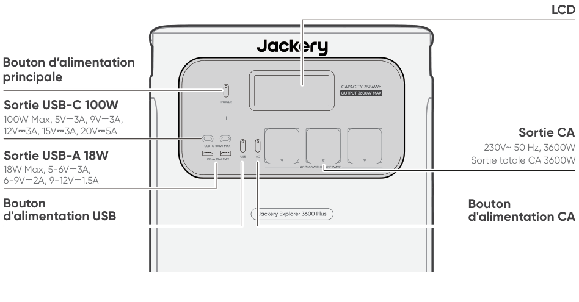
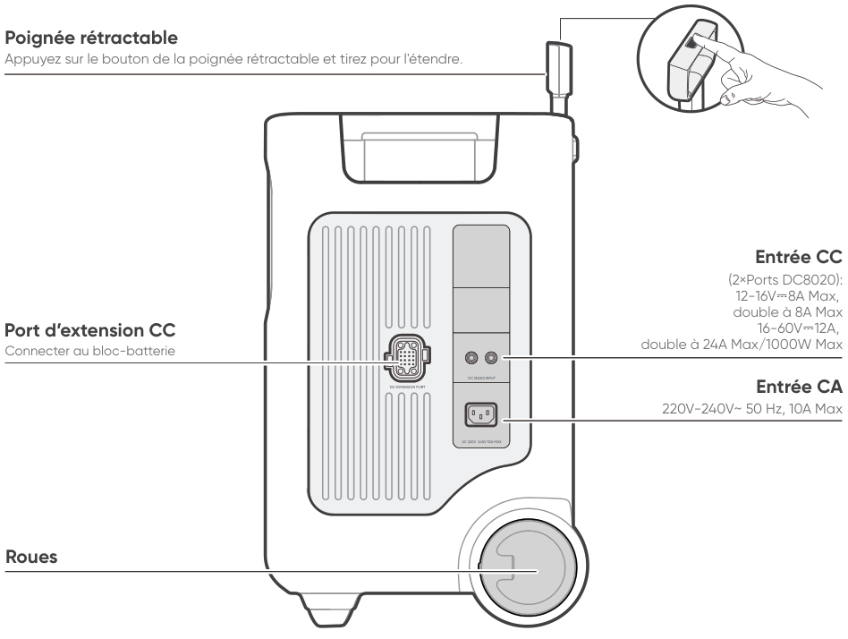

# IMPORTANT

Félicitations d’avoir fait l’acquisition du nouveau Jackery Explorer 3600 Plus. Veuillez lire attentivement ce manuel avant d’utiliser le dispositif, en particulier les précautions à prendre afin de garantir une bonne utilisation. Conservez ce manuel dans un endroit accessible pour pouvoir vous y référer fréquemment.

Conformément aux lois et réglementations, le droit d’interprétation finale de ce document et de tous les documents relatifs à ce produit appartient à l’entreprise.

Veuillez noter qu’aucune autre notification ne sera donnée en cas de mise à jour, de révision ou de résiliation.

# INFORMATIONS DE SÉCURITÉ IMPORTANTES

<table class="manual-callout-table manual-callout-table"><tbody><tr><td class="manual-callout-label">AVERTISSEMENT</td><td class="manual-callout-body">
INSTRUCTIONS CONCERNANT LES RISQUES D’INCENDIE, DE CHOC ÉLECTRIQUE OU DE BLESSURES
</td></tr></tbody></table>

<strong></strong>

<ul><li>
Veuillez lire toutes les instructions avant d'utiliser ce produit.
</li><li>
Ne laissez pas les enfants jouer avec le produit. Une surveillance constante est nécessaire lorsque le produit est utilisé à proximité d’enfants.
</li><li>
Un risque de choc électrique peut survenir si vous utilisez des accessoires qui ne sont pas recommandés ou vendus par des fabricants professionnels.
</li><li>
Lorsque le produit n’est pas utilisé, débranchez le câble d’alimentation de la prise du produit.
</li><li>
Ne démontez pas le produit, cela pourrait entraîner des risques imprévisibles tels qu’un incendie, une explosion ou un choc électrique.
</li><li>
N’utilisez pas le produit si les câbles, les fiches ou les sorties sont endommagés, cela pourrait provoquer un choc électrique.
</li><li>
Pour garantir une bonne circulation de l’air, ne bloquez pas les orifices de ventilation du produit. Le produit doit être utilisé dans un endroit bien ventilé, frais et sec pour éviter toute surchauffe. -Recharger dans un endroit humide ou mal ventilé peut présenter des risques pour la sécurité. -L’eau peut provoquer un court-circuit ou endommager le chargeur, entraînant ainsi des risques de sécurité.
</li><li>
N’exposez pas le produit au feu, à des températures élevées, à la lumière directe du soleil ou à des environnements très chauds (par exemple, à l’intérieur d’un véhicule garé). Une telle exposition pourrait entraîner un incendie ou une explosion.
</li></ul>

## INSTRUCTIONS D’ENTRETIEN PAR L’UTILISATEUR

Au cours du cycle des produits de stockage d'énergie, une certaine dégradation de la capacité et de l'énergie se produira. À mesure que le nombre de cycles d'utilisation augmente et que la durée de stockage s'allonge, cette dégradation s'intensifiera progressivement, ce qui est un phénomène normal conforme au modèle de vieillissement naturel des cellules de batterie.

# SIGNIFICATION DES SYMBOLES

<figure aria-label="SIGNIFICATION DES SYMBOLES" class="hb-symbol-signal-composition" data-component-id="HB-TABLE-SYMBOL-SIGNAL"><table class="hb-symbol-signal-table"><colgroup><col class="hb-symbol-signal-col-label"/><col class="hb-symbol-signal-col-meaning"/></colgroup><thead><tr><th class="hb-symbol-signal-label-heading" scope="col">Symbole</th><th class="hb-symbol-signal-meaning-heading" scope="col">Signification</th></tr></thead><tbody><tr><td class="hb-symbol-signal-label-cell">⚠AVERTISSEMENT</td><td class="hb-symbol-signal-meaning-cell">Pratiques dangereuses pouvant entraîner des blessures graves, la mort et/ou des dommages matériels.</td></tr><tr><td class="hb-symbol-signal-label-cell">⚠ATTENTION</td><td class="hb-symbol-signal-meaning-cell">Pratiques dangereuses pouvant entraîner des blessures corporelles et/ou des dommages matériels.</td></tr><tr><td class="hb-symbol-signal-label-cell">⚠REMARQUE</td><td class="hb-symbol-signal-meaning-cell">Pratiques dangereuses pouvant entraîner des dommages à l'équipement, une perte de données, une détérioration des performances ou des résultats inattendus.</td></tr><tr><td class="hb-symbol-signal-label-cell">⚠CONSEILS</td><td class="hb-symbol-signal-meaning-cell">Complémente les informations importantes ou les conseils d'utilisation dans le texte.</td></tr></tbody></table></figure>

<figure aria-label="SIGNIFICATION DES SYMBOLES" class="hb-symbol-pair-composition" data-component-id="HB-TABLE-SYMBOL-ICON">

<table class="hb-symbol-panel-table"><colgroup><col class="hb-symbol-col-icon"/><col class="hb-symbol-col-meaning"/></colgroup><thead><tr><th class="hb-symbol-icon-heading" scope="col">Symbole</th><th class="hb-symbol-meaning-heading" scope="col">Signification</th></tr></thead><tbody><tr><td class="hb-symbol-icon"></td><td class="hb-symbol-meaning">Mlise en garde! Le non-respect des messages d'avertissement peut entraîner des blessures.</td></tr><tr><td class="hb-symbol-icon"></td><td class="hb-symbol-meaning">Lire le manuel de l'opérateur</td></tr><tr><td class="hb-symbol-icon"></td><td class="hb-symbol-meaning">Ne démontez pas le produit.</td></tr><tr><td class="hb-symbol-icon"></td><td class="hb-symbol-meaning">Ne pas fumer ni utiliser de flamme nue</td></tr><tr><td class="hb-symbol-icon"></td><td class="hb-symbol-meaning">Les enfants ne sont pas admis</td></tr><tr><td class="hb-symbol-icon"></td><td class="hb-symbol-meaning">Ce symbole indique que le produit contient une batterie lithium-ion (Li-ion), qui doit être éliminée ou recyclée de manière appropriée.</td></tr></tbody></table>

<table class="hb-symbol-panel-table"><colgroup><col class="hb-symbol-col-icon"/><col class="hb-symbol-col-meaning"/></colgroup><thead><tr><th class="hb-symbol-icon-heading" scope="col">Symbole</th><th class="hb-symbol-meaning-heading" scope="col">Signification</th></tr></thead><tbody><tr><td class="hb-symbol-icon"></td><td class="hb-symbol-meaning">Les piles et accumulateurs ne doivent pas être jetés avec les ordures ménagères. En tant que consommateur, vous êtes légalement tenu de déposer toutes les piles et accumulateurs dans des points de collecte désignés, qu'ils contiennent ou non des substances dangereuses. Veuillez rapporter les piles et accumulateurs usagés à un point de collecte local, un centre de recyclage ou au détaillant où ils ont été achetés. Une élimination appropriée garantit un recyclage respectueux de l'environnement et prévient les dommages potentiels pour la santé humaine et l'environnement.</td></tr><tr><td class="hb-symbol-icon"></td><td class="hb-symbol-meaning">Ce symbole indique que le produit ne doit pas être jeté avec les ordures ménagères. Il doit être apporté à un point de collecte désigné pour un recyclage approprié. Une élimination et un recyclage corrects contribuent à la protection de l’environnement. Pour plus d’informations, veuillez contacter votre autorité locale, le service de gestion des déchets ou le revendeur du produit.</td></tr></tbody></table>

</figure>

# CONTENU DE LA BOÎTE

<figure aria-label="CONTENU DE LA BOÎTE" class="hb-inbox-composition" data-card-count="3" data-component-id="HB-SPECIAL-INBOX" data-inbox-variant="three-card-responsive"><ol class="hb-inbox-grid"><li class="hb-inbox-card" data-item-number="1">

Jackery Explorer 3600 Plus

</li><li class="hb-inbox-card" data-item-number="2">

Câble de charge CA

</li><li class="hb-inbox-card" data-item-number="3">

Manuel de l’utilisateur

</li></ol>

CONSEILS

Le câble de chargement pour voiture n’est pas inclus, mais peut être acheté séparément sur notre site Web. Pour obtenir de l’aide, veuillez contacter le service à la clientèle de Jackery.

</figure>

# APERÇU DU PRODUIT

## VUE DE FACE

<figure class="hb-reference-figure" data-component-id="HB-SPECIAL-REFERENCE-FIGURE" data-reference-id="overview-front" data-source-fragment-sha256="15a548431367fb50a74f6d6f74661f3ed566948a73754381f11cbeeb1ac0cf45">

</figure>

## VUE LATÉRALE DROITE

<figure class="hb-reference-figure" data-component-id="HB-SPECIAL-REFERENCE-FIGURE" data-reference-id="overview-right" data-source-fragment-sha256="a9cf43ee987fb764f4be52513fcb2b17ff6db00885337faaa8a98aafafbe58d6">

</figure>

# AFFICHAGE LCD

<figure class="hb-reference-figure" data-component-id="HB-SPECIAL-REFERENCE-FIGURE" data-reference-id="lcd-map" data-source-fragment-sha256="640b6abb185044716a1efcdff7d674742af1e3ee4c8a7ca2f6e386fca1aa90ec">

</figure>

<figure aria-label="AFFICHAGE LCD" class="hb-lcd-table-composition" data-component-id="HB-TABLE-LCD-ICON" tabindex="0"><table class="hb-lcd-icon-table"><colgroup><col class="hb-lcd-col-number"/><col class="hb-lcd-col-icon"/><col class="hb-lcd-col-name"/><col class="hb-lcd-col-description"/></colgroup><tbody><tr><td class="hb-lcd-number">1</td><td class="hb-lcd-icon"></td><td class="hb-lcd-name">Wi-Fi</td><td class="hb-lcd-description">
Allumé : Wi-Fi connecté. Clignotant : Prêt à se connecter au Wi-Fi. Éteint : Wi-Fi déconnecté.
</td></tr><tr><td class="hb-lcd-number">2</td><td class="hb-lcd-icon"></td><td class="hb-lcd-name">Bluetooth</td><td class="hb-lcd-description">
Allumé : Bluetooth connecté. Clignotant : Prêt à se connecter au Bluetooth. Éteint : Bluetooth déconnecté.
</td></tr><tr><td class="hb-lcd-number">3</td><td class="hb-lcd-icon"></td><td class="hb-lcd-name">Mode de Charge Silencieuse</td><td class="hb-lcd-description">
Allumé : Le bruit pendant la charge est considérablement réduit, tandis que la puissance de charge est diminuée et la vitesse de charge ralentit. Éteint : Le mode de charge silencieuse est désactivé. Activez/désactivez cette fonction dans l'application Jackery.
</td></tr><tr><td class="hb-lcd-number" rowspan="2">4</td><td class="hb-lcd-icon"></td><td class="hb-lcd-name">Mode d’Économie de Batterie</td><td class="hb-lcd-description">
Allumé : Limite la capacité maximale utilisable de la batterie pour prolonger sa durée de vie. Éteint : Le mode d'économie de batterie est désactivé. Activez/désactivez cette fonction dans l'application Jackery. Cette fonction n'est pas disponible lorsque le produit est connecté à des blocs-batteries.
</td></tr><tr><td class="hb-lcd-icon"></td><td class="hb-lcd-name">Mode Autonome</td><td class="hb-lcd-description">
Maximise l’utilisation de l’énergie solaire et réduit la dépendance à l’électricité du réseau en donnant la priorité à l’énergie solaire stockée, ce qui diminue les coûts d’électricité (veuillez activer/désactiver cette fonction dans l’application). La station d’énergie doit être connectée simultanément aux panneaux solaires et au réseau, la puissance de charge étant limitée par la puissance de dérivation.
</td></tr><tr><td class="hb-lcd-number">5</td><td class="hb-lcd-icon"></td><td class="hb-lcd-name">Plan de Charge</td><td class="hb-lcd-description">
Personnalisez le temps de charge du Jackery Explorer 3600 Plus. Adapté aux situations avec des tarifs d’électricité variables, il permet d’établir des plans de charge en fonction des heures pleines et creuses, afin de réduire les coûts d’électricité (veuillez configurer cette fonction dans l’application Jackery).
</td></tr><tr><td class="hb-lcd-number">6</td><td class="hb-lcd-icon"></td><td class="hb-lcd-name">Indicateur d'alimentation CA</td><td class="hb-lcd-description">
La sortie CA (onde sinusoïdale pure) est activée.
</td></tr><tr><td class="hb-lcd-number">7</td><td class="hb-lcd-icon"></td><td class="hb-lcd-name">Tension et fréquence de sortie</td><td class="hb-lcd-description">
Affiche la tension et la fréquence de sortie lorsque la sortie CA est activée.
</td></tr><tr><td class="hb-lcd-number">8</td><td class="hb-lcd-icon"></td><td class="hb-lcd-name">Puissance d’Entrée</td><td class="hb-lcd-description">
Affiche la puissance d'entrée en watts.
</td></tr><tr><td class="hb-lcd-number">9</td><td class="hb-lcd-icon"></td><td class="hb-lcd-name">Temps de Charge Restant</td><td class="hb-lcd-description">
Affiche le temps de charge restant.
</td></tr><tr><td class="hb-lcd-number">10</td><td class="hb-lcd-icon"></td><td class="hb-lcd-name">Indicateur de Charge sur Prise Murale CA</td><td class="hb-lcd-description">
Le produit est chargé via l'entrée CA en utilisant l'énergie du réseau.
</td></tr><tr><td class="hb-lcd-number">11</td><td class="hb-lcd-icon"></td><td class="hb-lcd-name">Indicateur de Charge Voiture</td><td class="hb-lcd-description">
Le produit est chargé via l’entrée CC (DC8020) en utilisant du CC 12V (charge via voiture).
</td></tr><tr><td class="hb-lcd-number">12</td><td class="hb-lcd-icon"></td><td class="hb-lcd-name">Indicateur de Charge Solaire</td><td class="hb-lcd-description">
Le produit est chargé via l’entrée CC (DC8020) à l’aide de panneaux solaires.
</td></tr><tr><td class="hb-lcd-number">13</td><td class="hb-lcd-icon"></td><td class="hb-lcd-name">Indicateur de Puissance de la Batterie</td><td class="hb-lcd-description">
Lorsque le produit est en charge, le cercle orange autour du pourcentage de batterie s’allume en séquence. Lorsqu’il charge d’autres appareils, le cercle orange reste allumé.
</td></tr><tr><td class="hb-lcd-number">14</td><td class="hb-lcd-icon"></td><td class="hb-lcd-name">Indicateur de Batterie Faible</td><td class="hb-lcd-description">
Allumé : Le niveau de la batterie est inférieur à 20 %. Clignotant : Le niveau de la batterie est inférieur à 5 %. Éteint : Le niveau de la batterie n'est pas inférieur à 20 % ou le produit est en charge.
</td></tr><tr><td class="hb-lcd-number">15</td><td class="hb-lcd-icon"></td><td class="hb-lcd-name">Pourcentage de Batterie Restant</td><td class="hb-lcd-description">
Affiche le pourcentage de batterie restant.
</td></tr><tr><td class="hb-lcd-number">16</td><td class="hb-lcd-icon"></td><td class="hb-lcd-name">Témoin d’état de batterie et nombre de batteries connectées</td><td class="hb-lcd-description">
Indique que le produit est connecté au nombre spécifié de blocs-batterie 3600.
</td></tr><tr><td class="hb-lcd-number">17</td><td class="hb-lcd-icon"></td><td class="hb-lcd-name">Code d’erreur</td><td class="hb-lcd-description">
Une erreur produit s’est produite. Veuillez consulter la section « Dépannage » pour plus de détails.
</td></tr><tr><td class="hb-lcd-number" rowspan="2">18</td><td class="hb-lcd-icon"></td><td class="hb-lcd-name">Indicateur de Température Élevée</td><td class="hb-lcd-description">
La protection contre les températures élevées est déclenchée. Le produit peut cesser de fonctionner jusqu'à ce que sa température revienne dans la plage de fonctionnement normale.
</td></tr><tr><td class="hb-lcd-icon"></td><td class="hb-lcd-name">Indicateur de Basse Température</td><td class="hb-lcd-description">
La protection contre les basses températures est déclenchée. Le produit peut cesser de fonctionner jusqu'à ce que sa température revienne dans la plage de fonctionnement normale.
</td></tr><tr><td class="hb-lcd-number">19</td><td class="hb-lcd-icon"></td><td class="hb-lcd-name">Mode d’Économie d’Énergie</td><td class="hb-lcd-description">
Lorsque la sortie CA ou CC est activée en appuyant sur le bouton d'alimentation CA ou USB : Allumé : Mode d'économie d'énergie activé. Éteint : Mode d'économie d'énergie désactivé.
</td></tr><tr><td class="hb-lcd-number">20</td><td class="hb-lcd-icon"></td><td class="hb-lcd-name">Puissance de Sortie</td><td class="hb-lcd-description">
Affiche la puissance de sortie en watts.
</td></tr><tr><td class="hb-lcd-number">21</td><td class="hb-lcd-icon"></td><td class="hb-lcd-name">Temps de Décharge Restant</td><td class="hb-lcd-description">
Affiche le temps de décharge restant.
</td></tr></tbody></table></figure>

# FONCTIONNEMENT

## MARCHE/ARRÊT

<figure class="hb-reference-figure hb-base-art-live-copy" data-component-id="HB-SPECIAL-REFERENCE-FIGURE" data-reference-id="operation-main-power" data-source-fragment-sha256="9402cbf209f888f403239e7c5f455a634356e757572b7c8bd38e0218748727d5" data-web-base-art-ref="operation-main-power" data-web-presentation-mode="base-art-live-copy">

Marche Appuyez une foisArrêt Appuyez et maintenez pendant 3 secondesTemps de veille par défaut : 2 heures Le produit s’éteindra automatiquement après 2 heures d’inactivité, sans charge ni décharge. *Le temps de veille peut être réglé dans l'application Jackery.Lorsque le mode Économie d'énergie est activé, le produit s'éteindra automatiquement après 12 heures si le bouton d'alimentation CA ou USB est allumé mais que le produit ne charge ni ne décharge.

</figure>

## SORTIE USB MARCHE/ARRÊT

<figure class="hb-operation-figure hb-operation-layout-status-right hb-base-art-live-copy" data-component-id="HB-SPECIAL-OPERATION" data-operation-id="dc-usb-output" data-source-fragment-sha256="ea5eff14570d550d2e1cbc59f8d9342fdd595ebb505cd707ce60e7ba48da373c" data-web-base-art-ref="operation/dc_usb_output" data-web-presentation-mode="base-art-live-copy" data-web-replace-key="operation.dc-usb-output">

<strong>Prérequis :</strong> Le produit est allumé.

<strong>Marche</strong>

Appuyez une fois

<strong>Arrêt</strong>

Appuyez une fois

</figure>

<table class="manual-callout-table manual-callout-table"><tbody><tr><td class="manual-callout-label">ATTENTION</td><td class="manual-callout-body"><ul><li>
Les port USB-C sont des port de sortie haute puissance USB-PD Source d'alimentation 3 (PS3). Si l'appareil utilisateur ou l'accessoire connecté ne répond pas aux exigences de sécurité, il peut présenter un risque d'incendie. Avant d'utiliser ces ports, assurez-vous que l'appareil ou l'accessoire connecté dispose d'une protection contre les incendies.
</li><li>
Ne connectez le Jackery Explorer 3600Plus qu'à des appareils ou accessoires conformes aux clauses 6.3, 6.4 et 6.5 de la norme IEC/EN/UL 62368-1 (ou autres normes équivalentes).
</li><li>
Pour obtenir la puissance de sortie maximale, utilisez le câble officiel Jackery USB-C vers USB-C 5A (20 V CC/5A, 100 W).
</li></ul></td></tr></tbody></table>

## SORTIE CA MARCHE/ARRÊT

<figure class="hb-operation-figure hb-operation-layout-status-right hb-base-art-live-copy" data-component-id="HB-SPECIAL-OPERATION" data-operation-id="ac-output" data-source-fragment-sha256="a9bbe934fe6aa3a75a5a1300ef340f3f292bdcfe9d67ac3264d103800f5990cb" data-web-base-art-ref="operation/ac_output" data-web-presentation-mode="base-art-live-copy" data-web-replace-key="operation.ac-output">

<strong>Prérequis :</strong> Le produit est allumé.

<strong>Marche</strong>

Appuyez une fois

<strong>Arrêt</strong>

Appuyez une fois

</figure>

## MODE D’ÉCONOMIE D’ÉNERGIE

<figure class="hb-reference-figure hb-base-art-live-copy" data-component-id="HB-SPECIAL-REFERENCE-FIGURE" data-reference-id="operation-energy-saving" data-source-fragment-sha256="21143954cb4ed6ab547de94ed5277ca38746c5fff80c3034f69e7d844e06e95a" data-web-base-art-ref="operation-energy-saving" data-web-presentation-mode="base-art-live-copy">

Pour éviter une consommation inutile de la batterie due à l’oubli de désactiver la sortie, le produit active par défaut le Mode d’Économie d’Énergie. Si aucun appareil n’est connecté ou si la consommation de l’appareil connecté est inférieure à un certain seuil (Sortie CA de 25 W ou sortie USB de 2 W) pendant 12 heures, l’appareil désactivera automatiquement toutes les sorties. Pour désactiver le mode d'économie d'énergie, appuyez et maintenez enfoncé à la fois le bouton d'alimentation CA et le bouton d'alimentation principal pendant plus de 3 secondes. Le produit n'éteindra pas automatiquement la sortie CA ou CC.Bouton d’alimentation principalBouton d’alimentation CAMarche/Arrêt Appuyez et maintenez pendant 3 secondes

</figure>

<table class="manual-callout-table manual-callout-table"><tbody><tr><td class="manual-callout-label">REMARQUE</td><td class="manual-callout-body">
Le mode d'économie d'énergie reprend l'état précédent après l'allumage. Un changement de mode nécessite un commutateur manuel.
</td></tr></tbody></table>

## AFFICHAGE LCD

<figure aria-label="AFFICHAGE LCD" class="hb-lcd-mode-composition" data-component-id="HB-TABLE-LCD-MODE">

<table class="hb-lcd-mode-table"><colgroup><col class="hb-lcd-mode-col-state"/><col class="hb-lcd-mode-col-action"/><col class="hb-lcd-mode-col-copy"/></colgroup><tbody><tr><td class="hb-lcd-mode-state" rowspan="3">Allumer en discontinu</td><td class="hb-lcd-mode-action">Allumer</td><td class="hb-lcd-mode-copy">Appuyez sur le bouton d'alimentation principal ou lorsque le produit est en charge.</td></tr><tr><td class="hb-lcd-mode-action">Éteindre</td><td class="hb-lcd-mode-copy">Appuyez sur le bouton d'alimentation principal.</td></tr><tr><td class="hb-lcd-mode-action">Arrêt automatique</td><td class="hb-lcd-mode-copy">L'écran LCD s'éteint automatiquement et entre en mode veille après 2 minutes d'inactivité.</td></tr><tr><td class="hb-lcd-mode-state" rowspan="3">Allumer en continu (en cours de charge ou de décharge)</td><td class="hb-lcd-mode-action">Allumer</td><td class="hb-lcd-mode-copy">Appuyez deux fois sur le bouton d'alimentation principal lorsque l'écran LCD est allumé.</td></tr><tr><td class="hb-lcd-mode-action">Éteindre</td><td class="hb-lcd-mode-copy">Appuyez sur le bouton d'alimentation principal.</td></tr><tr><td class="hb-lcd-mode-action">Arrêt automatique</td><td class="hb-lcd-mode-copy">L'écran LCD s'éteint automatiquement après 2 heures d'inactivité.</td></tr></tbody></table>
</figure>

Vous pouvez également définir le mode d'affichage de l'écran dans l'application Jackery.

## FONCTIONNEMENT DES BOUTONS

<figure aria-label="Boutons / Utilisation / Fonction" class="hb-key-combination-composition" data-component-id="HB-TABLE-KEY-COMBINATIONS" tabindex="0"><table class="hb-key-combination-table"><colgroup><col class="hb-key-col-buttons"/><col class="hb-key-col-operation"/><col class="hb-key-col-function"/></colgroup><thead><tr><th class="hb-key-buttons" scope="col">Boutons</th><th class="hb-key-operation" scope="col">Utilisation</th><th class="hb-key-function" scope="col">Fonction</th></tr></thead><tbody><tr><td class="hb-key-buttons">Bouton d’alimentation principal + Bouton d’alimentation USB</td><td class="hb-key-operation">Appuyer 3 secondes sur les deux</td><td class="hb-key-function">Réinitialiser le Wi-Fi et le Bluetooth</td></tr><tr><td class="hb-key-buttons">Bouton d’alimentation principal + Bouton d’alimentation CA</td><td class="hb-key-operation">Appuyer 3 secondes sur les deux</td><td class="hb-key-function">Activer/désactiver le mode économie d’énergie</td></tr><tr><td class="hb-key-buttons">Bouton d’alimentation USB + Bouton d’alimentation CA</td><td class="hb-key-operation">Appuyer 1 seconde sur les deux</td><td class="hb-key-function">Activer le Wi-Fi et le Bluetooth</td></tr></tbody></table></figure>

# ALIMENTATION SANS INTERRUPTION (ASI)

Connectez le produit à une prise murale à l’aide du câble de charge CA, puis appuyez sur le bouton d'alimentation CA pour alimenter vos appareils en même temps.

<figure class="hb-reference-figure hb-base-art-live-copy" data-component-id="HB-SPECIAL-REFERENCE-FIGURE" data-reference-id="ups" data-source-fragment-sha256="c560d121cbb661c661f4cd431c5560a941968af6ff64a680d9da9c774340d832" data-web-base-art-ref="ups" data-web-presentation-mode="base-art-live-copy">

Une alimentation sans coupure (UPS) est un système d’alimentation continue qui fournit automatiquement une alimentation électrique de secours à une charge lorsque l’alimentation du réseau principal est interrompue. En cas de perte soudaine de l’alimentation du réseau, le Explorer 3600 Plus basculera automatiquement sur l’alimentation stockée en moins de 10 ms pour maintenir vos appareils en fonctionnement.

</figure>

En mode UPS, la puissance de crête de sortie de l’appareil atteint 10 A avant les coupures de courant. Comme la charge et la décharge simultanées sont activées en mode dérivation, la puissance de sortie réelle est inférieure à la puissance nominale en mode dérivation, mais revient à la puissance nominale lors des coupures.

<table class="manual-callout-table manual-callout-table"><tbody><tr><td class="manual-callout-label">ATTENTION</td><td class="manual-callout-body"><ul><li>
Ce produit ne prend pas en charge un basculement instantané (0 ms). Ne le connectez pas à des équipements nécessitant une alimentation sans interruption, tels que des serveurs de données ou des stations de travail.
</li><li>
Avant toute utilisation, testez plusieurs fois la compatibilité avec votre appareil.
</li><li>
Ne connectez pas de charges dépassant la puissance de sortie maximale du produit. Sinon, la protection contre les surcharges sera déclenchée.
</li></ul></td></tr></tbody></table>

# CONNEXIONS

<h2 class="hb-subbar" id="connecter-aux-packs-batterie-vendu-séparément">CONNECTER AU(X) PACK(S) BATTERIE VENDU SÉPARÉMENT</h2>

Ce produit peut prendre en charge jusqu’à 5 packs batterie pour répondre aux besoins d’une grande capacité énergétique. Pour les détails sur son utilisation, veuillez vous référer au manuel d’utilisation du Jackery Battery Pack 3600.

<figure class="hb-reference-figure hb-base-art-live-copy" data-component-id="HB-SPECIAL-REFERENCE-FIGURE" data-reference-id="battery" data-source-fragment-sha256="9eb3693d55cf1278405a9a142fe59fcb8709f598c8829d2a2212627b119a0cbe" data-web-base-art-ref="battery" data-web-presentation-mode="base-art-live-copy">

≥ 200 mm≥ 200 mm

</figure>

<table class="manual-callout-table manual-callout-table"><tbody><tr><td class="manual-callout-label">ATTENTION</td><td class="manual-callout-body"><ul><li>
Assurez-vous que tous les produits sont éteints avant de connecter le Explorer 3600 Plus au(x) Jackery Battery Pack 3600.
</li><li>
Pour assurer le bon fonctionnement du produit, assurez-vous que les entrées et sorties d'air sur les deux côtés ne sont pas obstruées. Laissez un espace d'au moins 200 mm entre les ouvertures et tout objet pour permettre une dissipation thermique adéquate.
</li></ul></td></tr></tbody></table>

<figure class="hb-reference-figure hb-base-art-live-copy" data-component-id="HB-SPECIAL-REFERENCE-FIGURE" data-reference-id="battery-accessories" data-source-fragment-sha256="36deb0f15e382c280c59b67bdc9ad6e9f26b1cab7f59876faf35c00cc38fb1eb" data-web-base-art-ref="battery-accessories" data-web-presentation-mode="base-art-live-copy">

Jackery Battery Pack 3600Câble de rallongeManuel d’utilisationVendu séparément

</figure>

# CHARGE

<strong>L'énergie verte d'abord :</strong> nous préconisons l'utilisation de l'énergie verte en premier. Ce produit prend en charge deux modes de recharge simultanés : la recharge solaire et la recharge par prise murale CA. Quand la recharge par prise murale CA et la recharge solaire sont effectuées en même temps, le produit privilégie la recharge solaire. Les deux méthodes sont utilisées pour charger la batterie à la puissance maximalement autorisée.

Chargez complètement le produit avant sa première utilisation.

<table class="manual-callout-table manual-callout-table"><tbody><tr><td class="manual-callout-label">Remarque</td><td class="manual-callout-body"><ul><li>
La température de charge recommandée pour le produit est comprise entre -20°C à 45°C, et la température de décharge est comprise entre -20°C à 45°C. Utiliser le produit en dehors de cette plage de températures peut limiter ses capacités de charge et de décharge, voire empêcher la charge ou la décharge.
</li><li>
La puissance de charge et la capacité de la batterie du produit peuvent varier en raison des fluctuations de température.
</li></ul></td></tr></tbody></table>

## CHARGEMENT PAR PRISE MURALE CA

<figure class="hb-reference-figure hb-base-art-live-copy" data-component-id="HB-SPECIAL-REFERENCE-FIGURE" data-reference-id="charging-ac" data-source-fragment-sha256="c43afa995060171a0c87a7cf329ca549f10e41538cc5c52d9a1855f11a561e46" data-web-base-art-ref="charging-ac" data-web-presentation-mode="base-art-live-copy">

Connectez le câble de charge CA au port d’entrée CA de l’appareil et à une prise murale.

</figure>

<table class="manual-callout-table manual-callout-table"><tbody><tr><td class="manual-callout-label">ATTENTION</td><td class="manual-callout-body">
Assurez-vous que le câble de charge CA est entièrement et solidement inséré dans le port d’entrée CA. Une connexion incomplète peut entraîner un courant instable, une surchauffe, un mauvais contact ou un dysfonctionnement de l’appareil.
</td></tr></tbody></table>

<h2 class="hb-subbar" id="chargement-par-panneaux-solaires-vendu-séparément">CHARGEMENT PAR PANNEAUX SOLAIRES VENDU SÉPARÉMENT</h2>

Le Jackery Explorer 3600 Plus dispose de deux ports d’entrée DC8020 et est compatible avec les panneaux solaires de la Jackery. Si un seul port d’entrée DC8020 doit être connecté à deux panneaux solaires simultanément, veuillez vous référer au schéma ci-dessous pour le branchement via le connecteur de panneau solaire (vendu séparément, non inclus en standard).

<figure class="hb-reference-figure hb-base-art-live-copy" data-component-id="HB-SPECIAL-REFERENCE-FIGURE" data-reference-id="charging-solar" data-source-fragment-sha256="b19d8622a4150edbc36830bc842910b6f17d60391198e798de99655bb462bf8b" data-web-base-art-ref="charging-solar" data-web-presentation-mode="base-art-live-copy">

SolarSaga 200 × 4

</figure>

<table class="manual-callout-table manual-callout-table"><tbody><tr><td class="manual-callout-label">ATTENTION</td><td class="manual-callout-body">
Un port d'entrée DC8020 peut être connecté à un maximum de deux panneaux solaires.
</td></tr></tbody></table>

<table class="manual-callout-table manual-callout-table"><tbody><tr><td class="manual-callout-label">ATTENTION</td><td class="manual-callout-body"><ul><li>
Assurez-vous que la tension d'entrée pour les deux ports d'entrée CC est la même. Sinon, le produit pourrait être endommagé. Par exemple:
</li><li>
Il est recommandé d'utiliser le même modèle de panneaux solaires Jackery et le même nombre de panneaux lors de la connexion des panneaux solaires aux deux ports d'entrée DC8020.
</li><li>
Ne chargez pas le produit à la fois avec un chargeur de voiture et un panneau solaire simultanément. Cela pourrait faire sauter le fusible de la voiture ou entraîner un échec de la charge.
</li></ul></td></tr></tbody></table>

Il est recommandé d’utiliser le panneau solaire Jackery pour charger le HomePower 3600 Plus. Si vous choisissez des panneaux solaires d'autres marques, assurez-vous que leur tension en circuit ouvert (Voc) est comprise dans la plage d'entrée CC (16V-60V) du HomePower 3600 Plus. Jackery décline toute responsabilité en cas de pertes causées par l’utilisation de panneaux solaires d’autres marques.

<h2 class="hb-subbar" id="chargement-par-prise-de-voiture-vendu-séparément">CHARGEMENT PAR PRISE DE VOITURE VENDU SÉPARÉMENT</h2>

Ce produit peut être chargé à l’aide d’un chargeur de voiture 12 V. Assurez-vous que le chargeur allume-cigare et l’allume-cigare de la voiture sont bien branchés.

<figure class="hb-reference-figure hb-base-art-live-copy" data-component-id="HB-SPECIAL-REFERENCE-FIGURE" data-reference-id="charging-car" data-source-fragment-sha256="6d6ad374f156997aee0efae67fb16ae91d1c29fb94238f736ee5a40d705e970e" data-web-base-art-ref="charging-car" data-web-presentation-mode="base-art-live-copy">

Vehicle*The car charging cable is sold separately.

</figure>

<table class="manual-callout-table manual-callout-table"><tbody><tr><td class="manual-callout-label">ATTENTION</td><td class="manual-callout-body"><ul><li>
Veuillez démarrer le véhicule avant de charger votre station d'alimentation.
</li><li>
Si le véhicule roule sur des routes accidentées, il est interdit d'utiliser le chargeur de voiture afin d'éviter tout risque de surchauffe dû à une mauvaise connexion. La société ne sera pas responsable des pertes causées par une utilisation non conforme.
</li><li>
La charge par véhicule est uniquement applicable aux véhicules en 12 V CC, pas en 24 V CC. Veuillez ne pas charger ce produit dans un véhicule 24 V afin d'éviter tout risque de blessure ou de dommage matériel.
</li></ul></td></tr></tbody></table>

# STOCKAGE

Conservez le produit dans un endroit propre et sec avec une ventilation adéquate.Température et humidité de stockage :
<ul class="hb-source-storage-copy" style="margin:0"><li class="hb-source-storage-item" style="margin:0">
1 mois : -20°C à 45°C (0-60% HR)
</li><li class="hb-source-storage-item" style="margin:0">
3 mois : 0°C à 45°C (0-60% HR)
</li><li class="hb-source-storage-item" style="margin:0">
12 mois : 0°C à 25°C (0-60% HR)
</li></ul>
Si ce produit est stocké pendant une longue période (3 à 6 mois) avec la batterie déchargée, il peut devenir impossible de le recharger. Pour éviter cela et préserver la santé de la batterie, il est recommandé de vérifier et de recharger le produit tous les trois mois, et d'effectuer un cycle de charge et de décharge complet au moins une fois tous les 6 à 12 mois.

# DÉPANNAGE

Si l'un des codes d'erreur suivants apparaît, suivez les actions correctives indiquées pour résoudre le problème.Si l'erreur persiste, veuillez contacter le service à la clientèle de Jackery.

<figure aria-label="Code d'erreur / Mesures correctives" class="hb-troubleshooting-composition" data-component-id="HB-TABLE-TROUBLESHOOTING" tabindex="0"><table class="hb-troubleshooting-table"><colgroup><col class="hb-troubleshooting-col-code"/><col class="hb-troubleshooting-col-measures"/></colgroup><thead><tr><th class="hb-troubleshooting-code" scope="col">Code d'erreur</th><th class="hb-troubleshooting-measures" scope="col">Mesures correctives</th></tr></thead><tbody><tr><td class="hb-troubleshooting-code">F0</td><td class="hb-troubleshooting-measures">Redémarrez le produit.</td></tr><tr><td class="hb-troubleshooting-code">F1</td><td class="hb-troubleshooting-measures">Redémarrez le produit.</td></tr><tr><td class="hb-troubleshooting-code">F2</td><td class="hb-troubleshooting-measures">Redémarrez le produit.</td></tr><tr><td class="hb-troubleshooting-code">F3</td><td class="hb-troubleshooting-measures">Redémarrez le produit.</td></tr><tr><td class="hb-troubleshooting-code">F4</td><td class="hb-troubleshooting-measures">Connectez le produit à des charges pour décharger sa batterie jusqu'à ce que l'erreur disparaisse.</td></tr><tr><td class="hb-troubleshooting-code">F5</td><td class="hb-troubleshooting-measures">Chargez le produit via des panneaux solaires ou une prise murale CA jusqu'à ce que l'erreur disparaisse.</td></tr><tr><td class="hb-troubleshooting-code">F6</td><td class="hb-troubleshooting-measures">1. Attendez que le réseau se normalise avant de charger le produit via une prise murale CA. 2. Vérifiez si les entrées et sorties d'air sont obstruées; assurez un espace de 20 cm de chaque côté du produit. 3. Placez le produit dans un endroit qui n'est pas exposé à la lumière directe du soleil ou à des températures ambiantes élevées. 4. Déconnectez toutes les charges du produit. Laissez le produit inactif et attendez que l'erreur disparaisse. 5. Redémarrez le produit.</td></tr><tr><td class="hb-troubleshooting-code">F7</td><td class="hb-troubleshooting-measures">1. Retirez toutes les entrées CC du produit. 2. Vérifiez la tension en circuit ouvert (Voc) des panneaux solaires connectés. Le produit autorise une tension d'entrée CC maximale de 60V. 3. Redémarrez le produit et laissez-le inactif. Attendez que l'erreur disparaisse.</td></tr><tr><td class="hb-troubleshooting-code">F8</td><td class="hb-troubleshooting-measures">Contacter le service à la clientèle de Jackery.</td></tr><tr><td class="hb-troubleshooting-code">F9</td><td class="hb-troubleshooting-measures">Retirez la charge connectée aux ports USB du produit.Attendez que l'erreur disparaisse.</td></tr><tr><td class="hb-troubleshooting-code">FA</td><td class="hb-troubleshooting-measures">1. Éteignez la sortie CA des deux unités. 2. Appuyez à nouveau sur le bouton d'alimentation CA de chaque unité dans un délai d'une minute.</td></tr><tr><td class="hb-troubleshooting-code">FC</td><td class="hb-troubleshooting-measures">1. Redémarrez respectivement les batteries et le Explorer 3600 Plus. 2. Si l'erreur persiste, déconnectez la batterie du Explorer 3600 Plus et reconnectez-les.</td></tr></tbody></table></figure>

# SPÉCIFICATIONS

<h2 aria-level="2" role="heading">INFORMATIONS GÉNÉRALES</h2><figure aria-label="INFORMATIONS GÉNÉRALES" class="hb-spec-table-composition"><table class="manual-table manual-spec-table hb-spec-table"><colgroup><col class="hb-spec-col-label"/><col class="hb-spec-col-value"/></colgroup><tbody><tr><th class="manual-spec-label hb-spec-label" scope="row">Nom du produit</th><td class="manual-spec-value hb-spec-value">Jackery Explorer 3600 Plus</td></tr><tr><th class="manual-spec-label hb-spec-label" scope="row">N° modèle</th><td class="manual-spec-value hb-spec-value">JE-3600A</td></tr><tr><th class="manual-spec-label hb-spec-label" scope="row">Capacité</th><td class="manual-spec-value hb-spec-value">80Ah / 44.8V DC (3584 Wh)</td></tr><tr><th class="manual-spec-label hb-spec-label" scope="row">Cellule Chimique</th><td class="manual-spec-value hb-spec-value">LiFePO₄</td></tr><tr><th class="manual-spec-label hb-spec-label" scope="row">Poids</th><td class="manual-spec-value hb-spec-value">Environ 35 kg</td></tr><tr><th class="manual-spec-label hb-spec-label" scope="row">Dimensions</th><td class="manual-spec-value hb-spec-value">38,5×30,9×49,1 cm</td></tr><tr><th class="manual-spec-label hb-spec-label" scope="row">Durée de vie</th><td class="manual-spec-value hb-spec-value">Capacité de 6000 cycles à 70 % ou plus</td></tr><tr><th class="manual-spec-label hb-spec-label" scope="row">IEC code</th><td class="manual-spec-value hb-spec-value">IFpR41/136[14S4P]M/-20+40/90</td></tr></tbody></table></figure><h2 aria-level="2" role="heading">PORTS D’ENTRÉE</h2><figure aria-label="PORTS D’ENTRÉE" class="hb-spec-table-composition"><table class="manual-table manual-spec-table hb-spec-table"><colgroup><col class="hb-spec-col-label"/><col class="hb-spec-col-value"/></colgroup><tbody><tr><th class="manual-spec-label hb-spec-label" scope="row">1 × Entrée CA</th><td class="manual-spec-value hb-spec-value">Mode charge : 220-240V~ 50Hz, 10A Max</td></tr><tr><th class="manual-spec-label hb-spec-label" scope="row">1 × Entrée CA</th><td class="manual-spec-value hb-spec-value">Mode dérivation① : 220-240V~ 50Hz, 10A Max</td></tr><tr><th class="manual-spec-label hb-spec-label" scope="row">2 × Ports DC8020</th><td class="manual-spec-value hb-spec-value">12-16V⎓8A Max, double à 8A Max</td></tr><tr><th class="manual-spec-label hb-spec-label" scope="row">2 × Ports DC8020</th><td class="manual-spec-value hb-spec-value">16-60V⎓12A, double à 24A Max/1000W Max</td></tr><tr><th class="manual-spec-label hb-spec-label" scope="row">1 × Port d’extension CC</th><td class="manual-spec-value hb-spec-value">36,4V-50,4V⎓100A Max</td></tr></tbody></table></figure><h2 aria-level="2" role="heading">PORTS DE SORTIE</h2><figure aria-label="PORTS DE SORTIE" class="hb-spec-table-composition"><table class="manual-table manual-spec-table hb-spec-table"><colgroup><col class="hb-spec-col-label"/><col class="hb-spec-col-value"/></colgroup><tbody><tr><th class="manual-spec-label hb-spec-label" scope="row">3 × Sortie CA</th><td class="manual-spec-value hb-spec-value">230V~ 50Hz, 3600W</td></tr><tr><th class="manual-spec-label hb-spec-label" scope="row">Sortie totale CA②</th><td class="manual-spec-value hb-spec-value">3600W Rated, 7200W crête</td></tr><tr><th class="manual-spec-label hb-spec-label" scope="row">Sortie CA en mode dérivation①</th><td class="manual-spec-value hb-spec-value">220-240V~ 50Hz, 10A Max</td></tr><tr><th class="manual-spec-label hb-spec-label" scope="row">2 × Sortie USB-C 100W</th><td class="manual-spec-value hb-spec-value">100W Max, 5V⎓3A, 9V⎓3A, 12V⎓3A, 15V⎓3A, 20V⎓5A</td></tr><tr><th class="manual-spec-label hb-spec-label" scope="row">2 × Sortie USB-A 18W</th><td class="manual-spec-value hb-spec-value">18W Max, 5-6V⎓3A, 6-9V⎓2A, 9-12V⎓1.5A</td></tr><tr><th class="manual-spec-label hb-spec-label" scope="row">1 × Port d’extension CC</th><td class="manual-spec-value hb-spec-value">36,4V-50,4V⎓60A Max</td></tr></tbody></table></figure><h2 aria-level="2" role="heading">TEMPÉRATURE DE FONCTIONNEMENT</h2><figure aria-label="TEMPÉRATURE DE FONCTIONNEMENT" class="hb-spec-table-composition"><table class="manual-table manual-spec-table hb-spec-table"><colgroup><col class="hb-spec-col-label"/><col class="hb-spec-col-value"/></colgroup><tbody><tr><th class="manual-spec-label hb-spec-label" scope="row">Température de charge</th><td class="manual-spec-value hb-spec-value">-20°C à 45°C</td></tr><tr><th class="manual-spec-label hb-spec-label" scope="row">Température de décharge</th><td class="manual-spec-value hb-spec-value">-20°C à 45°C</td></tr></tbody></table></figure>

※ USB Type-C® et USB-C® sont des marques déposées de USB Implementers Forum.

① Le produit peut charger la batterie à partir d'une prise murale CA tout en fournissant de l'énergie via les ports de sortie CA.

② Indique que deux ports de sortie CA ou plus fonctionnent ensemble.

# GARANTIE

<figure aria-label="GARANTIE" class="hb-warranty-intro-composition" data-component-id="HB-WARRANTY-LEAD">

<strong>Nous ne fournissons notre garantie qu'aux clients qui achètent sur le site officiel de Jackery, sur des plateformes tierces portant la marque Jackery, ou auprès de revendeurs autorisés locaux.</strong>

*La durée et les détails de la garantie peuvent varier en fonction des lois, réglementations et revendeurs autorisés locaux.

</figure>

## Garantie limitée

<figure aria-label="Garantie limitée" class="hb-warranty-card" data-component-id="HB-WARRANTY-SECTION" data-warranty-card-index="1">
Jackery garantit à l'acheteur et consommateur d'origine que le produit de Jackery sera exempt de tout défaut de fabrication et de matériaux dans le cadre d'une utilisation normale pendant toute la durée de la période de garantie applicable identifiée dans la section « Période de garantie » ci-dessous, sous réserve des exceptions énoncées ci-dessous. Cette déclaration de garantie énonce les obligations totales et exclusives de garantie de Jackery. Nous n'assumerons pas et nous n'autorisons personne à assumer pour nous toute autre responsabilité en lien avec la vente de nos produits.
</figure>

## Période de garantie

<figure aria-label="Période de garantie" class="hb-warranty-period-card" data-component-id="HB-WARRANTY-YEARS">

3
<strong class="hb-warranty-years-unit">ANS</strong><strong class="hb-warranty-period-label">Garantie standard</strong>

La période de garantie standard du Jackery Explorer 3600 Plus est de 36 mois. Dans tous les cas, la période de garantie commence à compter de la date d'achat par l'acheteur et consommateur d'origine. La facture du premier achat du consommateur ou toute autre preuve documentaire raisonnable est nécessaire afin d'établir la date de début de la période de garantie.

2
<strong class="hb-warranty-years-unit">ANS</strong><strong class="hb-warranty-period-label">Garantie prolongée</strong>

Pour activer l'extension de garantie, vous devez enregistrer votre produit en ligne ou bien contacter notre service client à hello.eu@jackery.com afin de prolonger la durée de la garantie standard.

</figure>

## Échanger

<figure aria-label="Échanger" class="hb-warranty-card" data-component-id="HB-WARRANTY-SECTION" data-warranty-card-index="2">
Jackery remplacera (aux frais de Jackery) tout produit Jackery qui ne fonctionne pas pendant la période de garantie applicable en raison d’un défaut de fabrication ou de matériau. Un produit de remplacement bénéficie de la garantie restante du produit d’origine.
</figure>

## Limitée à l'acheteur et consommateur d'origine

<figure aria-label="Limitée à l'acheteur et consommateur d'origine" class="hb-warranty-card" data-component-id="HB-WARRANTY-SECTION" data-warranty-card-index="3">
La garantie d'un produit Jackery est limitée à l'acheteur et consommateur d'origine, elle ne peut pas être transférée à un autre propriétaire.
</figure>

## Exclusions

<figure aria-label="Exclusions" class="hb-warranty-card" data-component-id="HB-WARRANTY-SECTION" data-warranty-card-index="4">
La garantie de Jackery ne s'applique pas à :
<ul><li>Une utilisation incorrecte, abusée, modifiée, aux dégâts provoqués par un accident ou toute autre utilisation qui n'est pas une utilisation normale de ce produit et autorisée par la documentation actuelle du produit de Jackery.</li><li>À une réparation tentée par quelqu'un d'autre qu'un établissement agréé.</li><li>Tout autre produit acheté par l'intermédiaire d'une vente aux enchères en ligne.</li><li>La garantie de Jackery ne s'applique pas aux cellules de la batterie, sauf si vous avez entièrement chargé les cellules de la batterie dans les sept jours suivant l'achat du produit et au moins une fois tous les 6 mois par la suite.</li></ul></figure>

## Droits d'interprétation

<figure aria-label="Droits d'interprétation" class="hb-warranty-card" data-component-id="HB-WARRANTY-SECTION" data-warranty-card-index="5">
Jackery se réserve le droit d’interprétation finale de la politique de service après-vente ci-dessus.
</figure>

# CONFIGURATION DE L’APPLICATION

## 1. Pour télécharger l’application et se connecter

<figure aria-label="CONFIGURATION DE L’APPLICATION" class="hb-app-download-composition" data-component-id="HB-SPECIAL-APP">

Recherchez « Jackery » dans Google Play ou dans l’App Store pour installer l’application. Une fois que c’est fait, vous pouvez vous inscrire et vous connecter.

Vous pouvez également scanner le code QR ci-dessous pour télécharger et installer l'application.

</figure>

## 2. Pour ajouter un appareil

2.1 Cliquez sur le bouton + pour ajouter un appareil.

2.2 Maintenez enfoncé le bouton d'alimentation principal sur l’appareil pour l’allumer. Les icônes Wi-Fi et Bluetooth clignotent sur l’appareil afin d’indiquer qu’il est entré dans le mode Configuration réseau. Cliquez sur le bouton «icône qui clignotante» et autorisez l’application à se connecter aux appareils alentour, puis ouvrez les autorisations Bluetooth.

<figure class="hb-app-add-device-composition hb-has-reference-captions" data-component-id="HB-SPECIAL-APP" data-reference-id="app-add-device" data-step-captions="live">

<figcaption class="hb-reference-caption-grid" data-caption-count="2" data-caption-layout="equal" style="--hb-caption-count:2;width:min(100%,44rem)">2.12.2</figcaption>
Bouton d'alimentation principalBouton d'alimentation USBBouton d’alimentation CA
</figure>

<table class="manual-callout-table manual-callout-table"><tbody><tr><td class="manual-callout-label">Remarque</td><td class="manual-callout-body">
Une fois allumé, si l’application n’est pas connectée dans un délai de 2 heures, l’appareil éteindra automatiquement le Wi-Fi et le Bluetooth.
</td></tr></tbody></table>

2.3. Une fois que vous avez appuyé sur l’icône de recherche d’appareils, l’appareil est automatiquement associé à l’application via le Bluetooth.

<table class="manual-callout-table manual-callout-table"><tbody><tr><td class="manual-callout-label">Remarque</td><td class="manual-callout-body">
Si le message «l’appareil a été associé» s’affiche pendant l’appairage, vous pouvez suivre l’une de ces deux étapes pour procéder à la connexion.
<ul><li>
Le propriétaire de l’appareil peut partager ce dernier avec d’autres utilisateurs dans l’application.
</li><li>
Maintenez les boutons « POWER » et « USB » enfoncés pendant 3 secondes pour réinitialiser l’appareil et l’associer de nouveau.
</li></ul></td></tr></tbody></table>

2.4 Une fois l’appairage réalisé avec succès, vous devrez saisir le nom et le mot de passe du Wi-Fi pour que l’appareil se connecte automatiquement au réseau Wi-Fi.

<table class="manual-callout-table manual-callout-table"><tbody><tr><td class="manual-callout-label">Remarque</td><td class="manual-callout-body">
Veuillez choisir un réseau Wi-Fi 2,4 GHz. L’appareil ne prend pas en charge le réseau Wi-Fi 5 GHz.
</td></tr></tbody></table>

2.5. Une fois l’appareil ajouté à la page d’accueil, l’icône Wi-Fi de l’appareil restera allumée.

<figure class="hb-reference-figure hb-has-reference-captions" data-component-id="HB-SPECIAL-REFERENCE-FIGURE" data-reference-id="app-result" data-source-fragment-sha256="30e0a817865680fdb461f7edccfafe1ffc42f558c0345406e12a5e452701f325">

<figcaption class="hb-reference-caption-grid" data-caption-count="3" data-caption-layout="equal" style="--hb-caption-count:3">2.32.42.5</figcaption></figure>

Les captures d’écran ci-dessus sont fournies à titre indicatif.

<table class="manual-callout-table manual-callout-table"><tbody><tr><td class="manual-callout-label">ATTENTION</td><td class="manual-callout-body">
L’application Jackery ne peut se connecter qu’à une seule station d’énergie à la fois via Bluetooth. Revenir à la liste des appareils déconnecte automatiquement le Bluetooth. Touchez à nouveau la station d’énergie dans la liste pour vous reconnecter automatiquement.
</td></tr></tbody></table>

## 3. Pour dissocier l’appareil

Cliquez sur le bouton des paramètres en haut à droite de l’interface principale pour accéder à la page des paramètres. Cliquez sur le bouton de dissociation en bas de la page pour dissocier l’appareil.

## 4. Remarques

### 4.1. Pour activer le Wi-Fi et le Bluetooth :

<ul><li>
Le Wi-Fi et le Bluetooth sont automatiquement activés, une fois l’appareil allumé. Leurs icônes s’allument sur l’écran.
</li><li>
Appuyez simultanément sur les boutons d’alimentation des sorties USB et CA jusqu’à ce que les icônes Wi-Fi et Bluetooth s’allument sur l’écran.
</li></ul>

### 4.2. Pour désactiver le Wi-Fi et le Bluetooth :

<ul><li>
Appuyez simultanément sur les boutons d’alimentation des sorties USB et CA jusqu’à ce que les icônes Wi-Fi et Bluetooth s’éteignent de l’écran.
</li><li>
Le Wi-Fi et le Bluetooth sont automatiquement désactivés si aucun appareil n’est connecté dans les 2 heures.
</li></ul>

### 4.3. Pour réinitialiser le Wi-Fi et le Bluetooth :

Maintenez le bouton d’alimentation principal et le bouton d’alimentation USB enfoncés simultanément pendant 3 secondes pour réinitialiser le Wi-Fi et le Bluetooth aux paramètres d’usine et redémarrer le système. Le compte connecté dans l’application sera dissocié.

# EU Regulations

<figure class="hb-reference-figure" data-component-id="HB-SPECIAL-REFERENCE-FIGURE" data-reference-id="ce-mark" data-source-fragment-sha256="1df6a01729c713629a81c609bdc4e899e1708415fb18e7bd6de11adde3ac0c01">

</figure>

## RED Declaration of Conformity

Shenzhen Hello Tech Energy Co., Ltd. hereby declares that this: Jackery Explorer 3600 Plus with Bluetooth and Wi-Fi JE-3600A is in compliance with the essential requirements and other relevant provisions of the RED Directive 2014/53/EU,The full text of the EU declaration of conformity is available at the following internet address: https://de.jackery.com/pages/user-guides

<strong>MANUFACTURER: SHENZHEN HELLO TECH ENERGY CO., LTD.</strong>

Address: F2-3, Bldg. 7, Jiaanda Science and technology industrial park factory, the east side of Huafan Road, Tongsheng Community, Dalang Street, Longhua District, Shenzhen, Guangdong, China

sales@hello-tech.com +86 400 668 9293 www.hello-tech.com

<figure class="hb-reference-figure" data-component-id="HB-SPECIAL-REFERENCE-FIGURE" data-reference-id="contact-qr" data-source-fragment-sha256="f0060c555e50182eced2bb7ccc1fd97befd5804efd6676464f85bc2f37acc62f">

</figure>
