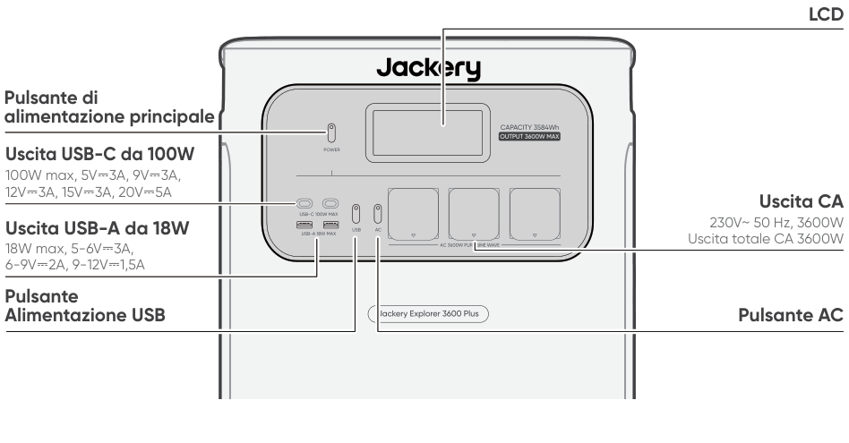
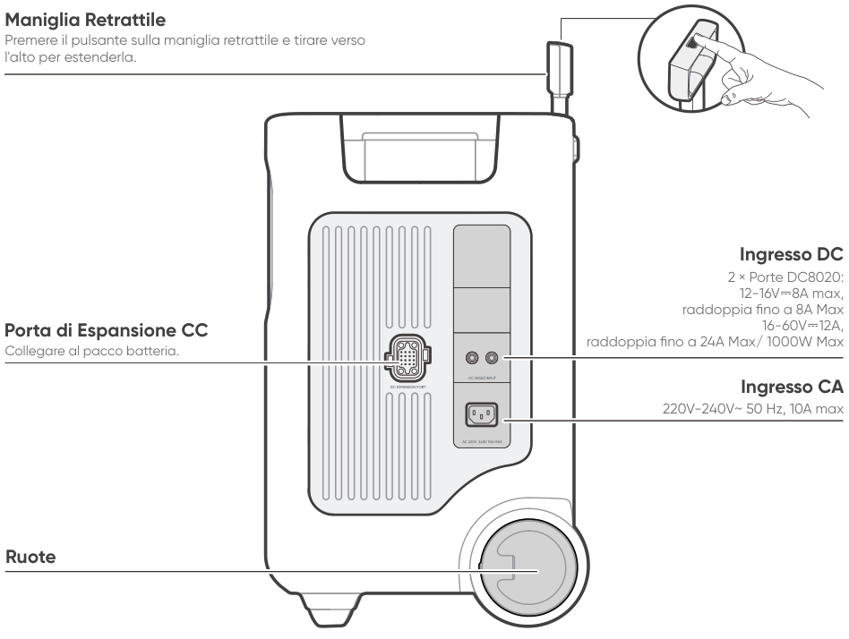
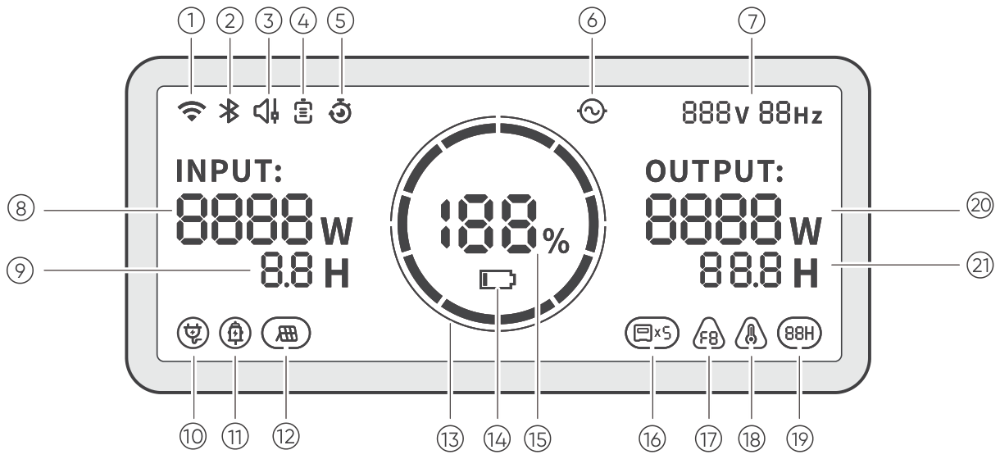
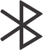
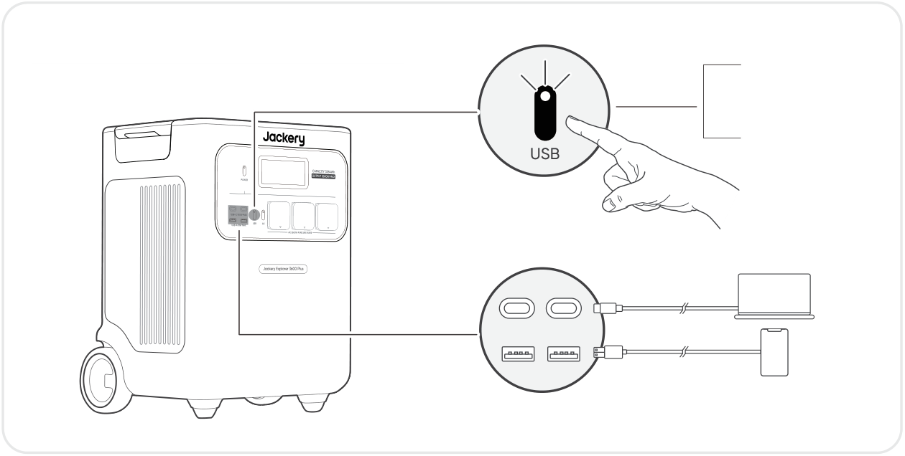
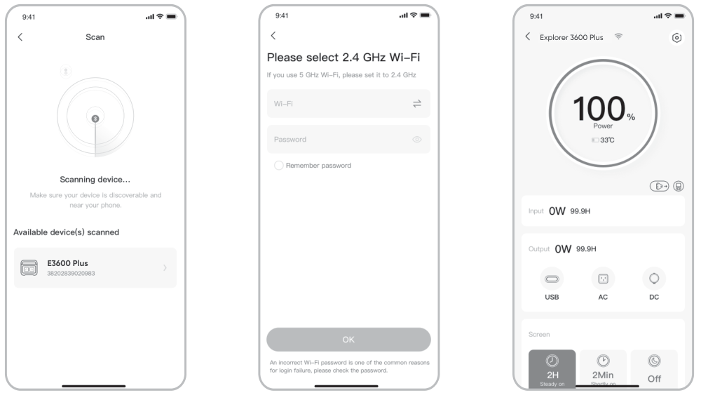

# IMPORTANTE

Congratulazioni per il tuo nuovo Jackery Explorer 3600 Plus. Leggi attentamente questo manuale prima di utilizzare il prodotto, in particolare le precauzioni rilevanti per garantirne un uso corretto. Conserva questo manuale in un luogo accessibile per consultazioni frequenti.

In conformità con le leggi e i regolamenti, il diritto di interpretazione finale di questo documento e di tutti i documenti correlati a questo prodotto spetta all’Azienda.

Si prega di notare che non verranno fornite ulteriori notifiche in caso di aggiornamenti, revisioni o cessazioni.

# PRECAUZIONI DI SICUREZZA

<table class="manual-callout-table manual-callout-table"><tbody><tr><td class="manual-callout-label">AVVERTENZA</td><td class="manual-callout-body">
ISTRUZIONI RELATIVE AI RISCHI DI INCENDIO, SCOSSA ELETTRICA O LESIONI ALLE PERSONE
</td></tr></tbody></table>

<strong>Seguire sempre queste precauzioni di base durante l’utilizzo di questo prodotto.</strong>

<ul><li>
Leggere tutte le istruzioni prima di utilizzare il prodotto.
</li><li>
Non consentire ai bambini di giocare con il prodotto. È necessaria una stretta supervisione quando il prodotto viene utilizzato vicino a bambini.
</li><li>
Il rischio di scossa elettrica può verificarsi se si utilizzano accessori non raccomandati o non venduti da produttori professionali.
</li><li>
Quando il prodotto non è in uso, scollegare la spina di alimentazione dalla presa del prodotto.
</li><li>
Non smontare il prodotto, poiché ciò può comportare rischi imprevedibili come incendi, esplosioni o scosse elettriche.
</li><li>
Non utilizzare il prodotto con cavi di alimentazione, spine o cavi di uscita danneggiati, poiché ciò può causare scosse elettriche.
</li><li>
Per garantire una corretta circolazione dell’aria, non coprire le prese d’aria del prodotto. L’area in cui si utilizza il prodotto deve essere ben ventilata, fresca e asciutta per evitare il surriscaldamento. -La ricarica in ambienti umidi o poco ventilati può comportare rischi per la sicurezza. -L'acqua può causare cortocircuiti o danni al caricatore, con conseguenti rischi per la sicurezza.
</li><li>
Non esporre il prodotto al fuoco, ad alte temperature, alla luce solare diretta o ad ambienti molto caldi come l’interno di un veicolo parcheggiato. Tali condizioni possono causare incendi o esplosioni.
</li></ul>

## ISTRUZIONI PER LA MANUTENZIONE DA PARTE DELL’UTENTE

Durante il ciclo di vita dei prodotti per l’accumulo di energia, è previsto un certo grado di degrado della capacità e dell’energia. Con l’aumentare dei cicli di carica e scarica e il prolungarsi del tempo di immagazzinamento, tale degrado tenderà a intensificarsi gradualmente. Si tratta di un fenomeno normale, coerente con il naturale invecchiamento delle celle della batteria.

# SIGNIFICATO DEI SIMBOLI

<figure aria-label="SIGNIFICATO DEI SIMBOLI" class="hb-symbol-signal-composition" data-component-id="HB-TABLE-SYMBOL-SIGNAL"><table class="hb-symbol-signal-table"><colgroup><col class="hb-symbol-signal-col-label"/><col class="hb-symbol-signal-col-meaning"/></colgroup><thead><tr><th class="hb-symbol-signal-label-heading" scope="col">Símbolo</th><th class="hb-symbol-signal-meaning-heading" scope="col">Significato</th></tr></thead><tbody><tr><td class="hb-symbol-signal-label-cell">⚠AVVERTENZA</td><td class="hb-symbol-signal-meaning-cell">Pratiche pericolose che possono causare gravi lesioni, morte e/o danni materiali.</td></tr><tr><td class="hb-symbol-signal-label-cell">⚠ATTENZIONE</td><td class="hb-symbol-signal-meaning-cell">Pratiche pericolose che possono causare lesioni personali e/o danni materiali.</td></tr><tr><td class="hb-symbol-signal-label-cell">⚠NOTA</td><td class="hb-symbol-signal-meaning-cell">Pratiche pericolose che possono causare danni all'apparecchiatura, perdita di dati, deterioramento delle prestazioni o risultati imprevisti.</td></tr><tr><td class="hb-symbol-signal-label-cell">⚠SUGGERIMENTO</td><td class="hb-symbol-signal-meaning-cell">Integra le informazioni importanti o i consigli operativi presenti nel testo.</td></tr></tbody></table></figure>

<figure aria-label="SIGNIFICATO DEI SIMBOLI" class="hb-symbol-pair-composition" data-component-id="HB-TABLE-SYMBOL-ICON">

<table class="hb-symbol-panel-table"><colgroup><col class="hb-symbol-col-icon"/><col class="hb-symbol-col-meaning"/></colgroup><thead><tr><th class="hb-symbol-icon-heading" scope="col">Símbolo</th><th class="hb-symbol-meaning-heading" scope="col">Significato</th></tr></thead><tbody><tr><td class="hb-symbol-icon"></td><td class="hb-symbol-meaning">Simboli di avvertenza e cautela. Da leggere assolutamente per avvisare le persone di potenziali pericoli o rischi.</td></tr><tr><td class="hb-symbol-icon"></td><td class="hb-symbol-meaning">Prima dell’utilizzo, leggere il manuale d’istruzioni.</td></tr><tr><td class="hb-symbol-icon"></td><td class="hb-symbol-meaning">Non smontare il prodotto.</td></tr><tr><td class="hb-symbol-icon"></td><td class="hb-symbol-meaning">Tenere il prodotto lontano da fiamme.</td></tr><tr><td class="hb-symbol-icon"></td><td class="hb-symbol-meaning">Tenere lontano dalla portata dei bambini.</td></tr><tr><td class="hb-symbol-icon"></td><td class="hb-symbol-meaning">Questo simbolo indica che all’interno del prodotto è presente una batteria agli ioni di litio (Li-ion), la quale va smaltita o riciclata adeguatamente.</td></tr></tbody></table>

<table class="hb-symbol-panel-table"><colgroup><col class="hb-symbol-col-icon"/><col class="hb-symbol-col-meaning"/></colgroup><thead><tr><th class="hb-symbol-icon-heading" scope="col">Símbolo</th><th class="hb-symbol-meaning-heading" scope="col">Significato</th></tr></thead><tbody><tr><td class="hb-symbol-icon"></td><td class="hb-symbol-meaning">Le batterie e gli accumulatori non devono essere smaltiti insieme ai rifiuti domestici. Come consumatore, sei legalmente obbligato a smaltire tutte le batterie e gli accumulatori nei punti di raccolta designati, indipendentemente dal fatto che contengano sostanze pericolose. Per favore, restituisci le batterie e gli accumulatori usati a un punto di raccolta locale, a un centro di riciclo o al rivenditore presso cui sono stati acquistati. Un corretto smaltimento garantisce un riciclo responsabile per l'ambiente e previene potenziali danni alla salute umana e all'ambiente.</td></tr><tr><td class="hb-symbol-icon"></td><td class="hb-symbol-meaning">Questo simbolo indica che il prodotto non va smaltito come rifiuto domestico e deve essere consegnato per il riciclaggio a un centro di raccolta designato. Smaltire adeguatamente e riciclare aiuta a proteggere l’ambiente. Per maggiori informazioni riguardo lo smaltimento e il riciclaggio di questo prodotto, contattare la propria comunità locale, i servizi di smaltimento o il proprio fornitore.</td></tr></tbody></table>

</figure>

# CONTENUTO DELLA CONFEZIONE

<figure aria-label="CONTENUTO DELLA CONFEZIONE" class="hb-inbox-composition" data-card-count="3" data-component-id="HB-SPECIAL-INBOX" data-inbox-variant="three-card-responsive"><ol class="hb-inbox-grid"><li class="hb-inbox-card" data-item-number="1">

Jackery Explorer 3600 Plus

</li><li class="hb-inbox-card" data-item-number="2">

Cavo di ricarica CA

</li><li class="hb-inbox-card" data-item-number="3">

Manuale d'uso

</li></ol>

SUGGERIMENTO

Il cavo di ricarica per auto non è incluso, ma può essere acquistato separatamente sul nostro sito web. Per assistenza, contattare il servizio clienti Jackery.

</figure>

# PANORAMICA DEL PRODOTTO

## ASPETTO DEL PRODOTTO

<figure class="hb-reference-figure" data-component-id="HB-SPECIAL-REFERENCE-FIGURE" data-reference-id="overview-front" data-source-fragment-sha256="6fa5d7eb32bc79dc8604106a2604e79e3ef3efb3fc6a850bc0deff4847e97a38">

</figure>

## VISTA LATERALE DESTRA

<figure class="hb-reference-figure" data-component-id="HB-SPECIAL-REFERENCE-FIGURE" data-reference-id="overview-right" data-source-fragment-sha256="7018b0ac449e8b6733ea94e4de54fa94b9d1bfc012d18d80ee257c4546e02189">

</figure>

# DISPLAY LCD

<figure class="hb-reference-figure" data-component-id="HB-SPECIAL-REFERENCE-FIGURE" data-reference-id="lcd-map" data-source-fragment-sha256="099a4645af1ffb7d6d16b1c4527fbffec879138ed43dbcad8fc39491320c6136">

</figure>

<figure aria-label="DISPLAY LCD" class="hb-lcd-table-composition" data-component-id="HB-TABLE-LCD-ICON" tabindex="0"><table class="hb-lcd-icon-table"><colgroup><col class="hb-lcd-col-number"/><col class="hb-lcd-col-icon"/><col class="hb-lcd-col-name"/><col class="hb-lcd-col-description"/></colgroup><tbody><tr><td class="hb-lcd-number">1</td><td class="hb-lcd-icon"></td><td class="hb-lcd-name">Wi-Fi</td><td class="hb-lcd-description">
Acceso: Wi-Fi connesso. Lampeggiante: pronto per la connessione Wi-Fi. Spento: Wi-Fi disconnesso.
</td></tr><tr><td class="hb-lcd-number">2</td><td class="hb-lcd-icon"></td><td class="hb-lcd-name">Bluetooth</td><td class="hb-lcd-description">
Acceso: Bluetooth connesso. Lampeggiante: pronto per la connessione Bluetooth. Spento: Bluetooth disconnesso
</td></tr><tr><td class="hb-lcd-number">3</td><td class="hb-lcd-icon"></td><td class="hb-lcd-name">Modalità di ricarica silenziosa</td><td class="hb-lcd-description">
Acceso: il rumore durante la ricarica è significativamente ridotto, mentre la potenza e la velocità di ricarica diminuiscono. Spento: la modalità di ricarica silenziosa è disattivata. Questa funzione può essere attivata o disattivata tramite l'app Jackery.
</td></tr><tr><td class="hb-lcd-number" rowspan="2">4</td><td class="hb-lcd-icon"></td><td class="hb-lcd-name">Modalità di risparmio della batteriabatteria</td><td class="hb-lcd-description">
Acceso: limita la capacità massima della batteria utilizzabile per prolungarne la durata. Spento: la modalità di risparmio batteria è disattivata. Questa funzione può essere attivata o disattivata tramite l'app Jackery.
</td></tr><tr><td class="hb-lcd-icon"></td><td class="hb-lcd-name">Modalità autoalimentata</td><td class="hb-lcd-description">
Massimizza l'uso dell'energia solare e riduce la dipendenza dalla rete elettrica, dando priorità all'energia solare immagazzinata e riducendo i costi dell'elettricità (abilitare/disabilitare questa funzione nell'app). La stazione di alimentazione deve essere collegata contemporaneamente sia ai pannelli solari che alla rete elettrica, con la potenza di carico limitata dalla potenza di bypass.
</td></tr><tr><td class="hb-lcd-number">5</td><td class="hb-lcd-icon"></td><td class="hb-lcd-name">Piano di ricarica</td><td class="hb-lcd-description">
Personalizza il tempo di ricarica dell’Explorer 3600 Plus. Adatta a situazioni di fluttuazione dei prezzi dell'energia elettrica, consente piani di ricarica basati sulle ore di punta e non di punta, riducendo i costi dell'energia elettrica (da impostare nell'app Jackery).
</td></tr><tr><td class="hb-lcd-number">6</td><td class="hb-lcd-icon"></td><td class="hb-lcd-name">Indicatore di alimentazione CA</td><td class="hb-lcd-description">
L’uscita AC (onda sinusoidale pura) è attiva.
</td></tr><tr><td class="hb-lcd-number">7</td><td class="hb-lcd-icon"></td><td class="hb-lcd-name">Tensione e frequenza di uscita</td><td class="hb-lcd-description">
Visualizza la tensione e la frequenza di uscita.
</td></tr><tr><td class="hb-lcd-number">8</td><td class="hb-lcd-icon"></td><td class="hb-lcd-name">Potenza in ingresso</td><td class="hb-lcd-description">
Visualizza la potenza di ingresso in watt.
</td></tr><tr><td class="hb-lcd-number">9</td><td class="hb-lcd-icon"></td><td class="hb-lcd-name">Tempo di carica rimanente</td><td class="hb-lcd-description">
Visualizza il tempo residuo di carica.
</td></tr><tr><td class="hb-lcd-number">10</td><td class="hb-lcd-icon"></td><td class="hb-lcd-name">Indicatore di ricarica da auto</td><td class="hb-lcd-description">
Il prodotto viene ricaricato tramite l’ingresso DC (DC8020) utilizzando 12V DC (ricarica da auto).
</td></tr><tr><td class="hb-lcd-number">11</td><td class="hb-lcd-icon"></td><td class="hb-lcd-name">Indicatore di ricarica solare</td><td class="hb-lcd-description">
Il prodotto viene ricaricato tramite l’ingresso DC (DC8020) utilizzando uno o più pannelli solari.
</td></tr><tr><td class="hb-lcd-number">12</td><td class="hb-lcd-icon"></td><td class="hb-lcd-name">Indicatore di ricarica solare</td><td class="hb-lcd-description">
Il prodotto viene ricaricato tramite l’ingresso DC (DC8020) utilizzando uno o più pannelli solari.
</td></tr><tr><td class="hb-lcd-number">13</td><td class="hb-lcd-icon"></td><td class="hb-lcd-name">Indicatore di carica della batteria</td><td class="hb-lcd-description">
Quando il prodotto è in carica, il cerchio arancione attorno alla percentuale della batteria si accende in sequenza. Durante la ricarica di altri dispositivi, il cerchio arancione rimarrà acceso.
</td></tr><tr><td class="hb-lcd-number">14</td><td class="hb-lcd-icon"></td><td class="hb-lcd-name">Indicatore di batteria scarica</td><td class="hb-lcd-description">
Acceso: il livello della batteria è inferiore al 20%. Lampeggiante: il livello della batteria è inferiore al 5%. Spento: il livello della batteria non è inferiore al 20% oppure il prodotto è in carica.
</td></tr><tr><td class="hb-lcd-number">15</td><td class="hb-lcd-icon"></td><td class="hb-lcd-name">Percentuale di batteria residua</td><td class="hb-lcd-description">
Mostra la percentuale residua della batteria.
</td></tr><tr><td class="hb-lcd-number">16</td><td class="hb-lcd-icon"></td><td class="hb-lcd-name">Indicatore del pacco batteria e numero di batterie collegate</td><td class="hb-lcd-description">
Visualizza il numero di pacchi batteria collegati, se presenti.
</td></tr><tr><td class="hb-lcd-number">17</td><td class="hb-lcd-icon"></td><td class="hb-lcd-name">Codice di errore</td><td class="hb-lcd-description">
Si è verificato un errore del prodotto. Per maggiori dettagli, consultare la sezione “Risoluzione dei problemi”.
</td></tr><tr><td class="hb-lcd-number" rowspan="2">18</td><td class="hb-lcd-icon"></td><td class="hb-lcd-name">Indicatore di temperatura elevata</td><td class="hb-lcd-description">
La protezione da alta temperatura è stata attivata. Il prodotto potrebbe smettere di funzionare finché la temperatura non rientra nel normale intervallo operativo.
</td></tr><tr><td class="hb-lcd-icon"></td><td class="hb-lcd-name">Indicatore di bassa temperatura</td><td class="hb-lcd-description">
È stata attivata la protezione da bassa temperatura. Il prodotto potrebbe smettere di funzionare finché la temperatura non rientra nel normale intervallo operativo.
</td></tr><tr><td class="hb-lcd-number">19</td><td class="hb-lcd-icon"></td><td class="hb-lcd-name">Modalità di risparmio energetico</td><td class="hb-lcd-description">
Quando l'uscita CA o USB è accesa premendo il rispettivo pulsante di alimentazione: Acceso: La modalità di risparmio energetico è attivata. Spento: La modalità di risparmio energetico è disattivata.
</td></tr><tr><td class="hb-lcd-number">20</td><td class="hb-lcd-icon"></td><td class="hb-lcd-name">Potenza in uscita</td><td class="hb-lcd-description">
Visualizza la potenza di uscita in watt.
</td></tr><tr><td class="hb-lcd-number">21</td><td class="hb-lcd-icon"></td><td class="hb-lcd-name">Tempo di scarica rimanente</td><td class="hb-lcd-description">
Visualizza il tempo residuo di scarica.
</td></tr></tbody></table></figure>

# OPERAZIONI

## ACCENSIONE/SPEGNIMENTO

<figure class="hb-reference-figure hb-base-art-live-copy" data-component-id="HB-SPECIAL-REFERENCE-FIGURE" data-reference-id="operation-main-power" data-source-fragment-sha256="2f1e2ae1b3b4301b9c3a93f120c3226c6523da85a30129aa59ee57fbce7680f6" data-web-base-art-ref="operation-main-power" data-web-presentation-mode="base-art-live-copy">

Accensione premere una voltaSpegnimento Tenere premuto per 3 secondiTempo di standby predefinito: 2 ore Il prodotto si spegnerà automaticamente dopo 2 ore di inattività, senza alcuna carica o scarica. *Il tempo di standby può essere impostato nell’App Jackery.Quando la Modalità Risparmio Energetico è attiva, il prodotto si spegnerà automaticamente dopo 12 ore se il pulsante di alimentazione CA o USB è ON ma il prodotto non sta né caricando né scaricando.

</figure>

## ACCENSIONE/SPEGNIMENTO USCITA USB

<figure class="hb-operation-figure hb-operation-layout-status-right hb-base-art-live-copy" data-component-id="HB-SPECIAL-OPERATION" data-operation-id="dc-usb-output" data-source-fragment-sha256="2fb60330967e636e322a2ef4bbc4977b86fa5de01053eede6c85c5e2a59b071a" data-web-base-art-ref="operation/dc_usb_output" data-web-presentation-mode="base-art-live-copy" data-web-replace-key="operation.dc-usb-output">

<strong>Condizione:</strong> assicurarsi che il prodotto sia acceso.

<strong>Accensione</strong>

premere una volta

<strong>Spegnimento</strong>

premere una volta

</figure>

<table class="manual-callout-table manual-callout-table"><tbody><tr><td class="manual-callout-label">ATTENZIONE</td><td class="manual-callout-body"><ul><li>
USB-C 100W è una porta di uscita ad alta potenza USB-PD Power Source 3 (PS3). Se il dispositivo o l'accessorio collegato non soddisfa i requisiti di sicurezza, potrebbe esserci un rischio di incendio. Prima di utilizzare queste porte, assicurarsi che il dispositivo o l'accessorio collegato sia dotato di protezione antincendio.
</li><li>
Collegare Jackery Explorer 3600 Plus solo a dispositivi o accessori conformi alle clausole 6.3, 6.4 e 6.5 della norma IEC/EN/UL 62368-1 (o altre norme equivalenti).
</li><li>
Per ottenere la massima potenza in uscita, utilizzare il cavo ufficiale Jackery USB-C to USB-C 5A (20V CC/5A, 100W).
</li></ul></td></tr></tbody></table>

## ACCENSIONE/SPEGNIMENTO USCITA AC

<figure class="hb-operation-figure hb-operation-layout-status-right hb-base-art-live-copy" data-component-id="HB-SPECIAL-OPERATION" data-operation-id="ac-output" data-source-fragment-sha256="358f5579a34f24090949e93b7e7410225aa3a058de146eca1e60164734ee2ecb" data-web-base-art-ref="operation/ac_output" data-web-presentation-mode="base-art-live-copy" data-web-replace-key="operation.ac-output">

<strong>Condizione:</strong> assicurarsi che il prodotto sia acceso.

<strong>Accensione</strong>

premere una volta

<strong>Spegnimento</strong>

premere una volta

</figure>

## MODALITÀ DI RISPARMIO ENERGETICO

<figure class="hb-reference-figure hb-base-art-live-copy" data-component-id="HB-SPECIAL-REFERENCE-FIGURE" data-reference-id="operation-energy-saving" data-source-fragment-sha256="67d2d3a10e66bf5169afd7251284f5a334c035b4a0617f7dcdd23af14d9db591" data-web-base-art-ref="operation-energy-saving" data-web-presentation-mode="base-art-live-copy">

Per prevenire un consumo inutile della batteria dimenticando di spegnere l'uscita, il prodotto attiva la Modalità di risparmio energetico per impostazione predefinita. Quando il pulsante di alimentazione CA è acceso, l’icona della MODALITÀ DI RISPARMIO ENERGETICO verrà visualizzata sullo schermo LCD. Se non è collegato alcun dispositivo o il consumo del dispositivo collegato è inferiore a una determinata soglia (uscita AC ≤ 25W oppure uscita USB-C ≤ 2W), il dispositivo spegne automaticamente tutte le uscite dopo 12 ore. Per disattivare la Modalità risparmio energetico, tenere premuti entrambi i pulsanti di accensione CA e POWER per più di 3 secondi.POWER-TasteAC-AusgangstasteAccensione/Spegnimento Tenere premuto per 3 secondi

</figure>

<table class="manual-callout-table manual-callout-table"><tbody><tr><td class="manual-callout-label">NOTA</td><td class="manual-callout-body">
La Modalità di risparmio energetico ripristina lo stato precedente dopo l'accensione. Per cambiare modalità è necessario un intervento manuale.
</td></tr></tbody></table>

## ACCENSIONE/SPEGNIMENTO SCHERMO LCD

<figure aria-label="ACCENSIONE/SPEGNIMENTO SCHERMO LCD" class="hb-lcd-mode-composition" data-component-id="HB-TABLE-LCD-MODE">

<table class="hb-lcd-mode-table"><colgroup><col class="hb-lcd-mode-col-state"/><col class="hb-lcd-mode-col-action"/><col class="hb-lcd-mode-col-copy"/></colgroup><tbody><tr><td class="hb-lcd-mode-state" rowspan="3">Schermo LCD</td><td class="hb-lcd-mode-action">Accendere</td><td class="hb-lcd-mode-copy">Premi il pulsante di accensione principale o durante la ricarica del prodotto.</td></tr><tr><td class="hb-lcd-mode-action">Spegnere</td><td class="hb-lcd-mode-copy">Premere il pulsante di accensione principale.</td></tr><tr><td class="hb-lcd-mode-action">Spegnimento automatico</td><td class="hb-lcd-mode-copy">Il display LCD si spegne automaticamente ed entra in modalità sleep dopo 2 minuti di inattività.</td></tr><tr><td class="hb-lcd-mode-state" rowspan="3">Modalità Display sempre acceso (in stato di carica o scarica)</td><td class="hb-lcd-mode-action">Accendere</td><td class="hb-lcd-mode-copy">Premere due volte il pulsante di accensione principale quando lo schermo LCD è acceso.</td></tr><tr><td class="hb-lcd-mode-action">Spegnere</td><td class="hb-lcd-mode-copy">Premere il pulsante di accensione principale.</td></tr><tr><td class="hb-lcd-mode-action">Spegnimento automatico</td><td class="hb-lcd-mode-copy">La modalità Always-on Display si spegne automaticamente dopo 2 ore di inattività.Inaktivität automatisch aus.</td></tr></tbody></table>
</figure>

È anche possibile impostare la Modalità di visualizzazione dello schermo nell'app Jackery.

## FUNZIONI DEI PULSANTI

<figure aria-label="Pulsanti / Funzionamento / Funzione" class="hb-key-combination-composition" data-component-id="HB-TABLE-KEY-COMBINATIONS" tabindex="0"><table class="hb-key-combination-table"><colgroup><col class="hb-key-col-buttons"/><col class="hb-key-col-operation"/><col class="hb-key-col-function"/></colgroup><thead><tr><th class="hb-key-buttons" scope="col">Pulsanti</th><th class="hb-key-operation" scope="col">Funzionamento</th><th class="hb-key-function" scope="col">Funzione</th></tr></thead><tbody><tr><td class="hb-key-buttons">Pulsante POWER + Pulsante di accensione USB</td><td class="hb-key-operation">Premere e tenere premuti entrambi per 3 secondi</td><td class="hb-key-function">Reimposta Wi-Fi e Bluetooth</td></tr><tr><td class="hb-key-buttons">Pulsante POWER + pulsante di uscita AC</td><td class="hb-key-operation">Premere e tenere premuti entrambi per 3 secondi</td><td class="hb-key-function">Attiva/disattiva la Modalità Risparmio Energetico</td></tr><tr><td class="hb-key-buttons">Pulsante di accensione USB + pulsante di uscita AC</td><td class="hb-key-operation">Tenere premuti entrambi per 1 secondo</td><td class="hb-key-function">Attivare/disattivare Wi-Fi e Bluetooth</td></tr></tbody></table></figure>

# GRUPPO DI CONTINUITÀ (UPS)

Collega il prodotto a una presa a muro utilizzando il cavo di ricarica AC, quindi premi il pulsante di uscita AC per alimentare contemporaneamente i tuoi dispositivi.

<figure class="hb-reference-figure hb-base-art-live-copy" data-component-id="HB-SPECIAL-REFERENCE-FIGURE" data-reference-id="ups" data-source-fragment-sha256="486c24c49ce848d0227e636604c239954b921988fc9dbe384cfe2ec143fc0c6d" data-web-base-art-ref="ups" data-web-presentation-mode="base-art-live-copy">

Condizione: assicurarsi che il prodotto sia acceso. Un gruppo di continuità (UPS) è un tipo di sistema di alimentazione continua che fornisce automaticamente energia elettrica di backup a un carico quando l'alimentazione dalla rete elettrica viene a mancare. In caso di improvvisa interruzione della corrente di rete, l’Explorer 3600 Plus passerà automaticamente all’energia immagazzinata entro 10 ms per mantenere in funzione i dispositivi collegati.

</figure>

In modalità UPS, la potenza di picco dell'unità raggiunge i 10 A prima dell'interruzione di corrente. Poiché la modalità Bypass consente la ricarica/scarica simultanea, la potenza di uscita effettiva è inferiore alla potenza di uscita nominale in questa modalità, ma torna alla potenza di uscita nominale durante le interruzioni di corrente.

<table class="manual-callout-table manual-callout-table"><tbody><tr><td class="manual-callout-label">ATTENZIONE</td><td class="manual-callout-body"><ul><li>
Questo prodotto non supporta la commutazione a 0 ms. Non collegarlo a dispositivi che richiedono un'alimentazione ininterrotta, come server dati o workstation.
</li><li>
Prima dell'uso, testare più volte la compatibilità con il proprio dispositivo.
</li><li>
Non collegare carichi che superano la potenza di uscita massima del prodotto. In caso contrario, verrà attivata la protezione da sovraccarico.
</li></ul></td></tr></tbody></table>

# COLLEGAMENTI

<h2 class="hb-subbar" id="collegamento-al-pacco-batteria-venduti-separatamente">COLLEGAMENTO AL PACCO BATTERIA VENDUTI SEPARATAMENTE</h2>

Questo prodotto può supportare fino a 5 pacchi batteria per soddisfare l'esigenza di grande capacità di alimentazione. Per i dettagli su come utilizzarlo, consultare il manuale d'uso del Jackery Battery Pack 3600.

<figure class="hb-reference-figure hb-base-art-live-copy" data-component-id="HB-SPECIAL-REFERENCE-FIGURE" data-reference-id="battery" data-source-fragment-sha256="9eb3693d55cf1278405a9a142fe59fcb8709f598c8829d2a2212627b119a0cbe" data-web-base-art-ref="battery" data-web-presentation-mode="base-art-live-copy">

≥ 200 mm≥ 200 mm

</figure>

<table class="manual-callout-table manual-callout-table"><tbody><tr><td class="manual-callout-label">ATTENZIONE</td><td class="manual-callout-body"><ul><li>
Assicurarsi che tutti i prodotti siano spenti prima di collegare l'Explorer 3600 Plus al Jackery Battery Pack 3600.
</li><li>
Per garantire il corretto funzionamento del prodotto, assicurarsi che le prese d'aria di aspirazione e bocchette di scarico su entrambi i lati non siano ostruite. Lasciare almeno 200 mm di spazio tra le prese d'aria e qualsiasi oggetto per consentire un'adeguata dissipazione del calore.
</li></ul></td></tr></tbody></table>

<figure class="hb-reference-figure hb-base-art-live-copy" data-component-id="HB-SPECIAL-REFERENCE-FIGURE" data-reference-id="battery-accessories" data-source-fragment-sha256="cb606e92618875fd2e0860eadb3998e77efe6bb802f20fbc0bf55a1b4466c181" data-web-base-art-ref="battery-accessories" data-web-presentation-mode="base-art-live-copy">

Jackery Battery Pack 3600Cavo di espansioneManuale d'usoVENDUTI SEPARATAMENTE

</figure>

# RICARICA

<strong>L'energia verde prima di tutto:</strong> sosteniamo a prediligere l'energia verde. Questo prodotto supporta due modalità di ricarica contemporaneamente: ricarica solare e ricarica CA a muro.Quando la ricarica CA a muro e la ricarica solare vengono attivate contemporaneamente, il prodotto darà priorità alla ricarica solare e utilizzerà entrambi i metodi per caricare la batteria alla massima potenza consentita.

Caricare completamente il dispositivo prima del primo utilizzo.

<table class="manual-callout-table manual-callout-table"><tbody><tr><td class="manual-callout-label">Nota</td><td class="manual-callout-body"><ul><li>
La temperatura consigliata per caricare il prodotto è compresa tra -20 °C e 45 °C, e la temperatura di scarica è anch’essa compresa tra -20 °C e 45 °C. Utilizzare il prodotto al di fuori di questo intervallo di temperatura può limitare le capacità di carica e scarica, o persino impedire la carica o la scarica.
</li><li>
La potenza di carica e la capacità della batteria del prodotto possono variare a causa delle fluttuazioni di temperatura.
</li></ul></td></tr></tbody></table>

## RICARICA TRAMITE PRESA A MURO CA

<figure class="hb-reference-figure hb-base-art-live-copy" data-component-id="HB-SPECIAL-REFERENCE-FIGURE" data-reference-id="charging-ac" data-source-fragment-sha256="7ef81b19a8914d9a6dc37fb83206ea875cb4419f198ddc19610c53b9807ae64d" data-web-base-art-ref="charging-ac" data-web-presentation-mode="base-art-live-copy">

Collega il cavo di ricarica CA alla porta di ingresso CA del prodotto e a una presa a muro.

</figure>

<table class="manual-callout-table manual-callout-table"><tbody><tr><td class="manual-callout-label">ATTENZIONE</td><td class="manual-callout-body">
Assicurarsi che il cavo di ricarica CA sia inserito completamente e saldamente nella porta di ingresso CA. Un collegamento incompleto potrebbe causare corrente instabile, surriscaldamento, contatti difettosi o malfunzionamenti del dispositivo.
</td></tr></tbody></table>

<h2 class="hb-subbar" id="ricarica-tramite-pannelli-solari-venduti-separatamente">RICARICA TRAMITE PANNELLI SOLARI VENDUTI SEPARATAMENTE</h2>

Il Jackery Explorer 3600 Plus dispone di due porte di ingresso DC8020 ed è compatibile con i pannelli solari Jackery. Se una porta di ingresso DC8020 deve collegare due pannelli solari contemporaneamente, fare riferimento alla figura seguente per la ricarica tramite il connettore per pannelli solari (venduto separatamente, non incluso nella confezione standard).

<figure class="hb-reference-figure hb-base-art-live-copy" data-component-id="HB-SPECIAL-REFERENCE-FIGURE" data-reference-id="charging-solar" data-source-fragment-sha256="b19d8622a4150edbc36830bc842910b6f17d60391198e798de99655bb462bf8b" data-web-base-art-ref="charging-solar" data-web-presentation-mode="base-art-live-copy">

SolarSaga 200 × 4

</figure>

<table class="manual-callout-table manual-callout-table"><tbody><tr><td class="manual-callout-label">ATTENZIONE</td><td class="manual-callout-body">
Una porta di ingresso DC8020 può essere collegata al massimo a due pannelli solari.
</td></tr></tbody></table>

<table class="manual-callout-table manual-callout-table"><tbody><tr><td class="manual-callout-label">ATTENZIONE</td><td class="manual-callout-body"><ul><li>
Assicurarsi che la tensione di ingresso per entrambe le porte di ingresso CC sia la stessa. In caso contrario, il prodotto potrebbe subire danni. Ad esempio:
</li><li>
Si consiglia di utilizzare pannelli solari Jackery dello stesso modello e dello stesso numero quando si collegano pannelli solari a entrambe le porte di ingresso CC8020.
</li><li>
Non caricare il prodotto utilizzando contemporaneamente un caricabatterie per auto e un pannello solare. Ciò potrebbe far saltare il fusibile dell'auto o causare un fallimento della carica.
</li></ul></td></tr></tbody></table>

Si consiglia di utilizzare il pannello solare Jackery per caricare l’Explorer 3600 Plus. Assicurarsi che la tensione a circuito aperto (Voc) del pannello solare rientri nell’intervallo di tensione di ingresso CC dell’Explorer 3600 Plus (16V–60V). Jackery non è responsabile per eventuali danni o perdite derivanti dall’uso di pannelli solari di terze parti.

<h2 class="hb-subbar" id="ricarica-tramite-caricatore-da-auto-venduti-separatamente">RICARICA TRAMITE CARICATORE DA AUTO VENDUTI SEPARATAMENTE</h2>

Questo prodotto può essere caricato con un caricabatterie per auto da 12 V. Assicurarsi che il caricabatterie e l'accendisigari dell'auto siano ben collegati.

<figure class="hb-reference-figure hb-base-art-live-copy" data-component-id="HB-SPECIAL-REFERENCE-FIGURE" data-reference-id="charging-car" data-source-fragment-sha256="7d6d563d587a4d38bb23e0cfa2d362753697e50cdaca82b2ad2adb6080923371" data-web-base-art-ref="charging-car" data-web-presentation-mode="base-art-live-copy">

Veicolo※ Il cavo di ricarica per auto è venduto separatamente.

</figure>

<table class="manual-callout-table manual-callout-table"><tbody><tr><td class="manual-callout-label">ATTENZIONE</td><td class="manual-callout-body"><ul><li>
Avviare il veicolo prima di caricare il prodotto.
</li><li>
Se il veicolo si trova su strade dissestate, è vietato utilizzare il caricabatterie per auto per evitare il rischio di surriscaldamento dovuto a un cattivo collegamento. L’ azienda non sarà responsabile per eventuali danni causati da un utilizzo non conforme.
</li><li>
La ricarica tramite veicolo è applicabile solo ai veicoli con alimentazione a 12V DC, non a 24V DC. Non caricare questo prodotto in un veicolo a 24V per evitare lesioni personali e danni materiali.
</li></ul></td></tr></tbody></table>

# STOCCAGGIO

Conservare il prodotto in un luogo pulito e asciutto, con una ventilazione adeguata. Temperatura e umidità di stoccaggio:
<ul class="hb-source-storage-copy" style="margin:0"><li class="hb-source-storage-item" style="margin:0">
1 mese: tra -20 °C e 45 °C (0-60% UR)
</li><li class="hb-source-storage-item" style="margin:0">
3 mesi: tra 0 °C e 45 °C (0-60% UR)
</li><li class="hb-source-storage-item" style="margin:0">
12 mesi: tra 0 °C e 25 °C (0-60% UR)
</li></ul>
Se il prodotto viene conservato a lungo termine (da 3 a 6 mesi) con la batteria scarica, potrebbe non essere più possibile ricaricarlo. Per evitarlo e mantenere la salute della batteria, si consiglia di controllare e ricaricare il prodotto ogni tre mesi e di eseguire almeno un ciclo completo di carica e scarica ogni 6–12 mesi.

# RISOLUZIONE DEI PROBLEMI

Se viene visualizzato uno dei seguenti codici di errore, seguire le azioni correttive elencate per risolvere il problema. Se l'errore persiste, contattare l'assistenza clienti Jackery.

<figure aria-label="Codice di errore / Misure correttive" class="hb-troubleshooting-composition" data-component-id="HB-TABLE-TROUBLESHOOTING" tabindex="0"><table class="hb-troubleshooting-table"><colgroup><col class="hb-troubleshooting-col-code"/><col class="hb-troubleshooting-col-measures"/></colgroup><thead><tr><th class="hb-troubleshooting-code" scope="col">Codice di errore</th><th class="hb-troubleshooting-measures" scope="col">Misure correttive</th></tr></thead><tbody><tr><td class="hb-troubleshooting-code">F0</td><td class="hb-troubleshooting-measures">Starten Sie das Gerät neu.</td></tr><tr><td class="hb-troubleshooting-code">F1</td><td class="hb-troubleshooting-measures">Starten Sie das Gerät neu.</td></tr><tr><td class="hb-troubleshooting-code">F2</td><td class="hb-troubleshooting-measures">Starten Sie das Gerät neu.</td></tr><tr><td class="hb-troubleshooting-code">F3</td><td class="hb-troubleshooting-measures">Starten Sie das Gerät neu.</td></tr><tr><td class="hb-troubleshooting-code">F4</td><td class="hb-troubleshooting-measures">Schließen Sie das Gerät an Verbraucher an, um die Batterie zu entladen, bis der Fehler verschwindet.</td></tr><tr><td class="hb-troubleshooting-code">F5</td><td class="hb-troubleshooting-measures">Laden Sie das Gerät über Solarmodule oder eine AC-Wandsteckdose, bis der Fehler verschwindet.</td></tr><tr><td class="hb-troubleshooting-code">F6</td><td class="hb-troubleshooting-measures">1. Warten Sie, bis das Stromnetz stabil ist, bevor Sie das Gerät über eine Netzsteckdose laden. 2. Überprüfen Sie, ob die Lufteinlass- und -auslassöffnungen blockiert sind; stellen Sie sicher, dass auf beiden Seiten des Geräts ein Abstand von 20 cm eingehalten wird. 3. Platzieren Sie das Gerät an einem Ort, der nicht direktem Sonnenlicht oder hohen Umgebungstemperaturen ausgesetzt ist. 4. Trennen Sie alle Verbraucher vom Gerät, lassen Sie es im Leerlauf und warten Sie, bis der Fehler verschwindet. 5. Starten Sie das Gerät neu.</td></tr><tr><td class="hb-troubleshooting-code">F7</td><td class="hb-troubleshooting-measures">1. Rimuovere tutti gli ingressi CC dal prodotto. 2. Se si ricarica il prodotto tramite un pannello solare, verificare la tensione a circuito aperto (Voc) del pannello solare collegato. Il prodotto consente una tensione di ingresso CC massima di 60V. 3. Riavviare il prodotto e lasciarlo inattivo. Attendere che l'errore scompaia.</td></tr><tr><td class="hb-troubleshooting-code">F8</td><td class="hb-troubleshooting-measures">Contattare il distributore o l'assistenza clienti Jackery.</td></tr><tr><td class="hb-troubleshooting-code">F9</td><td class="hb-troubleshooting-measures">Rimuovere il carico collegato alle porte USB del prodotto. Attendere che l'errore scompaia.</td></tr><tr><td class="hb-troubleshooting-code">FA</td><td class="hb-troubleshooting-measures">1. Spegnere l'uscita CA di entrambe le unità. 2. Premere nuovamente il pulsante di alimentazione CA su ciascuna unità entro 1 minuto.</td></tr><tr><td class="hb-troubleshooting-code">FC</td><td class="hb-troubleshooting-measures">1. Riavviare rispettivamente i pacchi batteria e il Jackery Explorer 3600 Plus. 2. Se il guasto persiste, scollegare il pacco batteria dal Jackery Explorer 3600 Plus e ricollegarlo.</td></tr></tbody></table></figure>

# SPECIFICHE TECNICHE

<h2 aria-level="2" role="heading">INFORMAZIONI GENERALI</h2><figure aria-label="INFORMAZIONI GENERALI" class="hb-spec-table-composition"><table class="manual-table manual-spec-table hb-spec-table"><colgroup><col class="hb-spec-col-label"/><col class="hb-spec-col-value"/></colgroup><tbody><tr><th class="manual-spec-label hb-spec-label" scope="row">Nome del prodotto</th><td class="manual-spec-value hb-spec-value">Jackery Explorer 3600 Plus</td></tr><tr><th class="manual-spec-label hb-spec-label" scope="row">Modello n.</th><td class="manual-spec-value hb-spec-value">JE-3600A</td></tr><tr><th class="manual-spec-label hb-spec-label" scope="row">Capacità</th><td class="manual-spec-value hb-spec-value">80Ah / 44,8V DC (3584 Wh)</td></tr><tr><th class="manual-spec-label hb-spec-label" scope="row">Chimica celle batteria</th><td class="manual-spec-value hb-spec-value">LiFePO₄</td></tr><tr><th class="manual-spec-label hb-spec-label" scope="row">Peso</th><td class="manual-spec-value hb-spec-value">Circa 35 kg</td></tr><tr><th class="manual-spec-label hb-spec-label" scope="row">Dimensioni</th><td class="manual-spec-value hb-spec-value">38,5×30,9×49,1 cm</td></tr><tr><th class="manual-spec-label hb-spec-label" scope="row">Durata del ciclo</th><td class="manual-spec-value hb-spec-value">6000 cicli fino all' 70% di capacità</td></tr><tr><th class="manual-spec-label hb-spec-label" scope="row">IEC code</th><td class="manual-spec-value hb-spec-value">IFpR41/136[14S4P]M/-20+40/90</td></tr></tbody></table></figure><h2 aria-level="2" role="heading">PORTE IN INGRESSO</h2><figure aria-label="PORTE IN INGRESSO" class="hb-spec-table-composition"><table class="manual-table manual-spec-table hb-spec-table"><colgroup><col class="hb-spec-col-label"/><col class="hb-spec-col-value"/></colgroup><tbody><tr><th class="manual-spec-label hb-spec-label" scope="row">1 × Ingresso CA</th><td class="manual-spec-value hb-spec-value">Modalità di ricarica: 220-240V~ 50Hz, 10A max</td></tr><tr><th class="manual-spec-label hb-spec-label" scope="row">1 × Ingresso CA</th><td class="manual-spec-value hb-spec-value">AC modalità bypass① : 220-240V~ 50Hz, 10A max</td></tr><tr><th class="manual-spec-label hb-spec-label" scope="row">2 × Porte DC8020</th><td class="manual-spec-value hb-spec-value">12-16V⎓8A max, raddoppia fino a 8A max</td></tr><tr><th class="manual-spec-label hb-spec-label" scope="row">2 × Porte DC8020</th><td class="manual-spec-value hb-spec-value">16-60V⎓12A, raddoppia fino a 24A Max/ 1000W Max</td></tr><tr><th class="manual-spec-label hb-spec-label" scope="row">1 × Porta di Espansione CC</th><td class="manual-spec-value hb-spec-value">36,4V-50,4V⎓100A max</td></tr></tbody></table></figure><h2 aria-level="2" role="heading">PORTE IN USCITA</h2><figure aria-label="PORTE IN USCITA" class="hb-spec-table-composition"><table class="manual-table manual-spec-table hb-spec-table"><colgroup><col class="hb-spec-col-label"/><col class="hb-spec-col-value"/></colgroup><tbody><tr><th class="manual-spec-label hb-spec-label" scope="row">3 × Uscita CA</th><td class="manual-spec-value hb-spec-value">230V~ 50Hz, 3600W</td></tr><tr><th class="manual-spec-label hb-spec-label" scope="row">Uscita totale CA②</th><td class="manual-spec-value hb-spec-value">3600W nominali, 7200W picco di sovratensione</td></tr><tr><th class="manual-spec-label hb-spec-label" scope="row">Uscita CA in modalità bypass①</th><td class="manual-spec-value hb-spec-value">220-240V~ 50Hz, 10A max</td></tr><tr><th class="manual-spec-label hb-spec-label" scope="row">2 × USB-C da 100W</th><td class="manual-spec-value hb-spec-value">100W max, 5V⎓3A, 9V⎓3A, 12V⎓3A, 15V⎓3A, 20V⎓5A</td></tr><tr><th class="manual-spec-label hb-spec-label" scope="row">2 × USB-A da 18W</th><td class="manual-spec-value hb-spec-value">18W max, 5-6V⎓3A, 6-9V⎓2A, 9-12V⎓1.5A</td></tr><tr><th class="manual-spec-label hb-spec-label" scope="row">1 × Porta di Espansione CC</th><td class="manual-spec-value hb-spec-value">36.4V-50.4V⎓60A max</td></tr></tbody></table></figure><h2 aria-level="2" role="heading">ENVIRONMENTAL OPERATING TEMPERATURE</h2><figure aria-label="ENVIRONMENTAL OPERATING TEMPERATURE" class="hb-spec-table-composition"><table class="manual-table manual-spec-table hb-spec-table"><colgroup><col class="hb-spec-col-label"/><col class="hb-spec-col-value"/></colgroup><tbody><tr><th class="manual-spec-label hb-spec-label" scope="row">Temperatura di carica</th><td class="manual-spec-value hb-spec-value">tra -20 °C e 45 °C</td></tr><tr><th class="manual-spec-label hb-spec-label" scope="row">Temperatura di scarica</th><td class="manual-spec-value hb-spec-value">tra -20 °C e 45 °C</td></tr></tbody></table></figure>

※ USB Type-C® e USB-C® sono marchi registrati di USB Implementers Forum.

① Il prodotto può caricare la batteria dalla presa a muro CA mentre fornisce energia tramite le porte di uscita CA.

② Indica che due o più porte di uscita CA funzionano insieme.

# GARANZIA

<figure aria-label="GARANZIA" class="hb-warranty-intro-composition" data-component-id="HB-WARRANTY-LEAD">

<strong>Forniamo la nostra garanzia solo ai clienti che acquistano dal sito web ufficiale di Jackery, dalle piattaforme di terze parti con marchio Jackery o dai rivenditori autorizzati locali.</strong>

* Il periodo ei dettagli della garanzia possono variare in base alle leggi locali, ai regolamenti e ai rivenditori autorizzati.

</figure>

## Garanzia limitata

<figure aria-label="Garanzia limitata" class="hb-warranty-card" data-component-id="HB-WARRANTY-SECTION" data-warranty-card-index="1">
Jackery garantisce all'acquirente originale che il prodotto Jackery sarà esente da difetti di fabbricazione e materiali in condizioni di normale utilizzo da parte del acquirente durante il periodo di garanzia applicabile identificato nella sezione "Periodo di garanzia" di seguito, fatte salve le esclusioni indicate di seguito. Questa dichiarazione di garanzia stabilisce l'obbligo di garanzia totale ed esclusivo di Jackery. Non ci assumeremo, né autorizzeremo alcuna persona ad assumersi per noi, qualsiasi altra responsabilità in relazione allà vendita dei nostri prodotti.
</figure>

## Periodo di garanzia

<figure aria-label="Periodo di garanzia" class="hb-warranty-period-card" data-component-id="HB-WARRANTY-YEARS">

3
<strong class="hb-warranty-years-unit">ANNI</strong><strong class="hb-warranty-period-label">di garanzia standard</strong>

Il periodo di garanzia standard per Jackery Explorer 3600 Plus è misurato a partire dalla data di acquisto da parte dell'acquirente consumatore originario. Per stabilire la data di inizio del periodo di garanzia è necessaria la ricevuta del primo acquisto da parte del consumatore, o altra prova documentale ragionevole.

2
<strong class="hb-warranty-years-unit">ANNI</strong><strong class="hb-warranty-period-label">di garanzia estesa</strong>

Per attivare l'estensione della garanzia, è necessario registrare il prodotto online, oppure contattare il nostro servizio clienti all’indirizzo hello.eu@jackery.com per estendere il periodo di garanzia standard.

</figure>

## Sostituzione

<figure aria-label="Sostituzione" class="hb-warranty-card" data-component-id="HB-WARRANTY-SECTION" data-warranty-card-index="2">
Jackery sostituirà (a spese di Jackery) qualsiasi prodotto Jackery mal funzionante durante il periodo di garanzia applicabile a causa di difetti di fabbricazione o materiali. Un prodotto sostitutivo assume la garanzia residua del prodotto originale.
</figure>

## Limitato all'acquirente consumatore originale

<figure aria-label="Limitato all'acquirente consumatore originale" class="hb-warranty-card" data-component-id="HB-WARRANTY-SECTION" data-warranty-card-index="3">
La garanzia sul prodotto Jackery è limitata all’acquirente originale e non è trasferibile a nessun proprietario successivo.
</figure>

## Esclusioni

<figure aria-label="Esclusioni" class="hb-warranty-card" data-component-id="HB-WARRANTY-SECTION" data-warranty-card-index="4">
La garanzia di Jackery non si applica a:
<ul><li>Uso improprio, abuso, modifica, danneggiamento accidentale o utilizzo diverso dal normale uso da parte del consumatore, come autorizzato nella documentazione di questo prodotto Jackery.</li><li>Tentativi di riparazione da parte di persone diverse da quelle autorizzate.</li><li>Qualsiasi prodotto acquistato tramite una casa d’aste online.</li><li>La garanzia di Jackery non si applica alla batteria, a meno che questa non venga caricata completamente dall'utente entro sette giorni dall'acquisto del prodotto, e successivamente almeno una volta ogni 6 mesi.</li></ul></figure>

## Diritti di interpretazione

<figure aria-label="Diritti di interpretazione" class="hb-warranty-card" data-component-id="HB-WARRANTY-SECTION" data-warranty-card-index="5">
Jackery si riserva il diritto di interpretazione finale della politica post-vendita sopra descritta.
</figure>

# CONFIGURAZIONE APP

## 1. Per scaricare l'app e accedere

<figure aria-label="CONFIGURAZIONE APP" class="hb-app-download-composition" data-component-id="HB-SPECIAL-APP">

Cercare "Jackery" in Google Play o App Store per installare l'applicazione Dopodiché, è possibile registrarsi e accedere.einloggen.

In alternativa, scansionare il codice QR qui sotto per scaricare e installare l'App.

</figure>

## 2. Per aggiungere il dispositivo

2.1 Fare clic sul pulsante + per aggiungere il dispositivo.

2.2 Premere a lungo il pulsante "Power" sul dispositivo per accenderlo, le icone Wi-Fi e Bluetooth sul dispositivo lampeggiano per indicare che il dispositivo è entrato in modalità di configurazione della rete, fare clic sul pulsante "<strong>Icon Flashed</strong>" (icona lampeggiante) e consentire all'App di connettersi ai dispositivi vicini e aprire le autorizzazioni Bluetooth.

<figure class="hb-app-add-device-composition hb-has-reference-captions" data-component-id="HB-SPECIAL-APP" data-reference-id="app-add-device" data-step-captions="live">

<figcaption class="hb-reference-caption-grid" data-caption-count="2" data-caption-layout="equal" style="--hb-caption-count:2;width:min(100%,44rem)">2.12.2</figcaption>
Pulsante di accensione principalePulsante Alimentazione USBPulsante AC
</figure>

<table class="manual-callout-table manual-callout-table"><tbody><tr><td class="manual-callout-label">NOTA</td><td class="manual-callout-body">
Dopo l'accensione, se l'APP non viene collegata entro 2 ore, il dispositivo disattiva automaticamente Wi-Fi e Bluetooth. Ora è necessario tenere premuti il pulsante di alimentazione USB e il pulsante di alimentazione CA per riattivare Wi-Fi e Bluetooth.
</td></tr></tbody></table>

2.3 Dopo aver toccato l'icona del dispositivo trovato, l'applicazione si collega automaticamente al dispositivo tramite Bluetooth.

<table class="manual-callout-table manual-callout-table"><tbody><tr><td class="manual-callout-label">NOTA</td><td class="manual-callout-body">
Se durante il processo di associazione viene richiesto "il dispositivo è stato associato", è possibile utilizzare i due metodi seguenti per la connessione:
<ul><li>
Il proprietario del dispositivo condividerà questo dispositivo con altri utenti tramite l'app.
</li><li>
Premere e tenere premuto il pulsante POWER e il pulsante di alimentazione USB per 3 secondi per ripristinare il dispositivo, quindi riassociare il dispositivo.
</li></ul></td></tr></tbody></table>

2.4 Dopo che il dispositivo è stato collegato correttamente, è necessario inserire la password Wi-Fi e toccare il pulsante OK.

<table class="manual-callout-table manual-callout-table"><tbody><tr><td class="manual-callout-label">NOTA</td><td class="manual-callout-body">
Selezionare una rete Wi-Fi con banda a 2,4 GHz. Il dispositivo non supporta una rete Wi-Fi in banda 5GHz.
</td></tr></tbody></table>

2.5. Dopo che il dispositivo è stato aggiunto con successo all’App, l'icona Wi-Fi sul dispositivo sarà sempre accesa.

<figure class="hb-reference-figure hb-has-reference-captions" data-component-id="HB-SPECIAL-REFERENCE-FIGURE" data-reference-id="app-result" data-source-fragment-sha256="0023f1a64266a8881b7c133ccd24ff7e44d42b79b4ce01cc75628b0ebe6e9f11">

<figcaption class="hb-reference-caption-grid" data-caption-count="3" data-caption-layout="equal" style="--hb-caption-count:3">2.32.42.5</figcaption></figure>

Le schermate sopra riportate sono solo di riferimento.

<table class="manual-callout-table manual-callout-table"><tbody><tr><td class="manual-callout-label">ATTENZIONE</td><td class="manual-callout-body">
L'app Jackery può connettersi tramite Bluetooth a una sola centrale elettrica alla volta. Tornando all'elenco dei dispositivi, il Bluetooth si disconnette automaticamente. Toccare di nuovo la power station nell'elenco per riconnettersi automaticamente.
</td></tr></tbody></table>

## 3. Per annullare l’associazione del dispositivo

Fare clic sul pulsante Impostazioni nell'angolo in alto a destra dell'interfaccia principale del dispositivo per accedere alla pagina delle impostazioni e fare clic sul pulsante Annulla associazione nella parte inferiore della pagina per annullare l'associazione del dispositivo.

## 4. Note

### 4.1 Attivare Wi-Fi e Bluetooth

<ul><li>
Il Wi-Fi e il Bluetooth vengono attivati automaticamente dopo l'accensione del dispositivo, e le icone Wi-Fi e Bluetooth sullo schermo si illuminano.
</li><li>
Tenere premuti contemporaneamente il pulsante di alimentazione USB e il pulsante di alimentazione CA fino a quando le icone Wi-Fi e Bluetooth sullo schermo non si illuminano.
</li></ul>

### 4.2 Per spegnere Wi-Fi e Bluetooth

<ul><li>
Tenere premuti contemporaneamente il pulsante di alimentazione USB e il pulsante di alimentazione CA fino a quando le icone Wi-Fi e Bluetooth sullo schermo non si spengono.
</li><li>
Il Wi-Fi e il Bluetooth si spengono automaticamente se non viene collegato alcun dispositivo entro 2 ore.
</li></ul>

### 4.3 Per reimpostare Wi-Fi e Bluetooth

Tenere premuti contemporaneamente il pulsante POWER e il pulsante di alimentazione USB per 3 secondi per ripristinare Wi-Fi e Bluetooth alle impostazioni di fabbrica e riavviare il sistema. L’account dell’app collegato verrà scollegato.

# EU Regulations

<figure class="hb-reference-figure" data-component-id="HB-SPECIAL-REFERENCE-FIGURE" data-reference-id="ce-mark" data-source-fragment-sha256="1df6a01729c713629a81c609bdc4e899e1708415fb18e7bd6de11adde3ac0c01">

</figure>

## RED Declaration of Conformity

Shenzhen Hello Tech Energy Co., Ltd. hereby declares that this: Jackery Explorer 3600 Plus with Bluetooth and Wi-Fi JE-3600A is in compliance with the essential requirements and other relevant provisions of the RED Directive 2014/53/EU,The full text of the EU declaration of conformity is available at the following internet address: https://de.jackery.com/pages/user-guides

<strong>MANUFACTURER: SHENZHEN HELLO TECH ENERGY CO., LTD.</strong>

Address: F2-3, Bldg. 7, Jiaanda Science and technology industrial park factory, the east side of Huafan Road, Tongsheng Community, Dalang Street, Longhua District, Shenzhen, Guangdong, China

sales@hello-tech.com +86 400 668 9293 www.hello-tech.com

<figure class="hb-reference-figure" data-component-id="HB-SPECIAL-REFERENCE-FIGURE" data-reference-id="contact-qr" data-source-fragment-sha256="f0060c555e50182eced2bb7ccc1fd97befd5804efd6676464f85bc2f37acc62f">

</figure>
