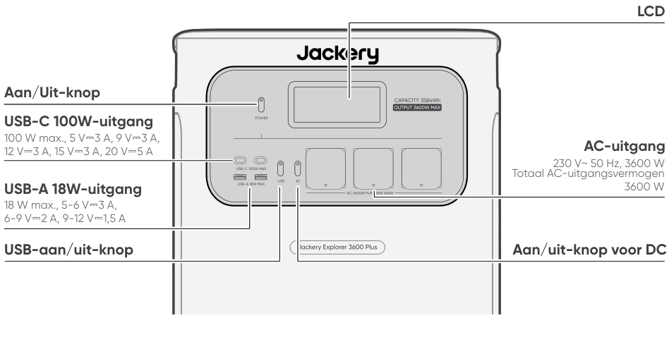
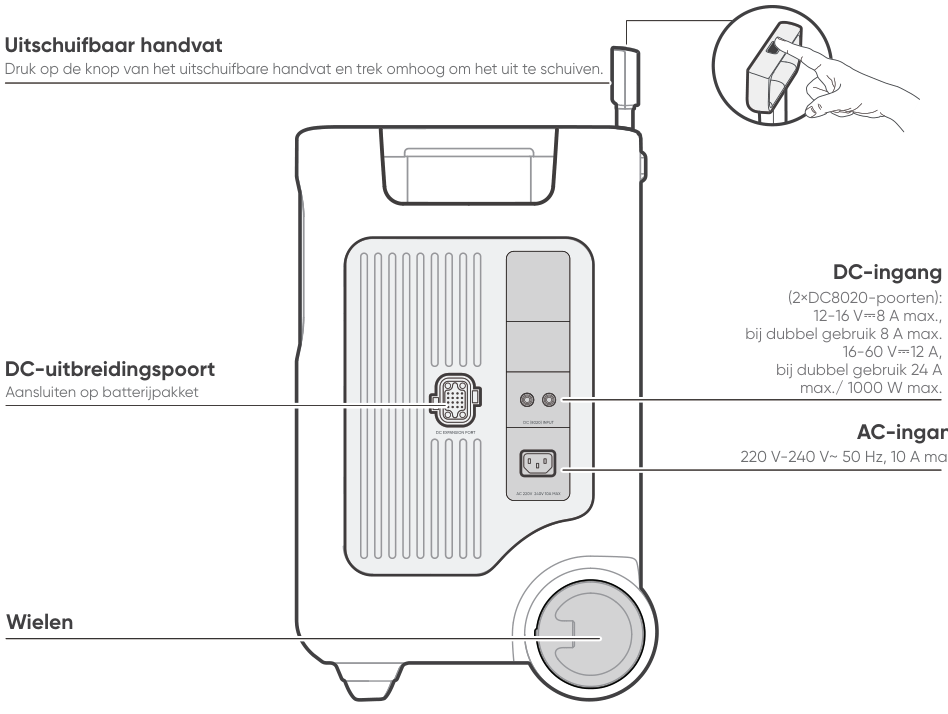

# BELANGRIJK

Gefeliciteerd met uw nieuwe Jackery Explorer 3600 Plus. Lees deze handleiding goed door voordat u het product gebruikt. Neem vooral de relevante voorzorgsmaatregelen door om een correct gebruik te garanderen. Bewaar deze handleiding op een gemakkelijk bereikbare plaats, zodat u deze regelmatig kunt raadplegen.

Volgens de wet en regels heeft het bedrijf het laatste woord over de interpretatie van dit document en alle andere documenten die bij dit product horen.

Houd er rekening mee dat er bij een update, herziening of beëindiging geen verdere kennisgevingen volgen.

# IMPORTANT SAFETY INFORMATION

<table class="manual-callout-table manual-callout-table"><tbody><tr><td class="manual-callout-label">WAARSCHUWING</td><td class="manual-callout-body">
AANWIJZINGEN BETREFFENDE HET RISICO OP BRAND, EEN ELEKTRISCHE SCHOK OF LETSEL AAN PERSONEN
</td></tr></tbody></table>

<strong>Volg altijd deze basisvoorzorgsmaatregelen wanneer u dit product gebruikt.</strong>

<ul><li>
Lees alle instructies voordat u het product gebruikt.
</li><li>
Kinderen mogen niet met het product spelen. Wanneer het product in de buurt van kinderen wordt gebruikt, is nauwlettend toezicht op de kinderen noodzakelijk.
</li><li>
Het gebruik van accessoires die niet worden aanbevolen of verkocht door professionele productfabrikanten kan een risico op elektrische schokken opleveren.
</li><li>
Haal de stekker uit de voedingsaansluiting van het product wanneer het product niet wordt gebruikt.
</li><li>
Demonteer het product niet, omdat dit kan leiden tot onvoorspelbare risico's zoals brand, explosie of elektrische schokken.
</li><li>
Gebruik het product niet met beschadigde snoeren, stekkers of uitgangskabels, omdat dit kan leiden tot een elektrische schok.
</li><li>
Houd de ventilatieopeningen van het product vrij om een goede luchtcirculatie te garanderen. De ruimte waar het product wordt gebruikt, moet voldoende luchtstroom hebben en koel en droog zijn om oververhitting te voorkomen. -Het opladen in vochtige of slecht geventileerde ruimtes kan veiligheidsrisico's met zich meebrengen. -Water kan kortsluiting of schade aan de oplader veroorzaken, wat kan leiden tot veiligheidsrisico's.  
</li><li>
Stel het product niet bloot aan vuur, hoge temperaturen, direct zonlicht of omgevingen met grote hitte, zoals in een geparkeerd voertuig. Een dergelijke blootstelling kan leiden tot brand of een explosie.
</li></ul>

## INSTRUCTIES VOOR GEBRUIKERSONDERHOUD

Tijdens de levensduur van energieopslagproducten kunt u rekening houden met een zekere mate van capaciteitsen energieverlies. Naarmate het aantal laad- en ontlaadcycli toeneemt en de opslagduur langer wordt, zal deze achteruitgang geleidelijk toenemen; dit is een normaal verschijnsel dat samenhangt met de natuurlijke veroudering van batterijcellen.

# Betekenis van symbolen

<figure aria-label="Betekenis van symbolen" class="hb-symbol-signal-composition" data-component-id="HB-TABLE-SYMBOL-SIGNAL"><table class="hb-symbol-signal-table"><colgroup><col class="hb-symbol-signal-col-label"/><col class="hb-symbol-signal-col-meaning"/></colgroup><thead><tr><th class="hb-symbol-signal-label-heading" scope="col">Symbool Beteke</th><th class="hb-symbol-signal-meaning-heading" scope="col">enis</th></tr></thead><tbody><tr><td class="hb-symbol-signal-label-cell">⚠WAARSCHUWING</td><td class="hb-symbol-signal-meaning-cell">Gevaarlijke handelingen die kunnen leiden tot ernstig letsel, overlijden en/of materiële schade.</td></tr><tr><td class="hb-symbol-signal-label-cell">⚠OPGELET</td><td class="hb-symbol-signal-meaning-cell">Gevaarlijke praktijken die kunnen leiden tot persoonlijk letsel en/of schade aan eigendommen.</td></tr><tr><td class="hb-symbol-signal-label-cell">⚠OPMERKING</td><td class="hb-symbol-signal-meaning-cell">Gevaarlijke praktijken die kunnen leiden tot schade aan apparatuur, gegevensverlies, slechtere prestaties of onverwachte resultaten.</td></tr><tr><td class="hb-symbol-signal-label-cell">⚠TIP</td><td class="hb-symbol-signal-meaning-cell">Vult de belangrijke informatie of bedieningstips in de tekst aan.</td></tr></tbody></table></figure>

<figure aria-label="Betekenis van symbolen" class="hb-symbol-pair-composition" data-component-id="HB-TABLE-SYMBOL-ICON">

<table class="hb-symbol-panel-table"><colgroup><col class="hb-symbol-col-icon"/><col class="hb-symbol-col-meaning"/></colgroup><thead><tr><th class="hb-symbol-icon-heading" scope="col">Symbool Beteke</th><th class="hb-symbol-meaning-heading" scope="col">enis</th></tr></thead><tbody><tr><td class="hb-symbol-icon"></td><td class="hb-symbol-meaning">Waarschuwings- en voorzorgssymbolen. Moet worden gelezen om personen te waarschuwen voor mogelijke gevaren of risico's.</td></tr><tr><td class="hb-symbol-icon"></td><td class="hb-symbol-meaning">Lees de gebruikershandleiding voor gebruik.</td></tr><tr><td class="hb-symbol-icon"></td><td class="hb-symbol-meaning">Demonteer het product niet.</td></tr><tr><td class="hb-symbol-icon"></td><td class="hb-symbol-meaning">Houd het product uit de buurt van vuur.</td></tr><tr><td class="hb-symbol-icon"></td><td class="hb-symbol-meaning">Houd het product buiten het bereik van kinderen.</td></tr><tr><td class="hb-symbol-icon"></td><td class="hb-symbol-meaning">Dit symbool geeft aan dat er een lithium-ion (Li-ion) accu in het product zit en dat deze op de juiste wijze moet worden afgevoerd of gerecycled.</td></tr></tbody></table>

<table class="hb-symbol-panel-table"><colgroup><col class="hb-symbol-col-icon"/><col class="hb-symbol-col-meaning"/></colgroup><thead><tr><th class="hb-symbol-icon-heading" scope="col">Symbool Beteke</th><th class="hb-symbol-meaning-heading" scope="col">enis</th></tr></thead><tbody><tr><td class="hb-symbol-icon"></td><td class="hb-symbol-meaning">Batterijen en accu's mogen niet bij het huishoudelijk afval worden weggegooid. Als consument bent u wettelijk verplicht om alle batterijen en accu's in te leveren bij daarvoor aangewezen inzamelpunten, ongeacht of ze gevaarlijke stoffen bevatten. Lever gebruikte batterijen en accu's in bij een plaatselijk inleverpunt, recyclingcentrum of bij de winkel waar u ze heeft gekocht. Een juiste afvalverwerking verzekert dat recycling op een milieuvriendelijke manier gebeurt en voorkomt mogelijke schade aan de menselijke gezondheid en het milieu.</td></tr><tr><td class="hb-symbol-icon"></td><td class="hb-symbol-meaning">Dit symbool geeft aan dat het product niet als huishoudelijk afval mag worden weggegooid en naar een aangewezen inzamelingspunt voor recycling moet worden gebracht. Een juiste afvalverwerking en recycling dragen bij aan een beter milieu. Voor meer informatie over de verwijdering en recycling van dit product, neem contact op met uw gemeente, afvalverwerkingsdienst of leverancier.</td></tr></tbody></table>

</figure>

# WAT ZIT ER IN DE DOOS

<figure aria-label="WAT ZIT ER IN DE DOOS" class="hb-inbox-composition" data-card-count="3" data-component-id="HB-SPECIAL-INBOX" data-inbox-variant="three-card-responsive"><ol class="hb-inbox-grid"><li class="hb-inbox-card" data-item-number="1">

Jackery Explorer 3600 Plus

</li><li class="hb-inbox-card" data-item-number="2">

AC-oplaadkabel

</li><li class="hb-inbox-card" data-item-number="3">

Gebruikershandleiding

</li></ol>

TIP

De oplaadkabel voor de auto is niet inbegrepen, maar is apart verkrijgbaar op onze website. Voor assistentie kunt u contact opnemen met de klantenservice van Jackery.

</figure>

# PRODUCTOVERZICHT

## VOORAANZICHT

<figure class="hb-reference-figure" data-component-id="HB-SPECIAL-REFERENCE-FIGURE" data-reference-id="overview-front" data-source-fragment-sha256="aa11acb9443f8b9f1db949858ff2d31fa6cd64d95e0fce0aab286c59a4edd995">

</figure>

## RECHTERZIJAANZICHT

<figure class="hb-reference-figure" data-component-id="HB-SPECIAL-REFERENCE-FIGURE" data-reference-id="overview-right" data-source-fragment-sha256="0a838bef7c19b2d649f6cf16d181a564083bfdf310d6df84ab1b05a30cdd7b4c">

</figure>

# LCD-SCHERM

<figure class="hb-reference-figure" data-component-id="HB-SPECIAL-REFERENCE-FIGURE" data-reference-id="lcd-map" data-source-fragment-sha256="ea2860c9eb38bf74713103c6b098af65b8c151a920bb19c3cb77e959cb761726">

</figure>

<figure aria-label="LCD-SCHERM" class="hb-lcd-table-composition" data-component-id="HB-TABLE-LCD-ICON" tabindex="0"><table class="hb-lcd-icon-table"><colgroup><col class="hb-lcd-col-number"/><col class="hb-lcd-col-icon"/><col class="hb-lcd-col-name"/><col class="hb-lcd-col-description"/></colgroup><tbody><tr><td class="hb-lcd-number">1</td><td class="hb-lcd-icon"></td><td class="hb-lcd-name">Wifi</td><td class="hb-lcd-description">
Aan: Wifi is verbonden. Knipperend: Klaar om met wifi te verbinden. Uit: Wifi is niet verbonden.
</td></tr><tr><td class="hb-lcd-number">2</td><td class="hb-lcd-icon"></td><td class="hb-lcd-name">Bluetooth</td><td class="hb-lcd-description">
Aan: Bluetooth is verbonden. Knipperend: Klaar om met Bluetooth te verbinden. Uit: Bluetooth is niet verbonden.
</td></tr><tr><td class="hb-lcd-number">3</td><td class="hb-lcd-icon"></td><td class="hb-lcd-name">Stille oplaadmodus</td><td class="hb-lcd-description">
Aan: Het geluid tijdens het opladen wordt aanzienlijk verminderd, terwijl het oplaadvermogen wordt verlaagd en de oplaadsnelheid afneemt. Uit: De stille oplaadmodus is uitgeschakeld. Schakel deze functie in of uit in de Jackery-app.
</td></tr><tr><td class="hb-lcd-number" rowspan="2">4</td><td class="hb-lcd-icon"></td><td class="hb-lcd-name">Batterijbesparingsmodus</td><td class="hb-lcd-description">
Aan: Beperkt de maximaal bruikbare batterijcapaciteit om de levensduur van de batterij te verlengen. Uit: De Batterijbesparingsmodus is uitgeschakeld. Schakel deze functie in of uit in de Jackery-app. Deze functie is niet beschikbaar wanneer het product is aangesloten op batterijpakketten.
</td></tr><tr><td class="hb-lcd-icon"></td><td class="hb-lcd-name">Zelfvoorzienende modus</td><td class="hb-lcd-description">
Maximaliseert het gebruik van zonne-energie en vermindert de afhankelijkheid van netstroom door prioriteit te geven aan opgeslagen zonne-energie, waardoor elektriciteitskosten dalen (schakel deze functie in of uit in de app). Het powerstation moet tegelijkertijd op zowel zonnepanelen als op het net worden aangesloten, waarbij het belastingsvermogen wordt beperkt door het bypass-vermogen.
</td></tr><tr><td class="hb-lcd-number">5</td><td class="hb-lcd-icon"></td><td class="hb-lcd-name">Oplaadplan</td><td class="hb-lcd-description">
Hiermee wordt de oplaadtijd van de Jackery Explorer 3600 Plus aangepast. Geschikt voor situaties met fluctuerende elektriciteitsprijzen en maakt het mogelijk om oplaadplannen te maken op basis van piek- en daluren, waardoor de elektriciteitskosten worden verlaagd. (Gelieve dit in de Jackery-app in te stellen).
</td></tr><tr><td class="hb-lcd-number">6</td><td class="hb-lcd-icon"></td><td class="hb-lcd-name">Indicator voor AC-voeding</td><td class="hb-lcd-description">
De AC-uitgang (zuivere sinusgolf) is ingeschakeld.
</td></tr><tr><td class="hb-lcd-number">7</td><td class="hb-lcd-icon"></td><td class="hb-lcd-name">Uitgangsspanning en -frequentie</td><td class="hb-lcd-description">
Geeft de uitgangsspanning en -frequentie weer wanneer de AC-uitgang is ingeschakeld.
</td></tr><tr><td class="hb-lcd-number">8</td><td class="hb-lcd-icon"></td><td class="hb-lcd-name">Invoervermogen</td><td class="hb-lcd-description">
Toont het ingangsvermogen in watt.
</td></tr><tr><td class="hb-lcd-number">9</td><td class="hb-lcd-icon"></td><td class="hb-lcd-name">Resterende oplaadtijd</td><td class="hb-lcd-description">
Toont de resterende oplaadtijd.
</td></tr><tr><td class="hb-lcd-number">10</td><td class="hb-lcd-icon"></td><td class="hb-lcd-name">Indicator voor opladen via een AC-stopcontact</td><td class="hb-lcd-description">
Het product wordt opgeladen via de AC-ingang met stroomnet.
</td></tr><tr><td class="hb-lcd-number">11</td><td class="hb-lcd-icon"></td><td class="hb-lcd-name">Indicator voor opladen via de auto</td><td class="hb-lcd-description">
Het product wordt opgeladen via de DC-ingang (DC8020) met DC 12 V (auto-opladen).
</td></tr><tr><td class="hb-lcd-number">12</td><td class="hb-lcd-icon"></td><td class="hb-lcd-name">Zonne-energieoplaadindicator</td><td class="hb-lcd-description">
Het product wordt opgeladen via de DC-ingang (DC8020) met zonnepanelen.
</td></tr><tr><td class="hb-lcd-number">13</td><td class="hb-lcd-icon"></td><td class="hb-lcd-name">Batterijstroom-indicator</td><td class="hb-lcd-description">
Wanneer het product wordt opgeladen, licht de oranje cirkel rond het batterijpercentage geleidelijk op. Wanneer u andere apparaten van stroom voorziet, blijft de oranje cirkel branden.
</td></tr><tr><td class="hb-lcd-number">14</td><td class="hb-lcd-icon"></td><td class="hb-lcd-name">Indicator voor laag batterijniveau</td><td class="hb-lcd-description">
Aan: Het batterijniveau is lager dan 20%. Knipperend: Het batterijniveau is lager dan 5%. Uit: Het batterijniveau is niet lager dan 20% of het product wordt opgeladen.
</td></tr><tr><td class="hb-lcd-number">15</td><td class="hb-lcd-icon"></td><td class="hb-lcd-name">Resterend batterijpercentage</td><td class="hb-lcd-description">
Geeft het resterende batterijpercentage weer.
</td></tr><tr><td class="hb-lcd-number">16</td><td class="hb-lcd-icon"></td><td class="hb-lcd-name">Batterijpakket-indicat or en aantal aangesloten batterijen</td><td class="hb-lcd-description">
Toont het aantal aangesloten batterijpakketten.
</td></tr><tr><td class="hb-lcd-number">17</td><td class="hb-lcd-icon"></td><td class="hb-lcd-name">Foutcode</td><td class="hb-lcd-description">
Er is een productfout opgetreden. Raadpleeg voor details de sectie Probleemoplossing.
</td></tr><tr><td class="hb-lcd-number" rowspan="2">18</td><td class="hb-lcd-icon"></td><td class="hb-lcd-name">Indicator voor hoge temperatuur</td><td class="hb-lcd-description">
De beveiliging tegen hoge temperaturen is geactiveerd. Het product kan stoppen met werken totdat de temperatuur weer binnen het normale bedrijfsbereik is.
</td></tr><tr><td class="hb-lcd-icon"></td><td class="hb-lcd-name">Indicator voor lage temperatuur</td><td class="hb-lcd-description">
De beveiliging tegen lege temperaturen is geactiveerd. Het product kan stoppen met werken totdat de temperatuur weer binnen het normale bedrijfsbereik is.
</td></tr><tr><td class="hb-lcd-number">19</td><td class="hb-lcd-icon"></td><td class="hb-lcd-name">Energiebesparingsmodus</td><td class="hb-lcd-description">
Wanneer de AC- of USB-uitgang wordt ingeschakeld door op de Aan/uit-knop voor AC of USB te drukken: Aan: De Energiebesparingsmodus is ingeschakeld. Uit: De Energiebesparingsmodus is uitgeschakeld.
</td></tr><tr><td class="hb-lcd-number">20</td><td class="hb-lcd-icon"></td><td class="hb-lcd-name">Uitgangsvermogen</td><td class="hb-lcd-description">
Geeft het uitgangsvermogen in watt weer.
</td></tr><tr><td class="hb-lcd-number">21</td><td class="hb-lcd-icon"></td><td class="hb-lcd-name">Resterende ontlaadtijd</td><td class="hb-lcd-description">
Geeft de resterende ontlaadtijd weer.
</td></tr></tbody></table></figure>

# HANDELINGEN

## IN-/UITSCHAKELEN

<figure class="hb-reference-figure hb-base-art-live-copy" data-component-id="HB-SPECIAL-REFERENCE-FIGURE" data-reference-id="operation-main-power" data-source-fragment-sha256="aa6a6960c5340ab88129418d912ac0ec30521bd5f711c85368d908fd96296030" data-web-base-art-ref="operation-main-power" data-web-presentation-mode="base-art-live-copy">

Aan Druk één keerUit Houd 3 seconden ingedrukt. 3sStandaard stand-bymodustijd: 2 uur Het product wordt na 2 uur inactiviteit automatisch uitgeschakeld, zonder dat er wordt opgeladen of ontladen. * De stand-bytijd kan worden ingesteld in de Jackery-app.Wanneer de Energiebesparingsmodus is ingeschakeld, wordt het product na 12 uur automatisch uitgeschakeld als de aan/uit-knop voor AC of USB op AAN staat, maar het product niet wordt opgeladen of ontladen.

</figure>

## AAN/UIT VOOR USB-UITGANG

<figure class="hb-operation-figure hb-operation-layout-status-right hb-base-art-live-copy" data-component-id="HB-SPECIAL-OPERATION" data-operation-id="dc-usb-output" data-source-fragment-sha256="ebce7d22aa8e0954596db4782488291f2195bacbe71fcf28b68b0425c12bac4d" data-web-base-art-ref="operation/dc_usb_output" data-web-presentation-mode="base-art-live-copy" data-web-replace-key="operation.dc-usb-output">

<strong>Voorwaarde:</strong> Het product is ingeschakeld.

<strong>Aan</strong>

Druk één keer

<strong>Uit</strong>

Druk één keer

</figure>

<table class="manual-callout-table manual-callout-table"><tbody><tr><td class="manual-callout-label">OPGELET</td><td class="manual-callout-body"><ul><li>
USB-C 100 W MAX is een USB-PD Power Source 3 (PS3)-uitgangspoort met hoog vermogen. Als het aangesloten apparaat of accessoire niet aan de veiligheidsvereisten voldoet, kan er brandgevaar ontstaan. Controleer voordat u deze poorten gebruikt of het aangesloten apparaat of accessoire beschikt over brandbeveiliging.
</li><li>
Sluit de Jackery Explorer 3600 Plus alleen aan op apparaten of accessoires die voldoen aan clausules 6.3, 6.4 en 6.5 van IEC/EN/UL 62368-1 (of andere gelijkwaardige normen).
</li><li>
Gebruik de officiële Jackery USB-C naar USB-C 5A-kabel (20 V DC/5 A, 100 W) voor maximaal uitgangsvermogen.
</li></ul></td></tr></tbody></table>

## AAN/UIT VOOR AC-UITGANG

<figure class="hb-operation-figure hb-operation-layout-status-right hb-base-art-live-copy" data-component-id="HB-SPECIAL-OPERATION" data-operation-id="ac-output" data-source-fragment-sha256="b15766e989733899e1881b8bde28b2cad17f283b5d747a9e751c8416cbf2ac87" data-web-base-art-ref="operation/ac_output" data-web-presentation-mode="base-art-live-copy" data-web-replace-key="operation.ac-output">

<strong>Voorwaarde:</strong> Het product is ingeschakeld.

<strong>Aan</strong>

Druk één keer

<strong>Uit</strong>

Druk één keer

</figure>

## ENERGIEBESPARINGSMODUS

<figure class="hb-reference-figure hb-base-art-live-copy" data-component-id="HB-SPECIAL-REFERENCE-FIGURE" data-reference-id="operation-energy-saving" data-source-fragment-sha256="e470a4523e7d4e92ef37f64c72086274975bd384fd4698fd64fbdc807d6d0aa2" data-web-base-art-ref="operation-energy-saving" data-web-presentation-mode="base-art-live-copy">

Om onnodig batterijverbruik te voorkomen wanneer u vergeet de uitgang uit te schakelen, schakelt het product standaard de energiebesparende modus in. Als er gedurende 12 uur geen apparaat is aangesloten of het stroomverbruik van het aangesloten apparaat onder een bepaalde drempelwaarde ligt (25 W AC-uitgang of 2 W USB-uitgang), schakelt het product de uitgangen automatisch uit. Om de Energiebesparingsmodus uit te schakelen, houdt u zowel de Aan/uit-knop voor AC als de AAN/UIT-knop langer dan 3 seconden ingedrukt. Het product zal de AC- of DC-uitgang niet automatisch uitschakelen.Hoofd AAN/UIT-knopAan/uit-knop voor DCAan/Uit Houd 3 seconden ingedrukt.

</figure>

<table class="manual-callout-table manual-callout-table"><tbody><tr><td class="manual-callout-label">OPMERKING</td><td class="manual-callout-body">
De Energiebesparingsmodus hervat de vorige status na het inschakelen. Voor het wijzigen van de modus is handmatig schakelen vereist.
</td></tr></tbody></table>

## LCD-SCHERM

<figure aria-label="LCD-SCHERM" class="hb-lcd-mode-composition" data-component-id="HB-TABLE-LCD-MODE">

<table class="hb-lcd-mode-table"><colgroup><col class="hb-lcd-mode-col-state"/><col class="hb-lcd-mode-col-action"/><col class="hb-lcd-mode-col-copy"/></colgroup><tbody><tr><td class="hb-lcd-mode-state" rowspan="3">Kort inschakelen</td><td class="hb-lcd-mode-action">Inschakelen</td><td class="hb-lcd-mode-copy">Druk op de AAN/UIT-knop of wanneer het product oplaadt.</td></tr><tr><td class="hb-lcd-mode-action">Uitschakelen</td><td class="hb-lcd-mode-copy">Druk op de Aan/Uit-knop.</td></tr><tr><td class="hb-lcd-mode-action">Automatisch uitschakelen</td><td class="hb-lcd-mode-copy">Het LCD-scherm schakelt automatisch uit en gaat in slaapstand na 2 minuten inactiviteit.</td></tr><tr><td class="hb-lcd-mode-state" rowspan="3">Continu inschakelen (bij laden of ontladen)</td><td class="hb-lcd-mode-action">Inschakelen</td><td class="hb-lcd-mode-copy">Druk tweemaal op de AAN/UIT-knop wanneer het product is ingeschakeld.</td></tr><tr><td class="hb-lcd-mode-action">Uitschakelen</td><td class="hb-lcd-mode-copy">Druk op de Aan/Uit-knop.</td></tr><tr><td class="hb-lcd-mode-action">Automatisch uitschakelen</td><td class="hb-lcd-mode-copy">Het LCD-scherm schakelt automatisch uit na 2 uur inactiviteit.</td></tr></tbody></table>
</figure>

U kunt de schermweergavemodus ook instellen in de Jackery-app.

## TOETSCOMBINATIE

<figure aria-label="Knoppen / BEDIENING / Functie" class="hb-key-combination-composition" data-component-id="HB-TABLE-KEY-COMBINATIONS" tabindex="0"><table class="hb-key-combination-table"><colgroup><col class="hb-key-col-buttons"/><col class="hb-key-col-operation"/><col class="hb-key-col-function"/></colgroup><thead><tr><th class="hb-key-buttons" scope="col">Knoppen</th><th class="hb-key-operation" scope="col">BEDIENING</th><th class="hb-key-function" scope="col">Functie</th></tr></thead><tbody><tr><td class="hb-key-buttons">Aan/Uit-knop + USB-aan/uit-knop</td><td class="hb-key-operation">Houd beide knoppen 3 seconden ingedrukt</td><td class="hb-key-function">Reset wifi en Bluetooth</td></tr><tr><td class="hb-key-buttons">Aan/Uit-knop + Aan/uit-knop voor DC</td><td class="hb-key-operation">Houd beide knoppen 3 seconden ingedrukt</td><td class="hb-key-function">De Energiebesparingsmodus in-/uitschakelen</td></tr><tr><td class="hb-key-buttons">USB-aan/uit-knop + Aan/uit-knop voor DC</td><td class="hb-key-operation">Houd beide knoppen 1 seconde ingedrukt</td><td class="hb-key-function">Wifi en Bluetooth in- of uitschakelen</td></tr></tbody></table></figure>

# ONONDERBROKEN STROOMVOORZIENING (UPS)

Sluit het product met de AC-oplaadkabel aan op een stopcontact, druk vervolgens op de Aan/uit-knop voor AC en voorzie uw apparaten tegelijkertijd van stroom.

<figure class="hb-reference-figure hb-base-art-live-copy" data-component-id="HB-SPECIAL-REFERENCE-FIGURE" data-reference-id="ups" data-source-fragment-sha256="087ed73ab5f4355d70820583588fa78e2594b1b11aae48f2b94fed4b8b008494" data-web-base-art-ref="ups" data-web-presentation-mode="base-art-live-copy">

Een ononderbroken stroomvoorziening (UPS) is een type voortdurend stroomvoorzieningssysteem dat automatisch back-upstroom levert aan een belasting wanneer de netstroom uitvalt. Bij een plotseling verlies van netstroom schakelt de Explorer 3600 Plus automatisch binnen 10 ms over op opgeslagen stroom om uw apparaten draaiende te houden.

</figure>

In de UPS-modus bedraagt de piekuitgang van het apparaat 10A zonder stroomuitval. Omdat gelijktijdig laden/ontladen is ingeschakeld in de Bypass-modus, is het werkelijke uitgangsvermogen in deze modus lager dan het nominale uitgangsvermogen. Tijdens stroomuitval keert het echter terug naar het nominale uitgangsvermogen.

<table class="manual-callout-table manual-callout-table"><tbody><tr><td class="manual-callout-label">OPGELET</td><td class="manual-callout-body"><ul><li>
Dit product ondersteunt geen omschakeling binnen 0 ms. Sluit dit apparaat niet aan op apparatuur die een voeding met 0 ms omschakeltijd vereist, zoals gegevensservers of werkstations.
</li><li>
Test vóór gebruik meerdere keren of het product compatibel is met uw apparaat.
</li><li>
Sluit geen belastingen aan die het maximale uitgangsvermogen van het product overschrijden. Anders wordt de overbelastingsbeveiliging geactiveerd.
</li></ul></td></tr></tbody></table>

# VERBINDINGEN

<h2 class="hb-subbar" id="aansluiten-op-batterijpakketten-apart-verkocht">AANSLUITEN OP BATTERIJPAKKET(TEN) APART VERKOCHT</h2>

Dit product kan maximaal 5 batterijpakketten ondersteunen om te voldoen aan de behoefte aan een grote vermogenscapaciteit. Voor details over het gebruik raadpleegt u de gebruikershandleiding van de Jackery Battery Pack 3600.

<figure class="hb-reference-figure hb-base-art-live-copy" data-component-id="HB-SPECIAL-REFERENCE-FIGURE" data-reference-id="battery" data-source-fragment-sha256="9eb3693d55cf1278405a9a142fe59fcb8709f598c8829d2a2212627b119a0cbe" data-web-base-art-ref="battery" data-web-presentation-mode="base-art-live-copy">

≥ 200 mm≥ 200 mm

</figure>

<table class="manual-callout-table manual-callout-table"><tbody><tr><td class="manual-callout-label">OPGELET</td><td class="manual-callout-body"><ul><li>
Zorg ervoor dat alle producten zijn uitgeschakeld voordat u de Explorer 3600 Plus op de Jackery Battery Pack 3600 aansluit.
</li><li>
Zorg voor een goede werking van het product door ervoor te zorgen dat de luchtinlaaten uitlaatopeningen aan beide zijden niet geblokkeerd zijn. Zorg voor minimaal 200 mm ruimte tussen de ventilatieopeningen en eventuele voorwerpen om een goede warmteafvoer mogelijk te maken.
</li></ul></td></tr></tbody></table>

<figure class="hb-reference-figure hb-base-art-live-copy" data-component-id="HB-SPECIAL-REFERENCE-FIGURE" data-reference-id="battery-accessories" data-source-fragment-sha256="436e6a241fac3ee281b365e15f2a67e5bdf7e63b15dad45425187ef9773a89b0" data-web-base-art-ref="battery-accessories" data-web-presentation-mode="base-art-live-copy">

Jackery Battery Pack 3600UitbreidingskabelGebruikershandleidingAPART VERKOCHT

</figure>

# OPLADEN

<strong>Groene energie eerst:</strong> Wij raden aan om eerst groene energie te gebruiken. Dit product ondersteunt twee modi voor opladen tegelijkertijd: Opladen via zonnepanelen en opladen een AC-stopcontact. Wanneer het opladen via een AC-stopcontact en het opladen via zonnepanelen tegelijkertijd zijn ingeschakeld, geeft het product prioriteit aan het opladen via zonnepanelen en worden beide methoden gebruikt om de batterij te laden met het maximaal toegestane vermogen.

Laad het product voor het eerste gebruik volledig op.

<table class="manual-callout-table manual-callout-table"><tbody><tr><td class="manual-callout-label">OPMERKING</td><td class="manual-callout-body"><ul><li>
De aanbevolen oplaadtemperatuur voor het product ligt tussen -20°C en 45°C, en de ontlaadtemperatuur tussen -20°C en 45°C. Het gebruik van het product buiten dit temperatuurbereik kan de laad- en ontlaadmogelijkheden beperken of zelfs voorkomen dat het product kan opladen of ontladen.
</li><li>
Het oplaadvermogen en de batterijcapaciteit van het product kunnen variëren als gevolg van verschillende temperaturen.
</li></ul></td></tr></tbody></table>

## OPLADEN VIA AC-STOPCONTACT

<figure class="hb-reference-figure hb-base-art-live-copy" data-component-id="HB-SPECIAL-REFERENCE-FIGURE" data-reference-id="charging-ac" data-source-fragment-sha256="967899b0ce9d65f00c4fbe6901dbb3ca7190620b14677ed9266c6102b8e26faf" data-web-base-art-ref="charging-ac" data-web-presentation-mode="base-art-live-copy">

Sluit de AC-oplaadkabel aan op de AC-ingangspoort van het product en op een stopcontact.

</figure>

<table class="manual-callout-table manual-callout-table"><tbody><tr><td class="manual-callout-label">OPGELET</td><td class="manual-callout-body">
Zorg ervoor dat de AC-oplaadkabel volledig en correct in de AC-ingangspoort is gestoken. Een onvolledige verbinding kan instabiele stroom, oververhitting, slecht contact of apparaatstoringen veroorzaken.
</td></tr></tbody></table>

<h2 class="hb-subbar" id="of-apparaatstoringen-veroorzaken-opladen-via-zonnepanelen-apart-verkocht">of apparaatstoringen veroorzaken. OPLADEN VIA ZONNEPANELEN APART VERKOCHT</h2>

OPLADEN VIA ZONNEPANELEN APART VERKOCHT De Jackery Explorer 3600 Plus heeft twee DC8020-ingangen en is compatibel met de Jackery-zonnepanelen. Als er op één DC8020-ingangspoort twee zonnepanelen tegelijk moeten worden aangesloten, raadpleeg dan de onderstaande afbeelding voor het opladen via de zonnepaneel-connector (deze is apart verkrijgbaar en wordt niet standaard meegeleverd).

<figure class="hb-reference-figure hb-base-art-live-copy" data-component-id="HB-SPECIAL-REFERENCE-FIGURE" data-reference-id="charging-solar" data-source-fragment-sha256="b19d8622a4150edbc36830bc842910b6f17d60391198e798de99655bb462bf8b" data-web-base-art-ref="charging-solar" data-web-presentation-mode="base-art-live-copy">

SolarSaga 200 × 4

</figure>

<table class="manual-callout-table manual-callout-table"><tbody><tr><td class="manual-callout-label">OPGELET</td><td class="manual-callout-body">
Op één DC8020-ingangspoort kunnen maximaal twee zonnepanelen worden aangesloten.
</td></tr></tbody></table>

<table class="manual-callout-table manual-callout-table"><tbody><tr><td class="manual-callout-label">OPGELET</td><td class="manual-callout-body"><ul><li>
Zorg ervoor dat de ingangsspanning van beide DC-ingangspoorten dezelfde is. Als u dit niet doet, kan het product beschadigd raken. Bijvoorbeeld:
</li><li>
Gebruik hetzelfde model van en hetzelfde aantal aan Jackery-zonnepanelen wanneer u zonnepanelen aansluit op beide DC8020-ingangspoorten.
</li><li>
Laad het product niet tegelijkertijd op via zowel een autolader als een zonnepaneel. Hierdoor kan de autozekering doorbranden of leiden tot een laadstoring.
</li></ul></td></tr></tbody></table>

Het wordt aanbevolen om het product op te laden met het Jackery-zonnepaneel. Zorg ervoor dat de open-klemspanning (VOC) van het zonnepaneel binnen het DC-ingangsbereik (16 V-60 V) van de Explorer 3600 Plus ligt. Jackery is niet verantwoordelijk voor schade of verlies als gevolg van het gebruik van zonnepanelen van derden.

<h2 class="hb-subbar" id="opladen-via-een-autolader-apart-verkocht">OPLADEN VIA EEN AUTOLADER APART VERKOCHT</h2>

Dit product kan worden opgeladen met een 12 V-auto-oplader. Zorg ervoor dat de autolader en de 12 V-aansluiting in de auto (sigarettenaansteker) goed zijn aangesloten.

<figure class="hb-reference-figure hb-base-art-live-copy" data-component-id="HB-SPECIAL-REFERENCE-FIGURE" data-reference-id="charging-car" data-source-fragment-sha256="ad001b07be92e6b13cdd0c99fc7dcbeff6b06185c86ad1fe2e42441117e108f9" data-web-base-art-ref="charging-car" data-web-presentation-mode="base-art-live-copy">

Voertuig*De oplaadkabel voor de auto is apart verkrijgbaar.

</figure>

<table class="manual-callout-table manual-callout-table"><tbody><tr><td class="manual-callout-label">OPGELET</td><td class="manual-callout-body"><ul><li>
Start het voertuig voordat u uw powerstation oplaadt.
</li><li>
Als u met uw voertuig op oneffen wegen rijdt, is het verboden de autolader te gebruiken om niet-standaard werking te voorkomen. Het bedrijf is niet aansprakelijk voor enig verlies of schade als gevolg van niet-standaard gebruik.
</li><li>
Opladen via de auto is alleen van toepassing op voertuigen met 12 V DC, niet op 24 V DC. Laad dit product niet op in een voertuig met 24 V om persoonlijk letsel en materiële schade te voorkomen.
</li></ul></td></tr></tbody></table>

# Opslag

Bewaar het product op een droge, schone plaats met goede ventilatie. Opslagtemperatuur en -vochtigheid:
<ul class="hb-source-storage-copy" style="margin:0"><li class="hb-source-storage-item" style="margin:0">
1 maand: -20°C tot 45°C (0-60%RH)
</li><li class="hb-source-storage-item" style="margin:0">
3 maanden: 0°C tot 45°C (0-60%RH)
</li><li class="hb-source-storage-item" style="margin:0">
12 maanden: 0°C tot 25°C (0-60%RH)
</li></ul>
Als dit product gedurende langere tijd (3 maanden - 6 maanden) met een lege batterij wordt bewaard, kan het zijn dat het niet meer kan worden opgeladen. Om dit te voorkomen en de batterij in goede conditie te houden, is het aan te raden om het product elke drie maanden te controleren en op te laden, waarbij minstens één keer per 6 tot 12 maanden een volledige laad- en ontlaadcyclus moet worden uitgevoerd.

# PROBLEEMOPLOSSING

Als een van de volgende foutcodes verschijnt, volg dan de vermelde corrigerende acties om het probleem op te lossen. Als het probleem aanhoudt, neem dan contact op met Jackery-klantenondersteuning.

<figure aria-label="Foutcode / Oplossingsmaatregelen" class="hb-troubleshooting-composition" data-component-id="HB-TABLE-TROUBLESHOOTING" tabindex="0"><table class="hb-troubleshooting-table"><colgroup><col class="hb-troubleshooting-col-code"/><col class="hb-troubleshooting-col-measures"/></colgroup><thead><tr><th class="hb-troubleshooting-code" scope="col">Foutcode</th><th class="hb-troubleshooting-measures" scope="col">Oplossingsmaatregelen</th></tr></thead><tbody><tr><td class="hb-troubleshooting-code">F0</td><td class="hb-troubleshooting-measures">Herstart het product.</td></tr><tr><td class="hb-troubleshooting-code">F1</td><td class="hb-troubleshooting-measures">Herstart het product.</td></tr><tr><td class="hb-troubleshooting-code">F2</td><td class="hb-troubleshooting-measures">Herstart het product.</td></tr><tr><td class="hb-troubleshooting-code">F3</td><td class="hb-troubleshooting-measures">Herstart het product.</td></tr><tr><td class="hb-troubleshooting-code">F4</td><td class="hb-troubleshooting-measures">Sluit het product aan op belastingen om de batterij te ontladen totdat de fout verdwijnt.</td></tr><tr><td class="hb-troubleshooting-code">F5</td><td class="hb-troubleshooting-measures">Laad het product op via zonnepanelen of een AC-stopcontact tot de fout verdwijnt.</td></tr><tr><td class="hb-troubleshooting-code">F6</td><td class="hb-troubleshooting-measures">1. Wacht tot het net genormaliseerd is voordat u het product via een AC-stopcontact oplaadt. 2. Controleer of de luchtinlaat- en uitlaatopeningen geblokkeerd zijn; zorg voor 200 mm ruimte aan beide zijden van het product. 3. Plaats het product op een locatie die niet wordt blootgesteld aan direct zonlicht of hoge omgevingstemperaturen. 4. Koppel alle belastingen van het product los. Laat het product inactief en wacht tot de fout verdwijnt. 5. Herstart het product.</td></tr><tr><td class="hb-troubleshooting-code">F7</td><td class="hb-troubleshooting-measures">1. Koppel alle DC-ingangen los van het product. 2. Controleer de open-klemspanning (Voc) van de aangesloten zonnepanelen. Het product staat een maximale DC-ingangsspanning van 60 V toe. 3. Start het product opnieuw op en houd het inactief. Wacht tot de fout verdwijnt.</td></tr><tr><td class="hb-troubleshooting-code">F8</td><td class="hb-troubleshooting-measures">Neem contact op met de Jackery-klantenondersteuning.</td></tr><tr><td class="hb-troubleshooting-code">F9</td><td class="hb-troubleshooting-measures">Verwijder de belasting die op de USB-poorten van het product is aangesloten. Wacht tot de fout verdwijnt.</td></tr><tr><td class="hb-troubleshooting-code">FA</td><td class="hb-troubleshooting-measures">1. Schakel de AC-uitgang van beide apparaten uit. 2. Druk binnen 1 minuut opnieuw op de Aan/uit-knop voor AC van elk apparaat.</td></tr><tr><td class="hb-troubleshooting-code">FC</td><td class="hb-troubleshooting-measures">1. Herstart respectievelijk de batterijpakketten en de Jackery Explorer 3600 Plus. 2. Als de fout aanhoudt, koppelt u het batterijpakket los van de Jackery Explorer 3600 Plus en sluit u ze opnieuw aan.</td></tr></tbody></table></figure>

# Specificaties

<h2 aria-level="2" role="heading">ALGEMENE INFORMATIE</h2><figure aria-label="ALGEMENE INFORMATIE" class="hb-spec-table-composition"><table class="manual-table manual-spec-table hb-spec-table"><colgroup><col class="hb-spec-col-label"/><col class="hb-spec-col-value"/></colgroup><tbody><tr><th class="manual-spec-label hb-spec-label" scope="row">Productnaam</th><td class="manual-spec-value hb-spec-value">Jackery Explorer 3600 Plus</td></tr><tr><th class="manual-spec-label hb-spec-label" scope="row">Modelnummer</th><td class="manual-spec-value hb-spec-value">JE-3600A</td></tr><tr><th class="manual-spec-label hb-spec-label" scope="row">Capaciteit</th><td class="manual-spec-value hb-spec-value">80 Ah / 44,8 V DC (3584 Wh)</td></tr><tr><th class="manual-spec-label hb-spec-label" scope="row">Celchemie</th><td class="manual-spec-value hb-spec-value">LiFePO4</td></tr><tr><th class="manual-spec-label hb-spec-label" scope="row">Gewicht</th><td class="manual-spec-value hb-spec-value">Ongeveer 35 kg</td></tr><tr><th class="manual-spec-label hb-spec-label" scope="row">Afmetingen</th><td class="manual-spec-value hb-spec-value">38,5×30,9×49,1 cm</td></tr><tr><th class="manual-spec-label hb-spec-label" scope="row">Levenscyclus</th><td class="manual-spec-value hb-spec-value">6000 cycli tot 70%+ capaciteit</td></tr><tr><th class="manual-spec-label hb-spec-label" scope="row">IEC-code</th><td class="manual-spec-value hb-spec-value">IFpR41/136[14S4P]M/-20+40/90</td></tr></tbody></table></figure><h2 aria-level="2" role="heading">INGANGSPOORTEN</h2><figure aria-label="INGANGSPOORTEN" class="hb-spec-table-composition"><table class="manual-table manual-spec-table hb-spec-table"><colgroup><col class="hb-spec-col-label"/><col class="hb-spec-col-value"/></colgroup><tbody><tr><th class="manual-spec-label hb-spec-label" scope="row">1 × AC-ingang</th><td class="manual-spec-value hb-spec-value">Oplaadmodus : 220-240 V~ 50Hz, max. 10 A</td></tr><tr><th class="manual-spec-label hb-spec-label" scope="row">1 × AC-ingang</th><td class="manual-spec-value hb-spec-value">Bypass-modus①: 220-240 V~ 50Hz, max. 10A</td></tr><tr><th class="manual-spec-label hb-spec-label" scope="row">2 × DC8020-poorten</th><td class="manual-spec-value hb-spec-value">12-16 V⎓8 A max, dubbel naar 8 A max</td></tr><tr><th class="manual-spec-label hb-spec-label" scope="row">2 × DC8020-poorten</th><td class="manual-spec-value hb-spec-value">16-60 V⎓12 A, max. 24 A bij verdubbeling / max. 1000 W</td></tr><tr><th class="manual-spec-label hb-spec-label" scope="row">1 × DC-uitbreidingspoort</th><td class="manual-spec-value hb-spec-value">36,4 V-50,4 V⎓100 A Max</td></tr></tbody></table></figure><h2 aria-level="2" role="heading">UITGANGSPOORTEN</h2><figure aria-label="UITGANGSPOORTEN" class="hb-spec-table-composition"><table class="manual-table manual-spec-table hb-spec-table"><colgroup><col class="hb-spec-col-label"/><col class="hb-spec-col-value"/></colgroup><tbody><tr><th class="manual-spec-label hb-spec-label" scope="row">3 × AC-uitgang</th><td class="manual-spec-value hb-spec-value">230 V~ 50 Hz, 3600 W</td></tr><tr><th class="manual-spec-label hb-spec-label" scope="row">AC-totaalvermogen②</th><td class="manual-spec-value hb-spec-value">3600W nominaal, 7200W piekvermogen</td></tr><tr><th class="manual-spec-label hb-spec-label" scope="row">AC-uitgang in Bypassmodus①</th><td class="manual-spec-value hb-spec-value">220-240 V~ 50Hz, max. 10 A</td></tr><tr><th class="manual-spec-label hb-spec-label" scope="row">2 × USB-C-uitgang (100 W)</th><td class="manual-spec-value hb-spec-value">100 W Max, 5 V⎓3 A, 9 V⎓3 A, 12 V⎓3 A, 15 V⎓3 A, 20 V⎓5 A</td></tr><tr><th class="manual-spec-label hb-spec-label" scope="row">2 × USB-A-uitgang (18 W)</th><td class="manual-spec-value hb-spec-value">18 W Max, 5-6 V⎓3 A, 6-9 V⎓2 A, 9-12 V⎓1,5 A</td></tr><tr><th class="manual-spec-label hb-spec-label" scope="row">1 × DC-uitbreidingspoort</th><td class="manual-spec-value hb-spec-value">36,4 V-50,4 V⎓60 A Max</td></tr></tbody></table></figure><h2 aria-level="2" role="heading">BEDRIJFSTEMPERATUUR</h2><figure aria-label="BEDRIJFSTEMPERATUUR" class="hb-spec-table-composition"><table class="manual-table manual-spec-table hb-spec-table"><colgroup><col class="hb-spec-col-label"/><col class="hb-spec-col-value"/></colgroup><tbody><tr><th class="manual-spec-label hb-spec-label" scope="row">Oplaadtemperatuur</th><td class="manual-spec-value hb-spec-value">-20°C tot 45°C</td></tr><tr><th class="manual-spec-label hb-spec-label" scope="row">Ontlaadtemperatuur</th><td class="manual-spec-value hb-spec-value">-20°C tot 45°C</td></tr></tbody></table></figure>

※ USB Type-C® en USB-C® zijn geregistreerde handelsmerken van USB Implementers Forum.

① Het product kan de batterij opladen via het AC-stopcontact terwijl het tegelijkertijd stroom levert via de AC-uitgangspoorten.

② Geeft aan dat twee of meer AC-uitgangspoorten samenwerken.

# GARANTIE

<figure aria-label="GARANTIE" class="hb-warranty-intro-composition" data-component-id="HB-WARRANTY-LEAD">

<strong>We bieden onze garantie alleen aan klanten die aankopen bij de officiële Jackery-website, Jackery-merkplatformen van derden of lokale erkende dealers.</strong>

*De garantieperiode en details kunnen variëren volgens lokale wetten, voorschriften en erkende dealers.

</figure>

## Beperkte garantie

<figure aria-label="Beperkte garantie" class="hb-warranty-card" data-component-id="HB-WARRANTY-SECTION" data-warranty-card-index="1">
Jackery garandeert aan de oorspronkelijke consument-koper dat het Jackery-product vrij is van fabricage- en materiaalfouten bij normaal consumentengebruik gedurende de toepasselijke garantieperiode, zoals vermeld in de sectie 'Garantieperiode' hieronder, onder voorbehoud van de hieronder uiteengezette uitsluitingen. In deze garantieverklaring worden de volledige en uitsluitende garantieverplichtingen van Jackery uiteengezet. Wij aanvaarden geen andere aansprakelijkheid, noch machtigen wij iemand om namens ons enige andere aansprakelijkheid te aanvaarden in verband met de verkoop van onze producten.
</figure>

## Garantieperiode

<figure aria-label="Garantieperiode" class="hb-warranty-period-card" data-component-id="HB-WARRANTY-YEARS">

3
<strong class="hb-warranty-years-unit">JAAR</strong><strong class="hb-warranty-period-label">Standaardgarantie</strong>

De standaard garantieperiode voor de Jackery Explorer 3600 Plus is 36 maanden. In alle gevallen gaat de garantieperiode in op de datum van aankoop door de oorspronkelijke consument-koper. Om de startdatum van de garantieperiode te bepalen, is de aankoopbon van de eerste consumentenaankoop of ander redelijk bewijsstuk vereist.

2
<strong class="hb-warranty-years-unit">JAAR</strong><strong class="hb-warranty-period-label">Verlengde garantie</strong>

Om de garantieverlenging te activeren, moet u uw product online registreren of contact opnemen met onze klantenservice via hello.eu@jackery.com om de duur van de standaardgarantie te verlengen.

</figure>

## Ruilen

<figure aria-label="Ruilen" class="hb-warranty-card" data-component-id="HB-WARRANTY-SECTION" data-warranty-card-index="2">
Jackery vervangt (op kosten van Jackery) elk Jackery-product dat gedurende de toepasselijke garantieperiode niet functioneert als gevolg van een fabricage- of materiaalfout. Een vervangend product neemt de resterende garantie van het originele product over.
</figure>

## Beperkt tot de oorspronkelijke koper

<figure aria-label="Beperkt tot de oorspronkelijke koper" class="hb-warranty-card" data-component-id="HB-WARRANTY-SECTION" data-warranty-card-index="3">
De garantie op Jackery's product is beperkt tot de oorspronkelijke consument-koper en is niet overdraagbaar aan een volgende eigenaar.
</figure>

## Uitsluitingen

<figure aria-label="Uitsluitingen" class="hb-warranty-card" data-component-id="HB-WARRANTY-SECTION" data-warranty-card-index="4">
De garantie van Jackery is niet van toepassing op:
<ul><li>Onjuist gebruik, misbruik, wijziging, ongeluksschade of gebruik anders dan normaal consumentengebruik, zoals toegestaan in de huidige productliteratuur van Jackery.</li><li>Een poging tot reparatie door iemand anders dan een erkend servicecentrum.</li><li>Elk product dat via een online veilinghuis is gekocht.</li><li>De garantie van Jackery is niet van toepassing op de batterijcel, tenzij u de batterijcel binnen zeven dagen na aankoop van het product volledig oplaadt en daarna ten minste één keer per zes maanden.</li></ul></figure>

## Interpretatierechten

<figure aria-label="Interpretatierechten" class="hb-warranty-card" data-component-id="HB-WARRANTY-SECTION" data-warranty-card-index="5">
Jackery behoudt zich het recht voor om het bovenstaande beleid voor klantenservice na verkoop definitief te interpreteren.
</figure>

# APP INSTELLEN

## 1. Download de app en log in

<figure aria-label="APP INSTELLEN" class="hb-app-download-composition" data-component-id="HB-SPECIAL-APP">

Zoek naar \"Jackery\" in Google Play of de App Store om de app te installeren. Daarna kunt u zich registreren en inloggen.

Of scan de QR-code hieronder om de app te downloaden en te installeren.

</figure>

## 2. Apparaat toevoegen

2.1 Klik op de knop + om uw apparaat toe te voegen;

2.2 Druk op de aan/uit-knop op het apparaat om het in te schakelen; de wifi- en Bluetooth-pictogrammen op het apparaat knipperen om aan te geven dat het apparaat zich in de netwerkconfiguratiemodus bevindt. Tik op de knop 'Pictogram knippert' en geef de app toestemming om verbinding te maken met apparaten in de buurt en schakel de Bluetooth-machtigingen in.

<figure class="hb-app-add-device-composition hb-has-reference-captions" data-component-id="HB-SPECIAL-APP" data-reference-id="app-add-device" data-step-captions="live">

<figcaption class="hb-reference-caption-grid" data-caption-count="2" data-caption-layout="equal" style="--hb-caption-count:2;width:min(100%,44rem)">2.12.2</figcaption>
Aan/Uit-knopUSB-aan/ uit-knopAC-knop
</figure>

<table class="manual-callout-table manual-callout-table"><tbody><tr><td class="manual-callout-label">OPMERKING</td><td class="manual-callout-body">
Als het apparaat is ingeschakeld en binnen 2 uur geen verbinding met de app heeft, worden wifi en Bluetooth automatisch uitgeschakeld. Het is nu nodig om de USB-aan/uit-knop en de Aan/uit-knop voor USB ingedrukt te houden om wifi en Bluetooth opnieuw in te schakelen.
</td></tr></tbody></table>

2.3 Nadat u op het pictogram van het gevonden apparaat hebt getikt, maakt de app automatisch verbinding met het apparaat via Bluetooth.

<table class="manual-callout-table manual-callout-table"><tbody><tr><td class="manual-callout-label">OPMERKING</td><td class="manual-callout-body">
Als tijdens het bindingsproces "het apparaat is al gebonden" wordt gemeld, kunnen de volgende twee methoden worden gebruikt voor de verbinding:
<ul><li>
De eigenaar van het apparaat deelt dit apparaat via de app met andere gebruikers.
</li><li>
Houd de AAN/UIT-knop en de USB-knop 3 seconden ingedrukt om het apparaat te resetten en het apparaat vervolgens opnieuw te koppelen
</li></ul></td></tr></tbody></table>

2.4 Nadat het apparaat succesvol is verbonden, voert u uw wifi-wachtwoord in en tikt u op de OK-knop.

<table class="manual-callout-table manual-callout-table"><tbody><tr><td class="manual-callout-label">OPMERKING</td><td class="manual-callout-body">
Selecteer een wifi-netwerk in de 2,4GHz-band. Het apparaat ondersteunt geen wifi-netwerk in de 5GHz-band.
</td></tr></tbody></table>

2.5 Nadat het apparaat succesvol aan de app is toegevoegd, is het wifi-pictogram op het apparaat altijd aan.

<figure class="hb-reference-figure hb-has-reference-captions" data-component-id="HB-SPECIAL-REFERENCE-FIGURE" data-reference-id="app-result" data-source-fragment-sha256="12303ff8f63a715cadc78f4ec768a212a82e1d75376fcaf3c1cb5b5c0a71cb3a">

<figcaption class="hb-reference-caption-grid" data-caption-count="3" data-caption-layout="equal" style="--hb-caption-count:3">2.32.42.5</figcaption></figure>

2.3 2.4 2.5 De bovenstaande schermafbeeldingen zijn alleen ter referentie.

<table class="manual-callout-table manual-callout-table"><tbody><tr><td class="manual-callout-label">OPGELET</td><td class="manual-callout-body">
De Jackery-app kan via bluetooth slechts met één powerstation tegelijk verbinding maken. Wanneer u terugkeert naar de apparaatlijst, wordt de Bluetooth-verbinding automatisch verbroken. Tik opnieuw op het Powerstation in de lijst om automatisch opnieuw verbinding te maken.
</td></tr></tbody></table>

## 3. Apparaat ontkoppelen

Klik op het instellingenpictogram rechtsboven in het hoofdscherm van het apparaat om de instellingenpagina te openen en klik onderaan op de knop 'Ontkoppelen' om het apparaat te ontkoppelen.

## 4. Opmerkingen

### 4.1 Wifi en Bluetooth inschakelen:

<ul><li>
Nadat het apparaat is ingeschakeld, worden wifi en Bluetooth automatisch ingeschakeld en lichten de wifi- en Bluetooth-pictogrammen op het scherm op.
</li><li>
Houd de Aan/uit-knop voor USB en de Aan/uit-knop voor AC tegelijkertijd ingedrukt totdat de wifi- en Bluetooth-pictogrammen op het scherm oplichten.
</li></ul>

### 4.2 Wifi en Bluetooth uitschakelen:

<ul><li>
Houd de Aan/uit-knop voor USB en de Aan/uit-knop voor AC tegelijkertijd ingedrukt totdat de wifi- en Bluetooth-pictogrammen op het scherm uitgaan.
</li><li>
Wifi en Bluetooth worden automatisch uitgeschakeld als er binnen 2 uur geen apparaat is verbonden.
</li></ul>

### 4.3 Wifi en Bluetooth resetten:

Houd de AAN/UIT-knop en de Aan/uit-knop voor USB tegelijkertijd 3 seconden ingedrukt om wifi en Bluetooth te resetten naar de fabrieksinstellingen en het systeem opnieuw op te starten. Het gekoppelde app-account wordt ontkoppeld.

# EU Regulations

<figure class="hb-reference-figure" data-component-id="HB-SPECIAL-REFERENCE-FIGURE" data-reference-id="ce-mark" data-source-fragment-sha256="1df6a01729c713629a81c609bdc4e899e1708415fb18e7bd6de11adde3ac0c01">

</figure>

## RED Declaration of Conformity

Shenzhen Hello Tech Energy Co., Ltd. hereby declares that this: Jackery Explorer 3600 Plus with Bluetooth and Wi-Fi JE-3600A is in compliance with the essential requirements and other relevant provisions of the RED Directive 2014/53/EU,The full text of the EU declaration of conformity is available at the following internet address: https://de.jackery.com/pages/user-guides

<strong>MANUFACTURER: SHENZHEN HELLO TECH ENERGY CO., LTD.</strong>

Address: F2-3, Bldg. 7, Jiaanda Science and technology industrial park factory, the east side of Huafan Road, Tongsheng Community, Dalang Street, Longhua District, Shenzhen, Guangdong, China

sales@hello-tech.com +86 400 668 9293 www.hello-tech.com

<figure class="hb-reference-figure" data-component-id="HB-SPECIAL-REFERENCE-FIGURE" data-reference-id="contact-qr" data-source-fragment-sha256="f0060c555e50182eced2bb7ccc1fd97befd5804efd6676464f85bc2f37acc62f">

</figure>
