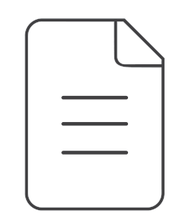
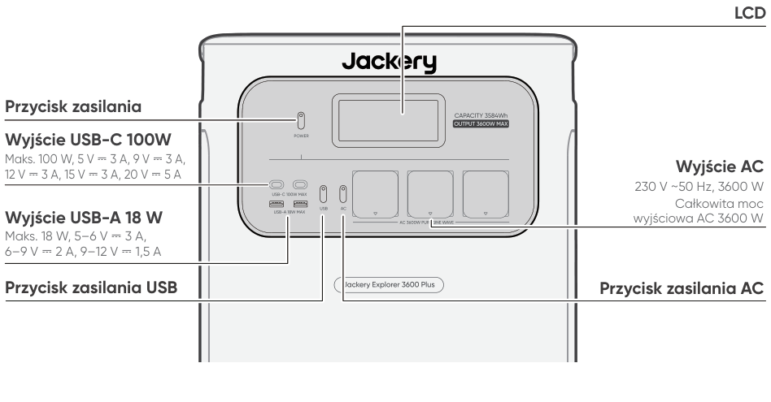
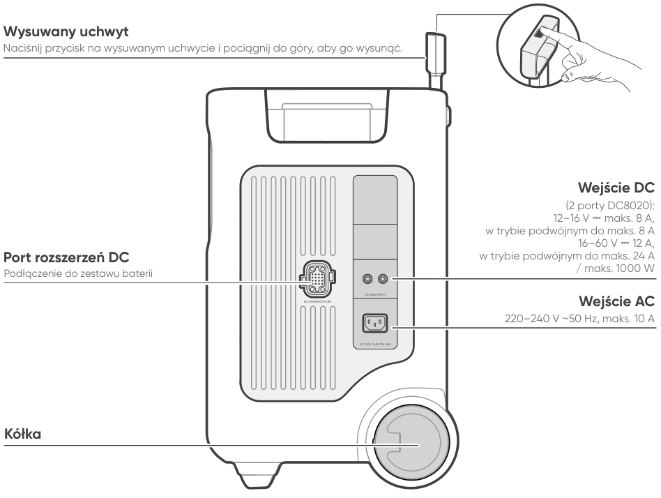
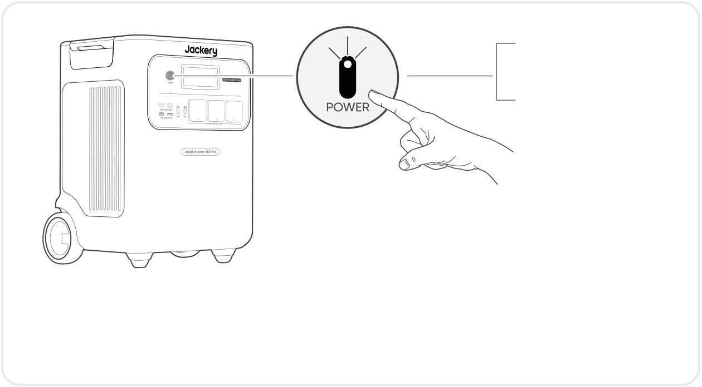
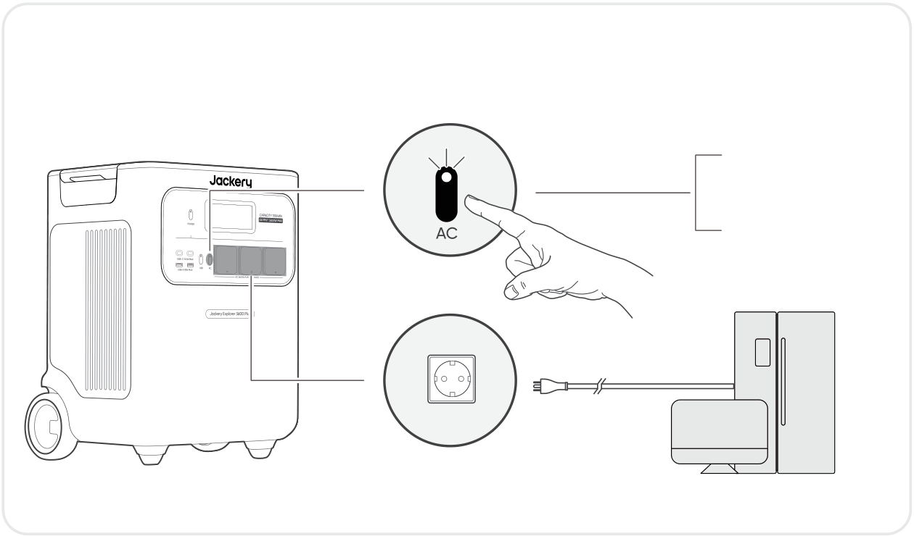

# WAŻNE

Gratulujemy zakupu nowego urządzenia Jackery Explorer 3600 Plus. Prosimy o dokładne przeczytanie niniejszej instrukcji przed użyciem produktu, ze szczególnym uwzględnieniem środków ostrożności, aby zapewnić prawidłowe użytkowanie. Instrukcję należy przechowywać w łatwo dostępnym miejscu, aby można było po nią sięgać w przyszłości.

Zgodnie z przepisami prawo ostatecznej interpretacji niniejszego dokumentu oraz wszystkich dokumentów związanych z tym produktem przysługuje firmie.

Należy pamiętać, że w przypadku jakichkolwiek aktualizacji, zmian lub zakończenia publikacji nie będą wysyłane żadne dodatkowe powiadomienia.

# WAŻNE INFORMACJE DOTYCZĄCE BEZPIECZEŃSTWA

<table class="manual-callout-table manual-callout-table"><tbody><tr><td class="manual-callout-label">OSTRZEŻENIE</td><td class="manual-callout-body">
INSTRUKCJE DOTYCZĄCE RYZYKA POŻARU, PORAŻE- NIA PRĄDEM LUB OBRAŻEŃ CIAŁA
</td></tr></tbody></table>

<strong>Podczas korzystania z tego produktu należy zawsze przestrzegać wskazanych podstawowych środków ostrożności.</strong>

<ul><li>
Przed przystąpieniem do korzystania z produktu należy przeczytać wszystkie instrukcje.
</li><li>
Dzieciom nie wolno bawić się produktem. Gdy produkt będzie używany w pobliżu dzieci, należy szczególnie uważnie ich pilnować.
</li><li>
W przypadku korzystania z akcesoriów, które nie są zalecane ani sprzedawane przez producenta produktu, może występować ryzyko porażenia prądem.
</li><li>
Gdy produkt nie jest używany, należy odłączyć wtyczkę zasilania od gniazda produktu.
</li><li>
Nie wolno rozmontowywać produktu, ponieważ może to prowadzić do nieprzewidywalnych zagrożeń, takich jak pożar, wybuch lub porażenie prądem.
</li><li>
Nie używać produktu z uszkodzonymi przewodami, wtyczkami lub kablami wyjściowymi, gdyż może to spowodować porażenie prądem.
</li><li>
Aby zapewnić prawidłową cyrkulację powietrza, nie wolno zasłaniać otworów wentylacyjnych produktu. Produktu należy używać w suchym i chłodnym miejscu, o odpowiedniej cyrkulacji powietrza. Inaczej może dochodzić do jego przegrzania. - Ładowanie w wilgotnych lub słabo wentylowanych pomieszczeniach może stwarzać zagrożenie dla bezpieczeństwa. - Woda może powodować zwarcia lub uszkodzenie stacji ładowania, stwarzając zagrożenia dla bezpieczeństwa.  
</li><li>
Nie narażać produktu na działanie ognia, wysokich temperatur, bezpośredniego światła słonecznego ani środowisk o wysokiej temperaturze, takich jak wnętrze zaparkowanego pojazdu. Mogłoby to doprowadzić do pożaru lub wybuchu.
</li></ul>

## INSTRUKCJE KONSERWACJI DLA UŻYTKOWNIKA

W cyklu życia produktów do magazynowania energii należy spodziewać się pewnej degradacji pojemności i energii. Wraz ze wzrostem liczby cykli ładowania i rozładowywania oraz wydłużeniem czasu przechowywania, degradacja ta będzie się stopniowo nasilać, co jest normalnym zjawiskiem zgodnym z naturalnym starzeniem się ogniw baterii.

# ZNACZENIE SYMBOLI

<figure aria-label="ZNACZENIE SYMBOLI" class="hb-symbol-signal-composition" data-component-id="HB-TABLE-SYMBOL-SIGNAL"><table class="hb-symbol-signal-table"><colgroup><col class="hb-symbol-signal-col-label"/><col class="hb-symbol-signal-col-meaning"/></colgroup><thead><tr><th class="hb-symbol-signal-label-heading" scope="col">Symbol Znacze</th><th class="hb-symbol-signal-meaning-heading" scope="col">enie</th></tr></thead><tbody><tr><td class="hb-symbol-signal-label-cell">⚠OSTRZEŻENIE</td><td class="hb-symbol-signal-meaning-cell">Niebezpieczne praktyki, które mogą prowadzić do poważnych obrażeń, śmierci i/lub szkód materialnych.</td></tr><tr><td class="hb-symbol-signal-label-cell">⚠PRZESTROGA</td><td class="hb-symbol-signal-meaning-cell">Niebezpieczne praktyki, które mogą skutkować obrażeniami ciała i/lub szkodami materialnymi.</td></tr><tr><td class="hb-symbol-signal-label-cell">⚠Uwaga</td><td class="hb-symbol-signal-meaning-cell">Niebezpieczne praktyki, które mogą prowadzić do uszkodzenia sprzętu, utraty danych, pogorszenia wydajności lub nieprzewidzianych wyników.</td></tr><tr><td class="hb-symbol-signal-label-cell">⚠WSKAZÓWKA</td><td class="hb-symbol-signal-meaning-cell">Uzupełnia ważne informacje lub wskazówki dotyczące obsługi zawarte w tekście.</td></tr></tbody></table></figure>

<figure aria-label="ZNACZENIE SYMBOLI" class="hb-symbol-pair-composition" data-component-id="HB-TABLE-SYMBOL-ICON">

<table class="hb-symbol-panel-table"><colgroup><col class="hb-symbol-col-icon"/><col class="hb-symbol-col-meaning"/></colgroup><thead><tr><th class="hb-symbol-icon-heading" scope="col">Symbol Znacze</th><th class="hb-symbol-meaning-heading" scope="col">enie</th></tr></thead><tbody><tr><td class="hb-symbol-icon"></td><td class="hb-symbol-meaning">Symbole ostrzeżeń i środków ostrożności. Należy koniecznie przeczytać, aby poznać potencjalne zagrożenia lub ryzyka.</td></tr><tr><td class="hb-symbol-icon"></td><td class="hb-symbol-meaning">Przed przystąpieniem do użytkowania przeczytaj instrukcję obsługi.</td></tr><tr><td class="hb-symbol-icon"></td><td class="hb-symbol-meaning">Nie rozmontowuj produktu.</td></tr><tr><td class="hb-symbol-icon"></td><td class="hb-symbol-meaning">Trzymaj produkt z dala od ognia.</td></tr><tr><td class="hb-symbol-icon"></td><td class="hb-symbol-meaning">Przechowuj w miejscu niedostępnym dla dzieci.</td></tr><tr><td class="hb-symbol-icon"></td><td class="hb-symbol-meaning">Ten symbol oznacza, że wewnątrz produktu znajduje się bateria litowo-jonowa (Li-ion), którą należy prawidłowo utylizować lub poddać recyklingowi.</td></tr></tbody></table>

<table class="hb-symbol-panel-table"><colgroup><col class="hb-symbol-col-icon"/><col class="hb-symbol-col-meaning"/></colgroup><thead><tr><th class="hb-symbol-icon-heading" scope="col">Symbol Znacze</th><th class="hb-symbol-meaning-heading" scope="col">enie</th></tr></thead><tbody><tr><td class="hb-symbol-icon"></td><td class="hb-symbol-meaning">Baterii i akumulatorów nie wolno wyrzucać razem z odpadami domowymi. Jako konsument masz prawny obowiązek oddawania wszystkich baterii i akumulatorów do wyznaczonych punktów zbiórki, niezależnie od tego, czy zawierają substancje niebezpieczne. Zużyte baterie i akumulatory należy przekazać do lokalnego punktu zbiórki, centrum recyklingu lub do sprzedawcy, u którego zostały zakupione. Prawidłowa utylizacja zapewnia recykling przyjazny dla środowiska i zapobiega potencjalnym szkodom dla zdrowia ludzi i środowiska.</td></tr><tr><td class="hb-symbol-icon"></td><td class="hb-symbol-meaning">Ten symbol oznacza, że produktu nie wolno wyrzucać razem z odpadami domowymi i należy go dostarczyć do wyznaczonego punktu zbiórki w celu recyklingu. Prawidłowa utylizacja i recykling przyczynią się do ochrony środowiska. Aby uzyskać więcej informacji na temat utylizacji i recyklingu tego produktu, skontaktuj się z lokalną gminą, firmą zajmującą się utylizacją lub sprzedawcą.</td></tr></tbody></table>

</figure>

# ZAWARTOŚĆ OPAKOWANIA

<figure aria-label="ZAWARTOŚĆ OPAKOWANIA" class="hb-inbox-composition" data-card-count="3" data-component-id="HB-SPECIAL-INBOX" data-inbox-variant="three-card-responsive"><ol class="hb-inbox-grid"><li class="hb-inbox-card" data-item-number="1">

Jackery Explorer 3600 Plus

</li><li class="hb-inbox-card" data-item-number="2">

Przewód sieciowy do ładowania

</li><li class="hb-inbox-card" data-item-number="3">

Instrukcja obsługi

</li></ol>

WSKAZÓWKA

Przewód do ładowania samochodowego nie jest dołączony do zestawu, ale można go kupić osobno na naszej stronie internetowej. W celu uzyskania pomocy prosimy o kontakt z obsługą klienta Jackery.

</figure>

# WIDOK OGÓLNY PRODUKTU

## WIDOK Z PRZODU

<figure class="hb-reference-figure" data-component-id="HB-SPECIAL-REFERENCE-FIGURE" data-reference-id="overview-front" data-source-fragment-sha256="bf09f12d6ea5d84f561360de70ca883f2a6e6a116c7f28adbc9e938a9d193fd7">

</figure>

## WIDOK Z PRAWEJ STRONY

<figure class="hb-reference-figure" data-component-id="HB-SPECIAL-REFERENCE-FIGURE" data-reference-id="overview-right" data-source-fragment-sha256="4b833b79ce96a82bb5f078c252305d6c73d4f937d447bded14ab4a99055ffb4b">

</figure>

# WYŚWIETLACZ LCD

<figure class="hb-reference-figure" data-component-id="HB-SPECIAL-REFERENCE-FIGURE" data-reference-id="lcd-map" data-source-fragment-sha256="7bcadb16f9732c265b0e237d2212e110508d6aa5bb0fda4061fc3180a6c07708">

</figure>

<figure aria-label="WYŚWIETLACZ LCD" class="hb-lcd-table-composition" data-component-id="HB-TABLE-LCD-ICON" tabindex="0"><table class="hb-lcd-icon-table"><colgroup><col class="hb-lcd-col-number"/><col class="hb-lcd-col-icon"/><col class="hb-lcd-col-name"/><col class="hb-lcd-col-description"/></colgroup><tbody><tr><td class="hb-lcd-number">1</td><td class="hb-lcd-icon"></td><td class="hb-lcd-name">Wi-Fi</td><td class="hb-lcd-description">
Wł.: Połączono z Wi-Fi. Miga: Gotowość do połączenia z Wi-Fi. Wył.: Rozłączono z Wi-Fi.
</td></tr><tr><td class="hb-lcd-number">2</td><td class="hb-lcd-icon"></td><td class="hb-lcd-name">Bluetooth</td><td class="hb-lcd-description">
Wł.: Połączono z Bluetooth. Miga: Gotowość do połączenia z Bluetooth. Wył.: Rozłączono z Bluetooth.
</td></tr><tr><td class="hb-lcd-number">3</td><td class="hb-lcd-icon"></td><td class="hb-lcd-name">Tryb cichego ładowania</td><td class="hb-lcd-description">
Wł.: Hałas podczas ładowania jest znacznie zminimalizowany, przy czym moc ładowania jest zmniejszona, a prędkość ładowania maleje. Wył.: Tryb cichego ładowania jest wyłączony. Tę funkcję można włączyć lub wyłączyć w aplikacji Jackery.
</td></tr><tr><td class="hb-lcd-number" rowspan="2">4</td><td class="hb-lcd-icon"></td><td class="hb-lcd-name">Tryb oszczędzania baterii</td><td class="hb-lcd-description">
Wł.: Ogranicza maksymalną użyteczną pojemność baterii, aby przedłużyć jej żywotność. Wył.: Tryb oszczędzania baterii jest wyłączony. Tę funkcję można włączyć lub wyłączyć w aplikacji Jackery. Ta funkcja nie jest dostępna, gdy produkt jest podłączony do co najmniej jednego zestawu baterii.
</td></tr><tr><td class="hb-lcd-icon"></td><td class="hb-lcd-name">Tryb samozasilania</td><td class="hb-lcd-description">
Maksymalizuje wykorzystanie energii słonecznej i zmniejsza zależność od energii z sieci, priorytetowo wykorzystując zmagazynowaną energię słoneczną, co obniża koszty energii elektrycznej (funkcję tę można włączyć i wyłączyć w aplikacji). Stacja zasilająca musi być jednocześnie podłączona do paneli słonecznych i sieci energetycznej, a moc urządzeń odbiorczych jest ograniczona przez moc obejściową.
</td></tr><tr><td class="hb-lcd-number">5</td><td class="hb-lcd-icon"></td><td class="hb-lcd-name">Plan ładowania</td><td class="hb-lcd-description">
Dostosowuje czas ładowania urządzenia Jackery Explorer 3600 Plus. W sytuacjach, gdy ceny energii elektrycznej są zmienne, pozwala planować ładowanie w godzinach szczytu i poza szczytem, co obniża koszty energii elektrycznej (opcję można włączyć w aplikacji Jackery).
</td></tr><tr><td class="hb-lcd-number">6</td><td class="hb-lcd-icon"></td><td class="hb-lcd-name">Wskaźnik zasilania AC</td><td class="hb-lcd-description">
Wyjście AC (czysta sinusoida) jest włączone.
</td></tr><tr><td class="hb-lcd-number">7</td><td class="hb-lcd-icon"></td><td class="hb-lcd-name">Napięcie wyjściowe i częstotliwość</td><td class="hb-lcd-description">
Gdy wyjście AC jest włączone, wyświetla wartości wyjściowe napięcia i częstotliwości.
</td></tr><tr><td class="hb-lcd-number">8</td><td class="hb-lcd-icon"></td><td class="hb-lcd-name">Moc wejściowa</td><td class="hb-lcd-description">
Wyświetla moc wejściową w watach.
</td></tr><tr><td class="hb-lcd-number">9</td><td class="hb-lcd-icon"></td><td class="hb-lcd-name">Pozostały czas ładowania</td><td class="hb-lcd-description">
Wyświetla pozostały czas ładowania.
</td></tr><tr><td class="hb-lcd-number">10</td><td class="hb-lcd-icon"></td><td class="hb-lcd-name">Wskaźnik ładowania z sieci AC</td><td class="hb-lcd-description">
Produkt jest ładowany przez wejście AC z sieci elektrycznej.
</td></tr><tr><td class="hb-lcd-number">11</td><td class="hb-lcd-icon"></td><td class="hb-lcd-name">Wskaźnik ładowania z gniazda samochodowego</td><td class="hb-lcd-description">
Produkt jest ładowany przez wejście DC (DC8020) przy użyciu zasilania DC 12 V (z ładowarki samochodowej).
</td></tr><tr><td class="hb-lcd-number">12</td><td class="hb-lcd-icon"></td><td class="hb-lcd-name">Wskaźnik ładowania z paneli słonecznych</td><td class="hb-lcd-description">
Produkt jest ładowany przez wejście DC (DC8020) za pomocą paneli słonecznych.
</td></tr><tr><td class="hb-lcd-number">13</td><td class="hb-lcd-icon"></td><td class="hb-lcd-name">Wskaźnik poziomu baterii</td><td class="hb-lcd-description">
W trakcie ładowania produktu pomarańczowy pierścień wokół wartości procentowej baterii będzie się zapalał sekwencyjnie. Podczas ładowania innych urządzeń pomarańczowy pierścień będzie stale zaświecony.
</td></tr><tr><td class="hb-lcd-number">14</td><td class="hb-lcd-icon"></td><td class="hb-lcd-name">Wskaźnik niskiego poziomu baterii</td><td class="hb-lcd-description">
Wł.: Poziom naładowania baterii jest niższy niż 20%. Miga: Poziom naładowania baterii jest niższy niż 5%. Wył.: Poziom baterii nie jest niższy niż 20% lub produkt jest ładowany.
</td></tr><tr><td class="hb-lcd-number">15</td><td class="hb-lcd-icon"></td><td class="hb-lcd-name">Pozostały procent baterii</td><td class="hb-lcd-description">
Wyświetla pozostały procent baterii.
</td></tr><tr><td class="hb-lcd-number">16</td><td class="hb-lcd-icon"></td><td class="hb-lcd-name">Wskaźnik zestawu baterii i liczba podłączonych zestawów baterii</td><td class="hb-lcd-description">
Wyświetla liczbę zestawów baterii, jeśli są podłączone.
</td></tr><tr><td class="hb-lcd-number">17</td><td class="hb-lcd-icon"></td><td class="hb-lcd-name">Kod błędu</td><td class="hb-lcd-description">
Wystąpił błąd produktu. Szczegóły można znaleźć w sekcji Rozwiązywanie problemów.
</td></tr><tr><td class="hb-lcd-number" rowspan="2">18</td><td class="hb-lcd-icon"></td><td class="hb-lcd-name">Wskaźnik wysokiej temperatury</td><td class="hb-lcd-description">
Zadziałało zabezpieczenie przed wysoką temperaturą. Produkt może nie działać do czasu przywrócenia temperatury do normalnego zakresu roboczego.
</td></tr><tr><td class="hb-lcd-icon"></td><td class="hb-lcd-name">Wskaźnik niskiej temperatury</td><td class="hb-lcd-description">
Zadziałało zabezpieczenie przed niską temperaturą. Produkt może nie działać do czasu przywrócenia temperatury do normalnego zakresu roboczego.
</td></tr><tr><td class="hb-lcd-number">19</td><td class="hb-lcd-icon"></td><td class="hb-lcd-name">Tryb oszczędzania energii</td><td class="hb-lcd-description">
Gdy wyjście AC lub USB zostanie włączone przez naciśnięcie przycisku zasilania AC lub USB: Wł.: Tryb oszczędzania energii jest włączony. Wył.: Tryb oszczędzania energii jest wyłączony.
</td></tr><tr><td class="hb-lcd-number">20</td><td class="hb-lcd-icon"></td><td class="hb-lcd-name">Moc wyjściowa</td><td class="hb-lcd-description">
Wyświetla moc wyjściową w watach.
</td></tr><tr><td class="hb-lcd-number">21</td><td class="hb-lcd-icon"></td><td class="hb-lcd-name">Pozostały czas zasilania urządzeń odbiorczych</td><td class="hb-lcd-description">
Wyświetla pozostały czas do rozładowania.
</td></tr></tbody></table></figure>

# OBSŁUGA

## WŁ./WYŁ. ZASILANIA

<figure class="hb-reference-figure hb-base-art-live-copy" data-component-id="HB-SPECIAL-REFERENCE-FIGURE" data-reference-id="operation-main-power" data-source-fragment-sha256="1aa9f40d38f89d98fb00f3074ad68ef0200664c253d28ad182e088fe23a6f5d6" data-web-base-art-ref="operation-main-power" data-web-presentation-mode="base-art-live-copy">

Wł. Naciśnij razWył. Naciśnij i przytrzymaj przez 3 s 3 sDomyślny czas czuwania: 2 godziny Produkt automatycznie wyłączy się po 2 godzinach bezczynności, bez ładowania i zasilania urządzeń odbiorczych. *Czas czuwania można ustawić w aplikacji Jackery.Gdy tryb oszczędzania energii jest włączony, a przycisk zasilania AC lub USB jest włączony w pozycji ON, ale produkt nie ładuje się ani nie zasila urządzeń odbiorczych, produkt wyłączy się automatycznie po 12 godzinach.

</figure>

## WŁ./WYŁ. WYJŚCIA USB

<figure class="hb-operation-figure hb-operation-layout-status-right hb-base-art-live-copy" data-component-id="HB-SPECIAL-OPERATION" data-operation-id="dc-usb-output" data-source-fragment-sha256="8f4524a2de75a2218412f434459a2c84f00fb6aabc8c3fe192901d8057826565" data-web-base-art-ref="operation/dc_usb_output" data-web-presentation-mode="base-art-live-copy" data-web-replace-key="operation.dc-usb-output">

<strong>Wymaganie wstępne:</strong> Produkt musi być włączony.

<strong>Wł.</strong>

Naciśnij raz

<strong>Wył.</strong>

Naciśnij raz

</figure>

<table class="manual-callout-table manual-callout-table"><tbody><tr><td class="manual-callout-label">PRZESTROGA</td><td class="manual-callout-body"><ul><li>
USB-C MAKS. 100 W to port wyjściowy USB-PD Power Source 3 (PS3) o dużej mocy. Jeśli podłączone urządzenie użytkownika lub akcesorium nie spełnia wymogów bezpieczeństwa, może występować ryzyko pożaru. Przed użyciem tych portów należy się upewnić, że podłączone urządzenie lub akcesorium ma zabezpieczenie przeciwpożarowe.
</li><li>
Stację Jackery Explorer 3600 Plus należy podłączać wyłącznie do urządzeń lub akcesoriów spełniających wymagania przewidziane w punktach 6.3, 6.4 i 6.5 normy IEC/EN/UL 62368-1 (lub innych równoważnych norm).
</li><li>
Aby uzyskać maksymalną moc wyjściową, należy użyć oficjalnego kabla Jackery USB-C do USB-C 5 A (20 V DC / 5 A, 100 W).
</li></ul></td></tr></tbody></table>

## WŁ./WYŁ. WYJŚCIA AC

<figure class="hb-operation-figure hb-operation-layout-status-right hb-base-art-live-copy" data-component-id="HB-SPECIAL-OPERATION" data-operation-id="ac-output" data-source-fragment-sha256="d79e623406856abdec5dd93a401ba33a6daa7ccfe7ce01b24b9077de98e0f778" data-web-base-art-ref="operation/ac_output" data-web-presentation-mode="base-art-live-copy" data-web-replace-key="operation.ac-output">

<strong>Wymaganie wstępne:</strong> Produkt musi być włączony.

<strong>Wł.</strong>

Naciśnij raz

<strong>Wył.</strong>

Naciśnij raz

</figure>

## TRYB OSZCZĘDZANIA ENERGII

<figure class="hb-reference-figure hb-base-art-live-copy" data-component-id="HB-SPECIAL-REFERENCE-FIGURE" data-reference-id="operation-energy-saving" data-source-fragment-sha256="a74e8de4456a7eb651b3e138ae928fb5c6b5cf95642f92b6a61cc8d8c30c5064" data-web-base-art-ref="operation-energy-saving" data-web-presentation-mode="base-art-live-copy">

Aby zapobiec niepotrzebnemu zużyciu baterii spowodowanemu zapomnieniem o wyłączeniu wyjścia, produkt domyślnie włącza tryb oszczędzania energii. Jeżeli przez 12 godzin nie jest podłączone żadne urządzenie lub pobór mocy podłączonego urządzenia nie przekracza wartości progowej (25 W dla wyjścia AC lub 2 W dla wyjścia USB), produkt automatycznie wyłącza zasilanie na wyjściach. Aby wyłączyć tryb oszczędzania energii, naciśnij i przytrzymaj jednocześnie przycisk zasilania AC oraz przycisk POWER na dłużej niż 3 sekundy. Produkt nie wyłączy automatycznie wyjścia AC ani DC.Główny przycisk zasilaniaPrzycisk zasilania ACWł./wył. Naciśnij i przytrzymaj przez 3 s

</figure>

<table class="manual-callout-table manual-callout-table"><tbody><tr><td class="manual-callout-label">Uwaga</td><td class="manual-callout-body">
Po włączeniu zasilania tryb oszczędzania energii powraca do poprzedniego stanu. Zmiana trybu wymaga ręcznego przełączenia.
</td></tr></tbody></table>

## WYŚWIETLACZ LCD

<figure aria-label="WYŚWIETLACZ LCD" class="hb-lcd-mode-composition" data-component-id="HB-TABLE-LCD-MODE">

<table class="hb-lcd-mode-table"><colgroup><col class="hb-lcd-mode-col-state"/><col class="hb-lcd-mode-col-action"/><col class="hb-lcd-mode-col-copy"/></colgroup><tbody><tr><td class="hb-lcd-mode-state" rowspan="3">Zaświeca się na krótką chwilę</td><td class="hb-lcd-mode-action">Włączanie</td><td class="hb-lcd-mode-copy">Naciśnij przycisk POWER, gdy produkt się ładuje.</td></tr><tr><td class="hb-lcd-mode-action">Wyłączanie</td><td class="hb-lcd-mode-copy">Naciśnij przycisk POWER.</td></tr><tr><td class="hb-lcd-mode-action">Automatyczne wyłączanie</td><td class="hb-lcd-mode-copy">Ekran LCD wyłącza się automatycznie i przechodzi w tryb uśpienia po 2 minutach bezczynności.</td></tr><tr><td class="hb-lcd-mode-state" rowspan="3">Świeci ciągle (w stanie ładowania lub rozładowania)</td><td class="hb-lcd-mode-action">Włączanie</td><td class="hb-lcd-mode-copy">Naciśnij dwukrotnie przycisk POWER, gdy produkt jest włączony.</td></tr><tr><td class="hb-lcd-mode-action">Wyłączanie</td><td class="hb-lcd-mode-copy">Naciśnij przycisk POWER.</td></tr><tr><td class="hb-lcd-mode-action">Automatyczne wyłączanie</td><td class="hb-lcd-mode-copy">Ekran LCD wyłącza się automatycznie po 2 godzinach bezczynności.</td></tr></tbody></table>
</figure>

Tryb pracy wyświetlacza ekranu można również ustawić w aplikacji Jackery.

## KOMBINACJA KLAWISZY

<figure aria-label="Przyciski / Czynność / Funkcja" class="hb-key-combination-composition" data-component-id="HB-TABLE-KEY-COMBINATIONS" tabindex="0"><table class="hb-key-combination-table"><colgroup><col class="hb-key-col-buttons"/><col class="hb-key-col-operation"/><col class="hb-key-col-function"/></colgroup><thead><tr><th class="hb-key-buttons" scope="col">Przyciski</th><th class="hb-key-operation" scope="col">Czynność</th><th class="hb-key-function" scope="col">Funkcja</th></tr></thead><tbody><tr><td class="hb-key-buttons">Przycisk zasilania + Przycisk zasilania USB</td><td class="hb-key-operation">Naciśnij i przytrzymaj oba przyciski przez 3 s.</td><td class="hb-key-function">Resetowanie Wi-Fi i Bluetooth</td></tr><tr><td class="hb-key-buttons">Przycisk zasilania + Przycisk zasilania AC</td><td class="hb-key-operation">Naciśnij i przytrzymaj oba przyciski przez 3 s.</td><td class="hb-key-function">Włączanie/wyłączanie trybu oszczędzania energii</td></tr><tr><td class="hb-key-buttons">Przycisk zasilania USB + Przycisk zasilania AC</td><td class="hb-key-operation">Naciśnij i przytrzymaj oba przyciski przez 1 s.</td><td class="hb-key-function">Włączanie/wyłączanie Wi-Fi i Bluetooth</td></tr></tbody></table></figure>

# ZASILACZ BEZPRZERWOWY (UPS)

Podłącz produkt do gniazdka ściennego za pomocą przewodu sieciowego do ładowania AC, następnie naciśnij przycisk zasilania AC, aby równocześnie zasilać urządzenia odbiorcze.

<figure class="hb-reference-figure hb-base-art-live-copy" data-component-id="HB-SPECIAL-REFERENCE-FIGURE" data-reference-id="ups" data-source-fragment-sha256="b2c9b2a4f2c12e5a297e6529f88b4a4526d3843b3dfc237333a14b5f57f994fd" data-web-base-art-ref="ups" data-web-presentation-mode="base-art-live-copy">

Zasilacz bezprzerwowy (UPS) to rodzaj systemu ciągłego zasilania, który automatycznie dostarcza rezerwową energię elektryczną do urządzenia odbiorczego w przypadku zaniku napięcia w sieci energetycznej. W przypadku nagłego zaniku zasilania sieciowego, stacja Explorer 3600 Plus automatycznie przełączy się na zasilanie z baterii w ciągu 10 ms, aby podtrzymać pracę urządzeń.

</figure>

W trybie UPS maksymalna moc wyjściowa urządzenia osiąga 10A przed wystąpieniem awarii zasilania. Ponieważ w trybie obejściowym możliwe jest jednoczesne ładowanie i rozładowywanie, rzeczywista moc wyjściowa jest niższa od mocy znamionowej, ale podczas awarii przywracana jest moc znamionowa.

<table class="manual-callout-table manual-callout-table"><tbody><tr><td class="manual-callout-label">PRZESTROGA</td><td class="manual-callout-body"><ul><li>
Produkt nie obsługuje przełączania w czasie 0 ms. Nie należy podłączać go do urządzeń wymagających zasilania z przełączaniem w czasie 0 ms, takich jak serwery danych lub stacje robocze.
</li><li>
Przed użyciem należy kilkakrotnie przetestować zgodność z urządzeniem.
</li><li>
Nie podłączać urządzeń odbiorczych o mocy przekraczającej maksymalną moc wyjściową produktu. W przeciwnym razie zadziała zabezpieczenie przeciążeniowe.
</li></ul></td></tr></tbody></table>

# POŁĄCZENIA

<h2 class="hb-subbar" id="podłączanie-do-zestawów-baterii-sprzedawane-oddzielnie">PODŁĄCZANIE DO ZESTAWÓW BATERII SPRZEDAWANE ODDZIELNIE</h2>

W razie dużego zapotrzebowania na pojemność energetyczną do tego produktu można podłączyć maksymalnie 5 zestawów baterii. Szczegółowe informacje na temat użytkowania można znaleźć w instrukcji obsługi urządzenia Jackery Battery Pack 3600.

<figure class="hb-reference-figure hb-base-art-live-copy" data-component-id="HB-SPECIAL-REFERENCE-FIGURE" data-reference-id="battery" data-source-fragment-sha256="9eb3693d55cf1278405a9a142fe59fcb8709f598c8829d2a2212627b119a0cbe" data-web-base-art-ref="battery" data-web-presentation-mode="base-art-live-copy">

≥ 200 mm≥ 200 mm

</figure>

<table class="manual-callout-table manual-callout-table"><tbody><tr><td class="manual-callout-label">PRZESTROGA</td><td class="manual-callout-body"><ul><li>
Przed podłączeniem urządzenia Explorer 3600 Plus do urządzenia Jackery Battery Pack 3600 upewnij się, że wszystkie urządzenia są wyłączone.
</li><li>
Aby zapewnić prawidłowe działanie produktu, upewnij się, że wlotowe i wylotowe otwory wentylacyjne po obu stronach są odsłonięte. Zachowaj co najmniej 200 mm odstępu między otworami wentylacyjnymi a jakimikolwiek przedmiotami, aby zapewnić prawidłowe odprowadzanie ciepła.
</li></ul></td></tr></tbody></table>

<figure class="hb-reference-figure hb-base-art-live-copy" data-component-id="HB-SPECIAL-REFERENCE-FIGURE" data-reference-id="battery-accessories" data-source-fragment-sha256="6c0e7ec52fd5ac4daa2c7905a3da6e22e44c6569dd2d21e3b6de9ea2973d4ad0" data-web-base-art-ref="battery-accessories" data-web-presentation-mode="base-art-live-copy">

Jackery Battery Pack 3600PrzedłużaczInstrukcja obsługiSPRZEDAWANE ODDZIELNIE

</figure>

# ŁADOWANIE

<strong>Ekologiczna energia przede wszystkim! Propagujemy korzystanie w pierwszej kolejności z energii ekologicznej. Ten produkt obsługuje jednocześnie dwa tryby ładowania:</strong> ładowanie z paneli słonecznych i ładowanie z gniazdka ściennego AC. Gdy ładowanie z gniazdka ściennego AC i ładowanie z paneli słonecznych są włączone jednocześnie, produkt będzie preferować ładowanie z paneli, a obie metody będą ładować baterię z maksymalną dopuszczalną mocą.

Przed pierwszym użyciem w pełni naładuj produkt.

<table class="manual-callout-table manual-callout-table"><tbody><tr><td class="manual-callout-label">Uwaga</td><td class="manual-callout-body"><ul><li>
Zalecany zakres temperatury otoczenia podczas ładowania produktu wynosi od -20°C do 45°C, a zakres temperatury otoczenia podczas zasilania urządzeń odbiorczych – od -20°C do 45°C. Eksploatacja produktu poza tym zakresem temperatur może ograniczyć możliwości ładowania i zasilania urządzeń odbiorczych, a nawet uniemożliwić te czynności.
</li><li>
Moc ładowania i pojemność baterii produktu mogą się zmieniać w zależności od wahań temperatury.
</li></ul></td></tr></tbody></table>

## ŁADOWANIE Z SIECIOWEGO GNIAZDKA ŚCIENNEGO AC

<figure class="hb-reference-figure hb-base-art-live-copy" data-component-id="HB-SPECIAL-REFERENCE-FIGURE" data-reference-id="charging-ac" data-source-fragment-sha256="db0bfe75bab2552e8ef160b7eb21bf260aee1536052b0ebc3f23714731f4e1d6" data-web-base-art-ref="charging-ac" data-web-presentation-mode="base-art-live-copy">

Podłącz przewód sieciowy do ładowania AC do portu wejściowego AC produktu i do gniazdka ściennego.

</figure>

<table class="manual-callout-table manual-callout-table"><tbody><tr><td class="manual-callout-label">PRZESTROGA</td><td class="manual-callout-body">
Upewnij się, że przewód ładowania AC jest solidnie i bezpiecznie podłączony do portu wejściowego AC. Niedokładne podpięcie przewodu może powodować niestabilność prądu, przegrzanie, słaby styk lub awarię urządzenia.
</td></tr></tbody></table>

<h2 class="hb-subbar" id="przegrzanie-słaby-styk-lub-awarię-urządzenia-ładowanie-za-pomocą-paneli-słonecznych-sprzedawane-oddzielnie">przegrzanie, słaby styk lub awarię urządzenia. ŁADOWANIE ZA POMOCĄ PANELI SŁONECZNYCH SPRZEDAWANE ODDZIELNIE</h2>

ŁADOWANIE ZA POMOCĄ PANELI SŁONECZNYCH SPRZEDAWANE ODDZIELNIE Stacja Jackery Explorer 3600 Plus ma dwa porty wejściowe DC8020 i jest kompatybilna z panelami słonecznymi Jackery. Jeśli do jednego portu wejściowego DC8020 trzeba podłączyć jednocześnie dwa panele słoneczne, należy skorzystać z poniższego rysunku ilustrującego ładowanie przez łącznik paneli słonecznych (sprzedawany oddzielnie, nie wchodzi w skład standardowego wyposażenia).

<figure class="hb-reference-figure hb-base-art-live-copy" data-component-id="HB-SPECIAL-REFERENCE-FIGURE" data-reference-id="charging-solar" data-source-fragment-sha256="b19d8622a4150edbc36830bc842910b6f17d60391198e798de99655bb462bf8b" data-web-base-art-ref="charging-solar" data-web-presentation-mode="base-art-live-copy">

SolarSaga 200 × 4

</figure>

<table class="manual-callout-table manual-callout-table"><tbody><tr><td class="manual-callout-label">PRZESTROGA</td><td class="manual-callout-body">
Do jednego portu wejściowego DC8020 można podłączyć maksymalnie dwa panele słoneczne.
</td></tr></tbody></table>

<table class="manual-callout-table manual-callout-table"><tbody><tr><td class="manual-callout-label">PRZESTROGA</td><td class="manual-callout-body"><ul><li>
Należy się upewnić, że napięcie wejściowe na obu portach DC jest takie samo. Nieprzestrzeganie tego zalecenia może uszkodzić produkt. Na przykład:
</li><li>
W przypadku podłączania paneli słonecznych do obu portów wejściowych DC8020 zaleca się używanie tych samych modeli paneli słonecznych Jackery i jednakowej liczby paneli.
</li><li>
Nie ładować produktu jednocześnie za pomocą ładowarki samochodowej i panelu słonecznego. Może to spowodować przepalenie bezpiecznika samochodowego lub awarię ładowania.
</li></ul></td></tr></tbody></table>

Do ładowania produktu zaleca się korzystanie z panelu słonecznego Jackery. Należy upewnić się, że napięcie obwodu otwartego (VOC) panelu słonecznego mieści się w zakresie wejściowym DC (16 V – 60 V) urządzenia Explorer 3600 Plus. Jackery nie ponosi odpowiedzialności za jakiekolwiek szkody lub straty wynikające z użycia paneli słonecznych innych producentów.

<h2 class="hb-subbar" id="ładowanie-za-pomocą-ładowarki-samochodowej-sprzedawane-oddzielnie">ŁADOWANIE ZA POMOCĄ ŁADOWARKI SAMOCHODOWEJ SPRZEDAWANE ODDZIELNIE</h2>

Produkt ten można ładować za pomocą ładowarki samochodowej 12 V. Należy zapewnić właściwe połączenie między ładowarką samochodową a gniazdem zasilania 12 V (zapalniczką samochodową).

<figure class="hb-reference-figure hb-base-art-live-copy" data-component-id="HB-SPECIAL-REFERENCE-FIGURE" data-reference-id="charging-car" data-source-fragment-sha256="25116623a76d83148d09c10ea5f66eb75901c77a6a9458f11906ab1a5a1a3fa9" data-web-base-art-ref="charging-car" data-web-presentation-mode="base-art-live-copy">

Pojazd* Przewód samochodowy do ładowania jest sprzedawany osobno.

</figure>

<table class="manual-callout-table manual-callout-table"><tbody><tr><td class="manual-callout-label">PRZESTROGA</td><td class="manual-callout-body"><ul><li>
Uruchomić pojazd przed przystąpieniem do ładowania stacji zasilającej.
</li><li>
Jeśli pojazd porusza się po wyboistych drogach, zabrania się korzystania z ładowarki samochodowej, aby uniknąć niestandardowego działania. Firma nie ponosi odpowiedzialności za jakiekolwiek straty spowodowane niestandardowym działaniem.
</li><li>
Ładowanie z pojazdu jest możliwe wyłącznie w pojazdach z instalacją 12 V DC, a nie 24 V DC. Nie wolno ładować tego produktu w pojeździe z instalacją 24 V, gdyż mogłoby to doprowadzić do obrażeń ciała i strat materialnych.
</li></ul></td></tr></tbody></table>

# PRZECHOWYWANIE

Produkt należy przechowywać w suchym, czystym i odpowiednio wentylowanym miejscu. Temperatura i wilgotność w miejscu przechowywania:
<ul class="hb-source-storage-copy" style="margin:0"><li class="hb-source-storage-item" style="margin:0">
1 miesiąc: -20°C do 45°C (0–60% wilgotności względnej)
</li><li class="hb-source-storage-item" style="margin:0">
3 miesiące: 0°C do 45°C (0–60% wilgotności względnej)
</li><li class="hb-source-storage-item" style="margin:0">
12 miesiące: 0°C do 25°C (0–60% wilgotności względnej)
</li></ul>
Jeśli produkt będzie przechowywany przez długi czas (3–6 miesięcy) z rozładowaną baterią, jego naładowanie może okazać się niemożliwe. Aby temu zapobiec i zadbać o kondycję baterii, zaleca się sprawdzanie i ładowanie produktu co trzy miesiące oraz przeprowadzanie pełnego cyklu ładowania i rozładowania co najmniej raz na 6–12 miesięcy.

# ROZWIĄZYWANIE PROBLEMÓW

Jeśli pojawi się którykolwiek z poniższych kodów błędów, wykonaj wymienione działania naprawcze, aby rozwiązać problem. Jeśli usterka nie ustąpi, skontaktuj się z działem wsparcia Jackery.

<figure aria-label="Kod błędu / Działania naprawcze" class="hb-troubleshooting-composition" data-component-id="HB-TABLE-TROUBLESHOOTING" tabindex="0"><table class="hb-troubleshooting-table"><colgroup><col class="hb-troubleshooting-col-code"/><col class="hb-troubleshooting-col-measures"/></colgroup><thead><tr><th class="hb-troubleshooting-code" scope="col">Kod błędu</th><th class="hb-troubleshooting-measures" scope="col">Działania naprawcze</th></tr></thead><tbody><tr><td class="hb-troubleshooting-code">F0</td><td class="hb-troubleshooting-measures">Uruchom produkt ponownie.</td></tr><tr><td class="hb-troubleshooting-code">F1</td><td class="hb-troubleshooting-measures">Uruchom produkt ponownie.</td></tr><tr><td class="hb-troubleshooting-code">F2</td><td class="hb-troubleshooting-measures">Uruchom produkt ponownie.</td></tr><tr><td class="hb-troubleshooting-code">F3</td><td class="hb-troubleshooting-measures">Uruchom produkt ponownie.</td></tr><tr><td class="hb-troubleshooting-code">F4</td><td class="hb-troubleshooting-measures">Podłącz produkt do urządzeń odbiorczych, aby rozładować baterię, aż usterka zniknie.</td></tr><tr><td class="hb-troubleshooting-code">F5</td><td class="hb-troubleshooting-measures">Do czasu zniknięcia usterki ładuj produkt z paneli słonecznych lub gniazdka ściennego AC.</td></tr><tr><td class="hb-troubleshooting-code">F6</td><td class="hb-troubleshooting-measures">1. Przed przystąpieniem do ładowania produktu z gniazdka ściennego AC poczekaj, aż napięcie w sieci się ustabilizuje. 2. Sprawdź, czy wlotowe i wylotowe otwory wentylacyjne nie są zablokowane. Pozostaw 200 mm odstępu po obu stronach produktu. 3. Umieść produkt w miejscu nienarażonym na bezpośrednie działanie promieni słonecznych ani na wysokie temperatury otoczenia. 4. Odłącz wszystkie urządzenia odbiorcze od produktu. Pozostaw produkt w stanie bezczynności i poczekaj, aż usterka zniknie. 5. Uruchom produkt ponownie.</td></tr><tr><td class="hb-troubleshooting-code">F7</td><td class="hb-troubleshooting-measures">1. Odłącz wszystkie wtyki DC podłączone do produktu. 2. Sprawdź napięcie obwodu otwartego (Voc) podłączonych paneli słonecznych. Produkt dopuszcza maksymalne napięcie wejściowe DC wynoszące 60 V. 3. Zrestartuj produkt i pozostaw go w stanie bezczynności. Poczekaj, aż usterka zniknie.</td></tr><tr><td class="hb-troubleshooting-code">F8</td><td class="hb-troubleshooting-measures">Kontakt z działem wsparcia Jackery</td></tr><tr><td class="hb-troubleshooting-code">F9</td><td class="hb-troubleshooting-measures">Odłącz urządzenia odbiorcze podłączone do portów USB produktu. Poczekaj, aż usterka zniknie.</td></tr><tr><td class="hb-troubleshooting-code">FA</td><td class="hb-troubleshooting-measures">1. Wyłącz wyjście AC w obu urządzeniach. 2. W ciągu 1 minuty naciśnij ponownie przycisk zasilania AC na każdym urządzeniu.</td></tr><tr><td class="hb-troubleshooting-code">FC</td><td class="hb-troubleshooting-measures">1. Zrestartuj osobno zestawy baterii oraz urządzenie Jackery Explorer 3600 Plus. 2. Jeśli usterka nie ustąpi, odłącz zestaw baterii od urządzenia Jackery Explorer 3600 Plus i podłącz go ponownie.</td></tr></tbody></table></figure>

# DANE TECHNICZNE

<h2 aria-level="2" role="heading">INFORMACJE OGÓLNE</h2><figure aria-label="INFORMACJE OGÓLNE" class="hb-spec-table-composition"><table class="manual-table manual-spec-table hb-spec-table"><colgroup><col class="hb-spec-col-label"/><col class="hb-spec-col-value"/></colgroup><tbody><tr><th class="manual-spec-label hb-spec-label" scope="row">Nazwa produktu</th><td class="manual-spec-value hb-spec-value">Jackery Explorer 3600 Plus</td></tr><tr><th class="manual-spec-label hb-spec-label" scope="row">Numer modelu</th><td class="manual-spec-value hb-spec-value">JE-3600A</td></tr><tr><th class="manual-spec-label hb-spec-label" scope="row">Pojemność</th><td class="manual-spec-value hb-spec-value">80 Ah / 44,8 V DC (3584 Wh)</td></tr><tr><th class="manual-spec-label hb-spec-label" scope="row">Typ ogniw</th><td class="manual-spec-value hb-spec-value">LiFePO4</td></tr><tr><th class="manual-spec-label hb-spec-label" scope="row">Waga</th><td class="manual-spec-value hb-spec-value">Około 35 kg</td></tr><tr><th class="manual-spec-label hb-spec-label" scope="row">Wymiary</th><td class="manual-spec-value hb-spec-value">38,5 × 30,9 × 49,1 cm</td></tr><tr><th class="manual-spec-label hb-spec-label" scope="row">Żywotność</th><td class="manual-spec-value hb-spec-value">6000 cykli do 70%+ pojemności</td></tr><tr><th class="manual-spec-label hb-spec-label" scope="row">Kod IEC</th><td class="manual-spec-value hb-spec-value">IFpR41/136[14S4P]M/-20+40/90</td></tr></tbody></table></figure><h2 aria-level="2" role="heading">PORTY WEJŚCIOWE</h2><figure aria-label="PORTY WEJŚCIOWE" class="hb-spec-table-composition"><table class="manual-table manual-spec-table hb-spec-table"><colgroup><col class="hb-spec-col-label"/><col class="hb-spec-col-value"/></colgroup><tbody><tr><th class="manual-spec-label hb-spec-label" scope="row">1 × wejście AC</th><td class="manual-spec-value hb-spec-value">Tryb ładowania: 220–240 V ~50 Hz, maks. 10 A</td></tr><tr><th class="manual-spec-label hb-spec-label" scope="row">1 × wejście AC</th><td class="manual-spec-value hb-spec-value">Tryb obejściowy①: 220–240 V ~50 Hz, maks. 10 A</td></tr><tr><th class="manual-spec-label hb-spec-label" scope="row">2 porty DC8020</th><td class="manual-spec-value hb-spec-value">12–16 V ⎓ maks. 8 A, w trybie podwójnym do maks. 8 A</td></tr><tr><th class="manual-spec-label hb-spec-label" scope="row">2 porty DC8020</th><td class="manual-spec-value hb-spec-value">16–60 V ⎓ 12 A, w trybie podwójnym do maks. 24 A / maks. 1000 W</td></tr><tr><th class="manual-spec-label hb-spec-label" scope="row">1 port rozszerzeń DC</th><td class="manual-spec-value hb-spec-value">36,4 V – 50,4 V ⎓ maks. 100 A</td></tr></tbody></table></figure><h2 aria-level="2" role="heading">PORTY WYJŚCIOWE</h2><figure aria-label="PORTY WYJŚCIOWE" class="hb-spec-table-composition"><table class="manual-table manual-spec-table hb-spec-table"><colgroup><col class="hb-spec-col-label"/><col class="hb-spec-col-value"/></colgroup><tbody><tr><th class="manual-spec-label hb-spec-label" scope="row">3 wyjścia AC</th><td class="manual-spec-value hb-spec-value">230 V ~50 Hz, 3600 W</td></tr><tr><th class="manual-spec-label hb-spec-label" scope="row">Całkowita moc wyjściowa AC②</th><td class="manual-spec-value hb-spec-value">Moc znamionowa 3600 W, moc szczytowa 7200 W</td></tr><tr><th class="manual-spec-label hb-spec-label" scope="row">Wyjście AC w trybie obejściowym ①</th><td class="manual-spec-value hb-spec-value">220–240 V ~50 Hz, maks. 10 A</td></tr><tr><th class="manual-spec-label hb-spec-label" scope="row">2 wyjścia USB-C 100 W</th><td class="manual-spec-value hb-spec-value">Maks. 100 W, 5 V ⎓ 3 A, 9 V ⎓ 3 A, 12 V ⎓ 3 A, 15 V ⎓ 3 A, 20 V ⎓ 5 A</td></tr><tr><th class="manual-spec-label hb-spec-label" scope="row">2 wyjścia USB-A 18 W</th><td class="manual-spec-value hb-spec-value">Maks. 18 W, 5–6 V ⎓ 3 A, 6–9 V ⎓ 2 A, 9–12 V ⎓ 1,5 A</td></tr><tr><th class="manual-spec-label hb-spec-label" scope="row">1 port rozszerzeń DC</th><td class="manual-spec-value hb-spec-value">36,4 V – 50,4 V ⎓ maks. 60 A</td></tr></tbody></table></figure><h2 aria-level="2" role="heading">TEMPERATURA OTOCZENIA ROBOCZEGO</h2><figure aria-label="TEMPERATURA OTOCZENIA ROBOCZEGO" class="hb-spec-table-composition"><table class="manual-table manual-spec-table hb-spec-table"><colgroup><col class="hb-spec-col-label"/><col class="hb-spec-col-value"/></colgroup><tbody><tr><th class="manual-spec-label hb-spec-label" scope="row">Temperatura ładowania</th><td class="manual-spec-value hb-spec-value">-20°C do 45°C</td></tr><tr><th class="manual-spec-label hb-spec-label" scope="row">Temperatura zasilania urządzeń odbiorczych</th><td class="manual-spec-value hb-spec-value">-20°C do 45°C</td></tr></tbody></table></figure>

※ USB Type-C® i USB-C® są zastrzeżonymi znakami towarowymi organizacji USB Implementers Forum.

① Baterię produktu można ładować z gniazdka ściennego AC, jednocześnie zapewniając zasilanie innych urządzeń przez porty wyjściowe AC.

② Wskazuje, że co najmniej dwa porty wyjściowe AC współpracują ze sobą.

# GWARANCJA

<figure aria-label="GWARANCJA" class="hb-warranty-intro-composition" data-component-id="HB-WARRANTY-LEAD">

<strong>Gwarancji udzielamy wyłącznie klientom, którzy dokonali zakupu na oficjalnej stronie Jackery, na platformach zewnętrznych marki Jackery lub u lokalnych autoryzowanych sprzedawców.</strong>

*Okres i szczegóły gwarancji mogą się różnić w zależności od lokalnych przepisów prawa, regulacji oraz autoryzowanych sprzedawców.

</figure>

## Ograniczona gwarancja

<figure aria-label="Ograniczona gwarancja" class="hb-warranty-card" data-component-id="HB-WARRANTY-SECTION" data-warranty-card-index="1">
Jackery gwarantuje pierwotnemu nabywcy konsumenckiemu, że produkt Jackery będzie wolny od wad wykonania i materiałowych przy normalnym użytkowaniu konsumenckim w odpowiednim okresie gwarancyjnym określonym w sekcji „Okres gwarancji” poniżej, z zastrzeżeniem wyłączeń określonych poniżej. Niniejsze oświadczenie gwarancyjne określa wszystkie i jedyne zobowiązania gwarancyjne Jackery. Nie przyjmujemy ani nie upoważniamy żadnej osoby do przyjmowania w naszym imieniu jakiejkolwiek innej odpowiedzialności w związku ze sprzedażą naszych produktów.
</figure>

## Okres gwarancji

<figure aria-label="Okres gwarancji" class="hb-warranty-period-card" data-component-id="HB-WARRANTY-YEARS">

3
<strong class="hb-warranty-years-unit">LATA</strong><strong class="hb-warranty-period-label">Gwarancja standardowa</strong>

Standardowy okres gwarancji dla urządzenia Jackery Explorer 3600 Plus wynosi 36 miesięcy. W każdym przypadku okres gwarancji liczony jest od daty zakupu przez pierwotnego nabywcę konsumenckiego. W celu ustalenia daty rozpoczęcia okresu gwarancyjnego wymagany jest paragon lub inny wiarygodny dowód zakupu od pierwszego nabywcy.

2
<strong class="hb-warranty-years-unit">LATA</strong><strong class="hb-warranty-period-label">Przedłużona gwarancja</strong>

Aby aktywować przedłużenie gwarancji, należy zarejestrować produkt online lub skontaktować się z naszym zespołem obsługi klienta pod adresem hello.eu@jackery.com w celu przedłużenia standardowego okresu gwarancji.

</figure>

## Wymiana

<figure aria-label="Wymiana" class="hb-warranty-card" data-component-id="HB-WARRANTY-SECTION" data-warranty-card-index="2">
Jackery wymieni na swój koszt każdy produkt Jackery, który nie będzie działać w odpowiednim okresie gwarancyjnym z powodu wady wykonania lub materiałowej. Produkt zastępczy przejmuje pozostały okres gwarancji pierwotnego produktu.
</figure>

## Ograniczenie do pierwotnego nabywcy konsumenckiego

<figure aria-label="Ograniczenie do pierwotnego nabywcy konsumenckiego" class="hb-warranty-card" data-component-id="HB-WARRANTY-SECTION" data-warranty-card-index="3">
Gwarancja na produkt Jackery jest ograniczona do pierwotnego nabywcy konsumenckiego i nie podlega przeniesieniu na żadnego kolejnego właściciela.
</figure>

## Wyłączenia

<figure aria-label="Wyłączenia" class="hb-warranty-card" data-component-id="HB-WARRANTY-SECTION" data-warranty-card-index="4">
Gwarancja Jackery nie obejmuje:
<ul><li>Produktu, który był niewłaściwie użytkowany, używany niezgodnie z przeznaczeniem, modyfikowany, uszkodzony w wyniku wypadku lub używany do celów innych niż normalne użytkowanie konsumenckie zgodnie z aktualną dokumentacją produktową Jackery.</li><li>Prób naprawy podejmowanych przez osoby inne niż autoryzowany serwis.</li><li>Jakiegokolwiek produktu zakupionego za pośrednictwem internetowego serwisu aukcyjnego.</li><li>Gwarancja Jackery nie obejmuje ogniwa baterii, chyba że ogniwo zostanie w pełni naładowane przez użytkownika w ciągu siedmiu dni od zakupu produktu oraz co najmniej raz na 6 miesięcy w późniejszym okresie.</li></ul></figure>

## Prawo do interpretacji

<figure aria-label="Prawo do interpretacji" class="hb-warranty-card" data-component-id="HB-WARRANTY-SECTION" data-warranty-card-index="5">
Jackery zastrzega sobie prawo do ostatecznej interpretacji powyższej polityki posprzedażowej wobec klientów.
</figure>

# KONFIGURACJA APLIKACJI

## 1. Pobierz aplikację i się zaloguj

<figure aria-label="KONFIGURACJA APLIKACJI" class="hb-app-download-composition" data-component-id="HB-SPECIAL-APP">

Wyszukaj „Jackery” w Google Play lub App Store, aby zainstalować aplikację. Wówczas pojawi się możliwość zarejestrowania i zalogowania.

Alternatywnie zeskanuj kod QR poniżej, aby pobrać i zainstalować aplikację.

</figure>

## 2. Dodaj urządzenie

2.1 Kliknij przycisk + , aby dodać urządzenie.

2.2 Naciśnij przycisk <strong>POWER</strong> na urządzeniu, aby je włączyć. Ikony Wi-Fi i Bluetooth na urządzeniu migają, wskazując, że urządzenie weszło w tryb konfiguracji sieci. Naciśnij przycisk „<strong>Icon Flashed</strong>” potwierdzający, że ikona zamigała, i zezwól aplikacji na łączenie się z pobliskimi urządzeniami oraz przyznaj jej uprawnienia Bluetooth.

<figure class="hb-app-add-device-composition hb-has-reference-captions" data-component-id="HB-SPECIAL-APP" data-reference-id="app-add-device" data-step-captions="live">

<figcaption class="hb-reference-caption-grid" data-caption-count="2" data-caption-layout="equal" style="--hb-caption-count:2;width:min(100%,44rem)">2.12.2</figcaption>
Przycisk zasilaniaPrzycisk zasilania USBPrzycisk AC
</figure>

<table class="manual-callout-table manual-callout-table"><tbody><tr><td class="manual-callout-label">Uwaga</td><td class="manual-callout-body">
Jeśli urządzenie po włączeniu nie zostanie połączone z aplikacją w ciągu 2 godzin, Wi-Fi i Bluetooth zostaną automatycznie wyłączone. Naciśnij i przytrzymaj przycisk zasilania USB oraz przycisk zasilania AC, aby ponownie włączyć Wi-Fi i Bluetooth.
</td></tr></tbody></table>

2.3 Po dotknięciu ikony wyszukanego urządzenia aplikacja automatycznie łączy się z urządzeniem przez Bluetooth.

<table class="manual-callout-table manual-callout-table"><tbody><tr><td class="manual-callout-label">Uwaga</td><td class="manual-callout-body">
Jeśli podczas parowania pojawi się komunikat „Urządzenie zostało już sparowane”, można skorzystać z następujących dwóch sposobów połączenia:
<ul><li>
Właściciel urządzenia może udostępnić to urządzenie innym użytkownikom za pośrednictwem aplikacji.
</li><li>
Naciśnij i przytrzymaj przycisk POWER oraz przycisk zasilania USB przez 3 sekundy, aby zresetować urządzenie, a następnie sparuj je ponownie.
</li></ul></td></tr></tbody></table>

2.4 Po pomyślnym podłączeniu urządzenia wprowadź hasło Wi-Fi i naciśnij przycisk OK.

<table class="manual-callout-table manual-callout-table"><tbody><tr><td class="manual-callout-label">Uwaga</td><td class="manual-callout-body">
Wybierz sieć Wi-Fi w paśmie 2,4GHz. Urządzenie nie obsługuje sieci Wi-Fi w paśmie 5 GHz.
</td></tr></tbody></table>

2.5 Po pomyślnym dodaniu urządzenia w aplikacji ikona Wi-Fi na urządzeniu będzie zawsze włączona.

<figure class="hb-reference-figure hb-has-reference-captions" data-component-id="HB-SPECIAL-REFERENCE-FIGURE" data-reference-id="app-result" data-source-fragment-sha256="69174aea6c2134afb4e52c776a8a2a362991cc8f984cb9e8195179ea524efd65">

<figcaption class="hb-reference-caption-grid" data-caption-count="3" data-caption-layout="equal" style="--hb-caption-count:3">2.32.42.5</figcaption></figure>

2.3 2.4 2.5 Powyższe zrzuty ekranu mają charakter wyłącznie poglądowy.

<table class="manual-callout-table manual-callout-table"><tbody><tr><td class="manual-callout-label">PRZESTROGA</td><td class="manual-callout-body">
Aplikacja Jackery może łączyć się jednocześnie tylko z jedną stacją zasilającą poprzez Bluetooth. Powrót do listy urządzeń automatycznie rozłącza połączenie Bluetooth. Ponowne kliknięcie stacji zasilającej na liście spowoduje automatycznie ponowne połączenie.
</td></tr></tbody></table>

## 3. Usuń sparowane urządzenie

Kliknij ikonę ustawień w prawym górnym rogu głównego interfejsu urządzenia, aby przejść do strony ustawień, a następnie kliknij przycisk Unbind (Usuń parowanie) u dołu strony, aby usunąć sparowane urządzenie.

## 4. Uwagi

### 4.1 Włączanie Wi-Fi i Bluetooth:

<ul><li>
Wi-Fi i Bluetooth włączają się automatycznie po uruchomieniu urządzenia, a ikony Wi-Fi i Bluetooth na ekranie zaświecają się.
</li><li>
Przytrzymaj jednocześnie przycisk zasilania USB i przycisk zasilania AC, aż na ekranie zaświecą się ikony Wi-Fi i Bluetooth.
</li></ul>

### 4.2 Wyłączanie Wi-Fi i Bluetooth:

<ul><li>
Przytrzymaj jednocześnie przycisk zasilania USB oraz przycisk zasilania AC, aż ikony Wi-Fi i Bluetooth na ekranie zgasną.
</li><li>
Jeśli w ciągu 2 godzin nie zostanie podłączone żadne urządzenie, Wi-Fi i Bluetooth zostaną automatycznie wyłączone.
</li></ul>

### 4.3 Restartowanie Wi-Fi i Bluetooth:

Przytrzymaj jednocześnie przycisk POWER oraz przycisk zasilania USB przez 3 sekundy, aby zresetować Wi-Fi i Bluetooth do ustawień fabrycznych oraz zrestartować system. Parowanie z połączonym kontem w aplikacji zostanie usunięte.

# EU Regulations

<figure class="hb-reference-figure" data-component-id="HB-SPECIAL-REFERENCE-FIGURE" data-reference-id="ce-mark" data-source-fragment-sha256="1df6a01729c713629a81c609bdc4e899e1708415fb18e7bd6de11adde3ac0c01">

</figure>

## RED Declaration of Conformity

Shenzhen Hello Tech Energy Co., Ltd. hereby declares that this: Jackery Explorer 3600 Plus with Bluetooth and Wi-Fi JE-3600A is in compliance with the essential requirements and other relevant provisions of the RED Directive 2014/53/EU,The full text of the EU declaration of conformity is available at the following internet address: https://de.jackery.com/pages/user-guides

<strong>MANUFACTURER: SHENZHEN HELLO TECH ENERGY CO., LTD.</strong>

Address: F2-3, Bldg. 7, Jiaanda Science and technology industrial park factory, the east side of Huafan Road, Tongsheng Community, Dalang Street, Longhua District, Shenzhen, Guangdong, China

sales@hello-tech.com +86 400 668 9293 www.hello-tech.com

<figure class="hb-reference-figure" data-component-id="HB-SPECIAL-REFERENCE-FIGURE" data-reference-id="contact-qr" data-source-fragment-sha256="f0060c555e50182eced2bb7ccc1fd97befd5804efd6676464f85bc2f37acc62f">

</figure>
