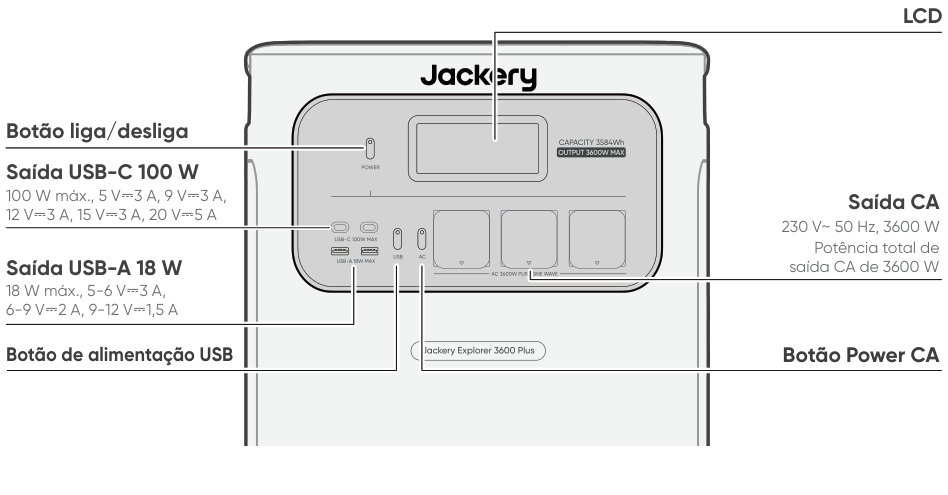
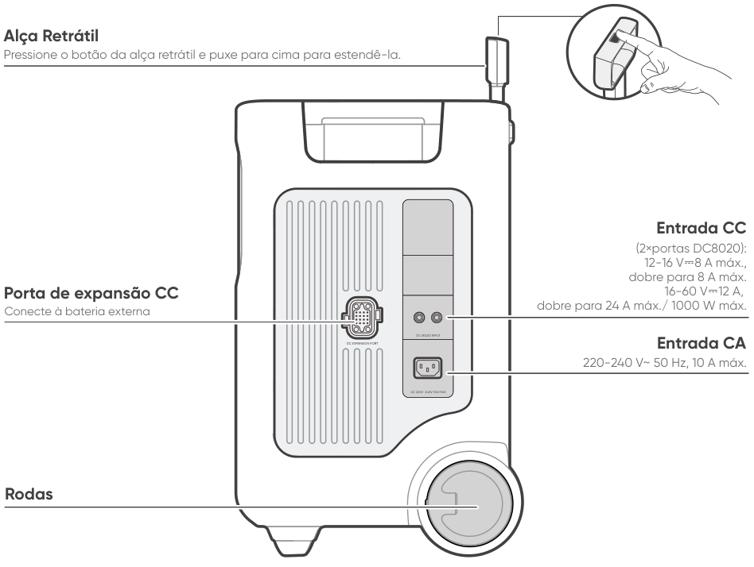
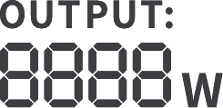
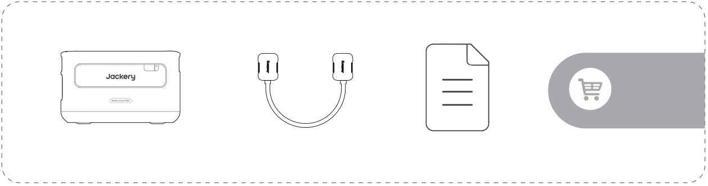

# IMPORTANTE

Parabéns pelo seu novo Jackery Explorer 3600 Plus. Leia este manual atentamente antes de usar o produto, especialmente as precauções relevantes, para garantir o uso adequado. Mantenha este manual em um local acessível para consultas frequentes.

Em conformidade com leis e regulamentos, o direito de interpretação final deste documento e de todos os documentos relacionados a este produto pertence à Empresa.

Observe que não serão fornecidas notificações adicionais em caso de atualização, revisão ou encerramento.

# INFORMAÇÕES IMPORTANTES DE SEGURANÇA

<table class="manual-callout-table manual-callout-table"><tbody><tr><td class="manual-callout-label">AVISO</td><td class="manual-callout-body">
INSTRUÇÕES RELATIVAS AO RISCO DE INCÊNDIO, CHOQUE ELÉTRICO OU LESÕES PESSOAIS
</td></tr></tbody></table>

<strong>Sempre siga estas precauções básicas ao usar este produto.</strong>

<ul><li>
Leia todas as instruções antes de usar o produto.
</li><li>
Não permita que crianças brinquem com o produto. É necessária supervisão rigorosa quando o produto for usado perto de crianças.
</li><li>
O uso de acessórios não recomendados ou não comercializados por fabricantes profissionais pode causar risco de choque elétrico.
</li><li>
Quando o produto não estiver em uso, desconecte o plugue de energia da tomada do produto.
</li><li>
Não desmonte o produto, pois isso pode resultar em riscos imprevisíveis, como incêndio, explosão ou choque elétrico.
</li><li>
Não utilize o produto com cabos, plugues ou cabos de saída danificados, pois isso pode causar choque elétrico.
</li><li>
Para garantir a circulação adequada de ar, mantenha as aberturas de ventilação do produto desobstruídas. A área onde o produto é utilizado deve ter fluxo de ar adequado, em um ambiente fresco e seco, para evitar o superaquecimento. O carregamento em locais úmidos ou mal ventilados pode representar riscos à segurança. A água pode causar curtos-circuitos ou danificar o carregador, resultando em riscos à segurança.  
</li><li>
Não exponha o produto ao fogo, altas temperaturas, luz solar direta ou ambientes de calor intenso, como dentro de um veículo estacionado. Tal exposição pode resultar em incêndio ou explosão.
</li></ul>

## INSTRUÇÕES DE MANUTENÇÃO DO USUÁRIO

Durante o ciclo de vida de produtos de armazenamento de energia, é esperado certo grau de degradação da capacidade e da energia. À medida que o número de ciclos de carga e descarga aumenta e o tempo de armazenamento se prolonga, essa degradação se intensifica gradualmente, o que é um fenômeno normal consistente com o envelhecimento natural das células da bateria.

# Significado dos Símbolos

<figure aria-label="Significado dos Símbolos" class="hb-symbol-signal-composition" data-component-id="HB-TABLE-SYMBOL-SIGNAL"><table class="hb-symbol-signal-table"><colgroup><col class="hb-symbol-signal-col-label"/><col class="hb-symbol-signal-col-meaning"/></colgroup><thead><tr><th class="hb-symbol-signal-label-heading" scope="col">Símbolo</th><th class="hb-symbol-signal-meaning-heading" scope="col">Significado</th></tr></thead><tbody><tr><td class="hb-symbol-signal-label-cell">⚠AVISO</td><td class="hb-symbol-signal-meaning-cell">Práticas perigosas que podem resultar em lesões graves, morte e/ou danos materiais.</td></tr><tr><td class="hb-symbol-signal-label-cell">⚠CUIDADO</td><td class="hb-symbol-signal-meaning-cell">Práticas perigosas que podem resultar em lesões pessoais e/ou danos materiais.</td></tr><tr><td class="hb-symbol-signal-label-cell">⚠NOTA</td><td class="hb-symbol-signal-meaning-cell">Práticas perigosas que podem resultar em danos ao equipamento, perda de dados, deterioração do desempenho ou resultados imprevistos.</td></tr><tr><td class="hb-symbol-signal-label-cell">⚠DICA</td><td class="hb-symbol-signal-meaning-cell">Complementa informações importantes ou dicas de operação no texto.</td></tr></tbody></table></figure>

<figure aria-label="Significado dos Símbolos" class="hb-symbol-pair-composition" data-component-id="HB-TABLE-SYMBOL-ICON">

<table class="hb-symbol-panel-table"><colgroup><col class="hb-symbol-col-icon"/><col class="hb-symbol-col-meaning"/></colgroup><thead><tr><th class="hb-symbol-icon-heading" scope="col">Símbolo</th><th class="hb-symbol-meaning-heading" scope="col">Significado</th></tr></thead><tbody><tr><td class="hb-symbol-icon"></td><td class="hb-symbol-meaning">Símbolos de Advertência e Cuidado. Deve ser lido para alertar sobre potenciais perigos ou riscos.</td></tr><tr><td class="hb-symbol-icon"></td><td class="hb-symbol-meaning">Leia o manual do usuário antes de operar.</td></tr><tr><td class="hb-symbol-icon"></td><td class="hb-symbol-meaning">Não desmonte o produto.</td></tr><tr><td class="hb-symbol-icon"></td><td class="hb-symbol-meaning">Mantenha o produto longe de fogo.</td></tr><tr><td class="hb-symbol-icon"></td><td class="hb-symbol-meaning">Mantenha fora do alcance de crianças.</td></tr><tr><td class="hb-symbol-icon"></td><td class="hb-symbol-meaning">Este símbolo indica que o produto contém uma bateria de íon de lítio (Li-ion) e que esta deve ser descartada ou reciclada adequadamente.</td></tr></tbody></table>

<table class="hb-symbol-panel-table"><colgroup><col class="hb-symbol-col-icon"/><col class="hb-symbol-col-meaning"/></colgroup><thead><tr><th class="hb-symbol-icon-heading" scope="col">Símbolo</th><th class="hb-symbol-meaning-heading" scope="col">Significado</th></tr></thead><tbody><tr><td class="hb-symbol-icon"></td><td class="hb-symbol-meaning">As baterias e os acumuladores não devem ser descartados junto com o lixo doméstico. Como consumidor, você é legalmente obrigado a descartar todas as baterias e acumuladores em pontos de coleta designados, independentemente de conterem substâncias perigosas. Devolva as baterias e acumuladores usados a um ponto de coleta local, centro de reciclagem ou ao revendedor onde foram comprados. O descarte adequado garante a reciclagem ambientalmente responsável e evita danos potenciais à saúde humana e ao meio ambiente.</td></tr><tr><td class="hb-symbol-icon"></td><td class="hb-symbol-meaning">Este símbolo indica que o produto não deve ser descartado como lixo doméstico e deve ser encaminhado a um ponto de coleta designado para reciclagem. O descarte e a reciclagem adequados podem ajudar a proteger o meio ambiente. Para obter mais informações sobre o descarte e a reciclagem deste produto, entre em contato com a autoridade local, o serviço de coleta ou o revendedor.</td></tr></tbody></table>

</figure>

# CONTEÚDO DA EMBALAGEM

<figure aria-label="CONTEÚDO DA EMBALAGEM" class="hb-inbox-composition" data-card-count="3" data-component-id="HB-SPECIAL-INBOX" data-inbox-variant="three-card-responsive"><ol class="hb-inbox-grid"><li class="hb-inbox-card" data-item-number="1">

Jackery Explorer 3600 Plus

</li><li class="hb-inbox-card" data-item-number="2">

Cabo de carregamento CA

</li><li class="hb-inbox-card" data-item-number="3">

Manual do usuário

</li></ol>

DICA

O cabo de carregamento veicular não está incluído, mas está disponível para compra separadamente em nosso site. Para obter assistência, entre em contato com o atendimento ao cliente da Jackery.

</figure>

# VISÃO GERAL DO PRODUTO

## VISTA FRONTAL

<figure class="hb-reference-figure" data-component-id="HB-SPECIAL-REFERENCE-FIGURE" data-reference-id="overview-front" data-source-fragment-sha256="f73dccf7866ae4c21fa9eab7d4032b8595d513059060400bf20a409f1d18ad13">

</figure>

## VISTA LATERAL DIREITA

<figure class="hb-reference-figure" data-component-id="HB-SPECIAL-REFERENCE-FIGURE" data-reference-id="overview-right" data-source-fragment-sha256="ba33a0c8f93951544adc41aea8253e84c4d5b28ebb85d79e9eee1c58f73e8225">

</figure>

# DISPLAY LCD

<figure class="hb-reference-figure" data-component-id="HB-SPECIAL-REFERENCE-FIGURE" data-reference-id="lcd-map" data-source-fragment-sha256="099a4645af1ffb7d6d16b1c4527fbffec879138ed43dbcad8fc39491320c6136">

</figure>

<figure aria-label="DISPLAY LCD" class="hb-lcd-table-composition" data-component-id="HB-TABLE-LCD-ICON" tabindex="0"><table class="hb-lcd-icon-table"><colgroup><col class="hb-lcd-col-number"/><col class="hb-lcd-col-icon"/><col class="hb-lcd-col-name"/><col class="hb-lcd-col-description"/></colgroup><tbody><tr><td class="hb-lcd-number">1</td><td class="hb-lcd-icon"></td><td class="hb-lcd-name">Wi-Fi</td><td class="hb-lcd-description">
Ligado: Wi-Fi conectado. Pisca: Pronto para conectar ao Wi-Fi. Desligado: Wi-Fi desconectado.
</td></tr><tr><td class="hb-lcd-number">2</td><td class="hb-lcd-icon"></td><td class="hb-lcd-name">Bluetooth</td><td class="hb-lcd-description">
Ligado: Bluetooth conectado. Pisca: Pronto para conectar ao Bluetooth. Desligado: Bluetooth desconectado.
</td></tr><tr><td class="hb-lcd-number">3</td><td class="hb-lcd-icon"></td><td class="hb-lcd-name">Modo de carregamento silencioso</td><td class="hb-lcd-description">
Ligado: O ruído durante o carregamento é significativamente reduzido, enquanto a potência de carregamento é reduzida e a velocidade de carregamento diminui. Desligado: Modo de carregamento silencioso desativado. Ative/desative este recurso no aplicativo da Jackery.
</td></tr><tr><td class="hb-lcd-number" rowspan="2">4</td><td class="hb-lcd-icon"></td><td class="hb-lcd-name">Modo de economia de bateria</td><td class="hb-lcd-description">
Ligado: Limita a capacidade máxima utilizável da bateria para prolongar sua vida útil. Desligado: Modo de economia de bateria desativado. Ative/desative este recurso no aplicativo da Jackery. Este recurso não está disponível quando o produto está conectado a bateria(s) externa(s).
</td></tr><tr><td class="hb-lcd-icon"></td><td class="hb-lcd-name">Modo de autoalimentação</td><td class="hb-lcd-description">
Maximiza o uso de energia solar e reduz a dependência da rede elétrica ao priorizar a energia solar armazenada, reduzindo os custos de eletricidade (ative/desative este recurso no aplicativo). A estação de energia deve estar conectada simultaneamente aos painéis solares e à rede elétrica, com a potência de carga limitada pela potência de bypass.
</td></tr><tr><td class="hb-lcd-number">5</td><td class="hb-lcd-icon"></td><td class="hb-lcd-name">Plano de carregamento</td><td class="hb-lcd-description">
Personaliza o tempo de carregamento do Jackery Explorer 3600 Plus. Adequado para situações com variação nas tarifas de eletricidade, permite definir planos de carregamento com base nos horários de pico e fora de pico, reduzindo os custos de energia (Configure no aplicativo Jackery).
</td></tr><tr><td class="hb-lcd-number">6</td><td class="hb-lcd-icon"></td><td class="hb-lcd-name">Indicador de energia AC</td><td class="hb-lcd-description">
A saída CA (onda senoidal pura) está ligada.
</td></tr><tr><td class="hb-lcd-number">7</td><td class="hb-lcd-icon"></td><td class="hb-lcd-name">Tensão e Frequência de Saída</td><td class="hb-lcd-description">
Exibe a tensão e a frequência de saída quando a saída CA está ligada.
</td></tr><tr><td class="hb-lcd-number">8</td><td class="hb-lcd-icon"></td><td class="hb-lcd-name">Potência de entrada</td><td class="hb-lcd-description">
Exibe a potência de entrada em watts.
</td></tr><tr><td class="hb-lcd-number">9</td><td class="hb-lcd-icon"></td><td class="hb-lcd-name">Tempo de carregamento restante</td><td class="hb-lcd-description">
Exibe o tempo de carregamento restante.
</td></tr><tr><td class="hb-lcd-number">10</td><td class="hb-lcd-icon"></td><td class="hb-lcd-name">Indicador de carregamento via tomada CA</td><td class="hb-lcd-description">
O produto é carregado pela Entrada CA usando energia da rede.
</td></tr><tr><td class="hb-lcd-number">11</td><td class="hb-lcd-icon"></td><td class="hb-lcd-name">Indicador de carregamento veicular</td><td class="hb-lcd-description">
O produto é carregado pela Entrada CC (DC8020) usando CC 12 V (carregamento veicular).
</td></tr><tr><td class="hb-lcd-number">12</td><td class="hb-lcd-icon"></td><td class="hb-lcd-name">Indicador de carregamento solar</td><td class="hb-lcd-description">
O produto é carregado pela Entrada CC (DC8020) usando painel(is) solar(es).
</td></tr><tr><td class="hb-lcd-number">13</td><td class="hb-lcd-icon"></td><td class="hb-lcd-name">Indicador de energia da bateria</td><td class="hb-lcd-description">
Quando o produto estiver sendo carregado, o círculo laranja ao redor da porcentagem da bateria acenderá em sequência. Ao carregar outros dispositivos, o círculo laranja permanece aceso.
</td></tr><tr><td class="hb-lcd-number">14</td><td class="hb-lcd-icon"></td><td class="hb-lcd-name">Indicador de bateria fraca</td><td class="hb-lcd-description">
Ligado: O nível da bateria está abaixo de 20%. Pisca: O nível da bateria está abaixo de 5%. Desligado: O nível da bateria não está abaixo de 20% ou o produto está carregando.
</td></tr><tr><td class="hb-lcd-number">15</td><td class="hb-lcd-icon"></td><td class="hb-lcd-name">Porcentagem de bateria restante</td><td class="hb-lcd-description">
Exibe a porcentagem de bateria restante.
</td></tr><tr><td class="hb-lcd-number">16</td><td class="hb-lcd-icon"></td><td class="hb-lcd-name">Indicador da Bateria Externa e Número de Baterias Conectadas</td><td class="hb-lcd-description">
Exibe a quantidade de baterias externas, se alguma estiver conectada.
</td></tr><tr><td class="hb-lcd-number">17</td><td class="hb-lcd-icon"></td><td class="hb-lcd-name">Código de falha</td><td class="hb-lcd-description">
Ocorreu um erro no produto. Consulte a seção de Solução de problemas para obter detalhes.
</td></tr><tr><td class="hb-lcd-number" rowspan="2">18</td><td class="hb-lcd-icon"></td><td class="hb-lcd-name">Indicador de alta temperatura</td><td class="hb-lcd-description">
A proteção contra alta temperatura foi ativada. O produto pode parar de funcionar até que sua temperatura retorne à faixa normal de operação.
</td></tr><tr><td class="hb-lcd-icon"></td><td class="hb-lcd-name">Indicador de temperatura baixa</td><td class="hb-lcd-description">
A proteção contra baixa temperatura foi ativada. O produto pode parar de funcionar até que sua temperatura retorne à faixa normal de operação.
</td></tr><tr><td class="hb-lcd-number">19</td><td class="hb-lcd-icon"></td><td class="hb-lcd-name">Modo de economia de energia</td><td class="hb-lcd-description">
Quando a saída CA ou USB for ativada pressionando o botão POWER CA ou o botão POWER USB: Ligado: O Modo de economia de energia está ativado. Desligado: O Modo de economia de energia está desativado.
</td></tr><tr><td class="hb-lcd-number">20</td><td class="hb-lcd-icon"></td><td class="hb-lcd-name">Potência de saída</td><td class="hb-lcd-description">
Exibe a potência de saída em watts.
</td></tr><tr><td class="hb-lcd-number">21</td><td class="hb-lcd-icon"></td><td class="hb-lcd-name">Tempo de descarga restante</td><td class="hb-lcd-description">
Exibe o tempo de descarga restante.
</td></tr></tbody></table></figure>

# OPERAÇÕES

## LIGAR/DESLIGAR

<figure class="hb-reference-figure hb-base-art-live-copy" data-component-id="HB-SPECIAL-REFERENCE-FIGURE" data-reference-id="operation-main-power" data-source-fragment-sha256="21f446df012cfc3628ce3b2b122964a8105e1d21510b214a10d316376976e26b" data-web-base-art-ref="operation-main-power" data-web-presentation-mode="base-art-live-copy">

ON Pressione uma vezApagado Pressione e segure por 3 s 3sTempo de espera padrão: 2 horas O produto será desligado automaticamente após 2 horas de inatividade, sem estar carregando nem descarregando. * O tempo de espera pode ser definido no aplicativo da Jackery.Quando o Modo de Economia de Energia estiver ativado, o produto será desligado automaticamente após 12 horas se o botão POWER CA ou o botão POWER USB estiver ligado, mas o produto não estiver carregando nem descarregando.

</figure>

## SAÍDA USB LIGAR/DESLIGAR

<figure class="hb-operation-figure hb-operation-layout-status-right hb-base-art-live-copy" data-component-id="HB-SPECIAL-OPERATION" data-operation-id="dc-usb-output" data-source-fragment-sha256="45a629ac8be66c10a223651d69e4650327886eb3b4ec2ed5d75b2e3d22e203a2" data-web-base-art-ref="operation/dc_usb_output" data-web-presentation-mode="base-art-live-copy" data-web-replace-key="operation.dc-usb-output">

<strong>Pré-requisito:</strong> O produto está ligado.

<strong>ON</strong>

Pressione uma vez

<strong>Apagado</strong>

Pressione uma vez

</figure>

<table class="manual-callout-table manual-callout-table"><tbody><tr><td class="manual-callout-label">CUIDADO</td><td class="manual-callout-body"><ul><li>
USB-C 100 W MÁX. é uma porta de saída de alta potência compatível com USB-PD Power Source 3 (PS3). Se o dispositivo do usuário ou acessório conectado não atender aos requisitos de segurança, pode haver risco de incêndio. Antes de usar essas portas, certifique-se de que o dispositivo ou acessório conectado possua proteção contra incêndio.
</li><li>
Conecte o Jackery Explorer 3600 Plus somente a dispositivos ou acessórios que estejam em conformidade com as cláusulas 6.3, 6.4 e 6.5 da IEC/EN/UL 62368-1 (ou outras normas equivalentes).
</li><li>
Para obter a potência máxima de saída, use o cabo oficial Jackery USB-C para USB-C de 5 A (20 V CC/5 A, 100 W).
</li></ul></td></tr></tbody></table>

## SAÍDA CA LIGAR/DESLIGAR

<figure class="hb-operation-figure hb-operation-layout-status-right hb-base-art-live-copy" data-component-id="HB-SPECIAL-OPERATION" data-operation-id="ac-output" data-source-fragment-sha256="5336c5ff608798acde3dad739f7e8e8d829a35519972093680a3bf1d044d22cd" data-web-base-art-ref="operation/ac_output" data-web-presentation-mode="base-art-live-copy" data-web-replace-key="operation.ac-output">

<strong>Pré-requisito:</strong> O produto está ligado.

<strong>ON</strong>

Pressione uma vez

<strong>Apagado</strong>

Pressione uma vez

</figure>

## MODO DE ECONOMIA DE ENERGIA

<figure class="hb-reference-figure hb-base-art-live-copy" data-component-id="HB-SPECIAL-REFERENCE-FIGURE" data-reference-id="operation-energy-saving" data-source-fragment-sha256="ee684400206a05e266dab12ad4445768b078b5cb60faa09ad17ece20a2b48338" data-web-base-art-ref="operation-energy-saving" data-web-presentation-mode="base-art-live-copy">

Para evitar consumo desnecessário da bateria caso o usuário se esqueça de desligar a saída, o produto ativa o Modo de Economia de Energia por padrão. Se nenhum dispositivo estiver conectado ou o consumo de energia do dispositivo conectado estiver abaixo de um determinado limite (25 W de saída CA ou 2 W de saída USB) por 12 horas, o produto desligará automaticamente as saídas. Para desativar o Modo de Economia de Energia, mantenha pressionados simultaneamente o botão POWER CA e o botão POWER por mais de 3 segundos. O produto não desligará automaticamente a saída CA ou CC.Botão Power PrincipalBotão Power CALigar/Desligar Pressione e segure por 3 s

</figure>

<table class="manual-callout-table manual-callout-table"><tbody><tr><td class="manual-callout-label">NOTA</td><td class="manual-callout-body">
O Modo de economia de energia retoma o estado anterior após ligar o produto. É necessário alternar manualmente para mudar o modo.
</td></tr></tbody></table>

## TELA LCD

<figure aria-label="TELA LCD" class="hb-lcd-mode-composition" data-component-id="HB-TABLE-LCD-MODE">

<table class="hb-lcd-mode-table"><colgroup><col class="hb-lcd-mode-col-state"/><col class="hb-lcd-mode-col-action"/><col class="hb-lcd-mode-col-copy"/></colgroup><tbody><tr><td class="hb-lcd-mode-state" rowspan="3">Aceso Brevemente</td><td class="hb-lcd-mode-action">Ligar</td><td class="hb-lcd-mode-copy">Pressione o botão Power ou quando o produto estiver carregando.</td></tr><tr><td class="hb-lcd-mode-action">Desligar</td><td class="hb-lcd-mode-copy">Pressione o botão POWER.</td></tr><tr><td class="hb-lcd-mode-action">Desligamento automático</td><td class="hb-lcd-mode-copy">O LCD desliga automaticamente e entra no modo de suspensão após 2 minutos de inatividade.</td></tr><tr><td class="hb-lcd-mode-state" rowspan="3">Aceso continuame nte (em estado de carga ou descarga)</td><td class="hb-lcd-mode-action">Ligar</td><td class="hb-lcd-mode-copy">Pressione o botão Power duas vezes quando o produto estiver ligado.</td></tr><tr><td class="hb-lcd-mode-action">Desligar</td><td class="hb-lcd-mode-copy">Pressione o botão POWER.</td></tr><tr><td class="hb-lcd-mode-action">Desligamento automático</td><td class="hb-lcd-mode-copy">O LCD desliga automaticamente após 2 horas de inatividade.</td></tr></tbody></table>
</figure>

Você também pode definir o modo de exibição da tela no aplicativo da Jackery.

## COMBINAÇÃO DE TECLAS

<figure aria-label="Botões / Operação / Função" class="hb-key-combination-composition" data-component-id="HB-TABLE-KEY-COMBINATIONS" tabindex="0"><table class="hb-key-combination-table"><colgroup><col class="hb-key-col-buttons"/><col class="hb-key-col-operation"/><col class="hb-key-col-function"/></colgroup><thead><tr><th class="hb-key-buttons" scope="col">Botões</th><th class="hb-key-operation" scope="col">Operação</th><th class="hb-key-function" scope="col">Função</th></tr></thead><tbody><tr><td class="hb-key-buttons">Botão POWER + Botão de alimentação USB</td><td class="hb-key-operation">Pressione e segure ambos por 3 s</td><td class="hb-key-function">Redefinir o Wi-Fi e o Bluetooth</td></tr><tr><td class="hb-key-buttons">Botão POWER + Botão Power CA</td><td class="hb-key-operation">Pressione e segure ambos por 3 s</td><td class="hb-key-function">Ligar/Desligar o Modo de Economia de Energia</td></tr><tr><td class="hb-key-buttons">Botão de alimentação USB + Botão Power CA</td><td class="hb-key-operation">Pressione e segure ambos por 1 s</td><td class="hb-key-function">Ativar/desativar Wi-Fi e Bluetooth</td></tr></tbody></table></figure>

# FONTE DE ALIMENTAÇÃO ININTERRUPTA (UPS)

Conecte o produto a uma tomada de parede usando o cabo de carregamento CA. Em seguida, pressione o botão POWER CA e ligue seus aparelhos ao mesmo tempo.

<figure class="hb-reference-figure hb-base-art-live-copy" data-component-id="HB-SPECIAL-REFERENCE-FIGURE" data-reference-id="ups" data-source-fragment-sha256="73107b115b246891330d78f868c106631147b93efd481e72886d3d02462f23c0" data-web-base-art-ref="ups" data-web-presentation-mode="base-art-live-copy">

Uma fonte de alimentação ininterrupta (UPS) é um tipo de sistema de energia contínua que fornece energia elétrica de backup automaticamente a uma carga quando a rede elétrica falha. Em caso de queda repentina de energia da rede, o Explorer 3600 Plus alternará automaticamente para a energia armazenada em até 10 ms para manter seus aparelhos em funcionamento.

</figure>

No modo UPS, a potência de pico da unidade atinge 10 A antes de quedas de energia. Como o carregamento/descarregamento simultâneo é ativado no Modo de bypass, a potência de saída real é inferior à potência nominal neste modo, mas retorna à potência nominal durante quedas de energia.

<table class="manual-callout-table manual-callout-table"><tbody><tr><td class="manual-callout-label">CUIDADO</td><td class="manual-callout-body"><ul><li>
Este produto não suporta comutação de 0 ms. Não conecte este produto a equipamentos que exijam fonte de alimentação com comutação de 0 ms, como servidores de dados ou estações de trabalho.
</li><li>
Antes do uso, teste a compatibilidade com seu dispositivo várias vezes.
</li><li>
Não conecte cargas que excedam a potência máxima de saída do produto. Caso contrário, a proteção contra sobrecarga será acionada.
</li></ul></td></tr></tbody></table>

# CONEXÕES

<h2 class="hb-subbar" id="conecte-às-baterias-externas-vendido-separadamente">CONECTE À(S) BATERIA(S) EXTERNA(S) VENDIDO SEPARADAMENTE</h2>

Este produto pode ser conectado a até 5 baterias externas para atender à necessidade de maior capacidade de energia. Para detalhes sobre como usá-lo, consulte o Manual do Usuário do Jackery Battery Pack 3600.

<figure class="hb-reference-figure hb-base-art-live-copy" data-component-id="HB-SPECIAL-REFERENCE-FIGURE" data-reference-id="battery" data-source-fragment-sha256="9eb3693d55cf1278405a9a142fe59fcb8709f598c8829d2a2212627b119a0cbe" data-web-base-art-ref="battery" data-web-presentation-mode="base-art-live-copy">

≥ 200 mm≥ 200 mm

</figure>

<table class="manual-callout-table manual-callout-table"><tbody><tr><td class="manual-callout-label">CUIDADO</td><td class="manual-callout-body"><ul><li>
Certifique-se de que todos os produtos estejam desligados antes de conectar o Explorer 3600 Plus ao Jackery Battery Pack 3600.
</li><li>
Para garantir o funcionamento adequado do produto, certifique-se de que as entradas e saídas de ar em ambos os lados estejam desobstruídas. Deixe um espaço de pelo menos 200 mm entre as aberturas de ventilação e quaisquer objetos para permitir uma dissipação adequada do calor.
</li></ul></td></tr></tbody></table>

<figure class="hb-reference-figure hb-base-art-live-copy" data-component-id="HB-SPECIAL-REFERENCE-FIGURE" data-reference-id="battery-accessories" data-source-fragment-sha256="337fad9115538fd2e940bf5a4aa47d6dd05523fe5c614003496452a469ba572d" data-web-base-art-ref="battery-accessories" data-web-presentation-mode="base-art-live-copy">

Jackery Battery Pack 3600Cabo de expansãoManual do usuárioVendido separadamente

</figure>

# CARREGANDO

<strong>Energia verde primeiro:</strong> Recomendamos priorizar o uso de energia verde. Este produto suporta dois modos de carregamento ao mesmo tempo: carregamento solar e carregamento por tomada da rede elétrica CA. Quando o carregamento por tomada CA e o carregamento solar estão ativados ao mesmo tempo, o produto dará prioridade ao carregamento solar e ambos os métodos serão usados para carregar a bateria na potência máxima permitida.

Carregue totalmente o produto antes do primeiro uso.

<table class="manual-callout-table manual-callout-table"><tbody><tr><td class="manual-callout-label">NOTA</td><td class="manual-callout-body"><ul><li>
A temperatura de carregamento recomendada para o produto varia de -20°C a 45 °C, e a temperatura de descarga varia de -20°C a 45 °C. Operar o produto fora dessa faixa de temperatura pode limitar sua capacidade de carregamento e descarga ou até mesmo impedir que ele seja carregado ou descarregado.
</li><li>
A potência de carregamento e a capacidade da bateria do produto podem variar devido a flutuações de temperatura.
</li></ul></td></tr></tbody></table>

## CARREGAMENTO POR MEIO DE TOMADA CA

<figure class="hb-reference-figure hb-base-art-live-copy" data-component-id="HB-SPECIAL-REFERENCE-FIGURE" data-reference-id="charging-ac" data-source-fragment-sha256="9d5fe0aa9eb4459c5397c14ab2e526f952f4b08c2572aa059b3efbb9c04a0e17" data-web-base-art-ref="charging-ac" data-web-presentation-mode="base-art-live-copy">

Conecte o cabo de carregamento CA à porta de entrada CA do produto e a uma tomada da rede elétrica.

</figure>

<table class="manual-callout-table manual-callout-table"><tbody><tr><td class="manual-callout-label">CUIDADO</td><td class="manual-callout-body">
Certifique-se de que o cabo de carregamento CA esteja totalmente e firmemente conectado à porta de entrada CA. Uma conexão incompleta pode causar instabilidade na corrente elétrica, superaquecimento, mau contato ou mau funcionamento do dispositivo.
</td></tr></tbody></table>

<h2 class="hb-subbar" id="mau-contato-ou-mau-funcionamento-do-dispositivo-carregamento-via-painéis-solares-vendido-separadamente">mau contato ou mau funcionamento do dispositivo. CARREGAMENTO VIA PAINÉIS SOLARES VENDIDO SEPARADAMENTE</h2>

CARREGAMENTO VIA PAINÉIS SOLARES VENDIDO SEPARADAMENTE O Jackery Explorer 3600 Plus possui duas portas de entrada DC8020 e é compatível com os painéis solares da Jackery. Se for necessário conectar dois painéis solares a uma única porta de entrada DC8020, consulte a figura abaixo para carregar por meio do conector para painel solar (vendido separadamente, não incluso no pacote padrão).

<figure class="hb-reference-figure hb-base-art-live-copy" data-component-id="HB-SPECIAL-REFERENCE-FIGURE" data-reference-id="charging-solar" data-source-fragment-sha256="b19d8622a4150edbc36830bc842910b6f17d60391198e798de99655bb462bf8b" data-web-base-art-ref="charging-solar" data-web-presentation-mode="base-art-live-copy">

SolarSaga 200 × 4

</figure>

<table class="manual-callout-table manual-callout-table"><tbody><tr><td class="manual-callout-label">CUIDADO</td><td class="manual-callout-body">
Uma porta de entrada DC8020 pode ser conectada a no máximo dois painéis solares.
</td></tr></tbody></table>

<table class="manual-callout-table manual-callout-table"><tbody><tr><td class="manual-callout-label">CUIDADO</td><td class="manual-callout-body"><ul><li>
Certifique-se de que a tensão de entrada para ambas as portas de entrada CC seja a mesma. Caso contrário, o produto pode ser danificado. Por exemplo:
</li><li>
Recomenda-se usar o mesmo modelo de painéis solares da Jackery e o mesmo número de painéis ao conectar painéis solares a ambas as portas de entrada DC8020.
</li><li>
Não carregue o produto usando simultaneamente um carregador veicular e um painel solar. Isso pode queimar o fusível do carro ou resultar em falha no carregamento.
</li></ul></td></tr></tbody></table>

Recomenda-se usar o painel solar Jackery para carregar o produto. Garanta que a tensão de circuito aberto (VOC) do painel solar esteja dentro da faixa de entrada CC (16 V-60 V) do Explorer 3600 Plus. A Jackery não se responsabiliza por quaisquer danos ou perdas resultantes do uso de painéis solares de terceiros.

<h2 class="hb-subbar" id="carregamento-via-carregador-veicular-vendido-separadamente">CARREGAMENTO VIA CARREGADOR VEICULAR VENDIDO SEPARADAMENTE</h2>

Este produto pode ser carregado usando um carregador veicular de 12 V. Certifique-se de que o carregador veicular e a tomada de alimentação de 12 V do veículo (acendedor de cigarros) estejam bem conectados.

<figure class="hb-reference-figure hb-base-art-live-copy" data-component-id="HB-SPECIAL-REFERENCE-FIGURE" data-reference-id="charging-car" data-source-fragment-sha256="6506a9e27a6787e3a7ae924dbc5fe4cf4eb50d62e86844ed118c97223d32fb97" data-web-base-art-ref="charging-car" data-web-presentation-mode="base-art-live-copy">

Veículo*O cabo de carregamento veicular é vendido separadamente.

</figure>

<table class="manual-callout-table manual-callout-table"><tbody><tr><td class="manual-callout-label">CUIDADO</td><td class="manual-callout-body"><ul><li>
Ligue o veículo antes de carregar a estação de energia.
</li><li>
Se o veículo estiver trafegando por estradas irregulares, é proibido usar o carregador veicular, pois isso pode causar funcionamento inadequado. A Empresa não se responsabiliza por quaisquer perdas causadas por operação fora do padrão.
</li><li>
O carregamento veicular é aplicável apenas a veículos com 12 V CC, não a 24 V CC. Não carregue este produto em veículos de 24 V para evitar lesões pessoais e danos materiais.
</li></ul></td></tr></tbody></table>

# Armazenamento

Armazene o produto em local limpo, seco e com ventilação adequada. Temperatura e umidade de armazenamento:
<ul class="hb-source-storage-copy" style="margin:0"><li class="hb-source-storage-item" style="margin:0">
1 mês: -20°C a 45°C (0-60%UR)
</li><li class="hb-source-storage-item" style="margin:0">
3 meses: 0°C a 45°C (0-60%UR)
</li><li class="hb-source-storage-item" style="margin:0">
12 meses: 0°C a 25°C (0-60%UR)
</li></ul>
Se este produto for armazenado por um longo período (3 meses - 6 meses) com a bateria descarregada, ele pode não voltar a carregar. Para evitar isso e manter a saúde da bateria, recomenda-se verificar e recarregar o produto a cada três meses e realizar um ciclo completo de carga e descarga pelo menos uma vez a cada 6 a 12 meses.

# SOLUÇÃO DE PROBLEMAS

Se qualquer um dos seguintes códigos de falha aparecer, siga as ações corretivas listadas para resolver o problema. Se a falha persistir, entre em contato com o Suporte ao Cliente da Jackery.

<figure aria-label="Código de erro / Medidas corretivas" class="hb-troubleshooting-composition" data-component-id="HB-TABLE-TROUBLESHOOTING" tabindex="0"><table class="hb-troubleshooting-table"><colgroup><col class="hb-troubleshooting-col-code"/><col class="hb-troubleshooting-col-measures"/></colgroup><thead><tr><th class="hb-troubleshooting-code" scope="col">Código de erro</th><th class="hb-troubleshooting-measures" scope="col">Medidas corretivas</th></tr></thead><tbody><tr><td class="hb-troubleshooting-code">F0</td><td class="hb-troubleshooting-measures">Reinicie o produto.</td></tr><tr><td class="hb-troubleshooting-code">F1</td><td class="hb-troubleshooting-measures">Reinicie o produto.</td></tr><tr><td class="hb-troubleshooting-code">F2</td><td class="hb-troubleshooting-measures">Reinicie o produto.</td></tr><tr><td class="hb-troubleshooting-code">F3</td><td class="hb-troubleshooting-measures">Reinicie o produto.</td></tr><tr><td class="hb-troubleshooting-code">F4</td><td class="hb-troubleshooting-measures">Conecte o produto a cargas para descarregar a bateria até que a falha desapareça.</td></tr><tr><td class="hb-troubleshooting-code">F5</td><td class="hb-troubleshooting-measures">Carregue o produto por painéis solares ou tomada de parede CA até que a falha desapareça.</td></tr><tr><td class="hb-troubleshooting-code">F6</td><td class="hb-troubleshooting-measures">1. Aguarde a normalização da rede elétrica antes de carregar o produto pela tomada CA. 2. Verifique se as aberturas de entrada e saída de ar estão bloqueadas; certifique-se de manter uma distância de 200 mm em ambos os lados do produto. 3. Coloque o produto em um local não exposto à luz solar direta ou a altas temperaturas ambientes. 4. Desconecte todas as cargas do produto. Mantenha o produto ocioso e aguarde até que a falha desapareça. 5. Reinicie o produto.</td></tr><tr><td class="hb-troubleshooting-code">F7</td><td class="hb-troubleshooting-measures">1. Remova todas as entradas CC do produto. 2. Verifique a tensão de circuito aberto (Voc) dos painéis solares conectados. O produto permite uma tensão máxima de entrada CC de 60 V. 3. Reinicie o produto e mantenha-o inativo. Aguarde até que a falha desapareça.</td></tr><tr><td class="hb-troubleshooting-code">F8</td><td class="hb-troubleshooting-measures">Entre em contato com o Suporte ao Cliente da Jackery.</td></tr><tr><td class="hb-troubleshooting-code">F9</td><td class="hb-troubleshooting-measures">Remova a carga conectada às portas USB do produto. Aguarde até que a falha desapareça.</td></tr><tr><td class="hb-troubleshooting-code">FA</td><td class="hb-troubleshooting-measures">1. Desligue a saída CA das duas unidades. 2. Pressione novamente o botão POWER CA de cada unidade dentro de 1 minuto.</td></tr><tr><td class="hb-troubleshooting-code">FC</td><td class="hb-troubleshooting-measures">1. Reinicie as baterias externas e o Jackery Explorer 3600 Plus, respectivamente. 2. Se a falha persistir, desconecte a bateria externa do Jackery Explorer 3600 Plus e conecte-os novamente.</td></tr></tbody></table></figure>

# ESPECIFICAÇÕES

<h2 aria-level="2" role="heading">INFORMAÇÕES GERAIS</h2><figure aria-label="INFORMAÇÕES GERAIS" class="hb-spec-table-composition"><table class="manual-table manual-spec-table hb-spec-table"><colgroup><col class="hb-spec-col-label"/><col class="hb-spec-col-value"/></colgroup><tbody><tr><th class="manual-spec-label hb-spec-label" scope="row">Nome do produto</th><td class="manual-spec-value hb-spec-value">Jackery Explorer 3600 Plus</td></tr><tr><th class="manual-spec-label hb-spec-label" scope="row">Nº do modelo</th><td class="manual-spec-value hb-spec-value">JE-3600 A</td></tr><tr><th class="manual-spec-label hb-spec-label" scope="row">Capacidade</th><td class="manual-spec-value hb-spec-value">80 Ah / 44,8 V CC (3584 Wh)</td></tr><tr><th class="manual-spec-label hb-spec-label" scope="row">Química da célula</th><td class="manual-spec-value hb-spec-value">LiFePO4</td></tr><tr><th class="manual-spec-label hb-spec-label" scope="row">Peso</th><td class="manual-spec-value hb-spec-value">Aproximadamente 35 kg</td></tr><tr><th class="manual-spec-label hb-spec-label" scope="row">Dimensões</th><td class="manual-spec-value hb-spec-value">38,5×30,9×49,1 cm</td></tr><tr><th class="manual-spec-label hb-spec-label" scope="row">Vida útil de ciclos</th><td class="manual-spec-value hb-spec-value">6000 ciclos até 70%+ de capacidade</td></tr><tr><th class="manual-spec-label hb-spec-label" scope="row">Código IEC</th><td class="manual-spec-value hb-spec-value">IFpR41/136[14S4P]M/-20+40/90</td></tr></tbody></table></figure><h2 aria-level="2" role="heading">PORTAS DE ENTRADA</h2><figure aria-label="PORTAS DE ENTRADA" class="hb-spec-table-composition"><table class="manual-table manual-spec-table hb-spec-table"><colgroup><col class="hb-spec-col-label"/><col class="hb-spec-col-value"/></colgroup><tbody><tr><th class="manual-spec-label hb-spec-label" scope="row">1 × Entrada CA</th><td class="manual-spec-value hb-spec-value">Modo de carregamento: 220-240 V~ 50 Hz, 10 A máx.</td></tr><tr><th class="manual-spec-label hb-spec-label" scope="row">1 × Entrada CA</th><td class="manual-spec-value hb-spec-value">Modo de bypass① : 220-240 V~ 50Hz, 10 A máx.</td></tr><tr><th class="manual-spec-label hb-spec-label" scope="row">2 × Portas DC8020</th><td class="manual-spec-value hb-spec-value">12-16 V⎓8 A máx., dobro para 8 A máx.</td></tr><tr><th class="manual-spec-label hb-spec-label" scope="row">2 × Portas DC8020</th><td class="manual-spec-value hb-spec-value">16-60 V⎓12 A, dobro para 24 A máx. / 1000 W máx.</td></tr><tr><th class="manual-spec-label hb-spec-label" scope="row">1 × Porta de expansão CC</th><td class="manual-spec-value hb-spec-value">36,4 V-50,4 V⎓100 A máx.</td></tr></tbody></table></figure><h2 aria-level="2" role="heading">PORTAS DE SAÍDA</h2><figure aria-label="PORTAS DE SAÍDA" class="hb-spec-table-composition"><table class="manual-table manual-spec-table hb-spec-table"><colgroup><col class="hb-spec-col-label"/><col class="hb-spec-col-value"/></colgroup><tbody><tr><th class="manual-spec-label hb-spec-label" scope="row">3 × saídas CA</th><td class="manual-spec-value hb-spec-value">230 V~ 50Hz, 3600 W</td></tr><tr><th class="manual-spec-label hb-spec-label" scope="row">Saída total CA②</th><td class="manual-spec-value hb-spec-value">3600 W Nominal, pico de 7200 W</td></tr><tr><th class="manual-spec-label hb-spec-label" scope="row">Saída CA no modo de bypass①</th><td class="manual-spec-value hb-spec-value">220-240 V~ 50Hz, 10 A máx.</td></tr><tr><th class="manual-spec-label hb-spec-label" scope="row">2 × Saída USB-C 100 W</th><td class="manual-spec-value hb-spec-value">100 W máx., 5 V⎓3 A, 9 V⎓3 A, 12 V⎓3 A, 15 V⎓3 A, 20 V⎓5 A</td></tr><tr><th class="manual-spec-label hb-spec-label" scope="row">2 × Saída USB-A 18 W</th><td class="manual-spec-value hb-spec-value">18 W máx., 5-6 V⎓3 A, 6-9 V⎓2 A, 9-12 V⎓1,5 A</td></tr><tr><th class="manual-spec-label hb-spec-label" scope="row">1 × Porta de expansão CC</th><td class="manual-spec-value hb-spec-value">36,4 V–50,4 V ⎓ 60 A máx.</td></tr></tbody></table></figure><h2 aria-level="2" role="heading">TEMPERATURA AMBIENTE DE OPERAÇÃO</h2><figure aria-label="TEMPERATURA AMBIENTE DE OPERAÇÃO" class="hb-spec-table-composition"><table class="manual-table manual-spec-table hb-spec-table"><colgroup><col class="hb-spec-col-label"/><col class="hb-spec-col-value"/></colgroup><tbody><tr><th class="manual-spec-label hb-spec-label" scope="row">Temperatura de carregamento</th><td class="manual-spec-value hb-spec-value">-20°C a 45°C</td></tr><tr><th class="manual-spec-label hb-spec-label" scope="row">Temperatura de descarga</th><td class="manual-spec-value hb-spec-value">-20°C a 45°C</td></tr></tbody></table></figure>

※ USB Type-C® e USB-C® são marcas registradas do USB Implementers Forum.

① O produto pode carregar a bateria a partir da tomada CA enquanto fornece energia pelas portas de saída CA.

② Indica que duas ou mais portas de saída CA operam em conjunto.

# GARANTIA

<figure aria-label="GARANTIA" class="hb-warranty-intro-composition" data-component-id="HB-WARRANTY-LEAD">

<strong>A garantia é fornecida apenas a clientes que comprarem no Site oficial da Jackery, em plataformas de terceiros com marca Jackery ou por meio de revendedores locais autorizados.</strong>

*O período e os detalhes da garantia podem variar de acordo com as leis, regulamentações locais e revendedores autorizados.

</figure>

## Garantia Limitada

<figure aria-label="Garantia Limitada" class="hb-warranty-card" data-component-id="HB-WARRANTY-SECTION" data-warranty-card-index="1">
A Jackery garante ao comprador consumidor original que o produto Jackery estará livre de defeitos de fabricação e material sob uso normal do consumidor durante o período de garantia aplicável identificado na seção "Período de Garantia" abaixo, sujeito às exclusões estabelecidas abaixo. Esta declaração de garantia estabelece a obrigação de garantia total e exclusiva da Jackery. Não assumiremos, nem autorizaremos qualquer pessoa a assumir em nosso nome, qualquer outra responsabilidade relacionada à venda de nossos produtos.
</figure>

## Período de Garantia

<figure aria-label="Período de Garantia" class="hb-warranty-period-card" data-component-id="HB-WARRANTY-YEARS">

3
<strong class="hb-warranty-years-unit">ANOS</strong><strong class="hb-warranty-period-label">Garantia Padrão</strong>

O período de garantia padrão do Jackery Explorer 3600 Plus é de 36 meses. Em todos os casos, o período de garantia é contado a partir da data de compra pelo comprador consumidor original. O recibo da primeira compra do consumidor, ou outro comprovante documental razoável, é necessário para estabelecer a data de início do período de garantia.

2
<strong class="hb-warranty-years-unit">ANOS</strong><strong class="hb-warranty-period-label">Garantia Estendida</strong>

Para ativar a extensão da garantia, registre seu produto online ou entre em contato com nossa equipe de atendimento ao cliente em hello.eu@jackery.com para estender o período de garantia padrão.

</figure>

## Troca

<figure aria-label="Troca" class="hb-warranty-card" data-component-id="HB-WARRANTY-SECTION" data-warranty-card-index="2">
A Jackery substituirá, às suas próprias custas, qualquer produto Jackery que apresente falha de funcionamento durante o período de garantia aplicável devido a defeito de fabricação ou de material. Um produto substituto assume a garantia restante do produto original.
</figure>

## Limitado ao comprador consumidor original

<figure aria-label="Limitado ao comprador consumidor original" class="hb-warranty-card" data-component-id="HB-WARRANTY-SECTION" data-warranty-card-index="3">
A garantia dos produtos Jackery é limitada ao comprador consumidor original e não é transferível a qualquer proprietário subsequente.
</figure>

## Exclusões

<figure aria-label="Exclusões" class="hb-warranty-card" data-component-id="HB-WARRANTY-SECTION" data-warranty-card-index="4">
A garantia da Jackery não se aplica a:
<ul><li>Uso indevido, abuso, modificação, danos causados por acidente ou uso para qualquer finalidade diferente do uso normal do consumidor conforme autorizado na documentação atual do produto da Jackery.</li><li>Tentativa de reparo por qualquer pessoa que não seja uma assistência autorizada.</li><li>Qualquer produto adquirido por meio de leilão online.</li><li>A garantia da Jackery não se aplica à célula da bateria, a menos que ela seja totalmente carregada por você dentro de sete dias após a compra do produto e, posteriormente, pelo menos uma vez a cada 6 meses.</li></ul></figure>

## Direitos de interpretação

<figure aria-label="Direitos de interpretação" class="hb-warranty-card" data-component-id="HB-WARRANTY-SECTION" data-warranty-card-index="5">
A Jackery reserva-se o direito de dar a interpretação final à política de pós-venda descrita acima.
</figure>

# CONFIGURAÇÃO DO APLICATIVO

## 1. Baixe o aplicativo e faça login

<figure aria-label="CONFIGURAÇÃO DO APLICATIVO" class="hb-app-download-composition" data-component-id="HB-SPECIAL-APP">

Pesquise por "Jackery" no Google Play ou App Store para instalar o aplicativo. Depois disso, você pode se registrar e fazer login.

Como alternativa, escaneie o código QR abaixo para baixar e instalar o aplicativo.

</figure>

## 2. Adicionar dispositivo

2.1 Clique no botão + para adicionar o seu dispositivo;

2.2 Pressione o botão <strong>POWER</strong> principal do dispositivo para ligá-lo. Os ícones de Wi-Fi e Bluetooth no dispositivo piscarão, indicando que o dispositivo entrou no modo de configuração de rede. Toque no botão “Ícone piscando” e permita que o aplicativo se conecte a dispositivos próximos e habilite as permissões de Bluetooth.

<figure class="hb-app-add-device-composition hb-has-reference-captions" data-component-id="HB-SPECIAL-APP" data-reference-id="app-add-device" data-step-captions="live">

<figcaption class="hb-reference-caption-grid" data-caption-count="2" data-caption-layout="equal" style="--hb-caption-count:2;width:min(100%,44rem)">2.12.2</figcaption>
Botão POWERBotão de alimentaçã o USBBotão CA
</figure>

<table class="manual-callout-table manual-callout-table"><tbody><tr><td class="manual-callout-label">NOTA</td><td class="manual-callout-body">
Depois que o dispositivo for ligado e não for conectado ao aplicativo dentro de 2 horas, ele desligará automaticamente o Wi-Fi e o Bluetooth. Agora, é necessário manter pressionados simultaneamente o botão POWER USB e o botão POWER CA para ligar novamente o Wi-Fi e o Bluetooth.
</td></tr></tbody></table>

2.3 Após tocar no ícone do dispositivo encontrado, o aplicativo conecta automaticamente o dispositivo via Bluetooth.

<table class="manual-callout-table manual-callout-table"><tbody><tr><td class="manual-callout-label">NOTA</td><td class="manual-callout-body">
Se "o dispositivo já foi vinculado" for exibido durante o processo de vinculação, as duas formas a seguir poderão ser usadas para a conexão:
<ul><li>
O proprietário do dispositivo compartilhará este dispositivo com outros usuários por meio do aplicativo.
</li><li>
Mantenha pressionados o botão POWER e o botão POWER USB por 3 segundos para redefinir o dispositivo e, em seguida, vincule-o novamente.
</li></ul></td></tr></tbody></table>

2.4 Após o dispositivo ser conectado com sucesso, insira sua senha de Wi-Fi e toque no botão OK.

<table class="manual-callout-table manual-callout-table"><tbody><tr><td class="manual-callout-label">NOTA</td><td class="manual-callout-body">
Selecione uma rede Wi-Fi na banda de 2,4 GHz. O dispositivo não suporta redes Wi-Fi na banda de 5 GHz.
</td></tr></tbody></table>

2.5 Após o dispositivo ser adicionado com sucesso no aplicativo, o ícone de Wi-Fi no dispositivo permanecerá sempre aceso.

<figure class="hb-reference-figure hb-has-reference-captions" data-component-id="HB-SPECIAL-REFERENCE-FIGURE" data-reference-id="app-result" data-source-fragment-sha256="ec849a4d1ff2aa95a2e0c59047627e9a9f3e4812f240d10ffad31dd596d9eba7">

<figcaption class="hb-reference-caption-grid" data-caption-count="3" data-caption-layout="equal" style="--hb-caption-count:3">2.32.42.5</figcaption></figure>

2.3 2.4 2.5 As capturas de tela acima são apenas para referência.

<table class="manual-callout-table manual-callout-table"><tbody><tr><td class="manual-callout-label">CUIDADO</td><td class="manual-callout-body">
O aplicativo da Jackery pode se conectar a apenas uma estação de energia via Bluetooth por vez. Ao retornar à lista de dispositivos, o Bluetooth é desconectado automaticamente. Toque novamente na estação de energia na lista para reconectar automaticamente.
</td></tr></tbody></table>

## 3. Desvincular o dispositivo

Toque no ícone de Configurações no canto superior direito da interface principal do dispositivo para acessar a página de configurações e clique no botão Desvincular na parte inferior da página para desvincular o dispositivo.

## 4. Notas

### 4.1 Para ativar o Wi-Fi e o Bluetooth:

<ul><li>
O Wi-Fi e o Bluetooth são ativados automaticamente após o dispositivo ser ligado, e os ícones de Wi-Fi e Bluetooth na tela acendem.
</li><li>
Mantenha pressionados simultaneamente o botão POWER USB e o botão POWER CA até que os ícones de Wi-Fi e Bluetooth na tela acendam.
</li></ul>

### 4.2 Para desligar o Wi-Fi e o Bluetooth:

<ul><li>
Mantenha pressionados simultaneamente o botão POWER USB e o botão POWER CA até que os ícones de Wi-Fi e Bluetooth na tela se apaguem.
</li><li>
O Wi-Fi e o Bluetooth serão desligados automaticamente se nenhum dispositivo for conectado dentro de 2 horas.
</li></ul>

### 4.3 Para redefinir o Wi-Fi e o Bluetooth:

Mantenha pressionados simultaneamente o botão POWER e o botão POWER USB por 3 segundos para restaurar as configurações de fábrica do Wi-Fi e do Bluetooth e reiniciar o sistema. A conta do aplicativo conectada será desvinculada.

# EU Regulations

<figure class="hb-reference-figure" data-component-id="HB-SPECIAL-REFERENCE-FIGURE" data-reference-id="ce-mark" data-source-fragment-sha256="1df6a01729c713629a81c609bdc4e899e1708415fb18e7bd6de11adde3ac0c01">

</figure>

## RED Declaration of Conformity

Shenzhen Hello Tech Energy Co., Ltd. hereby declares that this: Jackery Explorer 3600 Plus with Bluetooth and Wi-Fi JE-3600A is in compliance with the essential requirements and other relevant provisions of the RED Directive 2014/53/EU,The full text of the EU declaration of conformity is available at the following internet address: https://de.jackery.com/pages/user-guides

<strong>MANUFACTURER: SHENZHEN HELLO TECH ENERGY CO., LTD.</strong>

Address: F2-3, Bldg. 7, Jiaanda Science and technology industrial park factory, the east side of Huafan Road, Tongsheng Community, Dalang Street, Longhua District, Shenzhen, Guangdong, China

sales@hello-tech.com +86 400 668 9293 www.hello-tech.com

<figure class="hb-reference-figure" data-component-id="HB-SPECIAL-REFERENCE-FIGURE" data-reference-id="contact-qr" data-source-fragment-sha256="f0060c555e50182eced2bb7ccc1fd97befd5804efd6676464f85bc2f37acc62f">

</figure>
