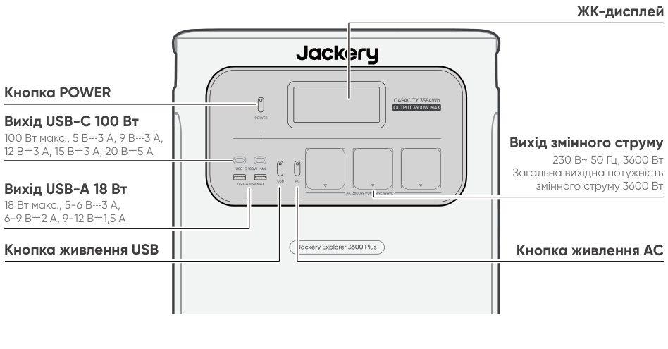
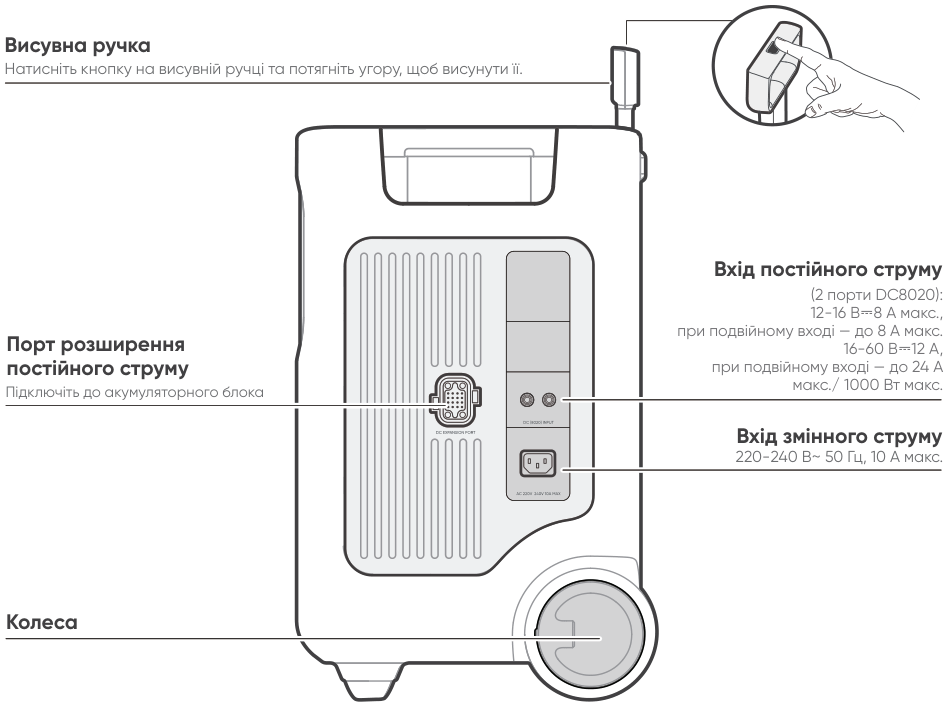
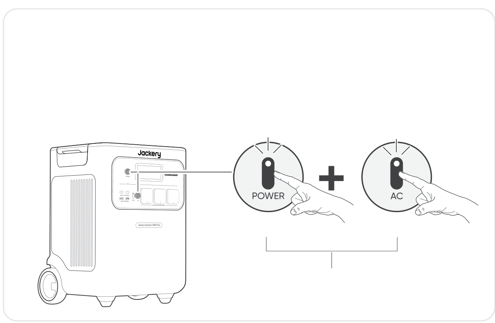
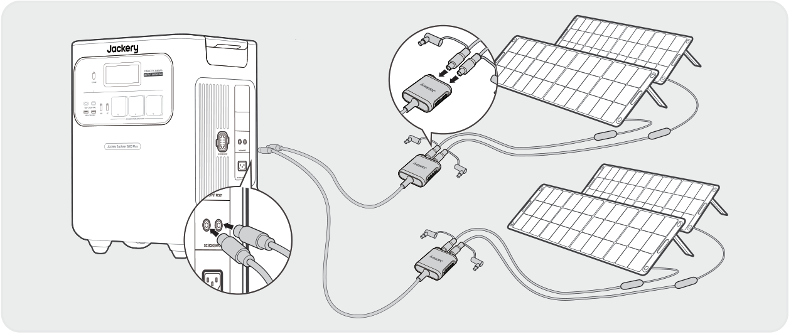

# ВАЖЛИВО

Вітаємо з новим Jackery Explorer 3600 Plus. Будь ласка, уважно прочитайте це керівництво перед використанням продукту, особливо відповідні застереження для забезпечення правильного використання. Зберігайте цей посібник у легкодоступному місці для частого звернення.

Відповідно до законів і нормативних актів, право остаточного тлумачення цього документа та всіх пов’язаних документів цього продукту належить Компанії.

Зверніть увагу, що у разі будь-яких оновлень, змін або припинення додаткових повідомлень не буде.

# ВАЖЛИВА ІНФОРМАЦІЯ З БЕЗПЕКИ

<table class="manual-callout-table manual-callout-table"><tbody><tr><td class="manual-callout-label">ПОПЕРЕДЖЕННЯ</td><td class="manual-callout-body">
ІНСТРУКЦІЇ ЩОДО РИЗИКУ ПОЖЕЖІ, УРАЖЕННЯ ЕЛЕКТРИЧНИМ СТРУМОМ АБО ТРАВМУВАННЯ ЛЮДЕЙ
</td></tr></tbody></table>

<strong>Завжди дотримуйтеся цих базових заходів безпеки під час використання цього продукту.</strong>

<ul><li>
Прочитайте всі інструкції перед використанням продукту.
</li><li>
Не дозволяйте дітям гратися з продуктом. Необхідний пильний нагляд за дітьми, коли продукт використовується поруч із ними.
</li><li>
Може виникнути ризик ураження електричним струмом при використанні аксесуарів, які не рекомендовані або не продаються професійними виробниками продукту.
</li><li>
Коли продукт не використовується, від’єднуйте вилку живлення від розетки продукту.
</li><li>
Не розбирайте продукт, оскільки це може призвести до непередбачуваних ризиків, таких як пожежа, вибух або ураження електричним струмом.
</li><li>
Не використовуйте продукт із пошкодженими шнурами, вилками або вихідними кабелями, оскільки це може спричинити ураження електричним струмом.
</li><li>
Щоб забезпечити належну циркуляцію повітря, тримайте вентиляційні отвори продукту відкритими. Місце використання продукту повинно мати достатній повітрообмін у прохолодному та сухому середовищі, щоб запобігти перегріванню. -Заряджання у вологих або погано провітрюваних приміщеннях може спричинити загрозу безпеці. -Вода може спричинити коротке замикання або пошкодження зарядного пристрою, що призводить до ризиків для безпеки.  
</li><li>
Не піддавайте продукт впливу вогню, високих температур, прямого сонячного світла або середовищ із високою температурою, таких як салон припаркованого автомобіля. Такий вплив може призвести до пожежі або вибуху.
</li></ul>

## ІНСТРУКЦІЇ З ОБСЛУГОВУВАННЯ КОРИСТУВАЧЕМ

Протягом життєвого циклу продуктів накопичення енергії очікується певний ступінь зниження ємності та енергетичних характеристик. Зі збільшенням кількості циклів заряджання та розряджання і тривалості зберігання ця деградація поступово посилюється, що є нормальним явищем і відповідає природному старінню акумуляторних елементів.

# ЗНАЧЕННЯ СИМВОЛІВ

<figure aria-label="ЗНАЧЕННЯ СИМВОЛІВ" class="hb-symbol-signal-composition" data-component-id="HB-TABLE-SYMBOL-SIGNAL"><table class="hb-symbol-signal-table"><colgroup><col class="hb-symbol-signal-col-label"/><col class="hb-symbol-signal-col-meaning"/></colgroup><thead><tr><th class="hb-symbol-signal-label-heading" scope="col">Символ</th><th class="hb-symbol-signal-meaning-heading" scope="col">Значення</th></tr></thead><tbody><tr><td class="hb-symbol-signal-label-cell">⚠ПОПЕРЕДЖЕННЯ</td><td class="hb-symbol-signal-meaning-cell">Небезпечні практики, які можуть призвести до серйозних травм, смерті та/або майнової шкоди.</td></tr><tr><td class="hb-symbol-signal-label-cell">⚠УВАГА</td><td class="hb-symbol-signal-meaning-cell">Небезпечні дії, які можуть призвести до травм та/або майнової шкоди.</td></tr><tr><td class="hb-symbol-signal-label-cell">⚠ПРИМІТКА</td><td class="hb-symbol-signal-meaning-cell">Небезпечні дії, які можуть призвести до пошкодження обладнання, втрати даних, погіршення продуктивності або непередбачуваних результатів.</td></tr><tr><td class="hb-symbol-signal-label-cell">⚠ПОРАДА</td><td class="hb-symbol-signal-meaning-cell">Доповнює важливу інформацію або операційні підказки в тексті.</td></tr></tbody></table></figure>

<figure aria-label="ЗНАЧЕННЯ СИМВОЛІВ" class="hb-symbol-pair-composition" data-component-id="HB-TABLE-SYMBOL-ICON">

<table class="hb-symbol-panel-table"><colgroup><col class="hb-symbol-col-icon"/><col class="hb-symbol-col-meaning"/></colgroup><thead><tr><th class="hb-symbol-icon-heading" scope="col">Символ</th><th class="hb-symbol-meaning-heading" scope="col">Значення</th></tr></thead><tbody><tr><td class="hb-symbol-icon"></td><td class="hb-symbol-meaning">Попереджувальні та застережні символи. Обов’язково прочитайте, щоб попередити користувачів про потенційні небезпеки або ризики.</td></tr><tr><td class="hb-symbol-icon"></td><td class="hb-symbol-meaning">Перед використанням прочитайте посібник користувача.</td></tr><tr><td class="hb-symbol-icon"></td><td class="hb-symbol-meaning">Не розбирайте продукт.</td></tr><tr><td class="hb-symbol-icon"></td><td class="hb-symbol-meaning">Тримайте продукт подалі від вогню.</td></tr><tr><td class="hb-symbol-icon"></td><td class="hb-symbol-meaning">Тримайте подалі від дітей.</td></tr><tr><td class="hb-symbol-icon"></td><td class="hb-symbol-meaning">Цей символ вказує на те, що всередині продукту знаходиться літій-іонний (Li-ion) акумулятор, який слід правильно утилізувати або переробити.</td></tr></tbody></table>

<table class="hb-symbol-panel-table"><colgroup><col class="hb-symbol-col-icon"/><col class="hb-symbol-col-meaning"/></colgroup><thead><tr><th class="hb-symbol-icon-heading" scope="col">Символ</th><th class="hb-symbol-meaning-heading" scope="col">Значення</th></tr></thead><tbody><tr><td class="hb-symbol-icon"></td><td class="hb-symbol-meaning">Батареї та акумулятори не можна утилізувати разом із побутовими відходами. Як споживач, ви зобов'язані за законом утилізувати всі батареї та акумулятори у спеціально відведених пунктах збору, незалежно від того, чи містять вони небезпечні речовини. Будь ласка, повертайте використані батарейки та акумулятори до місцевих пунктів збору, центрів переробки або до продавця, у якого їх було придбано. Правильна утилізація забезпечує екологічно безпечну переробку та запобігає потенційній шкоді для здоров’я людей і довкілля.</td></tr><tr><td class="hb-symbol-icon"></td><td class="hb-symbol-meaning">Цей символ вказує, що продукт не можна утилізувати разом із побутовими відходами, і його слід передати до спеціалізованого пункту збору для переробки. Правильна утилізація та переробка допомагають захистити довкілля. Для отримання додаткової інформації щодо утилізації та переробки цього продукту зверніться до місцевої громади, служби утилізації або дилера.</td></tr></tbody></table>

</figure>

# КОМПЛЕКТАЦІЯ

<figure aria-label="КОМПЛЕКТАЦІЯ" class="hb-inbox-composition" data-card-count="3" data-component-id="HB-SPECIAL-INBOX" data-inbox-variant="three-card-responsive"><ol class="hb-inbox-grid"><li class="hb-inbox-card" data-item-number="1">

Jackery Explorer 3600 Plus

</li><li class="hb-inbox-card" data-item-number="2">

Кабель заряджання від змінного струму

</li><li class="hb-inbox-card" data-item-number="3">

Керівництво користувача

</li></ol>

ПОРАДА

Автомобільний зарядний кабель не входить до комплекту, але його можна придбати окремо на нашому вебсайті. Для отримання допомоги, будь ласка, звертайтеся до служби підтримки Jackery.

</figure>

# ОГЛЯД ПРОДУКТУ

## ВИГЛЯД СПЕРЕДУ

<figure class="hb-reference-figure" data-component-id="HB-SPECIAL-REFERENCE-FIGURE" data-reference-id="overview-front" data-source-fragment-sha256="9859558195e2bc46038f74bbe2cd5ecaa8d8003c6fe0f1b5e6da2fe7e7b024c6">

</figure>

## ВИГЛЯД СПРАВА

<figure class="hb-reference-figure" data-component-id="HB-SPECIAL-REFERENCE-FIGURE" data-reference-id="overview-right" data-source-fragment-sha256="fd6bb6e8e6524fecf7762be40cccc124bbde2e78e89a0bb702e4dfc384e2ada2">

</figure>

# РК-ДИСПЛЕЙ

<figure class="hb-reference-figure" data-component-id="HB-SPECIAL-REFERENCE-FIGURE" data-reference-id="lcd-map" data-source-fragment-sha256="ecf6809c448137be7da107507cfbecda837b1a0e0a03916216ed07c1ea16869a">

</figure>

<figure aria-label="РК-ДИСПЛЕЙ" class="hb-lcd-table-composition" data-component-id="HB-TABLE-LCD-ICON" tabindex="0"><table class="hb-lcd-icon-table"><colgroup><col class="hb-lcd-col-number"/><col class="hb-lcd-col-icon"/><col class="hb-lcd-col-name"/><col class="hb-lcd-col-description"/></colgroup><tbody><tr><td class="hb-lcd-number">1</td><td class="hb-lcd-icon"></td><td class="hb-lcd-name">Wi-Fi</td><td class="hb-lcd-description">
Увімкнення: Wi-Fi підключено. Блимає: Готово до підключення до Wi-Fi. Вимкнення: Wi-Fi відключено.
</td></tr><tr><td class="hb-lcd-number">2</td><td class="hb-lcd-icon"></td><td class="hb-lcd-name">Bluetooth</td><td class="hb-lcd-description">
Увімкнення: Bluetooth підключено. Блимає: Готово до підключення до Bluetooth. Вимкнення: Bluetooth відключено.
</td></tr><tr><td class="hb-lcd-number">3</td><td class="hb-lcd-icon"></td><td class="hb-lcd-name">Тихий режим заряджання</td><td class="hb-lcd-description">
Увімкнення: Шум під час заряджання значно зменшується, при цьому потужність заряджання знижується, а швидкість заряджання сповільнюється. Вимкнення: Тихий режим заряджання вимкнено. Увімкніть/вимкніть цю функцію в Jackery App.
</td></tr><tr><td class="hb-lcd-number" rowspan="2">4</td><td class="hb-lcd-icon"></td><td class="hb-lcd-name">Режим енергозбереження акумулятора</td><td class="hb-lcd-description">
Увімкнення: Обмежує максимальну доступну ємність акумулятора для продовження терміну його служби. Вимкнення: Режим енергозбереження акумулятора вимкнено. Увімкніть/вимкніть цю функцію в Jackery App. Ця функція недоступна, коли пристрій підключено до акумуляторного(-их) блоку(-ів).
</td></tr><tr><td class="hb-lcd-icon"></td><td class="hb-lcd-name">Режим самозабезпечення</td><td class="hb-lcd-description">
Максимізує використання сонячної енергії та зменшує залежність від електромережі, надаючи пріоритет накопиченій сонячній енергії, що знижує витрати на електроенергію (будь ласка, увімкніть/вимкніть цю функцію в застосунку). Електростанція повинна бути підключена одночасно і до сонячних панелей, і до електромережі, при цьому потужність навантаження обмежена потужністю байпаса.
</td></tr><tr><td class="hb-lcd-number">5</td><td class="hb-lcd-icon"></td><td class="hb-lcd-name">План заряджання</td><td class="hb-lcd-description">
Налаштовує час заряджання Jackery Explorer 3600 Plus. Підходить для ситуацій з коливаннями цін на електроенергію, дозволяє планувати заряджання з урахуванням пікових і непікових годин, що знижує витрати на електроенергію (будь ласка, налаштуйте в застосунку Jackery).
</td></tr><tr><td class="hb-lcd-number">6</td><td class="hb-lcd-icon"></td><td class="hb-lcd-name">Індикатор живлення змінного струму</td><td class="hb-lcd-description">
Вихід змінного струму (чиста синусоїда) увімкнено.
</td></tr><tr><td class="hb-lcd-number">7</td><td class="hb-lcd-icon"></td><td class="hb-lcd-name">Вихідна напруга та частота</td><td class="hb-lcd-description">
Відображає вихідну напругу та частоту, коли вихід змінного струму увімкнено.
</td></tr><tr><td class="hb-lcd-number">8</td><td class="hb-lcd-icon"></td><td class="hb-lcd-name">Вхідна потужність</td><td class="hb-lcd-description">
Відображає вхідну потужність у ватах.
</td></tr><tr><td class="hb-lcd-number">9</td><td class="hb-lcd-icon"></td><td class="hb-lcd-name">Час, що залишився до повного заряджання</td><td class="hb-lcd-description">
Відображає залишковий час заряджання.
</td></tr><tr><td class="hb-lcd-number">10</td><td class="hb-lcd-icon"></td><td class="hb-lcd-name">Індикатор заряджання від мережі змінного струму</td><td class="hb-lcd-description">
Пристрій заряджається через вхід змінного струму від електромережі.
</td></tr><tr><td class="hb-lcd-number">11</td><td class="hb-lcd-icon"></td><td class="hb-lcd-name">Індикатор заряджання від автомобіля</td><td class="hb-lcd-description">
Пристрій заряджається через вхід постійного струму (DC8020) із використанням 12 В постійного струму (автомобільне заряджання).
</td></tr><tr><td class="hb-lcd-number">12</td><td class="hb-lcd-icon"></td><td class="hb-lcd-name">Індикатор заряджання від сонячної панелі</td><td class="hb-lcd-description">
Пристрій заряджається через вхід постійного струму (DC8020) із використанням сонячної(-их) панелі(-ей).
</td></tr><tr><td class="hb-lcd-number">13</td><td class="hb-lcd-icon"></td><td class="hb-lcd-name">Індикатор заряду акумулятора</td><td class="hb-lcd-description">
Коли пристрій заряджається, помаранчеве коло навколо відсотка заряду акумулятора почергово засвічуватиметься. Під час заряджання інших пристроїв помаранчеве коло світитиметься постійно.
</td></tr><tr><td class="hb-lcd-number">14</td><td class="hb-lcd-icon"></td><td class="hb-lcd-name">Індикатор низького заряду батареї</td><td class="hb-lcd-description">
Увімкнення: Рівень заряду батареї нижче 20%. Блимає: Рівень заряду батареї нижче 5%. Вимкнення: Рівень заряду батареї не нижче 20% або пристрій заряджається.
</td></tr><tr><td class="hb-lcd-number">15</td><td class="hb-lcd-icon"></td><td class="hb-lcd-name">Залишковий відсоток заряду батареї</td><td class="hb-lcd-description">
Відображає відсоток заряду акумулятора, що залишився.
</td></tr><tr><td class="hb-lcd-number">16</td><td class="hb-lcd-icon"></td><td class="hb-lcd-name">Індикатор батарейного блока та кількість підключених батарейних блоків</td><td class="hb-lcd-description">
Відображає кількість підключених акумуляторних блоків, якщо такі є.
</td></tr><tr><td class="hb-lcd-number">17</td><td class="hb-lcd-icon"></td><td class="hb-lcd-name">Код помилки</td><td class="hb-lcd-description">
Сталася помилка продукту. Будь ласка, зверніться до розділу «Усунення несправностей» для отримання детальної інформації.
</td></tr><tr><td class="hb-lcd-number" rowspan="2">18</td><td class="hb-lcd-icon"></td><td class="hb-lcd-name">Індикатор високої температури</td><td class="hb-lcd-description">
Активовано захист від високої температури. Продукт може припинити роботу, доки його температура не повернеться до нормального робочого діапазону.
</td></tr><tr><td class="hb-lcd-icon"></td><td class="hb-lcd-name">Індикатор низької температури</td><td class="hb-lcd-description">
Активовано захист від низької температури. Продукт може припинити роботу, доки його температура не повернеться до нормального робочого діапазону.
</td></tr><tr><td class="hb-lcd-number">19</td><td class="hb-lcd-icon"></td><td class="hb-lcd-name">РЕЖИМ ЕНЕРГОЗБЕРЕЖЕННЯ</td><td class="hb-lcd-description">
Коли вихід змінного струму або USB увімкнено натисканням кнопки живлення змінного струму або USB: Увімкнення: Режим енергозбереження увімкнено. Вимкнення: Режим енергозбереження вимкнено.
</td></tr><tr><td class="hb-lcd-number">20</td><td class="hb-lcd-icon"></td><td class="hb-lcd-name">Вихідна потужність</td><td class="hb-lcd-description">
Відображає вихідну потужність у ватах.
</td></tr><tr><td class="hb-lcd-number">21</td><td class="hb-lcd-icon"></td><td class="hb-lcd-name">Час, що залишився до розряджання</td><td class="hb-lcd-description">
Відображає залишковий час розряджання.
</td></tr></tbody></table></figure>

# ОПЕРАЦІЇ

## УВІМКНЕННЯ/ВИМКНЕННЯ

<figure class="hb-reference-figure hb-base-art-live-copy" data-component-id="HB-SPECIAL-REFERENCE-FIGURE" data-reference-id="operation-main-power" data-source-fragment-sha256="c5402ba20874cadc10a6bb5d1259ba4f3910c0679357ee0331c6dba8dc4872f8" data-web-base-art-ref="operation-main-power" data-web-presentation-mode="base-art-live-copy">

Увімкнено Натисніть один разВимкнено Натисніть і утримуйте протягом 3 сСтандартний час очікування: 2 години Пристрій автоматично вимкнеться після 2 годин бездіяльності без заряджання або розряджання. * Час очікування можна налаштувати в застосунку Jackery.Коли увімкнено режим енергозбереження, продукт автоматично вимкнеться через 12 годин, якщо кнопку живлення змінного струму або USB увімкнено, але продукт не заряджається і не розряджається.

</figure>

## ВИХІД USB УВІМК./ВИМК.

<figure class="hb-operation-figure hb-operation-layout-status-right hb-base-art-live-copy" data-component-id="HB-SPECIAL-OPERATION" data-operation-id="dc-usb-output" data-source-fragment-sha256="b10346cafbb15ac81a7dbb655d2732e579aa86dc77fa9006dea8c60ada052d2d" data-web-base-art-ref="operation/dc_usb_output" data-web-presentation-mode="base-art-live-copy" data-web-replace-key="operation.dc-usb-output">

<strong>Передумова:</strong> Продукт увімкнено.

<strong>Увімкнено</strong>

Натисніть один раз

<strong>Вимкнено</strong>

Натисніть один раз

</figure>

<table class="manual-callout-table manual-callout-table"><tbody><tr><td class="manual-callout-label">УВАГА</td><td class="manual-callout-body"><ul><li>
USB-C 100 Вт макс. — це високопотужний вихідний порт USB-PD Power Source 3 (PS3). Якщо підключений пристрій або аксесуар не відповідає вимогам безпеки, може виникнути ризик пожежі. Перед використанням цих портів переконайтеся, що підключений пристрій або аксесуар має захист від пожежі.
</li><li>
Підключайте Jackery Explorer 3600 Plus лише до пристроїв або аксесуарів, що відповідають пунктам 6.3, 6.4 та 6.5 стандарту IEC/EN/UL 62368-1 (або іншим еквівалентним стандартам).
</li><li>
Щоб отримати максимальну вихідну потужність, використовуйте офіційний кабель Jackery USB-C – USB-C 5 А (20 В DC/5 А, 100 Вт).
</li></ul></td></tr></tbody></table>

## ВИХІД ЗМІННОГО СТРУМУ УВІМК./ВИМК.

<figure class="hb-operation-figure hb-operation-layout-status-right hb-base-art-live-copy" data-component-id="HB-SPECIAL-OPERATION" data-operation-id="ac-output" data-source-fragment-sha256="213f53af653989455177a79c848907a1623e11b05b693b506b706f62722bad64" data-web-base-art-ref="operation/ac_output" data-web-presentation-mode="base-art-live-copy" data-web-replace-key="operation.ac-output">

<strong>Передумова:</strong> Продукт увімкнено.

<strong>Увімкнено</strong>

Натисніть один раз

<strong>Вимкнено</strong>

Натисніть один раз

</figure>

## РЕЖИМ ЕНЕРГОЗБЕРЕЖЕННЯ

<figure class="hb-reference-figure hb-base-art-live-copy" data-component-id="HB-SPECIAL-REFERENCE-FIGURE" data-reference-id="operation-energy-saving" data-source-fragment-sha256="6c47bf13bb575e5d6a049cf4862c025a304a1e31a47343a610da8b2fb3a83da3" data-web-base-art-ref="operation-energy-saving" data-web-presentation-mode="base-art-live-copy">

Щоб запобігти зайвому споживанню заряду через забуте вимкнення виходу, за замовчуванням увімкнено режим енергозбереження. Якщо протягом 12 годин не підключено жодного пристрою або споживана потужність підключеного пристрою нижча за певний поріг (25 Вт на виході AC або 2 Вт на виході USB), продукт автоматично вимкне виходи. Щоб вимкнути режим енергозбереження, натисніть і утримуйте кнопки AC та POWER більше 3 секунд. Продукт не буде автоматично вимикати вихід змінного або постійного струму.Головна кнопка живленняКнопка живлення ACУвімкнення/вимкнення Натисніть і утримуйте протягом 3 с

</figure>

<table class="manual-callout-table manual-callout-table"><tbody><tr><td class="manual-callout-label">ПРИМІТКА</td><td class="manual-callout-body">
Режим енергозбереження відновлює попередній стан після увімкнення живлення. Для зміни режиму потрібне ручне перемикання.
</td></tr></tbody></table>

## РК-ЕКРАН

<figure aria-label="РК-ЕКРАН" class="hb-lcd-mode-composition" data-component-id="HB-TABLE-LCD-MODE">

<table class="hb-lcd-mode-table"><colgroup><col class="hb-lcd-mode-col-state"/><col class="hb-lcd-mode-col-action"/><col class="hb-lcd-mode-col-copy"/></colgroup><tbody><tr><td class="hb-lcd-mode-state" rowspan="3">Короткочасне увімкнення</td><td class="hb-lcd-mode-action">Увімкнення</td><td class="hb-lcd-mode-copy">Натисніть кнопку POWER або коли пристрій заряджається.</td></tr><tr><td class="hb-lcd-mode-action">Вимкнення</td><td class="hb-lcd-mode-copy">Натисніть кнопку POWER.</td></tr><tr><td class="hb-lcd-mode-action">Авто-вимкнення</td><td class="hb-lcd-mode-copy">ЖК-екран автоматично вимикається та переходить у сплячий режим після 2 хвилин бездіяльності.</td></tr><tr><td class="hb-lcd-mode-state" rowspan="3">Постійно увімкнено (під час заряджання або розряджання)</td><td class="hb-lcd-mode-action">Увімкнення</td><td class="hb-lcd-mode-copy">Двічі натисніть кнопку POWER, коли продукт увімкнено.</td></tr><tr><td class="hb-lcd-mode-action">Вимкнення</td><td class="hb-lcd-mode-copy">Натисніть кнопку POWER.</td></tr><tr><td class="hb-lcd-mode-action">Авто-вимкнення</td><td class="hb-lcd-mode-copy">ЖК-екран автоматично вимикається після 2 годин бездіяльності.</td></tr></tbody></table>
</figure>

Ви також можете встановити режим відображення екрана в Jackery App.

## КОМБІНАЦІЇ КНОПОК

<figure aria-label="Кнопки / Робота / Функція" class="hb-key-combination-composition" data-component-id="HB-TABLE-KEY-COMBINATIONS" tabindex="0"><table class="hb-key-combination-table"><colgroup><col class="hb-key-col-buttons"/><col class="hb-key-col-operation"/><col class="hb-key-col-function"/></colgroup><thead><tr><th class="hb-key-buttons" scope="col">Кнопки</th><th class="hb-key-operation" scope="col">Робота</th><th class="hb-key-function" scope="col">Функція</th></tr></thead><tbody><tr><td class="hb-key-buttons">Кнопка POWER + Кнопка живлення USB</td><td class="hb-key-operation">Натисніть і утримуйте обидві 3 с</td><td class="hb-key-function">Скидання Wi-Fi та Bluetooth</td></tr><tr><td class="hb-key-buttons">Кнопка POWER + Кнопка живлення AC</td><td class="hb-key-operation">Натисніть і утримуйте обидві 3 с</td><td class="hb-key-function">Увімкнення/вимкнення режиму енергозбереження</td></tr><tr><td class="hb-key-buttons">Кнопка живлення USB + Кнопка живлення AC</td><td class="hb-key-operation">Натисніть і утримуйте обидві 1 с</td><td class="hb-key-function">Увімкнення/вимкнення Wi-Fi та Bluetooth</td></tr></tbody></table></figure>

# ДЖЕРЕЛО БЕЗПЕРЕБІЙНОГО ЖИВЛЕННЯ (ДБЖ)

Підключіть продукт до настінної розетки за допомогою мережевого кабелю для заряджання, потім натисніть кнопку живлення AC, щоб одночасно живити ваші прилади.

<figure class="hb-reference-figure hb-base-art-live-copy" data-component-id="HB-SPECIAL-REFERENCE-FIGURE" data-reference-id="ups" data-source-fragment-sha256="e5675d9b14215085fdb4f119312022583c66d7611e6e1bd35fe083d9b6b340fa" data-web-base-art-ref="ups" data-web-presentation-mode="base-art-live-copy">

Джерело безперебійного живлення (UPS) — це тип системи безперервного живлення, яка автоматично подає резервне електроживлення на навантаження у разі зникнення мережевого живлення. У разі раптового зникнення електромережі, Explorer 3600 Plus автоматично перемкнеться на накопичену енергію протягом 10 мс, щоб ваші прилади продовжували працювати.

</figure>

У режимі UPS пікова вихідна потужність пристрою досягає 10 A до відключення електроенергії. Оскільки в режимі обходу (Bypass Mode) увімкнено одночасне заряджання/розряджання, фактична вихідна потужність у цьому режимі нижча за номінальну вихідну потужність, але під час відключень електроенергії вона повертається до номінальної вихідної потужності.

<table class="manual-callout-table manual-callout-table"><tbody><tr><td class="manual-callout-label">УВАГА</td><td class="manual-callout-body"><ul><li>
Цей продукт не підтримує перемикання за 0 мс. Не підключайте його до обладнання, яке потребує джерела живлення з перемиканням 0 мс, наприклад серверів даних або робочих станцій.
</li><li>
Перед використанням кілька разів перевірте сумісність із вашим пристроєм.
</li><li>
Не підключайте навантаження, що перевищують максимальну вихідну потужність продукту. Інакше спрацює захист від перевантаження.
</li></ul></td></tr></tbody></table>

# ПІДКЛЮЧЕННЯ

<h2 class="hb-subbar" id="підключіть-до-акумуляторного-блока-блоків-продається-окремо">ПІДКЛЮЧІТЬ ДО АКУМУЛЯТОРНОГО БЛОКА (БЛОКІВ) ПРОДАЄТЬСЯ ОКРЕМО</h2>

Цей продукт може підтримувати до 5 акумуляторних блоків для задоволення потреби у великій ємності живлення. Детальніше про використання дивіться у посібнику користувача Jackery Battery Pack 3600.

<figure class="hb-reference-figure hb-base-art-live-copy" data-component-id="HB-SPECIAL-REFERENCE-FIGURE" data-reference-id="battery" data-source-fragment-sha256="9eb3693d55cf1278405a9a142fe59fcb8709f598c8829d2a2212627b119a0cbe" data-web-base-art-ref="battery" data-web-presentation-mode="base-art-live-copy">

≥ 200 mm≥ 200 mm

</figure>

<table class="manual-callout-table manual-callout-table"><tbody><tr><td class="manual-callout-label">УВАГА</td><td class="manual-callout-body"><ul><li>
Переконайтеся, що всі пристрої вимкнено, перш ніж під’єднувати Explorer 3600 Plus до Jackery Battery Pack 3600.
</li><li>
Щоб забезпечити належну роботу продукту, переконайтеся, що повітрозабірні та витяжні отвори з обох боків не заблоковані. Залишайте щонайменше 200 мм простору між отворами та будь-якими предметами для належного відведення тепла.
</li></ul></td></tr></tbody></table>

<figure class="hb-reference-figure hb-base-art-live-copy" data-component-id="HB-SPECIAL-REFERENCE-FIGURE" data-reference-id="battery-accessories" data-source-fragment-sha256="2a38c8486b1b8cf0bd168156fb57c1c45b832a60b7cfd43ef1cd0c8c0a283b58" data-web-base-art-ref="battery-accessories" data-web-presentation-mode="base-art-live-copy">

Акумуляторний блок Jackery 3600Кабель розширенняКерівництво користувачаПродається окремо

</figure>

# ЗАРЯДЖАННЯ

<strong>Зелена енергія передусім:</strong> Ми виступаємо за використання зеленої енергії передусім. Цей продукт підтримує одночасно два режими заряджання: заряджання від сонця та заряджання від мережі змінного струму. Коли заряджання від мережі та заряджання від сонця увімкнено одночасно, продукт надаватиме пріоритет заряджанню від сонця, а обидва методи використовуватимуться для заряджання батареї з максимально допустимою потужністю.

Повністю зарядіть продукт перед першим використанням.

<table class="manual-callout-table manual-callout-table"><tbody><tr><td class="manual-callout-label">ПРИМІТКА</td><td class="manual-callout-body"><ul><li>
Рекомендована температура заряджання продукту становить від -20°C до 45°C, а температура розряджання – від -20°C до 45°C. Експлуатація продукту за межами цього діапазону температур може обмежити його здатність до заряджання та розряджання або навіть унеможливити заряджання чи розряджання.
</li><li>
Потужність заряджання та ємність акумулятора продукту можуть змінюватися через коливання температури.
</li></ul></td></tr></tbody></table>

## ЗАРЯДЖАННЯ ВІД МЕРЕЖІ ЗМІННОГО СТРУМУ

<figure class="hb-reference-figure hb-base-art-live-copy" data-component-id="HB-SPECIAL-REFERENCE-FIGURE" data-reference-id="charging-ac" data-source-fragment-sha256="3820591a900c872c402010d6dfe4beb751665fe33e8b92f3bf1529306e051ff5" data-web-base-art-ref="charging-ac" data-web-presentation-mode="base-art-live-copy">

Підключіть кабель заряджання змінного струму до вхідного порту змінного струму продукту та до розетки.

</figure>

<table class="manual-callout-table manual-callout-table"><tbody><tr><td class="manual-callout-label">УВАГА</td><td class="manual-callout-body">
Переконайтеся, що кабель заряджання змінного струму повністю та надійно підключений до вхідного порту змінного струму. Неповне підключення може спричинити нестабільний струм, перегрів, поганий контакт або несправність пристрою.
</td></tr></tbody></table>

<h2 class="hb-subbar" id="нестабільний-струм-перегрів-поганий-контакт-або-несправність-пристрою-заряджання-від-сонячних-панелей-продається-окремо">нестабільний струм, перегрів, поганий контакт або несправність пристрою. ЗАРЯДЖАННЯ ВІД СОНЯЧНИХ ПАНЕЛЕЙ ПРОДАЄТЬСЯ ОКРЕМО</h2>

ЗАРЯДЖАННЯ ВІД СОНЯЧНИХ ПАНЕЛЕЙ ПРОДАЄТЬСЯ ОКРЕМО Jackery Explorer 3600 Plus має два вхідні порти DC8020 і сумісний із сонячними панелями Jackery. Якщо потрібно підключити дві сонячні панелі до одного вхідного порту DC8020 одночасно, зверніться до рисунка нижче для заряджання через з’єднувач сонячної панелі (продається окремо, не входить до стандартної комплектації).

<figure class="hb-reference-figure hb-base-art-live-copy" data-component-id="HB-SPECIAL-REFERENCE-FIGURE" data-reference-id="charging-solar" data-source-fragment-sha256="b19d8622a4150edbc36830bc842910b6f17d60391198e798de99655bb462bf8b" data-web-base-art-ref="charging-solar" data-web-presentation-mode="base-art-live-copy">

SolarSaga 200 × 4

</figure>

<table class="manual-callout-table manual-callout-table"><tbody><tr><td class="manual-callout-label">УВАГА</td><td class="manual-callout-body">
Один вхідний порт DC8020 може бути підключений максимум до двох сонячних панелей.
</td></tr></tbody></table>

<table class="manual-callout-table manual-callout-table"><tbody><tr><td class="manual-callout-label">УВАГА</td><td class="manual-callout-body"><ul><li>
Переконайтеся, що вхідна напруга для обох вхідних портів постійного струму однакова. Недотримання цієї вимоги може пошкодити продукт. Наприклад:
</li><li>
Рекомендується використовувати однакову модель сонячних панелей Jackery та однакову кількість панелей при підключенні до обох вхідних портів DC8020.
</li><li>
Не заряджайте продукт одночасно за допомогою автомобільного зарядного пристрою та сонячної панелі. Це може призвести до перегорання автомобільного запобіжника або збою заряджання.
</li></ul></td></tr></tbody></table>

Рекомендується використовувати сонячні панелі Jackery для заряджання продукту. Переконайтеся, що напруга холостого ходу (VOC) сонячної панелі знаходиться в межах діапазону вхідної напруги постійного струму (16 В-60 В) для Explorer 3600 Plus. Jackery не несе відповідальності за будь-які пошкодження або збитки, спричинені використанням сторонніх сонячних панелей.

<h2 class="hb-subbar" id="заряджання-від-автомобільного-зарядного-пристрою-продається-окремо">ЗАРЯДЖАННЯ ВІД АВТОМОБІЛЬНОГО ЗАРЯДНОГО ПРИСТРОЮ ПРОДАЄТЬСЯ ОКРЕМО</h2>

Цей продукт можна заряджати від автомобіального зарядного пристрою на 12 В. Переконайтеся, що автомобільний зарядний пристрій і розетка 12 В у автомобілі (прикурювач) мають надійне з’єднання.

<figure class="hb-reference-figure hb-base-art-live-copy" data-component-id="HB-SPECIAL-REFERENCE-FIGURE" data-reference-id="charging-car" data-source-fragment-sha256="a0ede466ff4e29a00ed1afd0c2bf9c805fa6a9526072d9717fcdf4883df3c5ea" data-web-base-art-ref="charging-car" data-web-presentation-mode="base-art-live-copy">

Автомобіль*Кабель автомобільного заряджання продається окремо.

</figure>

<table class="manual-callout-table manual-callout-table"><tbody><tr><td class="manual-callout-label">УВАГА</td><td class="manual-callout-body"><ul><li>
Запустіть двигун автомобіля перед заряджанням вашої портативної електростанції.
</li><li>
Якщо автомобіль рухається нерівною дорогою, заборонено використовувати автомобільний зарядний пристрій, оскільки це може призвести до неналежної роботи. Компанія не несе відповідальності за будь-які збитки, спричинені неналежною експлуатацією.
</li><li>
Заряджання від автомобіля застосовується лише для автомобілів із постійною напругою 12 В, а не 24 В. Будь ласка, не заряджайте цей продукт у транспортному засобі з напругою 24 В, щоб уникнути травм і втрати майна.
</li></ul></td></tr></tbody></table>

# Зберігання

Зберігайте продукт у сухому чистому місці з належною вентиляцією. Температура та вологість зберігання:
<ul class="hb-source-storage-copy" style="margin:0"><li class="hb-source-storage-item" style="margin:0">
1 місяць: від -20°C до 45°C (0-60%відносної вологості)
</li><li class="hb-source-storage-item" style="margin:0">
3 місяці: від 0°C до 45°C (0-60%відносної вологості)
</li><li class="hb-source-storage-item" style="margin:0">
12 місяці: від 0°C до 25°C (0-60%відносної вологості)
</li></ul>
Якщо цей продукт зберігається протягом тривалого часу (3 місяці — 6 місяців) із розрядженим акумулятором, він може втратити здатність до заряджання. Щоб запобігти цьому та підтримувати стан акумулятора, рекомендується перевіряти та підзаряджати продукт кожні три місяці, а також виконувати повний цикл заряджання та розряджання щонайменше один раз на 6–12 місяців.

# УСУНЕННЯ НЕСПРАВНОСТЕЙ

Якщо з’являється будь-який із наведених нижче кодів помилок, дотримуйтесь зазначених коригувальних дій для усунення проблеми. Якщо несправність зберігається, зверніться до служби підтримки Jackery.

<figure aria-label="Код помилки / Коригувальні заходи" class="hb-troubleshooting-composition" data-component-id="HB-TABLE-TROUBLESHOOTING" tabindex="0"><table class="hb-troubleshooting-table"><colgroup><col class="hb-troubleshooting-col-code"/><col class="hb-troubleshooting-col-measures"/></colgroup><thead><tr><th class="hb-troubleshooting-code" scope="col">Код помилки</th><th class="hb-troubleshooting-measures" scope="col">Коригувальні заходи</th></tr></thead><tbody><tr><td class="hb-troubleshooting-code">F0</td><td class="hb-troubleshooting-measures">Перезапустіть продукт.</td></tr><tr><td class="hb-troubleshooting-code">F1</td><td class="hb-troubleshooting-measures">Перезапустіть продукт.</td></tr><tr><td class="hb-troubleshooting-code">F2</td><td class="hb-troubleshooting-measures">Перезапустіть продукт.</td></tr><tr><td class="hb-troubleshooting-code">F3</td><td class="hb-troubleshooting-measures">Перезапустіть продукт.</td></tr><tr><td class="hb-troubleshooting-code">F4</td><td class="hb-troubleshooting-measures">Підключіть продукт до навантаження, щоб розрядити його акумулятор, доки несправність не зникне.</td></tr><tr><td class="hb-troubleshooting-code">F5</td><td class="hb-troubleshooting-measures">Заряджайте продукт від сонячних панелей або настінної розетки змінного струму, доки несправність не зникне.</td></tr><tr><td class="hb-troubleshooting-code">F6</td><td class="hb-troubleshooting-measures">1. Зачекайте, поки мережа нормалізується, перш ніж заряджати виріб через розетку змінного струму. 2. Перевірте, чи не заблоковано впуск повітря та витяжні отвори; забезпечте зазор 200 мм з обох боків продукту. 3. Розмістіть продукт у місці, яке не піддається прямому сонячному світлу або високим температурам навколишнього середовища. 4. Від'єднайте всі навантаження від виробу. Залиште продукт у стані спокою та зачекайте, поки несправність зникне. 5. Перезапустіть продукт.</td></tr><tr><td class="hb-troubleshooting-code">F7</td><td class="hb-troubleshooting-measures">1. Від'єднайте всі входи постійного струму від продукту. 2. Перевірте напругу холостого ходу (Voc) підключених сонячних панелей. Продукт дозволяє максимальну вхідну напругу постійного струму 60 В. 3. Перезапустіть продукт і залиште його в режимі очікування. Зачекайте, поки несправність не зникне.</td></tr><tr><td class="hb-troubleshooting-code">F8</td><td class="hb-troubleshooting-measures">Зверніться до служби підтримки Jackery.</td></tr><tr><td class="hb-troubleshooting-code">F9</td><td class="hb-troubleshooting-measures">Від'єднайте навантаження, підключене до USB-портів продукту. Зачекайте, поки несправність не зникне.</td></tr><tr><td class="hb-troubleshooting-code">FA</td><td class="hb-troubleshooting-measures">1. Вимкніть вихід змінного струму на обох пристроях. 2. Протягом 1 хвилини натисніть кнопку живлення AC на кожному пристрої ще раз.</td></tr><tr><td class="hb-troubleshooting-code">FC</td><td class="hb-troubleshooting-measures">1. Перезапустіть окремо батарейні блоки та Jackery Explorer 3600 Plus. 2. Якщо несправність не зникне, від'єднайте батарейний блок від Jackery Explorer 3600 Plus і підключіть їх знову.</td></tr></tbody></table></figure>

# Технічні характеристики

<h2 aria-level="2" role="heading">ЗАГАЛЬНА ІНФОРМАЦІЯ</h2><figure aria-label="ЗАГАЛЬНА ІНФОРМАЦІЯ" class="hb-spec-table-composition"><table class="manual-table manual-spec-table hb-spec-table"><colgroup><col class="hb-spec-col-label"/><col class="hb-spec-col-value"/></colgroup><tbody><tr><th class="manual-spec-label hb-spec-label" scope="row">Назва продукту</th><td class="manual-spec-value hb-spec-value">Jackery Explorer 3600 Plus</td></tr><tr><th class="manual-spec-label hb-spec-label" scope="row">Номер моделі</th><td class="manual-spec-value hb-spec-value">JE-3600A</td></tr><tr><th class="manual-spec-label hb-spec-label" scope="row">Ємність</th><td class="manual-spec-value hb-spec-value">80 А·год / 44,8 В DC (3584 Вт·год)</td></tr><tr><th class="manual-spec-label hb-spec-label" scope="row">Хімічний склад елементів</th><td class="manual-spec-value hb-spec-value">LiFePO₄</td></tr><tr><th class="manual-spec-label hb-spec-label" scope="row">Вага</th><td class="manual-spec-value hb-spec-value">Близько 35 кг</td></tr><tr><th class="manual-spec-label hb-spec-label" scope="row">Розміри</th><td class="manual-spec-value hb-spec-value">38,5×30,9×49,1 см</td></tr><tr><th class="manual-spec-label hb-spec-label" scope="row">Ресурс циклів</th><td class="manual-spec-value hb-spec-value">6000 циклів до збереження 70%+ ємності</td></tr><tr><th class="manual-spec-label hb-spec-label" scope="row">Код IEC</th><td class="manual-spec-value hb-spec-value">IFpR41/136[14S4P]M/-20+40/90</td></tr></tbody></table></figure><h2 aria-level="2" role="heading">ВХІДНІ ПОРТИ</h2><figure aria-label="ВХІДНІ ПОРТИ" class="hb-spec-table-composition"><table class="manual-table manual-spec-table hb-spec-table"><colgroup><col class="hb-spec-col-label"/><col class="hb-spec-col-value"/></colgroup><tbody><tr><th class="manual-spec-label hb-spec-label" scope="row">1 вхід змінного струму</th><td class="manual-spec-value hb-spec-value">Режим заряджання: 220–240 В~ 50 Гц, макс. 10 А</td></tr><tr><th class="manual-spec-label hb-spec-label" scope="row">1 вхід змінного струму</th><td class="manual-spec-value hb-spec-value">Режим байпасу①: 220-240 В~ 50 Гц, макс. 10 A</td></tr><tr><th class="manual-spec-label hb-spec-label" scope="row">2 порти DC8020</th><td class="manual-spec-value hb-spec-value">12-16 В⎓8 A макс., при подвійному вході — до 8A макс.</td></tr><tr><th class="manual-spec-label hb-spec-label" scope="row">2 порти DC8020</th><td class="manual-spec-value hb-spec-value">16-60 В⎓12 A, при подвійному вході — до 24 A макс./ 1000 Вт макс.</td></tr><tr><th class="manual-spec-label hb-spec-label" scope="row">1 × Порт розширення DC</th><td class="manual-spec-value hb-spec-value">36,4–50,4 В постійного струму, макс. 100 А</td></tr></tbody></table></figure><h2 aria-level="2" role="heading">ВИХІДНІ ПОРТИ</h2><figure aria-label="ВИХІДНІ ПОРТИ" class="hb-spec-table-composition"><table class="manual-table manual-spec-table hb-spec-table"><colgroup><col class="hb-spec-col-label"/><col class="hb-spec-col-value"/></colgroup><tbody><tr><th class="manual-spec-label hb-spec-label" scope="row">Вихід змінного струму × 3</th><td class="manual-spec-value hb-spec-value">230 В~ 50 Гц, 3600 Вт</td></tr><tr><th class="manual-spec-label hb-spec-label" scope="row">Загальний вихід змінного струму②</th><td class="manual-spec-value hb-spec-value">Номінальна потужність 3600 Вт, пікова потужність 7200 Вт</td></tr><tr><th class="manual-spec-label hb-spec-label" scope="row">Вихід змінного струму у байпасному режимі①</th><td class="manual-spec-value hb-spec-value">220-240 В~ 50 Гц, 10 A макс.</td></tr><tr><th class="manual-spec-label hb-spec-label" scope="row">2 × USB-C, вихід 100 Вт</th><td class="manual-spec-value hb-spec-value">100 Вт макс., 5 В⎓3 A, 9 В⎓3 A, 12 В⎓3 A, 15 В⎓3 A, 20 В⎓5 A</td></tr><tr><th class="manual-spec-label hb-spec-label" scope="row">2 × USB-A, вихід 18 Вт</th><td class="manual-spec-value hb-spec-value">18 Вт макс., 5-6 В⎓3 A, 6-9 В⎓2 A, 9-12 В⎓1,5 A</td></tr><tr><th class="manual-spec-label hb-spec-label" scope="row">1 × Порт розширення DC</th><td class="manual-spec-value hb-spec-value">36,4 В-50,4 В⎓60A макс.</td></tr></tbody></table></figure><h2 aria-level="2" role="heading">РОБОЧА ТЕМПЕРАТУРА НАВКОЛИШНЬОГО СЕРЕДОВИЩА</h2><figure aria-label="РОБОЧА ТЕМПЕРАТУРА НАВКОЛИШНЬОГО СЕРЕДОВИЩА" class="hb-spec-table-composition"><table class="manual-table manual-spec-table hb-spec-table"><colgroup><col class="hb-spec-col-label"/><col class="hb-spec-col-value"/></colgroup><tbody><tr><th class="manual-spec-label hb-spec-label" scope="row">Температура заряджання</th><td class="manual-spec-value hb-spec-value">від -20°C до 45°C</td></tr><tr><th class="manual-spec-label hb-spec-label" scope="row">Температура розряду</th><td class="manual-spec-value hb-spec-value">від -20°C до 45°C</td></tr></tbody></table></figure>

※ USB Type-C® і USB-C® є зареєстрованими торговельними марками USB Implementers Forum.

① Продукт може заряджати акумулятор від розетки змінного струму, одночасно подаючи живлення через вихідні порти змінного струму.

② Вказує, що два або більше вихідних портів змінного струму працюють разом.

# ГАРАНТІЯ

<figure aria-label="ГАРАНТІЯ" class="hb-warranty-intro-composition" data-component-id="HB-WARRANTY-LEAD">

<strong>Ми надаємо гарантію лише клієнтам, які придбали продукцію на офіційному вебсайті Jackery, на сторонніх платформах під брендом Jackery або в місцевих авторизованих дилерів.</strong>

*Гарантійний період і деталі можуть відрізнятися залежно від місцевих законів, нормативних актів і авторизованих дилерів.

</figure>

## Обмежена гарантія

<figure aria-label="Обмежена гарантія" class="hb-warranty-card" data-component-id="HB-WARRANTY-SECTION" data-warranty-card-index="1">
Jackery гарантує первинному кінцевому покупцеві, що продукт Jackery не матиме дефектів матеріалів і виготовлення за умов нормального споживчого використання протягом відповідного гарантійного періоду, визначеного в розділі «Гарантійний період» нижче, з урахуванням наведених нижче виключень. Ця гарантійна заява визначає повний і виключний обсяг гарантійних зобов’язань Jackery. Ми не беремо на себе і не уповноважуємо будь-яку особу брати на себе від нашого імені будь-які інші зобов’язання у зв’язку з продажем нашої продукції.
</figure>

## Гарантійний період

<figure aria-label="Гарантійний період" class="hb-warranty-period-card" data-component-id="HB-WARRANTY-YEARS">

3
<strong class="hb-warranty-years-unit">РОКИ</strong><strong class="hb-warranty-period-label">Стандартна гарантія</strong>

Стандартний гарантійний термін для Jackery Explorer 3600 Plus становить 36 місяців. У кожному випадку гарантійний період обчислюється з дати покупки первинним споживачем-покупцем. Для визначення дати початку гарантійного періоду потрібен товарний чек від першої покупки споживачем або інший обґрунтований документальний доказ.

2
<strong class="hb-warranty-years-unit">РОКИ</strong><strong class="hb-warranty-period-label">Розширена гарантія</strong>

Щоб активувати розширення гарантії, необхідно зареєструвати продукт онлайн або звернутися до нашої служби підтримки за адресою hello.eu@jackery.com для продовження стандартного гарантійного терміну.

</figure>

## Обмін

<figure aria-label="Обмін" class="hb-warranty-card" data-component-id="HB-WARRANTY-SECTION" data-warranty-card-index="2">
Jackery замінить (за рахунок Jackery) будь-який продукт Jackery, який не працює протягом відповідного гарантійного періоду через дефект матеріалів або виготовлення. Заміна отримує залишок гарантійного терміну оригінального продукту.
</figure>

## Обмеження для первинного споживача-покупця

<figure aria-label="Обмеження для первинного споживача-покупця" class="hb-warranty-card" data-component-id="HB-WARRANTY-SECTION" data-warranty-card-index="3">
Гарантія на продукт Jackery обмежується первинним споживачем-покупцем і не підлягає передачі будь-якому наступному власнику.
</figure>

## Виключення

<figure aria-label="Виключення" class="hb-warranty-card" data-component-id="HB-WARRANTY-SECTION" data-warranty-card-index="4">
Гарантія Jackery не поширюється на:
<ul><li>Неправильне використання, зловживання, модифікації, пошкодження внаслідок нещасного випадку або використання не за призначенням, відмінним від нормального споживчого використання, дозволеного чинною документацією Jackery.</li><li>Спроби ремонту будь-ким, окрім авторизованого сервісного центру.</li><li>Будь-який продукт, придбаний через онлайн-аукціон.</li><li>Гарантія Jackery не поширюється на акумуляторний елемент, якщо він не був повністю заряджений вами протягом семи днів після покупки продукту та щонайменше один раз кожні 6 місяців після цього.</li></ul></figure>

## Право тлумачення

<figure aria-label="Право тлумачення" class="hb-warranty-card" data-component-id="HB-WARRANTY-SECTION" data-warranty-card-index="5">
Jackery залишає за собою право остаточного тлумачення вищезазначеної політики післяпродажного обслуговування клієнтів.
</figure>

# НАЛАШТУВАННЯ ДОДАТКА

## 1. Завантажте додаток і увійдіть

<figure aria-label="НАЛАШТУВАННЯ ДОДАТКА" class="hb-app-download-composition" data-component-id="HB-SPECIAL-APP">

Знайдіть "Jackery" у Google Play або App Store, щоб встановити додаток. Після цього ви можете зареєструватися та увійти.

Або відскануйте QR-код нижче, щоб завантажити та встановити додаток.

</figure>

## 2. Додати пристрій

2.1 Натисніть кнопку + , щоб додати пристрій;

2.2 Натисніть кнопку <strong>POWER</strong> на пристрої, щоб увімкнути його. Іконки Wi-Fi та Bluetooth на пристрої блимають, вказуючи, що пристрій увійшов у режим налаштування мережі. Натисніть кнопку “<strong>Icon Flashed</strong>”, дозвольте застосунку підключатися до найближчих пристроїв та надайте доступ до Bluetooth.

<figure class="hb-app-add-device-composition hb-has-reference-captions" data-component-id="HB-SPECIAL-APP" data-reference-id="app-add-device" data-step-captions="live">

<figcaption class="hb-reference-caption-grid" data-caption-count="2" data-caption-layout="equal" style="--hb-caption-count:2;width:min(100%,44rem)">2.12.2</figcaption>
Кнопка POWERКнопка живлення USBКнопка AC
</figure>

<table class="manual-callout-table manual-callout-table"><tbody><tr><td class="manual-callout-label">ПРИМІТКА</td><td class="manual-callout-body">
Після ввімкнення пристрою, якщо протягом 2 годин його не підключено до застосунку, він автоматично вимкне Wi-Fi та Bluetooth. Тепер потрібно натиснути та утримувати кнопку живлення USB та кнопку живлення AC, щоб знову увімкнути Wi-Fi та Bluetooth.
</td></tr></tbody></table>

2.3 Після натискання на знайдену іконку пристрою додаток автоматично підключає пристрій через Bluetooth.

<table class="manual-callout-table manual-callout-table"><tbody><tr><td class="manual-callout-label">ПРИМІТКА</td><td class="manual-callout-body">
Якщо під час процесу прив’язки з’являється повідомлення «пристрій уже прив’язаний», можна скористатися такими двома способами підключення:
<ul><li>
Власник пристрою може поділитися цим пристроєм з іншими користувачами через додаток.
</li><li>
Одночасно натисніть і утримуйте кнопку POWER та кнопку живлення USB протягом 3 секунд, щоб
</li></ul></td></tr></tbody></table>

2.4 Після успішного підключення пристрою введіть пароль Wi-Fi і натисніть кнопку OK.

<table class="manual-callout-table manual-callout-table"><tbody><tr><td class="manual-callout-label">ПРИМІТКА</td><td class="manual-callout-body">
Будь ласка, оберіть мережу Wi-Fi у діапазоні 2,4 ГГц. Пристрій не підтримує мережу Wi-Fi у діапазоні 5 ГГц.
</td></tr></tbody></table>

2.5 Після успішного додавання пристрою в застосунку іконка Wi-Fi на пристрої буде постійно увімкнена.

<figure class="hb-reference-figure hb-has-reference-captions" data-component-id="HB-SPECIAL-REFERENCE-FIGURE" data-reference-id="app-result" data-source-fragment-sha256="db2b52ce3f3731b0aaf02dd26692f4439d85347fe5501305fb78a4509251d559">

<figcaption class="hb-reference-caption-grid" data-caption-count="3" data-caption-layout="equal" style="--hb-caption-count:3">2.32.42.5</figcaption></figure>

2.3 2.4 2.5 Наведені вище скріншоти призначені лише для довідки.

<table class="manual-callout-table manual-callout-table"><tbody><tr><td class="manual-callout-label">УВАГА</td><td class="manual-callout-body">
Додаток Jackery може одночасно підключатися через Bluetooth лише до однієї електростанції. Повернення до списку пристроїв автоматично відключає Bluetooth. Натисніть електростанцію у списку ще раз, щоб автоматично перепідключитися.
</td></tr></tbody></table>

## 3. Відв’язати пристрій

Натисніть значок Налаштування у верхньому правому куті головного інтерфейсу пристрою, щоб перейти на сторінку налаштувань, і натисніть кнопку Відв’язати внизу сторінки, щоб відв’язати пристрій.

## 4. ПРИМІТКИ

### 4.1 Увімкнення Wi-Fi та Bluetooth:

<ul><li>
Wi-Fi та Bluetooth автоматично вмикаються після ввімкнення пристрою, а значки Wi-Fi та Bluetooth на екрані загоряються.
</li><li>
Одночасно утримуйте кнопку живлення USB та кнопку живлення AC, доки іконки Wi-Fi та Bluetooth на екрані не засвітяться.
</li></ul>

### 4.2 Щоб вимкнути Wi-Fi та Bluetooth:

<ul><li>
Одночасно утримуйте кнопку живлення USB та кнопку живлення AC, доки іконки Wi-Fi та Bluetooth на екрані не згаснуть.
</li><li>
Wi-Fi та Bluetooth автоматично вимкнуться, якщо протягом 2 годин не буде підключено жодного пристрою.
</li></ul>

### 4.3 Щоб скинути Wi-Fi та Bluetooth：

Одночасно утримуйте кнопку POWER та кнопку живлення USB протягом 3 секунд, щоб скинути Wi-Fi та Bluetooth до заводських налаштувань і перезавантажити систему. Підключений обліковий запис застосунку буде відв'язано.

# EU Regulations

<figure class="hb-reference-figure" data-component-id="HB-SPECIAL-REFERENCE-FIGURE" data-reference-id="ce-mark" data-source-fragment-sha256="1df6a01729c713629a81c609bdc4e899e1708415fb18e7bd6de11adde3ac0c01">

</figure>

## RED Declaration of Conformity

Shenzhen Hello Tech Energy Co., Ltd. hereby declares that this: Jackery Explorer 3600 Plus with Bluetooth and Wi-Fi JE-3600A is in compliance with the essential requirements and other relevant provisions of the RED Directive 2014/53/EU,The full text of the EU declaration of conformity is available at the following internet address: https://de.jackery.com/pages/user-guides

<strong>MANUFACTURER: SHENZHEN HELLO TECH ENERGY CO., LTD.</strong>

Address: F2-3, Bldg. 7, Jiaanda Science and technology industrial park factory, the east side of Huafan Road, Tongsheng Community, Dalang Street, Longhua District, Shenzhen, Guangdong, China

sales@hello-tech.com +86 400 668 9293 www.hello-tech.com

<figure class="hb-reference-figure" data-component-id="HB-SPECIAL-REFERENCE-FIGURE" data-reference-id="contact-qr" data-source-fragment-sha256="f0060c555e50182eced2bb7ccc1fd97befd5804efd6676464f85bc2f37acc62f">

</figure>
