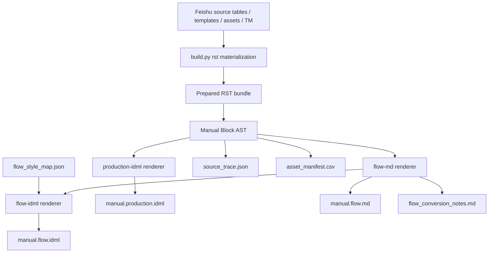

# IDML Dual Mode Implementation Plan

Run id: `20260707-095256`
Branch: `docs/idml-dual-mode-plan`
Base commit: `3c27e7c805a556504661105639729c6f04b3e92f`

## 1. Dual-mode architecture



Principles:

- One content source.
- Two render strategies.
- Production remains default.
- Flow output is an editable/design-template handoff, not a new source of truth.

## 2. Target output directories

Compatibility first:

```text
docs/_build/<model>/<region>/idml/manual_<modelslug>_<regionslug>.idml
```

must remain the default production output for `python build.py idml`.

New dual-mode layout:

```text
docs/_build/<model>/<region>/<lang>/idml/
  production/
    manual.production.idml
    source_trace.json
    asset_manifest.csv

  flow/
    manual.flow.md
    manual.flow.idml
    manual.flow.source_trace.json
    manual.flow.asset_manifest.csv
    flow_style_map.json
    flow_conversion_notes.md
```

For the first implementation PRs, keep the legacy production path as the compatibility artifact. The normalized `production/` folder can be added either as a copy/alias during `--idml-mode both` or as part of the later design handoff package. This avoids breaking existing users and golden-path tests.

## 3. CLI changes

Add to `tools/build_cli.py`:

```bash
--idml-mode production|flow|both
```

Default:

```text
production
```

Dispatch behavior in `tools/build_dispatch.py`:

- Always prepare the RST bundle first.
- Pass `--mode <args.idml_mode>` to `tools/export_idml.py`.
- Keep existing `--model`, `--region`, `--lang`, and `--data-root` passthrough.

Direct exporter behavior in `tools/export_idml.py`:

- Add `--mode production|flow|both`, default `production`.
- Optionally add `--idml-mode` as an alias.
- Keep `--check` as a validation-only command.

## 4. Production renderer compatibility

Production mode must be treated as the existing behavior.

Rules:

- Do not change default `python build.py idml` output.
- Do not change production story composition while adding flow mode.
- Do not regenerate production golden fixtures unless a production behavior change is explicitly approved.
- Keep current component registry and page composers intact.
- Keep direct-current glyph fallback and symbol-font handling unchanged.
- Keep current hard layout boundaries for safety, FCC/inbox, symbols, spec, LCD, and troubleshooting.

Implementation shape:

```text
export_idml.py
  if mode == "production":
      run_existing_export()
  elif mode == "flow":
      run_flow_export()
  elif mode == "both":
      run_existing_export()
      run_flow_export()
```

The existing `main()` is currently the production state machine. The first code PR should wrap it rather than rewrite it.

## 5. Flow-md renderer strategy

Add a new flow Markdown renderer, for example:

```text
tools/idml/flow_md.py
```

Inputs:

- `bundle_page_order(bundle_root)`
- `extract_page(page, tags)`
- `tools/idml/loaders.py` rows for spec, LCD, troubleshooting, and symbols
- model, region, language, data root, build metadata

Output:

```text
manual.flow.md
manual.flow.asset_manifest.csv
manual.flow.source_trace.json
flow_conversion_notes.md
```

Flow-md serialization rules:

| Block | Flow output |
| --- | --- |
| `h1` | `# Heading` |
| `h2` | `## Heading` |
| `h3` | `### Heading` |
| `body` | Paragraph |
| `list` | Simple bullet list |
| `table` | Markdown pipe table |
| `image` | Markdown image plus asset comment, or `[FIGURE: asset_id]` |
| `component: notice` | `::: note` / `::: caution` / `::: warning` |
| `component: warnbox` | `::: warning` with label/title/body |
| `component: safetywarning` | `::: warning` |
| `component: fcc` | `## FCC` plus ordinary paragraphs |
| `component: inbox` | Simple numbered list or simple table |
| `component: lcdmode` | Simple Markdown table |

Front matter:

```markdown
---
manual_id: JE1000F_US_EN
model: JE-1000F
region: US
language: en
build_commit: <commit-sha>
idml_mode: flow
---
```

Source refs:

```markdown
<!-- source_ref: page=safety_01 source=docs/_build/.../page/safety_01.rst block=3 -->
```

For data-table rows:

```markdown
<!-- source_ref: table=Spec_Master document_key=JE-1000F_US row_key=capacity -->
```

Phase 2 can start with page-level source refs and add row-level refs where loaders expose enough information. The source trace file must clearly state the trace granularity.

## 6. Flow-idml renderer strategy

Short-term goal:

- Generate a simple, editable IDML from `manual.flow.md` or the same Manual Block AST.
- Favor one linked main story.
- Avoid production-style component tables and composed pages.
- Use paragraph styles from `flow_style_map.json`.
- Represent complex visual components as semantic text blocks or simple tables.

Implementation options:

1. AST-to-flow-IDML:
   - Reuse `tools/idml/package.py`, `tools/idml/styles.py`, and simple story primitives.
   - Serialize headings, paragraphs, lists, and simple tables into a linked story.
   - This gives more control and keeps source trace attached to blocks.

2. Markdown-to-flow-IDML:
   - Generate `manual.flow.md` first, then parse it back into a simple IDML story.
   - Easier to debug, but risks losing metadata unless comments are preserved carefully.

Recommended first implementation:

```text
Manual Block AST -> manual.flow.md
Manual Block AST -> manual.flow.idml
```

The Markdown remains the reviewable intermediate artifact. The IDML uses the same AST so metadata is not lost.

## 7. Source trace

Every mode should write a source trace file.

Minimum schema:

```json
{
  "manual_id": "JE1000F_US_EN",
  "model": "JE-1000F",
  "region": "US",
  "language": "en",
  "version": null,
  "source_snapshot": null,
  "source_tables": [],
  "canonical_md": null,
  "template_commit": "3c27e7c805a556504661105639729c6f04b3e92f",
  "asset_manifest": "manual.flow.asset_manifest.csv",
  "build_command": "python build.py idml --idml-mode flow ...",
  "idml_mode": "flow",
  "bundle_root": "docs/_build/JE-1000F/US/en/rst",
  "trace_granularity": "page"
}
```

Production and flow can share a helper, but should write separate files because mode and output artifacts differ.

## 8. Style mapping

Add a flow-specific style map, separate from production `tools/idml/style_names.py`.

Preferred default location:

```text
docs/templates/idml_template/style_mapping/flow_style_map.json
```

Optional override:

```text
configs/idml_profiles/flow.yaml
```

Suggested default JSON:

```json
{
  "h1": "Manual H1",
  "h2": "Manual H2",
  "h3": "Manual H3",
  "paragraph": "Body",
  "list": "Bullet List",
  "table": "Simple Table",
  "warning": "Warning Paragraph",
  "caution": "Caution Paragraph",
  "note": "Note Paragraph",
  "tip": "Tip Paragraph",
  "caption": "Figure Caption"
}
```

Production style mapping remains unchanged. Flow style mapping is a handoff contract with design.

## 9. Phased PR plan

### PR 1: Phase 0 reports

Deliver:

- `reports/idml_dual_mode/<run-id>/discovery_report.md`
- `reports/idml_dual_mode/<run-id>/implementation_plan.md`

No code changes.

### PR 2: CLI mode scaffold

Deliver:

- `--idml-mode production|flow|both` in `build.py`.
- `--mode production|flow|both` in `tools/export_idml.py`.
- Default production behavior unchanged.
- `both` may initially run production plus a placeholder flow-not-implemented error only if clearly documented, but preferred behavior is to land with at least stub metadata writers.

Tests:

- Build dispatch passthrough.
- Exporter argument parsing.
- Existing production golden tests unchanged.

### PR 3: Flow-md

Deliver:

- `manual.flow.md`
- `manual.flow.source_trace.json`
- `manual.flow.asset_manifest.csv`
- `flow_conversion_notes.md`
- Component degradation for the current emitted component kinds.

Tests:

- Page order.
- Front matter.
- Source refs.
- Asset refs.
- Component degradation.
- Localized `fr` and `es` notices.

### PR 4: Simple flow-idml

Deliver:

- `manual.flow.idml`.
- One linked main story where practical.
- Flow style map support.
- Structural IDML check.

Tests:

- IDML opens structurally.
- Main story has headings/body/list/simple table output.
- Production component tables are not emitted in flow mode.

### PR 5: Design handoff package

Deliver:

- Optional normalized `production/` and `flow/` package layout.
- `designer_checklist.md`
- `layout_feedback.md`
- Missing assets report.
- Design-side feedback loop documentation.

## 10. Test plan

Baseline checks after PR 2 and later:

```bash
python -m ruff check build.py integrations tools tests scripts
python -m unittest tests.test_build_dispatch tests.test_export_idml tests.test_export_idml_cli tests.test_export_idml_golden tests.test_idml_components tests.test_idml_package_layout
python tools/check_maintainability_guardrails.py
```

Build behavior check when flow implementation exists:

```bash
python build.py idml --config configs/config.us-en.yaml --model JE-1000F --region US --idml-mode production
python build.py idml --config configs/config.us-en.yaml --model JE-1000F --region US --idml-mode flow
python build.py idml --config configs/config.us-en.yaml --model JE-1000F --region US --idml-mode both
```

Manual validation:

- Open production IDML in InDesign and verify no production regression.
- Open flow IDML in InDesign and verify content is continuous and editable.
- Compare `manual.flow.md` with prepared bundle order.
- Confirm `source_trace.json` and asset manifest point back to the same source inputs.

## 11. Rollback strategy

Rollback is straightforward if production remains isolated:

- Revert flow-specific modules and tests.
- Remove `--idml-mode` passthrough if needed.
- Keep production golden fixtures unchanged.
- Do not change source tables or templates as part of early flow work.
- Do not treat any flow IDML edits as source changes.

Operational fallback:

```bash
python build.py idml
```

continues to use production mode throughout the rollout.

## Open confirmations

Before PR 3 or PR 4, confirm with design:

1. Accepted Markdown dialect.
2. Exact InDesign paragraph/table style names.
3. Preferred warning/note Markdown syntax.
4. Preferred image representation.
5. Preferred table representation.
6. Whether the supplied `manual.idml` template should be parsed for style names or only referenced by config.

## Final recommendation

Implement dual mode by formalizing the current RST extractor output as the shared Manual Block AST. Keep production as the existing renderer and add flow-md first. Only after flow-md is stable should the project add flow-idml. This avoids another architecture fork and keeps content, assets, and source trace under one system boundary.
